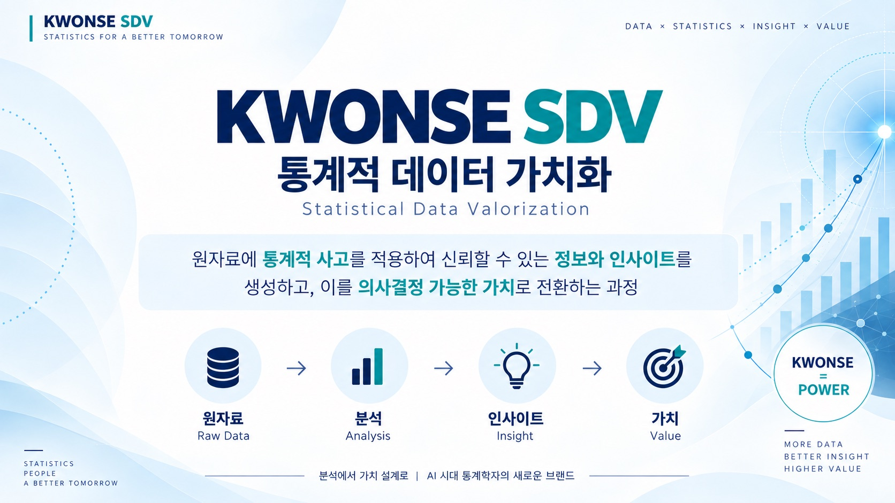
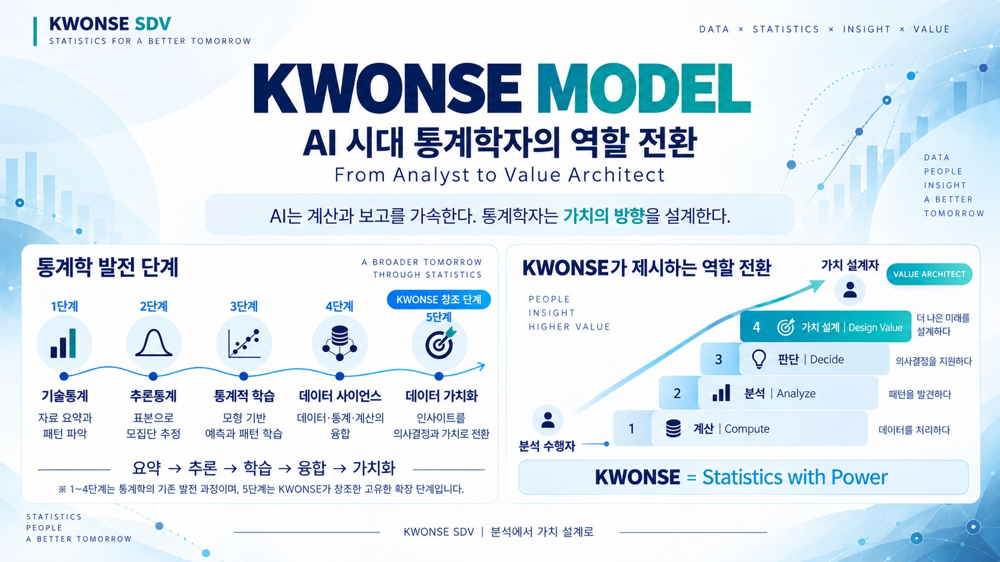

```{=html}
<style>
.about-wrap {
  display: flex;
  flex-direction: column;
  gap: 1.4rem;
}

/* ── 상단 배너 ── */
.about-hero {
  background: linear-gradient(135deg, #1e3a2f 0%, #2e5441 60%, #3a6b52 100%);
  color: #f5f0e8;
  padding: 2rem 2.2rem;
  border-radius: 10px;
  display: flex;
  align-items: center;
  gap: 1.8rem;
}
.about-hero img {
  width: 128px;
  height: 128px;
  object-fit: cover;
  border-radius: 10px;
  box-shadow: 0 4px 16px rgba(0,0,0,0.25);
  flex-shrink: 0;
}
.about-hero-badge {
  display: inline-block;
  font-size: 0.66rem;
  font-weight: 700;
  letter-spacing: 0.8px;
  text-transform: uppercase;
  color: #1e3a2f;
  background: #d4a017;
  padding: 0.22rem 0.65rem;
  border-radius: 20px;
  margin-bottom: 0.5rem;
}
.about-hero-name {
  font-size: 1.5rem;
  font-weight: 800;
  margin: 0 0 0.15rem;
}
.about-hero-title {
  font-size: 0.92rem;
  opacity: 0.85;
  margin: 0 0 0.6rem;
}
.about-hero-quote {
  font-size: 0.86rem;
  font-style: italic;
  border-left: 3px solid #d4a017;
  padding-left: 0.8rem;
  opacity: 0.9;
  line-height: 1.6;
  margin: 0;
}

/* ── 섹션 공통 ── */
.about-section {
  background: #fff;
  border: 1px solid #e8e8e8;
  border-radius: 10px;
  padding: 1.4rem 1.6rem;
}
.about-section-title {
  font-size: 1.05rem;
  font-weight: 800;
  color: #1e3a2f;
  margin: 0 0 0.3rem;
  display: flex;
  align-items: center;
  gap: 0.5rem;
}
.about-section-title .tag {
  font-size: 0.62rem;
  font-weight: 700;
  color: #d4a017;
  background: #1e3a2f;
  padding: 0.15rem 0.55rem;
  border-radius: 10px;
  text-transform: uppercase;
  letter-spacing: 0.5px;
}
.about-section-desc {
  font-size: 0.86rem;
  color: #555;
  line-height: 1.7;
  margin: 0.4rem 0 1rem;
}

/* ── KWONSE 인포그래픽 ── */
.about-kwonse-row {
  display: grid;
  grid-template-columns: 1fr 1fr;
  gap: 1rem;
  margin-bottom: 1.2rem;
}
.about-kwonse-row img {
  width: 100%;
  display: block;
  border-radius: 10px;
  box-shadow: 0 4px 16px rgba(0,0,0,0.1);
}

/* ── 단계 표 ── */
.stage-table {
  width: 100%;
  border-collapse: collapse;
  font-size: 0.82rem;
}
.stage-table th, .stage-table td {
  border: 1px solid #e8e8e8;
  padding: 0.55rem 0.7rem;
  text-align: left;
}
.stage-table th {
  background: #f5f8f6;
  color: #1e3a2f;
  font-weight: 700;
}
.stage-table td.num {
  font-weight: 800;
  color: #d4a017;
  text-align: center;
  width: 2.4rem;
}
.stage-table tr.new-stage td {
  background: #fdf8ec;
}
.stage-table tr.new-stage td.num {
  color: #b8860b;
}

/* ── 경력 타임라인 ── */
.tl-item {
  display: flex;
  gap: 0.8rem;
  margin-bottom: 0.55rem;
  align-items: baseline;
}
.tl-year {
  font-size: 0.78rem;
  font-weight: 700;
  color: #d4a017;
  min-width: 100px;
}
.tl-content {
  font-size: 0.84rem;
  color: #444;
  line-height: 1.5;
}

/* ── 링크 버튼 ── */
.about-links {
  display: flex;
  flex-wrap: wrap;
  gap: 0.7rem;
}
.about-link-btn {
  display: inline-flex;
  align-items: center;
  gap: 0.4rem;
  font-size: 0.82rem;
  font-weight: 700;
  color: #1e3a2f !important;
  background: #f5f8f6;
  border: 1px solid #d8e5de;
  padding: 0.5rem 1rem;
  border-radius: 20px;
  text-decoration: none !important;
  transition: all 0.2s ease;
}
.about-link-btn:hover {
  background: #1e3a2f;
  color: #f5f0e8 !important;
  border-color: #1e3a2f;
}

@media (max-width: 768px) {
  .about-hero { flex-direction: column; text-align: center; }
  .about-hero-quote { border-left: none; border-top: 3px solid #d4a017; padding-left: 0; padding-top: 0.6rem; }
  .about-kwonse-row { grid-template-columns: 1fr; }
}
</style>

<div class="about-wrap">

  <!-- 상단 배너 -->
  <div class="about-hero">
    
    <div>
      <div class="about-hero-badge">권세혁 교수의 통계책방</div>
      <div class="about-hero-name">권세혁</div>
      <div class="about-hero-title">한남대학교 통계학과 명예교수 · KWONSE SDV 창시자</div>
      <p class="about-hero-quote">통계학의 목적은 데이터 분석에서 끝나지 않는다. 신뢰할 수 있는 의사결정과 가치 창출까지 나아가야 한다.</p>
    </div>
  </div>

  <!-- KWONSE SDV 소개 -->
  <div class="about-section">
    <div class="about-section-title">KWONSE SDV란? <span class="tag">Statistical Data Valorization</span></div>
    <p class="about-section-desc">
      KWONSE SDV(통계적 데이터 가치화)는 제가 40년 가까이 통계학을 연구하고 가르쳐온 경험을 바탕으로,
      AI 시대에 통계학자가 나아가야 할 방향을 제시하기 위해 직접 만든 개념입니다.
      전통적인 통계학 발전 과정인 <b>요약(기술통계) → 추론(추론통계) → 학습(통계적 학습) → 융합(데이터 사이언스)</b>의
      4단계에, 제가 새롭게 제안하는 5단계 <b>가치화(Valorization)</b>를 더한 것입니다.
      AI가 계산과 보고를 빠르게 대신해주는 시대일수록, 통계학자는 숫자를 넘어
      &ldquo;이 데이터가 만들어낼 가치의 방향&rdquo;을 설계하는 역할로 나아가야 한다는 것이 핵심 메시지입니다.
    </p>

    <div class="about-kwonse-row">
      <a href="images/kwonse-sdv.jpg" target="_blank" rel="noopener">
        
      </a>
      <a href="images/kwonse-model.jpg" target="_blank" rel="noopener">
        
      </a>
    </div>

    <table class="stage-table">
      <thead>
        <tr><th class="num">단계</th><th>통계학 발전 단계</th><th>설명</th><th>통계학자의 역할</th></tr>
      </thead>
      <tbody>
        <tr><td class="num">1</td><td>기술통계 (요약)</td><td>자료 요약과 패턴 파악</td><td>계산 (Compute) — 데이터를 처리하다</td></tr>
        <tr><td class="num">2</td><td>추론통계 (추론)</td><td>표본으로 모집단 추정</td><td>분석 (Analyze) — 패턴을 발견하다</td></tr>
        <tr><td class="num">3</td><td>통계적 학습 (학습)</td><td>모형 기반 예측과 패턴 학습</td><td>판단 (Decide) — 의사결정을 지원하다</td></tr>
        <tr><td class="num">4</td><td>데이터 사이언스 (융합)</td><td>데이터·통계·계산의 융합</td><td>&nbsp;</td></tr>
        <tr class="new-stage"><td class="num">5</td><td>데이터 가치화 (가치화)</td><td>인사이트를 의사결정과 가치로 전환</td><td>가치 설계 (Design Value) — 더 나은 미래를 설계하다</td></tr>
      </tbody>
    </table>
  </div>

  <!-- 학력 & 경력 -->
  <div class="about-section">
    <div class="about-section-title">학력 &amp; 경력</div>
    <div class="tl-item">
      <span class="tl-year">1979–1985</span>
      <span class="tl-content">성균관대학교 통계학 학사·석사</span>
    </div>
    <div class="tl-item">
      <span class="tl-year">1986–1992</span>
      <span class="tl-content">North Carolina State University 통계학 박사</span>
    </div>
    <div class="tl-item">
      <span class="tl-year">1993–1995</span>
      <span class="tl-content">한국전자통신연구원(ETRI) 선임연구원</span>
    </div>
    <div class="tl-item">
      <span class="tl-year">1995–2026</span>
      <span class="tl-content">한남대학교 통계학과 교수</span>
    </div>
    <div class="tl-item">
      <span class="tl-year">2026–현재</span>
      <span class="tl-content" style="font-weight:700; color:#1e3a2f;">한남대학교 창의융합학부 명예교수 · KWONSE SDV 제안</span>
    </div>
  </div>

  <!-- 채널 -->
  <div class="about-section">
    <div class="about-section-title">채널</div>
    <p class="about-section-desc" style="margin-bottom:0.8rem;">
      강의노트와 통계 에세이 외에도 아래 채널에서 통계 이야기를 이어가고 있습니다.
    </p>
    <div class="about-links">
      <a class="about-link-btn" href="https://www.youtube.com/@wolfpack61kwon" target="_blank" rel="noopener">▶ 유튜브</a>
      <a class="about-link-btn" href="https://wolfpack61.tistory.com/" target="_blank" rel="noopener">📚 티스토리 e책방</a>
      <a class="about-link-btn" href="stat_assay/index.qmd">📝 통계, 다르게 읽기</a>
      <a class="about-link-btn" href="index.qmd">🏠 홈으로</a>
    </div>
  </div>

</div>
```
