## MLDL 사례분석 (차원축소)

::: {.callout-note}
## 실습 전체 흐름

이 노트북 코드는 차원축소와 비지도 표현학습을 하나의 흐름으로 실습하기 위해 구성되었다.

| 단계 | 내용 | 핵심 관점 |
|------|------|------|
| **① 데이터 준비** | MNIST 로드·전처리·시각화 | 입력 $X \in \mathbb{R}^{n \times 784}$ 구성 |
| **② PCA** | 주성분 재구성 실습 | 선형 차원축소: $Z = XW$, $\hat{X} = ZW^{\top}$ |
| **③ Autoencoder** | Dense AE·Conv AE 재구성 실습 | 비선형 병목 구조 |
| **④ VAE** | 확률적 표현·샘플링 실습 | ELBO 최대화, 잠재공간 정규화 |

각 단계는 "저차원 표현을 만들고 다시 원자료를 복원한다"는 공통 관점을 유지하면서, 선형 방법과 신경망 기반 방법의 차이를 비교하도록 설계되었다.
:::

### 데이터 & 전처리

이 셀은 차원축소와 표현학습 실습에 필요한 계산 환경을 준비하는 셀이다. NumPy와 Matplotlib은 배열 연산과 시각화를 위한 기본 도구이며, scikit-learn의 PCA는 선형 차원축소를 구현하기 위한 도구이다. TensorFlow와 Keras는 오토인코더 및 VAE 같은 신경망 기반 표현모형을 학습하기 위한 프레임워크이다. 실험의 재현성을 위해 난수 시드를 고정하는 설정이며, 실행 환경 확인을 위해 TensorFlow 버전을 출력하는 구성이다.

#### 기본 설정 및 공통 import

```python
import numpy as np
import matplotlib.pyplot as plt

from sklearn.decomposition import PCA
from sklearn.metrics import mean_squared_error, mean_absolute_error

import tensorflow as tf
from tensorflow import keras
from tensorflow.keras import layers

np.random.seed(42)
tf.random.set_seed(42)

print("TensorFlow:", tf.__version__)
```

#### 데이터 로드 및 전처리

::: {.callout-note}
## MNIST 전처리 절차

- MNIST는 28×28 흑백 이미지이므로 입력은 원래 2차원 격자 형태이다.
- 학습 안정성을 위해 픽셀 값을 0~255 → 0~1 범위로 정규화한다.
- 검증셋을 훈련 데이터에서 분리하여 과적합 여부를 확인한다.
- PCA와 Dense 기반 모델을 위해 28×28을 784차원 벡터로 펼쳐 $X \in \mathbb{R}^{n \times 784}$ 형태로 만든다.
:::

```python
# MNIST 로드
(x_train, y_train), (x_test, y_test) = keras.datasets.mnist.load_data()

# [0,1] 정규화
x_train = x_train.astype("float32") / 255.0
x_test  = x_test.astype("float32") / 255.0

# 검증셋 분리
n_val = 10000
x_val, y_val = x_train[-n_val:], y_train[-n_val:]
x_train_sub, y_train_sub = x_train[:-n_val], y_train[:-n_val]

# PCA 및 Dense AE를 위한 벡터화
x_train_flat = x_train_sub.reshape(len(x_train_sub), -1)
x_val_flat   = x_val.reshape(len(x_val), -1)
x_test_flat  = x_test.reshape(len(x_test), -1)

print("Train:", x_train_sub.shape, "Val:", x_val.shape, "Test:", x_test.shape)
print("Flat dim:", x_train_flat.shape[1])
```

#### 원본 데이터 보기

#### 시각화 및 평가 함수

이 셀은 실습 전반에서 반복되는 시각화와 평가를 함수로 묶어 두는 셀이다. 여러 장 이미지를 한 줄로 보여주는 함수와, 원본 이미지와 재구성 이미지를 위아래로 나란히 비교하는 함수가 포함된다. 재구성 품질을 정량화하기 위해 MSE와 MAE를 계산하는 함수가 포함된다. 이 셀은 이후 PCA, AE, VAE 실험에서 결과를 동일한 기준으로 비교하게 하는 기반이다.

```python
def show_images_grid(images, n=10, title=""):
    plt.figure(figsize=(n, 1.6))
    for i in range(n):
        ax = plt.subplot(1, n, i+1)
        ax.imshow(images[i], cmap="gray")
        ax.axis("off")
    plt.suptitle(title)
    plt.tight_layout()
    plt.show()

def show_reconstructions(x_orig, x_recon, n=10, title=""):
    plt.figure(figsize=(n, 3.0))
    for i in range(n):
        ax = plt.subplot(2, n, i+1)
        ax.imshow(x_orig[i], cmap="gray")
        ax.axis("off")
        ax = plt.subplot(2, n, i+1+n)
        ax.imshow(x_recon[i], cmap="gray")
        ax.axis("off")
    plt.suptitle(title)
    plt.tight_layout()
    plt.show()

def recon_metrics(x_true_flat, x_pred_flat, prefix=""):
    mse = mean_squared_error(x_true_flat, x_pred_flat)
    mae = mean_absolute_error(x_true_flat, x_pred_flat)
    print(f"{prefix}MSE: {mse:.6f}  MAE: {mae:.6f}")
    return mse, mae
```

### PCA 차원축소

::: {.callout-important}
## PCA 재구성의 핵심 관계

$$Z = XW \quad \text{(투영)}, \qquad \hat{X} = ZW^{\top} = XWW^{\top} \quad \text{(복원)}$$

PCA는 중심화된 데이터 $X$를 주성분 축 $W$로 투영해 저차원 점수 $Z$를 만들고, 다시 원공간으로 복원하는 방식이다. 주성분 개수 $k$가 커질수록 $\hat{X}$가 $X$에 가까워지고 재구성 오차가 감소한다.
:::

#### PCA 재구성 실습

이 셀은 PCA를 적합하여 누적 설명분산 곡선을 확인하고, 서로 다른 $k$에서 재구성 결과가 어떻게 달라지는지 시각화하는 셀이다. 훈련 데이터에 PCA를 적합한 뒤, 테스트 샘플을 $k$차원으로 변환하고 다시 역변환하여 재구성 이미지를 얻는다.

```python
# PCA는 중심화가 기본적으로 적용된다
# 표준화(분산 스케일링)는 여기서는 생략하고, 이미지 픽셀 자체로 진행한다

pca_full = PCA(n_components=200, random_state=42)
pca_full.fit(x_train_flat)

explained = pca_full.explained_variance_ratio_
cum_explained = np.cumsum(explained)

plt.figure(figsize=(6,4))
plt.plot(cum_explained)
plt.xlabel("Number of components")
plt.ylabel("Cumulative explained variance ratio")
plt.title("PCA cumulative explained variance")
plt.grid(True)
plt.show()

# 다양한 k에서 재구성 비교
k_list = [2, 10, 30, 50, 100]
idx = np.random.choice(len(x_test_flat), size=10, replace=False)
x_sample = x_test_flat[idx]
x_sample_img = x_test[idx]

for k in k_list:
    pca = PCA(n_components=k, random_state=42)
    pca.fit(x_train_flat)

    z = pca.transform(x_sample)
    x_hat = pca.inverse_transform(z)

    x_hat_img = x_hat.reshape(-1, 28, 28)
    show_reconstructions(x_sample_img, x_hat_img, n=10, title=f"PCA reconstruction, k={k}")
    recon_metrics(x_sample, x_hat, prefix=f"[PCA k={k}] ")
```

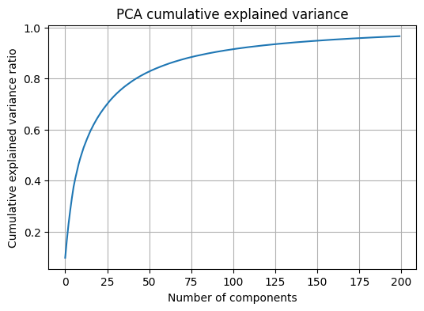{fig-align="center" width="60%"}

::: {.callout-tip}
## PCA 재구성 결과 해석: $k$에 따른 변화

이 그림은 PCA로 MNIST 이미지를 $k$개의 주성분만 남겨서 저차원으로 압축했다가 다시 복원했을 때 재구성이 어떻게 달라지는지를 보여준다. 윗줄은 원본, 아랫줄은 PCA 재구성 이미지이다.

| 주성분 수 | 재구성 품질 | 이유 |
|------|------|------|
| **k=2** | 윤곽·밝기만 남음, 여러 숫자가 뭉개짐 | 784차원을 2차원으로 극단 압축 → 변동 표현 매우 제한적 |
| **k=10** | 윤곽 분명해짐, 디테일 아직 흐릿 | 큰 구조는 상위 몇 개 성분에서 설명되지만 세부는 더 많은 성분 필요 |
| **k=100** | 원본과 매우 유사, 흐림 크게 줄어듦 | 주요 변동 + 상당한 디테일까지 포함됨 |

**핵심 메시지**: "상위 몇 개 주성분이 큰 구조를 잡고, 나머지 성분이 디테일을 채운다"는 분산 설명 관점과 재구성 관점이 연결된다.
:::

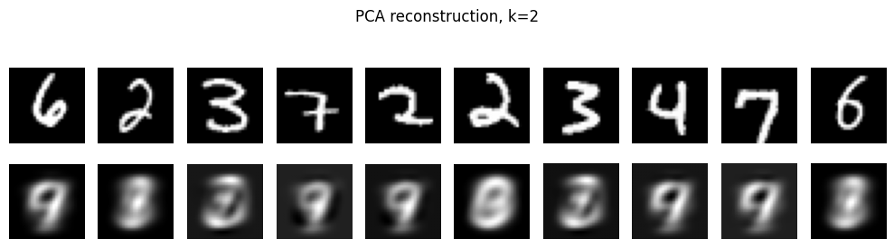{fig-align="center" width="60%"}

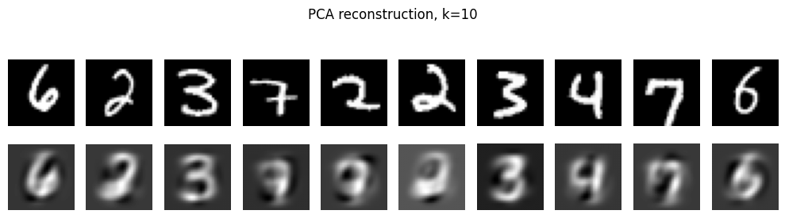{fig-align="center" width="60%"}

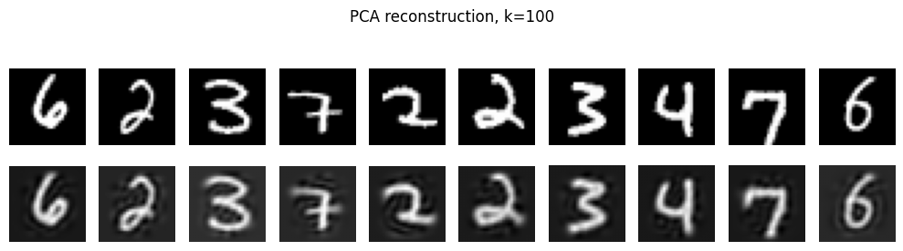{fig-align="center" width="60%"}

#### PCA 차원 $k$에 따른 재구성 오차 곡선

이 셀은 여러 $k$ 값에 대해 재구성 MSE를 계산하여 곡선으로 나타내는 셀이다. $k$가 증가할수록 재구성 오차가 단조 감소하는 경향이 나타나며, 어느 지점 이후에는 감소 폭이 완만해지는 형태가 나타난다. 이 완만해지는 구간은 재구성 관점에서 추가 성분의 효용이 줄어드는 구간으로 해석할 수 있다.

```python
k_grid = [2, 5, 10, 20, 30, 50, 75, 100, 150, 200]
mse_list = []

# 테스트 전체에서 비교하면 시간이 늘어나므로 일부 샘플로 평가한다
m = 5000
x_eval = x_test_flat[:m]

for k in k_grid:
    pca = PCA(n_components=k, random_state=42)
    pca.fit(x_train_flat)
    x_hat = pca.inverse_transform(pca.transform(x_eval))
    mse = mean_squared_error(x_eval, x_hat)
    mse_list.append(mse)

plt.figure(figsize=(6,4))
plt.plot(k_grid, mse_list, marker="o")
plt.xlabel("k (number of components)")
plt.ylabel("Reconstruction MSE")
plt.title("PCA reconstruction error vs k")
plt.grid(True)
plt.show()
```

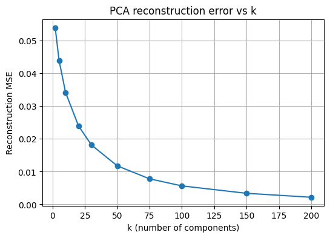{fig-align="center" width="60%"}

#### 공분산 PCA vs 상관 PCA 비교

이 셀은 표준화 여부가 PCA 결과에 미치는 영향을 확인하는 셀이다. 공분산 PCA는 원자료 $X$에서 공분산 구조를 기반으로 주성분을 찾는 방식이며, 상관 PCA는 각 변수(각 픽셀)를 표준화하여 분산을 1로 맞춘 뒤 상관 구조를 기반으로 주성분을 찾는 방식이다.

구현은 `StandardScaler`로 표준화한 데이터에서 PCA를 수행하고, 재구성 후 다시 원 스케일로 역변환하여 MSE를 비교하는 방식이다.

::: {.callout-tip}
## MNIST에서의 공분산 vs 상관 PCA 해석

MNIST는 모든 변수가 같은 단위의 픽셀 강도이므로 표준화 효과가 다른 테이블러 데이터만큼 크지 않을 수 있다. 그러나 원리적으로는 **스케일이 다른 변수가 혼재하는 데이터**에서는 상관 PCA가 주성분 방향을 크게 바꿀 수 있다. 이 실험은 해당 원리를 MNIST로 직접 확인하는 데 목적이 있다.
:::

```python
from sklearn.preprocessing import StandardScaler

# 상관 PCA를 위한 표준화기(픽셀별 z-score)
scaler = StandardScaler(with_mean=True, with_std=True)
x_train_std = scaler.fit_transform(x_train_flat)
x_test_std  = scaler.transform(x_test_flat)

# 비교용: 동일한 k_grid에서 공분산 PCA(원본) vs 상관 PCA(표준화 후)
k_grid = [2, 5, 10, 20, 30, 50, 75, 100, 150, 200]

m = 5000
x_eval = x_test_flat[:m]
x_eval_std = x_test_std[:m]

mse_cov_list = []
mse_cor_list = []

for k in k_grid:
    # 공분산 PCA
    pca_cov = PCA(n_components=k, random_state=42)
    pca_cov.fit(x_train_flat)
    x_hat_cov = pca_cov.inverse_transform(pca_cov.transform(x_eval))
    mse_cov_list.append(mean_squared_error(x_eval, x_hat_cov))

    # 상관 PCA = 표준화 후 PCA, 복원 후 원래 스케일로 역변환
    pca_cor = PCA(n_components=k, random_state=42)
    pca_cor.fit(x_train_std)
    x_hat_std = pca_cor.inverse_transform(pca_cor.transform(x_eval_std))
    x_hat_cor = scaler.inverse_transform(x_hat_std)
    mse_cor_list.append(mean_squared_error(x_eval, x_hat_cor))

plt.figure(figsize=(6,4))
plt.plot(k_grid, mse_cov_list, marker="o", label="Covariance PCA")
plt.plot(k_grid, mse_cor_list, marker="o", label="Correlation PCA")
plt.xlabel("k (number of components)")
plt.ylabel("Reconstruction MSE")
plt.title("Covariance PCA vs Correlation PCA (MNIST)")
plt.grid(True)
plt.legend()
plt.show()

# 대표 k에서 재구성 비교(이미지)
k_show = 30
idx = np.random.choice(len(x_test_flat), size=10, replace=False)
x_sample = x_test_flat[idx]
x_sample_img = x_test[idx]

# 공분산 PCA 재구성
pca_cov = PCA(n_components=k_show, random_state=42).fit(x_train_flat)
x_hat_cov = pca_cov.inverse_transform(pca_cov.transform(x_sample))

# 상관 PCA 재구성
pca_cor = PCA(n_components=k_show, random_state=42).fit(x_train_std)
x_hat_std = pca_cor.inverse_transform(pca_cor.transform(scaler.transform(x_sample)))
x_hat_cor = scaler.inverse_transform(x_hat_std)

show_reconstructions(
    x_sample_img, x_hat_cov.reshape(-1, 28, 28),
    n=10, title=f"Covariance PCA reconstruction, k={k_show}"
)
recon_metrics(x_sample, x_hat_cov, prefix=f"[Cov PCA k={k_show}] ")

show_reconstructions(
    x_sample_img, x_hat_cor.reshape(-1, 28, 28),
    n=10, title=f"Correlation PCA reconstruction, k={k_show}"
)
recon_metrics(x_sample, x_hat_cor, prefix=f"[Cor PCA k={k_show}] ")
```

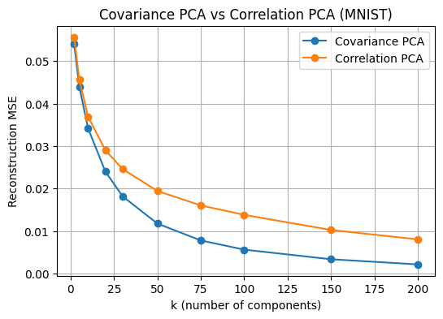{fig-align="center" width="60%"}

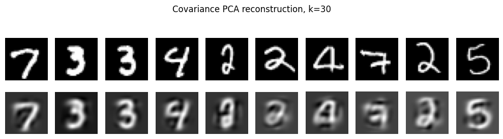{fig-align="center" width="60%"}

[Cov PCA k=30] MSE: 0.020638  MAE: 0.077749

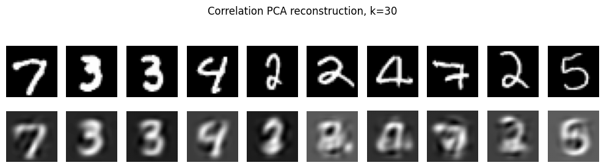{fig-align="center" width="60%"}

[Cor PCA k=30] MSE: 0.027271  MAE: 0.088686

### 오토인코더 차원축소

::: {.callout-note}
## Autoencoder 재구성 구조

오토인코더는 인코더 $z = f_{\phi}(x)$와 디코더 $\hat{x} = g_{\theta}(z)$로 구성되며, 재구성 손실 $\ell(x, \hat{x})$을 최소화하여 잠재표현 $z$를 학습한다. 병목 구조를 통해 $k < p$인 잠재차원에서 정보를 압축하게 하는 점이 차원축소와 대응된다.
:::

#### Dense Autoencoder 모델 정의 및 학습

이 셀은 784차원 벡터 입력을 32차원 잠재벡터로 압축한 뒤 다시 784차원으로 복원하는 Dense AE를 학습하는 셀이다. Dense 층으로 인코더와 디코더를 구성하고, 손실함수로 MSE를 사용하여 $x$와 $\hat{x}$의 차이를 최소화한다. `EarlyStopping`은 검증 손실이 개선되지 않을 때 학습을 중단하고 최적 가중치로 되돌리는 방식이며, 과적합을 줄이는 실용적 장치이다.

```python
input_dim = 28 * 28
latent_dim = 32

def build_dense_ae(input_dim=784, latent_dim=32):
    inp = keras.Input(shape=(input_dim,))
    x = layers.Dense(256, activation="relu")(inp)
    x = layers.Dense(64, activation="relu")(x)
    z = layers.Dense(latent_dim, name="latent")(x)

    x = layers.Dense(64, activation="relu")(z)
    x = layers.Dense(256, activation="relu")(x)
    out = layers.Dense(input_dim, activation="sigmoid")(x)

    ae = keras.Model(inp, out, name="dense_ae")
    encoder = keras.Model(inp, z, name="encoder")
    return ae, encoder

ae, encoder = build_dense_ae(input_dim, latent_dim)
ae.compile(optimizer=keras.optimizers.Adam(1e-3), loss="mse")

es = keras.callbacks.EarlyStopping(monitor="val_loss", patience=3, restore_best_weights=True)

history = ae.fit(
    x_train_flat, x_train_flat,
    validation_data=(x_val_flat, x_val_flat),
    epochs=20,
    batch_size=256,
    callbacks=[es],
    verbose=1
)

plt.figure(figsize=(6,4))
plt.plot(history.history["loss"], label="train")
plt.plot(history.history["val_loss"], label="val")
plt.xlabel("Epoch")
plt.ylabel("MSE loss")
plt.title("AE training curve")
plt.legend()
plt.grid(True)
plt.show()
```

::: {.callout-tip}
## AE 학습 곡선 해석 포인트

| 관찰 | 의미 |
|------|------|
| **에폭 0~3 구간 급격한 하강** | 모델이 입력 이미지의 큰 구조를 빠르게 학습 중 — 정상 신호 |
| **이후 완만한 감소·수렴** | 학습이 점차 수렴 중, 약 10 에폭 이후 추가 학습의 이득이 크지 않음 |
| **train과 val이 거의 겹침** | 과적합이 뚜렷하지 않음 — 과적합 시 train만 계속 하강, val은 정체·증가 |
| **val이 train보다 약간 낮거나 비슷** | 배치 구성의 우연한 차이, 훈련 과정의 변동성으로 인한 자연스러운 현상 |
:::

(생략)
Epoch 20/20
196/196 - 4s 22ms/step - loss: 0.0082 - val_loss: 0.0083

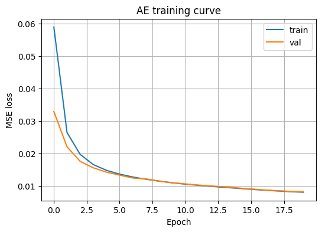{fig-align="center" width="60%"}

#### Dense AE 재구성 시각화 및 평가 지표

이 셀은 학습된 AE로 테스트 이미지를 재구성하고, 원본과 재구성을 비교하며 MSE·MAE를 계산하는 셀이다. 테스트 일부를 예측하여 $\hat{x}$를 만든 뒤 이미지를 28×28로 reshape하여 시각화한다. PCA와 비교할 때 비선형 AE는 더 복잡한 변환을 학습할 수 있으므로 같은 잠재차원에서도 재구성이 더 좋아질 수 있다는 점을 관찰하는 셀이다.

```python
# 재구성
x_hat_test = ae.predict(x_test_flat[:200], verbose=0)
recon_metrics(x_test_flat[:200], x_hat_test, prefix="[AE] ")

# 이미지로 보기
x_orig_img = x_test[:10]
x_hat_img = x_hat_test[:10].reshape(-1, 28, 28)
show_reconstructions(x_orig_img, x_hat_img, n=10, title=f"AE reconstruction, latent_dim={latent_dim}")

# 잠재공간 간단 확인(라벨은 시각화용으로만 사용)
z_test = encoder.predict(x_test_flat[:3000], verbose=0)
print("Latent shape:", z_test.shape)
```

::: {.callout-note}
## Dense AE 재구성 결과 해석 ($k=32$)

- **전반적으로 잘 복원**: $k=32$라는 병목에서도 숫자의 핵심 구조(윤곽, 획의 배치)를 충분히 담아낸 상태이다.
- **약간의 흐림·두꺼워짐**: 재구성 손실(MSE) 최소화 과정에서 픽셀 단위로 "평균적인" 복원이 유리해지는 성질이 반영된 결과이다. 세밀한 고주파 디테일보다 큰 구조를 우선 보존하는 방향으로 학습된 상태이다.
- **숫자별 난이도 차이**: '0', '1'처럼 획이 단순한 숫자는 복원이 특히 안정적이다. '9', '5'처럼 곡선과 교차가 복합적인 숫자는 작은 왜곡이나 흐림이 더 나타나기 쉽다.
:::

[AE] MSE: 0.008012  MAE: 0.028769

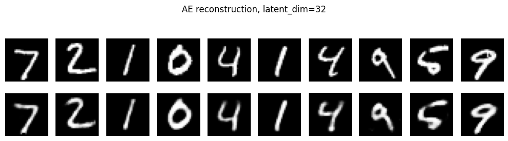{fig-align="center" width="60%"}

#### Dense VAE 모델 정의 및 학습

::: {.callout-important}
## VAE의 구조: AE와의 핵심 차이

| 요소 | Dense AE | VAE |
|------|:---:|:---:|
| **인코더 출력** | 점 $z$ | 평균 $z_{\text{mean}}$과 로그분산 $z_{\text{logvar}}$ |
| **샘플링** | 없음 | 재파라미터화 기법: $z = z_{\text{mean}} + e^{0.5 z_{\text{logvar}}} \cdot \epsilon$ |
| **학습 목표** | 재구성 손실 최소화 | ELBO 최대화 = 재구성 항 + KL 항 |
| **KL 항 역할** | 없음 | $q_\phi(z\mid x)$가 사전분포 $p(z) = \mathcal{N}(0,I)$와 가깝도록 정규화 |
| **샘플링 가능 여부** | 불가 | 가능 ($z \sim \mathcal{N}(0,I)$에서 생성) |

KL 항은 단순히 재구성만 잘하는 표현이 아니라, **잠재공간이 정리되어 임의의 $z \sim \mathcal{N}(0,I)$에서 샘플링이 가능해지는 표현**을 학습하게 만드는 핵심 장치이다.
:::

```python
latent_dim_vae = 2  # 2로 두면 잠재공간 시각화가 가능하다

class Sampling(layers.Layer):
    def call(self, inputs):
        z_mean, z_logvar = inputs
        eps = tf.random.normal(shape=tf.shape(z_mean))
        return z_mean + tf.exp(0.5 * z_logvar) * eps

def build_vae(input_dim=784, latent_dim=2):
    # Encoder
    inp = keras.Input(shape=(input_dim,))
    x = layers.Dense(256, activation="relu")(inp)
    x = layers.Dense(64, activation="relu")(x)
    z_mean = layers.Dense(latent_dim, name="z_mean")(x)
    z_logvar = layers.Dense(latent_dim, name="z_logvar")(x)
    z = Sampling()([z_mean, z_logvar])
    encoder = keras.Model(inp, [z_mean, z_logvar, z], name="vae_encoder")

    # Decoder
    z_in = keras.Input(shape=(latent_dim,))
    x = layers.Dense(64, activation="relu")(z_in)
    x = layers.Dense(256, activation="relu")(x)
    out = layers.Dense(input_dim, activation="sigmoid")(x)
    decoder = keras.Model(z_in, out, name="vae_decoder")

    return encoder, decoder

encoder_vae, decoder_vae = build_vae(input_dim, latent_dim_vae)

def get_x(data):
    # data가 (x,) 또는 (x,y) 형태로 들어올 수도 있고, 그냥 x 텐서로 들어올 수도 있음
    if isinstance(data, (tuple, list)):
        return data[0]
    return data

class VAE(keras.Model):
    def __init__(self, encoder, decoder, **kwargs):
        super().__init__(**kwargs)
        self.encoder = encoder
        self.decoder = decoder
        self.total_loss_tracker = keras.metrics.Mean(name="loss")
        self.recon_loss_tracker = keras.metrics.Mean(name="recon_loss")
        self.kl_loss_tracker = keras.metrics.Mean(name="kl_loss")

    @property
    def metrics(self):
        return [self.total_loss_tracker, self.recon_loss_tracker, self.kl_loss_tracker]

    def train_step(self, data):
        x = get_x(data)  # 핵심 수정이다
        with tf.GradientTape() as tape:
            z_mean, z_logvar, z = self.encoder(x, training=True)
            x_hat = self.decoder(z, training=True)

            # (batch, 784) -> 샘플별 합
            bce = keras.backend.binary_crossentropy(x, x_hat)   # (batch, 784)
            recon = tf.reduce_sum(bce, axis=1)                  # (batch,)

            kl = -0.5 * tf.reduce_sum(
                1 + z_logvar - tf.square(z_mean) - tf.exp(z_logvar),
                axis=1
            )  # (batch,)

            loss = tf.reduce_mean(recon + kl)

        grads = tape.gradient(loss, self.trainable_weights)
        self.optimizer.apply_gradients(zip(grads, self.trainable_weights))

        self.total_loss_tracker.update_state(loss)
        self.recon_loss_tracker.update_state(tf.reduce_mean(recon))
        self.kl_loss_tracker.update_state(tf.reduce_mean(kl))
        return {m.name: m.result() for m in self.metrics}

    def test_step(self, data):
        x = get_x(data)  # 핵심 수정이다
        z_mean, z_logvar, z = self.encoder(x, training=False)
        x_hat = self.decoder(z, training=False)

        bce = keras.backend.binary_crossentropy(x, x_hat)
        recon = tf.reduce_sum(bce, axis=1)

        kl = -0.5 * tf.reduce_sum(
            1 + z_logvar - tf.square(z_mean) - tf.exp(z_logvar),
            axis=1
        )

        loss = tf.reduce_mean(recon + kl)

        self.total_loss_tracker.update_state(loss)
        self.recon_loss_tracker.update_state(tf.reduce_mean(recon))
        self.kl_loss_tracker.update_state(tf.reduce_mean(kl))
        return {m.name: m.result() for m in self.metrics}

vae = VAE(encoder_vae, decoder_vae)
vae.compile(optimizer=keras.optimizers.Adam(1e-3))

history_vae = vae.fit(
    x_train_flat,
    validation_data=(x_val_flat,),  # 이 형태 그대로 사용 가능이다
    epochs=20,
    batch_size=256,
    verbose=1
)

plt.figure(figsize=(6,4))
plt.plot(history_vae.history["loss"], label="train")
plt.plot(history_vae.history["val_loss"], label="val")
plt.xlabel("Epoch")
plt.ylabel("Negative ELBO (approx.)")
plt.title("VAE training curve")
plt.legend()
plt.grid(True)
plt.show()
```

Epoch 20/20
196/196 - 6s 32ms/step - kl_loss: 5.9151 - loss: 150.5069 - recon_loss: 144.5918 - val_kl_loss: 6.0038 - val_loss: 150.1220 - val_recon_loss: 144.1183

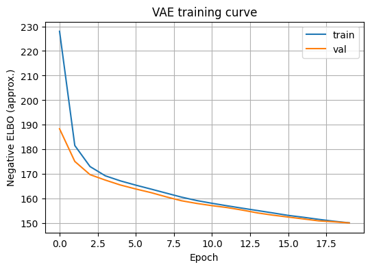{fig-align="center" width="60%"}

#### VAE 잠재공간 시각화와 샘플링

```python
# 잠재공간 시각화(라벨은 시각화용)
z_mean, z_logvar, z = encoder_vae.predict(x_test_flat[:5000], verbose=0)

plt.figure(figsize=(6,5))
plt.scatter(z_mean[:,0], z_mean[:,1], s=6, c=y_test[:5000], cmap="tab10")
plt.colorbar()
plt.xlabel("z1")
plt.ylabel("z2")
plt.title("VAE latent space (means), colored by label for visualization")
plt.grid(True)
plt.show()

# 잠재공간 보간 예시
i, j = 0, 1
za = z_mean[i]
zb = z_mean[j]
ts = np.linspace(0, 1, 10)
z_interp = np.array([(1-t)*za + t*zb for t in ts])
x_gen = decoder_vae.predict(z_interp, verbose=0).reshape(-1, 28, 28)
show_images_grid(x_gen, n=10, title="VAE interpolation in latent space")

# 사전분포에서 샘플링하여 생성
z_samples = np.random.normal(size=(10, latent_dim_vae))
x_samples = decoder_vae.predict(z_samples, verbose=0).reshape(-1, 28, 28)
show_images_grid(x_samples, n=10, title="VAE sampling from N(0, I)")
```

::: {.callout-tip}
## VAE 잠재공간 시각화 해석 ($z_{\text{mean}}$ 산점도)

이 그림은 VAE가 MNIST 각 이미지를 2차원 잠재변수 $z = (z_1, z_2)$로 압축했을 때 각 이미지의 잠재분포 평균을 좌표평면에 찍은 산점도이다. 색은 시각화 목적으로만 덧칠한 정답 라벨이다.

| 관찰 | 해석 |
|------|------|
| **군집이 보임** | VAE가 숫자 이미지의 형태적 유사성을 보존하는 저차원 표현을 학습 |
| **군집 간 겹침 존재** | 2차원 병목 + 비지도 학습의 한계 — 3, 5 / 4, 9처럼 획 구조가 비슷한 숫자는 중심부에서 섞임 |
| **바깥쪽 또렷한 덩어리** | '0', '1'처럼 다른 숫자와 구별되는 특징을 가진 숫자들이 상대적으로 분리된 영역 형성 |
| **연속적 구름 형태** | VAE의 KL 항이 잠재공간을 $\mathcal{N}(0,I)$ 근처로 정리한 결과 → 보간 경로가 자연스러워짐 |

더 또렷한 분리를 원하면: 잠재차원을 2보다 크게 두거나, β-VAE로 KL 가중치를 조절하거나, CVAE처럼 라벨 정보를 결합하는 방식이 선택지이다.
:::

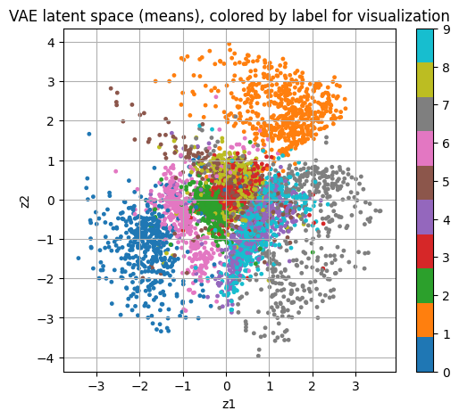{fig-align="center" width="60%"}

::: {.callout-note}
## VAE 잠재공간 보간(Interpolation) 해석

이 그림은 VAE의 잠재공간에서 두 점 $z_a, z_b$ 사이를 선형보간한 $z(t) = (1-t)z_a + tz_b$를 디코더에 넣어 생성한 이미지를 왼쪽에서 오른쪽으로 나열한 결과이다.

- **부드러운 형태 변화**: 잠재공간이 연속적인 공간으로 학습되어, 중간 좌표에서도 그럴듯한 이미지를 생성할 수 있음을 보여준다.
- **"애매한 숫자"가 나타나는 이유**: VAE는 라벨을 맞추는 것이 목표가 아니라 재구성·KL 균형으로 표현을 학습한 모델이므로, 보간 경로는 "숫자 클래스 경계"를 고려하지 않는다.
- **급격한 전이**: 잠재공간이 2차원이라 표현력이 제한되고, 보간 경로가 군집 경계 근처를 지나면 특정 지점에서 빠르게 다른 형태로 전환되는 현상이 나타날 수 있다.
:::

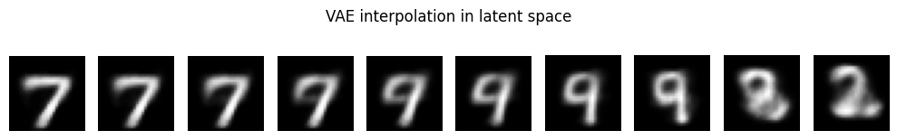{fig-align="center" width="60%"}

::: {.callout-important}
## VAE 샘플링: AE와 VAE의 경계

이 그림은 학습이 끝난 VAE에서 잠재변수 $z$를 사전분포 $p(z) = \mathcal{N}(0,I)$에서 임의로 뽑아, 그 $z$를 디코더에 넣어 새로운 이미지를 생성한 결과이다.

| 현상 | 이유 |
|------|------|
| **샘플링이 된다** | KL 항으로 $q_\phi(z\mid x) \approx \mathcal{N}(0,I)$가 강제되어, $\mathcal{N}(0,I)$에서 뽑은 $z$가 데이터가 존재하는 잠재 영역에 있을 가능성이 큼 |
| **약간 흐릿한 이유** | 재구성 항이 확률적 평균 형태로 학습 + KL 정규화로 "전형적인" 샘플을 내는 방향으로 학습됨 |
| **품질이 들쭉날쭉한 이유** | 2차원 잠재공간의 제한적 표현력 + 뽑힌 $z$가 잠재공간의 밀도 높은 영역에 떨어지느냐에 따라 생성 품질 달라짐 |

**핵심 포인트**: 이것이 오토인코더와 VAE의 경계를 가르는 핵심 특성이다. 학습이 잘 된 VAE에서는 잠재공간에서 임의로 뽑은 $z$가 그럴듯한 이미지로 매핑되는 경향이 나타난다.
:::

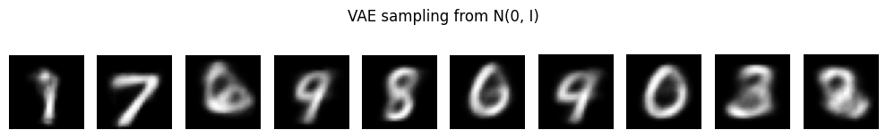{fig-align="center" width="60%"}

#### Conv AE와 Conv VAE 확장

::: {.callout-tip}
## Conv AE: Dense AE와의 차이

| 관점 | Dense AE | Conv AE |
|------|:---:|:---:|
| **입력 형태** | 벡터 $(784,)$ | 이미지 $(28,28,1)$ |
| **인코더 구조** | Dense 층 → 병목 | Conv + MaxPooling → 병목 |
| **디코더 구조** | Dense 층 → 복원 | Conv2DTranspose(업샘플링) → 복원 |
| **공간 구조 반영** | 불가 | 가능 (국소 패턴 학습) |
| **재구성 품질** | 기본적 | 자연스럽게 더 나은 경향 |

Conv VAE는 동일한 확률적 잠재변수 구조를 합성곱 인코더·디코더로 구현한 것이며, 잠재공간 시각화·보간·샘플링의 논리는 Dense VAE와 동일하되 표현력이 더 적합하다.
:::

다음 코드는 학습된 VAE에서 잠재평균 $z_{\text{mean}}$을 2차원 평면에 찍어 데이터 구조를 확인하는 셀이다. 테스트 데이터 일부를 인코더에 통과시켜 $z_{\text{mean}}$을 얻고, 라벨은 시각화 편의를 위한 색상으로만 사용하여 산점도를 그린다.

```python
# Conv AE는 (28,28,1) 입력을 사용한다
x_train_cnn = x_train_sub[..., np.newaxis]
x_val_cnn   = x_val[..., np.newaxis]
x_test_cnn  = x_test[..., np.newaxis]

latent_dim_cae = 32

def build_conv_ae(latent_dim=32):
    inp = keras.Input(shape=(28, 28, 1))

    # Encoder
    x = layers.Conv2D(32, 3, activation="relu", padding="same")(inp)
    x = layers.MaxPooling2D(2, padding="same")(x)            # 14x14
    x = layers.Conv2D(64, 3, activation="relu", padding="same")(x)
    x = layers.MaxPooling2D(2, padding="same")(x)            # 7x7
    x = layers.Flatten()(x)
    z = layers.Dense(latent_dim, name="latent")(x)

    encoder = keras.Model(inp, z, name="conv_encoder")

    # Decoder
    z_in = keras.Input(shape=(latent_dim,))
    x = layers.Dense(7 * 7 * 64, activation="relu")(z_in)
    x = layers.Reshape((7, 7, 64))(x)
    x = layers.Conv2DTranspose(64, 3, strides=2, activation="relu", padding="same")(x)  # 14x14
    x = layers.Conv2DTranspose(32, 3, strides=2, activation="relu", padding="same")(x)  # 28x28
    out = layers.Conv2D(1, 3, activation="sigmoid", padding="same")(x)

    decoder = keras.Model(z_in, out, name="conv_decoder")

    # Autoencoder end-to-end
    out_img = decoder(encoder(inp))
    ae = keras.Model(inp, out_img, name="conv_ae")
    return ae, encoder, decoder

cae, cae_encoder, cae_decoder = build_conv_ae(latent_dim=latent_dim_cae)
cae.compile(optimizer=keras.optimizers.Adam(1e-3), loss="mse")

es = keras.callbacks.EarlyStopping(monitor="val_loss", patience=3, restore_best_weights=True)

history_cae = cae.fit(
    x_train_cnn, x_train_cnn,
    validation_data=(x_val_cnn, x_val_cnn),
    epochs=20,
    batch_size=256,
    callbacks=[es],
    verbose=1
)

plt.figure(figsize=(6,4))
plt.plot(history_cae.history["loss"], label="train")
plt.plot(history_cae.history["val_loss"], label="val")
plt.xlabel("Epoch")
plt.ylabel("MSE loss")
plt.title("Conv AE training curve")
plt.legend()
plt.grid(True)
plt.show()
```

Epoch 20/20
196/196 - 200s 740ms/step - loss: 0.0036 - val_loss: 0.0038

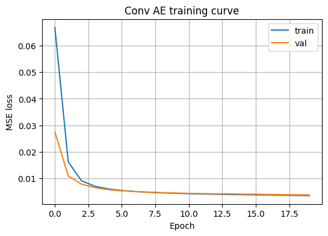{fig-align="center" width="60%"}

#### Conv AE 재구성 시각화 및 평가 지표

```python
# 재구성
x_hat = cae.predict(x_test_cnn[:200], verbose=0)

# flat 지표 계산(기존 함수 재사용)
x_true_flat = x_test_cnn[:200].reshape(200, -1)
x_pred_flat = x_hat.reshape(200, -1)
recon_metrics(x_true_flat, x_pred_flat, prefix="[Conv AE] ")

# 이미지로 보기
show_reconstructions(
    x_test[:10], x_hat[:10].squeeze(-1),
    n=10, title=f"Conv AE reconstruction, latent_dim={latent_dim_cae}"
)

# 잠재표현 shape 확인
z_test = cae_encoder.predict(x_test_cnn[:3000], verbose=0)
print("Latent shape:", z_test.shape)
```

[Conv AE] MSE: 0.003495  MAE: 0.018034

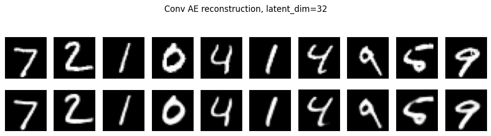{fig-align="center" width="60%"}

::: {.callout-note}
## Dense AE vs Conv AE 성능 비교 ($k=32$)

| 모델 | MSE | MAE | 특징 |
|------|:---:|:---:|------|
| **Dense AE** | 0.008012 | 0.028769 | 빠른 학습, 벡터 입력 |
| **Conv AE** | 0.003495 | 0.018034 | 공간 구조 반영, 재구성 품질 우수 |

Conv AE는 동일한 잠재차원 $k=32$에서 Dense AE 대비 재구성 오차가 약 56% 감소하였다. 이미지처럼 공간 구조가 중요한 데이터에서는 합성곱 기반 구조가 유리하다.
:::
