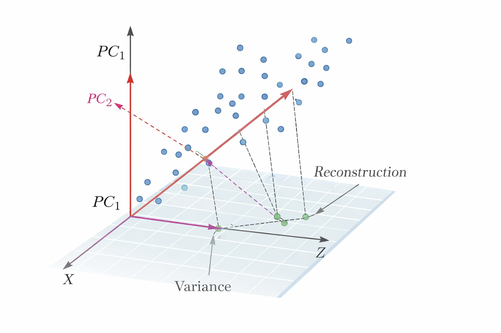

## 통계적 차원축소

### PCA: 분산 최대화와 재구성 관점

주성분분석(PCA)은 고차원 변수 $X \in \mathbb{R}^{n \times p}$를 더 낮은 차원 $Z \in \mathbb{R}^{n \times k}\ (k \ll p)$로 선형 변환하여 데이터의 핵심 변동 구조를 보존하려는 차원축소 방법이다.

::: {.callout-note}
## PCA의 핵심 개념

PCA는 원변수들의 선형결합으로 이루어진 새로운 좌표축을 구성하는 방법이며, 그 좌표축은 데이터의 분산을 가장 잘 설명하는 방향들로 정해진다.

$$Z = XW$$

- $W \in \mathbb{R}^{p \times k}$: 주성분 적재행렬(loading matrix)
- $Z$: 주성분 점수(score) 행렬
- 목적: 정보 손실을 최소화하면서 $p$차원 → $k$차원으로 압축
:::

#### 분산 최대화 관점의 PCA

자료는 보통 중심화(centered)된 형태로 다룬다. 각 변수의 평균을 뺀 중심화 행렬을 여전히 $X$로 표기하면, 공분산 행렬은 $S = \frac{1}{n-1}X^{\top}X$으로 정의된다.

::: {.callout-important}
## 주성분 방향의 순차적 최적화

**첫 번째 주성분** $w_1 \in \mathbb{R}^p$:
$$\max_{\|w_1\|=1} \text{Var}(Xw_1) = \max_{\|w_1\|=1} w_1^{\top}Sw_1$$
해: $S$의 가장 큰 고유값 $\lambda_1$에 대응하는 고유벡터

**두 번째 주성분** $w_2$:
$$\max_{\|w_2\|=1,\; w_2^{\top}w_1=0} w_2^{\top}Sw_2$$
해: $S$의 두 번째로 큰 고유값에 대응하는 고유벡터

**일반화**: $m$번째 주성분 $w_m$은 앞선 주성분들과 직교하면서 분산을 최대화하는 방향이며, 결과적으로 $w_1,\ldots,w_k$는 $S$의 상위 $k$개 고유벡터로 구성된다.
:::

주성분 점수는 $z_{im} = x_i^{\top}w_m,\ i=1,\ldots,n,\ m=1,\ldots,k$로 정의되며, 이를 모으면 $Z = XW$가 된다. 여기서 $W = [w_1,\ldots,w_k]$이다. 각 주성분의 분산은 해당 고유값과 연결되며 $\text{Var}(Xw_m) = \lambda_m$으로 해석된다. 따라서 $\lambda_m$은 $m$번째 주성분이 설명하는 변동의 크기를 나타낸다.

#### 재구성(근사) 관점의 PCA

PCA는 분산을 최대화하는 축을 찾는 문제이면서 동시에 원자료를 저차원으로 가장 잘 근사하는 문제로도 해석된다. $k$차원 표현을 이용하여 원자료 $X$를 $\hat{X} = ZW^{\top} = XWW^{\top}$로 근사한다고 할 때, PCA는 다음의 재구성 오차를 최소화하는 $W$를 제공한다.

$$\min_{W^{\top}W = I_k} \|X - XWW^{\top}\|_F^2$$

여기서 $\|\cdot\|_F$는 Frobenius 놈(행렬 원소 제곱합의 제곱근)이다. 이 관점에서 PCA는 $p$차원 공간에서 데이터를 $k$차원 부분공간으로 투영한 뒤 다시 원공간으로 되돌렸을 때의 오차가 최소가 되도록 하는 최적의 부분공간을 찾는 방법이다. 따라서 $k$가 커질수록 재구성 오차는 감소하며, $k=p$이면 재구성 오차가 0이 된다.

#### 표준화 여부와 공분산 PCA vs 상관 PCA

PCA는 거리와 분산 구조를 기반으로 하는 방법이므로, 변수의 스케일에 매우 민감하다. 예를 들어 어떤 변수는 단위가 매우 커서 분산이 크고, 다른 변수는 단위가 작아 분산이 작은 경우가 흔하다.

::: {.callout-tip icon=false}
## 공분산 PCA vs 상관 PCA 비교

| 구분 | 공분산 PCA | 상관 PCA |
|------|:---:|:---:|
| **입력** | 중심화된 $X$ | 표준화된 $X_s$ (평균 0, 분산 1) |
| **기반 행렬** | 공분산 행렬 $S$ | 상관행렬 $R = \frac{1}{n-1}X_s^{\top}X_s$ |
| **스케일 영향** | 분산이 큰 변수가 주성분 지배 | 모든 변수가 동등하게 기여 |
| **적합한 경우** | 변수들이 동일 단위이거나 분산 차이가 의미 있을 때 | 단위가 서로 다르거나 상관 구조 자체가 목적일 때 |
| **실무 기본값** | 덜 사용됨 | **기본 선택** (단위 혼재 시 권장) |
:::

#### 차원 선택 $k$의 기준: 설명분산, 스크리 플롯, CV

PCA에서 핵심 실무 의사결정은 $k$, 즉 몇 개의 주성분을 남길지를 정하는 문제이다. $S$의 고유값을 $\lambda_1 \geq \lambda_2 \geq \cdots \geq \lambda_p$라 하면, $m$번째 주성분의 설명분산 비율은

$$\text{PVE}_m = \frac{\lambda_m}{\sum_{j=1}^{p}\lambda_j}$$

누적 설명분산 비율은

$$\text{CPVE}(k) = \frac{\sum_{m=1}^{k}\lambda_m}{\sum_{j=1}^{p}\lambda_j}$$

::: {.callout-tip}
## $k$ 선택 방법 세 가지 비교

| 방법 | 기준 | 장점 | 한계 |
|------|------|------|------|
| **설명분산 비율** | CPVE(k) ≥ 80% (또는 90%) | 직관적, 널리 사용 | "설명분산 큼 ≠ 예측에 유리함" |
| **스크리 플롯** | 고유값 꺾임(elbow) 지점 | 시각적으로 이해 쉬움 | 꺾임 지점 판단이 주관적 |
| **교차검증(CV)** | 검증셋 성능 또는 재구성 오차 최소 | 다운스트림 목적 반영 | 계산 비용, 데이터 누수 주의 |

CV 기반 선택 시 **반드시 훈련 데이터에서만 $W_k$를 추정**하고 검증 데이터에는 같은 변환을 적용해야 한다. 이를 어기면 데이터 누수가 발생한다.
:::

#### 행렬 표현 $Z = XW$와 해석 요소

PCA 결과를 행렬로 정리하면 $Z = XW$가 핵심이다. $W$의 각 열 $w_m$은 $m$번째 주성분의 적재벡터이며, 각 성분의 크기와 부호는 원변수들이 그 주성분에 어떻게 기여하는지를 나타낸다. $Z$의 각 열은 주성분 점수이며, 각 관측치가 해당 주성분 축에서 어디에 위치하는지를 나타내는 좌표이다. 따라서 해석은 보통 $W$를 통해 "축의 의미"를 설명하고, $Z$를 통해 "관측치의 위치와 군집"을 설명하는 방식으로 이루어진다.

::: {.callout-note}
## PCA 핵심 정리

- PCA는 **분산을 최대화하는 최적 선형 축**을 제공하는 동시에, 원자료를 저차원 부분공간으로 **가장 잘 근사**하는 최적화 해석을 갖는다.
- **표준화 여부**는 분석 결과를 크게 바꾸는 핵심 선택이다.
- 차원 선택 $k$는 설명분산과 스크리 플롯의 직관을 활용하되, 목적에 따라 교차검증 기반 선택으로 보완하는 것이 타당하다.
:::

#### 기하학적 해석

이 그림은 PCA가 고차원 데이터 $X$를 더 낮은 차원 $Z$로 바꾸는 과정을 기하적으로 보여준다. 파란 점들은 원래 공간에서의 관측치들이며, 이 관측치들이 가장 많이 퍼져 있는 방향을 찾으면 그 방향이 첫 번째 주성분 $PC_1$이 된다.

{fig-align="center" width="60%"}

$PC_1$은 데이터 분산이 최대가 되는 축이므로, 점구름을 가장 잘 "펴서" 설명하는 방향이다. $PC_2$는 $PC_1$과 직교하면서 남아 있는 변동을 가장 크게 설명하는 두 번째 축이다.

점에서 아래의 평면으로 내려가는 점선은 각 관측치를 주성분 부분공간으로 직교 투영(projection)하는 과정을 나타내며, 투영된 위치들이 저차원 표현 $Z$가 된다.

즉 $Z = XW$에서 $W$는 $PC_1$, $PC_2$ 방향 벡터를 모아 만든 행렬이고, 각 관측치는 그 축들 위에서의 좌표값으로 요약된다. 그림의 "Reconstruction" 표시는 저차원 표현 $Z$로부터 다시 원공간으로 되돌려 근사 $\hat{X} = ZW^{\top}$를 만드는 개념을 나타내며, 이때 원점과의 차이가 재구성 오차로 해석된다.

---

### 요인분석(FA): 공통요인과 고유요인

요인분석은 다변량 관측변수 $X$의 공분산 구조를 소수의 잠재변수로 설명하려는 통계적 차원축소 방법이다.

::: {.callout-note}
## PCA와 요인분석의 근본적 차이

| 관점 | PCA | 요인분석(FA) |
|------|:---:|:---:|
| **목적** | 관측 분산을 최대 보존 | 공통 원인(잠재요인)을 추정 |
| **확률모형** | 없음 (대수적 절차) | 명시적 확률모형 전제 |
| **오차 처리** | 재구성 오차 (근사 관점) | 변수별 고유오차 $\psi_j$ 명시 추정 |
| **해의 유일성** | 유일 ($S$의 고유분해) | 비유일 (회전 불변) |
| **초점** | 분산 보존·재구성 정확도 | 공통요인에 의한 구조적 설명 |
:::

PCA가 관측자료의 분산을 최대한 보존하는 선형축을 구성하는 방법이라면, 요인분석은 관측변수들 사이의 상관을 만들어내는 공통 원인을 잠재요인으로 가정하고 그 구조를 추정하는 방법이다.

#### 요인모형의 기본 형태

관측치가 $n$개이고 변수가 $p$개인 자료를 $X \in \mathbb{R}^{n \times p}$로 두며, 한 관측치를 열벡터로 표현하면 $x \in \mathbb{R}^p$이다.

::: {.callout-important}
## 요인분석의 표준 모형

$$x = \Lambda f + \varepsilon$$

| 기호 | 의미 |
|------|------|
| $f \in \mathbb{R}^q$ | $q$차원의 잠재요인(공통요인), $q \ll p$ |
| $\Lambda \in \mathbb{R}^{p \times q}$ | 적재행렬(loading matrix) |
| $\varepsilon \in \mathbb{R}^p$ | 고유오차(특수요인) |

**핵심 가정**:
$$\mathbb{E}(f)=0,\; \text{Cov}(f)=I_q,\quad \mathbb{E}(\varepsilon)=0,\; \text{Cov}(\varepsilon)=\Psi,\quad \text{Cov}(f,\varepsilon)=0$$

여기서 $\Psi = \text{diag}(\psi_1,\ldots,\psi_p)$는 대각행렬로, 변수별 고유오차는 서로 상관이 없다.

**공분산 분해 (핵심 결과)**:
$$\Sigma = \text{Cov}(x) = \Lambda\Lambda^{\top} + \Psi$$

$\Lambda\Lambda^{\top}$는 공통요인이 만들어내는 공분산 구조이고, $\Psi$는 변수별 고유분산을 모은 부분이다.
:::

#### 공통성, 고유성, 요인적재의 해석

요인분석에서는 각 변수 $x_j$의 분산이 공통요인이 설명하는 부분과 고유오차가 설명하는 부분으로 분해된다.

$$\text{Var}(x_j) = \underbrace{\sum_{m=1}^{q}\lambda_{jm}^2}_{h_j^2 \text{ (공통성)}} + \underbrace{\psi_j}_{\text{고유성}}$$

::: {.callout-note}
## 요인분석의 주요 해석 요소

| 개념 | 정의 | 해석 |
|------|------|------|
| **공통성 (Communality)** | $h_j^2 = \sum_{m=1}^{q}\lambda_{jm}^2$ | 변수 $x_j$의 분산 중 공통요인이 설명하는 비중 |
| **고유성 (Uniqueness)** | $\psi_j = \text{Var}(\varepsilon_j)$ | 변수 $x_j$에만 남는 고유 분산 |
| **요인적재 (Loading)** | $\lambda_{jm}$ | 요인 $f_m$이 변수 $x_j$에 미치는 영향의 크기 |

요인적재의 해석은 보통 **회전 이후의 패턴**을 중심으로 이루어진다. 요인의 부호와 회전 방식에 따라 적재행렬의 표현이 여러 형태로 나타날 수 있기 때문이다.
:::

#### 식별 문제와 회전

요인분석에는 식별 문제가 존재한다. 그 이유는 $\Lambda f$에서 $\Lambda$와 $f$를 동시에 바꾸어도 $\Lambda f$가 동일하게 유지되는 변환이 존재하기 때문이다. 예를 들어 $q \times q$ 직교행렬 $T$에 대해 $\Lambda f = (\Lambda T)(T^{\top}f)$가 성립한다.

따라서 $\Lambda$ 자체는 유일하지 않으며, 같은 $\Sigma = \Lambda\Lambda^{\top} + \Psi$를 만드는 $\Lambda$가 여러 개 존재할 수 있다.

::: {.callout-tip}
## 회전(Rotation)의 목적

회전은 **적합도를 바꾸지 않고** 해석의 단순성을 높이는 절차이다.

| 유형 | 대표 방법 | 특징 |
|------|:---:|------|
| **직교회전** | Varimax | 요인 간 상관 = 0, 해석 단순 |
| **사각회전 (Oblique)** | Promax, Oblimin | 요인 간 상관 허용, 더 유연한 구조 |

실무에서는 요인들이 실제로 독립이라고 보기 어려운 경우 사각회전이 더 현실적인 선택이다.
:::

#### 추정과 요인 수 선택

요인분석의 추정은 대개 표본 공분산 $S$를 관측된 공분산으로 보고, $\Sigma = \Lambda\Lambda^{\top} + \Psi$가 $S$에 가깝도록 $\Lambda, \Psi$를 추정하는 방식이다.

- **최대우도추정**: 정규성 가정 하에서 로그우도를 최대화하여 $\Lambda, \Psi$ 추정
- **주축요인법(Principal Axis Factoring)**: 반복적으로 공통성 추정을 갱신하며 계산

::: {.callout-caution}
## 요인 수 $q$ 선택 시 주의사항

- **$q$가 너무 작으면**: 공통구조를 충분히 설명하지 못함
- **$q$가 너무 크면**: 해석이 복잡해지고 과적합적 구조가 생길 위험

실무 기준: 적합도 지표, 잔차 공분산의 크기, 요인해석의 안정성을 종합해 결정한다.
:::

#### 요인점수와 주성분 점수

::: {.callout-note}
## 요인점수 vs 주성분 점수 비교

| 구분 | 주성분 점수 | 요인점수 |
|------|:---:|:---:|
| **계산** | $Z = XW$로 유일하게 계산 | $\hat{F} = XA$ (여러 방식 존재) |
| **유일성** | 유일 | 회귀법·Bartlett·Thomson 등 방법에 따라 상이 |
| **의미** | 총분산 최대 보존 좌표 | 공통요인 수준의 추정치 |
| **재구성** | $\hat{X} = ZW^{\top}$의 오차 최소화 | "공통구조를 대표하는 잠재특성의 정도" |
:::

요인점수는 단순히 연속형 점수로만 사용되지 않는다. 실무에서는 적재 패턴을 이용해 관측변수들을 요인별로 배타적으로 묶고, 그 그룹의 평균을 요인 수준의 대용치로 사용하는 방식도 함께 활용된다.

요인 $m$에 대해 적재값 $\lambda_{jm}$이 큰 변수들로 그룹 $G_m$을 구성하고, 관측치 $i$에 대해 그 묶음에 속한 변수들의 표준화 값 평균을 계산한다.

$$s_{im} = \frac{1}{|G_m|}\sum_{j \in G_m}x_{ij}^*$$

경우에 따라 적재값을 가중치로 사용하여

$$s_{im} = \frac{\sum_{j \in G_m}\lambda_{jm}x_{ij}^*}{\sum_{j \in G_m}|\lambda_{jm}|}$$

처럼 계산하는 방식도 사용된다. 여기서 $x_{ij}^*$는 표준화된 관측값이다.

이 방식은 요인점수 추정치를 직접 산출하지 않더라도 해석 가능한 요인별 지표를 쉽게 만들 수 있다는 장점이 있다. 다만 교차적재가 큰 변수들이 존재하면 배타적 그룹화가 임의적이 될 수 있고, 요인모형이 내포하는 $\Psi$나 추정오차를 충분히 반영하지 못할 수 있다는 한계도 있다.

---

### 선형 판별 기반 축소: LDA는 '차원축소'인가?

선형판별분석(LDA)은 분류 문제에서 집단 간 분리를 극대화하는 선형 변환을 찾는 방법이다. LDA는 결과적으로 원변수 $X \in \mathbb{R}^{n \times p}$를 더 낮은 차원 $Z \in \mathbb{R}^{n \times k}$로 바꾸는 형태를 가지므로 차원축소처럼 보인다.

::: {.callout-warning}
## LDA를 "차원축소"로 보는 올바른 관점

LDA는 비지도 차원축소인 PCA와 달리, 반응변수 $y$의 클래스 정보를 사용하여 "분류에 유리한 방향"을 찾는 **지도 학습 기반의 표현학습**이다.

"차원을 줄이는 연산이 존재하는가"가 아니라, **"무엇을 보존하기 위해 줄이는가"** 의 관점에서 LDA를 이해해야 한다.
:::

#### LDA의 핵심 목적과 변환 형태

클래스가 $K$개인 분류 문제에서, $y \in \{1,\ldots,K\}$이고 설명변수 벡터가 $x \in \mathbb{R}^p$인 상황을 고려한다. LDA는 각 클래스의 평균벡터를 $\mu_k$, 공통 공분산을 $\Sigma$로 가정하는 정규모형 기반 분류 규칙으로도 이해되지만, 여기서는 선형 변환 관점이 핵심이다.

LDA는 선형 투영 $z = W^{\top}x$의 형태로 $p$차원을 $k$차원으로 줄이는 변환을 구성하며, $W \in \mathbb{R}^{p \times k}$의 열벡터들이 판별축(discriminant directions)이다. 이 축 위에서 클래스들이 가장 잘 분리되도록 $W$를 선택한다.

#### 산포행렬과 "분리 최대화" 기준

::: {.callout-important}
## LDA의 최적화 문제: 클래스 내 분산 ↓, 클래스 간 분산 ↑

**클래스 내 산포행렬 (Within-class scatter)**:
$$S_W = \sum_{k=1}^{K}\sum_{i \in C_k}(x_i - \mu_k)(x_i - \mu_k)^{\top}$$

**클래스 간 산포행렬 (Between-class scatter)**:
$$S_B = \sum_{k=1}^{K}n_k(\mu_k - \mu)(\mu_k - \mu)^{\top}$$

**최적화 기준 (Rayleigh Quotient)**:
$$\max_{w \neq 0}\frac{w^{\top}S_B w}{w^{\top}S_W w}$$

다차원 축 $W = [w_1,\ldots,w_k]$의 경우 일반화 고유값 문제 $S_B w = \lambda S_W w$를 풀어 해를 얻는다.
:::

#### LDA가 줄일 수 있는 최대 차원

::: {.callout-warning}
## LDA의 구조적 한계: 최대 $(K-1)$차원

LDA는 원칙적으로 $K$개의 클래스를 최대 $(K-1)$차원 공간에서만 완전히 분리할 수 있다. 이유는 $S_B$의 랭크가 최대 $(K-1)$이기 때문이다.

$$k \leq \min(p,\ K-1)$$

예) 클래스가 3개이면 최대 **2개**의 판별축만 의미가 있다.

이 때문에 LDA는 "항상 $p$에서 원하는 임의의 $k$로 줄이는 일반적 차원축소"라기보다, "클래스 수가 허용하는 범위 안에서 분류에 필요한 좌표로 바꾸는 축소"라는 성격이 강하다.
:::

#### PCA와의 차이와 차원축소로서의 위치

::: {.callout-tip icon=false}
## PCA vs LDA 비교

| 관점 | PCA | LDA |
|------|:---:|:---:|
| **학습 방식** | 비지도 | 지도 (클래스 레이블 사용) |
| **목적** | 총분산 최대 보존 | 클래스 간 분리 최대화 |
| **투영 행렬** | $S$의 고유벡터 | $S_W^{-1}S_B$의 고유벡터 |
| **최대 차원** | $\min(n,p)$ | $K-1$ |
| **해석** | 데이터 구조 탐색 | 분류에 최적화된 특징 |
| **전처리로 사용** | 일반 목적 | 분류 목적 특화 |
:::

따라서 LDA를 차원축소라고 부를 수 있는 이유는 "실제로 $z = W^{\top}x$ 형태의 저차원 표현을 만든다"는 점이다. 그러나 LDA를 PCA와 같은 의미의 차원축소로 부르기 어려운 이유는 "보존 대상이 분산이 아니라 분류 정보"라는 점이다. 즉 LDA는 차원축소이되, **분류 목적의 지도 표현학습에 속하는 차원축소**이다.

#### 수치적 문제와 정규화의 필요성

LDA에서 핵심 계산은 $S_W^{-1}$ 또는 그에 준하는 선형시스템 풀이이다. $p$가 크고 $n$이 작으면 $S_W$가 특이해질 수 있으며, 이 경우 고전적 LDA는 계산이 불가능하거나 불안정해진다.

이 문제를 해결하기 위해 **정규화 LDA**가 사용된다.

$$S_W(\gamma) = (1-\gamma)S_W + \gamma I$$

클래스 내 산포행렬을 단위행렬 방향으로 수축시키는 이 방식은 릿지와 유사한 안정화 효과를 주며, 고차원에서의 판별축 추정을 가능하게 만든다. 또한 실제 파이프라인에서는 먼저 PCA로 차원을 줄여 $S_W$의 특이성을 완화한 뒤 LDA를 적용하는 **PCA+LDA 조합**이 자주 사용된다.

#### 언제 LDA를 "차원축소"로 사용하는가

::: {.callout-tip}
## LDA를 차원축소로 활용하기 적합한 상황

1. **클래스 구조가 분명하고** 저차원 투영에서 분리도가 크게 개선되는 상황
2. **시각화 목적**: $K-1$차원의 판별공간을 이용해 클래스 간 분리를 직관적으로 보여줄 때
3. **다운스트림 분류기의 입력**: LDA의 출력 $Z$는 분류에 최적화된 특징이므로, 단순한 분산 보존 기반 축소보다 분류 성능에 유리할 수 있다

반면 반응변수가 없거나, 분류가 아닌 탐색·시각화·밀도 추정이 목적이라면 PCA가 더 적합하다.
:::

#### 정리

::: {.callout-important}
## LDA의 위치: 지도 차원축소

LDA는 클래스 정보를 이용하여 클래스 간 분산을 크게 하고 클래스 내 분산을 작게 만드는 선형 투영을 찾는 방법이다. $z = W^{\top}x$ 형태의 저차원 표현을 제공하므로 차원축소의 기능을 수행한다.

그러나 LDA는 비지도 차원축소가 아니라 **지도 학습 기반의 판별 표현학습**이며, 얻을 수 있는 축의 수가 최대 $(K-1)$로 제한된다는 점에서 PCA와 성격이 다르다.

**결론**: LDA는 분류 목적의 지도 차원축소라는 의미에서 차원축소로 분류되는 방법이다.
:::
