## 실험설계 기초

::: {.callout-note icon=false}
## 정의
**실험 설계(Experimental Design)**는 기록된 반응을 바탕으로 처리나 집단 간 비교가 가능하도록 연구의 틀을 마련하는 과정이다. **분산분석(ANOVA)**은 만들어진 데이터를 어떻게 해석할지에 관한 단계이다.
:::

실험설계는 데이터를 어떻게 만들지에 관한 단계이고, 분산분석(ANOVA)은 만들어진 데이터를 어떻게 해석할지에 관한 단계다. 실험설계에서 처리(treatment) 구조, 반복(replication), 무작위화(randomization), 블록화(blocking) 같은 요소를 미리 결정하면, 그 결과 데이터는 분산분석 모형에 자연스럽게 들어갈 수 있는 형태로 구성된다.

### 개념

실험 설계는 기록된 반응을 바탕으로 치료나 집단 간 비교가 가능하도록 연구의 틀을 마련하는 과정이다. 연구는 자연 상태에서의 관찰처럼 환경을 방해하지 않고 수행될 수도 있고, 실험실처럼 요인을 인위적으로 통제하는 방식으로 이루어질 수도 있다.

예를 들어, 학교 유형별 2학년 읽기 점수 차이는 자연 관찰 연구에 해당하지만, 온도와 습도가 진드기 수명 주기에 미치는 영향은 통제가 가능한 실험실에서 연구된다. 따라서 실험의 유용성을 위해서는 조건 통제와 현실성 사이의 균형이 필요하다.

### 실험설계 용어

**절대실험과 비교실험**

절대실험은 관심 있는 대상의 현재 상태나 특성을 파악하기 위해 요인을 조작하지 않고 관찰이나 조사를 통해 정보를 얻는 방식이다. 반면 비교실험은 관심 있는 현상에 영향을 미칠 수 있는 요인을 변화시키고, 그에 따른 반응의 변화를 분석하는 실험이다. 분산분석(ANOVA)은 이러한 비교실험을 분석하는 대표적인 방법이다.

**설계된 실험 (designed experiment)**

설계된 실험이란 미리 정해진 틀 안에서 집단을 관찰·측정·평가하는 연구를 뜻한다. 연구자는 실험 중 해당 틀의 요소들을 통제하여, 관심 있는 집단 간에 타당한 비교가 가능하도록 데이터를 수집한다. 이러한 통제를 통해 통계적 추론이 가능해진다.

**요인 (factors)**

물고기 사료 (기존 사료A, 새로 개발된 사료=B)와 수온 온도(20도, 25도)에 따른 몸무게 증가 효과를 보기 위하여 어항 4개, 물고기 12마리를 랜덤하게 선택하여, 각 어항에 3마리 물고기 배정 후, (사료×온도) 어항 넣은 후 2주 후에 몸무게를 측정하였다.

- 사료 종류 -- A-기존사료, B-새로운 사료 (2수준)
- 수온 -- 20도, 25도 (2수준)

사료 종류와 수온은 연구자가 통제하는 요인이다. 반응변수는 물고기 몸무게(g)이며, 이는 측정값(measurement)으로 기록되지만 연구자가 통제하지는 않는다.

**처리 (treatments) 및 설계 형태**

처리는 요인의 수준을 조합하여 구성된다. 위 실험에서는 2수준(사료) × 2수준(수온) = 4개의 처리가 가능하다.

- 만약 요인이 하나만 있다면, 이는 일원배치(one-way classification)이다.
- 두 요인을 모두 고려하면 요인배치 설계(factorial treatment design)가 되며, 분산분석(ANOVA)을 통해 비료 효과, 관개 효과, 그리고 두 요인의 상호작용 효과까지 평가할 수 있다.

**대조 처리 (control treatment)**

대조 처리는 다른 처리들의 효과를 비교하는 기준이 되는 특별한 처리 유형이다. 대조 처리가 특히 중요한 경우는 세 가지다.

첫째, 실험 조건이 일반적으로 효과적인 처리라도 그 효과를 보여주기 어렵게 만드는 경우이다. '질소를 전혀 주지 않는' 대조 처리를 포함하면, 토양 자체의 높은 비옥도가 드러나고, 대조 처리의 효과가 질소 처리와 비슷하다는 점이 확인될 수 있다.

둘째, 기존에 잘 확립된 표준 방법과 새로운 방법들을 비교하는 경우다.

셋째, 플라세보(placebo) 대조다. 이는 피실험자가 실험 중 단순히 처치 과정을 받는 것만으로 반응을 보일 수 있는 경우에 사용된다.

**실험 단위 (experimental unit)**

실험 단위는 처리를 무작위로 할당받는 물리적 개체, 혹은 처리 집단 중 하나에서 무작위로 선택된 실험 대상이다. 예를 들어, 물고기 몸무게 실험에서는 "어항"이 실험 단위이다.

**반복 (replication)**

처리가 한 실험 단위에 할당되면 이를 해당 처리의 한 번의 반복이라고 한다. 일반적으로는 각 처리를 여러 실험 단위에 무작위로 배정하여, 각 처리에 대해 여러 번의 반복을 수행한다.

**실험 오차 (experimental error)**

실험 오차란, 동일한 처리를 받고 동일한 실험 조건에서 관측된 실험 단위들 간 반응의 변동을 말한다. 실험 오차가 0이 되지 않는 이유에는 다음이 포함된다.

- (a) 처리를 받기 전부터 존재하는 실험 단위 간의 자연적인 차이
- (b) 측정 장치의 변동(측정 기기 오차)
- (c) 처리 조건을 설정하는 과정에서의 변동
- (d) 처리 요인이 아닌 외부 요인들이 반응 변수에 미치는 영향

**Placebo 효과**

플라세보 효과는 실제로 치료 성분이 없거나 효과가 없는 처치를 받았음에도 불구하고, 환자가 치료를 받았다고 믿기 때문에 증상이 호전되는 현상을 말한다. 이러한 플라세보 효과를 배제하기 위해 이중 블라인드(double blind) 실험을 적용한다.

### 실험오차 제어

실험 오차의 분산이 크면 추론의 정밀성이 크게 떨어진다. 따라서 실험 오차를 줄이는 모든 기법은 더 나은 실험과 더 정밀한 추론으로 이어진다.

**블록화를 통한 실험오차 줄이기**

블록화(blocking)은 실험 단위 집단 내에서 중요한 특성 차이가 클 때, 실험 오차 분산을 줄이는 데 효과적인 방법이다. 반응변수에 영향을 줄 수 있는 특성에 따라 실험 단위를 비슷한 것끼리 묶어 블록을 만들면, 각 블록 내부는 균질해지고 전체적으로는 다양한 특성을 포함할 수 있다.

**공변량을 이용한 변동성 줄이기**

공변량(covariate)은 반응변수와 관련이 있는 변수로, 실험 오차의 변동을 줄이는 데 활용된다. 공변량이 되기 위해서는 세 가지 조건을 만족해야 한다. 첫째, 반응변수와 관계가 있어야 하고, 둘째, 측정이 가능해야 하며, 셋째, 처리에 의해 영향을 받지 않아야 한다.

### 랜덤화와 블록화

#### 랜덤화 (실험단위에 처리배치)

랜덤화는 실험 단위의 배정과 실험 수행 순서를 무작위로 결정하여 실험의 객관성을 보장하는 절차이다. 완전임의배치법(CRD)에서는 이러한 랜덤화를 통해 관심 요인 이외의 기타 원인들이 실험 결과에 영향을 주는 가능성을 최소화한다.

비료 종류(A, B, C)에 따른 벼 수확량의 차이를 알아보기 위하여 실험을 한다고 하자. 반복 수는 각 비료에 대해 4번을 한다면 실험을 위해 총 12곳의 경작지가 필요하다.

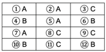{fig-align="center" width="30%"}

#### 블록화

블록화는 실험 단위를 무작위로 배정하기 어려운 상황에서 실험의 정밀도를 높이기 위해 사용하는 방법이다. 성질이 유사한 단위들을 묶어 블록을 구성하면, 각 블록 내부에서는 실험 환경이 균일하게 유지되어 처리 효과를 보다 정확하게 비교할 수 있다.

만약 경작지 아래 개천이 흐른다면 물로부터 거리에 따라 땅의 비옥도의 차이가 있을 것이므로 CRD 방법은 적합하지 않다. 물의 위치에 따라 경작지를 나누고(블록화) 각 블록 내에서 각 비료를 하나씩 임의로 배정하는 실험 계획을 Randomized Block Design이라 한다.

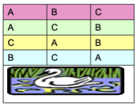{fig-align="center" width="30%"}

### 반복과 반복 측정

반복은 동일한 처리를 서로 다른 독립적인 실험 단위에 적용하는 것을 의미한다. 이렇게 하면 실험 오차를 추정하고 결과의 재현성을 검증할 수 있다.

반복측정은 동일한 실험 단위에서 동일한 조건으로 여러 번 측정하거나 관찰하는 것을 말한다. 같은 실험 단위에서 얻은 값은 통계적으로 독립이 아니므로 실험 오차 추정에 직접 사용되지는 않으며, 보통 평균값을 계산해 분석에 사용한다.

결국 반복은 실험의 신뢰성과 오차 추정을 위한 핵심 설계 요소이고, 반복측정은 측정값의 정밀도를 높이는 보조적 방법이다.

### 반복수 결정

실험에서 반복(replication) 횟수는 처리 평균의 추정 정확도와, 처리 평균 차이에 대한 가설검정의 검정력을 결정하는 핵심 요소이다. 일반적으로 반복 횟수가 많을수록 추정값의 정확도가 높아지고, 신뢰구간이 좁아지며, 가설검정의 검정력도 커진다.

#### 처리평균 신뢰수준 활용방법

처리 평균에 대한 $100(1-\alpha)\%$ 신뢰구간의 폭이 원하는 수준이 되도록 반복 횟수를 결정할 수 있다.

$$r = \frac{(z_{\frac{\alpha}{2}})^{2}{\widehat{\sigma}}^{2}}{E^{2}}$$

여기서 $z_{\frac{\alpha}{2}}$: 신뢰수준 $100(1-\alpha)\%$에 해당하는 표준정규분포 임계값(95% 신뢰수준, 1.96 사용), $\widehat{\sigma}$은 실험 표준편차, $E$는 추정값의 허용 오차(precision)이다.

과거 수확량 범위: 40~70 파운드이고 표준편차 추정치: $\widehat{\sigma} = \frac{70 - 40}{4} = 7.5$, 신뢰수준: 95%, 원하는 정밀도(허용 오차): $E = 4$ 파운드일 때,

$$r = \frac{(1.96)^{2}(7.5)^{2}}{(4)^{2}} = 13.51$$

결론적으로 각 처리 수준별로 14회 반복을 수행해야 원하는 정밀도를 달성할 수 있다.

#### F 검정의 검정력을 이용한 반복 수 결정

t개의 처리가 있는 실험에서 반복 수를 결정할 때, 연구 목표 중 하나는 다음 가설을 검정하는 것이다.

$$H_{0}:\mu_{1} = \mu_{2} = \cdots = \mu_{t}$$

F 통계량은 $F = \frac{MST}{MSE}$로 계산되며, 비중심 F 분포를 이용해 제2종 오류 확률 β(λ)를 계산하며, 비중심성 모수 λ는

$$\lambda = \frac{r\sum_{i = 1}^{t}(\mu_{i} - \overline{\mu})^{2}}{\sigma^{2}}$$

이고, 평균 차이가 D 이상인 최소 경우에는 $\lambda = \frac{rD^{2}}{2\sigma^{2}}$로 단순화된다.

연구자가 4가지 질소 비료 처리 수준에 따른 피칸(pecan) 수확량을 비교하는 실험에서 처리 개수 t = 4, 표준편차 추정치 $\widehat{\sigma} = 7.5$, 효과 크기 D = 15일 때,

$$\phi = \frac{\sqrt{r}D}{\sqrt{2t}\widehat{\sigma}} = 0.707\sqrt{r}$$

파워 곡선 표를 이용하여 시도-오류(trial & error) 방식으로 r 값을 찾는다.

- r=6 → φ=1.73, ν₂=20 → 파워=0.75 (부족)
- r=10 → φ=2.24, ν₂=36 → 파워=0.96 (충분하지만 여유 있음)
- r=9 → φ=2.12, ν₂=32 → 파워=0.93 (목표 충족)

따라서, r=9가 적절한 반복 수로 결정된다. 이는 총 36개의 실험 단위(4처리 × 9반복)가 필요함을 의미한다.

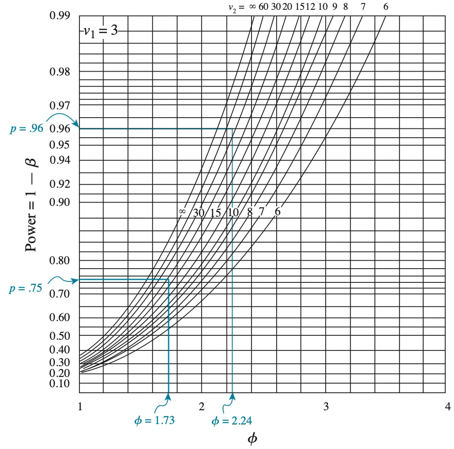{fig-align="center" width="80%"}

## 완전 랜덤화 설계 Completely Randomized Design

### 완전 랜덤화 설계 개념

단일 요인 완전랜덤화 설계(CRD)는 t개의 모집단(처리) 평균 $\mu_{1},\mu_{2},\ldots,\mu_{t}$를 비교하는 데 초점을 맞춘다.

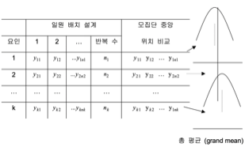{fig-align="center" width="60%"}

#### 모형 및 가정

$$y_{ij} = \mu + \alpha_{i} + e_{ij}, \quad e_{ij} \sim N(0,\sigma^{2})$$

(가정) 오차항은 독립이며 정규분포를 따르고 분산은 동일하다.

- $i$: 요인A의 수준 첨자 $i = 1,2,...,k$, $k$는 요인의 수준 수
- $j$: $i$-번째 요인의 반복 첨자
- $y_{ij}$: 요인 $\alpha$의 수준 $i$의 처리를 받은 $j$-번째 실험단위 관측치
- $\epsilon_{ij}$: $i$번째 처리의 $j$번째 실험단위에서 발생한 임의 오차
- $n_{i}$: $i$번째 처리의 반복수
- 총 데이터 크기: $\sum\sum n_{ij} = n$

#### 추정

**모수**

- $\mu$: 모집단 총평균
- $\alpha_{i}$: 요인 $\alpha$는 주효과를 나타내는 알파벳으로 실험 처리효과라고도 한다. $i$-번째 수준의 주효과는 $\alpha_{i}$로 표현한다.
- $\mu + \alpha_{i} = \mu_{i}$: 수준 $i$ 모집단 평균
- 모수: $\mu,\mu_{1},\mu_{2},...,\mu_{k}$ ($k + 1$개)

**추정량 (MVUE)**

총평균 점추정치: $\widehat{\mu} = \frac{\sum_{i}\sum_{j}y_{ij}}{n} = \overline{\overline{y}}$

요인 수준 $i$-(모집단)- 평균 점추정치: ${\widehat{\mu}}_{i} = \frac{\sum_{j}^{}y_{ij}}{n_{i}} = \overline{y_{i}}$

OLS(최소자승합) 추정치: $\min_{\mu,A_{i}}\sum\sum(y_{ij} - \widehat{y_{ij}})^{2}$ ⬌ $\widehat{\underset{¯}{\beta}} = (X'X)^{- 1}X'\underset{¯}{y}$

요인 $A$의 수준 3개, 반복 2인 데이터의 모형은 다음과 같다.

$$\left\lbrack \begin{array}{r}
y_{11} \\
y_{12} \\
y_{21} \\
y_{22} \\
y_{31} \\
y_{32}
\end{array} \right\rbrack = \begin{bmatrix}
1 & 1 & 0 & 0 \\
1 & 1 & 0 & 0 \\
1 & 0 & 1 & 0 \\
1 & 0 & 1 & 0 \\
1 & 0 & 0 & 1 \\
1 & 0 & 0 & 1
\end{bmatrix}\left\lbrack \begin{array}{r}
\mu \\
A_{1} \\
A_{2} \\
A_{3}
\end{array} \right\rbrack + \left\lbrack \begin{array}{r}
e_{11} \\
e_{12} \\
e_{21} \\
e_{22} \\
e_{31} \\
e_{32}
\end{array} \right\rbrack \quad \Leftrightarrow \quad \underset{¯}{y} = X\underset{¯}{\beta} + \underset{¯}{e}$$

모수($\underset{¯}{\beta}$)는 3개이나 $rank(X) = 3$이므로 모수 4개를 모두($\mu,\alpha_{1},\alpha_{2},\alpha_{3}$) 추정할 수 없다. 하여, $\sum\mu_{i} = 0$ 가정 하에 모수를 추정한다.

#### 검정가설

$$H_{0}:\mu_{1} = \mu_{2} = \ldots = \mu_{t} \quad \Leftrightarrow \quad H_{0}:\alpha_{1} = \alpha_{2} = \ldots = \alpha_{t} = 0$$

$$H_{a}:\text{적어도 하나의 }\mu_{i}\text{가 다르다} \quad \Leftrightarrow \quad H_{a}:\text{적어도 하나의 }\tau_{i} \neq 0$$

#### 총변동, 요인 변동, 오차변동

**변동분해**

총변동(③) = 집단간 변동(②) + 집단내 변동(①)

- ③ 반응변수의 총변동(SST): $SST = \sum_{i}\sum_{j}(y_{ij} - \overline{\overline{y}})^{2}$
- ② 요인(집단간, 설명) 변동: $SSB = \sum_{i}\sum_{j}({\overline{y}}_{i} - \overline{\overline{y}})^{2}$
- ① 오차(집단내) 변동: $SSE = \sum_{i}\sum_{j}(y_{ij} - {\overline{y}}_{i})^{2}$

**평균변동 Mean Sum of Squares**

- 총변동($SST$)의 자유도: $(n - 1)$
- 요인변동($SSB$)의 자유도: $(k - 1)$
- 오차변동($SSE$)의 자유도: $(n - k)$
- 평균 요인변동: $MSB = \frac{SSB}{k - 1}$
- 평균오차변동: $MSE = \frac{SSE}{n - k}$

**분산분석표**

- 귀무가설: 요인 수준별 평균은 동일하다. $H_{0}:\mu_{1} = \mu_{2} = ... = \mu_{k}$
- 대립가설: 적어도 하나의 집단 평균은 다르다.

| 요인 | 자승합 (Sum of Squares) | 자유도 (df) | 평균자승합 (Mean Squares) | F-통계량 |
|------|:----------------------:|:-----------:|:------------------------:|:-------:|
| 집단간 변동 (Between) | $SSB = \sum_{i}\sum_{j}({\overline{y}}_{i} - \overline{\overline{y}})^{2}$ | $k-1$ | $MSB = \frac{SSB}{k-1}$ | $F = \frac{MSB}{MSE}$ |
| 오차변동 (Error) | $SSE = \sum_{i}\sum_{j}(y_{ij} - {\overline{y}}_{i})^{2}$ | $n-k$ | $MSE = \frac{SSE}{n-k}$ | $\sim F(k-1, n-k)$ |
| 수정총합 (Corrected Total) | $SST = \sum_{i}\sum_{j}(y_{ij} - \overline{\overline{y}})^{2}$ | $n-1$ | | |

: 분산분석표 {.striped}

검정통계량: $TS = \frac{SSB/(k - 1)}{SSE/(n - k)} \sim F(1,n - 2) = t(n - 2)^{2}$, 분자의 자유도가 1인 F-분포는 $t$-분포의 제곱과 동일하다.

#### 변동의 분포

오차의 가정 $e_{ij} \sim N(0,\sigma^{2})$으로부터 $y_{ij} \sim N(\mu + \alpha_{i},\sigma^{2})$이므로 다음이 증명된다.

$$\frac{SSB}{\sigma^{2}} \sim \chi^{2}(k - 1), \quad \frac{SSE}{\sigma^{2}} \sim \chi^{2}(n - k)$$

오차 분산의 추정치: $\widehat{\sigma^{2}} = MSE$

**변동비의 분포**

$$TS = \frac{SSB/(k - 1)}{SSE/(n - k)} \sim F(k - 1,n - k)$$

**평균변동 기대값**

$$E(MSE) = \sigma^{2}, \quad E(MSB) = \sigma^{2} + \frac{\sum n_{i}(\mu_{i} - \mu)^{2}}{k - 1}$$

만약 모든 집단의 평균이 동일하다면 $(\mu_{i} - \mu) = 0$이므로 $E(MSE) = E(MSB)$가 된다.

### 사후 검정 (Post-hoc test)

#### 개념

분산분석에서의 F-검정에서 귀무가설이 기각되면, 적어도 하나의 집단 평균이 다른 집단과 차이가 있다는 사실은 알 수 있지만, 구체적으로 어떤 집단이 서로 다른지를 파악할 수는 없다. 이러한 구체적인 차이를 확인하기 위해서는 사후 검정(Post-hoc test) 또는 다중 비교(Multiple Comparison) 절차가 필요하다.

다중 비교에서는 여러 개의 가설을 동시에 검정하므로 유의수준을 조정해야 한다. 조정된 실험 유의수준은 $1 - (1 - \alpha)^{c}$이다. 여기서 $c$는 가설 수를 의미한다.

#### 선형 대비 (Linear Contrast)

선형 대비는 $t$개의 모집단 평균 $\mu_{1} = \mu_{2} = ... = \mu_{t}$사이의 특정 비교를 나타내는 선형 결합 형태로, 계수들의 합이 0이 되도록 설정한다.

$$l = \sum_{i}a_{i}\mu_{i} = a_{1}\mu_{1} + a_{2}\mu_{2} + ... + a_{t}\mu_{t}, \quad \sum_{i}a_{i} = 0$$

선형대비가 설명하는 변동의 크기는 대비 제곱합(SSC)으로 계산한다.

$$SSC = \frac{\left( \sum_{i=1}^{t}a_{i}\overline{y}_i \right)^{2}}{\sum_{i=1}^{t}\left( \frac{a_{i}^{2}}{n_{i}} \right)} = \frac{{\widehat{l}}^{2}}{\sum_{i = 1}^{t}\left( \frac{a_{i}^{2}}{n_{i}} \right)}$$

**선형대비 가설검정**

- 귀무가설: $H_{0}:l = a_{1}\mu_{1} + a_{2}\mu_{2} + \cdots + a_{t}\mu_{t} = 0$
- 대립가설: $H_{a}:l = a_{1}\mu_{1} + a_{2}\mu_{2} + \cdots + a_{t}\mu_{t} \neq 0$
- 검정통계량: $F = \frac{SSC}{MS_{\text{Error}}} \sim F(1,n - t)$

#### 다중비교 방법

**Fisher's Least Significant Difference**

Fisher의 최소유의차(LSD, Least Significant Difference) 방법은 분산분석에서 전체 평균이 같다는 귀무가설을 기각한 이후, 구체적으로 어떤 집단 평균이 서로 다른지를 알아보기 위해 고안된 사후(pairwise) 비교 절차이다.

$$LSD_{ij} = t_{\frac{\alpha}{2}}\sqrt{MSE\left( \frac{1}{n_{i}} + \frac{1}{n_{j}} \right)}$$

요인 수준 $i$와 $j$의 평균 차이가 위의 값 이상이어야 유의하다고 판단한다.

**Tukey HSD (honestly significant difference) procedure**

Tukey의 W 절차는 다중비교에서 개별 비교 오류율을 통제할 때 발생하는 주요 단점을 해결하기 위해 제안된 방법이다. **Studentized 범위 분포(Studentized range distribution)**를 이용한 방법이다. 보수적인(귀무가설 기각하지 않음) 방법으로 자연 과학에서 가장 많이 이용한다.

검정통계량: $\frac{\overline{y}_{\text{largest}} - \overline{y}_{\text{smallest}}}{\sqrt{MSE/n}}$

두 모집단 평균 $\mu_{i}$와 $\mu_{j}$의 차이를 검정할 때, 다음 조건이 만족되면 두 평균이 서로 다르다고 판단한다.

$$|{\overline{y}}_{i} - {\overline{y}}_{j}| \geq W, \quad W = q_{\alpha}(t,\nu)\sqrt{\frac{MSE}{n}}$$

**Student-Newman-Keuls(SNK) ⟺ Duncan Multiple range test**

SNK 절차는 Studentized 범위 통계량을 사용하지만, 비교되는 평균들 간의 간격(steps)의 수에 따라 서로 다른 임계값을 적용한다.

$$W_{r} = q_{\alpha}(r,\nu)\sqrt{\frac{MSE}{n}}$$

**Dunnett's Procedure**

Dunnett(1955) 방법은 대조군과 각 실험군의 평균을 비교할 때 실험 단위 제1종 오류율을 통제하는 절차이다.

$$D = d_{\alpha}(k,v)\sqrt{\frac{2MSE}{n}}$$

여기서 $k = t - 1$(t는 요인 개수), $n_{c} = n_{1} = \cdots = n_{t - 1} = n$, 그리고 $v$는 오차변동의 자유도이다.

**Scheffe's S method**

Scheffé(1953)가 제안한 절차는 t개의 모집단 평균 사이에서 가능한 모든 비교를 수행할 수 있는 보다 일반적인 방법이다.

검정통계량: $\widehat{l} = a_{1}{\overline{y}}_{1} + a_{2}{\overline{y}}_{2} + \cdots + a_{t}{\overline{y}}_{t}$

기각역: $S = \sqrt{\widehat{V}(\widehat{l})} \cdot \sqrt{(t - 1)F_{\alpha,\text{df}_{1},\text{df}_{2}}}$, 여기서 $\widehat{V}(\widehat{l}) = MSE\sum_{i}\frac{a_{i}^{2}}{n_{i}}$이다.

**대비 (contrast): 집단 간 차이 분석**

$$Q = \overset{k}{\sum_{i}}c_{i}\mu_{i}, \quad \sum c_{i} = 1$$

검정통계량: $TS = \frac{n(\sum c_{i}{\overline{y}}_{i})^{2}/\sum c_{i}^{2}}{MSE} \sim F(m - 1,n - k)$, $m$ = $c_{i}$가 0이 아닌 개수

### 사례 실습

분꽃 3종(Versicolor, Setosa, Virginica)에 대한 sepal(꽃받침 조각) 길이, 넓이, petal(꽃잎) 길이, 넓이 데이터이다.

```python
#분꽃 데이터 불러오기
import pandas as pd
import seaborn as sns
iris = sns.load_dataset('iris')
iris.info()
```

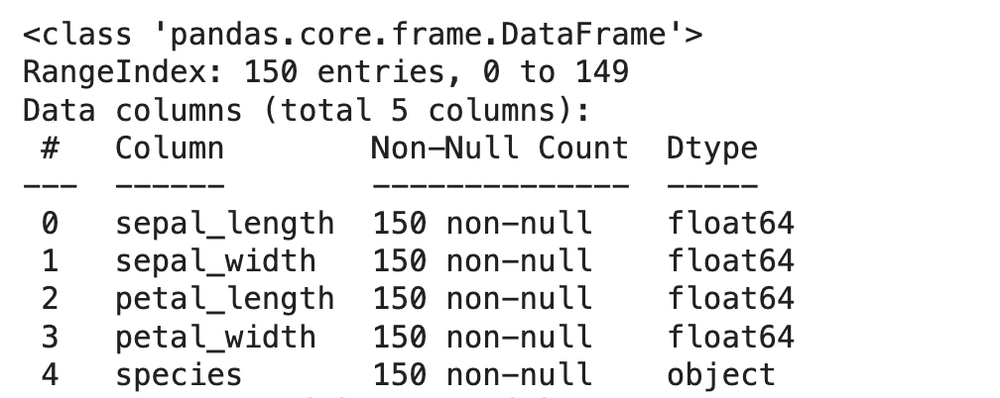{fig-align="center" width="60%"}

```python
#히스토그램 그리기
import matplotlib.pyplot as plt
import seaborn as sns
f, ax = plt.subplots(figsize=(11,9))
sns.distplot(iris.loc[iris['species']=='setosa','petal_length'], ax=ax, label='setosa')
sns.distplot(iris.loc[iris['species']=='versicolor','petal_length'], ax=ax, label='versicolor')
sns.distplot(iris.loc[iris['species']=='virginica','petal_length'], ax=ax, label='virginica')
plt.title('Histogram')
plt.legend()
plt.show()
```

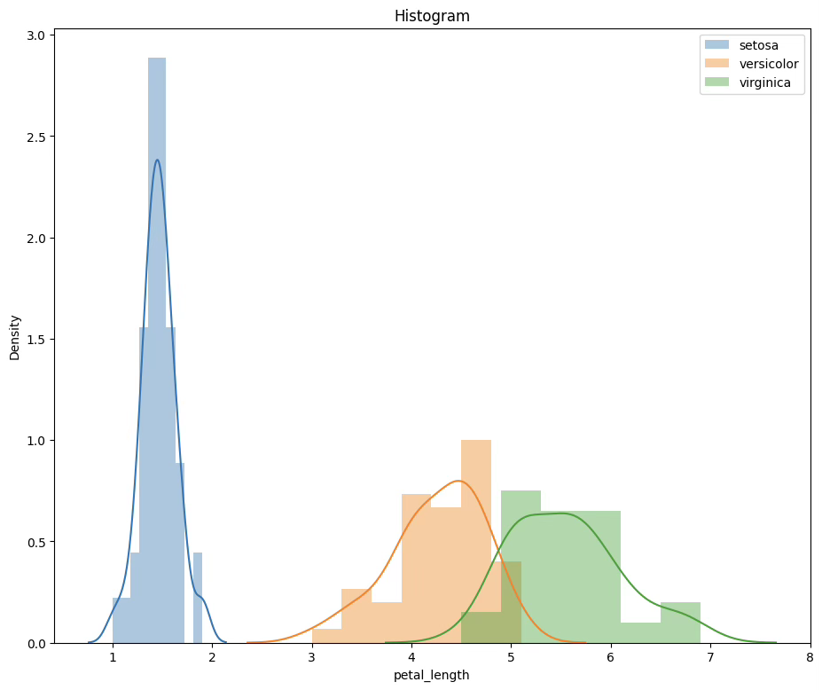{fig-align="center" width="60%"}

```python
#나무상자 그리기
import seaborn as sns
ax=sns.boxplot(x='species',y='petal_length',hue='species',data=iris)
```

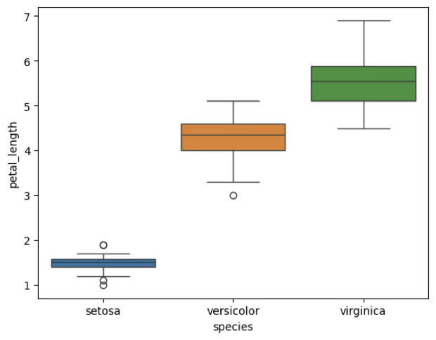{fig-align="center" width="60%"}

```python
#기초통계량 표
iris.pivot_table(index=['species'],values=['petal_length'],aggfunc=['mean','std'])
```

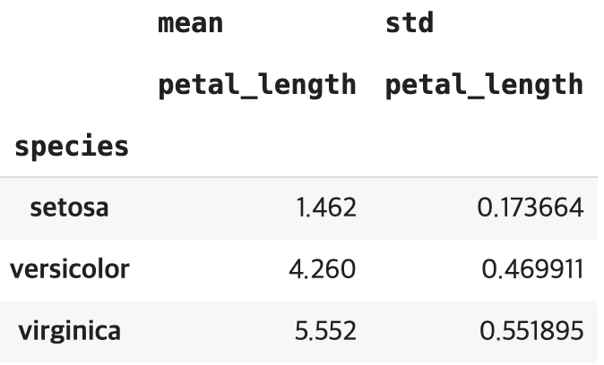{fig-align="center" width="60%"}

분산분석: F-검정통계량=1180, 유의확률<0.001로 귀무가설이 기각되어 품종간 꽃잎 길이는 유의한 차이가 있다.

```python
#분산분석
import statsmodels.api as sm
from statsmodels.formula.api import ols
y=iris['petal_length']
results=ols('y~C(species)',data=iris).fit()
sm.stats.anova_lm(results,typ=2)
```

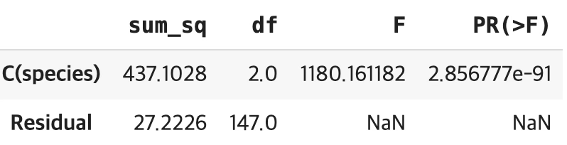{fig-align="center" width="60%"}

모형 $y_{ij} = \mu + A_{i} + e_{ij}$

setosa 꽃잎 길이 평균=절편 1.462(기초 통계량 평균과 동일)
versicolor 품종 평균 길이: 1.462+2.798=4.26
virginica 꽃잎 평균 길이: 1.462+4.09=5.552이다.

```python
#추정결과
results.summary()
```

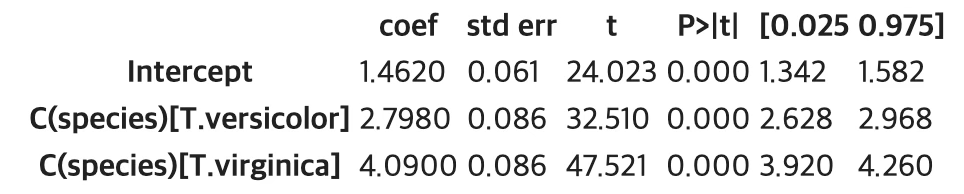{fig-align="center" width="60%"}

사후검정: 튜키 다중비교 검정

SE종과 VE종 간 꽃잎 길이 차이는 유의함(True). VI종(5.55) > VE종(4.26) > SE종(1.46) 순으로 꽃잎의 길이가 유의한 차이를 보이고 있다.

```python
#다중비교 튜키검정
from statsmodels.stats.multicomp import pairwise_tukeyhsd
from statsmodels.stats.multicomp import MultiComparison
mc=MultiComparison(iris['petal_length'],iris['species'])
mc_results = mc.tukeyhsd()
```

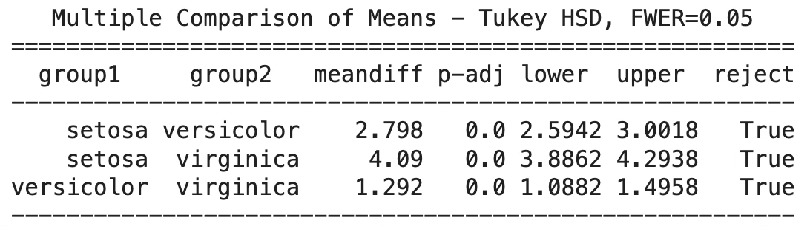{fig-align="center" width="60%"}

**분석결과표**

| 품종 | 평균 | 표준편차 | F-통계량 (유의확률) |
|------|:---:|:-------:|:------------------:|
| setosa^a | 1.46 | 0.174 | 1180 |
| versicolor^b | 4.26 | 0.470 | <0.001 |
| virginica^c | 5.55 | 0.552 | |

: 분꽃 품종별 꽃잎 길이 비교 {.striped}

## 블록설계 Block Design

### 개념

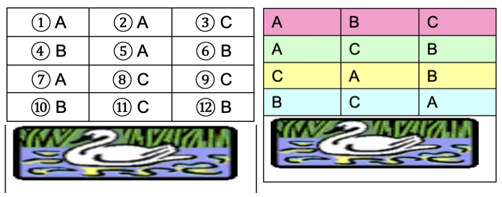{fig-align="center" width="60%"}

각 논 구역에는 동일한 조건을 갖춘 세 구간이 있으며, 일부 구간은 물이 있는 상태를 나타낸다. 만약 세 가지 비료(A, B, C)를 아홉 개 구간에 무작위로 배정한다면, 비료 간 수확량 차이가 실제로는 논 구역별 토양 상태, 일조량, 또는 물의 유무와 같은 환경 차이에 기인할 수 있다.

이러한 경우 완전 무작위 설계는 적절하지 않다. 대신, 실험 단위 간의 환경 차이를 통제하기 위해 무작위 완전 블록 설계(Randomized Complete Block Design, RCBD)를 사용한다. RCBD에서는 각 블록(논 구역) 내에 모든 비료 종류가 한 번씩 배정되도록 한다.

RCBD는 외생적 변동 요인(블록)이 존재할 때 t개의 처리 평균을 비교하는 데 사용하는 실험 설계이다. b개의 블록이 있을 경우, 각 블록 내에 t개의 처리를 무작위로 배정하되, 각 처리는 블록마다 정확히 한 번씩 나타난다.

### 모형 및 가정

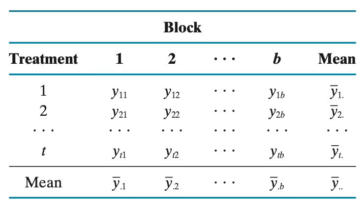{fig-align="center" width="60%"}

$$y_{ij} = \mu + \alpha_{i} + \beta_{j} + \varepsilon_{ij}$$

- $y_{ij}$: j번째 블록에서 i번째 처리를 받은 실험 단위의 관측값
- $t$는 처리개수, $b$는 블록개수, $n = tb$은 총 실험개수, $i = 1,2,..,t$, $j = 1,2,..,b$
- $\mu$: 전체 평균(알 수 없는 상수)
- $\alpha_{i}$: i번째 처리 효과(알 수 없는 상수)
- $\beta_{j}$: j번째 블록 효과(알 수 없는 상수)
- $\varepsilon_{ij}$: j번째 블록에서 i번째 처리를 받은 실험 단위의 반응값에 대한 오차항
- 평균 0, 분산 $\sigma_{\varepsilon}^{2}$를 가지는 정규분포를 따른다고 가정하며, 모든 오차항은 서로 독립이어야 함

### 추정과 가설검정

**추정**

- 전체평균: $\widehat{\mu} = {\overline{y}}_{..} = \frac{1}{n}\sum_{i}\sum_{j}y_{ij}$
- 처리 $i$의 표본평균: ${\widehat{\mu}}_{i} = {\overline{y}}_{i \cdot} = \frac{1}{b}\overset{b}{\sum_{j = 1}}y_{ij}$
- 블록 $j$의 표본평균: ${\widehat{\mu}}_{j} = {\overline{y}}_{\cdot j} = \frac{1}{t}\overset{t}{\sum_{i = 1}}y_{ij}$

**변동분해**

- 총변동: $SST = \overset{t}{\sum_{i = 1}}\overset{b}{\sum_{j = 1}}(y_{ij} - {\overline{y}}_{\cdot \cdot})^{2}$
- 처리변동: $SSTr = b\overset{t}{\sum_{i = 1}}({\overline{y}}_{i \cdot} - {\overline{y}}_{\cdot \cdot})^{2}$
- 블록변동: $SSBl = t\overset{b}{\sum_{j = 1}}({\overline{y}}_{\cdot j} - {\overline{y}}_{\cdot \cdot})^{2}$
- 오차변동: $SSE = \overset{t}{\sum_{i = 1}}\overset{b}{\sum_{j = 1}}(y_{ij} - {\overline{y}}_{i \cdot} - {\overline{y}}_{\cdot j} + {\overline{y}}_{\cdot \cdot})^{2}$

**분산분석표**

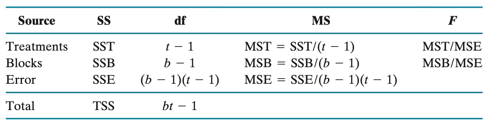{fig-align="center" width="80%"}

- 귀무가설 $H_{0}:\alpha_{1} = \alpha_{2} = \ldots = \alpha_{t} = 0$ (모든 처리효과가 0 → 처리 간 차이가 없다)
- 검정통계량: $F = \frac{MST}{MSE}$

**블록효과 검정**

상대효율은 블록화 설계가 완전임의배치설계에 비해 처리 평균을 얼마나 더 정밀하게 추정할 수 있는지를 나타내는 척도이다.

$$RE(RCB,CR) = \frac{MSECR}{MSERCB} = \frac{(b - 1)MSB + b(t - 1)MSE}{(bt - 1)MSE}$$

상대효율 값이 1보다 크면, RCBD가 동일한 정밀도를 얻기 위해 CRD보다 적은 수의 실험 단위만으로도 충분하다는 뜻이다.

### 사례 실습

diamonds 데이터는 총 53,940개의 관측값을 포함하며, 미국에서 판매된 다이아몬드 기록을 기반으로 가공된 예제 자료이다.

diamonds 데이터에서 처리 요인(treatment)으로는 다이아몬드의 연마 품질 등급인 cut을, 블록 요인(block)으로는 색상 등급(color)을, 반응변수(response)는 가격(price)으로 설정할 수 있다.

```python
import seaborn as sns
import statsmodels.api as sm
from statsmodels.formula.api import ols

# 1. 데이터 불러오기
diamonds = sns.load_dataset("diamonds")

# 2. RCBD 모형 적합 (cut: 처리, color: 블록)
model = ols("price ~ C(cut) + C(color)", data=diamonds).fit()
anova_table = sm.stats.anova_lm(model, typ=2)

print(anova_table)
```

                sum_sq       df           F         PR(>F)
<br>
C(cut)    9.699679e+09      4.0  159.106485  1.288117e-135
<br>
C(color)  2.550704e+10      6.0  278.932685   0.000000e+00
<br>
Residual  8.219243e+11  53929.0         NaN            NaN

```python
# 3. mean_sq 직접 계산
anova_table["mean_sq"] = anova_table["sum_sq"] / anova_table["df"]

# 4. MSB, MSE, RE 계산
MSB = anova_table.loc["C(color)", "mean_sq"]
MSE = anova_table.loc["Residual", "mean_sq"]
t = diamonds["cut"].nunique()
b = diamonds["color"].nunique()

RE = ((b-1)*MSB + b*(t-1)*MSE) / ((b*t - 1)*MSE)
print("상대효율(RE):", RE)
```

상대효율(RE): 50.046944451222345

```python
import seaborn as sns
import matplotlib.pyplot as plt

plt.figure(figsize=(8,6))
sns.boxplot(data=diamonds, x="cut", y="price", palette="pastel")
plt.title("(cut) price (Boxplot)", fontsize=14)
plt.xlabel("Cut (treatment)")
plt.ylabel("price")
plt.tight_layout()
plt.show()
```

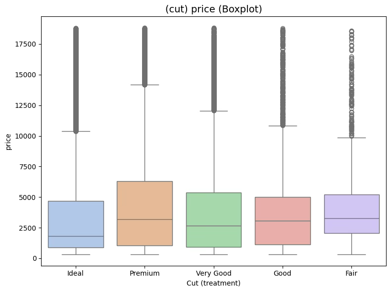{fig-align="center" width="70%"}

## 이원 분산분석 two-way ANOVA

### 모형 및 가정

$$y_{ijk} = \mu + \alpha_{i} + \beta_{j} + (\alpha\beta)_{ij} + e_{ijk}$$

- $y_{ijk}$: A 요인의 i수준, B 요인의 j수준을 받은 k번째 실험단위의 반응값
- $\mu$: 전체 평균(모르는 상수)
- $\alpha_{i}$: 요인 A의 i수준 효과, $i = 1,2,...,a$
- $\beta_{j}$: 요인 B의 j수준 효과, $j = 1,2,...,b$
- $\alpha\beta_{ij}$: 요인 A의 i수준과 요인 B의 j수준 간 상호작용 효과
- $\varepsilon_{ijk}$: 무작위 오차항 (평균 0, 분산 $\sigma_{\varepsilon}^{2}$의 정규분포, 독립), $k = 1,2,...,n$

**모수**

- $\mu$: 모집단 총평균
- 주효과 main effect: $\alpha_{i},\beta_{j}$
- 상호효과 interaction effect: $\alpha\beta_{ij}$

### 추정 및 가설검정

**모평균 추정**

$\widehat{\mu} = {\overline{y}}_{...} = \frac{1}{abn}\sum_{ijk}y_{ijk}$, 표본 총평균

**주효과 추정**

- 주효과 $\alpha_{i}$의 점추정치: $\alpha_{i} = {\overline{y}}_{i..} - {\overline{y}}_{...}$
- 주효과 $\beta_{j}$의 점추정치: $\beta_{j} = {\overline{y}}_{.j.} - {\overline{y}}_{...}$
- 상호효과 $\alpha\beta_{ij}$의 점추정치: $\alpha\beta_{ij} = {\overline{y}}_{ij.} - {\overline{y}}_{i..} - {\overline{y}}_{.j.} + {\overline{y}}_{...}$

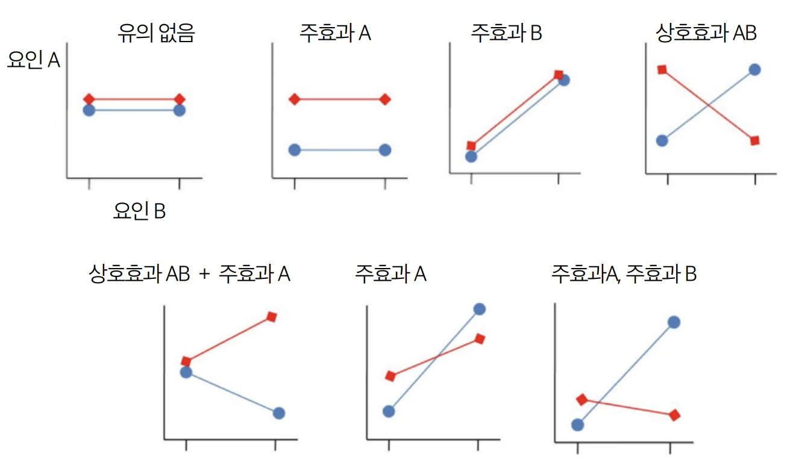{fig-align="center" width="80%"}

**변동분해**

- 총변동: $SST = \sum_{ijk}(y_{ijk} - {\overline{y}}_{\cdots})^{2}$
- 요인 $A$ 변동: $SSA = bn\sum_{i}({\overline{y}}_{i..} - {\overline{y}}_{...})^{2}$
- 요인 $B$ 변동: $SSB = an\sum_{i}({\overline{y}}_{.j.} - {\overline{y}}_{...})^{2}$
- 요인 $AB$ 변동: $SSAB = n\sum_{i}\sum_{j}({\overline{y}}_{ij.} - {\overline{y}}_{i..} - {\overline{y}}_{.j.} + {\overline{y}}_{...})^{2}$
- 잔차 변동: $SSE = \sum_{ijk}(y_{ijk} - {\overline{y}}_{ij.})^{2}$

**분산분석표**

| 요인 | 자승합 | 자유도 | 평균자승합 | F-통계량 |
|------|:------:|:------:|:---------:|:-------:|
| 요인 A 주효과 | $SSA$ | $a-1$ | $MSA$ | $\frac{MSA}{MSE}$ |
| 요인 B 주효과 | $SSB$ | $b-1$ | $MSB$ | $\frac{MSB}{MSE}$ |
| 요인 AB 상호효과 | $SSAB$ | $(a-1)(b-1)$ | $MSAB$ | $\frac{MSAB}{MSE}$ |
| 오차변동 | $SSE$ | 차이 | $MSE$ | |
| 수정총합 (Corrected Total) | $SST$ | $n-1$ | | |

: 이원 분산분석표 {.striped}

### 사례분석

SEABORN MPG 데이터: 자동차 연비(mpg)에 영향을 미치는 요인으로 실린더 개수와 생산국가를 고려하였다.

- 생산국 origin: usa, japan, europe
- 실린더 개수 cylinders: 3, 4, 5, 6, 8 (4, 6개만 사용)

```python
#mpg 데이터 불러오기
import pandas as pd
import seaborn as sns
data= sns.load_dataset('mpg')
data=data[(data['cylinders']==4)|(data['cylinders']==6)]
data.info()
```

Column        Non-Null Count  Dtype
<br>
0   mpg           288 non-null    float64
<br>
1   cylinders     288 non-null    int64
<br>
2   displacement  288 non-null    float64
<br>
3   horsepower    282 non-null    float64
<br>
4   weight        288 non-null    int64
<br>
5   acceleration  288 non-null    float64
<br>
6   model_year    288 non-null    int64
<br>
7   origin        288 non-null    object
<br>
8   name          288 non-null    object

**Box Plot 그리기**

```python
#나무상자 그림
import seaborn as sns
sns.boxplot(x="cylinders",y="mpg",hue='origin',notch=True,data=data)
plt.show()
```

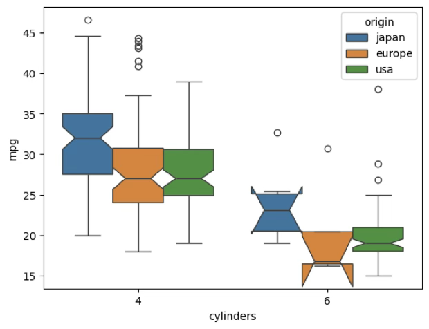{fig-align="center" width="70%"}

**평균, 표준편차**

```python
#요인별 기초통계량
data.pivot_table(index=['origin'],columns=['cylinders'],values=['mpg'],aggfunc=['mean','std'],margins=True)
```

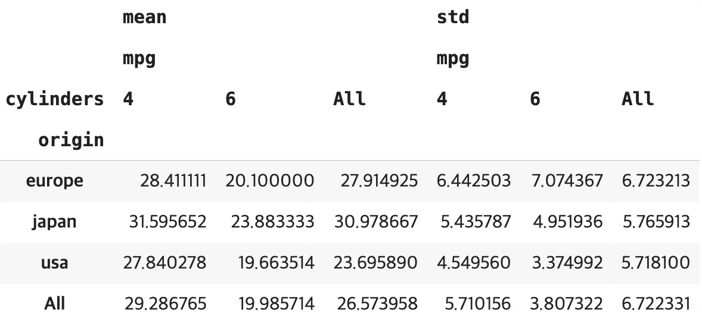{fig-align="center" width="70%"}

생산국가: 생산국가에 따른 연비차이는 매우 유의함(유의확률 <0.001). 생산국가 일본 > 유럽 > 미국 순으로 연비가 높다.

실린더 개수: 실린더 개수에 따른 연비차이는 매우 유의함(유의확률 <0.001). 실린더 수가 많을수록 연비는 낮아진다.

- (생산국가)×(실린더개수) 상호효과도 매우 유의함

```python
#이원 분산분석
import statsmodels.api as sm
from statsmodels.formula.api import ols
y=data['mpg']
results=ols('y~C(cylinders)+C(origin)+C(cylinders):C(origin)',data=data).fit()
sm.stats.anova_lm(results,typ=2)
```

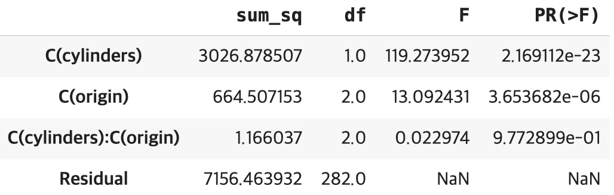{fig-align="center" width="70%"}

**평균도표**

```python
import matplotlib.pyplot as plt

means = (data
         .groupby(['cylinders','origin'])['mpg']
         .mean()
         .reset_index())

pivot = means.pivot(index='cylinders', columns='origin', values='mpg').sort_index()

plt.figure()
for b in pivot.columns:
    plt.plot(pivot.index.astype(str), pivot[b], marker='o', label=f'origin={b}')
plt.xlabel('Factor A: cylinders')
plt.ylabel('Mean response (mpg)')
plt.title('Interaction plot (means)')
plt.legend(title='Factor B: origin')
plt.show()
```

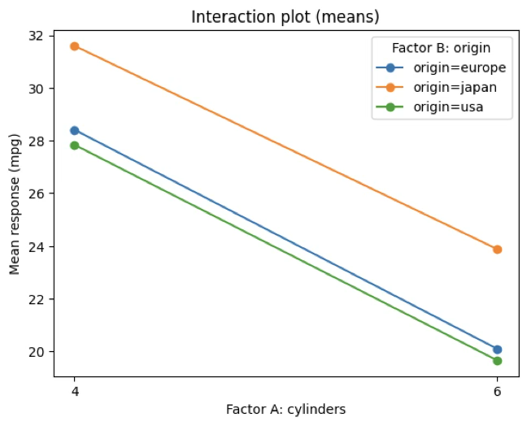{fig-align="center" width="70%"}

## 공분산분석 Analysis of Covariance

### 공분산분석 개념

공분산분석에서의 공변량은 독립변수(요인)와 종속변수 사이의 관계를 더 정확하게 검증하거나 그룹 간의 차이를 더 정확하게 비교하기 위해 사용된다.

공변량을 사용하는 주요 목적은 통제(Control)이다. 예를 들어, 어떤 약의 효과를 연령대에 따라 측정한다고 가정해 보자. 이 때 나이를 공변량으로 사용하여 나이의 영향을 제거하고 약의 효과를 더 정확하게 측정할 수 있다. 즉, 공변량은 관심의 대상이 아니라 요인의 유의성 검정을 정확하게 하기 위하여 고려하는 설명변수이다.

### 모형 및 가정

$$y_{ijk} = \mu + A_{i} + B_{j} + (AB)_{ij} + x_{ijk} + e_{ijk}, \quad e_{ij} \sim N(0,\sigma^{2})$$

- $i$: 요인 A의 수준 첨자, $j$: 요인 B의 수준 첨자, $k$: 반복 첨자
- 요인 A 수준 개수 $a$, 요인 B 수준 개수 $b$
- $y_{ijk}$: 요인 $A$ $i$ 수준, 요인 $B$의 수준 $j$의 $k$-번째 종속변수 관측치
- $x_{ijk}$: 요인 $A$ $i$ 수준, 요인 $B$의 수준 $j$의 $k$-번째 공변량 관측치

### 이원 공분산분석 사례

**seaborn 예제 데이터 (운동)**

- 종속변수: 운동 후 맥박 수
- 요인: 운동시간 3개 층(1 min=96, 15 min=117, 30 min=126, 매우 유의), 비만 유형 2개 층(no fat=121, low fat=105, 매우 유의)
- 공변량: 운동 전 맥박 수(매우 유의) - 운동 후 맥박은 운동 전 맥박에 영향을 받으므로 요인의 검증을 위한 통제변수이므로 유의성 검증 대상이 아니다.

```python
#운동 데이터 불러오기
import pandas as pd
import seaborn as sns
data= sns.load_dataset('exercise')

#데이터 전처리
rest=pd.melt(data[data['kind']=='rest'],id_vars=['id','diet','time'],value_vars=['pulse'],value_name='rest_pulse')
run=pd.melt(data[data['kind']=='running'],id_vars=['id','diet','time'],value_vars=['pulse'],value_name='run_pulse')
df=pd.concat([rest,run],axis=1).iloc[:,[1,2,4,9]]
df.info()
```

Column      Non-Null Count  Dtype
<br>
0   diet        30 non-null     category
<br>
1   time        30 non-null     category
<br>
2   rest_pulse  30 non-null     int64
<br>
3   run_pulse   30 non-null     int64

```python
#요인별 기초통계량
df.pivot_table(index=['time'],columns=['diet'],values=['run_pulse'],aggfunc=['mean','std'],margins=True)
```

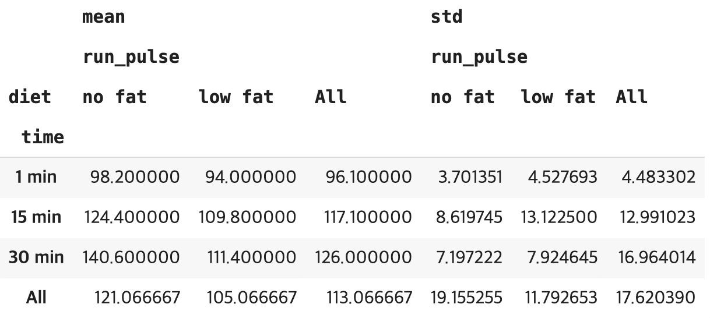{fig-align="center" width="80%"}

```python
#공변량 분석
import statsmodels.api as sm
from statsmodels.formula.api import ols
y=df['run_pulse']
results=ols('y~C(diet)+C(time)+C(diet):C(time)+rest_pulse',data=df).fit()
sm.stats.anova_lm(results,typ=2)
```

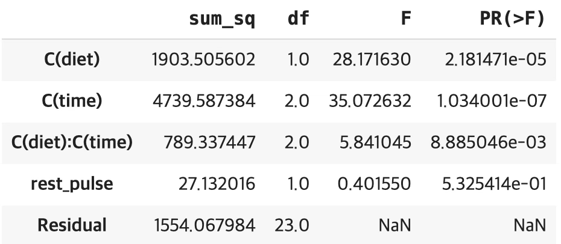{fig-align="center" width="70%"}

운동 후 맥박(run_pulse)에 대해 식이요법(diet)과 측정 시점(time)의 영향을 공변량(rest_pulse, 안정 시 맥박)을 통제한 상태에서 살펴본 결과, 식이요법과 측정 시점 모두에서 유의한 차이가 나타났다.

또한 식이요법과 시간 간에는 상호작용 효과가 나타나, 운동 직후에는 두 집단 간 차이가 크지 않았으나 시간이 지남에 따라 무지방(no fat) 집단은 맥박이 꾸준히 증가한 반면, 저지방(low fat) 집단은 증가 폭이 상대적으로 작아졌다. 반면, 안정 시 맥박(rest_pulse)은 운동 후 맥박에 통계적으로 유의한 영향을 주지 않았다.

따라서 본 연구에서는 저지방 식이요법이 운동 후 시간이 지남에 따라 맥박 상승을 억제하는 효과가 있음을 확인할 수 있다.
