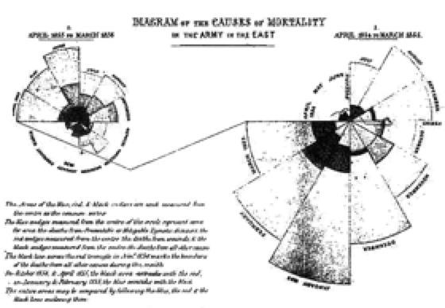
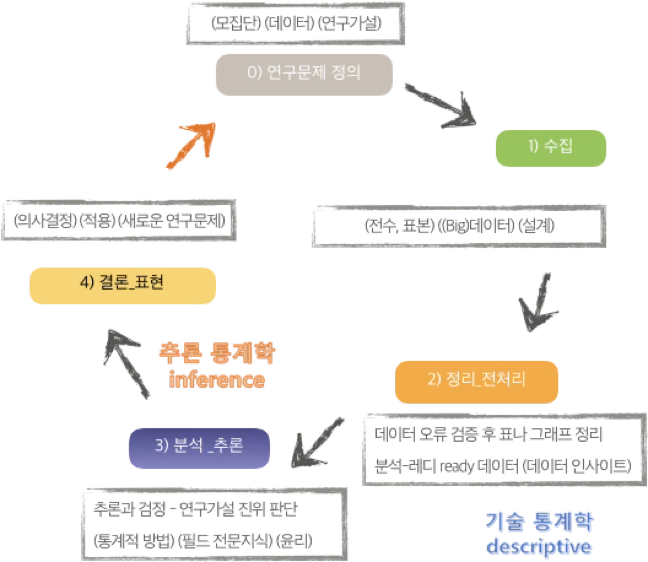
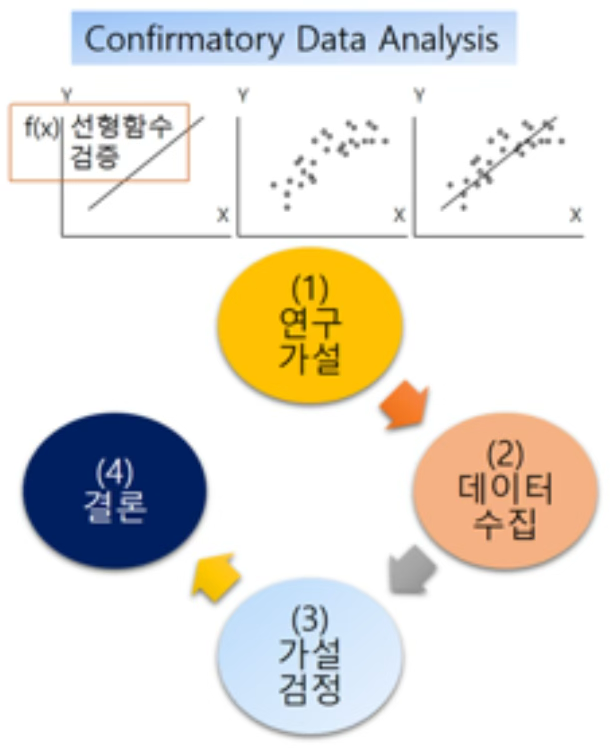
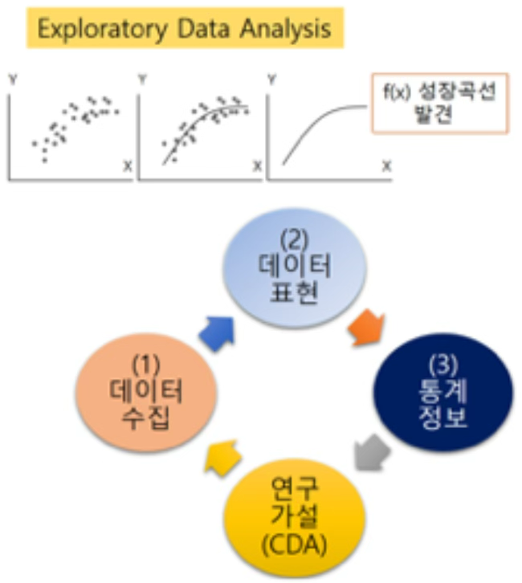
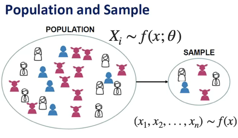

## 통계학이란?

::: {.callout-note icon=false}
## 정의
**통계학(Statistics)**은 사회와 자연의 수치적 현상을 기술하고, 불완전하고 변동성이 있는 정보를 바탕으로 모집단과 과정에 대한 결론을 도출하는 과학적 원리와 기법의 집합이다. 즉, 통계학은 **데이터로부터 배우는 과학**이다.
:::

현대 사회에서 거의 모든 사람, 기업 경영자, 마케팅 담당자, 사회과학자, 공학자, 의학 연구자, 소비자 등 데이터를 다룬다. 데이터는 분기별 매출액, 청소년 범죄 증가율, 수질 샘플의 오염도, 환자의 치료 생존율, 인구조사 결과 등 다양한 형태로 존재한다.

### 개념

#### 정의

통계학은 수학의 한 분야로, 숫자 데이터를 수집하고 정리하며, 이를 분석하고 표현하는 일련의 과정에 관한 학문이다.

- Kendall과 Stuart에 따르면, 통계학은 관심의 대상이 되는 집단(모집단)의 성질을 세거나 측정하여 얻어진 데이터를 다루는 과학의 한 분야이다.
- Ott는 통계학을 '데이터에 관한 학문'이라고 정의하였고, 어떤 익명의 정의에서는 통계학을 '미지에 대한 가이드'라고 표현하였다.
- Fisher (1935)는 통계학은 불확실한 상황에서 의사결정을 내리기 위해 데이터를 수집, 요약, 해석하는 과학이다.
- Tukey (1962)는 통계학은 데이터를 더 잘 이해하고 설명하기 위한 학문이며, 단순한 데이터 요약을 넘어 새로운 통찰을 제공하는 방법론이다.
- American Statistical Association (ASA)에서는 통계학은 데이터로부터 지식을 추출하고, 그 과정에서 불확실성을 정량화하며, 이를 바탕으로 의사결정을 지원하는 과학이자 예술이다.
- 필자는 통계학을 'Statistics is Art'라고 표현하며, 이를 단순한 수치 해석을 넘어 창의적 해석과 통찰의 영역으로 확장한다.

#### 왜 통계학이 필요한가?

통계학이 필요한 이유는 다양하다. 첫째, 발표된 수치 자료를 평가할 수 있는 능력을 갖추기 위해서이다. 우리는 제조업체의 제품 주장, 사회·소비자·정치 여론조사 결과, 과학 연구 논문의 수치 결과 등에 일상적으로 노출된다. 이러한 결과 중 다수는 표본조사에 기초한 추론이며, 일부는 타당하지만 일부는 그렇지 않다.

둘째, 직업이나 업무 수행 과정에서 표본조사(설문조사 또는 실험) 결과를 해석하거나, 통계적 분석 방법을 활용하여 결론을 도출해야 할 필요가 있다. 예를 들어, 의사는 신약과 기존 약물의 효과를 비교한 수치를 보고, 그 차이가 실제 약효의 차이인지, 아니면 단순히 실험 측정의 무작위 변동 때문인지 판단해야 한다.

결론적으로 통계학은 과학, 산업, 경영 전반에서 중요한 역할을 수행한다.

#### 통계학자는 무엇을 하는가?

데이터로부터 배우는 과정에서 통계학자는 연구 또는 실험 설계, 분석을 위한 데이터 준비(그래프·수치 요약 포함), 데이터 분석, 분석 결과 보고의 모든 단계에 관여한다.

통계학의 목적은 표본에서 얻은 정보를 바탕으로 모집단에 대한 추론을 하는 것이다. 예를 들어, 감사인이 25,000개 계정 중 무작위로 2,000개를 조사하여 84개(4.2%)에서 오류를 발견했다고 하자. 이를 바탕으로 전체 25,000개 계정의 오류율을 추정할 수 있다. 추정치가 4.2%이고, 오차 범위가 ±0.9%라면, 실제 오류율은 이 범위 내에 있을 가능성이 높다.

데이터 분석 단계에서 통계학자는 기존 기법을 적용하거나, 수학·확률이 결합된 새로운 분석 방법을 개발할 수 있다. 결과 보고 단계에서 통계학자는 분석 결과를 청중이 이해할 수 있도록 시각 자료·표·수치와 함께 전달한다.

#### 통계학과 빅데이터

통계학은 관심 있는 분야에서 존재하는 불확실성을 설명하기 위해, 목적에 맞는 데이터를 계획적으로 수집하고 이를 분석하여 가치 있는 정보를 추출하는 과학이다.

반면, 빅데이터는 실시간으로 발생하는 대용량·고속·복잡 데이터를 수집하고 분석하는 기술적·방법론적 접근을 의미한다. 빅데이터는 사전에 이론이나 명확한 목적을 설정하지 않고 수집된 경우가 많으며, 따라서 분석 과정에서 사후적으로 가치와 의미를 추출하는 특성을 가진다.

**빅데이터 연구문제는 어떻게 처리하나?**

빅데이터 연구문제는 그 특성상 다양한 분야 전문가의 협업을 필요로 한다. 연구문제와 직접 관련된 분야의 전문가는 물론, 데이터 수집·처리 기술을 담당하는 컴퓨터 프로그래머, 대규모 데이터 분석 기법을 다루는 머신러닝 전문가, 그리고 분석의 과학적 타당성을 확보하는 통계 전문가가 반드시 필요하다.

통계 전문가는 빅데이터로부터 가치 있는 정보를 추출하는 데 필수적인 역할을 한다. 빅데이터 분석에서 다음과 같은 이슈들은 특히 중요하다.

- 데이터 품질과 결측치 문제
- 데이터 관측 특성 및 매개효과 등 인과 추론에서의 혼동 요인
- 예측과 모형의 불확실성 정량화 문제

**빅데이터 시대 통계는 기회이다.**

빅데이터 시대는 통계학에 새로운 기회를 제공한다. 통계학자는 데이터에서 편향을 발견하고 이를 수정하는 데 능숙하며, 불확실성을 정량적으로 측정하고 해석할 수 있는 능력을 갖추고 있다. 나아가, 결측 데이터나 비표본오차를 처리하고, 복잡한 데이터 구조를 설명하기 위한 적절한 모형을 개발하며, 인과 추론과 비교 효과 분석을 위한 통계적 방법을 설계한다.

#### 가설 및 모델 hypothesis and modeling

연구는 자연 현상이나 사회 현상에 대한 의문을 명확한 문제로 정의하고, 이를 자료에 기반하여 체계적으로 검증하는 과정이다. 연구자는 먼저 분석의 대상이 되는 모집단을 설정하고, 그 안에서 관심을 두는 특성을 측정하기 위한 변수(측정 항목)를 정의한다.

예를 들어, "두 교육 방법 중 어느 쪽이 더 효과적인가?"라는 질문은 다음과 같은 통계적 가설로 구체화한다.

- 귀무가설: 두 방법의 평균 성적 차이는 없다.
- 대립가설: 두 방법의 평균 성적은 서로 다르다.

이처럼 통계 가설은 연구문제를 수량화하고, 검정 가능하게 만드는 통계적 사고의 핵심 도구이다. 최근 각광받는 빅데이터 분석에서는 이러한 전통적 문제 정의 절차가 명확하게 드러나지 않는 경우가 많으며, 데이터 중심의 유연한 사고방식과 모형화 능력이 점점 더 중요해지고 있다.

### 역사

#### 기술통계학

기술통계는 인간 사회의 조직과 행정을 위해 수천 년 전부터 활용되어 왔다. 통계의 가장 오래된 기록은 성경에서 찾아볼 수 있다. 구약 성경의 『민수기(Numbers)』에서는 이스라엘 백성이 광야 생활을 시작하기 전과 후, 두 차례에 걸쳐 인구 조사를 실시한 내용이 등장한다.

고대 로마 제국에서도 인구 조사는 중요한 국가 행정 수단으로 활용되었다. 로마 황제 툴리우스(Tullius)는 세금 징수를 위해 5년마다 인구 조사를 실시하였으며, 훗날 시저(Caesar)는 이를 제국 전역으로 확대하였다. 로마의 이러한 전수조사는 이후 '센서스'라는 현대 통계 용어의 어원이 되었으며, 이는 라틴어 censura에서 유래된 것으로 '세금, 평가, 권한'라는 의미를 갖는다.

'통계'라는 단어 역시 라틴어 status에서 유래되었으며, 본래는 '국가의 상태'를 뜻하였다. 17세기에는 영국에서 출생률과 사망률에 대한 체계적인 조사가 시작되었다. John Graunt(1620-1674)이 런던의 사망통계(Bills of Mortality)를 체계적으로 분석하며 근대 통계학의 효시가 되었다.

특히 플로렌스 나이팅게일(Florence Nightingale)은 크림 전쟁 당시 사망 원인을 분류하고 이를 시각적으로 표현하기 위해 폴라 다이어그램(polar diagram)을 사용하였으며, 이는 보건 행정 개선에 결정적인 영향을 미쳤다.

{fig-align="center" width="60%"}

사회조사의 초창기 형태는 19세기 후반 유럽에서 등장하였다. 칼 마르크스(Karl Marx)는 1880년에 약 25,000명의 프랑스 노동자들을 대상으로 우편 조사를 실시하였다. 비슷한 시기, 막스 베버(Max Weber)는 관찰과 질적 조사를 병행하며 노동자들의 심리, 직업관, 사회적 태도를 연구하였다.

20세기에 들어서면서 사회조사 방법론은 미국을 중심으로 급격히 발전하였다. 미국 통계국(Bureau of the Census)은 인구조사 경험을 바탕으로, 표본추출 이론과 조사 설계 기법을 발전시켰으며, Gallup(갤럽)과 Roper(로퍼)와 같은 여론조사 기관들이 등장하면서 사회조사는 대중의 의견과 태도를 측정하는 핵심 도구로 자리 잡게 되었다.

#### 추론통계학

통계학은 단순히 데이터를 요약하는 기술통계를 넘어서, 데이터를 바탕으로 일반화하거나 예측하는 추론적 사고로까지 확장되어 왔다.

1645년경 피에르 드 페르마(Pierre de Fermat)와 블레즈 파스칼(Blaise Pascal)은 확률이론의 시초로 평가받는 도박 문제를 수학적으로 해석하면서 중요한 전환점을 만들었다. 그 후 야코프 베르누이(Jacob Bernoulli)는 『Ars Conjectandi(추측의 기술, 1713)』에서 법칙의 대수(the Law of Large Numbers)를 제시하여 확률과 통계 간 연결을 정립하였다.

정규분포의 수학적 공식 자체는 카를 프리드리히 가우스(Carl Friedrich Gauss)에 의해 제안되었다. 그는 천체의 위치 측정 오차 분포를 분석하던 중 대부분의 오차가 평균을 중심으로 대칭적으로 분포한다는 사실을 발견하고, 이를 바탕으로 오늘날 우리가 '정규분포'라 부르는 분포의 밀도함수를 유도하였다. 이 때문에 정규분포는 가우시안 분포(Gaussian distribution)라고도 불린다.

20세기 초에는 소표본 자료의 추론 문제가 주요 관심사로 떠올랐다. 윌리엄 셜리어스 고셋(William S. Gosset)은 "Student"라는 필명으로 1908년 t-분포를 발표하였다. 프랜시스 골턴(Francis Galton)은 유전 연구를 수행하면서 오늘날의 회귀분석 개념의 기초를 마련하였고, 이후 칼 피어슨(Karl Pearson)에 의해 수리적으로 정교화되었다.

마지막으로, 로널드 피셔(Ronald A. Fisher)는 농업 실험의 효율성을 높이기 위해 실험 설계와 분산분석(ANOVA) 개념을 도입하였고, 이는 실험 통계학의 혁신적 전환점을 이끌었다.

## 통계분석

### 통계분석 종류

#### 기술통계학 descriptive statistics

기술통계는 수집된 데이터를 정리하고 요약하여, 그 속에 담긴 정보를 간단명료하게 표현하는 통계학의 가장 기초적인 분야이다. 복잡하고 방대한 자료를 한눈에 파악할 수 있도록 해주며, 이후의 심층 분석이나 추론 통계로 나아가기 위한 출발점 역할을 한다.

기술통계의 주요 목적은 다음과 같이 정리된다.

- **데이터의 중심 위치 파악**: 평균, 중앙값 등 대표값 산출
- **자료의 산포 정도 파악**: 범위, 분산, 표준편차 등 변동성 측정
- **분포의 형태 파악**: 비대칭성(왜도), 뾰족함(첨도) 등 분포 특성 확인
- **시각적 패턴 파악**: 그래프와 도표를 통한 직관적 이해

{fig-align="center" width="80%"}

#### 추론통계학 inferential statistics

추론통계는 관측된 자료(표본)를 바탕으로 전체 모집단에 대한 일반적인 결론을 도출하거나 미래를 예측하는 통계 방법이다. 모든 대상을 조사하는 전수조사는 시간, 비용, 접근성 등 현실적 제약으로 인해 불가능하거나 비효율적인 경우가 많다.

추론통계가 필요한 이유는 다음과 같다.

- 전수조사의 한계: 시간, 비용, 접근성 측면에서 비현실적일 수 있음
- 빅데이터 시대에도 유효성 유지: 데이터가 방대해도 표본이 아닌 '편향된 관측값 모음'일 수 있음
- 정확도와 신뢰도 평가 필요: 단순한 기술통계만으로는 결과가 우연인지 여부를 판단할 수 없음

| 항목 | 설명 | 예시 |
|------|------|------|
| 모수 추정 | 모집단의 평균, 비율 등을 표본으로부터 추정 | 평균 키의 신뢰구간 추정 |
| 가설 검정 | 어떤 주장(가설)에 대해 데이터로 판단 | A와 B 그룹의 평균 차이 검정 |
| 신뢰구간 | 모수에 대한 추정값의 오차 범위 제시 | "평균은 65~75cm 사이" |
| p값과 유의수준 | 우연에 의한 결과인지 판단 기준 | p < 0.05 → 통계적으로 유의 |

: 추론통계 주요 개념 {.striped}

### 통계분석 접근법

통계 분석은 크게 두 가지 접근 방식으로 나눌 수 있다. 첫째, 확증적 연구(Confirmatory Research)는 사전에 이론이나 가설을 명확히 설정하고, 이를 검증하기 위해 계획적으로 데이터를 수집·분석하는 방식이다. 둘째, 탐색적 연구(Exploratory Research)는 데이터 자체를 면밀히 살펴 숨겨진 구조나 패턴, 관계를 발견하는 데 초점을 둔다.

#### 연역적 접근: 확증적 연구

{fig-align="center" width="40%"}

확증적 연구(confirmatory research)는 연역적 추론에 기반한 연구 방식으로, 기존의 이론이나 가설에서 출발하여 필요한 데이터를 수집하고, 이를 통해 가설의 타당성을 검증하는 절차를 거친다.

철학자 칼 포퍼(Karl Popper)는 1955년 발표한 저술에서 "과학 이론은 논리적으로 반증 가능해야 하며, 이론은 직관에 의해서만 얻어질 수 있다"고 주장하며 연역적 방법의 중요성을 강조하였다.

예를 들어 "온라인 강의는 대면 강의보다 만족도가 낮을 것이다"라는 가설을 세운 뒤, 이를 검증하기 위해 설문조사를 실시하고, 두 집단의 평균 만족도 차이를 통계적으로 검정하는 과정은 확증적 연구의 전형적인 사례라 할 수 있다.

#### 귀납적 접근: 탐색적 연구

{fig-align="center" width="40%"}

탐색적 연구(exploratory research)는 귀납적 추론에 기반한 접근으로, 사전에 명확한 가설을 세우지 않은 채 데이터 자체를 관찰하고 요약하며, 그 속에 존재하는 패턴이나 관계를 발견하려는 과정이다.

이 개념은 통계학자 **존 튜키(John W. Tukey)**가 1977년 저서 *Exploratory Data Analysis*에서 체계적으로 정립하였다.

탐색적 데이터 분석(EDA)의 대표적 방법에는 다음이 포함된다.

- **데이터 구조 요약**: 평균, 사분위수, 범위 등 수치 요약 도구
- **데이터 시각화**: 히스토그램, 박스플롯, 산점도 등 분포와 특성 파악을 위한 그래프
- **데이터 재표현(변환)**: 로그 변환, 표준화 등 분석을 용이하게 만드는 변환 기법

이러한 방법론은 이후 데이터 마이닝(Data Mining)으로 발전했고, 오늘날의 빅데이터 분석으로까지 확장되었다.

### 통계분석 절차

통계분석은 단순히 수치를 계산하는 과정이 아니라, 현실의 문제를 수치화하고 해석하며 결론을 도출하는 일련의 사고 절차이다.

#### 연구문제 정의

현실에서 관찰한 현상이나 관심 있는 주제를 바탕으로 명확한 연구 질문을 설정한다. 이 단계에서는 분석의 목적이 기술인지, 예측인지, 또는 비교인지 구체화되어야 한다.

예: "남성과 여성의 스마트폰 사용 시간에 차이가 있는가?"

#### 분석 대상과 변수 설정

모집단(population)을 정의하고 측정할 변수를 명확히 구분한다. 이때 변수의 유형(정성/정량)과 측정수준(명목/서열/등간/비율)도 함께 고려해야 한다.

예: 종속변수 -- 하루 스마트폰 사용 시간 (연속형), 독립변수 -- 성별 (명목형)

**모집단 population 표본 sample**

통계분석은 모집단 전체를 대상으로 직접 관측하는 것이 아니라, 일부를 추출한 표본을 통해 모집단의 특성을 추론하는 데 목적이 있다.

{fig-align="center" width="40%"}

모집단이란, 분석 대상이 되는 모든 관찰 단위의 모임으로, 연구자가 관심을 갖는 전체 집단을 의미한다. 모집단을 수학적으로 표현할 때, 보통 각 개체의 관심 특성을 $X_{1},X_{2},\ldots,X_{N}$으로 나타낸다. 여기서 $X_{i}$는 $i$번째 모집단 개체의 측정값이며, 모집단의 크기 $N$은 보통 매우 크거나 알려져 있지 않은 경우가 많다.

$X_{i} \sim f(x;\theta)$

$(x_{1},x_{2},...,x_{n}) \sim f(x)$

표본은 모집단에서 일부 개체만을 선택하여 관측한 자료의 집합이다. 표본은 보통 $n$개의 개체로 구성되며, 각 표본값은 $x_{1},x_{2},\ldots,x_{n}$으로 표현된다.

$$\text{표본} = \{ x_{1},x_{2},\ldots,x_{n}\},\quad n \ll N$$

확률표본이란, 모집단에 속한 모든 개체가 동일한 확률로 선택될 수 있는 조건하에 추출된 표본이다. 확률표본의 대표적 방법에는 단순무작위추출, 층화추출, 군집추출 등이 있다.

**모수 parameter와 통계량 statistic**

모수란, 연구자가 관심을 갖는 모집단 전체의 특성을 수치로 요약한 값이다. 이는 보통 관찰할 수 없는 값이며, Greek letter(예: $\mu,\sigma,p$) 등으로 표현되는 경우가 많다.

통계량이란, 표본 데이터를 바탕으로 계산된 수치로서, 모수에 대한 정보를 제공하는 요약값이다. 통계량은 표본에 따라 값이 변하는 확률변수이며, 알파벳 기호(예: $\overline{x},s,\widehat{p}$)로 표현된다.

#### 데이터 수집

통계 분석은 항상 데이터를 바탕으로 이루어진다. 데이터란, 표본 개체의 관심 특성(변수)을 측정하거나 관측하여 얻은 수치 또는 문자 값들의 모음이다.

변수란, 각 개체의 특성을 나타내는 관심의 대상이 되는 속성으로, 변화하거나 서로 다른 값을 가질 수 있는 항목이다.

- 질적 변수(qualitative): 범주 또는 속성을 나타냄 (예: 성별, 전공, 혈액형 등)
- 양적 변수(quantitative): 수치로 표현되는 변수 (예: 키, 몸무게, 점수 등)

**단변량(univariate) vs. 이변량(bivariate) 데이터**

- **단변량 데이터**: 하나의 변수만을 측정한 자료 → 예: 학생들의 수학 점수만을 조사한 경우
- **이변량 데이터**: 두 개의 변수에 대한 관측값이 **쌍(pair)**으로 구성된 자료 → 예: 학생들의 영어 점수와 수학 점수를 동시에 조사한 경우

#### 데이터 정리와 전처리

현대의 데이터 분석에서는 데이터를 수집한 이후의 정리와 정제 과정, 즉 전처리(data preprocessing)가 전체 분석에서 가장 많은 시간과 노력이 소요되는 단계로 알려져 있다.

데이터 전처리는 다음과 같은 흐름으로 진행된다.

**① 데이터셋 확인**

분석 대상이 되는 데이터셋 전체의 구조와 변수의 속성을 파악하는 단계이다.

- 독립변수(예측변수)와 종속변수(목표변수)를 구분한다.
- 각 변수의 데이터 유형을 확인한다. (범주형 vs. 수치형, 날짜, 문자열 등)
- 변수들의 측정 수준(명목, 서열, 등간, 비율)을 이해하고 적절한 처리 방법을 고려한다.

**② 결측치(missing value) 처리**

결측치란 어떤 관측값에서 특정 변수의 값이 누락된 상태를 의미한다. 주요 처리 방법은 다음과 같다.

- 삭제: 결측값이 많은 변수/행 제거
- 대체(imputation): 평균, 중앙값, 또는 예측모델 기반 대체
- Flag 변수 생성: 결측 유무를 나타내는 변수 추가 (ML 모델용)

**③ 이상값(outlier 또는 anomaly) 처리**

이상값이란 데이터의 전반적인 분포와 크게 벗어난 관측값으로, 통계량과 모델의 계수 추정에 왜곡을 일으킬 수 있다.

- 식별: Boxplot, Z-score, IQR, Mahalanobis distance 등
- 삭제 또는 대체
- 빅데이터에서는 이상값이 '주목 대상'임 → 다른 개체와 행동 패턴이 현저히 다르면 스몰 개체 탐색에 유용 (예: 금융 사기, 희귀 질병 탐지 등)

**④ 특성공학 (Feature Engineering)**

특성공학은 기존의 변수를 조작하거나 가공하여, 모델링에 도움이 되는 정보를 추가하거나 불필요한 노이즈를 제거하는 작업이다.

- 변수 변환: 로그변환, 표준화, 정규화 등
- 더미 변수(가변수) 생성: 범주형 변수의 수치화
- 연속형 변수의 범주화(binning)
- 차원 축소: PCA, 변수 선택 기법
- 중요 변수 선택: 종속변수와의 관계 기반 선택 (예: 상관계수, 회귀계수, 트리 기반 중요도 등)

#### 데이터 요약

데이터가 수집되고 정비된 이후에는, 분석에 앞서 그 전체적인 분포와 구조를 파악하기 위한 요약 작업이 필요하다.

**숫자 요약 numerical summary**

수치 요약은 각 변수의 중심 위치나 변동 정도, 비율 등을 하나의 값 또는 지표로 나타내는 방법이다.

- **표본평균**: 자료 전체의 평균값으로, 자료의 중심 위치를 나타낸다.
- **표본비율**: 전체 중에서 특정 범주에 속하는 비율을 나타낸다.
- **최솟값, 최댓값, 중앙값, 사분위수 등**: 자료의 범위와 분포 폭을 파악하는 데 유용하다.
- **회귀모형의 계수 추정값**: 예를 들어 공부 시간과 시험 점수 사이의 관계를 회귀모형으로 추정하면, 절편과 기울기 계수는 데이터가 나타내는 경향을 수치화한 요약이 된다.

**그래프 요약 (시각화 요약, Graphical Summary)**

그래프는 복잡한 수치를 직관적으로 이해할 수 있게 해주며, 특히 분포의 형태, 이상값, 변수 간 관계 등을 한눈에 파악하는 데 탁월한 도구이다.

- **막대그래프(bar chart)**: 범주형 변수의 빈도나 비율을 표현할 때 사용된다.
- **히스토그램(histogram)**: 연속형 자료를 구간별로 나누어 빈도를 시각화한 그래프이다.
- **박스플롯(boxplot)**: 중앙값, 사분위수, 이상값 등을 한 눈에 보여주며, 자료의 분포와 산포도를 비교할 수 있게 해준다.
- **산점도(scatter plot)**: 두 변수 간의 관계를 점의 형태로 표현한 그래프이다.

#### 데이터 분석

데이터 분석은 단순한 수치 요약을 넘어, 표본에서 얻은 정보를 바탕으로 모집단에 대한 결론을 도출하는 과정이다.

**추정 (Estimation)**

추정이란, 표본 자료로부터 모집단의 특성을 나타내는 모수 또는 모형의 계수를 점추정하는 과정이다.

- 모수 추정: H대학교 전체 재학생의 흡연율 $p$, H대학교 학생들의 주당 평균 공부시간 $\mu$ → 무작위로 추출한 표본으로부터 표본비율 $\widehat{p}$, 표본평균 $\overline{x}$등을 통해 추정하게 된다.
- 모형 추정: 학습시간을 독립변수, GPA를 종속변수로 하는 선형 회귀모형 $\text{GPA}_{i} = \beta_{0} + \beta_{1} \cdot \text{학습시간}_{i} + \varepsilon_{i}$ → 이때 $\beta_{0},\beta_{1}$은 모형의 모수이며, 표본 자료를 통해 추정한 값 ${\widehat{\beta}}_{0},{\widehat{\beta}}_{1}$이 추정값이다.

**가설 검정 (Hypothesis Testing)**

가설 검정은 어떤 주장이 데이터에 근거해 통계적으로 지지될 수 있는지를 판단하는 방법이다. 검정은 두 가지 가설을 설정하여 비교하는 방식으로 이루어진다.

- 귀무가설: 변화나 차이가 없다는 기본 가정
- 대립가설: 연구자가 입증하고자 하는 주장

## 통계의 이해

### 확률에 대한 이해

**확률 개념**

확률이란 특정 사건이 발생할 가능성을 수치로 표현한 것이다. 우리는 일상생활에서 "오늘 비가 올 거야" 또는 "정오에 만나자"처럼 확정적인 표현을 자주 사용하지만, 사실 대부분의 사건은 불확실성을 내포하고 있다.

**관찰 편향과 확률 추정의 오류**

사람들은 직접 경험하거나 반복적으로 노출된 사건을 실제보다 자주 발생하는 것으로 오해하는 경향이 있다. 이를 관찰 편향이라 한다. 예를 들어, 많은 사람들이 비행기를 두려워하지만, 미국에서 연간 자동차 사고 사망자는 34,000명에 달하는 반면, 항공기 사고로 인한 사망자는 5명에 불과했다(2013년 기준). 즉, 운전이 항공기보다 약 7,000배 위험함에도 불구하고, 뉴스에 자주 보도되는 비행기 사고로 인해 위험 인식을 왜곡받는다.

**반복성과 확률의 누적 효과**

확률이 작다고 해서 무시할 수 있는 것은 아니다. 지구에 1년 내 소행성이 충돌할 확률이 0.0003%라고 하더라도, 이 확률이 10만 년, 100만 년 동안 반복되면 충돌 가능성은 각각 약 3%, 30%, 96%로 증가한다.

동일한 원리는 '생일 역설'에서도 확인된다. 한 사람과 생일이 겹칠 확률은 0.27%에 불과하지만, 100명이 함께 있는 방에서는 그 중 누군가가 나와 생일이 같을 확률이 약 24%에 이른다.

**결론**

확률은 불확실성을 다루기 위한 도구이며, 직관만으로 접근하면 판단 착오를 유발할 수 있다. 특히 뉴스, 경험, 반복된 메시지에 기반한 편향된 확률 인식을 경계하고, 통계적 사고를 통해 사실 기반의 합리적인 판단을 기르는 것이 중요하다.

### 확률 해석의 함정

통계학은 객관적 수치를 바탕으로 현상을 설명하는 강력한 도구이지만, 통계 자체는 아무 말도 하지 않는다. 의미는 그것을 해석하는 사람에 의해 부여되며, 이 과정에서 오류와 오해가 빈번히 발생한다.

**평균의 오해: 숫자보다 중요한 맥락**

사람들은 종종 평균값 하나만으로 전체를 판단하는 실수를 저지른다. 예를 들어, 한 세대 전 동유럽의 1인당 소득은 $3,400, 아시아는 $1,600이었다고 하자. 이 수치만 보고 "동유럽인의 소득이 더 높다"고 결론짓는 것은 전체 인구 규모를 무시한 오류이다. 동유럽이 1억 명, 아시아가 40억 명이라면, 총소득은 아시아가 훨씬 크다.

**상관관계와 인과관계의 혼동**

"상관관계는 인과관계를 의미하지 않는다"는 사실은 잘 알려져 있다. 예컨대, 과거 미국에서 태양 흑점 수와 공화당 상원 점유율 사이에 높은 상관관계가 있었지만, 단지 우연의 일치일 뿐 인과성은 없었다.

**제3의 변수: 교란변수(confounding)의 위력**

때때로 두 변수는 동시에 변화하지만, 실제 원인은 제3의 변수일 수 있다. 예를 들어, 교회 수와 범죄율 사이의 양의 상관관계는 인구 규모라는 공통 원인 변수로 설명될 수 있다.

**집계의 편향: aggregation bias**

집계 통계량(예: 평균, 중위수)은 전체 경향을 요약하는 데 유용하지만, 표본의 구성이 무작위가 아니거나 변화한다면 심각한 왜곡을 초래할 수 있다.

**측정 지표의 해석에 주의하라**

지표가 무엇을 나타내는지를 정확히 이해하는 것이 중요하다. 예를 들어, 실업률은 구직을 포기한 사람을 제외하므로, 고용 상황이 나빠졌음에도 실업률은 낮아질 수 있다.

### 두 집단 비교분석 의미

"이 두 모집단은 같은가, 다른가?"라는 질문에 답해야 한다. 예를 들어, 어떤 신약이 기존 약보다 효과가 있는지 알고 싶을 때, 두 그룹 간 차이를 비교한다. 그러나 이러한 판단은 확정적이 아니라 언제나 확률적이다.

**평균의 차이: 진짜인가, 우연인가?**

예를 들어, 위약 그룹의 평균 체중 감소가 2파운드이고, 신약 그룹은 4파운드라고 하자. 표면적으로는 신약이 더 효과적인 것처럼 보이지만, 그 차이가 단순히 무작위 변동에 의한 것일 수도 있다. 통계는 여기서 다음 두 가지 질문에 답한다.

- 관측된 차이가 실제로 얼마나 큰가?
- 그 차이가 우연히 발생할 가능성은 얼마나 적은가?

이 질문에 대한 답은 주로 p값과 신뢰구간, 그리고 통계적 유의성이라는 개념을 통해 제공된다.

**통계적 유의성과 실질적 의미는 다르다.**

통계적으로 유의미한 차이라 하더라도, 그 차이가 현실에서 의미 있는 정도인지 판단하는 것은 별개의 문제이다. 예를 들어, 두 도시의 평균 기온이 0.1도 차이가 나고 p < 0.05라면 통계적으로는 유의하지만, 일상 생활에서는 체감할 수 없는 차이일 수 있다.

**효과 크기와 표준오차**

두 집단 간의 차이를 해석할 때는 단순한 차이값이 아니라, 그것이 표준오차에 비해 얼마나 큰가를 봐야 한다. 예를 들어, 차이가 2파운드이고 표준오차가 0.5파운드라면, 이는 4배 차이이며 z-통계량 또는 t-통계량으로 측정할 수 있다.

**p값에 대한 올바른 이해**

p값은 흔히 오해되는 개념이다. 정확히 말하면 p값은 다음과 같은 의미를 가진다. "귀무가설이 참일 때, 관측된 차이보다 크거나 같은 차이가 나올 확률". 즉, p < 0.05는 "이 차이가 단지 우연히 발생했을 가능성이 5% 미만이다."를 의미하지만, 귀무가설이 5% 확률로 참이라는 뜻은 아니다.

### 인과관계와 상관관계

통계의 중요한 목적 중 하나는 **인과관계(causality)**를 밝히는 것이다. 즉, 하나의 변수(요인)가 다른 변수에 영향을 미치는지를 확인하는 것이다.

- "최저임금이 실업률에 영향을 미치는가?"
- "교육 수준이 소득에 영향을 미치는가?"
- "운동이 체중에 영향을 주는가?"

**상관관계는 인과관계가 아니다.**

통계에서 가장 널리 알려진 격언 중 하나는 바로 이것이다. 단지 두 현상이 같이 움직인다고 해서, 그 중 하나가 다른 하나의 원인이라는 보장은 없다.

- 아이스크림 판매량과 익사 사고 수는 함께 증가한다. → 하지만 이는 여름이라는 제3 요인에 의한 것이다.
- 커피 소비량과 심장 질환의 상관관계가 있다고 해도, 커피가 원인인지, 생활 습관이 원인인지 알기 어렵다.

따라서, 두 변수 사이의 관계가 **단순한 공변성(co-movement)**인지, 아니면 실제 원인과 결과 관계인지 구분하는 것이 중요하다.

**인과관계를 밝히는 3가지 방법**

통계학자들은 인과성을 추론하기 위해 다음 세 가지 접근법을 사용한다.

1. **무작위 대조 실험 (Randomized Controlled Trials, RCTs)**: 실험군과 대조군을 무작위로 나눈 뒤, 한 그룹에는 처치를 하고 다른 그룹에는 하지 않는다. 두 그룹 간 결과의 차이를 측정하는 이 방식은 골드 스탠다드로 간주된다. 하지만 비용이 많이 들고, 모든 상황에서 시행하기 어려운 단점이 있다.

2. **자연 실험 (Natural Experiments)**: 자연적으로 무작위에 가까운 배정이 일어나는 경우를 분석한다. 예를 들어, 어떤 주에서는 최저임금이 인상되었고, 인접한 주에서는 그대로인 경우 두 지역 간 실업률 변화를 비교한다.

3. **회귀 분석 (Regression Analysis)**: 통제 변수들을 포함해 두 변수 간의 관계를 통계적으로 추정한다. 단순히 상관관계를 넘어서, 다른 변수들을 고정한 상태에서 한 변수의 변화가 다른 변수에 미치는 영향을 평가한다.

**도전 과제: 역인과성과 누락 변수**

- **역인과성(reverse causality)**: A가 B를 유발한 것이 아니라 B가 A를 유발한 것일 수 있음. 예: 건강한 사람이 운동을 더 많이 한다 → 운동이 건강을 유발한 것처럼 보일 수 있음.
- **누락 변수 편향(omitted variable bias)**: A와 B 사이의 관계가 제3의 변수 C 때문일 수 있음. 예: 교육과 소득 사이의 관계 → 실제로는 지능이나 부모의 사회경제적 지위 등 다른 요인이 영향을 줄 수 있음.

### 인과 관계에 대한 해석

통계학의 핵심 목적 중 하나는 인과관계(causal relationship)를 밝히는 것이다. 즉, 하나의 요인이 다른 결과에 직접적인 영향을 주는지를 확인하는 일이다.

- 최저임금 인상이 실업률에 영향을 주는가?
- 교육 수준이 소득 수준을 결정하는가?
- 운동이 체중 감소에 기여하는가?

**상관관계와 인과관계는 다르다.**

"상관관계는 인과관계가 아니다"는 통계학의 기본 원칙이다. 예를 들어, 아이스크림 판매량과 익사 사고 수가 여름에 함께 증가한다고 해서, 아이스크림이 익사의 원인이라고 말할 수는 없다.

**인과관계를 밝히는 대표적 방법**

1. **무작위 대조 실험 (RCT)**: 실험 대상자들을 무작위로 두 그룹으로 나누고, 한 그룹에만 처치를 가해 차이를 관찰하는 방법이다. 가장 신뢰도 높은 방법이지만, 현실적 제약(비용, 윤리 문제)으로 인해 항상 적용할 수 있는 것은 아니다.

2. **자연 실험**: 정책 변화, 제도 개편 등 자연적으로 무작위성이 주어지는 상황을 활용해 인과관계를 분석한다. 예를 들면, 어떤 주에서는 최저임금을 인상했고, 인접 주는 유지한 경우 실업률 변화를 비교한다.

3. **회귀 분석**: 여러 변수의 영향을 동시에 고려하여, 특정 변수(예: 교육 수준)의 변화가 결과 변수(예: 소득)에 독립적으로 미치는 영향을 추정하는 방법이다.

**인과 분석의 도전 과제**

- **역인과성(reverse causality)**: 결과라고 생각한 것이 실제로는 원인일 수 있다. 예: 건강한 사람이 운동을 많이 하는 경우, 운동이 건강을 유발한 것처럼 보일 수 있다.

- **누락 변수 편향(omitted variable bias)**: 실제 인과에 영향을 주는 제3의 변수가 빠질 경우, 두 변수 간 관계는 잘못 해석될 수 있다. 예: 교육과 소득의 관계에 지능이나 가정환경이 개입하는 경우.

**결론: 인과성은 신중하게 판단해야 한다.**

"하나가 다른 것에 영향을 준다"는 결론을 내리려면 단순한 수치 이상의 근거가 필요하다.

- 적절한 분석 설계
- 가능한 통제 변수
- 인과성이 실제 존재하는지에 대한 논리적 설명

인과적 추론은 사회과학에서 특히 중요하지만, 오해도 가장 많다. 통계는 이러한 인과관계를 분석하는 도구일 뿐이며, 판단의 책임은 분석가에게 있다.
