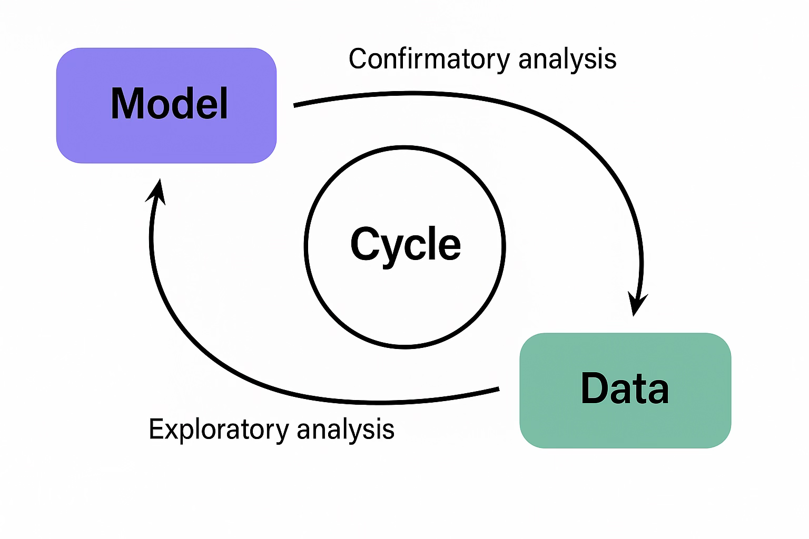
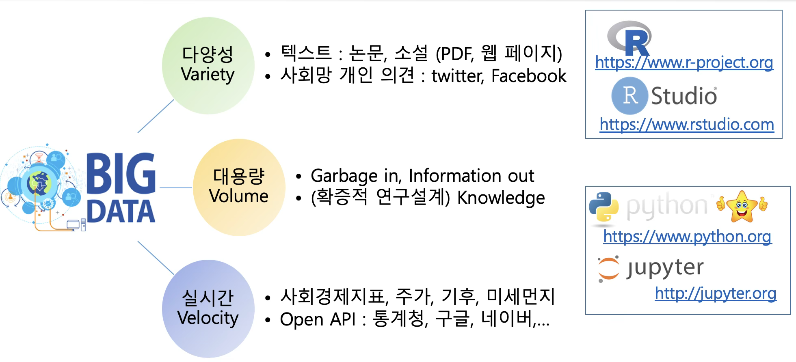
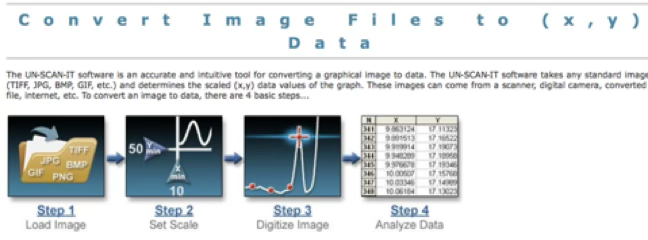
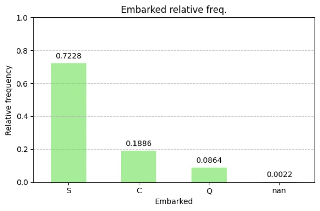
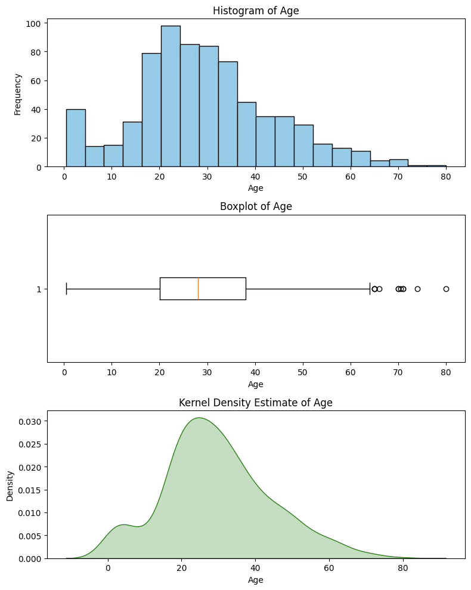

## 데이터란?

::: {.callout-note icon=false}
## 정의
**데이터(Data)**란 추론, 정보 획득, 계산에 사용되는 실제 조사되거나 측정된 값으로, 통계학에서는 단순한 숫자의 나열이 아니라 정보를 담고 있는 숫자의 체계적인 집합이다(Webster Dictionary).
:::

### 데이터 철학

과학은 단순한 이론의 축적이 아니라, 경험과 관찰, 모델과 검증, 이론과 현실 사이의 끊임없는 상호작용을 통해 발전해왔다. 아인슈타인의 상대성 이론이나 케플러의 행성 궤도 법칙처럼 이론적 통찰과 천문학적 관측을 바탕으로 탄생한 위대한 발견들은 역사에 길이 남지만, 과학의 진보 대부분은 반복적인 실험과 자료 분석을 통해 이루어진다.

이러한 흐름은 통계학이 과학의 핵심적인 실천 도구임을 명확히 보여준다.

**통계학자는 과학의 번역자이자 검증자이다.** 통계 전문가는 자연과학자, 공학자, 사회과학자가 제안한 이론이나 아이디어를 통계적 언어로 변환하는 역할을 수행한다.

먼저, 제시된 이론이나 현상에 대한 가설을 통계적으로 정의한다. 예를 들어, "A 약물이 B 약물보다 혈압을 더 많이 낮춘다"는 주장을 귀무가설과 대립가설로 구체화한다.

다음으로, 이 가설을 검정하기 위해 데이터를 수집하거나 실험을 설계한다. 이후 분석 결과를 바탕으로 가설의 유의성을 판단하며, 이러한 과정을 확증적 데이터 분석이라 한다. 반대로, 명시적 이론이 없는 상태에서 데이터를 먼저 탐색하여 새로운 규칙이나 관계를 발견하는 방식도 있다. 이를 탐색적 데이터 분석이라 하며, 특히 빅데이터 분석과 데이터 마이닝 분야에서 활발히 활용된다.

**탐색과 확증의 순환: 이론 발전의 실제 구조**: 과학 이론이 견고해지기 위해서는 탐색과 확증이 상호 순환하며 이론을 수정·보완하는 과정이 필수적이다. 이론, 데이터, 모형이 각각 독립적으로 존재하는 것이 아니라 유기적으로 순환하며 서로 영향을 주고받는다는 철학적 관점이 중요하다. 이를 위해서는 다음 세 가지 요소가 반드시 함께 고려되어야 한다.

1. **도메인 지식**: 의학, 농업, 교육 등 해당 분야에 대한 배경 지식 없이는 데이터 해석이나 의미 있는 가설 설정이 어렵다.
2. **통계 모형과 자료**: 자료 수집과 해석을 위해 적절한 통계 모형을 설정해야 하며, 수집된 자료는 해당 모형을 충실히 반영하도록 설계되어야 한다.
3. **이론--모형--데이터의 순환 구조**: 이론에서 모형을 도출하고, 데이터를 통해 이를 검정한 뒤, 결과를 반영해 이론을 수정하는 순환이 반복되어야 한다.

**데이터는 도구이자 통찰의 창구**: 통계학은 단순한 "숫자를 다루는 기술"이 아니라, 현상에 내재한 구조를 탐색하고 이를 이론으로 일반화하는 사고의 방식이다.

### 모형과 데이터의 순환 사이클

과학적 연구는 흔히 '이론을 먼저 제안하고, 이를 검증하기 위해 데이터를 수집하는 과정'으로 이해된다. 그러나 실제 연구 현장에서는 데이터가 먼저 수집되고, 그 안에서 의미 있는 패턴이나 관계를 발견한 뒤, 이를 바탕으로 새로운 이론이나 모형이 제시되는 경우가 훨씬 더 많다.

{fig-align="center" width="60%"}

따라서 통계에서의 모형과 데이터는 일방향적인 직선 구조가 아니라, 탐색과 확증이 반복되는 순환 구조를 형성한다.

::: {.callout-note icon=false}
## 모형과 데이터의 순환 흐름

| 단계 | 내용 |
|------|------|
| **① 데이터 수집** | 실험·관찰·센서 등 다양한 방법으로 자료 수집 |
| **② 탐색적 분석(EDA)** | 그래프·요약통계로 패턴·관계·이상값 파악, 잠정 모형 도출 |
| **③ 모형 수립** | 탐색에서 발견된 패턴을 설명하는 통계·수학적 모형 설정 |
| **④ 모형 검증(CDA)** | 유의성 검정·적합도 판단으로 모형-데이터 적합성 평가 |
| **⑤ 이론 수정·확장** | 검증 결과를 반영해 이론 강화 또는 수정 후 재순환 |
:::

**통계 모형은 현실의 '요약'일 뿐**: 통계학에서 말하는 모형은 현실의 '진실' 자체가 아니라, 현실을 설명하려는 수학적 요약 또는 근사에 불과하다. 예를 들어, 단순 회귀모형은 다음과 같이 표현된다.

$Y_{i} = \beta_{0} + \beta_{1}X_{i} + \varepsilon_{i}$

- $\beta_{0},\beta_{1}$은 모형의 계수로서, 변수 간의 관계를 요약한다.
- $\varepsilon_{i}$는 오차항으로, 모형이 설명하지 못한 부분을 나타낸다. 이 오차항은 $\varepsilon_{i} \sim N(0,\sigma^{2})$을 가정한다.

### 데이터 정의

통계학에서 데이터는 분석의 대상이 되는 개체로부터 변수를 측정하거나 관측하여 얻은 값들의 집합이다. 이러한 데이터는 수치일 수도 있고 문자일 수도 있으며, 표나 행렬과 같이 구조화되어야 분석이 가능하다.

**통계학에서의 데이터 구조**: 통계학에서 분석하는 데이터는 보통 행과 열로 구성된 2차원 테이블(또는 행렬) 형태를 가진다.

- 행: 개별 관측 단위, 즉 개체의 관측값
- 열: 각 개체에 대해 측정된 변수

$$\begin{bmatrix}
x_{11} & x_{12} & \cdots & x_{1p} \\
x_{21} & x_{22} & \cdots & x_{2p} \\
 \vdots & \vdots & \ddots & \vdots \\
x_{n1} & x_{n2} & \cdots & x_{np}
\end{bmatrix}$$

- $x_{ij}$는 $i$번째 개체의 $j$번째 변수에 대한 관측값이다.
- 총 $n$개의 개체, $p$개의 변수로 구성된 데이터를 $n \times p$ 행렬이라 부른다.

### 데이터 종류

데이터는 관측 대상의 특성을 표현한 정보이며, 그 특성의 종류에 따라 구분 기준과 분석 방법이 달라진다. 변수의 유형에 따라 적절한 요약 방법(예: 평균, 중앙값, 빈도 등)과 분석 기법(예: t-검정, 카이제곱 검정, 회귀분석 등)이 달라지기 때문이다.

#### 질적변수와 양적변수

::: {.callout-tip icon=false}
## 변수 유형 및 척도 비교

| 변수 유형 | 척도 | 특징 | 예시 |
|---------|------|------|------|
| **질적 변수** | 명목척도 | 분류·식별, 순서 없음 | 성별, 혈액형, 거주지 |
| **질적 변수** | 서열척도 | 순서 있음, 간격 불균등 | 학점(A/B/C), 만족도, 소득 수준(상/중/하) |
| **양적 변수** | 등간척도 | 간격 균등, 절대 0 없음 | 온도(°C), IQ, 리커트 척도 |
| **양적 변수** | 비율척도 | 절대 0 존재, 사칙연산 가능 | 키, 몸무게, 소득, 나이 |
:::

**질적 변수 qualitative variable**: 개체를 분류하거나 구분하기 위해 측정된 속성으로, 그 값은 숫자가 아니라 범주 형태로 주어진다.

- **명목척도**: 각 개체를 단순히 구분하거나 식별하는 목적으로 사용된다. 예를 들어 성별(남/여), 혈액형(A/B/O/AB), 거주지(서울/부산) 등이 이에 해당한다. 이 변수들은 계산이 불가능하며, 오직 같은지 다른지만 비교할 수 있다.
- **서열척도**: 명목척도와 달리 범주 간에 일정한 순서가 존재한다. 예를 들어 학점(A, B, C...), 소득 수준(상/중/하), 만족도(매우 만족 ~ 매우 불만족)와 같이 정해진 순서에 따라 분류된 변수들이다.

**양적 변수 quantitative variable**: 개체의 특성을 수치로 직접 측정한 변수로, 계산이 가능한 데이터를 제공한다. 키, 몸무게, 시험 점수, 소득, 교통량, 연령 등이 대표적인 예이다.

- **등간척도**: 변수의 값 사이 간격이 동일하다는 특징이 있지만, 절대적인 0의 의미가 없다. 대표적인 예로는 섭씨 또는 화씨 온도, 지능지수(IQ), 리커트 척도(예: 1~5점 척도)가 있다.
- **비율척도**: 등간척도의 성질을 모두 가지면서도, 0이 절대적 기준으로서 의미를 갖는다. 0은 '존재하지 않음'을 나타내며, 모든 사칙연산(+, -, ×, ÷)이 가능하다.

| | 구간 | 비율 | 순서 | 명목 |
|---|:---:|:---:|:---:|:---:|
| 빈도표 | X | X | X | X |
| 순서 있음 | | X | X | X |
| 최빈값 | X | X | X | X |
| 평균 | X | X | | |
| 중위수 | X | X | X | |
| +, - 가능 | X | X | | |
| 곱셈, 나누셈 | | X | | |
| 0의 개념, 배율 | | X | | |

: 척도 유형별 분석 가능 여부 {.striped}

#### 시간에 따른 데이터의 구분

통계학에서 데이터를 분류할 때 중요한 기준 중 하나는 시간의 흐름이 반영되었는가이다.

::: {.callout-tip icon=false}
## 횡단 자료 vs. 종단 자료

| 구분 | 횡단 자료 (Cross-sectional) | 종단 자료 (Time Series) |
|------|--------------------------|----------------------|
| **수집 기준** | 특정 시점, 여러 개체 | 동일 개체·현상, 시간 흐름 |
| **분석 초점** | 개체 간 비교 | 추세·계절성·주기성·예측 |
| **예시** | 2024년 500명 재학생 키·몸무게 | 2010~2024년 연도별 입학자 수 |
| **주요 기법** | t-검정, 회귀분석, ANOVA 등 | 시계열 분석, ARIMA 등 |
:::

**횡단 자료 Cross-sectional Data**: 일정한 시점에서 여러 개체에 대해 수집한 데이터이다. 시간 흐름을 고려하지 않기 때문에, 분석에서는 주로 개체 간 비교가 중심이 된다.

**종단 자료 Time Series Data**: 동일한 개체나 현상에 대해 시간의 흐름에 따라 연속적으로 수집한 데이터이다. 종단 자료에서는 추세(trend), 계절성(seasonality), 주기성(cycle), 예측 가능성 등 시간 구조의 특성이 중요하며, 시계열 분석 기법이 별도로 발달되어 있다.

#### 인과관계와 변수의 역할

통계 분석에서 가장 궁극적인 질문 중 하나는 "무엇이 무엇에 영향을 미치는가?", 다시 말해 인과관계에 대한 것이다.

**인과관계는 통계분석이 아닌 모형 설정에서 시작된다.** 인과 관계는 통계적 분석에 의해 '발견'되는 것이 아니라, 이론이나 경험에 기반해 '가정'되고, 그 가설이 통계적으로 '검증'되는 것이다. 즉, 어떤 변수($X$)가 다른 변수($Y$)에 영향을 미친다는 인과적 주장 자체는 통계분석의 결과가 아니라, 연구자의 이론적 배경, 선행 연구, 또는 실험적 설계에 근거한 전제로 설정된다.

**변수의 역할: 원인과 결과**

- **독립변수 (X)**: 원인으로 작용하는 변수이다. '독립변수' 외에도 요인(factor), 처리변수(treatment), 예측변수(predictor), 설명변수(explanatory variable), 내생변수(endogenous variable) 등의 용어로 불리기도 한다.
- **종속변수 (Y)**: 결과로 나타나는 변수이며, 독립변수의 변화에 영향을 받는다. 반응변수(response variable), 목표변수(target variable), 결과변수(outcome), 외생변수(exogenous variable) 등의 명칭으로도 사용된다.

통계적 유의성은 인과성 그 자체를 보장하지 않는다. 모형의 타당성은 분석 이전의 이론적 설계에 달려 있으며, 분석 결과는 그 이론을 지지하거나 반박할 수 있는 하나의 증거일 뿐이다.

#### 데이터의 표현 형식과 분석 가능성

현대의 통계학과 데이터 과학은 단순한 숫자 자료뿐 아니라 다양한 형태의 비정형 데이터를 포함하여 다룰 수 있는 범위를 넓혀가고 있다.

{fig-align="center" width="80%"}

**숫자(numeric) 형태의 데이터**: 통계학에서 가장 기본이 되는 데이터 형식이다. 그러나 숫자로 표현된 범주형(명목형) 데이터는 주의가 필요하다. 예를 들어, 성별을 남성(1), 여성(2)으로 부호화한다고 해도, '2는 1보다 크다'는 수학적 해석은 적용되지 않는다.

**문자(text) 데이터**: 자연어로 기록된 정보로, 텍스트 마이닝이나 자연어 처리(NLP) 기법을 통해 분석된다. 설문 응답의 자유서술형 항목, 뉴스 기사, SNS 댓글, 논문 초록 등 다양한 형태의 텍스트가 이에 해당한다.

**음성(audio) 데이터**: 인간의 대화를 포함한 소리의 파형으로, 디지털 신호처리 기술을 통해 시간 단위의 수치 데이터로 변환되며, 음성 분석, 감정 분석, 화자 인식 등 다양한 분석이 가능해진다.

{fig-align="center" width="80%"}

## 데이터와 확률변수

### 확률이란 무엇인가?

확률(probability)은 어떤 사건이 발생할 가능성을 의미한다. 일상 대화에서 사람들은 확실한 표현을 선호한다. 예를 들어, "오늘 비가 올 거야" 또는 "정오에 만나자"와 같이 말한다. 그러나 현실에서 확실한 일은 거의 없으며, 우리의 삶은 대부분 확률적(probabilistic) 요소로 구성되어 있다.

**관찰 편향이 확률 추정의 오류를 유발한다.** 관찰 편향(observation bias)이란, 어떤 사건을 직접 겪거나 목격한 경험이 해당 사건의 실제 발생 빈도를 왜곡해 인식하게 만드는 현상이다. 대표적인 사례가 항공기 사고에 대한 두려움이다. 많은 이들이 비행기를 탈 때 "착륙하면 연락해"라는 당부를 받지만, 통계적으로는 비행 중보다 공항까지 이동하는 자동차 운전이 훨씬 위험하다. 2013년 미국의 경우 자동차 사고 사망자는 약 3만4천 명, 상업용 항공기 사고 사망자는 5명에 불과했다.

**반복적 노출은 간접적인 관찰 편향을 초래한다.** 관찰 편향의 한 형태는 동일한 주장이나 정보를 반복적으로 접하면서 형성된다. 예를 들어, "어린이들은 스마트폰 때문에 공부에 집중하지 못한다"는 말을 방송, 기사, 주변 대화에서 여러 번 듣다 보면, 실제 통계 자료를 확인하지 않았더라도 그 주장이 사실이라고 믿게 될 수 있다.

**아무리 드문 사건이라도 시도 횟수가 충분하면 결국 발생한다.** 지구와 소행성 충돌 가능성에 적용해 보자. 1년 안에 지구에 위험한 소행성이 충돌할 확률은 0.0003%로, 단기간에는 사실상 발생하지 않는 사건이다. 그러나 이 확률이 1만 년 동안 매년 반복되면 누적 확률은 약 3%로 증가한다. 10만 년이면 약 30%, 100만 년이면 약 96%에 이른다.

### 확률변수와 데이터

통계학은 데이터를 수집하고 요약하는 기술에서 나아가, 그 데이터가 관측되기 전부터 어떤 값이 나올 가능성이 얼마나 되는지를 미리 수학적으로 설명하려는 이론적 틀, 즉 확률 이론을 바탕으로 한다.

**확률변수란 무엇인가?** 확률변수(random variable)는 어떤 실험이나 조사에서 관측 가능한 결과를 숫자로 대응시키는 함수이다. 예를 들어, 동전을 던져 앞(Head)이 나오면 1, 뒤(Tail)이 나오면 0으로 대응시키는 것이 확률변수의 가장 단순한 예이다.

**데이터와 확률변수의 연결**: 통계학에서 수집되는 데이터는 확률변수가 실제로 실현된 결과이며, 관측값 하나하나는 확률변수가 취할 수 있는 값 중 하나다. 정리하면, 데이터는 확률변수의 표본 실현값, 즉 관측된 값들이며, 확률변수는 그 데이터를 산출한 수학적 메커니즘이다.

**확률분포와 확률밀도함수**: 확률변수는 어떤 값이 얼마나 자주 발생할 가능성이 있는가에 대한 정보도 함께 가진다. 이러한 정보를 정리한 것이 바로 확률분포이다. 확률분포는 이산형 확률변수의 경우 확률질량함수로, 연속형 확률변수의 경우 확률밀도함수로 정의된다.

**확률밀도함수(PDF)의 의미**: 연속형 확률변수에 대해, 확률밀도함수 $f(x)$는 다음과 같은 의미를 가진다.

$f(x)$ 자체는 특정 값 $x$의 확률이 아니라, 해당 점에서의 상대적인 가능성을 나타내는 밀도이다.

실제 확률은 구간 단위로 계산되며, 예를 들어 $a \leq X \leq b$의 확률은 $P(a \leq X \leq b) = \int_{a}^{b}f(x)dx$로 주어진다.

**PDF는 데이터가 가진 모든 정보를 담고 있다.** 확률밀도함수는 단순히 가능성만 나타내는 것이 아니라, 데이터가 가질 수 있는 전체적인 구조적 특성을 요약한다.

- $f(x)$의 정점은 가장 자주 관측되는 값(최빈값, mode)을 의미
- 곡선의 넓이는 특정 범위 내에서 값이 나타날 가능성(확률)을 보여준다.
- 분포의 비대칭성(skewness)이나 퍼짐(spread) 등도 함수 형태를 통해 직관적으로 이해할 수 있다.

## 데이터와 요약통계

일변량 분석은 하나의 변수에 대한 자료 분포를 이해하고 요약하는 데 목적을 둔다. 이때 가장 기본적이고 핵심적인 분석 도구는 숫자 요약이며, 이는 주어진 데이터가 어떠한 중심 경향, 산포, 그리고 분포 형태를 갖고 있는지를 수치적으로 요약하여 설명한다.

### 범주형 데이터

범주형 변수는 관측값이 수치가 아닌 범주 또는 집단 수준에서 구분되는 변수를 의미한다. 예를 들어, 성별(남/여), 지역(서울/부산/광주), 고객 등급(일반/우수/VIP) 등이 이에 해당한다. 이러한 변수에 대한 일변량 분석은 수치적 요약보다는 빈도와 비율을 통한 분포의 구조 파악에 초점을 둔다.

**숫자요약: 빈도분석**: 범주형 변수에서 가장 기본적인 분석은 각 범주에 속하는 관측값의 수를 세는 것이다. 이를 빈도라고 하며, 전체 관측 수에 대한 상대빈도(비율)도 함께 제시한다. 범주형 데이터의 상대빈도는 (실증적) 확률밀도함수이다.

**시각화 도구**

- **막대그래프(Bar Chart)**: 각 범주에 해당하는 빈도 또는 비율을 막대의 높이로 나타냄
- **원그래프(Pie Chart)**: 전체에서 각 범주가 차지하는 비율을 원의 부채꼴 면적으로 표현

```python
import seaborn as sns
import pandas as pd
import matplotlib.pyplot as plt
# 데이터 불러오기
titanic = sns.load_dataset("titanic")
# 2. embarked 변수의 빈도 계산
freq_table = titanic['embarked'].value_counts(dropna=False)
rel_freq_table = titanic['embarked'].value_counts(normalize=True, dropna=False)
# 3. 빈도표와 상대빈도표 결합
embarked_summary = pd.DataFrame({
    '빈도': freq_table,
    '상대빈도': rel_freq_table.round(4)
})
print(embarked_summary)
# 막대그래프 그리기
plt.figure(figsize=(6, 4))
ax = rel_freq_table.plot(kind='bar', color='lightgreen')
plt.title("Embarked relative freq.")
plt.xlabel("Embarked")
plt.ylabel("Relative frequency")
plt.ylim(0, 1)
plt.xticks(rotation=0)
plt.grid(axis='y', linestyle='--', alpha=0.7)
# 막대 위에 상대빈도 값 표시
for i, v in enumerate(rel_freq_table):
    ax.text(i, v + 0.02, f"{v:.4f}", ha='center', va='bottom', fontsize=10)
plt.tight_layout()
plt.show()
```

embarked  빈도    상대빈도
<br>
S         644  0.7228
<br>
C         168  0.1886
<br>
Q          77  0.0864
<br>
NaN         2  0.0022

{fig-align="center" width="80%"}

### 측정형 데이터

측정형 자료는 수치적 값을 가지며, 관측값 간의 간격이나 비율이 의미 있는 변수로 구성된다. 주요 요약 지표로는 중심 경향, 산포도, 분포 형태, 그리고 상대적 산포(변동계수) 등이 있다.

**중심경향 척도**: 중심 경향은 데이터가 어디에 몰려 있는가를 나타낸다.

::: {.callout-note icon=false}
## 중심경향 척도 비교

| 척도 | 정의 | 특징 | 권장 상황 |
|------|------|------|---------|
| **산술평균** | $\overline{x} = \frac{1}{n}\sum x_i$ | 계산 간단, 이상값에 민감 | 이상값 없는 정규분포 자료 |
| **중앙값** | 정렬 후 정중앙 값 | 이상값에 강건(robust) | 이상값 있거나 비대칭 분포 |
| **최빈값** | 가장 자주 나타나는 값 | 이산형 자료에 유용 | 범주형·명목형 자료 |
:::

- **산술평균 mean**: $\overline{x} = \frac{1}{n}\overset{n}{\sum_{i = 1}}x_{i}$, 전체 자료의 평균적인 크기를 나타내는 중심 척도로, 계산이 간단하고 널리 사용되지만 이상값에 민감하다는 단점을 가진다.
- **중앙값 median**: $MD = x_{((n + 1)/2)}$, 데이터를 크기순으로 정렬했을 때 정중앙에 위치한 값으로, 이상값이나 극단값의 영향을 거의 받지 않는다.
- **최빈값 mode**: 가장 자주 나타나는 값으로, 특히 이산형 자료에서 중심 경향을 설명하는 데 유용하다.

**산술평균 대안 중심경향 척도**: 산술평균은 극단값(이상값)에 민감하다는 단점이 있다. 이에 따라 통계 분석에서는 특정 상황에 맞는 대안적 평균값을 사용한다.

**기하평균 (Geometric Mean)**: 모든 값의 곱을 표본크기 $n$-제곱근 한 값으로 정의된다. 주로 비율 자료나 성장률 분석에 적합하다.

$$\text{기하평균} = \left( \prod_{i = 1}^{n}x_{i} \right)^{\frac{1}{n}},\quad \log(\text{기하평균}) = \frac{1}{n}\overset{n}{\sum_{i = 1}}\log x_{i}$$

**조화평균 (Harmonic Mean)**: 각 관측값의 역수의 평균의 역수로 정의된다. 주로 속도, 밀도, "단위당 값"이 중요할 때 사용된다.

$$\text{조화평균} = \frac{n}{\sum_{i = 1}^{n}\frac{1}{x_{i}}},\quad x_{i} > 0$$

- 사용 사례: 평균 속도 계산: 왕복 60km/h ↔ 40km/h → 평균속도는 산술평균(50km/h)이 아니라 조화평균(48km/h)

**절사 평균 (Trimmed Mean)**: 자료의 상하위 일부를 제거하고, 나머지 값으로 평균을 구하는 방법이다. 보통 상하위 $k\%$의 값을 제거하며, 중심부의 데이터만으로 평균을 산출한다.

- 이상값에 민감한 평균의 보완
- 소득, 주가, 측정 오차 포함 데이터 등에서 유용

**윈저화 평균 (Winsorized Mean)**: 절사 평균과 달리, 극단값을 제거하지 않고 상하위 극단값을 중앙값에 가까운 값으로 치환한 후 평균을 계산한다.

- 이상값의 영향 완화 + 데이터 유지
- robust 통계학에서 빈번히 사용

**중앙절사평균 (Midmean 또는 Interquartile Mean)**: 전체 데이터 중 중간 50% 구간(제1사분위수 Q₁ ~ 제3사분위수 Q₃)에 해당하는 값들의 평균을 의미한다.

**가중평균 (Weighted Mean)**: 각 데이터에 중요도 또는 빈도에 해당하는 가중치를 부여하여 계산하는 평균이다.

$$\overline{x}_w = \frac{\sum_{i=1}^{n}w_{i}x_{i}}{\sum_{i=1}^{n}w_{i}},\quad w_{i} > 0$$

- 사용 사례: 성적 계산 (중간고사 40%, 기말고사 60%), 소비자물가지수 계산, 층화 표본조사에서 표본 비율 보정

**퀀타일 평균 (Quantile Mean 또는 Truncated Mean)**: 특정 분위수 범위(예: 하위 10%~상위 90%)에 속하는 관측값만을 사용하여 평균을 계산하는 방식이다.

**흩어짐 척도**: 산포는 데이터가 평균을 중심으로 얼마나 퍼져 있는지를 나타낸다.

- **분산 variance**: $s^{2} = \frac{1}{n - 1}\overset{n}{\sum_{i = 1}}(x_{i} - \overline{x})^{2}$
- **표준편차 standard deviation**: $s = \sqrt{s^{2}}$, 분산의 제곱근으로, 원래 데이터와 동일한 단위로 표현된다.
- **범위 range**: $\text{Range} = \max(x) - \min(x)$
- **사분위 범위 interquartile range**: $\text{IQR} = Q_{3} - Q_{1}$, 중간 50% 데이터의 범위이며, 이상값에 덜 민감하다.

**상대적 산포**: 변동계수(CV)는 표준편차를 평균으로 나눈 비율로, 자료의 상대적 산포 크기를 나타낸다. 서로 단위가 다르거나, 평균 크기가 현저히 다른 두 변수의 산포 비교에 유용하다.

$$\text{CV} = \frac{s}{\overline{x}} \times 100\%$$

**분포의 형태**: 분포의 형태는 자료가 좌우로 대칭적인지, 중심에 집중되어 있는지를 나타낸다.

- **왜도 skewness**: $\text{Skewness} = \frac{1}{n}\overset{n}{\sum_{i = 1}}\left( \frac{x_{i} - \overline{x}}{s} \right)^{3}$, 값이 0에 가까우면 대칭 분포, 양수면 오른쪽 꼬리, 음수면 왼쪽 꼬리가 긴 분포이다.
- **첨도 kurtosis**: $\text{Kurtosis} = \frac{1}{n}\overset{n}{\sum_{i = 1}}\left( \frac{x_{i} - \overline{x}}{s} \right)^{4}$, 정규분포의 첨도는 3이며, 이보다 크면 뾰족, 작으면 평평한 분포이다.

**시각화 도구**

- **히스토그램 histogram**: 연속 데이터를 구간별로 나누어 빈도를 막대그래프로 표현
- **상자그림 boxplot**: 중앙값, 사분위수, 이상값을 함께 보여주는 요약 도표
- **커널함수 Kernel Density Estimation**: 히스토그램처럼 구간을 나누지 않고, 각 데이터 점마다 커널(kernel) 함수를 얹어서 전체를 합쳐 확률밀도 함수를 근사

```python
import seaborn as sns
import pandas as pd
import matplotlib.pyplot as plt
from scipy.stats import trim_mean
from scipy.stats.mstats import winsorize
import numpy as np
# 데이터 불러오기 및 결측치 제거
titanic = sns.load_dataset("titanic")
age = titanic['age'].dropna()
# 시각화: 히스토그램, 상자그림, KDE
fig, axs = plt.subplots(3, 1, figsize=(8, 10))
# 1. 히스토그램
axs[0].hist(age, bins=20, color='skyblue', edgecolor='black')
axs[0].set_title('Histogram of Age')
axs[0].set_xlabel('Age')
axs[0].set_ylabel('Frequency')
# 2. 상자그림
axs[1].boxplot(age, vert=False)
axs[1].set_title('Boxplot of Age')
axs[1].set_xlabel('Age')
# 3. KDE (커널 밀도 추정)
sns.kdeplot(age, ax=axs[2], fill=True, color='green')
axs[2].set_title('Kernel Density Estimate of Age')
axs[2].set_xlabel('Age')
plt.tight_layout()
plt.show()
# 통계량 계산
mean_age = age.mean()
std_age = age.std()
cv_age = std_age / mean_age * 100
trimmed_mean_5 = trim_mean(age, proportiontocut=0.05)
winsorized_age = winsorize(age, limits=0.05)
winsorized_mean_5 = winsorized_age.mean()
# 출력
print(f"산술평균: {mean_age:.2f}")
print(f"표본 표준편차: {std_age:.2f}")
print(f"변동계수: {cv_age:.2f}%")
print(f"5% 절사평균: {trimmed_mean_5:.2f}")
print(f"5% 윈저화 평균: {winsorized_mean_5:.2f}")
```

산술평균: 29.70
<br>
표본 표준편차: 14.53
<br>
변동계수: 48.91%
<br>
5% 절사평균: 29.38
<br>
5% 윈저화 평균: 29.44

{fig-align="center" width="80%"}
