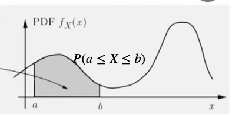
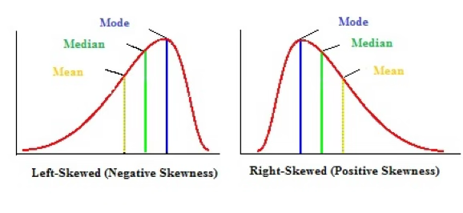
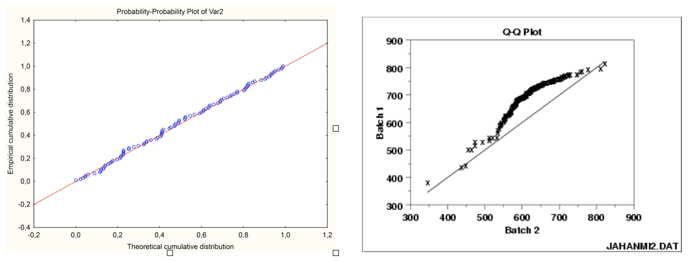
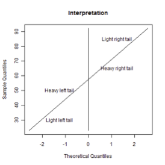
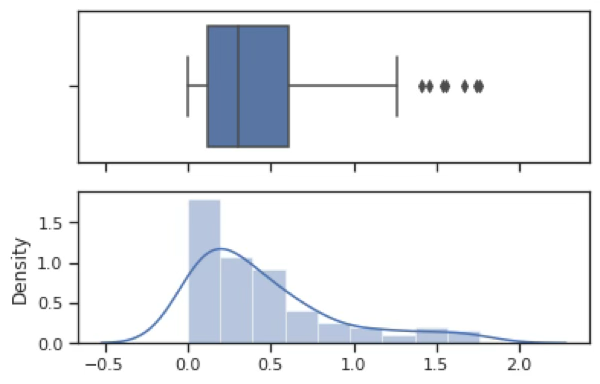
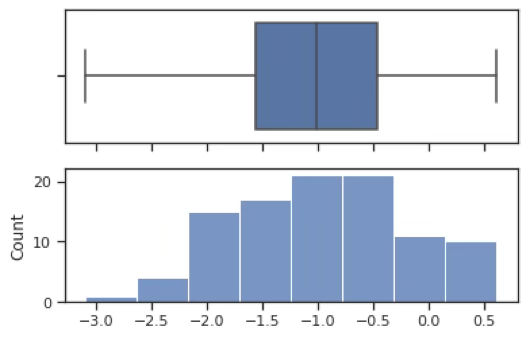

## 치우침

::: {.callout-note icon=false}
## 정의
**치우침(Skewness)**은 통계학에서 데이터 분포의 비대칭성을 나타내는 개념으로, 관측값들이 평균을 중심으로 얼마나 균형 있게 분포되어 있는지를 설명한다. 치우침 값이 양수이면 오른쪽으로 긴 꼬리를, 음수이면 왼쪽으로 긴 꼬리를 가진다.
:::

치우침 개념은 통계학적으로 매우 중요한 의미를 가진다. 첫째, 치우침은 평균과 중앙값의 위치 차이를 설명하며, 대표값 선택이나 데이터 해석의 기준을 제공한다. 둘째, 치우침은 정규성 가정의 검토에 핵심적인 역할을 한다. 셋째, 치우침은 이상치나 극단값의 존재 가능성을 시사한다.

### 치우침 개념

#### 확률분포함수

확률분포함수는 데이터(확률변수)에 대한 모든 정보를 가지고 있다. 확률변수 관심 구간 $(a,b)$에 데이터가 발생할 가능성(확률)을 알 수 있다. 최대값, 최소값, 데이터의 기대값(중앙 위치), 흩어짐 정도 등을 알 수 있다.

{fig-align="center" width="50%"}

서로 상이한 집단이 혼재되어 있는지를 보여주는 최빈값(봉우리)의 개수도 나타내고 봉우리 중심으로 데이터의 흩어진 형태도 보여준다. 봉우리를 중심으로 데이터가 벨모양인지 아니면 꼬리가 서로 다른 형태인지 보여준다.

#### 치우침 종류

종모양의 좌우 대칭인 분포와 달리 한 쪽 꼬리가 긴 형태를 갖는 분포는 치우침(skewed)이 있다고 한다. 오른쪽 꼬리가 긴 형태를 우로(right) 치우침 혹은 양의(positive) 치우침이라 하고 왼쪽 꼬리가 긴 형태를 좌로(left) 치우침 혹은 음의(negative) 치우침이라 한다.

{fig-align="center" width="80%"}

::: {.callout-tip icon=false}
## 치우침 종류 비교

| 구분 | 좌로 치우침 (Negative) | 우로 치우침 (Positive) |
|------|-------------------|--------------------|
| **꼬리 방향** | 왼쪽 꼬리가 긴 형태 | 오른쪽 꼬리가 긴 형태 |
| **평균 vs 중앙값** | 평균 < 중앙값 | 평균 > 중앙값 |
| **왜도 값** | 음수 (skew < 0) | 양수 (skew > 0) |
| **대표 예시** | 높은 점수 시험 (소수 낙제) | 소득 분포, 주가 |
| **권장 변환** | 반전 후 제곱근·로그 | 로그, 제곱근, 역수 |
:::

**좌로 치우침**: 좌로 치우침(left-skewed distribution)은 분포의 왼쪽 꼬리가 길게 늘어진 형태로, 상대적으로 작은 값들이 많거나 극단적으로 작은 값이 일부 존재하기 때문에 평균이 중앙값보다 더 작게 계산되는 경향이 있다. 예를 들어, 대부분의 학생이 높은 점수를 받은 시험에서 소수의 낙제자가 존재할 경우, 평균 점수는 낮아질 수 있지만 중앙값은 여전히 높은 수준에 머무르게 된다.

**우로 치우침**: 우로 치우침(right-skewed distribution)은 분포의 오른쪽 꼬리가 길게 늘어진 형태로, 일부 큰 값들이 평균을 끌어올리는 특징을 가진다. 대표적인 예로는 소득 분포가 있으며, 대부분의 사람들은 중간 이하의 소득을 가지지만 소수의 고소득자가 평균을 크게 끌어올려 평균 > 중앙값이 되는 현상이 나타난다.

### 치우침과 통계적 추론

**치우침 문제와 통계적 추론의 관계**: 치우침은 단일 변수의 분포 형태를 이해하는 데 중요한 개념으로, 통계 분석 초기 단계에서 데이터를 시각화하고 분포의 대칭성 여부를 점검하는 데 사용된다. 특히 확률표본을 전제로 할 때, 표본의 확률분포 함수는 모집단 확률변수의 분포와 동일하다고 간주할 수 있으므로, 히스토그램 등을 통해 데이터의 분포 형태를 살펴보는 것이 바람직하다.

그러나 통계학의 모수 추론에서는 실제로 모집단의 확률분포 형태보다 추정량의 샘플링 분포가 더 중요한 역할을 한다. 평균이나 비율과 같은 추정량은 중심극한정리에 의해, 모집단이 비정규분포일지라도 표본 크기가 충분히 크다면 그 샘플링 분포는 정규분포에 근사하게 된다. 일반적으로 표본 크기가 20~30 이상일 경우 이러한 근사 정규성이 성립한다고 본다.

반면 표본의 크기가 작거나, 평균이 아닌 분산과 같은 다른 모수에 대해 추론하고자 할 때는 모집단이 정규분포를 따른다는 전제가 필요해진다.

**통계 모형 (변수 관계)**: 통계 모형은 변수들 간의 관계를 수량적으로 설명하고 예측하는 도구이며, 이때 변수들은 크게 두 가지로 구분된다. 결과에 해당하는 변수는 목표변수라 하며, 이는 확률변수로 간주되어 확률분포함수를 가진다. 반면, 목표변수에 영향을 주는 변수들은 예측변수라고 하며, 이는 일반적으로 수집된 값으로 주어진 결정변수로 취급되어 확률분포함수를 갖지 않는다.

통계 모형, 특히 회귀분석과 같은 예측 모형에서는 오차항의 분포가 정규분포를 따른다는 가정이 매우 중요하다. 이러한 이유로 통계 모형에서는 예측변수와 목표변수 모두가 정규분포에 근사할수록 분석의 안정성과 해석 가능성이 높아진다.

### 치우침 진단 통계량

::: {.callout-note icon=false}
## 왜도(Skewness) 통계량 종류

| 통계량 | 공식 | 정규분포 값 |
|--------|------|:----------:|
| **크기 왜도 (Pearson moment)** | $\dfrac{\sum(x_i-\bar x)^3/n}{(\sum(x_i-\bar x)^2/n)^{3/2}}$ | 0 |
| **최빈값 기반 (mode skewness)** | $\dfrac{mean - mode}{std}$ | 0 |
| **중앙값 기반 (median skewness)** | $\dfrac{3(mean - median)}{std}$ | 0 |
| **사분위 기반** | $\dfrac{Q_3+Q_1-2Q_2}{IQR}$ | 0 |
| **Groeneveld & Meeden** | $\dfrac{mean - median}{E(\|X - median\|)}$ | 0 |

양수 → 우로 치우침, 음수 → 좌로 치우침, 0 → 좌우 대칭
:::

**크기 왜도 Pearson moment skewness**

$$skew = \frac{\sum(x_{i} - \overline{x})^{3}/n}{(\sum(x_{i} - \overline{x})^{2}/n)^{\frac{3}{2}}}$$

좌우대칭인 정규분포, $t$-분포 등의 왜도는 0이고 우로 치우친 분포 평균이 1인 지수분포는 2이다.

**순서 왜도**: 정규분포=0, 우로 치우침 +, 좌로 치우침을 나타내지만 각 통계량의 분포를 모르므로 정규분포 가설을 검정할 수 없다.

**Pearson first skewness (mode skewness)**

$$skew = \frac{mean - mode}{std}$$

**Pearson's second skewness coefficient (median skewness)**

$$skew = \frac{3(mean - median)}{std}$$

**사분위 기반 왜도**

$$skew = \frac{(Q_{3} + Q_{1} - 2Q_{2})}{IQR}$$

**Groeneveld & Meeden's coefficient**

$$skew = \frac{mean - median}{E(|X - median|)}$$

## 정규성 검정

### 정규성 검정 필요성

정규성 검정(normality test)은 주어진 데이터가 정규분포를 따른다고 볼 수 있는지를 통계적으로 판단하는 절차이다. 이는 많은 통계 기법들이 데이터 또는 오차항이 정규분포를 따른다는 전제 하에 수행되기 때문에, 분석의 전제 조건을 확인하는 중요한 단계로 간주된다.

::: {.callout-note icon=false}
## 정규성 검정이 필요한 이유

| 이유 | 내용 |
|------|------|
| **모수적 방법의 전제 확인** | t-검정·회귀분석·ANOVA 등은 오차항 또는 데이터 자체의 정규성을 전제함 |
| **소표본 분석** | 중심극한정리로 대표본은 덜 민감하지만, 소표본일수록 정규성 가정이 중요 |
| **모형 진단과 적합성 평가** | 오차항의 정규성이 깨지면 t·F-검정의 신뢰성이 저하됨 |
| **변환 또는 분석 전략 결정** | 정규성 미충족 시 로그 변환, Box-Cox, 비모수 검정 등 대안 선택에 활용 |
:::

정규성 검정은 크게 두 가지 방법으로 수행된다. 시각적 방법으로는 히스토그램, Q-Q 그래프, P-P 그래프 등이 있으며, 정량적 방법으로는 Shapiro-Wilk 검정, Kolmogorov-Smirnov 검정, Anderson-Darling 검정, Jarque-Bera 검정 등이 사용된다.

### 정규성 검정방법

::: {.callout-tip icon=false}
## 정규성 검정 방법 비교

| 방법 | 통계량 | 특징 | 권장 상황 |
|------|--------|------|---------|
| **히스토그램·Q-Q·P-P 그래프** | 시각적 | 직관적 판단, 꼬리 형태 확인 | 탐색적 분석 |
| **Shapiro-Wilk** | W (0~1) | 소표본에서 강력 | $n \leq 50$ (1000까지 사용) |
| **Kolmogorov-Smirnov** | D (최대 거리) | 모수 지정 필요 | 모수 사전 알고 있을 때 |
| **Anderson-Darling** | $A^2$ | 꼬리 부분 더 민감 | 정규성 검정 특화 |
| **Jarque-Bera** | JB (왜도·첨도) | 모멘트 기반 | 회귀 잔차 정규성 |
:::

**통계적 가설**: 정규성 검정은 데이터(확률변수)의 분포가 정규분포를 따르는지 검정하는 분포 적합성(goodness of fits) 검정이다.

- 귀무가설: 데이터 모집단 분포는 정규분포이다.
- 대립가설: 정규분포를 따르지는 않는다.

```python
#데이터 생성하기
import numpy as np
data=np.random.exponential(0.5,100)
data.mean()
```

0.455767

평균이 0.5인 지수분포를 따르는 난수 데이터 100개를 표본추출하여 변수명 X로 한 data를 만들었다. 평균이 0.5인 모집단에서 생성했지만 실제 평균은 0.456이었다. 랜덤 생성이므로 실행할 때마다 결과는 다르다.

```python
#그래프 요약, 히스토그램, 상자수염그림
import seaborn as sns
import matplotlib.pyplot as plt
sns.set(style="ticks")
f, (ax_box, ax_hist) = plt.subplots(2,sharex=True)
sns.boxplot(X, ax=ax_box)
sns.distplot(X, ax=ax_hist)
plt.show()
```

지수분포로 우로 치우친 형태를 가지고 있다. 극단치(outliers) 여러 개가 존재한다.

{fig-align="center" width="80%"}

**Shapiro-Wilk W-통계량**: W값은 0과 1 사이의 값을 가지며, 1에 가까울수록 데이터가 정규분포에 가깝다.

$$W = \frac{\left( \sum_{i = 1}^{n}a_{i}x_{(i)} \right)^{2}}{\sum_{i = 1}^{n}(x_{i} - \overline{x})^{2}}$$

여기서 $x_{(i)}$는 정렬된 표본 데이터 (오름차순 순위), $\overline{x}$은 표본 평균, $a_{i}$는 기대값과 분산공분산 행렬을 기반으로 계산된 상수이다.

다음은 정규성 검정 통계량 변환 (Z-값으로 표준화)이다. $W_{n}$는 Shapiro-Wilk 검정 통계량이고 $\mu,\sigma,\gamma$은 표본크기 n에 따라 정해지는 보정 계수이다.

$$Z_{n} = \begin{cases}
\frac{- \log(\gamma - \log(1 - W_{n})) - \mu}{\sigma}, & \text{if } 4 \leq n \leq 11 \\
\frac{\log(1 - W_{n}) - \mu}{\sigma}, & \text{if } 12 \leq n \leq 2000
\end{cases}$$

```python
#샤피로윌크 정규성검정
import scipy.stats as stats
chisq,p_value=stats.shapiro(data)
print("검정통계량=",chisq,"유의확률",p_value)
```

검정통계량= 0.84497141 유의확률 7.765954990190949e-09

유의확률이 <0.001이므로 귀무가설(정규분포를 따른다)이 기각되어 데이터는 정규분포를 따르지 않는다.

**Kolmogorov D-통계량**: 관측된 누적분포함수와 이론 누적분포함수 간의 최대 거리를 검정한다.

$$D = \max_{x}\left| F_{n}(x) - \Phi(x) \right|$$

여기서 $\Phi(x)$는 이론적 분포함수, $F_{n}(x)$는 데이터 분포함수이다.

```python
import scipy.stats as stats
stats.kstest(data,'norm',args=(data.mean(),data.std()))
```

KstestResult(statistic=np.float64(0.1484722011700535), pvalue=np.float64(0.02177174264952343) 유의확률이 0.05보다 작으므로 귀무가설이 기각되어 정규분포를 따르지 않는다.

적합성 검정 가능한 분포: `dist{'norm', 'expon', 'logistic', 'gumbel', 'gumbel_l', 'gumbel_r', 'extreme1'}`

- 귀무가설: 데이터는 지수분포를 따른다.
- 대립가설: 데이터는 지수분포를 따르지 않는다.

유의확률이 0.629로 귀무가설을 기각하지 못하므로 지수분포를 따른다.

```python
import scipy.stats as stats
stats.kstest(data,'expon',args=(0,data.mean()))
```

KstestResult(statistic=np.float64(0.047886640415504195), pvalue=np.float64(0.9675172438463417), 유의확률이 0.96이므로 귀무가설이 채택되어 데이터는 지수분포를 따른다.

**Anderson-Darling AD 통계량**: K-S 검정보다 꼬리 부분에 더 민감한 가중 적분 기반 검정이다.

$$A^{2} = n\int_{- \infty}^{\infty}\frac{\lbrack F_{n}(x) - \Phi(x)\rbrack^{2}}{\Phi(x)(1 - \Phi(x))}d\Phi(x)$$

여기서 $\Phi(x)$는 이론적 분포함수, $F_{n}(x)$는 데이터 분포함수이다.

통계량 값이 6.69로 가장 큰 기각역 값 1.053 (여기에 해당하는 유의수준은 0.01)보다 크므로 귀무가설이 기각되어 정규분포를 따르지 않는다.

```python
import scipy.stats as stats
stats.anderson(data,dist='norm')
```

AndersonResult(statistic=np.float64(4.621782528955748), critical_values=array([0.555, 0.632, 0.759, 0.885, 1.053]), significance_level=array([15. , 10. ,  5. ,  2.5,  1. ]), fit_result=  params: FitParams(loc=np.float64(0.46777570761475146), scale=np.float64(0.4466578954689332))

통계량 4.621782528955748이 유의수준 1% 기각역 1.053보다 매우 크므로 귀무가설이 기각되어 정규분포를 따르지 않는다.

대부분의 분포에 대한 적합성 검정은 가능하다.

- 귀무가설: 데이터는 지수분포를 따른다.
- 대립가설: 데이터는 지수분포를 따르지 않는다.

```python
import scipy.stats as stats
stats.anderson(data,dist='expon')
```

AndersonResult(statistic=np.float64(0.2290116329263725), critical_values=array([0.917, 1.072, 1.333, 1.596, 1.945]), significance_level=array([15. , 10. ,  5. ,  2.5,  1. ])

유의수준 15% 기각값보다 작으므로 귀무가설을 기각하지 못하므로 지수분포를 따른다.

::: {.callout-note icon=false}
## 지수분포 데이터 정규성 검정 결과 종합

| 검정 방법 | 통계량 | 유의확률 | 정규분포 결론 | 지수분포 결론 |
|---------|--------|---------|:----------:|:---------:|
| **Shapiro-Wilk** | W = 0.845 | p < 0.001 | 기각 ⚠ | — |
| **K-S** | D = 0.148 | p = 0.022 | 기각 ⚠ | 채택 ✓ (p=0.968) |
| **Anderson-Darling** | A² = 4.622 | (1% 임계값 초과) | 기각 ⚠ | 채택 ✓ (15% 미만) |

**결론**: 세 가지 검정 모두 정규분포 가정을 기각. K-S 및 AD 검정에서 지수분포 적합성은 채택되어, 데이터는 지수분포를 따른다.
:::

### 시각적 방법

Probability Plot은 정규성 검정 또는 두 분포의 유사성을 시각적으로 평가하기 위한 방법으로, 이론적 분포함수와 데이터의 분포함수가 얼마나 유사한지를 그래프를 통해 보여준다.

- 두 데이터의 실증적(empirical) 분포함수는 동일한가?
- 이론적 분포함수와 데이터의 분포함수는 동일한가?

::: {.callout-tip icon=false}
## P-P 그래프 vs. Q-Q 그래프

| 구분 | P-P 그래프 | Q-Q 그래프 |
|------|-----------|-----------|
| **비교 기준** | 누적확률 (CDF) | 분위수 (Quantile) |
| **X축** | 이론 누적확률 $\Phi(z)$ | 이론 분위수 $\Phi^{-1}(p_i)$ |
| **Y축** | 데이터 누적확률 $F(x)$ | 데이터 순서통계량 $y_{(i)}$ |
| **장점** | 분포 전 구간 균형 있게 평가 | 꼬리 부분 적합성 차이에 민감 |
| **판단 기준** | 45도 대각선 근접 여부 | 45도 직선 근접 여부 |
:::

**Probability-Probability plot**: 두 분포의 누적분포함수(CDF) 값을 비교하는 그래프이다. X축에는 이론 분포(예: 정규분포)의 누적확률 값을, Y축에는 표본 데이터의 누적확률 값을 대응시켜 그린다. 만약 두 분포가 유사하다면, 모든 점이 대각선 직선 위에 놓이게 된다.

두 데이터의 누적분포함수를 2차원 그래프에 표현: X-축에는 정규분포의 누적분포함수 $\phi(z)$, Y-축에는 데이터 누적분포함수 $F(x)$

**Quantile-Quantile plot**: 두 분포의 분위(quantile) 값을 비교하는 그래프이다. X축에는 이론 분포의 p-백분위 값, Y축에는 표본 데이터의 p-백분위 값을 대응시킨다. 특히 Q-Q Plot은 분포의 꼬리 부분 적합도를 확인하는 데 유용하다.

두 데이터의 누적분포함수를 2차원 그래프에 표현: X-축에는 임의의 한 데이터의 백분위 값 $x_{i} = F^{- 1}\left( \frac{i - 0.5}{n} \right)$ 혹은 이론 정규분포의 백분위 값 $x_{i} = \Phi^{- 1}\left( \frac{i - 0.5}{n} \right)$, Y-축은 데이터의 순서통계량 $y_{(i)}$이다.

{fig-align="center" width="80%"}

{fig-align="center" width="60%"}

## 정규변환

### 정규변환 개념

통계학에서 많은 추론 방법은 정규분포를 전제로 한다. 예를 들어, t-검정, 분산분석, 선형회귀, 신뢰구간 추정 등의 고전적 통계기법들은 대부분 변수 또는 오차항이 정규분포를 따른다는 가정 하에 수행된다. 그러나 실제 자료는 이상치, 왜도, 첨도 등의 특성으로 인해 이러한 정규성 가정을 만족하지 않는 경우가 많다. 이러한 상황에서 데이터를 통계 분석이 가능한 형태로 전처리하기 위한 기법 중 하나가 바로 정규변환이다.

정규변환이란, 정규분포를 따르지 않는 자료를 가능한 한 정규분포에 가깝게 변환하는 방법을 의미한다. 즉, 변수 $X$를 어떤 함수 $g( \cdot )$를 통해 $Y = g(X)$로 변환함으로써 $Y \sim N(\mu,\sigma^{2})$에 근접하도록 만드는 것이 목표이다.

### 정규변환 방법

::: {.callout-tip icon=false}
## 치우침 방향별 정규변환 가이드

| 치우침 방향 | 권장 변환 순서 | 강도 |
|-----------|------------|------|
| **우측 치우침** (+) | $\sqrt{X}$ → $\ln(X)$ → $1/X$ | 약 → 중 → 강 |
| **좌측 치우침** (-) | $\sqrt{X_{max}-X}$ → $\ln(X_{max}-X)$ → $1/(X_{max}-X)$ | 반전 후 우측 변환 적용 |
| **범용 (양수)** | Box-Cox ($\lambda$ 최적 추정) | 자동 최적화 |
| **범용 (음수 포함)** | Yeo-Johnson ($\lambda$ 최적 추정) | 자동 최적화 |
:::

**1. 간단한 정규변환 방식**

**우측 치우침 (Positive Skewness)**: 데이터가 오른쪽 꼬리를 길게 갖고 있음 → 많은 소수 값 + 일부 극단적으로 큰 값이 존재한다.

$$\sqrt{X} \rightarrow \ln(X) \rightarrow \frac{1}{X}$$

- $\sqrt{X}$: 왜도 완화 (온건한 변환)
- $\ln(X)$: 지수적 증가 완화, 양수 변수에 적합
- $\frac{1}{X}$: 극단적 치우침 완화 (하지만 해석 어려워짐)

**좌측 치우침 (Negative Skewness)**: 데이터가 왼쪽 꼬리를 길게 갖고 있음 → 많은 큰 값 + 일부 작은 값이 존재한다.

$$\sqrt{\max(X + 1) - X} \rightarrow \ln(\max(X + 1) - X) \rightarrow \frac{1}{\max(X + 1) - X}$$

여기서 $\max(X + 1) - X$는 데이터를 좌우 반전하여 우측 치우침처럼 만들어 변환한 뒤, 분석 전에 다시 해석 가능한 형태로 돌리기 위한 기법이다.

**2. Modified Tukey Ladder of Power 변환**: Tukey 사다리 변환은 John Tukey에 의해 제안되었으며, 변수에 다양한 지수($\lambda$)를 적용함으로써 분포의 비대칭성을 완화한다.

$$Y = \begin{cases}
X^{\lambda}, & \text{if } \lambda > 0 \\
\ln(X), & \text{if } \lambda = 0 \\
-X^{\lambda}, & \text{if } \lambda < 0
\end{cases}$$

| λ 값 | 변환 형태 | 적용 예시 |
|:----:|:--------:|---------|
| 2 | $X^{2}$ | 좌측 꼬리 완화 |
| 0.5 | $\sqrt{X}$ | 온건한 정규화 |
| 0 | $\ln(X)$ | 지수적 분포의 선형화 |
| -0.5 | $-1/\sqrt{X}$ | 극단적 우측 왜도 완화 |
| -1 | $-1/X$ | 역수형 자료의 정규화 |

: Tukey Ladder of Power 변환 {.striped}

이 변환은 분석 대상 변수의 왜도 방향과 정도에 따라 지수 형태의 수학적 변환을 적용함으로써, 데이터를 정규분포에 가깝게 만드는 실용적인 방법이다.

**3. Box-Cox 변환 (Box-Cox Transformation)**: 1964년 George Box와 David Cox가 제안한 기법으로, 정규성 확보와 분산 안정화를 동시에 추구할 수 있는 유연한 변환 방법이다.

$$Y = \begin{cases}
\frac{X^{\lambda} - 1}{\lambda}, & \text{if } \lambda \neq 0 \\
\ln(X), & \text{if } \lambda = 0
\end{cases}$$

이는 Tukey의 Ladder of Power 변환과 형태는 유사하지만, $\lambda$의 값을 최대우도추정(MLE)으로 찾는다는 점에서 실용적으로 더욱 발전된 형태이다. $X$값은 반드시 양수이어야 하므로 음수가 있는 데이터는 최소값이 0을 초과하도록 변환한 후 Box-Cox 변환을 적용해야 한다.

**4. Yeo-Johnson 변환**: 2000년에 In-Kwon Yeo와 Richard A. Johnson이 제안한 정규성 확보를 위한 변환 기법으로, Box-Cox 변환의 확장판이다. Box-Cox 변환은 입력값이 양수일 때만 정의되지만, Yeo-Johnson 변환은 음수와 0까지 포함한 데이터를 변환할 수 있다는 장점이 있다.

::: {.callout-tip icon=false}
## Box-Cox vs. Yeo-Johnson 변환 비교

| 구분 | Box-Cox | Yeo-Johnson |
|------|---------|------------|
| **제안 연도** | 1964 (Box & Cox) | 2000 (Yeo & Johnson) |
| **데이터 범위** | 양수 전용 ($X > 0$) | 음수·0 포함 가능 |
| **λ 추정** | 최대우도추정 (MLE) | 최대우도추정 (MLE) |
| **λ = 0** | $\ln(X)$ | $\ln(X+1)$ |
| **Python 함수** | `scipy.stats.boxcox` | `sklearn.PowerTransformer` |
| **해석 가능성** | 높음 | 상대적으로 복잡 |
:::

$$Y(\lambda) = \begin{cases}
\frac{(X + 1)^{\lambda} - 1}{\lambda}, & \text{if } X \geq 0, \lambda \neq 0 \\
\log(X + 1), & \text{if } X \geq 0, \lambda = 0 \\
-\frac{(-X + 1)^{2 - \lambda} - 1}{2 - \lambda}, & \text{if } X < 0, \lambda \neq 2 \\
-\log(-X + 1), & \text{if } X < 0, \lambda = 2
\end{cases}$$

```python
from scipy.stats import boxcox, anderson
import seaborn as sns

# 1. 데이터 불러오기 및 전처리
titanic = sns.load_dataset("titanic")
data = titanic['age'].dropna()

# 2. 양수만 필터링 (Box-Cox는 양수 자료만 허용)
data = data[data > 0]

# 3. Box-Cox 변환 및 최적의 λ 추정
transformed_data, best_lambda = boxcox(data)

print(f"최적의 λ = {best_lambda:.4f}")

# 4.Lilliefors 검정 (정규성 검정)
stat, p_value = lilliefors(transformed_data)
print(f"Lilliefors 통계량 D = {stat:.4f}, p-value = {p_value:.4f}")
```

BOX-COX 최적의 λ = 0.7628
<br>
Lilliefors 통계량 D = 0.0647, p-value = 0.0010

```python
from sklearn.preprocessing import PowerTransformer

# 2. Yeo-Johnson 변환기 정의 및 적용
pt = PowerTransformer(method='yeo-johnson', standardize=False)
transformed = pt.fit_transform(data).flatten()

# 3. 최적 λ 확인
best_lambda = pt.lambdas_[0]
print(f"Yeo-Johnson 최적 λ = {best_lambda:.4f}")

# 4. 정규성 검정 (Anderson-Darling)
stat, p_value = lilliefors(transformed)
print(f"Lilliefors 통계량 D = {stat:.4f}, p-value = {p_value:.4f}")
```

Yeo-Johnson 최적 λ = 0.7583
<br>
Lilliefors 통계량 D = 0.0634, p-value = 0.0010

::: {.callout-warning icon=false}
## 정규변환 한계: 변환으로도 정규성이 확보되지 않는 경우

| 상황 | 이유 |
|------|------|
| **다봉성(multi-modality)** | 이질적인 집단이 혼재 → 단일 변환으로 해결 불가 |
| **극단적 이상치** | 변환 후에도 꼬리 왜곡 지속 |
| **높은 왜도** | 변환 범위를 초과하는 편향 |
| **표본 수가 매우 큼** | 검정 민감도 증가로 미세한 일탈도 기각 |

→ 변환으로 해결이 어려울 경우: **비모수 검정**, **로버스트 분석**, **일반화선형모형(GLM)** 고려
:::

### BOX-COX 정규변환 사례

```python
#데이터 생성하기
import numpy as np
X=np.random.exponential(0.5,100)
X.mean()
```

평균이 0.5인 지수분포를 따르는 난수 데이터 100개를 표본추출하여 변수명 X로 한 data를 만들었다. 평균이 0.5인 모집단에서 생성했지만 실제 평균은 0.456이었다. 랜덤 생성이므로 실행할 때마다 결과는 다르다.

```python
#그래프 요약, 히스토그램, 상자수염그림
import seaborn as sns
import matplotlib.pyplot as plt
sns.set(style="ticks")
f, (ax_box, ax_hist) = plt.subplots(2,sharex=True)
sns.boxplot(X, ax=ax_box)
sns.distplot(X, ax=ax_hist)
plt.show()
```

지수분포로 우로 치우친 형태를 가지고 있다. 극단치(outliers) 여러 개가 존재한다.

{fig-align="center" width="80%"}

```python
#BOX-cox 정규변환
import scipy.stats as stats
Xt,lmd = stats.boxcox(X)
lmd
```

0.2959412663878202
최적 값은 0.296이다.

```python
#변환 데이터 정규성 검정
import scipy.stats as stats
stats.shapiro(Xt)
```

유의확률이 0.69이므로 귀무가설이 채택되어 변환한 정규성을 만족한다.
(0.9903486967086792, 0.6927880644798279)

::: {.callout-note icon=false}
## BOX-COX 정규변환 결과

| 단계 | 통계량 | 유의확률 | 결론 |
|------|--------|---------|------|
| **변환 전** (Shapiro-Wilk) | W = 0.845 | p < 0.001 | 정규성 기각 ⚠ |
| **최적 λ** | λ = 0.296 | — | — |
| **변환 후** (Shapiro-Wilk) | W = 0.990 | p = 0.693 | 정규성 채택 ✓ |

Box-Cox 변환($\lambda = 0.296$)을 적용한 결과, 정규성 검정의 귀무가설이 채택되어 변환 후 데이터는 정규분포를 만족한다.
:::

{fig-align="center" width="80%"}
