## 시계열 자료

::: {.callout-note icon=false}
## 정의
**시계열(time series) 자료**란 관측치가 시간의 흐름에 따라 일정한 순서로 기록된 데이터를 말한다. 표현: $\{ Y_{t};t = 1,2,...,T\}$
:::

### 시계열데이터 정의

횡단 자료에서는 개체 구분을 위해 보통 아래첨자 i를 사용하고, 시계열 자료에서는 시간을 나타내기 위해 아래첨자 t를 사용한다. 여기서 t는 연, 월, 일, 분, 초 등 다양한 시간 단위를 가질 수 있다. 대표적인 시계열 자료의 예로는 KOSPI 주가, 삼성전자 월별 매출액, 소매물가지수, 실업률, 환율 등이 있다.

### 시계열데이터 분석 목적

시계열 데이터 분석의 가장 중요한 목적은 미래 값을 예측하는 것이다. 그러나 시계열 분석의 목적은 단순한 예측에만 머물지 않는다. 먼저, 시계열 데이터를 가설적 확률모형으로 표현함으로써 데이터의 생성 메커니즘을 이해하고, 추세·계절성·불규칙 요인 등으로 분해하여 간결하게 요약할 수 있다.

또한, 시계열 분석은 미래 예측에 널리 활용된다. 상품 매출, 실업률, 환율, 인구 변화 등 다양한 현상의 미래 값을 추정하기 위해 추세 분석, 평활법, 시계열 분해, ARMA 모형 등이 사용된다.

마지막으로, 시계열 데이터는 가설 검정에도 사용된다. 예를 들어, 장기간의 기온 데이터를 분석하여 지구 온난화 추세를 검증하거나, 경제 지표의 장기 변화 패턴을 검정하는 방식이다.

### 시계열분석 역사

시계열 분석의 기원은 17세기로 거슬러 올라간다. 1926년 Yule은 자기회귀이동평균(ARMA) 개념을 제시하였고, 1937년 Walker가 ARMA 모형을 구체적으로 제안하였다.

ARMA 모형의 추정 기법은 1960년 Durbin에 의해, 그리고 1970년 Box와 Jenkins에 의해 체계적으로 정립되었다. Box와 Jenkins는 『Time Series Analysis』라는 고전적 저서를 출간하여 시계열 분석을 현대 통계학의 중요한 한 분야로 자리매김하게 하였다. 한편, 1957년 Holt는 지수 평활법을, 1960년 Winter는 계절성을 고려한 지수 평활법을 제안하였다.

Box-Jenkins 모형에서 파생된 시계열 분석의 또 다른 흐름은 비선형 모형의 발전이다. Engle이 제안한 ARCH(Autoregressive Conditional Heteroscedasticity) 모형과, 이를 일반화한 GARCH(Generalized ARCH) 모형은 금융 시계열처럼 변동성이 시간에 따라 크게 달라지는 자료를 분석하는 데 특히 유용하다.

### 시간도표

시계열 분석의 출발점은 데이터를 시간 순서에 따라 시각화하는 것이다. 시간도표(Time plot)은 관측된 데이터 포인트를 시간 순서대로 배열하여 나타낸 그래프로, 시계열 데이터 분석의 첫 단계에서 매우 유용하다.

시간도표를 통해 장기적인 상승 또는 하락 경향을 나타내는 추세, 일정 주기로 반복되는 패턴을 의미하는 계절성, 계절성보다 더 긴 주기의 변동을 보이는 순환, 데이터의 변동 폭과 불안정성을 나타내는 변동성, 그리고 이상치(outlier) 등을 확인할 수 있다.

**예제 데이터**: seaborn 내장 데이터 — 1949년 1월~1960년 12월 호주 월별 항공 승객(백만명)

```python
#예제 데이터 가져오기
import pandas as pd
import seaborn as sns
from datetime import datetime
df=sns.load_dataset("flights")
df['date']=df.apply(lambda x: datetime.strptime(f"{x['year']}-{x['month']}", '%Y-%b').date(), axis=1)

#시간 도표
import matplotlib.pyplot as plt
df.plot(x='date',y='passengers',title='Airline passengers over time')
plt.show()
```

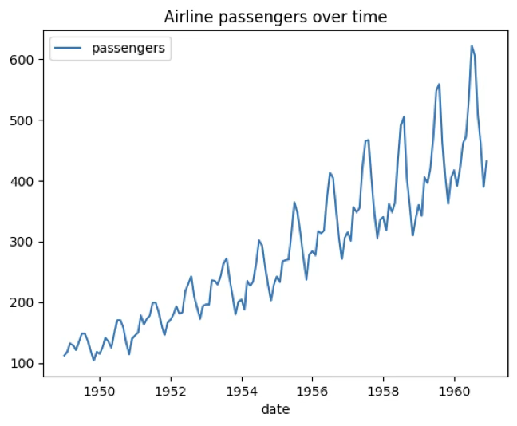{fig-align="center" width="70%"}

### 시계열데이터 성분

시계열 데이터 $\{ Y_{t};t = 1,2,...,T\}$는 크게 네 가지 성분으로 이루어진다.

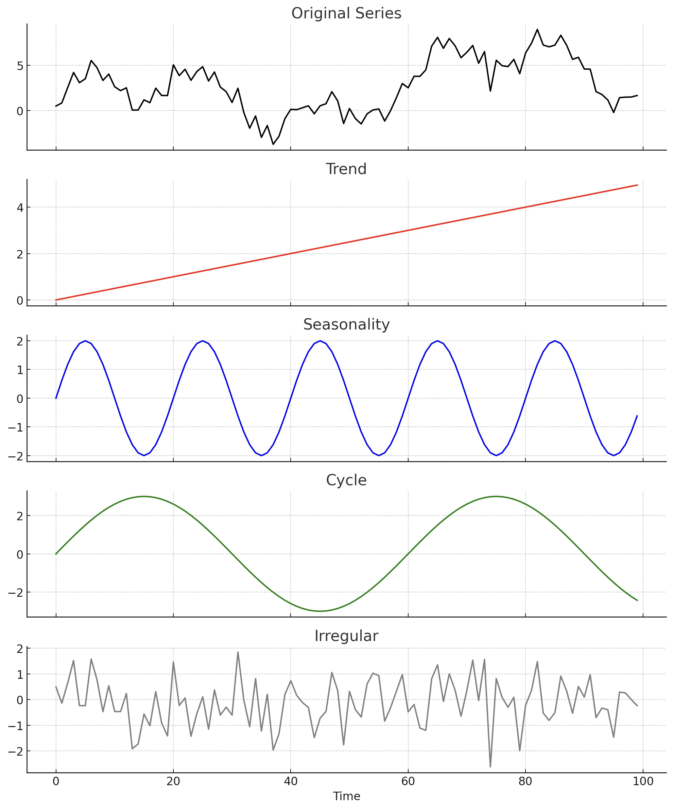{fig-align="center" width="70%"}

::: {.callout-tip icon=false}
## 시계열 데이터 4가지 성분

| 성분 | 기호 | 설명 | 예시 |
|------|:----:|------|------|
| **경향 (Trend)** | $T_t$ | 장기간 지속적인 상승·하락 패턴 | 인구 증가, 경제 성장 |
| **순환 (Cycle)** | $C_t$ | 계절성보다 긴 주기의 반복 변동 | 경기 순환, 기후 변화 |
| **계절성 (Seasonality)** | $S_t$ | 고정된 주기로 반복되는 패턴 | 여름 음료 매출, 연말 소비 |
| **불규칙성 (Irregular)** | $I_t$ | 예측 불가능한 무작위 변동 | 백색잡음, 돌발 사건 |
:::

**경향(Trend) $T_{t}$**: 시계열 데이터에서 장기간에 걸쳐 나타나는 지속적인 변화 패턴을 의미한다. 형태에 따라 직선 경향(linear trend)과 이차 경향(quadratic trend) 등으로 구분된다.

**순환(cycle) $C_{t}$**: 시계열 데이터에서 일정한 주기와 진폭을 가지고 반복되는 변동 패턴을 의미한다. 이는 계절성보다 더 긴 기간에 걸쳐 나타나며, 경제 경기 변동이나 기후 변화와 같이 장기 요인에 의해 발생하는 경우가 많다.

**계절성(seasonality) $S_{t}$**: 시계열 데이터에서 일정한 주기를 가지고 반복되는 변동 패턴을 말한다. 순환과 달리 주기의 길이가 고정되어 있다는 특징이 있으며, 예를 들어, 여름철 음료 매출 증가, 연말 소비 지출 증가, 특정 계절의 농산물 가격 변동 등이 계절성 패턴에 해당한다.

**불규칙성(irregular) $I_{t}$**: 시계열 데이터에서 규칙적인 패턴이 전혀 존재하지 않는 변동 성분을 의미한다. 불규칙 성분은 일반적으로 평균이 0이고 분산이 일정하며, 서로 독립적인 백색잡음(white noise)으로 가정된다.

### 시계열데이터 분석방법

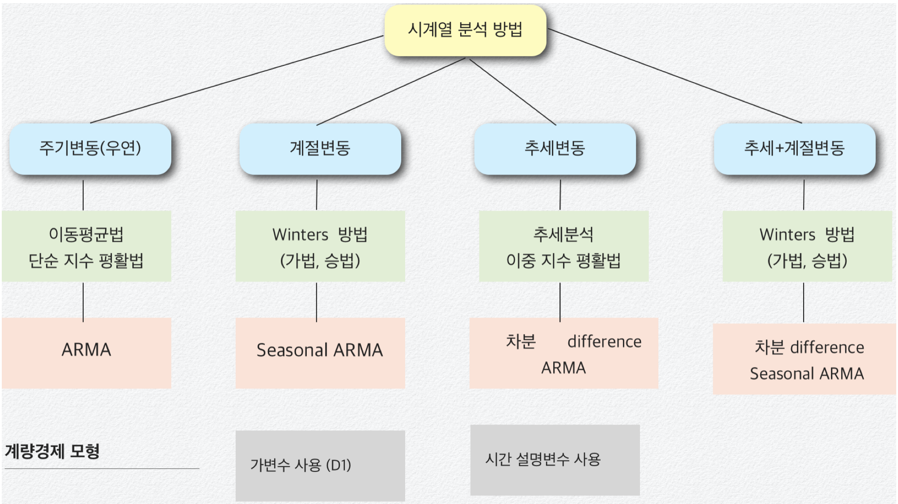{fig-align="center" width="80%"}

::: {.callout-tip icon=false}
## 시계열 분석 방법 비교

| 방법 | 이론적 기반 | 특징 | 주요 적용 |
|------|-----------|------|---------|
| **평활법** | 가중 평균 | 직관적, 계산 단순 | 단기 예측, 추세 파악 |
| **ARMA/ARIMA** | 수학적 확률 모형 | 정상성 필요, 높은 정확도 | 단기~중기 예측 |
| **계량경제 모형** | 회귀분석 확장 | 외부 변수 포함 가능 | 경제·정책 분석 |
| **시계열 분해** | 성분 분리 | 해석 용이 | 계절성·추세 파악 |
:::

**평활법: 과거 값의 평균으로 미래 값을 예측하는 방법**

- **이동 평균법(moving average)**: 최근 데이터의 평균을 예측치로 사용하는 방법이다.
- **지수 평활법(exponential smoothing)**: 현재 가까운 시점에 가장 많은 가중치를 주고 멀어질수록 낮은 가중치를 주는 방법이다.

**ARMA 모형**

$$Y_{t} = \mu + \alpha_{1}Y_{t - 1} + ... + \alpha_{p}Y_{t - p} + \beta_{1}e_{t - 1} + ... + \beta_{q}e_{t - q} + e_{t - 1}$$

시계열 데이터 $\{ Y_{t};t = 1,2,...,T\}$에 대한 모형화를 통하여 미래 값을 예측하는 방법이다.

**계량경제 Econometrics Model**

$$Y_{t} = \mu + \alpha_{1}X_{1t} + \alpha_{2}X_{2t} + ... + \alpha_{p}X_{pt} + e_{t - 1}$$

### 최적 모형 선택 통계량

::: {.callout-note icon=false}
## 예측 오차 지표 비교

| 지표 | 공식 | 특징 |
|------|------|------|
| **MAE** | $\frac{1}{T}\sum\|e_t\|$ | 이상치에 덜 민감, 단위 동일 |
| **MAPE** | $\frac{1}{T}\sum\|\frac{e_t}{Y_t}\| \times 100\%$ | 단위 없는 상대적 오차, 비교 용이 |
| **MSE** | $\frac{1}{T}\sum e_t^2$ | 큰 오차에 가중, 이상치에 민감 |
| **RMSE** | $\sqrt{\frac{1}{T}\sum e_t^2}$ | MSE의 제곱근, 원래 단위로 해석 |

예측오차: $e_{t} = Y_{t} - {\widehat{Y}}_{t}$
:::

- Mean Absolute Error (MAE): $MAE = \frac{1}{T}\overset{T}{\sum_{i = 1}}|e_{t}|$
- Mean Absolute Percentage Error (MAPE): $MAPE = \frac{1}{T}\overset{T}{\sum_{i = 1}}|\frac{e_{t}}{Y_{t}}| \times 100(\%)$
- Mean Squared Error (MSE): $MSE = \frac{1}{T}\overset{T}{\sum_{i = 1}}e_{t}^{2}$
- Root-Mean Squared Error (RMSE): $RMSE = \sqrt{\frac{1}{T}\overset{T}{\sum_{i = 1}}e_{t}^{2}}$

## 시계열 모형

### 시계열 모형 개념

**정의**: 시계열 분석에서 중요한 출발점은 관측 자료를 설명할 수 있는 적절한 확률모형 또는 모형 계열을 선택하는 것이다. 미래 관측값은 본질적으로 불확실하므로, 각 시점의 관측값 $\{ x_{t}\}$는 확률변수 $\{ X_{t}\}$의 실현값이라고 가정한다.

이론적으로 완전한 확률 시계열 모형은 $\{ X_{1},X_{2},\ldots\}$의 모든 결합분포를 명시한다.

$$P(X_{1} \leq x_{1},\ldots,X_{n} \leq x_{n}), \quad -\infty < x_{1},\ldots,x_{n} < \infty,\quad n = 1,2,\ldots$$

이러한 평균과 공분산 같은 2차 특성만으로 시계열을 묘사하는 방식을 **2차 특성 접근**이라 한다.

**시계열 모형화의 일반적 접근 방법**: 시계열 분석을 시작할 때는 먼저 데이터를 시각화하여 주요 특징을 파악한다. 다음 단계는 추세와 계절 성분을 제거하여 정상성(stationarity)을 가진 잔차를 만드는 것이다.

### 시계열 기본 모형

#### 평균 0인 모형

시계열 모형 중 가장 단순한 형태는 추세나 계절 성분이 전혀 없고, 관측값들이 서로 독립이며 동일한 분포를 따르는 경우이다. 특히 평균이 0인 확률변수열 $\{ X_{1},X_{2},\ldots\}$로 구성된 경우로 iid 잡음 모형이라고도 한다.

$$P(X_{1} \leq x_{1},\ldots,X_{n} \leq x_{n}) = F(x_{1})\cdots F(x_{n})$$

$$P(X_{n + h} \leq x \mid X_{1} = x_{1},\ldots,X_{n} = x_{n}) = P(X_{n + h} \leq x)$$

**Binary Process**: 각 시점 $t = 1,2,\ldots$에서 확률 $p$로 $X_{t} = 1$, 확률 $(1 - p)$로 $X_{t} = 0$이 나오는 확률변수열.

**Random Walk**: 랜덤 워크는 iid 잡음을 누적합하여 생성되는 시계열이다. 초기값을 $S_{0} = 0$으로 두고, $S_{t} = X_{1} + X_{2} + \cdots + X_{t}$로 정의하면, $\{ X_{t}\}$가 평균 0인 iid 잡음일 때 $\{ S_{t}\}$는 평균이 0인 랜덤 워크가 된다.

#### 추세와 계절성을 포함한 모형

많은 시계열 자료에는 뚜렷한 추세가 존재한다. 이러한 경우, 추세를 포함한 모형이 필요하다.

$$X_{t} = m_{t} + Y_{t}$$

여기서 $m_{t}$는 시간이 지남에 따라 서서히 변하는 함수로 추세 성분이라 하며, $Y_{t}$는 평균이 0인 확률 과정이다.

**Harmonic Regression(조화회귀)**: 많은 시계열 데이터는 날씨와 같이 계절적으로 변하는 요인의 영향을 받는다. 계절 요인은 다음과 같이 표현할 수 있다.

$$X_{t} = s_{t} + Y_{t}, \quad s_{t} = a_{0} + \overset{k}{\sum_{j = 1}}\left\lbrack a_{j}\cos(\lambda_{j}t) + b_{j}\sin(\lambda_{j}t) \right\rbrack$$

여기서 $a_{0},a_{1},\ldots,a_{k},b_{1},\ldots,b_{k}$는 미지의 모수이고, $\lambda_{1},\ldots,\lambda_{k}$는 고정된 주파수이다.

**정상성 모형 stationary model**

【정의】 $E(X_{t}^{2}) < \infty$인 시계열 $\{ X_{t}\}$에 대해, 평균 함수는 $\mu_{X}(t) = E(X_{t})$, 공분산 함수는 $\gamma_{X}(r,s) = Cov(X_{r},X_{s})$로 정의된다.

$E(X_{t}^{2}) < \infty$인 시계열 $\{ X_{t}\}$가 **약한 정상성**을 가지려면:

1. 평균 $\mu_{X}(t)$가 시간 t에 무관해야 하며,
2. 공분산 $\gamma_{X}(t + h,t)$가 t에 무관하고 시차 h에만 의존해야 한다.

**【자기상관함수 정의】** 정상 시계열 $\{ X_{t}\}$의 $\text{lag } h$에서의 자기상관함수는

$$\rho_{X}(h) = \frac{\gamma_{X}(h)}{\gamma_{X}(0)} = Cor(X_{t + h},X_{t})$$

**【예제 iid 잡음】** $\{ X_{t}\}$가 평균 0, 분산 $\sigma^{2}$를 가지는 iid 확률변수열이라고 하자.

$$\gamma_{X}(t + h,t) = \begin{cases}\sigma^{2}, & \text{if } h = 0 \\ 0, & \text{if } h \neq 0\end{cases}$$

모두 t에 의존하지 않으므로 정상성 모델이다.

【예제 랜덤 워크】 $\{ S_{t}\}$가 iid 잡음 $\{ X_{t}\}$를 누적합하여 만든 랜덤워크라 하면 공분산 $\gamma_{S}(t + h,t) = t\sigma^{2}$는 시차 t에 의존하므로 비정상성 모델이다.

## 평활법

### 이동평균법

계열 데이터는 주기성이나 불규칙성을 포함하는 경우가 많으므로, 이러한 단기 변동을 완화하고 전반적인 추세를 파악하기 위해 과거 관측값을 평균하는 방법이 사용된다. 이동평균법(Moving Average)은 과거의 일정 개수 관측값을 평균하여 예측값을 구하는 방법이다.

**이동평균(Moving Average, MA) 계산과 예측**

$${\widehat{X}}_{t + 1} = \frac{X_{t} + X_{t - 1} + \cdots + X_{t - m + 1}}{m}$$

이동평균에는 일반 이동평균과 중심 이동평균(Centered Moving Average, CMA)가 있다.

- **일반 이동평균**: $MA_{t} = \frac{X_{t} + X_{t - 1} + X_{t - 2}}{3}$ (m=3인 경우)
- **중심 이동평균**: $CMA_{t} = \frac{X_{t - 1} + X_{t} + X_{t + 1}}{3}$이 된다. (중앙시점이 t이면)

**이동평균 주기 m의 결정**: 이동평균법에서 주기 m은 데이터의 특성과 분석 목적에 따라 설정한다.

- 주가 데이터(일별): m = 5 (1주), m = 20 (1개월), m = 60 (분기), m = 120 (반년)
- 월별 데이터: m = 12 (1년), m = 24 (2년), m = 36 (3년)

**이동평균법의 한계와 문제점**: 이동평균법은 계산이 단순하고 직관적인 장점이 있지만, 과거 관측치에 동일한 가중치를 부여한다는 점과 구조적으로 차기 1기만 예측이 가능하다는 한계가 있다.

```python
#예제 데이터 가져오기
import pandas as pd
import seaborn as sns
from datetime import datetime
df=sns.load_dataset("flights")
df['date']=df.apply(lambda x: datetime.strptime(f"{x['year']}-{x['month']}", '%Y-%b').date(), axis=1)

#이동평균 주기=12, 일년
df['rolling_avg'] = df['passengers'].rolling(window=12).mean()
import matplotlib.pyplot as plt
plt.plot(df['date'],df['passengers'], 'b')
plt.plot(df['date'],df['rolling_avg'], 'r')
plt.show()
```

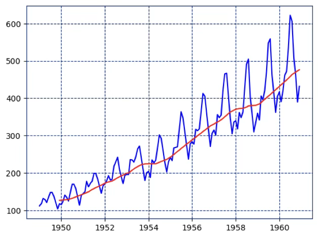{fig-align="center" width="80%"}

### 지수 평활법 exponential smoothing

이동평균법은 모든 관측치에 동일한 가중치를 부여하므로, 최근 자료와 오래된 자료가 동일하게 반영된다는 한계가 있다. 지수평활법은 최근 관측치에 더 높은 가중치를 부여하고, 시점이 멀어질수록 가중치를 지수적으로 감소시키는 방식으로 과거 자료를 반영한다.

::: {.callout-tip icon=false}
## 지수평활법 종류 비교

| 방법 | 평활 상수 | 적용 조건 | 특징 |
|------|---------|---------|------|
| **단순 지수평활 (SES)** | α | 추세·계절성 없음 | 수준만 추정 |
| **이중 지수평활 (Holt)** | α, β | 추세 있음 | 수준 + 추세 추정 |
| **삼중 지수평활 (Holt-Winters)** | α, β, γ | 추세 + 계절성 있음 | 수준 + 추세 + 계절성 |
| **적응형 지수평활** | α (자동 조정) | 변화 속도 다양 | α를 데이터에 따라 동적 조정 |
:::

1. **단순 지수평활법(Simple Exponential Smoothing)**: 추세나 계절성이 없는 시계열에 사용되는 가장 기본적인 형태이다.
2. **이중 지수평활법(Double Exponential Smoothing, Holt's Method)**: 시계열에 추세가 존재하는 경우 사용한다.
3. **삼중 지수평활법(Triple Exponential Smoothing, Holt-Winters Method)**: 시계열에 추세와 계절성이 모두 존재하는 경우 사용한다.
4. **적응형 지수평활법(Adaptive Exponential Smoothing)**: 데이터의 변화 속도에 따라 평활 상수 $\alpha$를 자동으로 조정하는 방법이다.

#### 단순지수평활법 Simple ES

단순 지수평활법은 주기(순환)만 존재하고 추세나 계절성이 없는 시계열 자료에 적합한 예측 방법이다.

**모형 구조**

$$\widehat{Y}_{t} = \alpha Y_{t} + (1 - \alpha)\widehat{Y}_{t-1}$$

여기서 $Y_{t}$는 시점 t에서의 실제 관측값, ${\widehat{Y}}_{t}$는 시점 t에서의 평활값, 그리고 $\alpha$는 평활 상수($0 < \alpha \leq 1$)이다.

**가중치 해석**: 가중치 $\alpha$가 클수록 최근 자료의 비중이 커지고, 과거 자료의 영향은 급격히 줄어든다. Brown은 경험적으로 $\alpha$를 0.05~0.3 범위에서 선택할 것을 권장하였다.

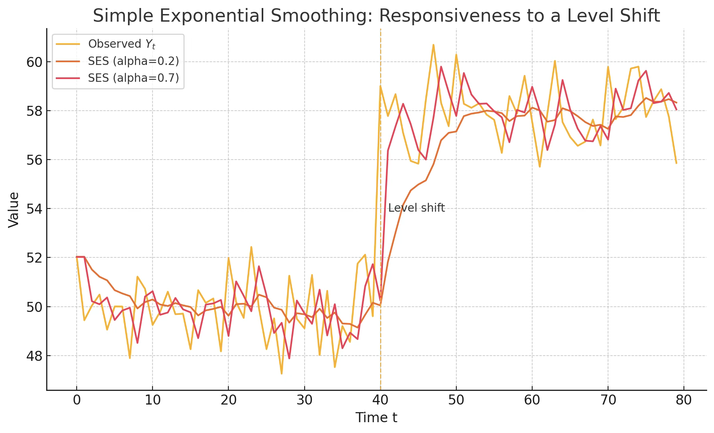{fig-align="center" width="80%"}

**주기와 평활 상수의 관계**: Montgomery & Johnson(1976)은 데이터 주기 $P$와 평활 상수 $\alpha$의 관계를 다음과 같이 제안하였다. $\alpha \approx 1 - {0.8}^{(1/P)}$.

```python
# 예제 데이터 가져오기
import pandas as pd
import seaborn as sns
import matplotlib.pyplot as plt
from datetime import datetime
from statsmodels.tsa.api import SimpleExpSmoothing

# flights 데이터 로드
df = sns.load_dataset("flights")
df['date'] = df.apply(lambda x: datetime.strptime(f"{x['year']}-{x['month']}", '%Y-%b'), axis=1)
df.set_index('date', inplace=True)

# 단순 지수평활 모델 생성 및 적합
model = SimpleExpSmoothing(df['passengers'], initialization_method="heuristic")
fit_model = model.fit(optimized=True)  # alpha 자동 추정

# 결과 출력
print("Optimal alpha:", fit_model.params['smoothing_level'])
print("SSE:", fit_model.sse)

# 12개월 예측
forecast_steps = 12
forecast = fit_model.forecast(steps=forecast_steps)

# 시각화
plt.figure(figsize=(10,5))
plt.plot(df.index, df['passengers'], label='Observed', color='black')
plt.plot(fit_model.fittedvalues.index, fit_model.fittedvalues, label='Fitted (SES)', color='blue')
plt.plot(pd.date_range(df.index[-1] + pd.DateOffset(months=1), periods=forecast_steps, freq='M'),
         forecast, label='Forecast', color='red', linestyle='--')
plt.title("Simple Exponential Smoothing - Observed vs Fitted & Forecast")
plt.xlabel("Date")
plt.ylabel("Passengers")
plt.legend()
plt.grid(True)
plt.tight_layout()
plt.show()
```

Optimal alpha: 0.9999999850988388

SSE: 162545.8192551743

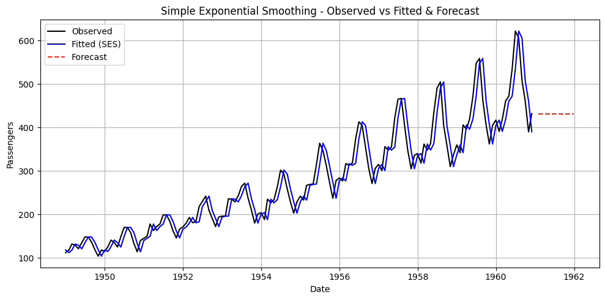{fig-align="center" width="80%"}

$\alpha$가 1에 가까운 이유: 데이터에 강한 추세나 계절성이 있는 경우 SES는 추세나 계절성을 모형화하지 못하기 때문에, 추세나 계절성 변화에 맞추려고 $\alpha$를 크게 잡아서 최근 데이터만 따라가는 방식으로 SSE를 최소화하려고 한다.

#### Holt's Method 이중지수평활법

추세가 있는 시계열 데이터를 다룰 때, 단순 지수평활법을 확장한 방법이다. 수준(Level)과 기울기(Trend)를 동시에 추정하여 예측한다.

관측값 $Y_{1},Y_{2},\ldots,Y_{n}$이 주어졌을 때, 미래 $h$시점 예측치는 다음과 같이 구한다.

$$\widehat{Y}_{n + h} = {\widehat{a}}_{n} + h{\widehat{b}}_{n}, \quad h = 1,2,\ldots$$

**재귀식**

- 수준 갱신: $\widehat{a}_{n+1} = \alpha Y_{n+1} + (1 - \alpha)({\widehat{a}}_{n} + {\widehat{b}}_{n})$
- 추세 갱신: $\widehat{b}_{n+1} = \beta(\widehat{a}_{n+1} - {\widehat{a}}_{n}) + (1 - \beta){\widehat{b}}_{n}$, 여기서 $\alpha,\beta \in (0,1)$는 평활 상수이다.
- 예측값: ${\widehat{Y}}_{n + 1} = {\widehat{a}}_{n} + {\widehat{b}}_{n}$

**특징**: $\alpha$는 수준의 변화에 대한 반응 속도, $\beta$는 추세 변화에 대한 반응 속도를 조절한다. $\alpha$와 $\beta$ 모두 0~1 사이에서 설정하며, 보통 MSE 최소화를 기준으로 추정한다.

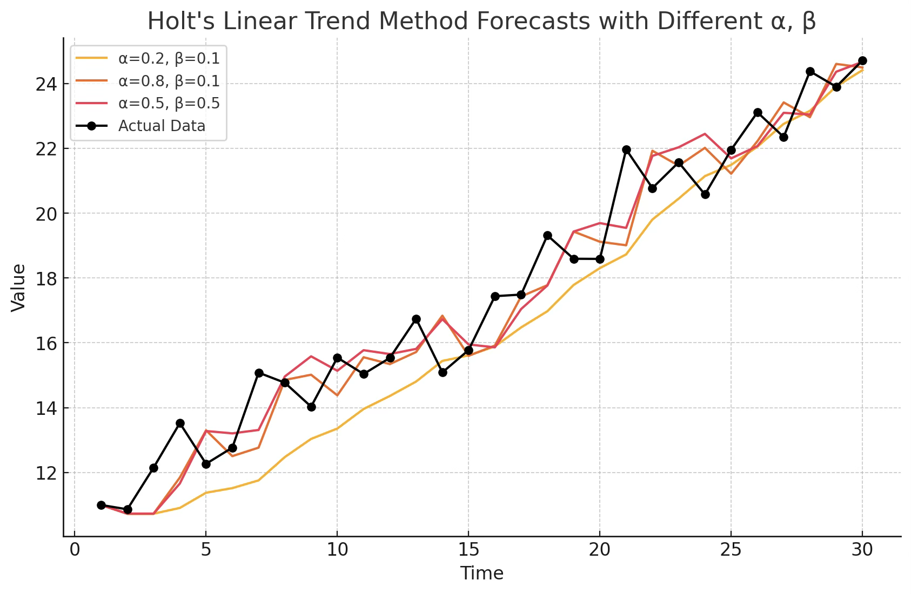{fig-align="center" width="80%"}

```python
import pandas as pd
import seaborn as sns
import matplotlib.pyplot as plt
from datetime import datetime
from statsmodels.tsa.api import Holt

# flights 데이터
df = sns.load_dataset("flights")
df["date"] = df.apply(lambda x: datetime.strptime(f"{x['year']}-{x['month']}", "%Y-%b"), axis=1)
df = df.set_index("date").asfreq("MS")

# Holt: 수준+추세, 초기치도 추정
holt = Holt(df["passengers"], initialization_method="estimated")
fit  = holt.fit(optimized=True)

alpha = fit.params["smoothing_level"]
beta  = fit.params.get("smoothing_trend", fit.params.get("smoothing_slope"))

print("Optimal alpha:", alpha)
print("Optimal beta :", beta)
print("SSE:", fit.sse)

# 12개월 예측
fcst = fit.forecast(12)

# 시각화
plt.figure(figsize=(10,5))
plt.plot(df.index, df["passengers"], label="Observed", color="black")
plt.plot(fit.fittedvalues.index, fit.fittedvalues, label="Fitted (Holt)", color="blue")
plt.plot(pd.date_range(df.index[-1] + pd.DateOffset(months=1), periods=12, freq="MS"),
         fcst, label="Forecast (12M)", color="red", linestyle="--")
plt.title("Holt's Linear Trend – Observed vs Fitted & 12M Forecast")
plt.xlabel("Date"); plt.ylabel("Passengers"); plt.grid(True); plt.legend(); plt.tight_layout()
plt.show()
```

Optimal alpha: 0.9999999850988388

Optimal beta : 0.0

SSE: 161787.91754445358

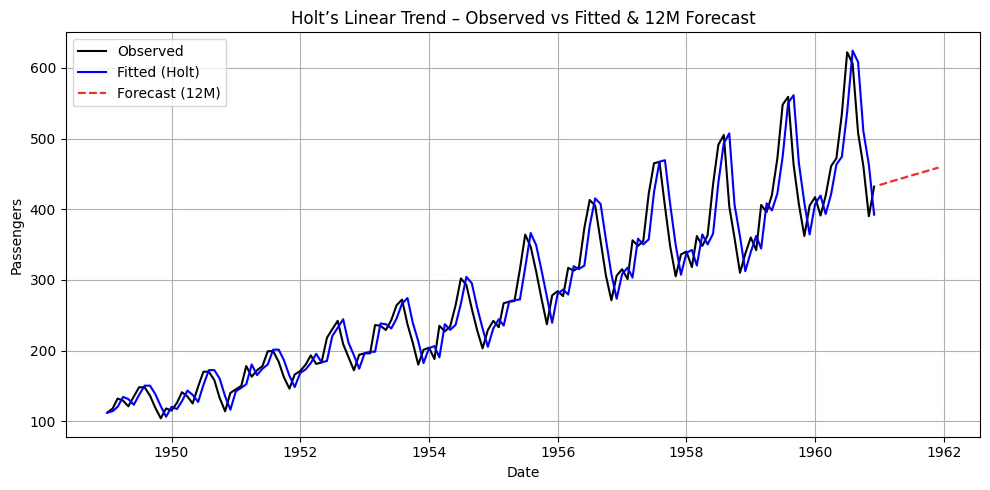{fig-align="center" width="80%"}

**Damped trend 방법**: Holt의 선형 방법에 의한 예측값은 미래로 갈수록 지속적인 추세를 포함하게 된다. Gardner & McKenzie(1985)는 향후 언젠가 추세를 평평한 선으로 "감쇠"시키는 매개 변수를 도입했다.

$${\widehat{y}}_{t + h} = a_{t} + \left( \frac{1 - \phi^{h}}{1 - \phi} \right)b_{t}$$

여기서 $\phi$는 0~1 사이의 감쇠계수이다.

```python
from statsmodels.tsa.api import Holt
import seaborn as sns
from datetime import datetime
import matplotlib.pyplot as plt

# 1. 데이터 준비
df = sns.load_dataset("flights")
df['date'] = df.apply(lambda x: datetime.strptime(f"{x['year']}-{x['month']}", "%Y-%b"), axis=1)
y = df.set_index("date")["passengers"].asfreq("MS")

# 2. Holt 모형 + 감쇠 추세
holt_damped = Holt(y, damped_trend=True, initialization_method="estimated").fit(optimized=True)

# 3. SSE와 파라미터 출력
print("SSE :", holt_damped.sse)
print("alpha:", holt_damped.params['smoothing_level'])
print("beta :", holt_damped.params['smoothing_trend'])
print("phi  :", holt_damped.params['damping_trend'])

# 4. 예측
steps = 12
fcst = holt_damped.forecast(steps)

# 5. 시각화
plt.figure(figsize=(10,5))
plt.plot(y, label="Observed", color="black")
plt.plot(holt_damped.fittedvalues, label="Fitted (Holt+Damped)", color="blue")
plt.plot(fcst, label="Forecast (12M)", color="red", linestyle="--")
plt.legend()
plt.grid(True)
plt.show()
```

SSE : 161801.78439102264

alpha: 0.9999999850988388

beta : 0.0

phi : 0.995

#### Holt-Winters Method 삼중지수평활법

이전 설명한 지수평활법은 계절성분이 없는 경우 사용된다. 강우량, 월별 수출량, 여행 승객 수 등은 계절성을 가지고 있다.

::: {.callout-tip icon=false}
## Holt-Winters Additive vs. Multiplicative

| 구분 | Additive | Multiplicative |
|------|---------|----------------|
| **계절 효과** | 시계열 수준에 관계없이 일정 | 수준에 비례하여 변동 |
| **수식** | $\hat y = a_t + b_t h + s_{t+h-m}$ | $\hat y = (a_t + b_t h) \cdot s_{t+h-m}$ |
| **시각적 특징** | 계절 변동폭이 일정 | 계절 변동폭이 시간에 따라 커짐 |
| **항공 승객 적합** | 낮음 | 높음 (변동폭 확대) |
| **SSE (항공 예시)** | 21,564 | **15,953** (더 낮음) |
:::

**Holt-Winters' Additive Method**: 계절효과의 크기가 시계열 전체 수준(Level)에 관계없이 거의 일정할 때 사용한다.

$$\begin{aligned}
\widehat{y}_{t+h} &= a_{t} + b_{t}h + s_{t+h-m} \\
a_{t} &= \alpha(y_{t} - s_{t-m}) + (1-\alpha)(a_{t-1} + b_{t-1}) \\
b_{t} &= \beta(a_{t} - a_{t-1}) + (1-\beta)b_{t-1} \\
s_{t} &= \gamma(y_{t} - a_{t}) + (1-\gamma)s_{t-m}
\end{aligned}$$

여기서 $a_{t}$는 수준, $b_{t}$는 추세, $s_{t}$는 계절성, 그리고 $m$은 주기이다.

**Holt-Winters' Multiplicative Method**: 계절효과의 크기가 수준에 비례하여 변할 때 사용하게 되는데 계절성이 비율적 차이로 반복된다.

$$\begin{aligned}
\widehat{y}_{t+h} &= (a_{t} + b_{t}h) \cdot s_{t+h-m} \\
a_{t} &= \alpha\frac{y_{t}}{s_{t-m}} + (1-\alpha)(a_{t-1} + b_{t-1}) \\
b_{t} &= \beta(a_{t} - a_{t-1}) + (1-\beta)b_{t-1} \\
s_{t} &= \gamma\frac{y_{t}}{a_{t}} + (1-\gamma)s_{t-m}
\end{aligned}$$

여기서 $\gamma$는 계절성분 갱신 시 적용되는 평활 상수이다.

```python
import pandas as pd
import seaborn as sns
import matplotlib.pyplot as plt
from datetime import datetime
from statsmodels.tsa.holtwinters import ExponentialSmoothing

# 1) 데이터 로드 & 시계열 인덱스 설정
df = sns.load_dataset("flights")
df["date"] = df.apply(lambda x: datetime.strptime(f"{x['year']}-{x['month']}", "%Y-%b"), axis=1)
y = df.set_index("date")["passengers"].asfreq("MS")

# 2) Holt–Winters Additive (trend='add', seasonal='add')
hw_add = ExponentialSmoothing(
    y, trend="add", seasonal="add", seasonal_periods=12,
    initialization_method="estimated"
).fit(optimized=True)

# 3) Holt–Winters Multiplicative (trend='add', seasonal='mul')
hw_mul = ExponentialSmoothing(
    y, trend="add", seasonal="mul", seasonal_periods=12,
    initialization_method="estimated"
).fit(optimized=True)

# 4) 12개월 예측
steps = 12
fcst_add = hw_add.forecast(steps)
fcst_mul = hw_mul.forecast(steps)

# 5) 파라미터 & SSE 출력
print("[Additive]")
print(" alpha:", hw_add.params.get("smoothing_level"))
print(" beta :", hw_add.params.get("smoothing_trend"))
print(" gamma:", hw_add.params.get("smoothing_seasonal"))
print(" SSE  :", hw_add.sse, "\n")

print("[Multiplicative]")
print(" alpha:", hw_mul.params.get("smoothing_level"))
print(" beta :", hw_mul.params.get("smoothing_trend"))
print(" gamma:", hw_mul.params.get("smoothing_seasonal"))
print(" SSE  :", hw_mul.sse)

# 6) 시각화
plt.figure(figsize=(11,5))
plt.plot(y.index, y, label="Observed", color="black")
plt.plot(hw_add.fittedvalues.index, hw_add.fittedvalues, label="Fitted (Additive)")
plt.plot(hw_mul.fittedvalues.index, hw_mul.fittedvalues, label="Fitted (Multiplicative)")
plt.plot(pd.date_range(y.index[-1] + pd.DateOffset(months=1), periods=steps, freq="MS"),
         fcst_add, label="Forecast Add", linestyle="--")
plt.plot(pd.date_range(y.index[-1] + pd.DateOffset(months=1), periods=steps, freq="MS"),
         fcst_mul, label="Forecast Mul", linestyle="--")
plt.title("Holt–Winters: Additive vs Multiplicative")
plt.xlabel("Date"); plt.ylabel("Passengers"); plt.grid(True); plt.legend(); plt.tight_layout()
plt.show()
```

[Additive]

alpha: 0.2525303255513238

beta : 0.0

gamma: 0.7474696744486762

SSE : 21564.432209838982

[Multiplicative]

alpha: 0.31858664757791894

beta : 0.0

gamma: 0.6013533719848393

SSE : 15952.880434994611

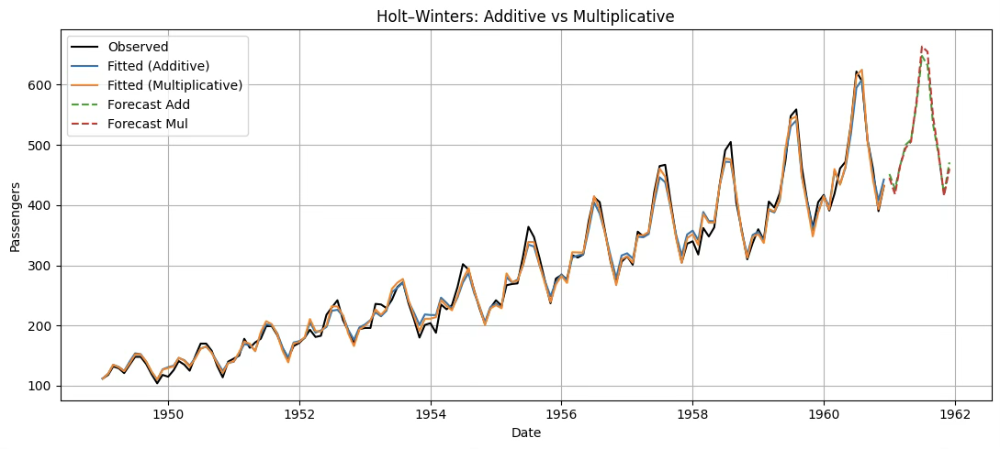{fig-align="center" width="80%"}

## ARMA 모형

ARIMA(Auto-Regressive Integrated Moving Average) 모형은 George Box와 Gwilym Jenkins가 제안한 시계열 모형으로, 자기회귀(AR), 차분(Integrated), 이동평균(MA) 요소를 결합하여 시계열 데이터를 설명하고 예측한다.

### ARMA(p, q) Processes

【정의】 $\{ X_{t}\}$가 정상성을 가지며, 모든 t에 대해 다음을 만족하면 $ARMA(p,q)$과정이라고 한다.

$$X_{t} - \phi_{1}X_{t - 1} - \cdots - \phi_{p}X_{t - p} = Z_{t} + \theta_{1}Z_{t - 1} + \cdots + \theta_{q}Z_{t - q}$$

여기서 $\{ Z_{t}\} \sim WN(0,\sigma^{2})$이고, 다항식은 공통 인자를 갖지 않는다.

【간편식】 $\phi(B)X_{t} = \theta(B)Z_{t}$, 여기서 $\phi( \cdot )$와 $\theta( \cdot )$는 각각 p차와 q차의 다항식이고, B는 후진 이동 연산자(backward shift operator)이다.

$$\phi(z) = 1 - \phi_{1}z - \cdots - \phi_{p}z^{p}$$

$$\theta(z) = 1 + \theta_{1}z + \cdots + \theta_{q}z^{q}$$

$$B^{j}X_{t} = X_{t - j},\quad B^{j}Z_{t} = Z_{t - j},\quad j = 0, \pm 1,\ldots$$

### 정상성 stationarity과 인과성

#### 정상성

ARMA 모형에서 정상성이 중요한 이유는, 이 모형이 과거 값과 오차항의 일정한 관계를 바탕으로 미래를 예측하는 구조이기 때문이다.

**이론적 정상성 조건 (모형 계수 기반)**: AR(p) 모형: $Y_{t} = \phi_{1}Y_{t - 1} + \phi_{2}Y_{t - 2} + \cdots + \phi_{p}Y_{t - p} + e_{t}$

특성방정식: $1 - \phi_{1}z - \phi_{2}z^{2} - \cdots - \phi_{p}z^{p} = 0$, 모든 해 z가 $|z| > 1$이면 정상성이다.

**데이터 기반 정상성 검정 (Unit Root Test)**

::: {.callout-note icon=false}
## 정상성 검정 방법 비교

| 검정 | 귀무가설 | 대립가설 | 특징 |
|------|---------|---------|------|
| **ADF** | 단위근 존재 (비정상) | 정상성 | 가장 널리 사용 |
| **KPSS** | 정상성 | 비정상 | ADF와 반대 논리 → 함께 사용 권장 |
| **Phillips-Perron** | 단위근 존재 (비정상) | 정상성 | 자기상관·이분산 보정 버전 |

ADF: p값 < 0.05 → 정상성 / KPSS: p값 > 0.05 → 정상성
:::

(1) ADF 검정 (Augmented Dickey-Fuller test)

- 귀무가설 H_0: 단위근 존재 → 비정상(Non-stationary)
- 대립가설 H_1: 정상성

(2) KPSS 검정 (Kwiatkowski-Phillips-Schmidt-Shin test)

- 귀무가설 H_0: 정상성
- 대립가설 H_1: 비정상

ADF와 반대 논리 → 두 검정을 함께 쓰면 더 확실.

(3) Phillips-Perron (PP) 검정: ADF와 유사하지만 자기상관과 이분산성을 보정한 버전이다.

**비정상성 해결방안**

- **차분(differencing)**: 일반 차분 $Y_{t} - Y_{t - 1}$, 계절 차분 $Y_{t} - Y_{t - s}$ 형태
- **변환(transformation)**: 로그 변환, Box-Cox 변환 등으로 분산 안정화
- **추세 제거(detrending)**: 회귀분석으로 추세 성분을 추정한 뒤 제거
- **계절성 조정(seasonal adjustment)**: STL decomposition, X-13ARIMA-SEATS 등
- **통계적 단위근 검정 후 보정**: ADF, KPSS, Phillips-Perron 등으로 비정상성 확인 후 차분/변환 적용

#### 인과성과 가역성

【정의】 시계열 $\{ X_{t}\}$가 ARMA(p, q) 모형을 따른다고 하자. 이 시계열이 인과적(causal)이라는 것은, 현재 값 $\{ X_{t}\}$가 과거의 백색잡음 $\{ Z_{t - j}\}$들의 가중합으로 표현될 수 있음을 의미한다.

$$X_{t} = \overset{\infty}{\sum_{j = 0}}\psi_{j}Z_{t - j}, \quad \overset{\infty}{\sum_{j = 0}}|\psi_{j}| < \infty$$

인과성은 AR 다항식 $\phi(z)$의 모든 근이 단위원 바깥에 있어야 한다는 의미다.

**가역성 invertibility**

【정의】 ARMA(p, q) 과정 $\{ X_{t}\}$가 가역적이라고 하려면,

$$Z_{t} = \overset{\infty}{\sum_{j = 0}}\pi_{j}X_{t - j}$$

가 모든 t에 대해 성립해야 한다. 가역성 조건:

$$\theta(z) = 1 + \theta_{1}z + \cdots + \theta_{q}z^{q} \neq 0 \quad \text{for all } |z| \leq 1$$

### ARMA 모델 추정 과정

::: {.callout-note icon=false}
## ARMA 모형 추정 5단계

| 단계 | 내용 |
|------|------|
| **① 사전 진단** | 시간도표·백색잡음 검정·정상성 검정·등분산성 검정 |
| **② 모형 식별** | 정상성 확보 후 ACF·PACF로 AR(p), MA(q) 차수 결정 |
| **③ 모수 추정** | MLE 또는 OLS로 계수 추정 |
| **④ 모형 진단** | 계수 유의성·잔차 백색잡음 검정(Ljung-Box) |
| **⑤ 예측** | 진단 통과 모형으로 미래 값 예측 |
:::

① 데이터 사전 진단

- 시간도표 분석: 추세, 계절성, 변동성의 존재 여부를 직관적으로 확인한다.
- 백색잡음 검정: 시계열이 완전 무작위인지 여부를 확인한다.
- 정상성 검정: ADF나 KPSS 검정을 통해 정상성 여부를 통계적으로 판정한다.
- 등분산성 검정: 시간에 따라 분산이 변하지 않는지 확인한다.

② 모형 식별 (Model Identification)

정상성 확보 후, ACF와 PACF 분석을 통해 AR(p), MA(q) 차수를 결정한다.

- ACF(Autocorrelation Function): 시차(lag)별 상관관계를 측정하여 MA 차수 식별에 활용한다.
- PACF(Partial Autocorrelation Function): 시차별 순수 자기상관을 계산하여 AR 차수 식별에 사용한다.
- 계절성 진단: 계절성이 있으면 계절 차분(Seasonal Differencing)을 고려하고, SARIMA 모형으로 확장한다.

③ 모형 추정 (Parameter Estimation)

- 추정 방법: 최대우도추정(MLE, Maximum Likelihood Estimation) 또는 최소제곱법(OLS, Ordinary Least Squares) 사용.

④ 모형 진단 (Model Diagnostics)

- 계수 유의성 검정: 각 계수의 t-통계량과 p값을 확인해 통계적으로 유의한지 판단한다.
- 잔차 분석: 모형의 잔차가 백색잡음인지 검정한다.
- Ljung-Box Q 검정: 잔차의 자기상관이 유의한지 평가한다.

⑤ 예측 모형 적용 (Forecasting)

모형 진단을 통과한 최종 ARMA 모형을 사용하여 미래 값을 예측한다.

### ACF와 PACF

#### 자기공분산함수 (ACF)

**정의**: 자기상관계수(Autocorrelation Coefficient)는 시계열 데이터가 서로 다른 시점에서 얼마나 유사한지를 나타내는 척도이다.

$$\rho(h) = \frac{\text{COV}(X_{t},X_{t - h})}{V(X_{t})}$$

**성질**

- $\rho(h)$는 항상 $-1 \leq \rho(h) \leq 1$ 범위에 존재한다.
- $h = 0$: 항상 1이다.
- $\rho(h) = \rho(-h)$
- AR(p) 모형의 경우 PACF가 p시차에서 절단되고, ACF는 지수적으로 감소한다.
- MA(q) 모형의 경우 ACF가 q시차에서 절단되고, PACF는 지수적으로 감소한다.

#### 모형 식별

시계열 데이터의 특성을 분석하여 적합한 모형의 형태와 차수를 결정하는 단계이다.

- $X_{t} = Z_{t} \sim WN$: $\rho(h) = 0, \text{ for } h > 0$

- $X_{t} = Z_{t} + \theta_{1}Z_{t - 1} + \cdots + \theta_{q}Z_{t - q} \sim MA(q)$ ACF

$$\gamma(h) = \begin{cases}\sigma^{2}\overset{q - |h|}{\sum_{j = 0}}\theta_{j}\theta_{j + |h|}, & \text{if } |h| \leq q, \\ 0, & \text{if } |h| > q.\end{cases}$$

- $X_{t} - \phi_{1}X_{t - 1} = Z_{t} \sim AR(1)$ ACF: $\rho(h) = \phi_{1}^{|h|},\quad h = 0,1,2,\ldots$

- $X_{t} - \phi_{1}X_{t - 1} - \phi_{2}X_{t - 2} = Z_{t} \sim AR(2)$ ACF: $\rho(h) = \phi_{1}\rho(h - 1) + \phi_{2}\rho(h - 2),\quad h \geq 2$

$\rho(0) = 1$, $\rho(1) = \frac{\phi_{1}}{1 - \phi_{2}}$

- $X_{t} - \phi_{1}X_{t - 1} = Z_{t} + \theta_{1}Z_{t - 1} \sim ARMA(1,1)$ ACF:

$$\rho(0) = 1, \quad \rho(1) = \frac{(1 + \theta_{1}\phi_{1})(\theta_{1} + \phi_{1})}{1 + 2\theta_{1}\phi_{1} + \theta_{1}^{2}}, \quad \rho(h) = \phi_{1}^{h - 1}\rho(1),\quad h \geq 2$$

::: {.callout-note icon=false}
## ACF와 PACF를 이용한 모형 식별

| 모형 | ACF | PACF |
|------|-----|------|
| **AR(p)** | 지수적으로 감소 | 시차 $p$ 이후 절단 (0) |
| **MA(q)** | 시차 $q$ 이후 절단 (0) | 지수적으로 감소 |
| **ARMA(p, q)** | 지수적으로 감소 | 지수적으로 감소 |

**식별 전략**: ACF와 PACF 패턴을 동시에 확인하여 절단되는 시차를 AR 또는 MA 차수로 결정한다.
:::

### 사례분석

#### 데이터 사전 진단 및 전처리

**시간도표**

```python
import pandas as pd
import seaborn as sns
import matplotlib.pyplot as plt
from datetime import datetime

# 예제 데이터 불러오기
df = sns.load_dataset("flights")
df['date'] = df.apply(lambda x: datetime.strptime(f"{x['year']}-{x['month']}", '%Y-%b'), axis=1)

# date를 인덱스로 설정
df = df.set_index('date')

# 시간도표 그리기
plt.figure(figsize=(12,6))
plt.plot(df.index, df['passengers'], marker='o', linestyle='-')
plt.title("Time Plot of Monthly Passengers (1949–1960)")
plt.xlabel("Date")
plt.ylabel("Number of Passengers")
plt.grid(True)
plt.show()
```

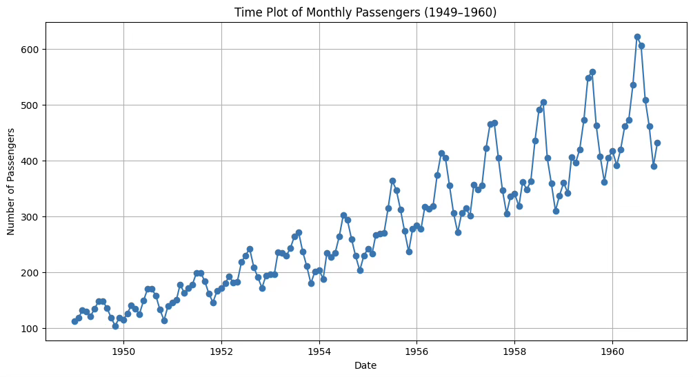{fig-align="center" width="80%"}

::: {.callout-note icon=false}
## 항공 승객 시계열 시간도표 진단

| 특성 | 관찰 내용 |
|------|---------|
| **추세** | 1949~1960년 전반적인 상승 추세 |
| **계절성** | 매년 12개월 주기로 반복되는 뚜렷한 패턴 |
| **변동폭 확대** | 시간 경과에 따라 계절 변동폭 점차 확대 (이분산성) |
| **정상성** | 평균·분산이 시간에 따라 변동 → 비정상성 의심 |

→ 이분산성 존재로 **로그 변환** 필요. 추세·계절성으로 **차분** 필요.
:::

**백색잡음 진단: Ljung-Box and Box-Pierce 통계량**

- 귀무가설: 분석대상 시계열 데이터는 백색 잡음이다. $Y_{t} = e_{t}$ ⟺ 모형인식 불가능
- 대립가설: 백색 잡음이 아니다. ⟺ 패턴이 존재한다. ⟺ ARMA 모형 인식이 가능하다.

```python
#백색잡음 진단
import statsmodels.api as sm
sm.stats.acorr_ljungbox(df['passengers'],lags=[20],boxpierce=True)
```

| lb_stat | lb_pvalue | bp_stat | bp_pvalue |
|:-------:|:---------:|:-------:|:---------:|
| 1434.148907 | 5.300473E-292 | 1328.532248 | 2.291495E-269 |

: Ljung-Box 및 Box-Pierce 검정 결과 {.striped}

두 방법 모두 유의확률이 <0.001이므로 백색잡음이 아니다. 해당 시계열 데이터에는 자기상관이 강하게 존재하며, ARMA 등 자기상관 구조를 반영한 모형을 적용할 필요가 있다.

**단위근 unit root 검정**

- 귀무가설: 단위근을 갖는다. 단위근 unit root 모형 ⟺ random walk 모형
- 대립가설: 단위근 문제가 없다.

```python
#Augmented Dickey-Fuller 단일근 검정
from statsmodels.tsa.stattools import adfuller
adf_result = adfuller(df['passengers'])
print("ADF Statistic:", adf_result[0])
print("p-value:", adf_result[1])
```

ADF Statistic: 0.8153688792060498

p-value: 0.991880243437641

ADF 검정의 귀무가설(H₀)은 "시계열이 단위근을 가진 비정상 과정이다"이다. p-value가 0.99로 매우 크기 때문에 귀무가설을 기각할 수 없다.

**등분산 검정(ARCH test)**

- 귀무가설(H₀): 잔차는 등분산성을 가진다.
- 대립가설(H₁): 잔차는 이분산성을 가진다.

```python
# 등분산성 검정 (ARCH test)
from statsmodels.stats.diagnostic import het_arch

# flights 데이터에서 'passengers' 컬럼 사용
stat, p_value, _, _ = het_arch(df['passengers'])

print(f"ARCH LM 통계량: {stat}")
print(f"p-value: {p_value}")

if p_value < 0.05:
    print("귀무가설 기각: 이 데이터는 이분산성을 가질 가능성이 큼")
else:
    print("귀무가설 채택: 이 데이터는 등분산성을 가짐")
```

ARCH LM 통계량: 126.0645062581934

p-value: 2.961233760503082e-22

귀무가설 기각: 이 데이터는 이분산성을 가질 가능성이 큼

p-value가 0.05 미만이므로 귀무가설을 기각한다. 따라서, 이 데이터는 이분산성을 가질 가능성이 매우 높다. 가장 많이 사용되는 로그변환을 사용한다.

**전처리후 ADF 검정**

```python
from statsmodels.tsa.stattools import adfuller
import numpy as np

# 로그 변환
df['log_passengers'] = np.log(df['passengers'])

# 1차 차분
df['log_diff1'] = df['log_passengers'].diff()

# NaN 제거 후 ADF 테스트
adf_result = adfuller(df['log_diff1'].dropna())
print("ADF Statistic:", adf_result[0])
print("p-value:", adf_result[1])
```

ADF Statistic: -2.717130598388114

p-value: 0.07112054815086184

유의수준 5%에서 단위근 문제없다. (정상성 프로세스)

#### 모형진단

```python
from statsmodels.tsa.stattools import adfuller
import numpy as np

# 로그 변환
df['log_passengers'] = np.log(df['passengers'])

# 1차 차분
df['log_diff1'] = df['log_passengers'].diff()

# NaN 제거 후 ADF 테스트
adf_result = adfuller(df['log_diff1'].dropna())
print("ADF Statistic:", adf_result[0])
print("p-value:", adf_result[1])
```

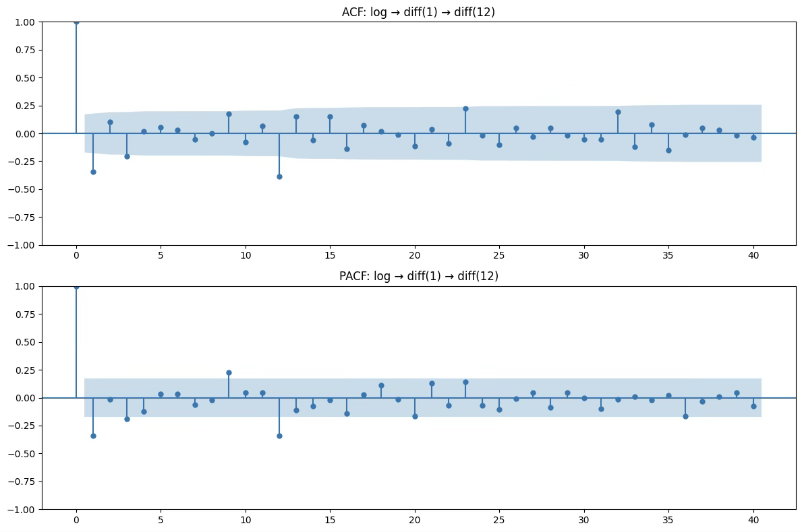{fig-align="center" width="80%"}

**비계절 부분**

- ACF: 시차 1에서만 살짝 유의 → MA(1) 가능성
- PACF: 시차 1에서만 살짝 유의 → AR(1) 가능성 → p, q 둘 다 0~1 범위에서 시도

**계절 부분 (주기 12)**

- ACF: 시차 12 부근 약간 유의 → 계절 MA(1) 가능성
- PACF: 시차 12 부근 약간 유의 → 계절 AR(1) 가능성 → P, Q 둘 다 0~1 범위에서 시도

| 모형 | 비계절 차수 (p,d,q) | 계절 차수 (P,D,Q,s) |
|------|:-----------------:|:-----------------:|
| 모델 1 | (0,1,1) | (0,1,1,12) |
| 모델 2 | (1,1,0) | (0,1,1,12) |
| 모델 3 | (1,1,1) | (0,1,1,12) |
| 모델 4 | (0,1,1) | (1,1,0,12) |
| 모델 5 | (0,1,1) | (1,1,1,12) |

: 잠재 모형 후보 {.striped}

#### 최적 모형

```python
#모형 비교
candidates = [
    ((0,1,1),(0,1,1,12)),
    ((1,1,0),(0,1,1,12)),
    ((1,1,1),(0,1,1,12)),
    ((0,1,1),(1,1,0,12)),
    ((0,1,1),(1,1,1,12)),
]

rows = []
for order, seas in candidates:
    m = sm.tsa.statespace.SARIMAX(df["log_passengers"], order=order, seasonal_order=seas,
                                  enforce_stationarity=False, enforce_invertibility=False)
    r = m.fit(disp=False)
    rows.append({"order": order, "seasonal_order": seas, "AIC": r.aic, "BIC": r.bic})

pd.DataFrame(rows).sort_values("AIC")
```

| 차수 | 계절차수 | AIC | BIC |
|:----:|:-------:|:---:|:---:|
| (1, 1, 0) | (0, 1, 1, 12) | -437.52582 | -429.21377 |
| (0, 1, 1) | (1, 1, 0, 12) | -437.11592 | -428.77855 |
| (0, 1, 1) | (0, 1, 1, 12) | -435.44352 | -427.157 |
| (1, 1, 1) | (0, 1, 1, 12) | -433.78518 | -422.73649 |
| (0, 1, 1) | (1, 1, 1, 12) | -428.86966 | -417.82097 |

: AIC/BIC 기반 모형 비교 {.striped}

::: {.callout-note icon=false}
## 최적 모형 선택 결과

| 기준 | 최솟값 | 선택 모형 |
|------|:------:|---------|
| **AIC** | -437.526 | SARIMA(1,1,0)×(0,1,1,12) |
| **BIC** | -429.214 | SARIMA(1,1,0)×(0,1,1,12) |

AIC와 BIC 모두 **SARIMA(1,1,0)×(0,1,1,12)** 선택 → 최적 모형으로 결정
:::

**모형 추정 및 검정**

```python
import numpy as np
import pandas as pd
import seaborn as sns
import statsmodels.api as sm

# 1) 데이터 로드 & 인덱스 설정
df = sns.load_dataset("flights")
df["date"] = pd.to_datetime(df["year"].astype(str) + "-" + df["month"].astype(str))
df = df.set_index("date").sort_index()

# 2) 로그 변환(열로 보관)
df["log_passengers"] = np.log(df["passengers"])

# 3) SARIMA 적합: (p,d,q)×(P,D,Q,12)
model = sm.tsa.statespace.SARIMAX(
    df["log_passengers"],
    order=(1,1,0),
    seasonal_order=(0,1,1,12),
    enforce_stationarity=False,
    enforce_invertibility=False,
)
res = model.fit()
print(res.summary())
```

**모형 계수 유의성**: 회귀계수 유의성 매우 높음

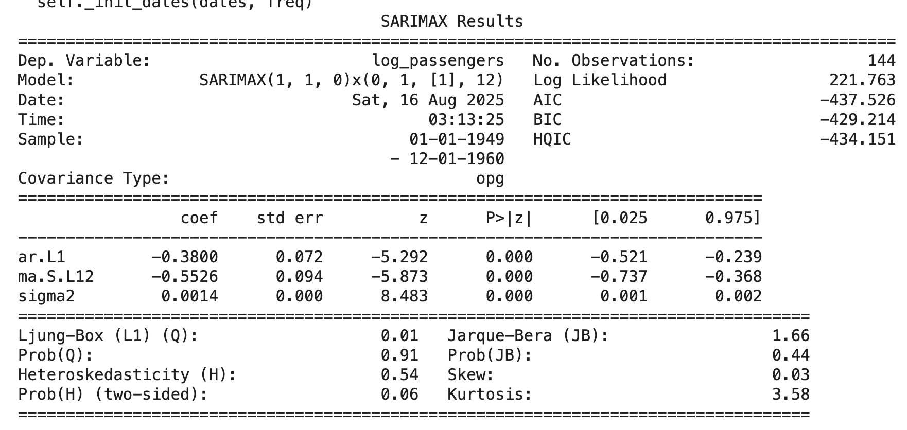{fig-align="center" width="80%"}

추정식: $Y_{t} = - 0.380Y_{t - 1} - 0.553\varepsilon_{t - 12} + \varepsilon_{t},\quad\sigma^{2} = 0.0014$

$$(1 + 0.380L)(1 - L)(1 - L^{12})X_{t} = (1 - 0.553L^{12})\varepsilon_{t}$$

::: {.callout-note icon=false}
## SARIMA(1,1,0)×(0,1,1,12) 잔차 진단 결과

| 진단 | 결과 | 판단 |
|------|------|------|
| **ACF/PACF** | 대부분 95% 신뢰구간 내, lag=12 부근 음(-) 피크 | 계절 잔차 일부 존재 |
| **Ljung-Box (12시차)** | p = 0.0001 | 잔차 백색잡음 가정 위배 ⚠ |
| **Ljung-Box (24시차)** | p = 0.022 | 잔차 백색잡음 가정 위배 ⚠ |
| **ARCH test** | p = 1.0 | 조건부 이분산성 없음 ✓ |
| **정규성 (AD)** | p = 0.0000 | 잔차 정규성 위배 ⚠ |

**결론**: 전반적 추세·계절성 설명은 양호하나 lag=12 계절 자기상관 잔존 → 추가 모형 개선 필요
:::

**잔차 진단 결과**

1. ACF/PACF: 대부분의 시차에서 자기상관이 95% 신뢰구간 내에 있음. 다만 lag=12 근처에서 뚜렷한 음(-) 피크가 나타남.
2. Ljung-Box test: 12시차: p=0.0001, 24시차: p=0.022 → 잔차가 백색잡음 가정을 위배.
3. ARCH test: p=1 → 조건부 이분산성(ARCH 효과) 없음.
4. 정규성 검정 (Anderson-Darling): p=0.0000 → 잔차가 정규성을 따르지 않음.

추정된 SARIMA(1,1,0)×(0,1,1,12) 모형은 데이터의 전반적인 추세와 계절성을 잘 설명하였으나, 잔차에 계절적 자기상관(특히 lag=12)이 남아 있음 → 추가 개선 필요.

```python
import numpy as np
import pandas as pd
import matplotlib.pyplot as plt
import statsmodels.api as sm

# 데이터 로드 & 빈도 지정
df = sns.load_dataset("flights")
df["date"] = pd.to_datetime(df["year"].astype(str) + "-" + df["month"].astype(str))
df = df.set_index("date").sort_index().asfreq("MS")
df["log_passengers"] = np.log(df["passengers"])

# 1) SARIMA 적합
model = sm.tsa.statespace.SARIMAX(
    df["log_passengers"],
    order=(1,1,0),
    seasonal_order=(0,1,1,12),
    enforce_stationarity=False,
    enforce_invertibility=False,
)
res = model.fit(disp=False)

# 추정 결과 요약 출력
print(res.summary())

# 2) 안정화 이후 fitted values (초기 스파이크 방지)
warmup = 24
pred_in = res.get_prediction(start=df.index[warmup], end=df.index[-1])
mu  = pred_in.predicted_mean
var = getattr(pred_in, "var_pred_mean", pred_in.se_mean**2)
fitted_stable = np.exp(mu + 0.5*var)
y_true = df["passengers"].loc[fitted_stable.index]

# SSE 계산
SSE = float(((y_true - fitted_stable) ** 2).sum())
print("\n[모형 적합도]")
print(f"SSE = {SSE:,.2f}")

# 3) 12개월 예측
fc = res.get_forecast(steps=12)
mu_f  = fc.predicted_mean
var_f = getattr(fc, "var_pred_mean", fc.se_mean**2)
fc_mean = np.exp(mu_f + 0.5*var_f)
fc_ci   = np.exp(fc.conf_int())

print("\n[12개월 예측치]")
print(fc_mean)

# 4) 시각화
plt.figure(figsize=(12,6))
plt.plot(df.index, df["passengers"], label="Observed", color="C0")
plt.plot(fitted_stable.index, fitted_stable, label=f"Fitted (after {warmup}m warmup)", color="C1")
plt.plot(fc_mean.index, fc_mean, label="Forecast (12m)", color="C3")
plt.fill_between(fc_mean.index, fc_ci.iloc[:,0], fc_ci.iloc[:,1], color="C3", alpha=0.25)
plt.title(f"SARIMA(1,1,0)×(0,1,1,12) | SSE={SSE:,.2f}")
plt.xlabel("Date"); plt.ylabel("Passengers"); plt.legend(); plt.tight_layout(); plt.show()
```

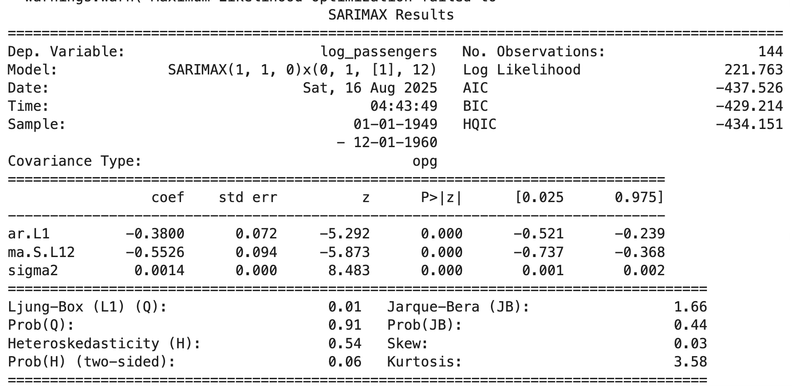{fig-align="center" width="80%"}

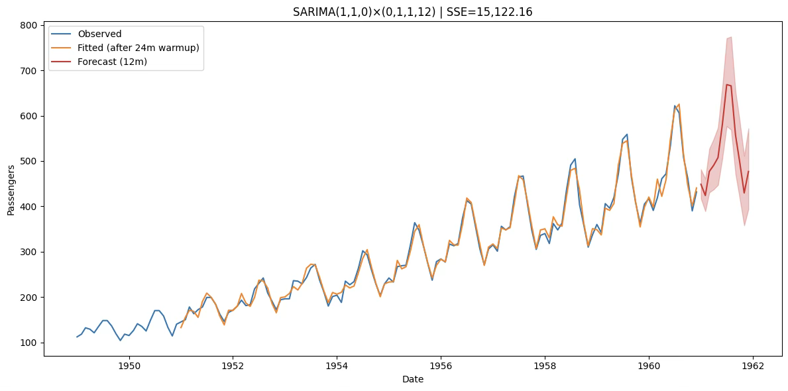{fig-align="center" width="80%"}
