## 비교분석(일변량분석) 기초

::: {.callout-note icon=false}
## 정의
**일변량 분석**은 개별 확률변수를 독립적으로 분석하여 각 변수의 분포 특성을 파악하고, 중심 경향이나 산포 정도를 요약함으로써 데이터의 전반적인 구조를 이해하는 분석이다. **비교 분석**은 두 개 이상의 모집단 또는 조건 간의 차이를 확률과 통계적 추론의 틀 안에서 검증하는 과정이다.
:::

### 개념

**일변량분석**: 변수의 유형에 따라 분석 방식은 달라진다. 범주형 변수는 개체를 분류하는 기능을 하며, 이 경우 분석은 주로 빈도와 상대빈도(비율)를 중심으로 이루어진다. 반면, 측정형 변수는 수치적으로 의미 있는 값을 가지므로 평균, 중앙값, 분산, 표준편차 등의 요약 통계량으로 변수의 중심과 퍼짐을 정리할 수 있다.

모집단으로부터 추출한 확률표본 데이터는 모집단의 모든 정보를 가진 축소 데이터이므로 확률표본의 확률분포함수는 모집단 확률분포함수와 동일하다. 이를 이용하여 $f(x)$(모집단에 대한 모든 정보)와 $\theta$(요약 정보)를 추론한다.

$$X \sim f(x;\theta)$$

$$r.s. = (x_{1},x_{2},\ldots,x_{n})$$

$$x_{i} \sim f(x_{i};\theta)$$

$$s(x_{1},x_{2},...,x_{n}) \sim f(s)$$

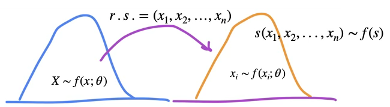{fig-align="center" width="70%"}

**비교분석**: 각 확률변수는 이론적으로는 고유의 확률분포함수를 가지고 있으며, 해당 분포를 대표하는 값으로는 모비율, 모평균, 모분산과 같은 모수가 있다.

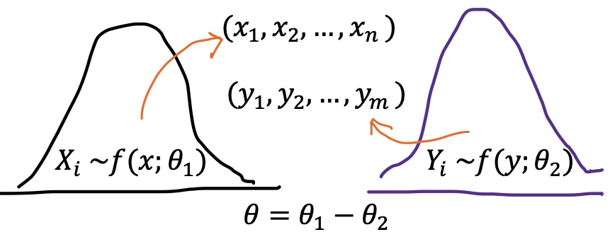{fig-align="center" width="70%"}

**관심 모수**

- 일변량 분석: 모비율 $(\theta = p)$, 모평균 $(\theta = \mu)$, 모분산 $(\theta = \sigma^{2})$
- 비교분석:
  - 모비율 차이 $(\theta = p_{1} - p_{2})$
  - 모평균 차이 $(\theta = \mu_{1} - \mu_{2})$
  - 모분산 차이 $(\theta = \sigma_{2}^{2}/\sigma_{1}^{2})$

### 분석절차

일변량 분석은 하나의 변수에 대해 그 분포 특성과 대표값을 요약하고 해석하는 분석이다. 이는 통계 분석의 가장 기본적인 단계이며, 이후 다변량 분석 또는 비교 분석의 기초가 된다.

::: {.callout-note icon=false}
## 통계적 추론 절차

| 단계 | 내용 |
|------|------|
| **① 가설 설정** | 모수(모평균·모비율·모분산)에 대한 귀무·대립가설 구체화 |
| **② 데이터 시각화** | 히스토그램·박스플롯·밀도함수로 분포 형태·이상값 파악 |
| **③ MVUE·샘플링분포 도출** | 최소분산 불편추정량과 검정통계량의 이론적 분포 결정 |
| **④ 검정통계량·p값 계산** | 관측값으로 검정통계량 산출 후 유의확률 계산 |
| **⑤ 결론** | p값과 유의수준 비교 → 귀무가설 기각 여부 판단 |
:::

**모수에 대한 통계적 가설 설정**: 통계학에서 말하는 모수란, 모집단의 특성을 수치적으로 나타내는 값으로서, 예를 들어 모평균, 모비율, 모분산 등이 이에 해당한다. 연구자는 관찰된 표본 데이터를 기반으로, 이러한 모수에 대해 일정한 주장을 하고 이를 검정하게 된다.

【예시】 모평균에 대한 가설

예를 들어, 어떤 교육 프로그램이 대학생의 수학 성취도에 미치는 영향을 평가하고자 할 때, 연구자는 해당 프로그램을 이수한 학생들의 수학 점수 평균이 전국 대학생 평균 점수인 70점과 유의미하게 다른지를 확인하고자 한다.

- 귀무가설: $\mu = 70$ → 해당 프로그램을 이수한 학생들의 수학 점수는 전국 평균과 같다.
- 대립가설: $\mu \neq 70$ → 프로그램을 이수한 학생들의 평균 점수는 전국 평균과 다르다.

**데이터 시각화**: 일변량 분석에서 통계적 검정에 앞서 먼저 수행해야 할 작업은 시각화와 탐색적 분석이다. 하나의 변수에 대해 히스토그램, 박스플롯, 밀도함수 곡선 등을 통해 분포의 형태, 이상값 존재 여부, 중심과 산포의 구조 등을 직관적으로 파악할 수 있다.

**MVUE 및 샘플링 분포 도출**: 가설검정에서 사용하는 통계량은 해당 모수에 대한 추정량이며, 이 추정량이 가질 수 있는 여러 후보 중에서도, 최소분산 불편추정량(MVUE)이 가장 선호된다.

- **불편성**: 추정량의 평균이 실제 모수와 일치
- **최소 분산**: 동일한 정보 하에서 가장 정확하고 안정적인 추정

가설검정은 다음과 같은 구조를 따른다.

$$\text{검정통계량} = \frac{\text{MVUE - 귀무가설 하 모수}}{\text{표준오차}}$$

**검정통계량 및 $p$값 계산**: 검정통계량 정의 $H_{0}:\mu = 70$

- 전제: 정규분포 또는 중심극한정리 성립
- 표준편차 $\sigma$를 알고 있는 경우: $z = \frac{\overline{X} - \mu_{0}}{\frac{\sigma}{\sqrt{n}}} \sim N(0,1)$
- 표준편차 $\sigma$를 모를 경우: $t = \frac{\overline{X} - \mu_{0}}{\frac{s}{\sqrt{n}}} \sim t(n - 1)$

**기각역과 유의확률 $p$값**: 유의확률 $p$값은, 귀무가설이 참이라는 전제 하에서 관측된 검정통계량 이상으로 극단적인 값이 나타날 확률을 의미한다.

- $p < \alpha$: 귀무가설 기각 → 결과는 통계적으로 유의하다.
- $p \geq \alpha$: 귀무가설 기각하지 않음 → 통계적으로 유의하지 않다.

### 예제 데이터

seaborn 라이브러리의 titanic 데이터셋은 실제 1912년 타이타닉 호 침몰 사고의 승객 정보를 바탕으로 구성되어 있다(15개 변수, 표본크기-승객 891명).

| 변수명 | 설명 | 데이터 타입 |
|-------|------|-----------|
| survived | 생존 여부 (0 = 사망, 1 = 생존) | int (범주형) |
| pclass | 선실 등급 (1, 2, 3등급) | int (순서형) |
| sex | 성별 | category |
| age | 나이 | float |
| sibsp | 동반한 형제자매/배우자 수 | int |
| parch | 동반한 부모/자녀 수 | int |
| fare | 운임 요금 | float |
| embarked | 탑승 항구 (C = Cherbourg, Q = Queenstown, S = Southampton) | category |
| class | 선실 등급 (문자형: First, Second, Third) | category |
| who | 승객 구분 (man, woman, child) | category |
| adult_male | 성인 남성 여부 | bool |
| deck | 선실 위치 (A-G, 일부 결측) | category |
| embark_town | 탑승 도시 (Cherbourg, Queenstown, Southampton) | category |
| alive | 생존 여부 (yes/no) | category |
| alone | 혼자 탑승 여부 | bool |

: 타이타닉 데이터셋 변수 목록 {.striped}

```python
#타이타닉 데이터 불러오기
import seaborn as sns
titanic = sns.load_dataset("titanic")
titanic.info()
```

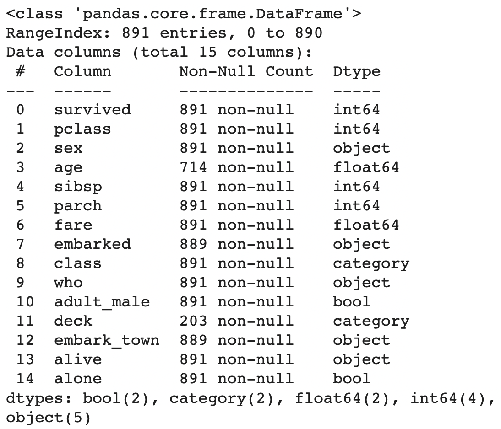{fig-align="center" width="70%"}

## 두 사물이 다르다는 것을 어떻게 알 수 있는가?

통계는 두 현상이 서로 다른지 판단할 때 유용한 도구다. 하지만 이 단순한 질문---"이 둘은 같은가, 다른가?"---의 답은 언제나 확률적인 것이다. 예를 들어 어떤 약이 효과가 있는지 알아보려 할 때, 우리는 다음과 같은 질문을 한다.

"이 약을 복용한 환자들과 그렇지 않은 환자들 사이에 실질적인 차이가 존재하는가?"

이는 두 그룹의 평균값이나 비율 또는 확률이 서로 통계적으로 유의미하게 다르냐는 문제로 귀결된다.

**평균의 차이가 진짜일까, 우연일까?** 가령, 한 실험에서 위약(placebo)을 투여한 집단의 평균 체중 감소량이 2파운드, 신약을 투여한 집단의 평균 감소량이 4파운드라고 하자. 이 경우 우리는 신약이 더 효과적이라고 생각할 수 있다. 하지만 그 차이가 단지 무작위 변동에 의한 것일 가능성도 있다.

여기서 통계는 두 질문에 답한다.

1. 관측된 차이가 얼마나 큰가?
2. 그 차이가 우연히 발생했을 가능성은 얼마나 작은가?

이 질문들에 대한 답은 신뢰 구간(confidence intervals)과 p값(p-values), 그리고 통계적 유의성(statistical significance)을 통해 평가된다.

**통계적 유의성과 실제적 유의성의 차이**: 통계적으로 유의미한 차이가 있다고 해서, 그 차이가 실제로도 의미 있는 것은 아니다. 통계적 유의성은 오직 그 차이가 무작위로 발생할 가능성이 매우 낮다는 사실만을 말해줄 뿐이다. 즉, "차이가 있다"는 것과 "중요한 차이다"는 것은 다르다.

**차이를 평가하는 기준: 효과 크기와 표준오차**

- 신약 복용 그룹 평균 체중 감소: 4.0 파운드
- 위약 그룹 평균 체중 감소: 2.0 파운드
- 두 집단 간 차이: 2.0 파운드
- 표준오차: 0.5 파운드

차이(2.0)가 표준오차(0.5)의 4배이면, 이는 무작위로 발생했을 가능성이 매우 낮다고 해석할 수 있다. 이러한 판단은 z-통계량 또는 t-통계량으로 정량화된다.

::: {.callout-important icon=false}
## p값의 올바른 해석

**p값**: 귀무가설이 참일 때, 관측된 차이 이상으로 극단적인 값이 나타날 확률

| p값 | 의미 | 결론 |
|-----|------|------|
| p < 0.05 | 우연히 발생할 가능성 < 5% | 귀무가설 기각 |
| p < 0.01 | 우연히 발생할 가능성 < 1% | 귀무가설 강하게 기각 |
| p ≥ 0.05 | 우연히 발생할 가능성 ≥ 5% | 귀무가설 기각 불가 |

**⚠️ 흔한 오해:** p < 0.05는 "귀무가설이 5% 확률로 참" 또는 "대립가설이 95% 확률로 참"이 아니다.
:::

## 모비율 추론

### 일집단 모비율

**연구문제 및 통계적 가설**: 대규모 해양 재난인 타이타닉호 사고 당시, 전체 승객에 대한 사망률이 60%보다 높았다는 통계적 근거가 있는가?

- 귀무가설: $H_{0}:p = 0.6( = p_{0})$, 여기서 $p$는 모집단 사망률
- 대립가설: $H_{1}:p > 0.6( = p_{0})$ (단측가설)
- 모수: $\theta = p$

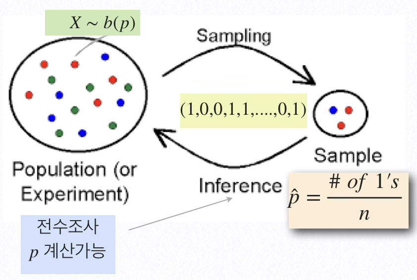{fig-align="center" width="60%"}

**시각화**: 일변량 범주형 변수의 시각화는 빈도와 비율(확률분포함수)를 표현하는 것으로 바차트나 파이차트 도구를 이용한다. 타이타닉 승객의 표본 사망율은 61.6%이다.

```python
import seaborn as sns
import matplotlib.pyplot as plt

# 데이터 불러오기
titanic = sns.load_dataset("titanic")

# 생존/사망 값 개수 계산
counts = titanic['survived'].value_counts()
labels = ['Died', 'Survived']
colors = ['#ff9999','#66b3ff']

# 파이차트 그리기
plt.figure(figsize=(6, 6))
plt.pie(
    counts,
    labels=labels,
    autopct='%1.1f%%',
    startangle=90,
    colors=colors,
    explode=(0.05, 0)  # 강조 효과
)
plt.title("Titanic Survival Distribution")
plt.axis('equal')  # 원형 유지
plt.show()
```

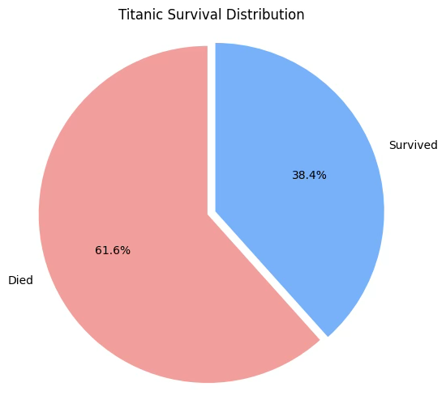{fig-align="center" width="60%"}

**MVUE 및 샘플링분포**: 모비율의 MVUE 추정치는 표본 비율 $\widehat{p} = \frac{\#\_ of\_ death}{\#\_ of\_ n} = 0.62$이고 샘플링분포는 중심극한정리에 의해 $\widehat{p} \sim N(p,\frac{p(1 - p)}{n})$이다.

**검정통계량 및 $p$값 계산, 그리고 신뢰구간**: 추정분산 $V(\widehat{p}) = \frac{p(1 - p)}{n}$이므로 표본비율의 표준편차인 표준오차 $s(\widehat{p}) = \sqrt{\frac{p(1 - p)}{n}}$이다.

- 검정통계량: $ts = \frac{\widehat{p} - p_{0}}{s(\widehat{p}) = \sqrt{\frac{p_{0}(1 - p_{0})}{n}}} \sim z$
- 유의확률: $pvalue = P(z > |ts|)$

**모비율 $100(1 - \alpha)\%$ 신뢰구간**

$$\widehat{p} \pm z_{1 - \alpha/2}\sqrt{\widehat{p}(1 - \widehat{p})/n} = (0.584,0.648)$$

```python
import statsmodels.api as sm
from statsmodels.stats.proportion import proportions_ztest
import seaborn as sns

# 사망자 수 및 전체 탑승자 수
count = titanic[titanic['survived'] == 0].shape[0]
nobs = titanic.shape[0]
p0 = 0.6  # 귀무가설: 사망률 = 0.6

# 검정 수행
stat, pval = proportions_ztest(count, nobs, value=p0, alternative='larger')

# 신뢰구간 계산 (normal approximation)
ci_low, ci_upp = sm.stats.proportion_confint(count, nobs, alpha=0.05, method='normal')

# 출력
print(f"사망자 수: {count}")
print(f"전체 탑승자 수: {nobs}")
print(f"관측된 사망률: {count/nobs:.3f}")
print(f"검정통계량: {stat:.3f}")
print(f"p-값: {pval:.4f}")
print(f"사망률 95% 신뢰구간: ({ci_low:.3f}, {ci_upp:.3f})")
```

**결론: 승객 사망률은 0.6 초과인가?**

| 표본비율 | 검정통계량 | 유의확률 |
|:-------:|:--------:|:------:|
| 0.616 | 0.992 | 0.321 |

: 95% 신뢰구간: (0.584, 0.648) {.striped}

유의확률이 0.321로 유의수준 0.05보다 크므로 귀무가설이 채택되어, 승객 사망률이 0.6보다 크다고 할 만한 통계적 근거는 부족하다.

### 일집단 모비율-특수한 경우

#### 모비율 소표본 $min(np,n(1-p)) \le 5$

모비율 검정 시 검정통계량의 분포는 정규분포를 가정한다. 이는 중심극한 정리에 의한 것으로 대표본 경우에만 MVUE, 표본비율 샘플링분포는 정규분포를 따른다.

그러나 소표본($min(np,n(1 - p)) < 5$)인 경우는 이항분포를 이용하여 가설을 검정한다. 모집단의 개체가 성공(성공 확률이 $p$), 실패의 결과만 있으므로 확률표본은 베르누이 시행과 동일하다. 그러므로 표본크기 $n$ 확률표본으로부터 구한 성공 개체의 수 합은 이항분포 $B(n,p)$를 따른다.

학생 흡연 비율이 20% 미만이라고 발표했다. 맞는지 알아보기 위하여 학생 20명을 확률 추출하여 흡연여부를 알아본 결과 3명이 흡연하고 있다고 조사되었다.

> 귀무가설 : $H_{0}:p = 0.2$ vs. 대립가설 : $H_{0}:p < 0.2$
>
> $min(20*0.2,20*0.8) = 4 < 5$이므로 중심극한정리 적용이 불가능하다. 대신 흡연자 수는 이항분포(20, p=0.2)를 따르므로 유의확률은 다음과 같다. 귀무가설을 기각할 수 없어 학생 흡연율은 20% 미만이라 할 수 없다. $P(\sum X_{i} \leq 3|sumX_{i} \sim B(n = 20,p = 0.2)) = 0.42$

#### Wilson 통계량

표본크기 $n$에 비해 성공회수 $\sum x_{i} = x$가 매우 작은 경우 비율 추정치는 $\widehat{p} = \frac{x}{n}$ 대신 $\widehat{p} = \frac{x + 2}{n + 4}$를 사용하고 추정방법은 대표본 동일하다.

### 독립인 두 모집단 비율 차이

**연구문제 및 통계적 가설**: 타이타닉호 사고 당시, 단독 탑승 승객의 생존률이 동반자와 함께 탑승한 승객의 생존률보다 통계적으로 유의하게 15% 이상 높은지를 검정하고자 한다.

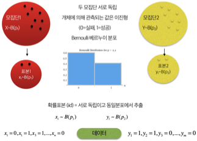{fig-align="center" width="70%"}

- 귀무가설: $H_{0}:p_{1} - p_{2} = 0.15$, 여기서 $p_{1}$는 혼자 여행하는 승객의 생존율, $p_{2}$는 동반 여행하는 승객의 생존율
- 대립가설: $H_{1}:p_{1} - p_{2} > 0.15$ (단측가설)
- 모수: $\theta = p_{1} - p_{2}$

**시각화**

```python
#동반여부별 생존여부 시각화
import matplotlib.pyplot as plt

# 상대빈도 계산 (교차비율표 → 정규화)
prop_df = (
    titanic
    .groupby(['alone', 'survived'])
    .size()
    .reset_index(name='count')
)

# 전체 대비 비율 계산 (alone 그룹 내 비율)
prop_df['proportion'] = prop_df.groupby('alone')['count'].transform(lambda x: x / x.sum())

# 시각화
plt.figure(figsize=(6, 5))
ax = sns.barplot(data=prop_df, x='alone', y='proportion', hue='survived', palette='Set2')

# 축 라벨 및 타이틀 설정
ax.set_xticklabels(['Not Alone', 'Alone'])
plt.ylabel("Proportion")
plt.xlabel("Traveling Alone")
plt.title("Survival Rate by Alone Status")
plt.ylim(0, 1)

# 비율 라벨 표시
for container in ax.containers:
    ax.bar_label(container, labels=[f'{h:.1%}' for h in container.datavalues], label_type='center')

plt.legend(title="Survived", labels=["No", "Yes"])
plt.tight_layout()
plt.show()
```

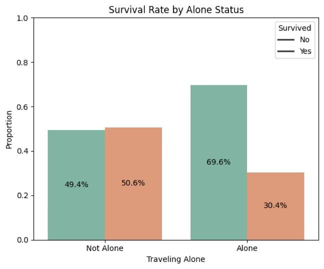{fig-align="center" width="60%"}

**MVUE 및 샘플링분포**

- 동반 여행하는 승객 표본비율: ${\widehat{p}}_{1} = 0.506$
- 혼자 여행하는 승객 표본비율: ${\widehat{p}}_{2} = 0.304$
- MVUE: $\widehat{\theta} = {\widehat{p}}_{1} - {\widehat{p}}_{2} = 0.202$

$${\widehat{p}}_{1} - {\widehat{p}}_{2} = N(p_{1} - p_{2},\frac{p_{1}(1 - p_{1})}{n_{1}} + \frac{p_{2}(1 - p_{2})}{n_{2}})$$

```python
# alone별 survived = 1 비율 (평균값이 생존률)
survival_rate_by_alone = titanic.groupby('alone')['survived'].mean()
print(titanic['survived'].mean(),survival_rate_by_alone)
```

0.3838383838383838
<br>
alone
<br>
False    0.505650
<br>
True     0.303538

**검정통계량 및 $p$값 계산, 그리고 신뢰구간**

$$\widehat{\theta} = {\widehat{p}}_{1} - {\widehat{p}}_{2},\quad s({\widehat{p}}_{1} - {\widehat{p}}_{2}) = \sqrt{\frac{{\widehat{p}}_{1}(1 - {\widehat{p}}_{1})}{n_{1}} + \frac{{\widehat{p}}_{2}(1 - {\widehat{p}}_{2})}{n_{2}}}$$

**$100(1-\alpha) \%$ 모비율 차이($p_{1} - p_{2}$) 신뢰구간**

$$({\widehat{p}}_{1} - {\widehat{p}}_{2}) \pm z_{1 - \alpha/2}\sqrt{\frac{{\widehat{p}}_{1}(1 - {\widehat{p}}_{1})}{n_{1}} + \frac{{\widehat{p}}_{2}(1 - {\widehat{p}}_{2})}{n_{2}}}$$

```python
#모비율 차이 검정
from statsmodels.stats.proportion import proportions_ztest

# 집단별 생존자 수 및 전체 수
grouped = titanic.groupby("alone")["survived"].agg(['sum', 'count'])

success = [grouped.loc[False, 'sum'], grouped.loc[True, 'sum']]
nobs = [grouped.loc[False, 'count'], grouped.loc[True, 'count']]

# 단측 검정 : 모수차이 0.15 설정
stat, pval = proportions_ztest(success, nobs, value=0.15, alternative='larger')

# 출력
print(f"검정통계량: {stat:.3f}")
print(f"p-값: {pval:.4f}")
```

**결론: 혼자 여행 승객 생존률은 동반 여행 승객 생존률보다 15% 높은가?**

| 집단 | 표본비율 | 검정통계량 | 유의확률 |
|------|:-------:|:--------:|:------:|
| 동반 여행 | 0.506 | 1.565 | 0.059 |
| 홀로 여행 | 0.304 | | |
| 총합 | 0.384 | | |

: 두 모집단 비율 차이 검정 결과 {.striped}

유의확률이 0.059로 유의수준 0.05를 초과하므로 귀무가설을 기각할 수 없다.

### 짝진 집단 비율 차이 McNemar 검정

**연구문제(시나리오)**: 동일한 개체에 대하여 이진형(성공, 실패) 결과의 실험(프로그램)을 서로 다른 두 기간(before - after)에 측정하여 실험(프로그램) 효과가 있는지 알아보는 방법이다.

[사례연구] Bland (2000) 1319명 어린이에 대하여 12살에 독감에 걸릴 가능성은 나이가 14살이 되면 높아지는지, 낮아지는지 알아보기 위하여 조사한 결과이다. <https://www.medcalc.org/manual/mcnemartest2.php>

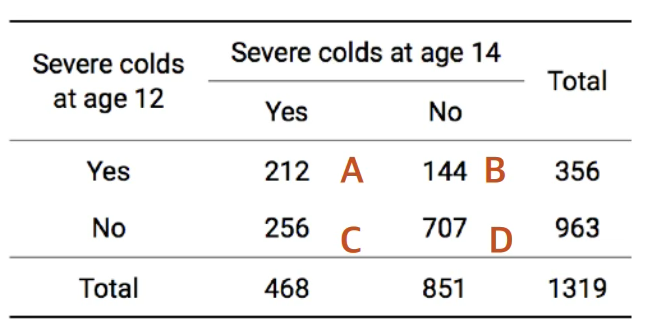{fig-align="center" width="60%"}

**통계적 가설**

- 귀무가설 : 나이에 관계없이 감기 걸릴 가능성은 동일하다. $P(B) = P(C)$
- 대립가설 : 나이에 따른 독감 걸릴 가능성은 달라진다.

**점추정치 및 샘플링 분포**: $TS = \frac{(B - C)^2}{B + C} = \frac{(144 - 256)^2}{144 + 256} = 31.36 \sim \chi^2(1)$

**유의확률**: $p = P(\chi_{(1)}^{2} > 31.36) < 0.001$

**결론**: 귀무가설은 기각되어, 12살에 독감 걸릴 확률은 27%(=356/1319)이다. 14살에 독감 걸릴 확률은 34.7%(=468/1319)이다. 그러므로 나이가 올라가면 독감에 걸릴 가능성이 높아진다.

## 모평균 추론

### 일집단 모평균

**연구문제 및 통계적 가설**: 타이타닉호 승객들의 평균 연령이 30세 미만이었는지를 알아보고자 한다.

- 귀무가설: $H_{0}:\mu = 30( = \mu_{0})$, 여기서 $\mu$는 승객 평균 나이
- 대립가설: $H_{1}:\mu < 30( = \mu_{0})$ (단측가설)

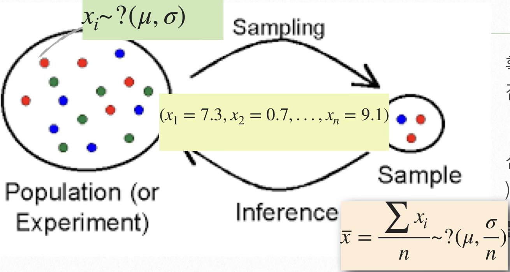{fig-align="center" width="60%"}

- 모수: $\theta = \mu$, 보조 ancillary 모수 $\sigma^{2}$는 MVUE($\widehat{\sigma^{2}} = S^{2}$)로 대체한 후 모수 $\theta$에 대한 추론을 한다.

**시각화**

#### 히스토그램

히스토그램은 연속형(측정형) 변수의 분포 특성을 시각적으로 표현하는 대표적인 그래프로, 수평축(x-축)은 데이터의 구간(계급), 수직축(y-축)은 해당 구간에 속하는 도수 또는 상대도수를 나타낸다.

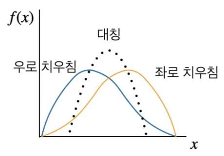{fig-align="center" width="40%"}

계급의 수는 일반적으로 8개에서 12개 사이가 적절하며, 표본의 크기를 $n$이라 할 때 적절한 계급 수 $k$는 Sturges의 공식으로 근사할 수 있다. $k = 1 + 3.322\log_{10}(n)$

1. **분포의 모양 (Shape) - 왜도**

   - 대칭 분포: 종 모양이거나 좌우 대칭 → 예: 정규분포
   - 우측(+) 치우침: 긴 오른쪽 꼬리, 예: 소득, 주가
   - 좌측(-) 치우침: 긴 왼쪽 꼬리, 예: 소득에서 기본 소득 미만 많음
   - 이첨성(Bimodal) 또는 다첨성(Multimodal): 두 개 이상의 중심이 있는 분포

2. **중심위치 (Center)**

   - 최빈값(mode) 위치에서 가장 높은 막대
   - 평균이나 중앙값의 대략적 위치를 가늠

3. **산포도 (Spread) - 첨도**

   - 분포의 넓이로 데이터의 변동성이나 표준편차의 정도를 직관적으로 판단
   - 고첨도 (Leptokurtic): 뾰족하고 꼬리가 두꺼움, 극단값 자주 발생 (수익률, 사고율)
   - 평첨도 (Platykurtic): 평평하고 꼬리가 짧음, 시험점수, 설문척도

4. **이상값(Outliers)의 존재 가능성**

   - 분포의 양쪽 끝에 고립된 막대가 있을 경우, 극단치 존재 가능성 있음
   - 상자수염 그림을 병행하여 이상값 여부를 정밀 진단할 수 있음

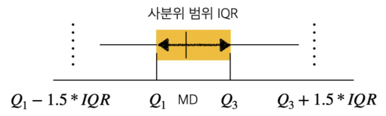{fig-align="center" width="60%"}

상자 그림은 연속형 자료의 분포를 시각적으로 요약하는 대표적인 탐색적 자료 분석 도구로, 다음의 다섯 가지 핵심 통계량을 기반으로 구성된다.

최소값 (minimum), 제1사분위수 (Q₁, 25th percentile), 중앙값 (median, Q₂), 제3사분위수 (Q₃, 75th percentile), 최대값 (maximum)

- $IQR = Q_{3} - Q_{1}$: 사분위 범위(Interquartile Range)로, 데이터의 중심 50%가 분포하는 구간이다.
- 수염(whisker): $\lbrack Q_{1} - 1.5 \times IQR,Q_{3} + 1.5 \times IQR\rbrack$ 범위 내에 있는 최소값과 최대값을 가리킨다. 수염 밖에 존재하는 관측값은 이상치(outlier)로 간주되며, 보통 별표(\*) 혹은 점(·)으로 표시한다.

#### 커널추정

확률표본 데이터를 모집단으로 유한개의 데이터 표본을 이용하여 모집단 확률분포함수를 평활법에 의해 구한다. 신호처리에서는 Parzen-Rosenblatt window 방법이라고 한다. KDE kernel density estimator는 커널 함수를 이용하여 히스토그램 폴리곤 방법을 보다 스무드한 곡선으로 연결하여 추정하는 방법이다.

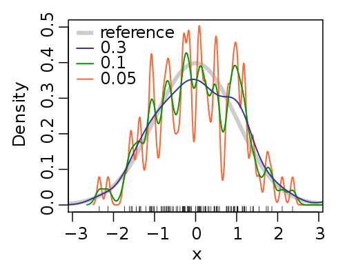{fig-align="center" width="50%"}

커널함수 $\int_{- \infty}^{\infty}K(x)dx = 1$는 양의실수 적분가능한 좌우 대칭인 함수이며 Gaussian, Epanechnikov 등이 유명한 커널 함수이다. 확률분포함수 $f(x)$로 부터 확률표본 데이터 $x_{1},x_{2},\cdots,x_{n}$가 주어진 경우 커널추정량은 $\widehat{f(x)} = \frac{1}{nh}\overset{n}{\sum_{i = 1}}K(\frac{x - x_{i}}{h})$이다. $K()$는 커널함수이고 $h$는 bandwith 모수이다.

- 최적 $h = (\frac{4{\widehat{\sigma}}^{5}}{3n})^{\frac{1}{5}} \approx 1.06\widehat{\sigma}n^{- 0.2}$
- 만약 좌우로 치우친 분포의 경우 $\widehat{\sigma} = min(sd,IQR/1.34)$

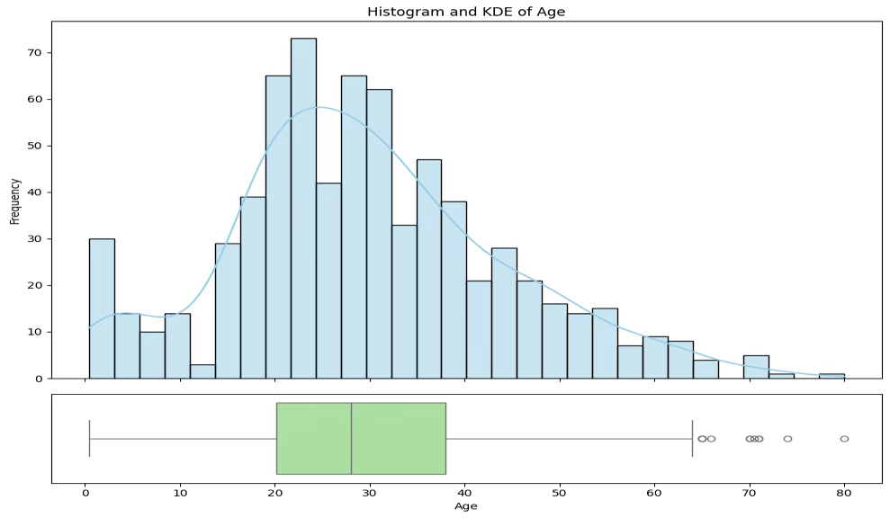{fig-align="center" width="80%"}

```python
#이상치 제거
# age 변수의 이상치 기준 계산 (IQR)
q1 = titanic['age'].quantile(0.25)
q3 = titanic['age'].quantile(0.75)
iqr = q3 - q1

# 이상치 경계
lower_bound = q1 - 1.5 * iqr
upper_bound = q3 + 1.5 * iqr

# 이상치 제외한 데이터프레임 생성
titanic0 = titanic[(titanic['age'] >= lower_bound) & (titanic['age'] <= upper_bound)]

# 결과 확인
print(f"원래 데이터 수: {titanic.shape[0]}")
print(f"이상치 제거 후 데이터 수: {titanic0.shape[0]}")
```

원래 데이터 수: 891
<br>
이상치 제거 후 데이터 수: 703

**MVUE 및 샘플링분포**: 모평균 $\mu$의 MVUE 추정치는 표본평균 $\overline{x} = \sum x_{i}/n = 29.1$

보조모수 $\sigma^{2}$ MVUE: $\widehat{\sigma^{2}} = s^{2} = \frac{\sum(x_{i} - \overline{x})^{2}}{n - 1}$

**샘플링분포**

- (대표본 $n > 20$) 중심극한정리에 의해 $\overline{x} \sim N(\mu,\sigma^{2}/n)$이다.
- (소표본) 모집단 확률분포 정규분포라는 가정 하에 $\frac{\overline{x} - \mu}{\frac{s}{\sqrt{n}}} \sim t(n - 1)$이다.

**검정통계량 및 $p$값 계산, 그리고 신뢰구간**

```python
from scipy.stats import ttest_1samp
import seaborn as sns

# 이상치 제거된 titanic0 사용
age_clean = titanic0['age'].dropna()  # 결측값 제거

# 단일 평균에 대한 t-검정
t_stat, p_val = ttest_1samp(age_clean, popmean=30)

# 결과 출력
print(f"표본 크기: {age_clean.shape[0]:.0f}")
print(f"표본 평균: {age_clean.mean():.1f}")
print(f"표본 표준편차: {age_clean.std():.2f}")
print(f"t-통계량: {t_stat:.3f}")
print(f"p-값: {p_val:.4f}")
```

표본 크기: 703
<br>
표본 평균: 29.1
<br>
표본 표준편차: 13.73
<br>
t-통계량: -1.792
<br>
p-값: 0.0735

```python
#모평균 신뢰구간
import scipy.stats as st
# 'confidence' argument added to specify the confidence level
st.t.interval(confidence=0.95, df=len(age_clean)-1,
              loc=age_clean.mean(), scale=st.sem(age_clean))
```

(np.float64(28.06), np.float64(30.09))

- MVUE 표본평균: $\widehat{\theta} = \overline{x} = 29.1$
- $\overline{x}$의 표준오차: $se(\overline{x}) = \frac{s}{\sqrt{n}} = \frac{13.73}{\sqrt{793}}$
- (대표본) 검정통계량: $ts = \frac{\overline{x} - \mu_{0}}{se(\overline{x})} = \frac{29.1 - 30}{\frac{13.73}{\sqrt{703}}} = - 1.79$
- 유의확률: $p = P(z > | - 1.79|) = 0.0735$
- 모평균 $100(1 - \alpha)\%$ 신뢰구간: $(\overline{x} - t_{1 - \alpha/2;n - 1}\frac{s}{\sqrt{n}},\overline{x} + t_{1 - \alpha/2;n - 1}\frac{s}{\sqrt{n}})$

**결론: 타이타닉 승객 평균 나이는 30세 미만인가?**

| 표본평균 | 표준편차 | 검정통계량 | 유의확률 |
|:-------:|:-------:|:--------:|:------:|
| 29.1 | 13.73 | -1.792 | 0.074 |

: 95% 신뢰구간: (28.06, 30.09) {.striped}

타이타닉 승객의 평균 나이가 30세 미만인지를 검정한 결과, 유의확률(0.074)이 유의수준 0.05를 초과하므로 귀무가설을 기각할 수 없으며, 따라서 타이타닉 승객의 평균 나이가 30세 미만이라고 통계적으로 유의하게 말하기는 어렵다.

### 독립인 두 모집단 평균 차이

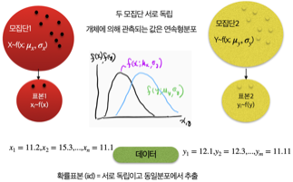{fig-align="center" width="80%"}

**연구문제 및 통계적 가설**: 타이타닉호 승객들의 성별에 따른 나이의 차이가 있는지 알아보고자 한다.

- 귀무가설: $H_{0}:\mu_{1} - \mu_{2} = 0$, 여기서 $\mu_{1}$은 남자 승객 평균 나이, $\mu_{2}$은 여자 승객 평균 나이는 같다.
- 대립가설: $H_{1}:\mu_{1} - \mu_{2} \neq 0$ (양측가설)
- 모수: $\theta = \mu_{1} - \mu_{2}$

**시각화**

```python
import seaborn as sns
import matplotlib.pyplot as plt
import pandas as pd

# 데이터 불러오기
titanic = sns.load_dataset("titanic")
titanic = titanic[['sex', 'age']].dropna()

# 그래프 그리기
fig, axs = plt.subplots(2, 1, figsize=(10, 8), sharex=True)

# 히스토그램
sns.histplot(data=titanic, x="age", hue="sex", bins=30, ax=axs[0],
             element="step", stat="density", common_norm=False, alpha=0.4)

# KDE 추가
sns.kdeplot(data=titanic, x="age", hue="sex", ax=axs[0], common_norm=False)

axs[0].set_title("age distribution by gender (histogram + KDE)")
axs[0].set_ylabel("density")

# 상자그림
sns.boxplot(data=titanic, x="age", y="sex", ax=axs[1])
axs[1].set_title("age distribution by gender (box plot)")
axs[1].set_xlabel("age")

plt.tight_layout()
plt.show()
```

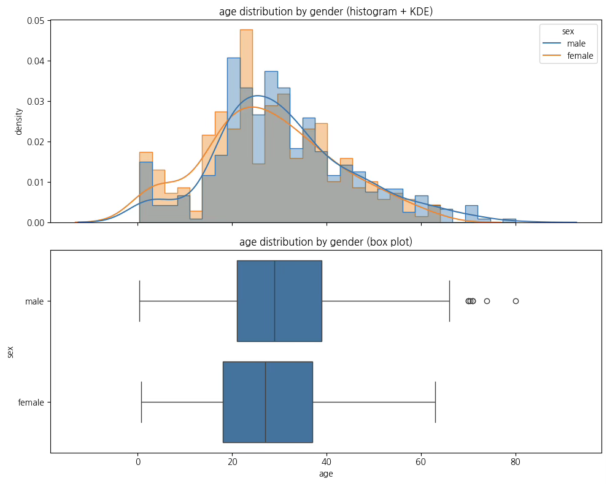{fig-align="center" width="80%"}

**MVUE 및 샘플링분포**

- 모평균 $\mu_{1}$의 MVUE 추정치: 표본 평균 $\overline{x} = \frac{\sum x_{i}}{n_{1}} = 27.9$
- 모평균 $\mu_{2}$의 MVUE 추정치: 표본 평균 $\overline{y} = \frac{\sum y_{i}}{n_{2}} = 30.7$
- 모수의 MVUE: $\widehat{\theta} = \overline{x} - \overline{y} = - 2.8$
- 등분산 가정 시(통합분산): $s_{p}^{2} = \frac{(n_{1} - 1)s_{1}^{2} + (n_{2} - 1)s_{2}^{2}}{n_{1} + n_{2} - 2}$

**등분산성(homoscedasticity): Levene's test**: 등분산 여부는 이후 검정통계량 선택에 영향을 미치므로 반드시 확인한다.

$$H_{0}:\sigma_{1}^{2} = \sigma_{2}^{2}\text{ vs. }H_{1}:\sigma_{1}^{2} \neq \sigma_{2}^{2}$$

검정통계량: $ts = \frac{s_{1}^{2}}{s_{2}^{2}} \sim F(df_{1} = n_{1} - 1,df_{2} = n_{2} - 1)$

```python
from scipy.stats import levene

# 타이타닉 데이터에서 성별별 나이
df = titanic[['sex', 'age']].dropna()
male_age = df[df['sex'] == 'male']['age']
female_age = df[df['sex'] == 'female']['age']

# 등분산 검정
stat, p = levene(male_age, female_age)
print(f"Levene 검정 통계량: {stat:.3f}, p-값: {p:.4f}")
```

Levene 검정 통계량: 0.001, p-값: 0.9712

등분산에 대한 귀무가설을 기각할 수 없으므로, 두 집단은 등분산성을 만족한다고 볼 수 있다.

**샘플링분포(소표본) 정규분포 가정**

- 이분산: $t = \frac{{\overline{X}}_{1} - {\overline{X}}_{2}}{\sqrt{\frac{s_{1}^{2}}{n_{1}} + \frac{s_{2}^{2}}{n_{2}}}} \sim t(df^{*})$, Welch-Satterthwaite $df^{*} = \frac{\left( \frac{s_{1}^{2}}{n_{1}} + \frac{s_{2}^{2}}{n_{2}} \right)^{2}}{\frac{(s_{1}^{2}/n_{1})^{2}}{n_{1} - 1} + \frac{(s_{2}^{2}/n_{2})^{2}}{n_{2} - 1}}$
- 등분산: $\frac{{\overline{X}}_{1} - {\overline{X}}_{2}}{s_{p} \cdot \sqrt{\frac{1}{n_{1}} + \frac{1}{n_{2}}}} \sim t(df = n_{1} + n_{2} - 2)$

$$(\overline{x} - \overline{y}) \pm t(\alpha/2,n + m - 2)\sqrt{\frac{s_{x}^{2}}{n} + \frac{s_{y}^{2}}{m}}$$

```python
import seaborn as sns
import pandas as pd
from scipy.stats import ttest_ind

# 데이터 불러오기
titanic = sns.load_dataset("titanic")
df = titanic[['sex', 'age']].dropna()

# 성별에 따른 나이의 평균 및 표준편차
summary = df.groupby('sex')['age'].agg(['mean', 'std']).rename(columns={'mean': '평균 나이', 'std': '표준편차'})

# 소수점 2자리로 출력
summary = summary.round(2)
print(summary)

#승객 나이 평균, 표준편차
print(df['age'].mean(),df['age'].std())

# 성별 그룹 분리
male_age = df[df['sex'] == 'male']['age']
female_age = df[df['sex'] == 'female']['age']

# 독립표본 t-검정 (등분산 가정 X)
t_stat, p_value = ttest_ind(male_age, female_age, equal_var=False)

print(f"t-통계량: {t_stat:.3f}")
print(f"p-값: {p_value:.4f}")
```

>> 평균 나이   표준편차
<br>
female  27.92  14.11
<br>
male    30.73  14.68
<br>
29.69911764705882 14.526497332334044
<br>
t-통계량: 2.526
<br>
p-값: 0.0118

**결론: 여성 승객과 남성 승객 평균 나이는 차이가 있나?**

| 집단 | 평균 | 표준편차 | 검정통계량 | 유의확률 |
|------|:---:|:-------:|:--------:|:------:|
| 여성 | 27.9 | 14.1 | 2.53 | 0.012 |
| 남성 | 30.7 | 14.7 | | |
| 총합 | 29.7 | 14.5 | | |

: 독립 두 모집단 평균 차이 검정 결과 {.striped}

귀무가설이 기각되어, 여성 승객의 평균 나이 27.9세와 남성 승객의 평균 나이 30.7세 사이에는 통계적으로 유의한 차이가 있는 것으로 나타났다.

**남자 승객 나이 이상치 제거 후 분석**

| 집단 | 평균 | 표준편차 | 검정통계량 | 유의확률 |
|------|:---:|:-------:|:--------:|:------:|
| 여성 | 27.9 | 14.1 | 1.977 | 0.049 |
| 남성 | 30.1 | 13.8 | | |
| 총합 | 29.3 | 13.96 | | |

: 이상치 제거 후 검정 결과 {.striped}

```python
import seaborn as sns
import pandas as pd
from scipy.stats import ttest_ind
# 1. 데이터 불러오기 및 결측 제거
titanic = sns.load_dataset("titanic")
df = titanic[['sex', 'age']].dropna()
# 2. 남성 나이 이상치 제거 (IQR 방식)
male = df[df['sex'] == 'male']['age']
Q1 = male.quantile(0.25)
Q3 = male.quantile(0.75)
IQR = Q3 - Q1
lower = Q1 - 1.5 * IQR
upper = Q3 + 1.5 * IQR
male_clean = male[(male >= lower) & (male <= upper)]
# 3. 여성 나이
female = df[df['sex'] == 'female']['age']
# 4. 통합 데이터 (여성 + 이상치 제거된 남성)
combined = pd.concat([female, male_clean], axis=0)
# 5. 평균 및 표준편차 요약표
summary = pd.DataFrame({'평균 나이': [female.mean(),male_clean.mean(),combined.mean()],
    '표준편차': [female.std(),male_clean.std(),combined.std()],
    '표본 수': [len(female),len(male_clean),len(combined)]
}, index=['female', 'male(이상치제외)', '통합']).round(2)

print("📊 성별 및 통합 평균 나이와 표준편차:")
print(summary)

# 6. 독립표본 t-검정 (등분산 가정 X)
t_stat, p_val = ttest_ind(male_clean, female, equal_var=False)

print("\n🧪 평균 차이 검정 (Welch's t-test):")
print(f"t-통계량: {t_stat:.3f}")
print(f"p-값: {p_val:.4f}")
```

📊 성별 및 통합 평균 나이와 표준편차:
<br>
평균 나이   표준편차  표본 수
<br>
female       27.92  14.11   261
<br>
male(이상치제외)  30.07  13.82   446
<br>
통합           29.28  13.96   707
<br>
🧪 평균 차이 검정 (Welch's t-test):
<br>
t-통계량: 1.977
<br>
p-값: 0.0486

### 짝진 두 모집단 평균 차이

**개념**: 짝진 집단의 평균 차이 검정은 동일하거나 연관된 실험 단위로부터 두 번 측정된 자료(예: 처리 전·후 측정값)에 대해, 두 처리 간 평균 차이에 통계적으로 유의한 차이가 있는지를 검정하는 절차이다.

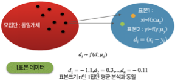{fig-align="center" width="60%"}

대표적인 예로는 동일한 피험자에게 어떤 처치를 가하기 전과 후에 측정한 결과를 비교하는 경우가 있으며, 이는 약물 복용 전후의 혈압 변화와 같은 사례로 설명할 수 있다.

::: {.callout-note icon=false}
## 짝진 검정의 핵심 원리
**짝지어진 두 표본 간의 평균 차이를 비교하는 것은, 그 차이값들의 평균이 0인지 검정하는 것과 완전히 동일하다.**

각 짝$(x_{i},y_{i})$마다 두 값의 차이를 계산하면 새로운 변수 $d_{i} = x_{i} - y_{i}$가 형성된다. 짝진 평균 차이 검정은 '차이'라는 하나의 변수에 대한 평균 검정 문제로 변환되며, 이는 구조적으로 단일 집단의 평균이 0인지 검정하는 문제와 동일하다.
:::

## 모분산 추론

### 일집단 모분산

**연구문제 및 통계적 가설**: 분산은 통계학에서 관측값이 평균으로부터 얼마나 퍼져 있는지를 나타내는 지표로, 매우 기본적이면서도 핵심적인 개념이다.

- 투자에서의 수익률은 불확실하며, 이 불확실성의 크기를 정량화한 것이 바로 변동성(volatility)이다. 투자 분야에서는 분산이 클수록 리스크가 크다, 다시 말해 예측이 어렵고 손실 가능성도 크다고 해석한다.
- 반면, 제조나 공정 품질 관리 분야에서는 작은 분산은 제품이 일관되게 생산되고 있다는 신호로 받아들여진다. "품질은 분산의 역수"라는 표현이 널리 사용된다.

- 귀무가설: $H_{0}:\sigma^{2} = \sigma_{0}^{2}$
- 대립가설: $H_{1}:\sigma^{2} \neq \sigma_{0}^{2}$

**MVUE 및 샘플링분포**

- MVUE : $\widehat{\sigma^{2}} = s^{2} = \frac{\sum(x_{i} - \overline{x})^{2}}{n - 1}$
- 샘플링분포: $(n - 1)\frac{s^{2}}{\sigma^{2}} \sim \chi^{2}(n - 1)$, 모집단 정규분포 가정이 필요함

**검정통계량 및 $p$값 계산**

- 검정통계량: $ts = (n - 1)\frac{s^{2}}{\sigma_{0}^{2}}$
- 유의확률: $p = P(\chi_{(df = n - 1)}^{2} > ts)$

**사례**: 한 자산운용사는 단기 투자용 펀드의 월간 수익률이 안정적인 수준을 유지하고 있는지 점검하고자 한다. 이 펀드는 "월간 수익률의 표준편차가 4% 이하여야 한다"는 내부 리스크 관리 기준을 갖고 있다.

펀드운용팀은 최근 24개월 동안의 수익률 데이터($n = 24,s^{2} = {0.05}^{2}$)를 수집하였다.

- 귀무가설: $H_{0}:\sigma^{2} = \sigma_{0}^{2} = {0.04}^{2}$
- 대립가설: $H_{1}:\sigma^{2} \neq \sigma_{0}^{2} = {0.04}^{2}$
- 검정통계량: $ts = (n - 1)\frac{s^{2}}{\sigma_{0}^{2}} = (24 - 1)\frac{{0.05}^{2}}{{0.04}^{2}} \approx 35.9$
- 유의확률: $p = P(\chi_{(df = n - 1)}^{2} > 35.9) < 0.001$

결론: 귀무가설이 기각되어 펀드의 수익률 표준편차가 4%라는 내부 기준을 초과하는 것으로 나타나며, 이는 투자자 보호 및 리스크 관리 차원에서 제도적 개입이 필요함을 시사한다.

### 독립인 두 모집단 분산 차이

**개념**: 서로 다른 두 개의 자산이 있을 때, 단순히 평균 수익률만 비교하는 것은 투자 전략 수립에 불충분할 수 있다. 두 자산의 수익률이 독립적으로 관측된 경우, 이들 사이의 분산 차이가 유의미한지를 검정함으로써, 어떤 자산이 더 불안정하고 위험한가를 평가할 수 있다.

- 귀무가설: $H_{0}:\sigma_{1}^{2} = \sigma_{2}^{2}$
- 대립가설: $H_{1}:\sigma_{1}^{2} \neq \sigma_{2}^{2}$
- 모수: $\theta = \frac{\sigma_{1}^{2}}{\sigma_{2}^{2}}$

**MVUE 및 샘플링분포**

- MVUE : $\widehat{\theta} = \frac{s_{1}^{2}}{s_{2}^{2}}$
- 샘플링분포: $\frac{s_{1}^{2}}{s_{2}^{2}} \sim F(df_{1} = n_{1} - 1,df_{2} = n_{2} - 1)$, 두 모집단 각각 정규분포 가정이 필요함

**검정통계량 및 $p$값 계산**

- 검정통계량: $ts = \frac{max(s_{1}^{2},s_{2}^{2})}{min(s_{1}^{2},s_{2}^{2})}$
- 유의확률: $p = P(F > ts)$

**사례**: 한 투자자는 기술주 중심의 자산 A와 에너지주 중심의 자산 B를 포트폴리오에 포함시키는 것을 고려하고 있다. 두 자산의 월간 수익률을 지난 36개월 동안 수집하였다.

**가설 설정**

- 귀무가설: 자산 A와 B의 수익률 분산은 같다. $H_{0}:\sigma_{A}^{2} = \sigma_{B}^{2}$
- 대립가설: 자산 A와 B의 수익률 분산은 다르다. $H_{1}:\sigma_{A}^{2} \neq \sigma_{B}^{2}$

자산 A: 표본 표준편차 = 0.058 → 분산 = 0.003364

자산 B: 표본 표준편차 = 0.039 → 분산 = 0.001521

$$F = \frac{0.003364}{0.001521} \approx 2.211 \sim F_{(36 - 1),(26 - 1)}$$

유의확률 0.031이므로 귀무가설을 기각되어 두 자산의 투자 변동성은 통계적으로 유의하게 다르다고 판단한다.
