## 회귀진단 개념

::: {.callout-note icon=false}
## 정의
**회귀진단(Regression Diagnostics)**은 추정된 회귀모형이 기본 가정을 충족하는지 점검하고, 이상치·영향치·가정 위배를 탐지하여 추정 결과의 신뢰성을 확보하는 과정이다.
:::

### 회귀진단이란?

회귀분석에서 모델을 한 번 적합했다고 해서 그 결과를 그대로 신뢰할 수는 없다. 추정된 회귀계수는 최소제곱법에 의해 잘 정의되지만, 실제 데이터에서는 여러 가지 문제가 숨어 있을 수 있다.

회귀진단의 출발점은 "이 모델이 데이터를 제대로 설명하고 있는가?"라는 질문이다. 그 답을 찾기 위해 크게 두 가지 축에서 생각한다. 첫째, 회귀모형의 가정 점검이다. 선형성, 오차항의 등분산성, 독립성, 정규성과 같은 기본 가정들이 지켜지지 않으면 추정량의 성질이나 검정의 신뢰성이 흔들리게 된다. 둘째, 이상점(outlier)과 영향점(influential point)의 탐색이다. 잔차분석, 레버리지(leverage), 쿡의 거리(Cook's distance)와 같은 진단통계량을 활용하여 확인한다.

::: {.callout-note icon=false}
## 회귀진단 절차

| 단계 | 진단 내용 | 주요 방법 |
|------|---------|---------|
| **① 모형 추정** | 최종 회귀모형 적합 | OLS, 변수선택, VIF 확인 |
| **② 잔차 분석** | 잔차의 패턴·분포 점검 | 잔차-예측값 산점도, 정규Q-Q플롯 |
| **③ 선형성 검정** | 선형 함수관계 성립 여부 | RESET test, Harvey-Collier |
| **④ 정규성 검정** | 오차항의 정규성 | Shapiro-Wilk, Jarque-Bera |
| **⑤ 등분산 검정** | 오차 분산의 균일성 | Breusch-Pagan, White test |
| **⑥ 독립성 검정** | 오차항 간의 독립성 (시계열) | Durbin-Watson 통계량 |
| **⑦ 이상치·영향치** | 모형을 왜곡하는 관측치 | 표준화잔차, 레버리지, Cook's D |
:::

**오차 가정 진단**: 회귀분석의 기본 전제는 오차항이 일정한 가정을 충족한다는 것이다. 이러한 가정이 성립하지 않으면 추정된 회귀계수나 검정 결과를 신뢰할 수 없게 된다. 따라서 회귀모형이 가정을 만족하는지 여부를 점검하는 과정이 필요하며, 이를 회귀진단(잔차분석)이라 한다.

선형성 가정은 회귀모형의 유의성 검정 결과와 직접적으로 연결되므로, 잔차분석에서는 주로 오차항에 대한 세 가지 가정을 점검한다. 즉, 정규성, 등분산성, 독립성이다. 이 가운데 독립성은 자료가 시계열 형태일 때 비로소 문제가 되므로, 일반 횡단면 자료에서는 정규성과 등분산성을 중점적으로 진단한다.

**이상치, 영향치 진단**: 회귀모형은 데이터 전체의 경향성을 바탕으로 추정되기 때문에 일부 관측값이 지나치게 벗어나 있거나 모형을 과도하게 지배할 경우 추정 결과가 왜곡될 수 있다. 이상치와 영향치 진단이 필요한 이유는 다음과 같다.

- 첫째, 모형의 정확성 보장이다. 이상치나 영향치를 방치하면 회귀계수 추정치가 왜곡되고, 그 결과 예측력과 설명력이 저하된다.
- 둘째, 모형의 신뢰성 확보이다. 극단적인 관측값은 추정계수를 편향시켜 통계적 검정 결과를 불안정하게 만들 수 있다.
- 셋째, 적합성 확인이다. 이상치와 영향치는 잔차의 분포를 왜곡하여 정규성이나 등분산성 가정을 위배하게 한다.
- 넷째, 해석의 정확성 제고이다. 영향치는 회귀계수의 크기와 방향을 바꿀 수 있어, 이를 무시하면 계수 해석이 잘못될 수 있다.
- 다섯째, 데이터 품질 향상이다. 이상치와 영향치 탐지는 자료 수집이나 측정 과정에서 발생한 오류를 찾아내어 수정할 기회를 제공한다.

### 잔차분석

**회귀모형 및 OLS 추정**: 회귀모형 $y_{i} = \alpha + \overset{p}{\sum_{k = 1}}\beta_{k}x_{ki} + e_{i}$, $e_{i} \sim N(0,\sigma^{2})$

행렬 표현: $\underset{¯}{y} = X\underset{¯}{\beta} + \underset{¯}{e}$, $\underset{¯}{e} \sim MN(\underset{¯}{0},\sigma^{2}I)$

추정 (OLS): $\widehat{\underset{¯}{\beta}} = (X'X)^{- 1}X'\underset{¯}{y}$

적합치: $\widehat{\underset{¯}{y}} = H\underset{¯}{y}$, $H = X(X'X)^{- 1}X'$는 멱등행렬

**잔차 정의**: $\underset{¯}{r} = (I - H)\underset{¯}{y}$, $r_{i} = y_{i} - {\widehat{y}}_{i}$ — 잔차는 종속변수 관측치와 모형 적합치의 차이이다. 회귀모형 오차항($e_{i}$)의 MVUE: ${\widehat{e}}_{i} = r_{i}$

**잔차성질**: 잔차의 평균은 $E(r_{i}) = 0$이고 분산은 $V(r_{i}) = \sigma^{2}$이다. 잔차는 서로 독립인가? 사실 오차는 독립을 가정하나 잔차는 독립이 아니다. 회귀계수 OLS추정에는 $(x_{i},y_{i})$ 모든 관측치가 포함되어 있기 때문이다.

- $\sum x_{i}r_{i} = 0$: 예측변수와 잔차의 곱의 합은 0이다 - 설명변수와 잔차는 독립이다.
- $\sum{\widehat{y}}_{i}r_{i} = 0$: 적합치와 잔차의 곱의 합은 0이다. 적합치는 예측변수에 의해 설명된 부분과 설명되지 않은 잔차 부분은 서로 독립이다.

**잔차분석이란**: 잔차분석은 회귀분석에서 오차항을 직접 관측할 수 없기 때문에, 그 추정치인 잔차(residual)를 활용하여 모형의 가정을 점검하는 과정이다.

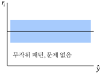{fig-align="center" width="40%"}

::: {.callout-note icon=false}
## 잔차분석에서 확인하는 6가지 사항

| 순서 | 사항 | 진단 방법 |
|:----:|------|---------|
| ① | **선형성** | 잔차가 특정 패턴 없이 무작위로 분포해야 함 |
| ② | **등분산성** | 잔차가 일정한 폭을 유지하며 퍼져 있어야 함 |
| ③ | **독립성** | 시계열 자료에서는 반드시 확인 (횡단면은 상대적으로 덜 중요) |
| ④ | **정규성** | 잔차 분포를 히스토그램·Q-Q 플롯으로 확인 |
| ⑤ | **이상치·영향치** | 표준화 잔차 ±2 초과, 회귀선 형태 왜곡하는 점 확인 |
| ⑥ | **누락 변수** | 잔차가 특정 패턴을 보이면 중요한 설명변수 누락 가능성 시사 |
:::

잔차분석은 단순히 모형의 적합도를 평가하는 단계를 넘어, 회귀모형이 기본 가정을 충족하는지 점검하고, 잠재적인 문제를 찾아내어 보완하는 핵심 절차이다.

\*) 잔차의 정규성 검정에 대해서는 상반된 견해가 존재한다. 표본의 크기가 충분히 크면 중심극한정리에 따라 정규분포에 근사한다고 본다. 따라서 일반적으로 표본이 30개 이상인 경우에는 정규성 위배가 분석 결과에 큰 영향을 주지 않으며, 이때는 굳이 정규성 검정을 수행하지 않아도 된다는 입장이다.

### 잔차종류

::: {.callout-tip icon=false}
## 잔차 종류 비교

| 종류 | 공식 | 이상치 기준 | 특징 |
|------|------|:----------:|------|
| **표준화 잔차** | $z_i = \frac{r_i}{\sqrt{MSE}}$ | $\|z_i\| > 2$ | 계산 간단, 기본 이상치 탐지 |
| **스튜던트 잔차** | $st_i = \frac{r_i}{\sqrt{MSE(1-h_{ii})}}$ | $\|st_i\| > 2$ | 레버리지 반영, t-분포 기반 |
| **제외 잔차** | $z_{(i)} = \frac{r_{(i)}}{\sqrt{MSE_{(i)}}}$ | — | i 제외 후 추정, 더 정확하나 실용성 낮음 |
:::

**표준화 standardized 잔차**: $z_{i} = \frac{r_{i} - \overline{r}}{s(r_{i}) = \sqrt{MSE}}$, $MSE = \widehat{\sigma^{2}}$

표준화 잔차는 추정 회귀식으로부터 관측치가 얼마나 떨어져 있나를 나타내는 것으로 $\pm 2$(표준정규분포의 경우 $\pm 1.96$ 구간 안에는 95% 관측치가 있음) 보다 크면 이상치일 가능성이 높다.

**스튜던트 studentized 잔차**: $st_{i} = \frac{r_{i}}{\sqrt{MSE/(1 - h_{ii})}}$, $h_{ii} = {\underset{¯}{x}}_{i}'(X'X)^{- 1}{\underset{¯}{x}}_{i}$

잔차를 t-분포를 따르는 통계량으로 만든 것으로 $\pm 2$이면 이상치로 판단한다. $h_{ii}$는 $H = X(X'X)^{- 1}X'$ 행렬의 대각 원소로 leverage 레버리지(지렛대)로 정의되며 영향치 판단에 사용한다.

**표준화/스튜던트 제외 잔차**: $z_{(i)} = \frac{r_{(i)} - \overline{r}}{\sqrt{MSE_{(i)}}}$, $st_{(i)} = \frac{r_{(i)}}{\sqrt{MSE_{(i)}/(1 - h_{ii})}}$

$i$-번째 관측치를 제외하고 회귀모형을 추정한 후 얻은 적합치를 사용하여 얻은 잔차로 표준화/스튜던트 잔차에 비해 더 정확한 개념의 잔차이지만 현실에서는 자주 사용하지 않는다.

### 진단도구

**잔차와 종속변수 추정치 산점도**: 잔차와 종속변수 추정치 산점도는 회귀모형의 타당성을 점검하는 가장 기본적인 도구이다. 이때 잔차를 Y축에 두고, 종속변수의 예측값(추정치)을 X축에 두어 산점도를 작성한다.

잔차는 추정된 회귀모형이 설명하지 못한 부분에 해당하므로, 이 산점도에는 어떠한 체계적인 패턴도 나타나지 않아야 한다. 즉, 잔차가 평균 0을 중심으로 무작위로 흩어져 있는 형태가 바람직하다. 만약 특정 곡선 형태나 일정한 방향성을 띠는 패턴이 나타난다면, 이는 선형성 가정의 위배나 누락된 설명변수의 존재를 시사한다.

**잔차(Y-축)와 시간(time, X-축)의 시간도표(time plot)**: 오차의 독립성 검정은 시계열 데이터에만 국한된다.

**잔차 활용**: 회귀분석에서 오차항 자체는 관측할 수 없으므로, 그 추정치인 잔차를 활용하여 모형의 타당성을 점검하게 된다. 잔차는 종속변수의 실제값과 회귀모형이 추정한 예측값의 차이로 정의되며, 이 값 속에는 모형이 설명하지 못한 변동이 담겨 있다. 구체적으로는 잔차의 분포와 패턴을 분석하여 정규성, 등분산성, 독립성과 같은 오차항의 가정을 진단한다.

## 회귀진단 절차 및 최종 추정모형

### 회귀모형 추정

데이터에 설정된 회귀모형이 완전하다면 (목표변수 관측값 - 추정 모형에 의해 적합된 값) 차이인 잔차에는 어떤 패턴도 있어서는 안된다. 즉 백색잡음, 정규분포를 따라야 한다.

```python
# ==============================================
# 최종 회귀모형 추정 : adjust 결정계수 최대
# ==============================================
import itertools
import pandas as pd
import numpy as np
import statsmodels.api as sm
from sklearn.datasets import fetch_openml

boston = fetch_openml(name="boston", version=1, as_frame=True)
df = boston.frame.copy()

y = pd.to_numeric(df["MEDV"], errors="coerce")
X = df.drop(columns=["MEDV"]).copy()

for c in X.columns:
    if X[c].dtype.name in ["object", "category"]:
        X[c] = X[c].astype(str).str.strip()
        X[c] = pd.to_numeric(X[c], errors="coerce")
    else:
        X[c] = X[c].astype(float)

mask = y.notna() & X.notna().all(axis=1)
y = y[mask].reset_index(drop=True)
X = X.loc[mask].reset_index(drop=True)

def best_subset(X, y, max_features=5, criterion="adj_r2"):
    results = []
    for k in range(1, max_features+1):
        for combo in itertools.combinations(X.columns, k):
            X_combo = sm.add_constant(X[list(combo)], has_constant="add")
            model = sm.OLS(y, X_combo).fit()
            if criterion == "adj_r2":
                score = model.rsquared_adj
            elif criterion == "aic":
                score = -model.aic
            elif criterion == "bic":
                score = -model.bic
            results.append({"num_features": k, "features": combo, "criterion": score})
    best_model = max(results, key=lambda x: x["criterion"])
    return pd.DataFrame(results), best_model

all_results, best = best_subset(X, y, max_features=7, criterion="adj_r2")

print("Best Model (Adjusted R² 기준):")
print("변수:", best["features"])
print("Adj R²:", best["criterion"])
```

Best Model (Adjusted R² 기준):

변수: ('CHAS', 'NOX', 'RM', 'DIS', 'PTRATIO', 'B', 'LSTAT')

Adj R²: 0.7182560407158507

예측변수 DIS 상관계수 부호와 회귀계수 부호가 상이하여 제외하였다.

```python
selected = ['CHAS', 'NOX', 'RM', 'PTRATIO', 'B', 'LSTAT']
X_final = sm.add_constant(X[selected], has_constant='add')
final_model = sm.OLS(y, X_final).fit()

print(final_model.summary())
```

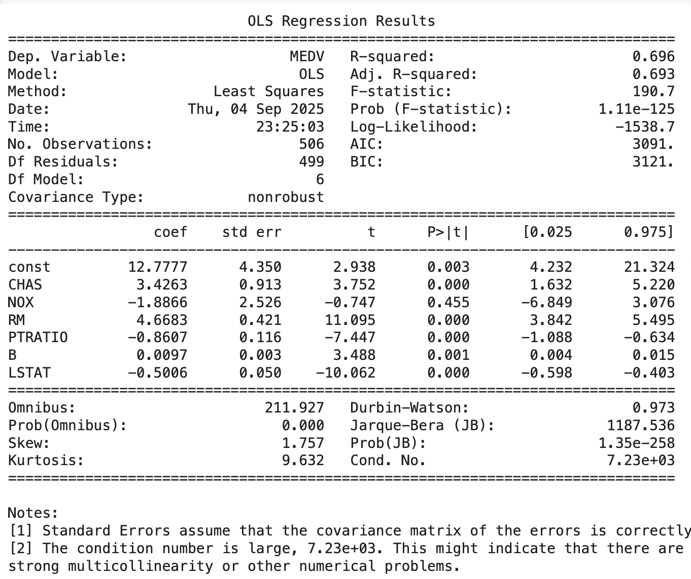{fig-align="center" width="100%"}

::: {.callout-note icon=false}
## 최종 모형 VIF 진단

| 변수 | VIF | 판단 |
|------|:---:|------|
| LSTAT | 2.453 | 양호 (< 3) |
| RM | 1.698 | 양호 |
| NOX | 1.664 | 양호 |
| B | 1.242 | 양호 |
| PTRATIO | 1.216 | 양호 |
| CHAS | 1.045 | 양호 |

6개 예측변수 모두 VIF < 3 → 다중공선성 경고가 있으나 최종 추정모형으로 사용
:::

### 잔차 vs 예측값 산점도

```python
import seaborn as sns
import matplotlib.pyplot as plt

residuals = final_model.resid_pearson
fitted = final_model.fittedvalues

sns.residplot(x=fitted, y=residuals, lowess=True, line_kws={'color': 'red', 'lw': 1})
plt.title('scatter plot of (yhat vs standard_res)')
plt.axhline(2)
plt.axhline(-2)
plt.show()
```

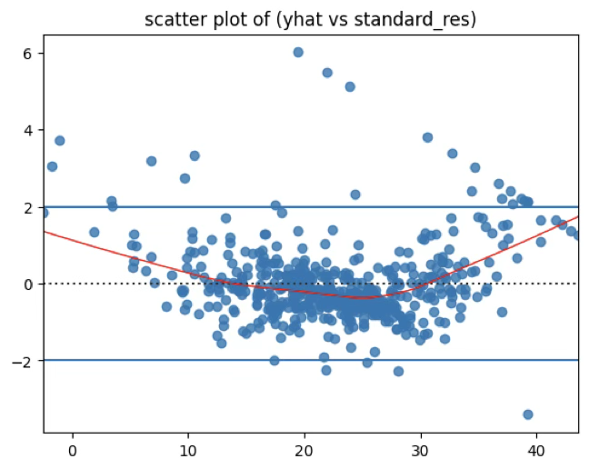{fig-align="center" width="60%"}

::: {.callout-warning icon=false}
## 잔차 산점도 진단 결과

| 진단 항목 | 관찰 | 결론 |
|---------|------|------|
| **선형성** | 빨간 스무딩 선이 U자형 → 예측값 낮을 때와 클 때 잔차가 양수, 중간값에서 음수 | 선형성 가정 위배 ⚠ |
| **등분산성** | 예측값이 커질수록 잔차 분산이 약간 증가 | 이분산성 가능성 ⚠ |
| **이상치** | y축 ±2를 넘는 점들이 상당히 존재, 위쪽으로 튀는 점들 다수 | 이상치·영향치 의심 ⚠ |
:::

**곡선 패턴 존재**: 잔차가 단순히 무작위로 흩어진 것이 아니라, 예측값이 작을 때와 클 때 잔차가 양수 방향으로 커지고, 중간값에서는 음수 쪽으로 몰려 있으므로 빨간 곡선(스무딩 선)이 U자형을 그리는 모습이 선형성 가정이 무너졌음을 보여준다. → 선형성 가정 위배

**잔차 분산의 불균일**: 예측값이 커질수록 잔차의 분산이 조금 더 커지는 경향이 보이므로 이는 등분산성 위배(이분산성)의 가능성을 시사한다.

**극단적인 점들**: y축 ±2를 넘는 점들이 상당히 보이고, 특히 위쪽으로 튀는 점들이 다수 있으므로 이는 이상치 또는 영향치일 가능성이 크다.

### 선형성 검정

회귀분석에서 가장 먼저 확인해야 할 사항은 선형성 가정이다. 즉, 종속변수와 설명변수 간의 함수관계가 선형(직선)으로 표현될 수 있어야 한다는 것이다.

실제 분석에서는 회귀모형의 유의성 검정을 거치면, 일반적으로 선형성 가정은 만족하는 것으로 판단할 수 있다. 그러나 설명변수 간의 관계가 복잡하게 얽혀 있거나, 함수형태의 잘못된 특정화 가능성이 우려될 경우에는 보다 엄밀한 통합적 선형성 검정 방법을 적용할 필요가 있다.

- 귀무가설: 목표변수와 예측변수들 간에는 선형성이 존재한다.
- 대립가설: 목표변수와 예측변수들 간에는 선형성이 존재하지 않는다.

```python
# 선형성 검정
from statsmodels.stats.diagnostic import linear_harvey_collier

t_stat, p_val = linear_harvey_collier(final_model)
print(f"[Harvey-Collier] t = {t_stat:.3f}, p-value = {p_val:.4g}")
```

linear_harvey_collier 오류는 초기 부분표본이 특이(singular) 해서 생긴다. 해결은 두 가지다:

1. 초기 표본 크기 skip를 충분히 크게 잡고,
2. 초기에 변동이 충분히 들어오도록 표본 순서를 order_by로 재배열한다.

```python
from statsmodels.stats.diagnostic import linear_reset

reset_res = linear_reset(final_model, power=2, use_f=True)

print("[RESET test]")
print(f"F-statistic = {reset_res.fvalue:.3f}")
print(f"p-value     = {reset_res.pvalue:.4g}")
```

[RESET test] F-statistic = 183.651 p-value = 7.741e-36

::: {.callout-note icon=false}
## 선형성 검정 결과 (Ramsey RESET)

| 검정 | 통계량 | 유의확률 | 결론 |
|------|:------:|:-------:|------|
| RESET (power=2) | F = 183.651 | p ≈ 0 | 선형성 가정 기각 ⚠ |

**p-value ≈ 0** → 현재 선형회귀모형은 종속변수와 예측변수 간의 관계를 제대로 설명하지 못함. 비선형성이나 누락된 변수가 존재할 가능성이 매우 높다.

**개선 방안:**
- 비선형항 (예: RM², LSTAT²) 또는 변수 변환 (로그, 제곱근) 도입
- 상호작용항 추가
- 비선형 모형 (GAM, 트리기반) 고려
:::

### 정규성

회귀분석에서 오차항이 정규분포를 따른다는 가정은 매우 중요한 전제이다. 이 가정이 충족되어야만 모형 전체의 유의성을 검정하는 분산분석 F-검정과 개별 예측변수의 유의성을 검정하는 t-검정이 타당하게 적용될 수 있다. 오차항은 직접 관측할 수 없으므로, 그 추정치인 잔차를 이용하여 정규성을 검정한다.

- 귀무가설: 데이터는 정규분포를 따른다.
- 대립가설: 정규분포를 따르지 않는다.

잔차가 정규성을 만족한다면 회귀분석에서의 추론이 통계적으로 타당하다고 볼 수 있으며, 정규성이 위배될 경우에는 비모수적 방법, 변수변환, 또는 강건추정 방법을 고려해야 한다.

```python
from scipy.stats import shapiro, jarque_bera, kstest

stat, p = shapiro(residuals)
print(f"Shapiro-Wilk W={stat:.3f}, p={p:.4g}")

jb_stat, jb_p = jarque_bera(residuals)
print(f"Jarque-Bera JB={jb_stat:.3f}, p={jb_p:.4g}")
```

Shapiro-Wilk W=0.873, p=6.84e-20
<br>
Jarque-Bera JB=1187.536, p=1.348e-258

::: {.callout-note icon=false}
## 정규성 검정 결과

| 검정 방법 | 통계량 | 유의확률 | 결론 |
|---------|--------|:-------:|------|
| **Shapiro-Wilk** | W = 0.873 | p ≈ 0 | 정규성 기각 ⚠ |
| **Jarque-Bera** | JB = 1187.536 | p ≈ 0 | 정규성 기각 ⚠ |

두 검정 모두 정규성 가정이 위배된다는 강한 증거를 제시한다.
:::

### 등분산 가정

잔차와 예측치 산점도가 다음과 같이 나팔 fan 모양일 때 등분산 가정이 무너진다. 종속변수의 값에 의존하여 분산이 커지거나 작아짐 - 등분산 가정이 무너지면 분산이 큰 부분에서 종속변수의 값이 적합선을 많이 벗어난 것이 적합 정도가 떨어진다고 결론 내릴 수 없음, 이는 분산이 다르므로 이상치가 발생할 수 있기 때문이다.

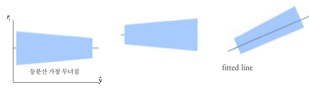{fig-align="center" width="80%"}

- 귀무가설: 잔차는 등분산성을 갖는다.
- 대립가설: 잔차는 등분산성을 갖지 않는다.

**Breusch-Pagan test**: Gujarati, Damodar N.; Porter, Dawn C. (2009). Basic Econometrics (Fifth ed.). New York: McGraw-Hill Irwin.

**Goldfeld-Quandt test**: Goldfeld, Stephen M.; Quandt, R. E. (June 1965). "Some Tests for Homoscedasticity". Journal of the American Statistical Association.

```python
from statsmodels.stats.diagnostic import het_breuschpagan, het_white, het_goldfeldquandt
from statsmodels.nonparametric.smoothers_lowess import lowess
import numpy as np
import pandas as pd
import matplotlib.pyplot as plt
import seaborn as sns

resid = final_model.resid_pearson
fitted = final_model.fittedvalues
exog = final_model.model.exog
endog = final_model.model.endog

# 1) Breusch-Pagan test
bp_lm, bp_lm_p, bp_f, bp_f_p = het_breuschpagan(final_model.resid, exog)
print("[Breusch-Pagan]")
print(f"LM stat = {bp_lm:.3f},  LM p = {bp_lm_p:.4g}")
print(f"F  stat = {bp_f:.3f},   F  p = {bp_f_p:.4g}\n")

# 2) White test
w_lm, w_lm_p, w_f, w_f_p = het_white(final_model.resid, exog)
print("[White]")
print(f"LM stat = {w_lm:.3f},  LM p = {w_lm_p:.4g}")
print(f"F  stat = {w_f:.3f},   F  p = {w_f_p:.4g}\n")

# 3) Goldfeld-Quandt test
order_idx = np.argsort(fitted.values)
gq_stat, gq_p, gq_df = het_goldfeldquandt(endog[order_idx], exog[order_idx, :], alternative='two-sided')
print("[Goldfeld-Quandt]")
print(f"F stat = {gq_stat:.3f}, df = {gq_df}, p = {gq_p:.4g}\n")

# 4) 잔차 진단 플롯
plt.figure(figsize=(6,4))
sns.scatterplot(x=fitted, y=resid, s=25, edgecolor=None)
lo = lowess(resid, fitted, frac=0.6, return_sorted=True)
plt.plot(lo[:,0], lo[:,1], linewidth=2)
plt.axhline(0, linestyle="--")
plt.xlabel("Fitted values")
plt.ylabel("Pearson residuals")
plt.title("Residuals vs Fitted")
plt.tight_layout()
plt.show()

# Scale-Location plot
plt.figure(figsize=(6,4))
sr = np.sqrt(np.abs(resid))
sns.scatterplot(x=fitted, y=sr, s=25, edgecolor=None)
lo2 = lowess(sr, fitted, frac=0.6, return_sorted=True)
plt.plot(lo2[:,0], lo2[:,1], linewidth=2)
plt.xlabel("Fitted values")
plt.ylabel("sqrt(|Pearson residuals|)")
plt.title("Scale-Location (Spread vs Fitted)")
plt.tight_layout()
plt.show()

# 5) 강건표준오차(HC3)
robust = final_model.get_robustcov_results(cov_type="HC3")
print(robust.summary())
```

::: {.callout-note icon=false}
## 등분산성 검정 결과

| 검정 방법 | LM 통계량 | 유의확률 | 결론 |
|---------|:--------:|:-------:|------|
| **Breusch-Pagan** | LM = 27.371 | p = 0.0001 | 이분산성 ⚠ |
| **White** | LM = 182.805 | p ≈ 0 | 이분산성 ⚠ |
| **Goldfeld-Quandt** | F = 1.229 | p = 0.107 | 결정적 증거 없음 |

→ BP·White는 "이분산 있음" 쪽으로 강한 신호. 보통 White가 가장 포괄적이므로, **이 모형의 잔차는 등분산 가정을 만족하지 않는다**고 보는 것이 타당하다.

**대응 방안:**
1. 강건표준오차(robust standard errors, HC3)로 계수 검정 보정
2. WLS(가중최소제곱): 분산구조를 모형화
3. 변수변환: y나 문제되는 X에 로그/제곱근 변환 고려
4. 모형 재특정: 누락된 변수·비선형 항 점검
:::

**OLS대신 WLS 가중최소자승법 사용**: $\min_{\alpha,\beta_{1},...,\beta_{p}}\sum w_{i}(y_{i} - \alpha - \overset{p}{\sum_{k = 1}}\beta_{k}x_{ki})^{2}$를 최소화 하는 추정치를 가중최소추정량이라 한다. 가중치 $w_{i} = \frac{1}{{\widehat{y}}_{i}^{2}}$을 사용한다.

```python
import statsmodels.api as sm
import numpy as np

weights = 1 / (final_model.fittedvalues**2)

X_final = sm.add_constant(X[selected], has_constant='add')
wls_model = sm.WLS(y, X_final, weights=weights).fit()
print("\n[WLS: fitted값 기반 가중치]")
print(wls_model.summary())
```

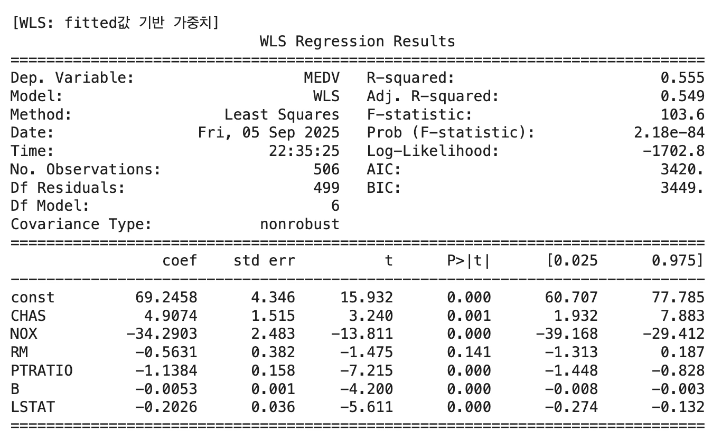{fig-align="center" width="60%"}

잔차는 등분산 가정이 무너져 WLS 추정 결과 결정계수 55%로 떨어졌고 예측변수 RM는 유의하지 않고 회귀계수 부호와 상관계수 부호가 일치하지 않는다. 등분산 검정 결과 등분산성이 여전히 만족되지 않는다.

```python
import matplotlib.pyplot as plt
import seaborn as sns
from statsmodels.nonparametric.smoothers_lowess import lowess
import numpy as np

resid_wls  = wls_model.resid
fitted_wls = wls_model.fittedvalues

plt.figure(figsize=(7,5))
sns.scatterplot(x=fitted_wls, y=resid_wls, s=28, alpha=0.8, edgecolor=None)

lo = lowess(resid_wls, fitted_wls, frac=0.6, return_sorted=True)
plt.plot(lo[:,0], lo[:,1], color="red", linewidth=2)

plt.axhline(0, ls="--", lw=1, color="black")
plt.xlabel("WLS(Fitted)")
plt.ylabel("WLS (Residuals)")
plt.title("WLS Residuals vs Fitted")
plt.tight_layout()
plt.show()
```

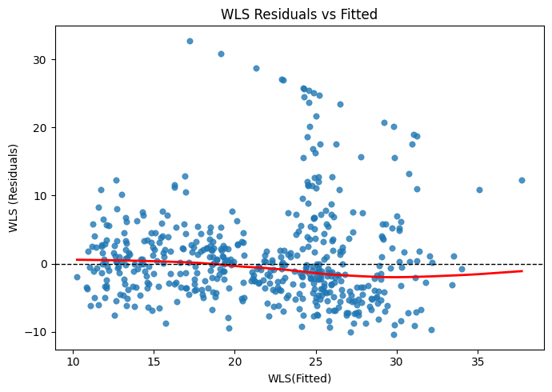{fig-align="center" width="60%"}

### 독립성

**개념**: 시계열 데이터의 경우 오차항이 전 차항의 오차들에 의해 영향을 받게 되면 오차의 독립성이 파괴된다. 오차항 독립이 아니면 종속변수에 설정된 설명변수가 설명하지 못하는 일정의 패턴이 존재하므로 회귀추정이 불완전하게 된다.

**진단도구**: Durbin Watson 통계량 $d = \frac{\sum_{t=2}^{T}(e_t - e_{t-1})^2}{\sum_{t=1}^{T}e_t^2}$

DW 검정통계량의 값은 $2(1 - r)$에 근사한다. 상관계수 $r$은 $(e_{t},e_{t - 1})$의 상관계수(오차의 1차 자기상관계수)이다.

오차가 독립(자기상관이 존재하지 않음)이면 $r = 0$이고 $DW = 2$에 근사한다.

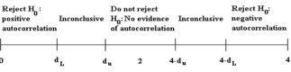{fig-align="center" width="80%"}

::: {.callout-note icon=false}
## Durbin-Watson 검정 판단 기준

| 범위 | 결론 |
|------|------|
| $DW < D_L$ | 양의 자기상관 존재 |
| $D_L < DW < D_U$ | 결론 내릴 수 없음 |
| $D_U < DW < 4-D_U$ | 자기상관 없음 (독립) |
| $4-D_U < DW < 4-D_L$ | 결론 내릴 수 없음 |
| $DW > 4-D_L$ | 음의 자기상관 존재 |

DW ≈ 2 → 자기상관 없음 (오차 독립)
:::

positive autocorrelation (양의 상관관계)

- If $DW < D_{L}$, 양의 상관관계가 존재한다.
- If $DW > D_{U}$, 자기상관이 존재하지 않는다. 독립이다.
- If $D_{L} < DW < D_{U}$, 결론 내릴 수 없음

negative autocorrelation (음의 상관관계) the test statistic (4 − d)

- If $DW > 4 - D_{L}$, 음의 상관관계가 존재한다.
- If $DW < 4 - D_{U}$, 자기상관이 존재하지 않는다. 독립이다.
- If $4 - d_{u} < DW < 4 - d_{L}$, 결론 내릴 수 없음

**해결책**: 목표변수의 1차 전기 항$(y_{t - 1})$을 예측변수로 사용하거나 종속변수의 차분항($\nabla Y_{t} = (Y_{t} - Y_{t - 1})$)을 목표변수로 사용한다. sm.OLS, sm.WLS 실행하면 DW(Durbin Watson) 자동 출력된다.

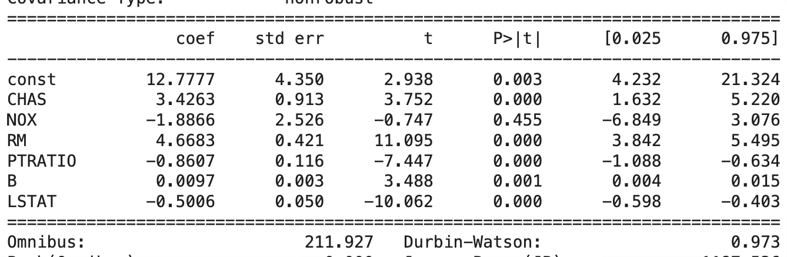{fig-align="center" width="80%"}

### 오차 가정 위배 원인 파악

```python
import matplotlib.pyplot as plt

residuals = final_model.resid
selected = ['CHAS', 'NOX', 'RM', 'PTRATIO', 'B', 'LSTAT']

fig, axes = plt.subplots(2, 3, figsize=(15, 8))
axes = axes.flatten()

for i, var in enumerate(selected):
    axes[i].scatter(X[var], residuals, alpha=0.7)
    axes[i].axhline(y=0, color="red", linestyle="--", linewidth=1)
    axes[i].set_xlabel(var)
    axes[i].set_ylabel("Residuals")
    axes[i].set_title(f"{var} vs Residuals")

plt.suptitle("scatter plot of (yhat vs standard_res)", fontsize=14)
plt.tight_layout()
plt.show()
```

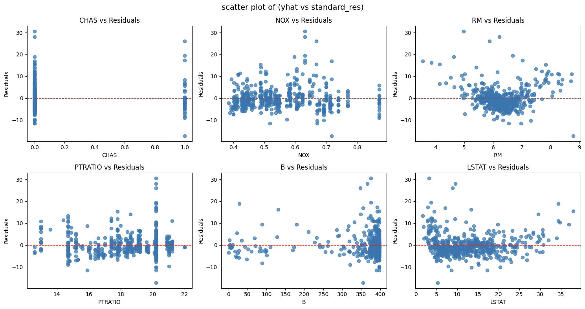{fig-align="center" width="80%"}

::: {.callout-note icon=false}
## 오차 가정 위배 원인

RM, LSTAT 예측변수가 이분산 형태를 가지므로 잔차의 등분산 가정이 무너졌다.

- **RM**: 방 개수가 많아질수록 잔차 분산 증가 → 분산의 비균일성
- **LSTAT**: 저소득층 비율이 높아질수록 잔차 분산 증가 → 분산의 비균일성
:::

### 이상치·영향치

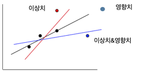{fig-align="center" width="60%"}

::: {.callout-tip icon=false}
## 이상치 vs. 영향치 비교

| 구분 | 이상치 (Outlier) | 영향치 (Influential Point) |
|------|----------------|--------------------------|
| **정의** | 반응변수(Y) 값이 회귀선에서 크게 벗어난 점 | 설명변수(X) 값이 다른 관측치와 동떨어진 점 |
| **문제** | 잔차가 크므로 결정계수 낮춤 | 레버리지가 높아 회귀선을 강하게 끌어당김 |
| **외양** | 잔차가 크게 보임 | 표면상 잔차가 작을 수 있음 |
| **원인** | Y 변수 문제 | X 변수 문제 |
| **처리** | 데이터 오류: 삭제 / 실제값: robust 회귀 | 주변에 표본 추가 또는 제외 후 재적합 |
:::

이상치(outlier)는 설명변수의 관측값은 정상 범위 내에 있으나 반응변수 값이 회귀선에서 크게 벗어난 점이다. 이상치는 잔차가 크므로 회귀모형의 적합 정도를 떨어뜨리고, 결정계수를 낮추는 원인이 된다.

영향치(influential point)는 설명변수 값 자체가 다른 관측치와 동떨어져 분포 범위를 벗어난 점이다. 이러한 점은 레버리지가 높아 회귀선을 강하게 끌어당긴다. 표면적으로는 회귀선에 잘 붙어 있어 잔차가 크지 않을 수 있으나, 실제로는 회귀계수와 결정계수를 왜곡시킨다.

따라서 이상치는 반응변수의 문제이고, 영향치는 설명변수의 문제이다.

::: {.callout-note icon=false}
## 이상치·영향치 진단도구 비교

| 도구 | 공식 | 기준 | 특징 |
|------|------|:----:|------|
| **표준화 잔차** | $r_i = \frac{e_i}{\hat\sigma\sqrt{1-h_{ii}}}$ | $\|r_i\| > 2$ | 이상치 탐지 기본 도구 |
| **스튜던트 잔차** | $t_i = \frac{e_i}{\hat\sigma_{(i)}\sqrt{1-h_{ii}}}$ | $\|t_i\| > 2$ | i 제외 분산 사용, 더 정확 |
| **레버리지** | $h_{ii} = x_i'(X'X)^{-1}x_i$ | $h_{ii} > 2\bar h = \frac{2(p+1)}{n}$ | 영향치 판단, X 범위 벗어남 여부 |
| **DFBETAS** | $\frac{\hat\beta_j - \hat\beta_{j(i)}}{SE(\hat\beta_j)}$ | $> \frac{2}{\sqrt{n}}$ | i 제거 시 계수 변화량 |
| **Cook's D** | $D_i = \frac{e_i^2}{p\hat\sigma^2}\cdot\frac{h_{ii}}{(1-h_{ii})^2}$ | $D_i > 1$ (또는 $4/n$) | 계수 전체 변화량 |
| **DFFITS** | $\frac{\hat y_i - \hat y_{i(i)}}{\hat\sigma_{(i)}\sqrt{h_{ii}}}$ | $> 2\sqrt{\frac{p}{n}}$ | 예측값 변화량 |
:::

**이상치 진단도구**

- 원 변수 산점도, 잔차-적합치 산점도에서 시각적 판단
- 표준화 잔차: $r_{i} = \frac{e_{i}}{\widehat{\sigma}\sqrt{1 - h_{ii}}}$, $\pm 2$ 이상이면 이상치이다.
- 스튜던트 잔차: $t_{i} = \frac{e_{i}}{\widehat{\sigma}(i)\sqrt{1 - h_{ii}}}$, $t_{i}$는 근사적으로 자유도 $n - p - 1$인 $t$-분포를 따른다.

**영향치 판단도구**

- 레버리지 $h_{ii} = x_{i}'(X'X)^{- 1}x_{i}$: $0 \leq h_{ii} \leq 1$, 평균값은 $\overline{h} = \frac{p + 1}{n}$이고 $h_{ii} > 2\overline{h}$이면 높은 레버리지 점으로 본다.
- DFBETAS: $DFBETAS_{ij} = \frac{{\widehat{\beta}}_{j} - {\widehat{\beta}}_{j(i)}}{SE({\widehat{\beta}}_{j})}$, $|DFBETAS_{ij}| > \frac{2}{\sqrt{n}}$이면 변수 j의 추정치에 큰 영향을 미친다고 판단한다.
- Cook's 거리: $D_{i} = \frac{e_{i}^{2}}{p{\widehat{\sigma}}^{2}} \cdot \frac{h_{ii}}{(1 - h_{ii})^{2}}$, $D_{i} > 1$이면 영향치로 의심할 수 있다.
- DFFITS: $DFFITS_{i} = \frac{\widehat{y}_{i} - \widehat{y}_{i(i)}}{\widehat{\sigma}(i)\sqrt{h_{ii}}}$, $|DFFITS_{i}| > 2\sqrt{\frac{p}{n}}$이면 영향력이 크다고 본다.

해결책

- 이상치 삭제: 회귀모형의 적합성 높아짐 ↔ 결정계수 높아짐
- 영향치: 결정계수를 커지게 하는 경향이 있음 ↔ 제외하고 추정 모형을 예측하는 것이 적절하다.

```python
import numpy as np
import pandas as pd
import statsmodels.api as sm
from statsmodels.stats.outliers_influence import OLSInfluence

selected = ['CHAS', 'NOX', 'RM', 'PTRATIO', 'B', 'LSTAT']
X_final = sm.add_constant(X[selected], has_constant='add')
final_model = sm.OLS(y, X_final).fit()

# 영향치/이상치 진단
infl = OLSInfluence(final_model)
std_resid = infl.resid_studentized_internal
cooks_d   = infl.cooks_distance[0]
lev       = infl.hat_matrix_diag

n = int(final_model.nobs)
p = int(final_model.df_model) + 1

thr_resid = 2.0
thr_cook  = 4/n
thr_lev   = 2*p/n

mask_bad = (np.abs(std_resid) > thr_resid) | (cooks_d > thr_cook) | (lev > thr_lev)
print(f"제거 대상 관측치 수: {mask_bad.sum()} / {n}")

# 이상치/영향치 제거 후 모형 재적합
X_clean = X_final.loc[~mask_bad].copy()
y_clean = y.loc[~mask_bad].copy()

refit_model = sm.OLS(y_clean, X_clean).fit()

print("\n[이상치/영향치 제거 후 모형]")
print(refit_model.summary())
```

CHAS의 회귀계수 부호가 상관계수 부호와 상이하여 제거 후 최종 회귀모형을 추정하였다.

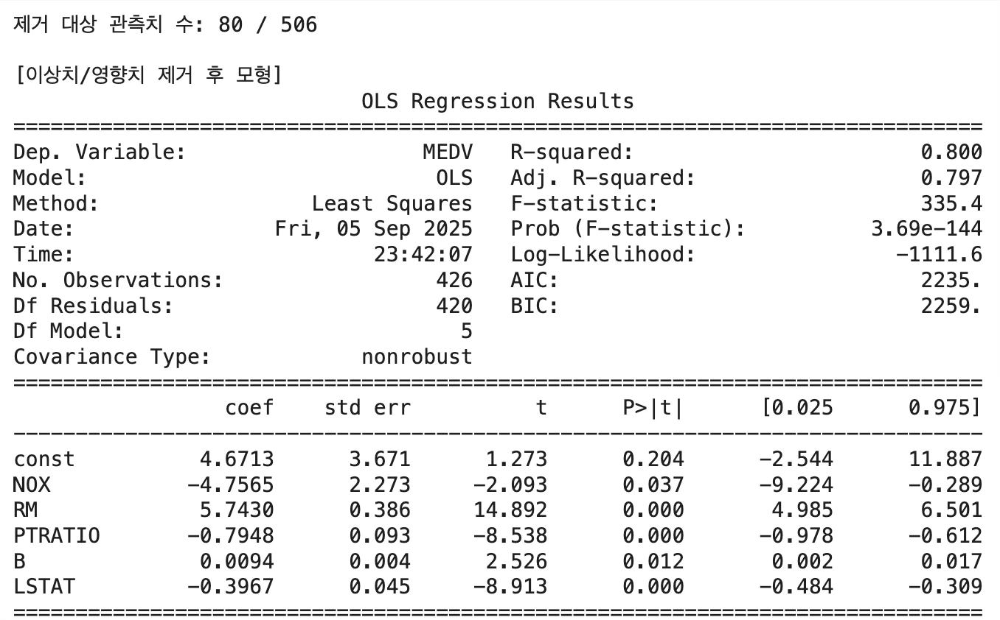{fig-align="center" width="80%"}

## 예측값, 신뢰구간, 예측구간

**예측값, 신뢰구간, 예측구간**: 회귀모형 $\underset{¯}{y} = X\underset{¯}{\beta} + \underset{¯}{e}$, OLS 추정치: $\widehat{\underset{¯}{\beta}} = (X'X)^{- 1}X'\underset{¯}{y}$

주어진 예측변수 값 벡터 ${\underset{¯}{x}}_{0}$에 대한 목표변수 적합치: $\widehat{{\underset{¯}{y}}_{0}}|{\underset{¯}{x}}_{0} = {\underset{¯}{x}}_{0}\widehat{\underset{¯}{\beta}}$

추정량 분산 (예측구간): $V(\widehat{{\underset{¯}{y}}_{0}}|{\underset{¯}{x}}_{0}) = \sigma^{2}(I + {\underset{¯}{x}}_{0}'(X'X)^{- 1}{\underset{¯}{x}}_{0})$

추정량 분산 (신뢰구간): $V(\widehat{{\underset{¯}{y}}_{0}}|{\underset{¯}{x}}_{0}) = \sigma^{2}{\underset{¯}{x}}_{0}'(X'X)^{- 1}{\underset{¯}{x}}_{0}$

::: {.callout-note icon=false}
## 예측구간 vs. 신뢰구간

| 구분 | 신뢰구간 | 예측구간 |
|------|---------|---------|
| **대상** | 모집단 평균 반응 $E(Y\|x_0)$ | 개별 새 관측값 $y_0$ |
| **포함 항** | 추정 불확실성만 | 추정 불확실성 + 오차 $e_0$ |
| **폭** | 좁음 | 넓음 |
| **권장 사용** | 평균 예측 시 | **개별 관측값 예측 시** (실무에서 주로 사용) |
:::

예측구간, 신뢰구간 어느 것을 사용하나? 신뢰구간이 예측구간보다 작으나 예측변수의 개별 관측값이 주어진 경우 목표변수 관측값을 예측하는 것이므로 예측구간을 사용하는 것이 적절하다.

```python
pred_int = refit_model.get_prediction(X_clean)
print(pred_int.summary_frame(alpha=0.05))
```

mean mean_se mean_ci_lower mean_ci_upper obs_ci_lower obs_ci_upper
<br>
0 29.474740 0.399196 28.690070 30.259410 22.918274 36.031206
<br>
1 25.281274 0.195985 24.896039 25.666508 18.760542 31.802006

```python
import pandas as pd

new_X = pd.DataFrame({
    "NOX": [0.5],
    "RM": [6.5],
    "PTRATIO": [18],
    "B": [390],
    "LSTAT": [10]
})

X_new = sm.add_constant(new_X, has_constant="add")
pred = refit_model.get_prediction(X_new)

print(pred.summary_frame(alpha=0.05))
```

mean mean_se mean_ci_lower mean_ci_upper obs_ci_lower obs_ci_upper
<br>
25.022419 0.178576 24.671405 25.373433 18.503619 31.541219
