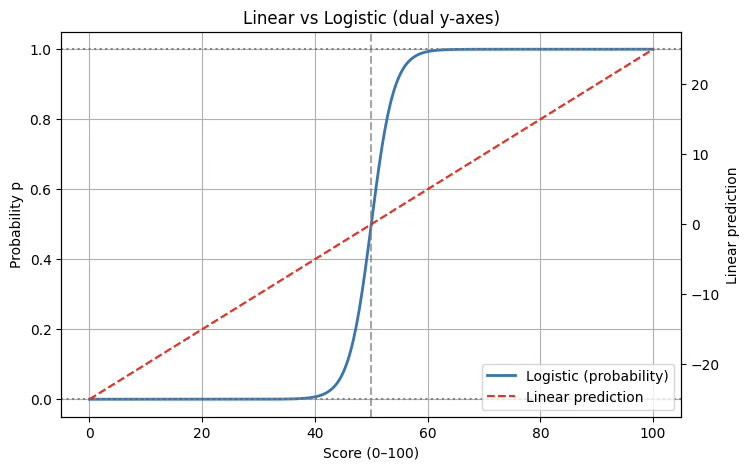
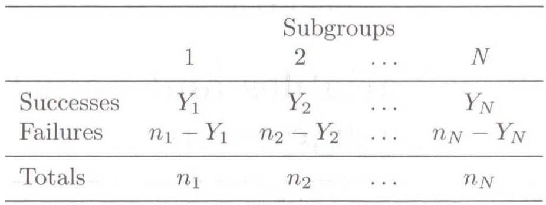
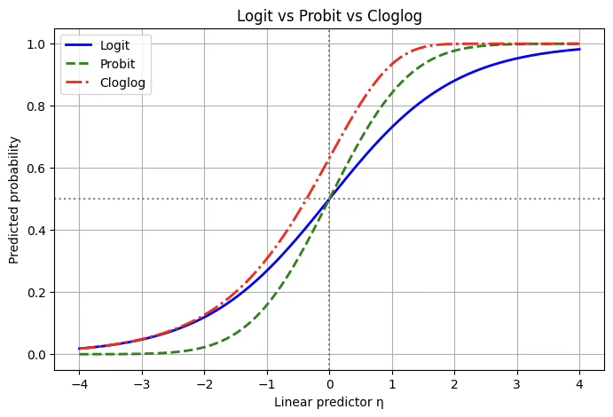
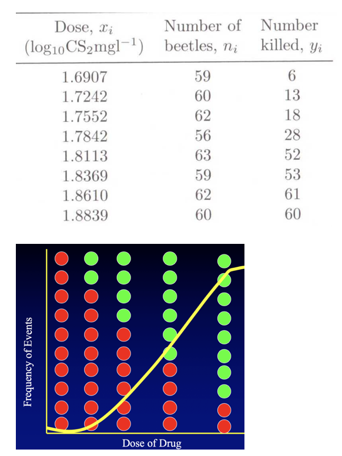
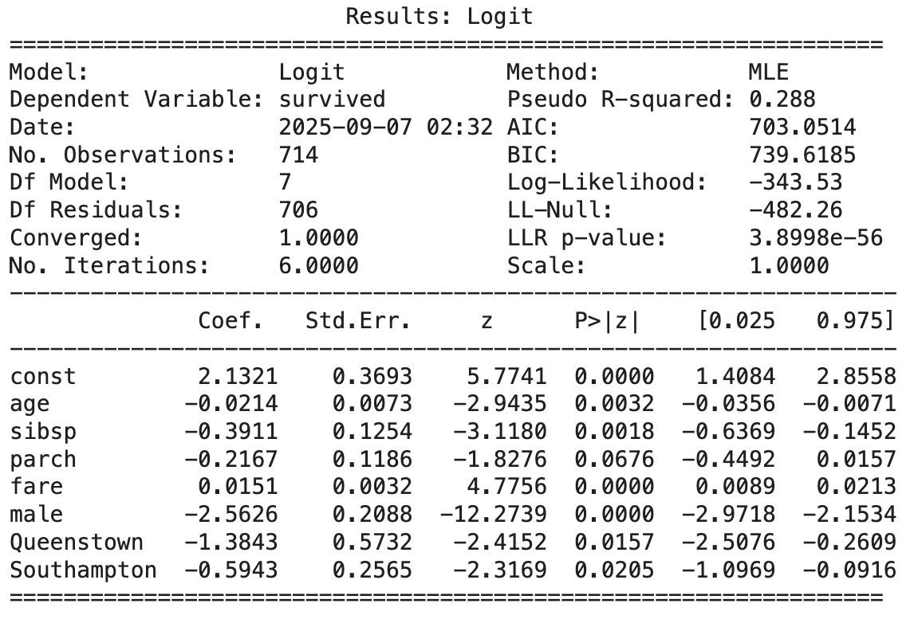
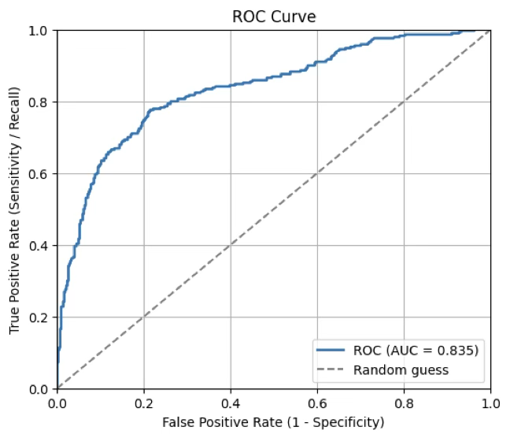
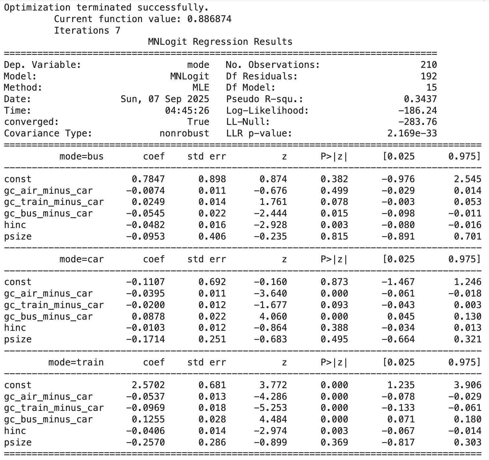

## 일반화 선형모형

::: {.callout-note icon=false}
## 정의
**일반화선형모형(GLM, Generalized Linear Model)**은 목표변수가 정규분포를 따르지 않는 경우에도 회귀분석의 틀을 적용할 수 있도록 확장한 모형이다. 확률분포 가정, 선형예측자, 연결함수의 세 가지 요소로 구성된다.
:::

### 일반화 선형모형 개념

전통적인 선형회귀모형은 목표변수가 연속형이고 정규분포를 따른다는 가정을 전제로 한다. 하지만 실제 자료에서는 목표변수가 이진형, 계수형, 범주형 등 다양한 형태로 나타난다. 예를 들어 구매 여부(예/아니오), 교통사고 건수, 고객의 만족도 척도 등은 정규분포 가정을 따르지 않는다.

::: {.callout-note icon=false}
## GLM 3가지 구성요소

| 구성요소 | 내용 |
|---------|------|
| **확률분포 가정** | 목표변수 Y는 지수족에 속하는 분포(정규분포, 이항분포, 포아송분포, 감마분포 등)를 따른다고 가정 |
| **선형예측자** | 설명변수들의 선형 결합 $\eta = \beta_{0} + \beta_{1}X_{1} + \cdots + \beta_{p}X_{p}$ 사용 |
| **연결함수** | 기대값 $\mu = E(Y\|X)$와 선형예측자 $\eta$를 연결하는 함수 $g(\mu) = \eta$ 정의 |
:::

::: {.callout-tip icon=false}
## 목표변수 유형별 GLM 선택

| 목표변수 유형 | 분포 | 연결함수 | 모형 |
|------------|------|---------|------|
| **이진형** (예/아니오, 합격/불합격) | 베르누이분포 | 로짓 | 로지스틱 회귀 |
| **계수형** (사고 건수, 방문 횟수) | 포아송·음이항분포 | 로그 | 포아송 회귀 |
| **순서형** (학점 A-B-C, 리커트) | 다항분포 | 로짓 | 순서형 로지스틱 회귀 |
| **명목형** (직업, 거주지역, 혈액형) | 다항분포 | 로짓 | 다항 로지스틱 회귀 |
:::

**이진형(binary)**: 두 가지 결과(예: 성공/실패, 합격/불합격, 구매/비구매)만 가질 수 있는 경우이므로 베르누이 분포에 따르므로 로지스틱 회귀, 프로빗 회귀 등을 사용한다.

**이산형 정수형(count data)**: 사건 발생 횟수를 나타내는 변수(예: 교통사고 건수, 병원 방문 횟수, 감염 환자 수)로 포아송 분포 또는 음이항 분포를 따르므로 포아송 회귀를 사용한다.

**순서형(ordinal)**: 순서 정보는 있으나 간격이 일정하지 않은 변수(예: 학점 A-B-C-D-F, 만족도 리커트 척도)는 다항 분포 기반이므로 순서형 로지스틱 회귀분석을 이용한다.

**명목형(nominal)**: 범주에 단순한 구분만 존재하고 순서가 없는 변수(예: 직업, 거주지역, 혈액형) 다항 분포 기반인 다항 로지스틱 회귀분석을 이용한다.

### 왜 OLS를 사용할 수 없나?

이진형 종속변수(예: 합격=1, 불합격=0)를 설명변수 X로 회귀한다고 하자. 이때 단순히 선형회귀를 적용하면 여러 가지 문제가 발생한다.

::: {.callout-note icon=false}
## OLS를 이진형 변수에 사용할 수 없는 3가지 이유

| 문제 | 내용 |
|------|------|
| **예측값 범위 문제** | 선형회귀 예측값은 모든 실수 범위 → 확률은 [0,1] 범위여야 하므로 음수나 1 초과 값 발생 |
| **분산 불일치** | 이진형의 분산 $Var(Y\|X) = p(1-p)$은 p에 따라 달라지나, OLS는 등분산 가정 |
| **선형성 불합리** | 현실에서 확률은 S자 모양 비선형 구조 → 직선으로는 설명 불가 |
:::

첫째, 예측값의 범위 문제가 있다. 선형회귀식 $Y = \beta_{0} + \beta_{1}X + \varepsilon$을 그대로 적용하면, 예측값 $\widehat{Y}$는 이론적으로 모든 실수 값을 가질 수 있다. 그러나 이진형 변수는 성공 확률 p로 해석되어야 하므로, 예측값은 반드시 [0,1] 범위 안에 있어야 하나 실제로는 시험 점수 X=30일 때 $\widehat{Y} = -0.3$처럼 음수가 나오거나, X=90일 때 $\widehat{Y} = 1.2$처럼 1을 초과할 수 있어 확률 해석이 불가능하다.

둘째, 분산 불일치 문제가 있다. 이진형 변수는 베르누이 확률변수이므로, 기대값은 $E(Y|X) = p$, 분산은 $Var(Y|X) = p(1 - p)$의 형태를 가진다. 즉, 분산이 확률 p의 크기에 따라 달라진다. 그러나 선형회귀에서는 오차항의 분산이 일정하다는 가정, 즉 $Var(\varepsilon) = \sigma^{2}$를 전제로 한다. 이 가정이 깨지므로 추정량의 효율성과 검정의 타당성에 문제가 생긴다.

셋째, 선형성 가정이 불합리하다는 점이다. 현실에서 사건 발생 확률은 설명변수가 증가한다고 직선적으로 증가하지 않는다. 보통은 S자 모양의 곡선을 따른다. 이러한 한계를 해결하기 위해 등장한 것이 로지스틱 회귀분석이다. 로지스틱 회귀에서는 확률 p를 직접 선형식으로 표현하지 않고, 로짓 변환을 사용한다. 로짓은 $\text{logit}(p) = \log\frac{p}{1 - p}$로 정의되며, 이는 $-\infty$부터 $+\infty$까지 모든 실수 값을 가질 수 있다.

```python
import numpy as np
import matplotlib.pyplot as plt

X = np.linspace(0, 100, 400)
beta0, beta1 = -25, 0.5
logit = beta0 + beta1 * X
p = 1 / (1 + np.exp(-logit))

fig, ax1 = plt.subplots(figsize=(8,5))

ax1.plot(X, p, label="Logistic (probability)", linewidth=2)
ax1.set_ylim(-0.05, 1.05)
ax1.set_ylabel("Probability p")
ax1.axhline(0, color="gray", linestyle=":")
ax1.axhline(1, color="gray", linestyle=":")
ax1.axvline(-beta0/beta1, color="gray", linestyle="--", alpha=0.7)

ax2 = ax1.twinx()
ax2.plot(X, logit, color="red", linestyle="--", label="Linear prediction")
ax2.set_ylabel("Linear prediction")

h1, l1 = ax1.get_legend_handles_labels()
h2, l2 = ax2.get_legend_handles_labels()
ax1.legend(h1+h2, l1+l2, loc="lower right")

ax1.set_title("Linear vs Logistic (dual y-axes)")
ax1.set_xlabel("Score (0-100)")
ax1.grid(True)
plt.show()
```

{fig-align="center" width="80%"}

### 연결함수 (Link Function)

일반화선형모형에서는 종속변수가 반드시 정규분포를 따를 필요가 없으며, 베르누이 분포, 포아송 분포, 다항 분포 등 다양한 분포를 따를 수 있다. 그러나 이들 분포에서 종속변수의 기대값 $\mu = E(Y|X)$는 특정한 범위 제약을 갖는다.

이때 필요한 것이 바로 연결함수이다. 연결함수는 기대값 $\mu$를 변환하여 $\eta$와 같은 스케일로 만들어주는 함수이다. 즉, $g(\mu) = \eta$ 형태를 가지며, 이를 통해 $\mu$와 $\eta$ 사이의 불일치를 해소한다.

::: {.callout-tip icon=false}
## GLM 목표변수 분포별 연결함수

| 목표변수 분포 | 연결함수 | 평균함수 |
|------------|---------|---------|
| **정규분포** | 항등함수 $g(\mu) = \mu$ | $\mu = X\underset{¯}{b}$ |
| **지수분포·감마분포** | 음의 역함수 $g(\mu) = -\mu^{-1}$ | $\mu = -X{\underset{¯}{b}}^{-1}$ |
| **포아송분포** | 로그함수 $g(\mu) = \ln(\mu)$ | $\mu = \exp(X\underset{¯}{b})$ |
| **베르누이분포** | 로짓함수 $g(\mu) = \ln\frac{\mu}{1-\mu}$ | $\mu = \frac{1}{1+\exp(-X\underset{¯}{b})}$ |
| **이항분포** | 로짓함수 $g(\mu) = \ln\frac{\mu}{n-\mu}$ | $\mu = \frac{1}{1+\exp(-X\underset{¯}{b})}$ |
| **범주형·다항분포** | 로짓함수 $g(\mu) = \ln\frac{\mu}{1-\mu}$ | $\mu = \frac{1}{1+\exp(-X\underset{¯}{b})}$ |
:::

**목표변수는 지수족이어야 한다.**: GLM의 기본 구조 $g(\mu) = \eta = X\beta$, $\mu = E(Y|X)$이며 이에 필요한 전제는 다음과 같다. 분포의 평균과 분산이 간단한 형태로 표현되어야 한다. 그래야 기대값과 분산을 쉽게 다룰 수 있다. 지수족 분포는 평균과 분산이 모수(특히 자연모수)에 의해 단순하게 표현된다. 그리고 우도함수가 지수형태로 정리될 수 있어야 한다. 이렇게 해야 최대우도추정(MLE)이 수학적으로 해석 가능해지기 때문이다.

### 일반화 선형모형 추정

모형 $g(E(y)) = Xb + e$, $e \sim N(0,\sigma^{2})$

- 이진형 분포 $P(y_{i} = 1) = p$, $p = e^{(-\theta x)}$ → $g(p_{x}) = \ln(p_{x}) = -\theta x$
- Poisson $E(y) = \lambda$, $\lambda = ne^{\theta}$, $g(\lambda_{i}) = \ln(n_{i}) + \theta \cdot i$

**지수족 exponential family**: $f(y;\theta) = h(x)\exp(\eta(\theta)T(x) - A(\theta))$로 표현되는 확률변수 y는 지수족이다. $\theta$는 모수, $T(x)$는 충분통계량이다.

- (성질) 지수족의 T(x)는 완비통계량이며 T(x)의 함수 중 불편성을 만족하는 통계량이 MVUE이다.
- (성질) 로그우도함수 $\ln(f(y;\theta))$는 다음 성질을 갖는다. (1) score 함수 $U = \frac{d\ln(f(y;\theta))}{d\theta}$의 기대값은 $E(U) = 0$ 이다. (2) U의 분산을 Information이라 정의한다. $V(U) = J$ (3) 스코어 함수의 $\theta$ 1차 미분의 기대값은 $E(\frac{dU}{d\theta}) = -V(U) = -J$ 관계식을 갖는다.

정규분포, 감마분포, 포아송분포, 이항분포, 베타분포 등 대부분의 유명한 분포는 지수족이다. 스코어 함수 $U = 0$을 N-R 방식으로 풀면 $\theta$의 MVUE 추정치를 얻는다.
${\widehat{\theta}}^{(m)} = {\widehat{\theta}}^{(m - 1)} + \frac{U^{(m - 1)}}{J^{(m - 1)}}$

**추정량의 샘플링분포 $\widehat{\theta} \sim ?$**: 대표본 이론에 의해 [이차형식] $U'J^{-1}U \sim \chi^{2}(p)$, $p$=모수의 개수

MLE의 공분산: $E[(\widehat{\theta} - \theta)'(\widehat{\theta} - \theta)] = J(\widehat{\theta})$

Wald 검정통계량: $(\widehat{\theta} - \theta)'J^{-1}(\widehat{\theta})(\widehat{\theta} - \theta) \sim \chi^{2}(p)$

LR 우도비 검정 $H_{0}:\theta = 0$

$$\lambda = \frac{L(y;\widehat{\theta}\text{ under }H_{0})}{L(y;\widehat{\theta})},\quad 2\ln\lambda \sim \chi^{2}(1)$$

## 이진형 종속변수: 로지스틱 회귀

### 개념

로짓변환은 목표변수가 이진형 변수이고 모수 $p$(성공확률)를 추정하기 위한 연결함수이다. 이진형 변수를 따르는 확률실험의 성공의 회수는 개별 관측치 $z_{i} \sim B(\theta = \pi)$이므로 $i$-구간의 성공 회수는 $y_{i} \sim B(n,\pi)$이므로 $E(Y) = np$이다.

{fig-align="center" width="60%"}

이항분포를 따르는 경우에도 마찬가지로, 개별 관측치 수준에서는 이항 데이터를 0과 1의 이진형 데이터로 변환하여 로지스틱 회귀를 적용할 수 있다. 예를 들어 "10명 중 7명이 성공"이라는 집계 데이터를 7개의 성공(=1)과 3개의 실패(=0)로 풀어쓰면, 베르누이 시행들의 합이 이항분포가 된다는 점을 활용하는 것이다.

### 링크함수

회귀모형 적용을 위해서는 링크함수의 범위는 반드시 $(-\infty, \infty)$이어야 한다.

::: {.callout-tip icon=false}
## 로짓 vs 프로빗 vs cloglog 비교

| 구분 | 로짓 (Logit) | 프로빗 (Probit) | cloglog |
|------|------------|----------------|---------|
| **연결함수** | $g(p) = \ln\frac{p}{1-p}$ | $g(p) = \Phi^{-1}(p)$ | $g(p) = \ln(-\ln(1-p))$ |
| **분포 가정** | 로지스틱 분포 | 표준정규분포 | 극값분포 |
| **곡선 모양** | 대칭 S자 | 대칭 S자 | 비대칭 S자 |
| **해석** | 오즈비 $e^{\beta_j}$ | z-점수 단위 변화 | 위험률 해석 |
| **주요 사용 분야** | 의학·사회과학 (가장 보편적) | 경제학·계량경제 | 생존분석·희귀사건 |
| **장점** | 오즈비 해석 직관적 | 잠재변수 모형 연결 | 불균형 데이터·희귀사건 |
:::

**로짓(link: logit)**: 이진형 목표변수를 다룰 때 가장 널리 쓰이는 연결함수는 로짓이다. 로짓 함수는 확률 p를 오즈(odds)의 로그로 변환하여 선형예측자와 연결한다. 즉, $g(p) = \log\frac{p}{1 - p}$의 형태를 가지며, 이를 통해 확률이 0과 1 사이에 있다는 제약을 풀어내고 선형식 $\eta = X\beta$와 자연스럽게 결합시킨다. 로짓 모형의 큰 장점은 해석이 직관적이라는 점이다. 추정된 회귀계수 $\beta_{j}$는 해당 설명변수가 1 단위 증가할 때 오즈비가 $e^{\beta_{j}}$배 커진다는 의미를 갖는다.

**프로빗(link: probit)**: 프로빗 함수는 확률을 표준정규분포의 누적분포함수(CDF)의 역함수를 통해 변환한다. 즉, $g(p) = \Phi^{- 1}(p)$로 정의된다. 이는 곧 잠재변수 모형과 연결되는데, 보이지 않는 잠재변수 $Y^{*} = X\beta + \varepsilon$를 가정하고, 오차항 $\varepsilon$이 표준정규분포를 따른다고 할 때 Y=1일 확률이 $\Phi(X\beta)$로 표현된다는 아이디어다. 프로빗은 특히 경제학, 계량경제학 분야에서 널리 쓰이며, 효용모형이나 선택모형처럼 정규분포 오차가 자연스럽게 가정되는 상황에서 많이 활용된다.

**콤플리멘터리 로그-로그(link: cloglog)**: 로짓이나 프로빗과 달리 비대칭적인 S자 곡선을 만든다. 정의는 $g(p) = \log(-\log(1 - p))$이며, 역변환을 하면 $p = 1 - \exp(-\exp(\eta))$의 형태를 갖는다. 이 함수는 특히 확률이 0에 가까운 영역에서 변화가 천천히 일어나다가 일정 시점 이후 급격히 1에 가까워지는 모양을 보인다. 따라서 희귀사건이나 불균형 데이터에서 사건 발생 확률을 모형화할 때 적합하다.

**3가지 방법의 장점**

로짓 함수는 이진형 목표변수를 다룰 때 가장 널리 사용되는 방법이다. 그 이유는 해석이 매우 직관적이기 때문이다. 회귀계수 $\beta_j$는 설명변수 $X_j$가 한 단위 증가할 때 오즈비(odds ratio)가 $e^{\beta_j}$배 변한다는 의미를 갖는다. 오즈비는 상대위험이나 사건 발생 가능성을 직관적으로 보여주기 때문에 의학, 사회과학, 정책분야 등에서 널리 채택된다. 또한 로짓은 이항분포의 **정준 연결함수(canonical link)**로서 수학적으로도 우수한 성질을 지니며, 최대우도추정(MLE)에서 안정적인 결과를 준다.

프로빗 함수의 장점은 이론적 기반에 있다. 확률을 표준정규분포의 누적분포함수(CDF)의 역함수로 변환하기 때문에, 잠재변수 모형(latent variable model)과 자연스럽게 연결된다. 경제학의 이산선택모형이나 심리측정 연구에서 주로 사용되는 이유가 여기에 있다.

cloglog 함수의 장점은 비대칭성을 표현할 수 있다는 점이다. 로짓이나 프로빗은 모두 대칭적인 S자 곡선을 가지지만, cloglog는 낮은 확률 영역에서는 매우 천천히 증가하다가 어느 시점 이후 급격히 1에 가까워진다. 이런 특성은 희귀사건(rare events)이나 불균형 데이터에서 유리하다.

즉, 세 가지 방법의 선택은 절대적인 우열이 아니라 데이터의 구조와 연구 목적을 기준으로 판단해야 한다.

```python
import numpy as np
import matplotlib.pyplot as plt
from scipy.stats import norm

eta = np.linspace(-4, 4, 400)

logit_p = 1 / (1 + np.exp(-eta))
probit_p = norm.cdf(eta)
cloglog_p = 1 - np.exp(-np.exp(eta))

plt.figure(figsize=(8,5))
plt.plot(eta, logit_p, label="Logit", color="blue", linewidth=2)
plt.plot(eta, probit_p, label="Probit", color="green", linestyle="--", linewidth=2)
plt.plot(eta, cloglog_p, label="Cloglog", color="red", linestyle="-.", linewidth=2)

plt.axvline(0, color="gray", linestyle=":")
plt.axhline(0.5, color="gray", linestyle=":")

plt.title("Logit vs Probit vs Cloglog")
plt.xlabel("Linear predictor η")
plt.ylabel("Predicted probability")
plt.legend()
plt.grid(True)
plt.show()
```

{fig-align="center" width="80%"}

### 오즈비

::: {.callout-note icon=false}
## 오즈비(Odds Ratio) 해석 기준

| OR 값 | 의미 |
|:-----:|------|
| OR = 1 | 두 집단의 사건 발생 가능성 동일 |
| OR > 1 | 노출 집단에서 사건 발생 가능성 더 높음 |
| OR < 1 | 노출 집단에서 사건 발생 가능성 더 낮음 (보호 효과) |

**오즈비** = $\frac{ad}{bc}$, 여기서 a=노출+사건, b=노출+비사건, c=비노출+사건, d=비노출+비사건
:::

오즈비(odds ratio)는 두 가지 사건의 발생 확률을 비교하는 통계적 지표로, 주로 의학 연구나 사회과학 연구에서 두 집단 간의 관계를 평가할 때 사용한다. 오즈비는 특정 사건이 한 집단에서 발생할 오즈(odds)와 다른 집단에서 발생할 오즈의 비율을 의미한다.

예를 들어, 특정 약물이 질병을 예방하는지 평가하는 연구에서 다음과 같은 결과를 얻었다고 가정한다.

- (a) 약물을 복용한 그룹(노출 있음)에서 질병이 발생한 사람 수: 20명
- (b) 약물을 복용한 그룹(노출 있음)에서 질병이 발생하지 않은 사람 수: 80명
- (c) 약물을 복용하지 않은 그룹(노출 없음)에서 질병이 발생한 사람 수: 30명
- (d) 약물을 복용하지 않은 그룹(노출 없음)에서 질병이 발생하지 않은 사람 수: 70명

오즈비: $\frac{ad}{bc} = \frac{20 \times 70}{80 \times 30} = 0.5833$

오즈비가 0.5833이므로, 약물을 복용한 그룹이 질병에 걸릴 확률이 약물을 복용하지 않은 그룹보다 낮다고 해석할 수 있다.

### 추정

앞에서 설명하였듯이 모수 $b$의 추정량은 MLE 방법, N-R 방법으로 추정한다. 종속변수의 관측치는 (0, 1)의 이진형 값이나 추정 회귀계수에 의해 계산된 적합치는 (0, 1) 사이의 확률 값이다.

{fig-align="center" width="60%"}

$logit(\pi_{i}) = \log(\frac{\pi_{i}}{1 - \pi_{i}}) = a + b(Dose) + e$, $\pi_{i} = P(Success|Dose = x_{i})$

- 오즈비 $\frac{\pi}{1 - \pi}$: Dose=X 1단위 증가하면 오즈비는 $e^{b}$만큼 증가한다.
- 모수 모형: $\pi = \frac{1}{1 - \exp(a + b(Dose))}$, 회귀계수의 부호가 양수이고 값이 커지면 성공 확률이 높아지고 부호가 음수이고 절대값이 커지면 성공 확률이 낮아진다.

**로지스틱 모형**

$logit(\pi) = \ln\frac{\pi}{1 - \pi} = X\underset{¯}{b} + \underset{¯}{e}$, $\underset{¯}{e} \sim N(\underset{¯}{0},\sigma^{2}I)$, $\pi = P(Y = 1)$

$$P(y_{i} = 1) = \pi_{i} = \frac{1}{1 + \exp(-\alpha - \beta_{1}x_{1i} - \ldots - \beta_{p}x_{pi})} + e_{i}$$

- 목표변수: (목표변수=1(관심사건 발생)) 확률이므로 적합값은 사후확률이다.
- 오차 가정: $e_{i} \sim N(0,\sigma^{2})$ (정규성, 독립성, 등분산성)
- 추정방법은 OLS 방법을 적용한다.

**모형평가**: 혼동 행렬(Confusion Matrix)은 분류 모델의 성능을 평가할 때 사용되는 도구이다. 혼동 행렬은 실제 값과 모델의 예측 값 간의 비교를 통해 모델의 예측 성능을 시각적으로 표현한다.

::: {.callout-note icon=false}
## Confusion Matrix

|  | 예측: 성공(1) | 예측: 실패(0) |
|:---:|:-----------:|:-----------:|
| **실제: 성공(1)** | TP (진양성) | FN (위음성, Type II) |
| **실제: 실패(0)** | FP (위양성, Type I) | TN (진음성) |
:::

::: {.callout-tip icon=false}
## 분류 성능 지표 비교

| 지표 | 공식 | 의미 | 중요한 상황 |
|------|------|------|------------|
| **정확도 (Accuracy)** | $\frac{TP+TN}{TP+TN+FP+FN}$ | 전체 예측 중 맞은 비율 | 균형 데이터 |
| **정밀도 (Precision)** | $\frac{TP}{TP+FP}$ | 양성 예측 중 실제 양성 | 거짓 양성 줄이기 |
| **재현율 (Recall)** | $\frac{TP}{TP+FN}$ | 실제 양성 중 양성 예측 | 놓치면 안 되는 경우 (의료 진단) |
| **특이도 (Specificity)** | $\frac{TN}{TN+FP}$ | 실제 음성 중 음성 예측 | 거짓 양성 중요 시 |
| **F1 스코어** | $\frac{2 \times Precision \times Recall}{Precision + Recall}$ | 정밀도와 재현율의 조화 평균 | 불균형 데이터 |
:::

- **True Positive (TP, 진양성)**: 실제로 성공(양성)인 샘플을 성공으로 정확하게 예측한 경우의 수.
- **True Negative (TN, 진음성)**: 실제로 실패(음성)인 샘플을 실패으로 정확하게 예측한 경우의 수.
- **False Positive (FP, 위양성)**: 실제로 실패인 샘플을 성공으로 잘못 예측한 경우의 수. 흔히 Type I Error(1형 오류)라고 한다.
- **False Negative (FN, 위음성)**: 실제로 성공인 샘플을 실패으로 잘못 예측한 경우의 수. 흔히 Type II Error(2형 오류)라고 한다.

## 로지스틱 회귀 사례분석

### 타이타닉 데이터

- 목표변수: survived(생존=1, 사망=0)
- 측정형 예측변수: 나이 age, 요금 fare, 동반 탑승한 형제자매·배우자 수 sibsp, 탑승한 부모자녀 수 parch
- 범주형 예측변수: 성별 sex(이진형), 출항항구 embarked_town
- (제외) 탑승권 등급 pclass, 객실등급 class는 요금과 상관계수가 높아 제외하였음

```python
import pandas as pd
import seaborn as sns

titanic = sns.load_dataset('titanic')
titanic.info()
```

pclass: 탑승권 등급, 1(upper), 2(middle), 3(lower)\
survived: 생존여부, 1=생존, 0=사망\
sex: 성별, male/female\
age: 탑승자 나이\
sibsp: 동반 탑승한 형제자매, 배우자 수\
parch: 탑승한 부모자녀 수\
fare: 탑승권 지불요금\
embarked_town: 출항항구, C = Cherbourg, Q=Queenstown, S=Southampton\
class: 객실등급 first, second, third\
adult_male: 성인남자 여부\
deck: 'C', 'E', 'G', 'D', 'A', 'B', 'F'\
alive: 생존여부\
alone: 혼자 탑승여부

### 데이터 전처리

범주형 변수를 이진형(0, 1) 변수로 만들어 측정형으로 만든다. 성별의 수준이 2개이므로 1개 이진형 변수(male 변수, 1=남자, 0=여자), 출발항구는 3곳이므로 2개 이진형 변수(Queenstown=0, Southampton=0이면 Cherbough 출항 승객)를 만들었다.

```python
titanic['male'] = pd.get_dummies(titanic['sex'], drop_first=True).astype(int)

titanic[['Queenstown', 'Southampton']] = pd.get_dummies(
    titanic['embark_town'], drop_first=True
).astype(int)
```

### 모형 추정

```python
import statsmodels.api as sm

vars = ['survived', 'age', 'sibsp', 'parch', 'fare', 'male', 'Queenstown', 'Southampton']
titanic_clean = titanic[vars].dropna()

y = titanic_clean['survived']
X = titanic_clean[['age', 'sibsp', 'parch', 'fare', 'male', 'Queenstown', 'Southampton']]
X = sm.add_constant(X)

logit_model = sm.Logit(y, X)
result = logit_model.fit()
print(result.summary2())
```

{fig-align="center" width="80%"}

::: {.callout-note icon=false}
## 타이타닉 로지스틱 회귀 추정 결과

| 변수 | 계수 | 해석 |
|------|:----:|------|
| **모형 적합도** | Pseudo R² = 0.288, LLR p ≈ 0 | 설명력 양호, 모형 전체 유의 |
| **age** | -0.0214 (p<0.01) | 나이가 많을수록 생존 오즈 감소 |
| **sibsp** | -0.3911 (p<0.01) | 형제자매·배우자 수 많을수록 생존 확률 낮음 |
| **parch** | -0.2167 (p=0.067) | 부모·자녀 동반 인원, 5% 수준에서 비유의 |
| **fare** | +0.0151 (p<0.001) | 운임이 비쌀수록 생존 확률 증가 |
| **male** | -2.5626 (p<0.001) | 남성일수록 생존 확률 크게 감소 |
| **Queenstown** | -1.3843 (p<0.05) | 기준(Cherbourg) 대비 생존 확률 낮음 |
| **Southampton** | -0.5943 (p<0.05) | Cherbourg 대비 생존 확률 낮음 |
:::

### 오즈비

```python
import numpy as np
odds_ratios = np.exp(result.params)
print(odds_ratios)
```

const 8.432476
<br>
age 0.978865
<br>
sibsp 0.676346
<br>
parch 0.805146
<br>
fare 1.015252
<br>
male 0.077106
<br>
Queenstown 0.250506
<br>
Southampton 0.551975

오즈비는 통제집단 대비 처리집단의 성공 가능성으로 1보다 높으면 처리집단이 높다는 것이다.

- **age (0.98)**: 나이가 한 살 많을수록 생존 오즈가 약 2% 감소한다.
- **sibsp (0.68)**: 동반한 형제·자매·배우자가 1명 늘어나면 생존 오즈가 약 32% 감소한다.
- **parch (0.81)**: 부모·자녀 동반 인원이 많을수록 생존 오즈가 감소하지만, 통계적으로는 뚜렷하지 않음.
- **fare (1.02)**: 운임이 1 단위(파운드) 증가할 때 생존 오즈가 약 2% 증가한다.
- **male (0.08)**: 남성의 생존 오즈는 여성의 약 8%에 불과하다. (즉, 여성의 생존 확률이 훨씬 높음)
- **Queenstown (0.25)**: Queenstown에서 탑승한 승객은 Cherbourg 승객에 비해 생존 오즈가 75% 낮다.
- **Southampton (0.55)**: Southampton 탑승자는 Cherbourg 대비 생존 오즈가 약 45% 낮다.

### 모형 정확도 (Confusion Matrix)

```python
from sklearn.metrics import confusion_matrix, classification_report

y_pred_prob = result.predict(X)
y_pred = (y_pred_prob >= 0.5).astype(int)

cm = confusion_matrix(y, y_pred)

print("Confusion Matrix:")
print(cm)

print("\nClassification Report:")
print(classification_report(y, y_pred, digits=3))
```

Confusion Matrix:
<br>
[[363  61]
<br>
 [ 93 197]]

TN (363): 실제 사망(0), 예측도 사망(0) → 맞춘 경우
<br>
FP (61): 실제 사망(0), 예측은 생존(1) → 잘못 예측
<br>
FN (93): 실제 생존(1), 예측은 사망(0) → 잘못 예측
<br>
TP (197): 실제 생존(1), 예측도 생존(1) → 맞춘 경우

모델은 사망자 424명 중 363명을 맞췄고, 생존자 290명 중 197명을 정분류하였다.

::: {.callout-note icon=false}
## 모형 정확도 평가 결과 (임계값 0.5)

| 지표 | 사망(0) | 생존(1) | 전체 |
|------|:------:|:------:|:----:|
| **Precision** | 0.796 | 0.764 | — |
| **Recall** | 0.856 | 0.679 | — |
| **F1-score** | 0.825 | 0.719 | — |
| **Accuracy** | — | — | **0.784** |

모델은 사망자 분류에 더 강하다(recall=0.856). 하지만 생존자 분류는 약하다(recall=0.679). 실제 생존자를 "사망"으로 오판하는 경우(FN=93)가 적지 않다.
:::

### ROC 커브

ROC(Receiver Operating Characteristic) 커브는 이진 분류 문제에서 모델의 성능을 평가하는 그래프이다. 이 커브는 y-축 민감도(TPR)와 x-축 (1-특이도=FPR)을 다양한 임계값(threshold)에서 계산하여 나타낸 그래프이다.

- 커브의 좌상단에 가까울수록 좋은 모델: 민감도 높고 (1-특이도) 낮음.
- 대각선 (랜덤 분류기): (0, 0)에서 (1, 1)로 가는 대각선은 랜덤 추측을 의미한다.

::: {.callout-note icon=false}
## AUC 해석 기준

| AUC 값 | 해석 |
|:------:|------|
| AUC = 1.0 | 완벽한 분류기 |
| AUC > 0.8 | 좋은 분류기 |
| AUC = 0.5~0.8 | 보통 수준 |
| AUC = 0.5 | 랜덤 추측과 동일 |
| AUC < 0.5 | 모델이 역으로 예측 |
:::

**Youden's J score**: ROC 커브에서 최적의 임계값(threshold)을 결정하는 데 사용하는 지표이다. 분류 모델의 성능을 평가할 때 민감도(sensitivity)와 특이도(specificity)를 동시에 고려한다.

Youden's J score = 민감도 + 특이도 - 1

Youden's J score는 -1에서 1 사이의 값을 가지며, 1에 가까울수록 모델의 성능이 좋다는 것을 의미한다. 0일 경우에는 무작위 추측(random guessing)과 동일한 성능을 나타낸다.

- J = 1: 완벽한 분류기 (모든 양성 샘플을 정확히 양성으로, 모든 음성 샘플을 정확히 음성으로 분류함)
- J = 0: 모델이 무작위로 추측하는 것과 동일한 성능
- J < 0: 모델이 오히려 반대로 예측하고 있음

```python
import numpy as np
import matplotlib.pyplot as plt
from sklearn.metrics import roc_curve, roc_auc_score, confusion_matrix, classification_report

y_prob = result.predict(X)
y_true = y.values if hasattr(y, "values") else y

fpr, tpr, thresholds = roc_curve(y_true, y_prob)
auc = roc_auc_score(y_true, y_prob)
print(f"AUC = {auc:.3f}")

plt.figure(figsize=(6,5))
plt.plot(fpr, tpr, lw=2, label=f"ROC (AUC = {auc:.3f})")
plt.plot([0,1], [0,1], linestyle="--", color="gray", label="Random guess")
plt.xlim(0,1); plt.ylim(0,1)
plt.xlabel("False Positive Rate (1 - Specificity)")
plt.ylabel("True Positive Rate (Sensitivity / Recall)")
plt.title("ROC Curve")
plt.legend(loc="lower right")
plt.grid(True)
plt.show()

youden_idx = np.argmax(tpr - fpr)
best_thresh = thresholds[youden_idx]
print(f"Best threshold by Youden's J = {best_thresh:.3f}")

y_pred_best = (y_prob >= best_thresh).astype(int)
cm = confusion_matrix(y_true, y_pred_best)
print("Confusion matrix at best threshold:\n", cm)
print("\nClassification report at best threshold:")
print(classification_report(y_true, y_pred_best, digits=3))
```

{fig-align="center" width="80%"}

Best threshold by Youden's J = 0.287

::: {.callout-note icon=false}
## 임계값 0.5 vs 0.287 (Youden's J) 비교

| 지표 | 임계값 0.5 | 임계값 0.287 | 해석 |
|------|:---------:|:----------:|------|
| **Accuracy** | 0.784 | 0.782 | 거의 동일 |
| **Precision (생존)** | 0.764 | 0.712 | 0.5가 더 높음 |
| **Recall (생존)** | 0.679 | **0.776** | 0.287이 크게 향상 |
| **F1 (생존)** | 0.719 | **0.743** | 0.287이 더 좋음 |

- **임계값 0.5**: 정밀도 중시, 거짓 양성 줄이는 보수적 접근
- **임계값 0.287**: 재현율 중시, 놓치는 생존자 줄이는 적극적 접근

→ 실제 생존자를 더 많이 잡아내는 것이 중요하다면 Youden's J 최적 임계값(0.287) 권장
:::

## 다중 로짓 회귀

### 개념

다중 로짓모형은 종속변수가 세 개 이상의 범주(명목형)를 가질 때 사용하는 확장된 로지스틱 회귀모형이다. 이항 로지스틱은 "예/아니오(0/1)" 두 가지 경우만 다루나 다중 로짓은 "A, B, C"처럼 세 가지 이상 범주를 동시에 다룬다. 각 범주에 속할 확률을 추정하며, 특정 범주를 기준(baseline)으로 두고 나머지 범주와의 상대적 오즈를 추정한다.

### 모형 구조 및 해석

예를 들어, 종속변수 Y가 K개의 범주를 가진다고 하자. 범주 k에 속할 확률은

$$P(Y = k|X) = \frac{\exp(X\beta_{k})}{\sum_{j = 1}^{K}\exp(X\beta_{j})},\quad k = 1,\ldots,K$$

으로 정의된다. 보통 하나의 범주(예: K)를 기준범주로 두고, 해당 범주에 대한 계수는 $\beta_{K} = 0$으로 고정한다. 따라서 나머지 범주의 계수들은 기준범주 대비 상대적 로그 오즈를 의미한다.

이항 로짓에서는 계수 $\beta_{j}$가 "$X_j$가 1 증가할 때 오즈비가 $e^{\beta_{j}}$배 변한다"라고 해석된다. 다중 로짓에서도 동일하게, 각 계수는 기준범주에 비해 특정 범주에 속할 상대적 오즈비로 해석된다. 따라서 해석은 "기준범주와의 비교"라는 점을 잊지 말아야 한다.

**다중 로짓모형과 이항 로지스틱 회귀의 반복**: 명목형 목표변수가 세 개 이상의 범주를 가질 때 가장 정석적인 방법은 다중 로짓모형을 적용하는 것이다. 이 모형은 한 번에 모든 범주를 고려하여 각 선택지에 속할 확률을 추정할 수 있고, 기준범주 대비 상대적 오즈비 해석도 가능하다.

그러나 실제 연구에서는 다중 로짓모형 대신 이항 로지스틱 회귀를 여러 번 수행하는 방법이 종종 권장되기도 한다. 예를 들어, 목표변수가 세 가지 범주(A, B, C)라면, (A vs 나머지), (B vs 나머지), (C vs 나머지)처럼 이진화(binary coding)해서 각각 로지스틱 회귀를 적합할 수 있다.

즉, 다중 로짓모형은 이론적으로 가장 일반화된 접근이지만, 연구 목적에 따라 이항 로지스틱을 여러 번 수행하는 방법이 더 권장될 수도 있다. 실제 분석에서는 "모든 범주를 한꺼번에 설명하는 것이 필요한가?" 아니면 "특정 범주 쌍의 비교가 더 의미 있는가?"라는 질문을 먼저 던지고, 그에 따라 적절한 모형을 선택하는 것이 바람직하다.

### 사례 분석

데이터명: Travel Mode Choice (modechoice)
<br>
1987년 호주 동부 지역(시드니-캔버라-멜번 구간)
<br>
비업무(non-business) 목적의 장거리(intercity) 여행 자료
<br>
표본 수: 210명 응답자 × 4가지 교통수단, 1 = Air (항공기), 2 = Train (기차), 3 = Bus (버스), 4 = Car (자가용)

대안 특성(alternative-specific variables)
<br>
ttme: terminal waiting time (분) --- car = 0
<br>
invc: monetary cost ($, 1987 AUD 기준)
<br>
invt: in-vehicle travel time (분)
<br>
gc: generalized cost = invc + (invt × 시간가치)

개인 특성(individual-specific variables)
<br>
hinc: household income (in $1,000s 단위)
<br>
psize: party size (동행 인원 수)

```python
import pandas as pd
import numpy as np
import statsmodels.api as sm

data = sm.datasets.modechoice.load_pandas().data

chosen = data.loc[data['choice'] == 1, ['individual', 'mode']].copy()

mode_map = {1: 'air', 2: 'train', 3: 'bus', 4: 'car'}
chosen['mode'] = chosen['mode'].map(mode_map)

y = chosen.set_index('individual')['mode']

tmp = data.copy()
tmp['mode'] = tmp['mode'].map(mode_map)

wide_invc = tmp.pivot(index='individual', columns='mode', values='invc').add_prefix('invc_')
wide_invt = tmp.pivot(index='individual', columns='mode', values='invt').add_prefix('invt_')
wide_ttme = tmp.pivot(index='individual', columns='mode', values='ttme').add_prefix('ttme_')
wide_gc   = tmp.pivot(index='individual', columns='mode', values='gc').add_prefix('gc_')

indiv = (tmp.drop_duplicates(['individual'])
           .set_index('individual')[['hinc','psize']])

def diff_vs_car(df, var):
    cols = [f'{var}_air', f'{var}_train', f'{var}_bus', f'{var}_car']
    w = df[cols]
    out = pd.DataFrame(index=w.index)
    for a in ['air', 'train', 'bus']:
        out[f'{var}_{a}_minus_car'] = w[f'{var}_{a}'] - w[f'{var}_car']
    return out

X_gc = diff_vs_car(wide_gc, 'gc')

X = pd.concat([X_gc, indiv], axis=1).loc[y.index]
X = sm.add_constant(X, has_constant='add')

model = sm.MNLogit(y, X)
res = model.fit()
print(res.summary())

odds_ratio = np.exp(res.params)
print("\n[Odds Ratios]\n", odds_ratio)

pred_prob = res.predict(X)
print("\n[First 5 predicted probabilities]\n", pred_prob.head())
```

{fig-align="center" width="80%"}

[Odds Ratios]
<br>
const 2.191713 / 0.895179 / 13.068463
<br>
gc_air_minus_car 0.992664 / 0.961226 / 0.947739
<br>
gc_train_minus_car 1.025245 / 0.980246 / 0.907682
<br>
gc_bus_minus_car 0.946977 / 1.091743 / 1.133681
<br>
hinc 0.952935 / 0.989719 / 0.960261
<br>
psize 0.909128 / 0.842491 / 0.773353

[First 5 predicted probabilities]
<br>
individual 1.0: 0.286019(air) 0.024696(train) 0.456432(bus) 0.232852(car)
<br>
individual 2.0: 0.159306 / 0.020636 / 0.399126 / 0.420931
<br>
individual 3.0: 0.343931 / 0.061799 / 0.587268 / 0.007002

::: {.callout-note icon=false}
## 다중 로짓 추정 결과 종합

| 구분 | 내용 |
|------|------|
| **모형 적합도** | Pseudo R² = 0.3437, LLR p < 0.001 → 모형 전체 유의 |
| **비용 차이 효과** | gc가 커질수록 해당 교통수단 선택 확률 감소 → 경제학적 직관 일치 |
| **소득 효과 (hinc)** | 소득 높을수록 car·bus·train 대비 항공 선호 (오즈비 < 1) |
| **동승자 수 (psize)** | 모든 방정식에서 음수이나 통계적으로 비유의 |
| **gc_train (train eq.)** | 오즈비 ≈ 0.91: 기차 비용 1단위 증가 시 car 대비 기차 선택 오즈 9% 감소 |
| **gc_bus (bus eq.)** | 오즈비 ≈ 0.95: 버스 비용 1단위 증가 시 car 대비 버스 선택 오즈 5% 감소 |
| **전체 시사점** | 교통수단 선택은 비용/시간 같은 대안특성이 주요 결정요인; 소득이 높을수록 빠른 교통수단(항공) 선호 |
:::
