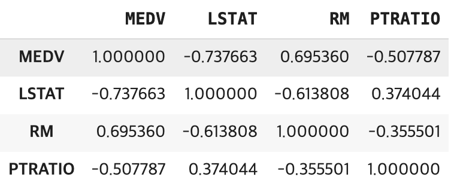
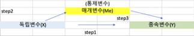
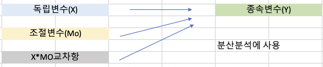
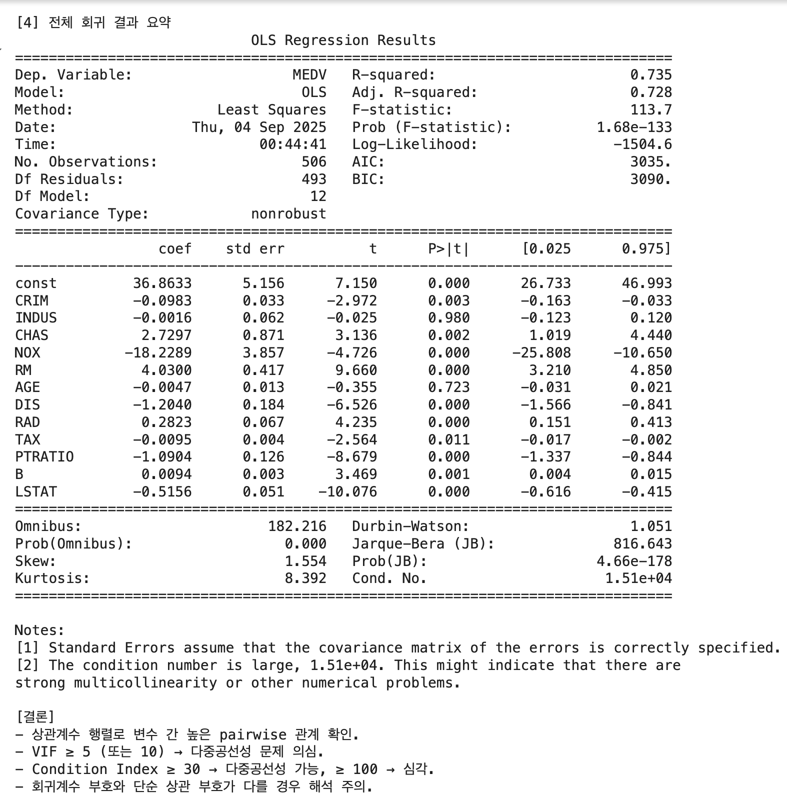
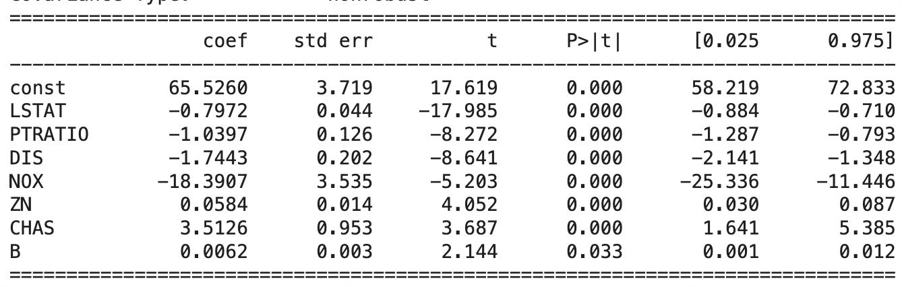
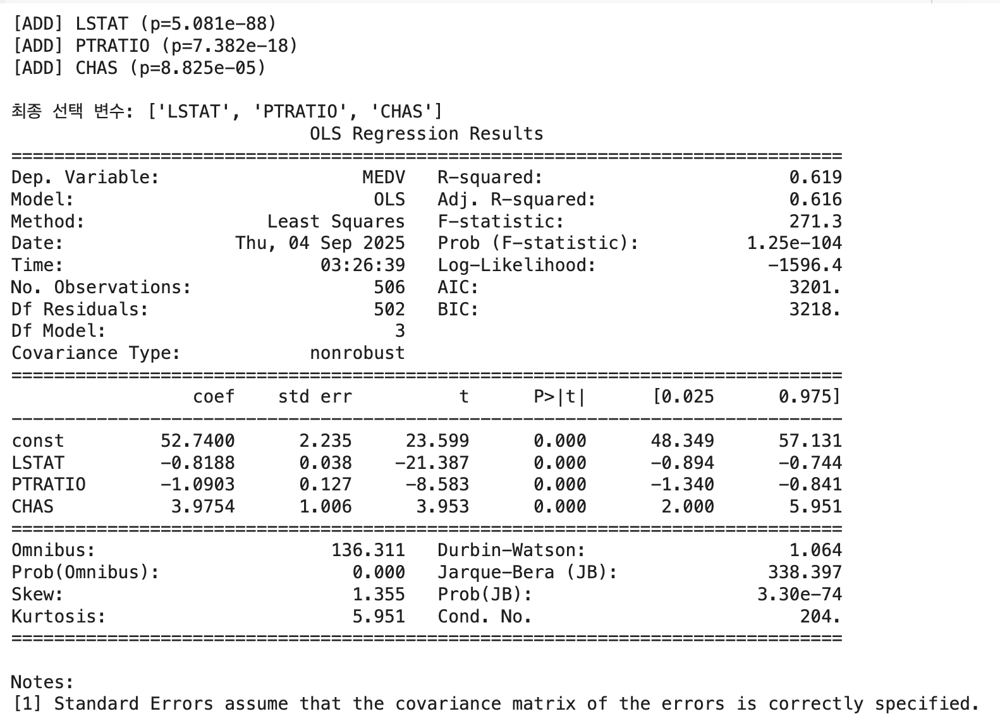
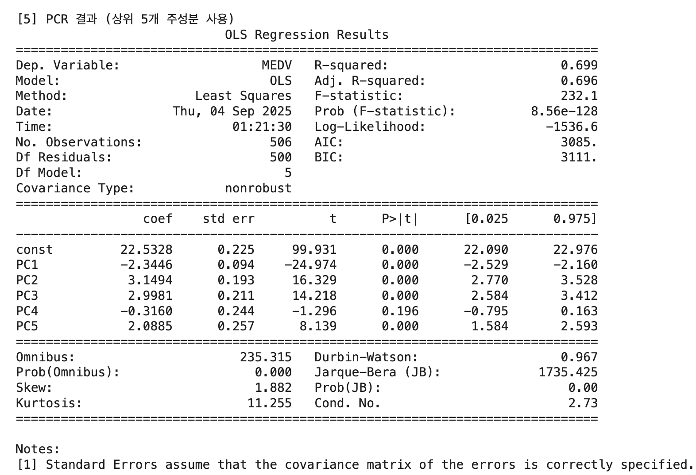

## 다중공선성 개념

::: {.callout-note icon=false}
## 정의
**다중공선성(Multicollinearity)**이란 독립변수들 간에 강한 선형관계가 존재하는 경우를 말한다. 회귀모형은 각 독립변수가 종속변수에 미치는 "순수한 영향"을 추정하는 것을 목표로 한다. 그러나 독립변수끼리 강하게 상관되어 있으면 각 계수 추정치가 불안정해지고, 통계적 유의성이 왜곡될 수 있다.
:::

### 다중공선성이란?

다중 회귀모형에서 분석자가 가장 먼저 확인하는 것은 모형 전체가 목표변수를 잘 설명하는지에 대한 F-검정과, 각각의 예측변수가 독립적으로 의미 있는 역할을 하는지를 살펴보는 t-검정이다. 이러한 과정에서 자연스럽게 두 가지 관심사가 생긴다. 하나는 여러 예측변수 중에서 어떤 변수가 상대적으로 더 중요한가 하는 문제이고, 다른 하나는 각 변수가 목표변수에 구체적으로 어느 정도 영향을 미치는가 하는 문제이다.

상대적 중요성은 표준화 회귀계수를 통해 비교할 수 있으며, 목표변수에 대한 구체적 설명력은 OLS로 추정된 회귀계수를 통해 확인할 수 있다. 회귀계수의 의미는 단순하다. 다른 조건이 모두 동일할 때, 특정 예측변수가 한 단위 증가하면 목표변수는 그 계수 값만큼 변동한다는 것이다. 그러나 이런 해석은 다른 예측변수들이 변하지 않고 고정되어 있다는 전제가 필요하다.

현실의 데이터에서 예측변수들이 완벽하게 서로 독립인 경우는 거의 없다. 예측변수들 간의 상관관계가 높아 통계적으로 유의하다면, OLS로 얻은 회귀계수의 추정치와 분산 추정이 불안정해지고 검정 결과 역시 신뢰할 수 없게 된다. 이러한 상황을 다중공선성(multicollinearity) 문제라고 부른다.

::: {.callout-note icon=false}
## 다중공선성 발생 원인 2가지

| 원인 | 설명 | 예시 |
|------|------|------|
| **구조적 다중공선성** | 연구자가 설정한 모형 구조 자체에서 비롯 | 예측변수의 제곱항·곱항 포함 시 원변수와 강한 상관 발생 |
| **데이터 기반 다중공선성** | 실제 관측 자료에서 변수들 간 상관이 매우 높을 때 | 소득·소비, 교육수준·소득처럼 현실적으로 밀접한 변수 동시 포함 |
:::

**발생 원인**: 구조적 다중공선성은 연구자가 설정한 회귀모형 자체에서 비롯된다. 예를 들어 예측변수의 제곱항이나 곱항 같은 다항식 항을 포함하면, 원래 변수와 이들 변환 변수 사이에 강한 상관이 자연스럽게 발생한다. 데이터 기반 다중공선성은 실제 관측된 자료에서 예측변수들 간의 상관관계가 매우 높을 때 발생한다. 예컨대 소득과 소비, 교육수준과 소득처럼 현실적으로 밀접히 연관된 변수들을 동시에 포함하면 이들 간에 중복된 설명력이 생겨 다중공선성이 나타난다.

### 다중공선성 문제

::: {.callout-note icon=false}
## 다중공선성이 일으키는 문제

| 항목 | 수식·설명 |
|------|---------|
| **행렬식 문제** | $\det\|X'X\| \approx 0$ → $(X'X)^{-1}$의 값이 매우 커짐 |
| **계수 불안정** | $\hat{\underset{¯}{b}} = (X'X)^{-1}X'\underset{¯}{y}$ 추정치가 불안정 |
| **추정 분산 증가** | $s^2(\hat{\underset{¯}{b}}) = MSE(X'X)^{-1}$이 매우 커짐 |
| **부호 역전** | 회귀계수의 부호가 이론과 반대로 추정될 수 있음 |
| **유의성 왜곡** | p-값의 신뢰성이 저하되어 유의성 검정 결과를 신뢰할 수 없음 |
:::

예측변수($X_{k}$) 간의 상관관계가 높으면 데이터 행렬의 한 열(변수)이 다른 열로 표현되므로 $\det|X'X| \approx 0$이 되어 $(X'X)^{- 1} = \frac{adj(X'X)}{\det|X'X|}$의 값이 매우 커진다. 이로 인하여 회귀계수 OLS 추정치 $\widehat{\underset{¯}{b}} = (X'X)^{- 1}X'\underset{¯}{y}$ 값이 불안정해진다.

다중공선성 문제를 일으키지 않는 예측변수의 회귀계수에 비해 변동이 커지며, 회귀모형의 작은 변화에도 회귀계수의 추정치는 매우 민감하게 반응한다. 또한 OLS 추정의 추정분산 $s^{2}(\widehat{\underset{¯}{b}}) = MSE(X'X)^{- 1}$도 매우 커져 회귀계수의 부호까지 바뀌는 문제가 발생한다. 회귀계수 추정 오차가 커지면 회귀계수 유의성 검정의 신뢰성이 저하되어 추정 회귀모형 신뢰성이 낮아진다.

### 다중공선성 맛보기

보스톤 주택 가격(MEDV)의 예측변수 (LSTAT, INDUS, RM) 3개를 이용 다중공선성 문제를 살펴보자.

```python
# ==============================================
# Boston house 데이터
# ==============================================
import pandas as pd
from sklearn.datasets import fetch_openml

# 1. 데이터 불러오기
boston = fetch_openml(name="boston", version=1, as_frame=True).frame

#피어슨 상관계수
boston[['MEDV','LSTAT','RM','PTRATIO']].corr(method ='pearson')
```

{fig-align="center" width="60%"}

$medv = 34.6 - 0.95 \times lstat,\quad R^{2} = 54.4\%$

먼저 lstat만 포함한 단순회귀모형에서는 회귀계수가 -0.95로 추정된다. 이는 저소득층 비율이 한 단위 증가할 때 주택가격이 평균적으로 약 0.95 단위 감소한다는 의미이며, 결정계수는 약 54.4%로 나타난다.

$medv = - 1.36 - 0.64 \times lstat + 5.09 \times rm,\quad R^{2} = 63.9\%$

여기에 rm을 함께 넣으면 상황이 달라진다. lstat과 rm은 강한 상관관계를 갖는 변수인데, 두 변수를 동시에 포함하면 lstat의 회귀계수가 -0.64로 크게 줄어든다. 그 대신 rm의 회귀계수는 5.09로 추정되고, 결정계수는 63.9%로 상승한다. 즉, 두 변수가 설명하는 부분이 겹치면서 계수 값이 불안정해지고, 단일변수 모형과 다변수 모형에서 해석이 달라지는 다중공선성의 전형적인 현상이 발생한다.

$medv = 34.9 - 0.903 \times lstat - 0.08 \times indus,\quad R^{2} = 54.6\%$

반면 indus처럼 lstat과의 상관관계가 낮은 변수를 추가하면 다른 결과가 나온다. indus를 포함한 모형에서 lstat의 계수는 여전히 -0.9 수준으로 거의 변하지 않고, 결정계수 역시 54.6%로 단 0.2% 정도만 증가한다.

### 다중공선성 반드시 해결해야 하나?

다중공선성 문제가 발생했다고 해서 반드시 그것을 제거하거나 해결해야 하는 것은 아니다. 다중공선성이 존재해도 회귀모형의 전체 예측력이나 적합도에는 큰 문제가 없기 때문이다.

문제는 주로 해석 단계에서 나타난다. 다중공선성이 심할 경우, 회귀계수의 표준오차가 커져서 유의성이 불명확해지고, 계수의 크기나 부호가 직관에 어긋나게 추정될 수 있다. 따라서 "어떤 예측변수가 목표변수에 더 큰 영향을 미치는가?"와 같은 변수별 효과 해석이 중요한 연구에서는 다중공선성을 무시하기 어렵다.

::: {.callout-tip icon=false}
## 다중공선성 해결 여부 판단 기준

| 구분 | 반드시 해결해야 하는 경우 | 해결하지 않아도 되는 경우 |
|------|------------------------|------------------------|
| **연구 목적** | 각 설명변수의 개별 효과 해석이 중요할 때 (정책·이론적 함의) | 예측력 확보가 주목적일 때 |
| **통계 지표** | VIF ≥ 10, Condition Index ≥ 30 | VIF 3~5 수준 |
| **회귀계수** | 추정된 회귀계수 부호가 피어슨 상관계수 부호와 불일치 | 회귀계수 부호와 피어슨 상관계수 부호가 동일 |
| **모형 안정성** | 표본을 바꿀 때 회귀계수 추정치가 크게 요동 | 표본 변화에도 회귀계수가 크게 변하지 않음 |
:::

실제로 Applied Linear Statistical Models (4판, p.289)에서도 언급하듯이, 예측변수들 사이에 일정 수준의 상관이 존재한다고 해서 모형의 적합 자체가 저해되거나 새로운 관측값에 대한 예측이 무의미해지는 것은 아니다. 다중공선성은 주로 개별 회귀계수의 해석과 검정에 영향을 미칠 뿐, 평균 반응(mean response)이나 예측값(prediction)의 정확성에는 큰 타격을 주지 않는다.

특히 최종 모형에서 추정된 회귀계수의 부호와, 해당 설명변수와 종속변수 간의 피어슨 상관계수 부호를 비교하는 것이 중요하다. 두 부호가 동일하다면, 비록 다중공선성이 존재한다고 하더라도 모형의 해석에 심각한 왜곡을 주지 않으므로 굳이 다중공선성을 해결할 필요가 없다.

이는 Baron & Kenny(1986)가 조절변수(moderator)와 매개변수(mediator) 모형을 제시할 때도 중요한 함의로 다루어졌다. 즉, **실험변수에서 다중공선성이 없다면 문제 삼지 않아도 되며, 통제변수 사이의 공선성은 분석 목적상 자연스럽게 허용될 수 있다**는 점이 핵심이다.

**매개효과 Mediator**

{fig-align="center" width="60%"}

(순서1) $y = a + b_{11}X + e$ : $b_{11}$ 유의해야 한다.

(순서2) $Me = a + b_{21}X + e$ : $b_{21}$ 유의해야 한다.

(순서3) $y = a + b_{31}X + b_{32}Me + e$ : $b_{32}$ (매개효과) 유의하고 $b_{31}$은 $b_{11}$보다 절대값이 작아지거나 유의하지 않을 수 있음

**조절효과 Moderate**

{fig-align="center" width="60%"}

$y = a + b_{1}X + b_{2}MO + b_{3}X \times MO + e$

$b_{3}$는 반드시 유의해야 한다.

## 다중공선성 진단

::: {.callout-tip icon=false}
## 다중공선성 진단 방법 비교

| 방법 | 진단 기준 | 특징 | 한계 |
|------|---------|------|------|
| **상관계수 행렬** | 상관계수 > 0.7 주의 | 직관적, 계산 간단 | 쌍체(pairwise)만 포착 |
| **VIF** | VIF ≥ 5 (또는 10) | 다변수 공선성 탐지 | 쌍체 관계에는 미흡 |
| **상태지수 CI** | CI ≥ 30 심각 | 주성분 기반 체계적 진단 | 계산 복잡, 해석 어려움 |
:::

### 진단 도구

#### 산점도·상관계수

다중공선성을 진단하는 가장 기본적인 출발점은 산점도 행렬과 상관계수 행렬이다. 회귀분석을 시작할 때, 먼저 산점도 행렬을 통해 종속변수와 각 설명변수의 관계를 시각적으로 살펴볼 수 있으며, 동시에 설명변수들 사이의 관계도 확인할 수 있다.

이 방법은 직관적이고 계산이 간단하다는 장점이 있지만, 몇 가지 한계가 있다. 무엇보다 상관계수 행렬은 설명변수들 간의 쌍체(pairwise) 관계만 보여줄 뿐, 여러 변수들이 함께 작용하는 경우의 다중공선성을 직접 검정하지는 못한다. 단순히 상관계수가 높다고 해서 반드시 심각한 다중공선성이 발생한다고 단정할 수 없고, 반대로 상관계수가 낮더라도 다중공선성이 존재할 수 있다.

따라서 산점도와 상관계수는 다중공선성을 "예상하고 탐색하는 도구"일 뿐, 유의성 검정을 제공하지는 못한다는 점을 명확히 이해할 필요가 있다.

#### 분산팽창지수 VIF

$VIF_{k} = \frac{1}{1 - R_{k}^{2}}$

특정 예측변수를 목표변수로 하고 나머지 예측변수를 설명변수로 하여 회귀분석 한 후 결정계수를 구한다. 결정계수 $R_{k}^{2}$ 값이 크다는 것은 $X_{k}$가 다른 예측변수들에 의해 충분히 설명되고 있다는 것이고 이는 바로 다중공선성 문제가 발생할 수 있다는 증거이다. 만약 결정계수 $R^{2} = 0.9$이면 분산팽창지수 $VIF = 10$이다.

::: {.callout-note icon=false}
## VIF 판단 기준

| VIF 값 | 판단 | 참고 문헌 |
|:------:|------|---------|
| **≥ 10** | 심각한 다중공선성 | Hair et al. (1995), Multivariate Data Analysis |
| **≥ 5** | 문제 수준 | Ringle et al. (2015) |
| **≥ 2.5** | 빅데이터 보수적 기준 | 현대 데이터 분석 관행 |

다수의 예측변수들에 의해 설명되는 정도를 나타내지만 상관계수와 같이 두 개의(쌍체) 예측변수에 의한 진단에는 적절하지 못하다.
:::

#### 상태지수 Condition Index

$CI = \sqrt{\frac{\lambda_{max}}{\lambda_{k}}}$

예측변수의 공분산(상관계수)행렬을 이용하여 고유값 eigen value($\lambda_{k}$)를 구한다. 이에 대응하는 Norm 1인 고유벡터가 주성분 부하 loading이다.

::: {.callout-note icon=false}
## 상태지수(CI) 판단 기준

| CI 값 | 판단 |
|:-----:|------|
| < 10 | 정상 |
| 10 ~ 30 | 다소 주의 |
| **≥ 30** | 다중공선성 일반적 기준 |
| **≥ 100** | 심각한 다중공선성 |

고유벡터 내의 부하크기가 상대적으로 큰 변수들 간에는 상관관계가 높다. 상태지수가 30 이상인 부하벡터에서 부하계수가 상대적으로 큰 변수들에 의해 다중공선성 문제가 발생한다고 진단한다.
:::

#### 권장 진단 방법

다중공선성을 진단할 때는 우선 분산팽창지수(VIF)를 활용하는 것이 일반적이다. 실무적으로는 VIF ≥ 3을 기준으로 주의가 필요하다고 본다. 이때 단순히 모든 변수를 대상으로 일괄 판단하기보다는, 최종적으로 유의하다고 확인된 설명변수를 중심으로 검토하는 것이 바람직하다.

특히 최종 모형에서 추정된 회귀계수의 부호와, 해당 설명변수와 종속변수 간의 피어슨 상관계수 부호를 비교하는 것이 중요하다. 두 부호가 동일하다면, 비록 다중공선성이 존재한다고 하더라도 모형의 해석에 심각한 왜곡을 주지 않으므로 굳이 다중공선성을 해결할 필요가 없다.

```python
# ==============================================
# Boston Housing: Multicollinearity Diagnostics
# ==============================================
import numpy as np
import pandas as pd
import statsmodels.api as sm
from sklearn.datasets import fetch_openml
from statsmodels.stats.outliers_influence import variance_inflation_factor

# 1) 데이터 로드
boston = fetch_openml(name="boston", version=1, as_frame=True)
df = boston.frame.copy()

for c in df.columns:
    if df[c].dtype.name in ["object", "category"]:
        df[c] = pd.to_numeric(df[c].astype(str).str.strip(), errors="coerce")
df = df.dropna().reset_index(drop=True)

y = df["MEDV"]
X = df.drop(columns=["MEDV","ZN"])

print("전체 예측변수 목록:", list(X.columns))

# 2) 상관계수 행렬
print("\n[1] 상관계수 행렬 (medv 포함)")
corr = df.corr()
print(corr.round(3))

# 3) VIF 계산
def compute_vif(Xdf):
    X_ = sm.add_constant(Xdf)
    vif_list = []
    for i, col in enumerate(X_.columns):
        if col == "const":
            continue
        vif = variance_inflation_factor(X_.values, i)
        vif_list.append({"variable": col, "VIF": vif})
    return pd.DataFrame(vif_list).sort_values("VIF", ascending=False)

print("\n[2] VIF (모든 변수)")
vif_tbl = compute_vif(X)
print(vif_tbl.round(3))

# 4) Condition Index
def condition_index(Xdf):
    Z = (Xdf - Xdf.mean(axis=0)) / Xdf.std(axis=0, ddof=1)
    C = np.corrcoef(Z.values, rowvar=False)
    eigvals, eigvecs = np.linalg.eigh(C)
    lam_max = eigvals.max()
    ci = np.sqrt(lam_max / eigvals)
    Phi = eigvecs / np.sqrt(eigvals)[None, :]
    phi2 = Phi**2
    prop = phi2 / phi2.sum(axis=0, keepdims=True)
    ci_tbl = pd.DataFrame({
        "eigenvalue": eigvals,
        "condition_index": ci
    })
    prop_tbl = pd.DataFrame(
        prop,
        index=Xdf.columns,
        columns=[f"eig{k+1}" for k in range(len(eigvals))]
    )
    return ci_tbl.sort_values("condition_index", ascending=True), prop_tbl

ci_tbl, prop_tbl = condition_index(X)

print("\n[3] Condition Index")
print(ci_tbl.round(3))
print("\n[3-1] Variance-Decomposition Proportions")
print(prop_tbl.round(3))

# 5) 전체 변수 포함 OLS 회귀 적합
X_const = sm.add_constant(X)
ols_full = sm.OLS(y, X_const).fit()

print("\n[4] 전체 회귀 결과 요약")
print(ols_full.summary())
```

전체 예측변수 목록: ['CRIM', 'INDUS', 'CHAS', 'NOX', 'RM', 'AGE', 'DIS', 'RAD', 'TAX', 'PTRATIO', 'B', 'LSTAT']

[2] VIF (모든 변수)

variable VIF
<br>
8 TAX 8.560
<br>
7 RAD 7.401
<br>
3 NOX 4.388
<br>
1 INDUS 3.946
<br>
6 DIS 3.314
<br>
5 AGE 3.056
<br>
11 LSTAT 2.933
<br>
4 RM 1.887
<br>
0 CRIM 1.779
<br>
9 PTRATIO 1.625
<br>
10 B 1.348
<br>
2 CHAS 1.074

[3] Condition Index: 최대 Condition Index = 9.36 (기준선 30 미만)

{fig-align="center" width="80%"}

::: {.callout-note icon=false}
## Boston Housing 다중공선성 진단 결과 종합

| 진단 | 결과 | 해석 |
|------|------|------|
| **상관계수** | INDUS-NOX (0.764), RAD-TAX (0.910), NOX-DIS (-0.769) | 변수 간 높은 pairwise 관계 |
| **VIF** | TAX(8.56), RAD(7.40) | 공선성 높은 변수 후보 |
| **Condition Index** | 최대 9.36 (기준 30 미만) | 심각한 다중공선성은 아님 |
| **OLS R²** | 73.5% | 높은 설명력 |
| **비유의 변수** | INDUS, AGE | 다른 변수들과 중복 영향(공선성) |
| **부호 불일치** | RAD (MEDV와 음의 상관, 계수는 양) | RAD-TAX가 대표적 다중공선성 원인 쌍 |

→ **주요 결론**: RAD 변수 제외 후 단계선택 재적용 권장
:::

1. 상관계수 행렬: INDUS-NOX (0.764), RAD-TAX (0.910), NOX-DIS (-0.769) 같이 변수 간 높은 상관이 존재한다. LSTAT는 MEDV와 -0.738, RM은 MEDV와 0.695로 강한 상관 → 주택가격의 핵심 설명변수임을 확인.

2. VIF: TAX(8.56), RAD(7.40) → 공선성 높은 변수 후보. NOX(4.39), INDUS(3.95), DIS(3.31), AGE(3.06)도 다소 높은 값. "RAD-TAX"가 대표적 다중공선성 원인 쌍이다.

3. Condition Index: 최대 Condition Index = 9.36, 기준선(30 이상)에는 미치지 않음. 즉, 심각한 다중공선성은 아님. 다만 분산분해비(Proportions)를 보면 특정 고유성분에서 RAD, TAX, NOX 등이 같이 큰 값을 가짐 → 이 변수들이 공선성에 기여.

4. OLS 결과: 모형 설명력: 결정계수 73.5%로 상당히 높은 수준이다. 주요 유의 변수: RM(방 개수, 양수 효과), LSTAT(저소득층 비율, 음수 효과), PTRATIO, NOX, DIS, RAD, TAX, B, CHAS. 비유의 변수: INDUS, AGE → 높은 상관은 있지만 독립적으로 설명력 없음.

5. 종합 결론: RAD 예측변수는 목표변수와 음의 상관관계가 있는데 회귀계수는 양이므로 TAX보다 목표변수와 상관관계가 낮은 RAD 변수는 제외하는 것이 적절하다.

#### 최종 회귀모형

- (RM, "DIS","AGE")은 변수선택에서 제외
- RAD는 다중공선성 문제 발생으로 제외

```python
# ==============================================
# 최종 회귀모형 선택
# ==============================================

import pandas as pd
import numpy as np
import statsmodels.api as sm
from sklearn.datasets import fetch_openml

boston = fetch_openml(name="boston", version=1, as_frame=True)
df = boston.frame.copy()

y = pd.to_numeric(df["MEDV"], errors="coerce")
X = df.drop(columns=["MEDV", "RM", "RAD","DIS","AGE"]).copy()
```

단계선택 방법: 결정계수 67.1%

{fig-align="center" width="80%"}

- DIS: 목표변수와 상관계수 부호와 회귀계수 부호 상이 → 경고문에 다중공선성 문제 발생 출력되었다.
- 다시 단계선택 방법을 적용한 결과 AGE 변수도 동일한 문제 발생 → 경고문에 다중공선성 문제 발생 출력되었다.
- 최종 모형: LSTAT, PTRATIO, CHAS 3개 예측변수만 사용되었다.

{fig-align="center" width="100%"}

## 다중공선성 해결방안

::: {.callout-tip icon=false}
## 다중공선성 해결방안 비교

| 방법 | 원리 | 장점 | 단점 |
|------|------|------|------|
| **변수 제거** | 공선성 유발 변수 제거 | 간단, 직관적 | 중요 변수 손실 가능 |
| **변수 중심화 (Centering)** | 예측변수에서 평균을 빼 $X - \bar X$ | 구조적 공선성 해소 | 데이터 기반 공선성에는 효과 제한 |
| **표준화** | $z_i = (x_i - \bar x)/s(x_i)$ | 단위 제거, 해석 용이 | 원 단위 해석 어려움 |
| **주성분 회귀 (PCR)** | 상관 없는 주성분으로 변환 | 공선성 완전 해소 | 주성분 해석 어려움 |
| **Ridge Regression** | L2 페널티로 계수 수축 | 안정적 추정, 모든 변수 유지 | 편향 발생, 유의성 검정 불가 |
:::

구조적 다중공선성 문제 해결 - 예측변수 centering (중심화) - 다항식 모형(예측변수의 제곱항, 세제곱항)에 적합

- 표준화는 데이터의 평균과 표준편차를 활용하여 단위를 없앤 개념이다. $z_{i} = \frac{x_{i} - {\overline{x}}_{i}}{s(x_{i})}$

- 중심화는 데이터의 평균을 0으로 이동한 개념임, 산포는 동일하게 유지된다. $c_{i} = x_{i} - {\overline{x}}_{i}$

**문제변수 제거**

- 다중공선성 문제가 되는 설명변수를 제외한다.
- 여러 개가 존재하는 경우 목표변수와 상관관계가 낮은 예측변수를 제외한다.

### 주성분분석 PCA

주성분분석(PCA)은 여러 개의 상관된 변수들을, 서로 상관이 없는 새로운 변수들(주성분, principal components)로 변환하는 차원 축소 방법이다. 각 주성분은 원래 변수들의 선형결합으로 만들어지며, 첫 번째 주성분은 데이터 변동성을 가장 크게 설명하고, 두 번째 주성분은 그 다음으로 큰 변동성을 설명하되 첫 번째 주성분과 직교(orthogonal)하도록 구성된다.

::: {.callout-note icon=false}
## PCA 해결방안 활용 절차

| 단계 | 내용 |
|------|------|
| **① 표준화** | 변수 간 단위 차이 제거 |
| **② PCA 적합** | 원래 변수 → 직교하는 주성분으로 변환 |
| **③ 주성분 선택** | 누적 설명력 80~90% 수준까지 상위 k개 주성분 선택 |
| **④ PCR 회귀** | 선택된 주성분을 설명변수로 OLS 회귀 |
| **⑤ 역변환(선택)** | 주성분 계수 → 원래 변수 계수로 역변환 |
:::

PCA의 목적은 복잡하게 얽힌 변수들의 중복된 정보를 제거하고, 데이터의 주요한 구조를 단순화하는 데 있다. 주성분분석은 단순히 데이터 요약 방법이 아니라, 다중공선성 문제를 해결할 수 있는 강력한 도구이다. 원래 변수들 간의 상관관계를 제거하고 새로운 직교 좌표축을 제공하기 때문에, 예측력을 유지하면서 회귀계수의 안정성을 높여준다. 다만, 주성분의 해석이 직관적이지 않다는 점을 감안하여, 예측이 목적일 때 특히 효과적이고, 해석이 목적일 때는 신중하게 적용해야 한다.

**해결 방안으로서 PCA의 활용**

- PCA를 통해 얻은 주성분들을 새로운 설명변수로 사용하여 회귀분석을 수행한다.
- 주성분들은 서로 독립적이므로 다중공선성 문제가 해소된다.
- 다만, 주성분은 원래 변수의 해석이 쉽지 않다는 단점이 있다.

**차원 축소 효과**

- 설명력이 낮은 주성분을 제외하고 상위 몇 개의 주성분만 사용하면, 변동성을 유지하면서 불필요한 잡음과 다중공선성을 동시에 줄일 수 있다.
- 예를 들어, 원래 10개 변수로 구성된 데이터라도 상위 3~4개의 주성분으로 전체 변동성의 80~90%를 설명할 수 있다면, 훨씬 단순하고 안정적인 모형을 얻을 수 있다.

```python
# ==============================================
# PCA (주성분분석) + Principal Component Regression
# ==============================================
import numpy as np
import pandas as pd
from sklearn.datasets import fetch_openml
from sklearn.preprocessing import StandardScaler
from sklearn.decomposition import PCA
import statsmodels.api as sm

# 1) 데이터 로드
boston = fetch_openml(name="boston", version=1, as_frame=True)
df = boston.frame.copy()

for c in df.columns:
    if df[c].dtype.name in ["object", "category"]:
        df[c] = pd.to_numeric(df[c].astype(str).str.strip(), errors="coerce")
df = df.dropna().reset_index(drop=True)

y = df["MEDV"]
X = df.drop(columns=["MEDV","ZN"])

print("예측변수 목록:", list(X.columns))

# 2) 표준화
scaler = StandardScaler()
X_scaled = scaler.fit_transform(X)

# 3) PCA 적합
pca = PCA()
X_pca = pca.fit_transform(X_scaled)

explained_var = pca.explained_variance_ratio_
print("\n[1] 각 주성분 설명 분산 비율")
print(np.round(explained_var, 3))

print("\n[2] 누적 설명력")
print(np.round(np.cumsum(explained_var), 3))

# 4) 주성분 부하량
loadings = pd.DataFrame(
    pca.components_.T,
    index=X.columns,
    columns=[f"PC{i+1}" for i in range(len(X.columns))]
)
print("\n[3] 주성분 부하량 (원 변수 -> 주성분 기여도)")
print(loadings.round(3))

# 5) 주성분 점수 DataFrame
pc_scores = pd.DataFrame(X_pca, columns=[f"PC{i+1}" for i in range(len(X.columns))])

# 6) PCR (주성분 회귀: 상위 k개 주성분만 사용)
k = 5
X_pc = sm.add_constant(pc_scores.iloc[:, :k])
pcr_model = sm.OLS(y, X_pc).fit()

print(f"\n[5] PCR 결과 (상위 {k}개 주성분 사용)")
print(pcr_model.summary())
```

[1] 각 주성분 설명 분산 비율: [0.481 0.114 0.095 0.071 0.064 0.05 0.041 0.028 0.02 0.016 0.014 0.005]

[2] 누적 설명력: [0.481 0.595 0.69 0.761 0.825 0.876 0.916 0.944 0.964 0.98 0.995 1.0]

{fig-align="center" width="100%"}

::: {.callout-note icon=false}
## 주성분 해석 요약

| 주성분 | 설명 분산 | 주요 변수 | 해석 |
|--------|:--------:|---------|------|
| **PC1** | 48.1% | CRIM(+), INDUS(+), NOX(+), AGE(+), TAX(+), LSTAT(+) vs RM(-), DIS(-), B(-) | 도시 낙후·환경 악화 요인 |
| **PC2** | 11.4% | CHAS(+), RM(+), AGE(+), NOX(+) vs PTRATIO(-), DIS(-) | 강변 주거환경·교육 조건 요인 |
| **PC3** | 9.5% | RM(+), RAD(+), TAX(+), CRIM(+) vs B(-), LSTAT(-) | 주거규모·교통 재정 요인 |
| **PC4** | 7.1% | CHAS(+), PTRATIO(+), B(+), INDUS(+) | 입지·교육 보조 요인 |
| **PC5** | 6.4% | B(+), RM(+), PTRATIO(+), LSTAT(-) | 주택 품질·사회구성 요인 |

상위 5개 PC로 전체 분산의 82.5% 설명
:::

### 능형 회귀분석 Ridge Regression

다중공선성은 회귀계수의 추정오차를 증가시키므로 불편성(OLS는 불편 추정량이다)을 포기하는 대신 MSE(Mean Square of Error)를 최소화하는 편기(biased) 추정량을 구하는 추정 방법을 사용함으로써 다중공선성 문제를 해결하는데 이를 능형 회귀분석(Ridge Regression)이라 한다.

::: {.callout-tip icon=false}
## Ridge vs. OLS 비교

| 구분 | OLS | Ridge |
|------|-----|-------|
| **손실함수** | $\sum(y_i - \hat y_i)^2$ | $\sum(y_i - \hat y_i)^2 + \lambda\sum\beta_j^2$ |
| **추정치** | $(X'X)^{-1}X'y$ | $(X'X + \lambda I)^{-1}X'y$ |
| **편향성** | 불편 추정량 | 편기(biased) 추정량 |
| **다중공선성** | 취약 | 강건 |
| **λ = 0** | OLS와 동일 | — |
| **λ → ∞** | — | 모든 계수 → 0 |
| **주요 목적** | 계수 해석 | **예측 안정성 향상** |
| **유의성 검정** | 가능 | 어려움 |
:::

편기 추정량 $\widehat{{\underset{¯}{b}}_{*}} = (X'X + \lambda I)X'\underset{¯}{y}$의 $MSE(\widehat{{\underset{¯}{b}}_{*}}) = E(\widehat{{\underset{¯}{b}}_{*}} - \underset{¯}{b})^{2}$를 최소화하는 $0 < \lambda$를 구하면 이를 능형 추정량이라 한다. $\lambda = 0$이면 OLS 추정값이다.

- 상수 $\lambda$와 VIF 산점도를 이용하여 각 예측변수의 추정 회귀계수 값이 안정화 되는 $\lambda$값을 최적값으로 설정한다. 다소 주관적이다.
- Ridge 회귀는 "회귀계수 해석"보다는 "예측 안정성 향상"에 초점을 두므로 OLS처럼 "이 변수가 유의하다/아니다"를 말하기 위해 쓰는 기법은 아니다.

```python
# ==============================================
# 능형 Regression
# ==============================================
import numpy as np
import pandas as pd
from sklearn.datasets import fetch_openml
from sklearn.preprocessing import StandardScaler
from sklearn.linear_model import RidgeCV
from sklearn.pipeline import Pipeline
from sklearn.metrics import mean_squared_error
from sklearn.model_selection import KFold

boston = fetch_openml(name="boston", version=1, as_frame=True)
df = boston.frame.dropna().reset_index(drop=True)
y = df["MEDV"]
X = df.drop(columns=["MEDV","ZN"])

alphas = np.logspace(-3, 3, 100)

pipe = Pipeline([
    ("scaler", StandardScaler()),
    ("ridge", RidgeCV(alphas=alphas, cv=KFold(n_splits=10, shuffle=True, random_state=42),
                      scoring="neg_mean_squared_error"))
])

pipe.fit(X, y)
best_alpha = pipe.named_steps["ridge"].alpha_
coefs = pipe.named_steps["ridge"].coef_

print("최적 λ(alpha):", best_alpha)
print("회귀계수:", pd.Series(coefs, index=X.columns).sort_values(key=abs, ascending=False))
```

최적 λ(alpha): 4.977

::: {.callout-note icon=false}
## Ridge 회귀 결과 (보스턴 주택가격)

| 변수 | 추정 계수 | 해석 |
|------|:--------:|------|
| LSTAT | -3.625 | 저소득층 비율 ↑ → 주택가격 ↓ |
| RM | 2.852 | 방 개수 ↑ → 주택가격 ↑ |
| DIS | -2.451 | 도심 거리 ↑ → 주택가격 ↓ |
| PTRATIO | -2.299 | 학생-교사 비율 ↑ → 주택가격 ↓ |
| RAD | 2.189 | 고속도로 접근성 ↑ → 주택가격 ↑ |
| NOX | -1.981 | 대기오염 ↑ → 주택가격 ↓ |
| TAX | -1.382 | 재산세율 ↑ → 주택가격 ↓ |
| B | 0.855 | — |
| CRIM | -0.816 | 범죄율 ↑ → 주택가격 ↓ |
| CHAS | 0.705 | 강변 인접 → 주택가격 ↑ |
| AGE | -0.152 | — |
| INDUS | -0.095 | — |

Ridge 회귀는 OLS 대비 안정된 계수를 제공하지만, 개별 유의성 검정은 사용하지 않는다.
:::
