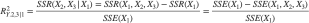
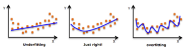
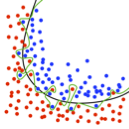
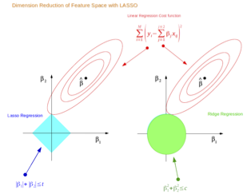
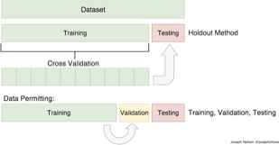
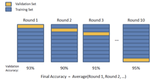
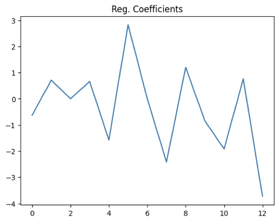
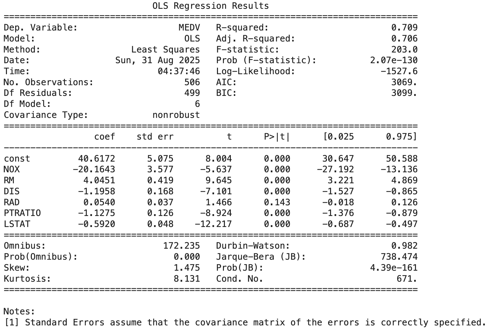
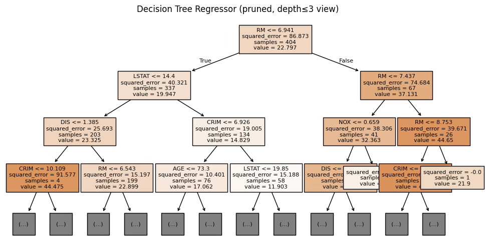
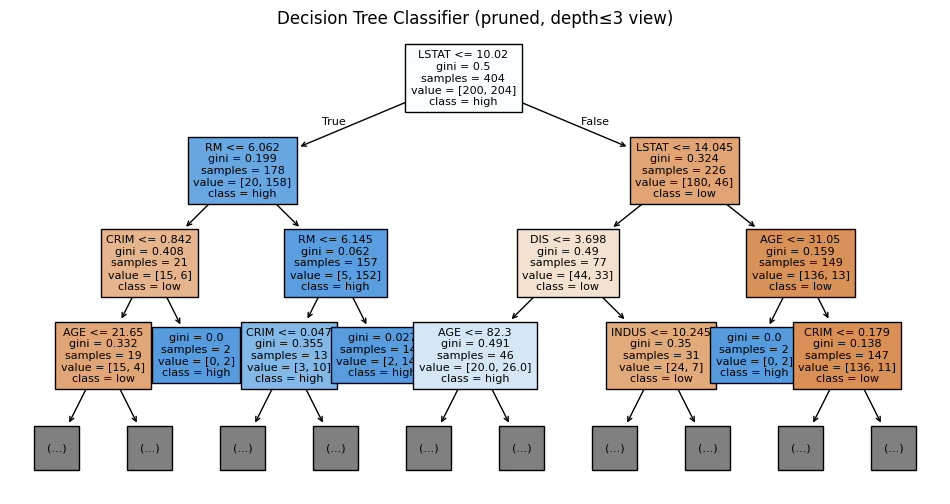

## 변수선택 개념

::: {.callout-note icon=false}
## 정의
**변수선택(Variable Selection)**은 회귀분석에서 목표변수 $Y$에 영향을 줄 것으로 예상되는 예측변수를 이론적 근거와 사전 지식에 바탕을 두고 선택하는 과정이다.
:::

회귀분석에서 첫 단계는 어떤 예측변수를 모형에 포함할 것인가를 결정하는 것이다. 이는 단순히 통계적 절차로만 이루어지는 것이 아니라, 연구자의 이론적 근거와 사전 지식에 바탕을 두고 목표변수 Y에 영향을 줄 것으로 예상되는 변수를 선택하는 과정이다.

이렇게 선정한 예측변수를 이용해 선형 회귀모형을 설정하고, 데이터를 수집하여 회귀계수를 최소자승법(OLS)으로 추정한다. 추정된 모형이 실제로 목표변수의 변동을 설명할 수 있는지를 판단하기 위해서는 검정 절차가 필요하다.

::: {.callout-note icon=false}
## 변수선택 절차

| 단계 | 내용 |
|------|------|
| **① 완전모형 적합** | 모든 후보 예측변수를 포함한 완전모형(full model) 적합 |
| **② 전체 유의성 검정** | 분산분석 F-검정으로 전체 회귀모형의 유의성 확인 |
| **③ 개별 유의성 검정** | t-검정으로 개별 예측변수의 유의성 확인 |
| **④ 유의하지 않은 변수 제거** | t-통계량이 가장 작은 변수(p-value 가장 큰 변수)를 우선 제거 |
| **⑤ 반복** | 모든 남아 있는 변수가 유의해질 때까지 반복 |
:::

먼저, 분산분석(ANOVA)의 F-검정을 통해 전체 회귀모형의 유의성을 검정한다.

- 귀무가설: 모든 회귀계수는 0이다. $\beta_{1} = \beta_{2} = \cdots = \beta_{k} = 0$
- 대립가설: 적어도 하나의 회귀계수는 0이 아니다.

만약 F-검정에서 귀무가설이 기각되지 않으면, 선택한 예측변수들이 목표변수를 설명하지 못한다는 의미가 된다. 반대로 귀무가설이 기각되면, 모형 전체가 유의하다고 판단할 수 있으며, 이때 개별 예측변수가 유의한지도 살펴보아야 한다.

개별 예측변수의 효과는 t-검정을 통해 확인한다.

- 귀무가설: $\beta_{j} = 0$, 대립가설: $\beta_{j} \neq 0$

t-검정에서 유의하다면 해당 예측변수는 목표변수에 선형적으로 의미 있는 영향을 준다고 해석할 수 있다.

::: {.callout-tip icon=false}
## 오컴의 면도날 (Occam's Razor)

"모든 것이 동일하다면 가장 간단한 설명이 최선이다" — **경제성(parsimony)의 원리**

| 원칙 | 내용 |
|------|------|
| **간결한 모형 선호** | 동일한 설명력이라면 예측변수가 더 적은 모형 선택 |
| **과적합 방지** | 불필요한 변수 추가 → 해석 복잡 + overfitting 위험 |
| **변수 선택의 근거** | 통계적 유의성 + 이론적 타당성 동시 고려 |
:::

**오컴의 면도날(Occam's Razor)**: 회귀분석에서 모형을 설정할 때, 가능한 한 단순하면서도 충분히 설명력이 있는 모형을 추구하는 것이 원칙이다. 통계학에서는 이를 경제성의 원리(principle of economy) 또는 절약성의 원리(principle of parsimony)라고 부른다.

**다중공선성 분석과 순서 문제**: 대부분의 교과서에서는 다중공선성 진단을 먼저 설명하고 있으나 어느 단계를 먼저해도 동일 결과를 얻는 경우가 대부분이므로 간편 작업(변수선택 과정을 먼저 거치면 다중공선성 진단 시 변수의 수가 줄어듬)을 위하여 변수선택을 먼저하는 것이 적절하다.

**변수선택 반드시 필요한가?**: 회귀분석 과정에서 변수 선택과 다중공선성 진단은 모두 필수적인 절차이다. 실제 분석 실무에서는 이 순서를 반드시 고정할 필요는 없다. 특히, 먼저 변수 선택 과정을 거쳐 유의하지 않은 예측변수를 제거하고 난 뒤 다중공선성을 진단하면, 분석해야 할 변수가 줄어들어 작업이 간편해진다.

::: {.callout-warning icon=false}
## 다중공선성과 변수선택 주의사항
강한 공선성이 있으면 t-검정 값이 작게 나와 유의하지 않은 것처럼 보일 수 있다. 즉, 공선성 때문에 유효한 변수가 제거될 위험이 있다.

→ **이를 방지하기 위해** 목표변수와 상관계수가 일정 값 이상인 예측변수는 변수선택 과정에서 우선 선택한다.
:::

따라서 실무적으로는 **변수 선택 → 다중공선성 진단** 순서로 접근하는 것이 적절하다.

## 변수선택 고전적 방법

### 모형 설명력 척도

**결정계수 $R_{p}^{2} = \frac{SSR_{p}}{SST_{p}}$**: 회귀분석에서 결정계수는 모형 내의 예측변수들이 목표변수의 총변동을 얼마나 잘 설명하는지를 나타내는 수치이다. 결정계수는 총변동 중 회귀모형이 설명하는 부분의 비율로 정의되며, 단순회귀의 경우에는 상관계수의 제곱과 동일하다.

::: {.callout-note icon=false}
## 결정계수 $R^2$ 해석 기준

| $R^2$ 범위 | 해석 |
|:----------:|------|
| 90% 이상 | 거의 완전한 설명력 |
| 80% 이상 | 매우 충분한 설명력 |
| 70% 이상 | 충분한 설명력 |
| 30~50% | 사회과학·의학에서는 상당히 높은 수준 |

**⚠️ 주의:** 예측변수 개수가 증가할수록 $R^2$는 항상 증가 → 변수 개수가 다른 모형 비교에는 **수정결정계수** 사용 필수
:::

또한 예측변수의 개수가 증가할수록 결정계수는 항상 커지므로, 단순 결정계수를 변수 개수가 다른 모형을 비교하는 데 사용하는 것은 적절하지 않다. 이러한 한계를 보완하기 위해서는 수정결정계수를 사용하는 것이 바람직하다.

**수정결정계수 $R_{adj}^{2} = 1 - \frac{(1 - R^{2})/(n - 1)}{(n - p - 1)}$**: 수정결정계수는 결정계수의 문제점, 즉 유의하지 않은 예측변수가 삽입되어도 $R^{2}$ 값이 항상 증가한다는 한계를 보완하기 위해 고안된 척도이다. 예측변수의 수가 늘어날 때 감소할 수도 있기 때문에, 불필요한 변수를 넣었을 때 자동적으로 설명력이 과대평가되는 문제를 줄여준다.

**Mallow $C_{p} = \frac{SSE_{p}}{{\widehat{\sigma}}^{2}} - (n - 2p)$**: $C_{p}$ 값은 회귀모형 선택 기준 가운데 하나로, 예측변수 개수(절편 포함 $p + 1$)와 $C_{p}$ 값이 근사할 경우 좋은 회귀모형으로 판단한다.

::: {.callout-note icon=false}
## Mallow $C_p$ 해석 기준

| $C_p$ 값 | 해석 |
|:--------:|------|
| $C_p \approx p + 1$ | 적절한 모형 → 편향과 분산의 균형이 잘 맞음 |
| $C_p \gg p + 1$ | 불필요한 변수가 많아 오차항이 큰 모형 |
| $C_p < p + 1$ | 과소적합 가능성 (중요 변수를 놓쳤을 수 있음) |
:::

**예측잔차자승합(PRESS) $= \sum(y_{i} - \widehat{y_{(i)}})^{2}$**: $\widehat{y_{(i)}}$는 $i$-번째 관측치를 제외한 후 모형을 추정한 후 구한 목표변수 $y_{i}$의 적합값이다. 각 관측치에 대해 "나를 빼고 학습했을 때 나를 얼마나 잘 맞추는가?"를 재는 LOOCV(Leave-One-Out Cross-Validation) 오차의 합으로, 값이 작을수록 일반화 예측력이 좋다.

**AIC와 BIC**: 모두 작을수록 적합도가 높다.

$AIC = 2p - 2\ln(\widehat{L})$, $\widehat{L}$ : 회귀모델의 최대우도함수

$$BIC = p \cdot \ln(n) - 2\ln(\widehat{L})$$

::: {.callout-tip icon=false}
## 모형 선택 기준 종합 비교

| 기준 | 특징 | 유의성 검정 | 주요 활용 |
|------|------|:---------:|---------|
| **$R^2$** | 변수 증가 시 항상 상승 | ✗ | 변수 수 동일한 모형 비교 |
| **수정 $R^2$** | 불필요한 변수 포함 시 감소 | ✗ | 변수 수 다른 모형 비교 필수 |
| **Mallow $C_p$** | $C_p \approx p+1$이 최적 | ✗ | 편향·분산 균형 모형 탐색 |
| **PRESS** | LOOCV 기반 예측력 | ✗ | 일반화 성능 평가 |
| **AIC** | 복잡도 패널티 (작은 n에 유리) | ✗ | 모형 간 상대 비교 |
| **BIC** | 변수 수에 더 큰 패널티 | ✗ | 빅데이터 과적합 방지 |

모든 지표는 **"모형 수준의 비교"**를 위한 것이며, 개별 변수의 유의성 판단은 별도 t·F 검정이 필요하다.
:::

**부분 결정계수 Coefficient of Partial Determination**: "기존 모형에 새로운 변수를 넣었을 때 설명력이 얼마나 더 증가했는가"를 나타낸다.

{fig-align="center" width="80%"}

- 분자: $X_{2},X_{3}$가 $X_{1}$이 설명하지 못한 부분에서 추가적으로 설명한 변동
- 분모: $X_{1}$만 썼을 때 남아 있던 오차 변동
- 값이 0에 가까우면 새로운 변수는 기존 변수가 설명하지 못한 변동을 거의 설명하지 못함
- 값이 1에 가까우면 새로운 변수가 기존 모형에 비해 상당한 설명력을 추가함

부분결정계수는 단계적 회귀에서 변수 추가 여부 판단, 변수 공헌도 평가, 다중공선성 관련 해석에 활용된다.

### 최종 회귀모형 선택: 모형비교

서로 예측변수가 고려된 모형 중 최적 모형을 선택하고자 할 때는 MAE, MSE, RMSE나 수정결정계수 값을 비교한다.

표본데이터 크기 $n$이고 OLS 목표변수 적합치(추정치) ${\widehat{y}}_{i}$인 경우

- $MAE = \frac{1}{n}\sum|Y_{i} - {\widehat{Y}}_{i}|$
- $MSE = \frac{1}{n}\sum(Y_{i} - {\widehat{Y}}_{i})^{2}$, $RMSE = \sqrt{MSE}$

**평균자승합예측오차 Mean Square Prediction Error**: $MSPE = \frac{1}{n^{*}}\sum^{n^{*}}(y_{i} - {\widehat{y}}_{i})^{2}$으로, 새로운 자료로 회귀 모형을 추정하였을 때 이전 자료에서 추정된 회귀 모형과 유사하면 추정된 회귀 모형은 좋다고 판단할 수 있다. 새로운 자료 수집이 불가능한 경우에는 데이터를 splitting하여 모형추정 데이터와 예측 데이터로 나누어 분석한다.

수정결정계수나 PRESS, AIC, BIC에 의한 최적 회귀모형 선택은 예측변수가 서로 다른 그룹을 비교할 때 사용되는 통계량이다.

### 고전적 변수선택 방법

::: {.callout-tip icon=false}
## 고전적 변수선택 방법 3가지 비교

| 방법 | 출발점 | 방향 | 특징 | 장점 | 단점 |
|------|--------|------|------|------|------|
| **후진제거** | 완전모형 | 제거 | 유의하지 않은 변수 순차 제거 | 중요 변수 누락 위험 낮음 | 표본 작으면 불안정 |
| **전진삽입** | 빈 모형 | 추가 | 설명력 높은 변수 순차 추가 | 간결 모형 우선 | 초기 선택 오류 시 왜곡 |
| **단계삽입** | 빈 모형 | 추가+제거 | 추가 후 기존 변수 재검정 | 전진+후진 단점 보완 | 공선성에 민감 |
:::

#### 후진제거 Backward

후진제거법은 완전모형에서 시작하여, 가장 유의하지 않은 변수를 하나씩 제거하면서 최종적으로 모든 변수가 유의한 상태의 모형을 선택하는 방법이다.

1. 고려된 모든 예측변수를 모형에 포함하여 회귀모형을 적합한다.
2. 추정된 회귀계수들에 대해 유의성 검정을 실시하고, 가장 유의하지 않은 변수(p-value가 가장 크거나 F값이 가장 작은 변수)를 제외한다.
3. 변수를 제거한 새로운 모형을 다시 적합한 뒤, 동일한 절차를 반복한다.
4. 최종적으로 모형에 남은 모든 예측변수가 통계적으로 유의할 때 과정이 종료된다.

**장점**

- 모든 변수를 고려한 상태에서 시작하기 때문에 중요한 변수를 놓칠 위험이 상대적으로 적다.
- 계산 절차가 비교적 단순하고 직관적이다.

**단점**

- 표본 크기가 작거나 예측변수 간 다중공선성이 심할 경우, 변수 제거 과정이 불안정할 수 있다.
- p-value 기준으로만 판단하기 때문에, 실제로는 설명력이 있는 변수가 제외될 가능성이 있다.
- 변수 제거 순서에 따라 결과 모형이 달라질 수 있다.

```python
# ==============================================
# Boston Housing: 후진제거 변수선택
# ==============================================

import pandas as pd
import numpy as np
import statsmodels.api as sm
from sklearn.datasets import fetch_openml

# --- 0) 데이터 로드 ---
boston = fetch_openml(name="boston", version=1, as_frame=True)
df = boston.frame.copy()

# 종속변수 / 설명변수
y = pd.to_numeric(df["MEDV"], errors="coerce")
X = df.drop(columns=["MEDV"]).copy()

# 숫자형으로 변환
for c in X.columns:
    if X[c].dtype.name in ["object", "category"]:
        X[c] = X[c].astype(str).str.strip()
        X[c] = pd.to_numeric(X[c], errors="coerce")
    else:
        X[c] = X[c].astype(float)

# 결측 제거
mask = y.notna() & X.notna().all(axis=1)
y = y[mask].reset_index(drop=True)
X = X.loc[mask].reset_index(drop=True)

# --- 1) 후진제거 함수 ---
def backward_elimination(X, y, alpha=0.05, verbose=True):
    selected = list(X.columns)
    changed = True

    while changed and len(selected) > 0:
        changed = False
        X_try = sm.add_constant(X[selected], has_constant='add')
        model = sm.OLS(y, X_try).fit()

        pvals = model.pvalues.drop("const")
        worst_feature = pvals.idxmax()
        worst_pval = pvals.max()

        if worst_pval > alpha:
            selected.remove(worst_feature)
            changed = True
            if verbose:
                print(f"[REMOVE] {worst_feature} (p={worst_pval:.4g})")

    return selected

# --- 2) 실행 ---
selected_features = backward_elimination(X, y, alpha=0.05, verbose=True)
print("\n최종 선택 변수:", selected_features)

# --- 3) 최종 모형 적합 ---
X_final = sm.add_constant(X[selected_features], has_constant='add')
final_model = sm.OLS(y, X_final).fit()
print(final_model.summary())
```

[REMOVE] AGE (p=0.9582)
<br>
[REMOVE] INDUS (p=0.738)

#### 전진삽입 Forward

전진삽입법은 후진제거법과 반대로, 아무 변수도 포함하지 않은 상태에서 시작하여, 하나씩 변수를 추가하면서 최종 모형을 완성하는 방식이다.

1. 고려된 예측변수들 중에서 목표변수 변동을 가장 많이 설명하는 변수(결정계수 증가량이 가장 크거나 p-value가 가장 작은 변수)를 찾는다. 그 설명력이 통계적으로 유의하면 이 변수를 첫 번째 예측변수로 선택한다.
2. 첫 번째 변수가 선택된 이후에는, 이미 선택된 변수들이 설명하고 남은 목표변수의 변동(잔차 부분)을 기준으로 한다. 남은 후보 변수들 중에서 이 잔차 변동을 가장 많이 설명하는 변수(부분 F-통계량이 가장 큰 변수)를 찾고, 그 설명력이 유의하다면 두 번째 변수로 선택한다.
3. 이 과정을 반복하여, 더 이상 추가할 만한 유의한 변수가 없을 때 멈춘다.

**장점**

- 모형에 변수가 점점 추가되는 과정이 직관적이며, 분석자가 단계별 변화를 쉽게 이해할 수 있다.
- 불필요한 변수가 처음부터 들어오지 않으므로, 단순한 모형을 우선적으로 고려할 수 있다.

**단점**

- 초기에 잘못 선택된 변수가 있으면, 이후 절차에 큰 영향을 미쳐 전체 모형이 왜곡될 수 있다.
- 일단 포함된 변수는 나중에 제거되지 않기 때문에, 후진제거법보다 유연성이 떨어진다.
- 다중공선성이 강한 경우에는 유의성 판단이 불안정할 수 있다.

```python
# ==============================================
# Boston Housing: 전진삽입 변수선택
# ==============================================

import numpy as np
import statsmodels.api as sm
from sklearn.datasets import fetch_openml

# --- 0) 데이터 로드 ---
boston = fetch_openml(name="boston", version=1, as_frame=True)
df = boston.frame.copy()

# 종속변수
y = pd.to_numeric(df["MEDV"], errors="coerce")
X = df.drop(columns=["MEDV"]).copy()

for c in X.columns:
    if X[c].dtype.name in ["object", "category"]:
        X[c] = X[c].astype(str).str.strip()
        X[c] = pd.to_numeric(X[c], errors="coerce")
    else:
        X[c] = X[c].astype(float)

mask = y.notna() & X.notna().all(axis=1)
y = y[mask]
X = X.loc[mask].reset_index(drop=True)
y = y.reset_index(drop=True)

# --- 2) 전진삽입 함수 ---
def forward_selection(X, y, alpha=0.05, verbose=True):
    selected = []
    remaining = list(X.columns)
    best_changed = True

    while best_changed and len(remaining) > 0:
        best_changed = False
        pvals = []

        for feat in remaining:
            try:
                X_try = sm.add_constant(X[selected + [feat]], has_constant='add')
                model = sm.OLS(y, X_try).fit()
                pv = model.pvalues.get(feat, np.nan)
                pvals.append((feat, pv))
            except Exception as e:
                if verbose:
                    print(f"[skip] {feat}: {e}")
                continue

        if not pvals:
            break

        feat_best, pv_best = sorted(pvals, key=lambda x: (np.isnan(x[1]), x[1]))[0]

        if (not np.isnan(pv_best)) and (pv_best < alpha):
            selected.append(feat_best)
            remaining.remove(feat_best)
            best_changed = True
            if verbose:
                print(f"[ADD] {feat_best} (p={pv_best:.4g})")
        else:
            break

    return selected

# --- 3) 실행 ---
selected_features = forward_selection(X, y, alpha=0.05, verbose=True)
print("\n최종 선택 변수:", selected_features)

# --- 4) 최종 모형 적합 ---
X_final = sm.add_constant(X[selected_features], has_constant='add')
final_model = sm.OLS(y, X_final).fit()
print(final_model.summary())
```

[ADD] LSTAT (p=5.081e-88)
<br>
[ADD] RM (p=3.472e-27)
<br>
[ADD] PTRATIO (p=1.645e-14)
<br>
[ADD] DIS (p=1.668e-05)
<br>
[ADD] NOX (p=5.488e-08)
<br>
[ADD] CHAS (p=0.0002655)
<br>
[ADD] B (p=0.0007719)
<br>
[ADD] ZN (p=0.004652)
<br>
[ADD] CRIM (p=0.04457)
<br>
[ADD] RAD (p=0.001692)
<br>
[ADD] TAX (p=0.0005214)
<br>
최종 선택 변수: ['LSTAT', 'RM', 'PTRATIO', 'DIS', 'NOX', 'CHAS', 'B', 'ZN', 'CRIM', 'RAD', 'TAX']

#### 단계삽입 Stepwise

단계삽입 방법은 기본적으로 전진삽입법과 유사하다. 그러나 중요한 차이는, 이미 선택된 변수들도 새롭게 들어온 변수를 기준으로 다시 유의성 검정을 받는다는 점이다. 따라서 불필요해진 변수가 있으면 모형에서 제거될 수 있다.

1. 첫 단계: 고려된 예측변수들 중에서 목표변수 변동을 가장 많이 설명하는 변수를 선택한다. → 전진삽입법과 동일하다.
2. 두 번째 단계: 첫 번째 변수가 설명한 부분을 제외하고 남은 목표변수의 변동을 기준으로, 남은 변수들 중 가장 설명력이 큰 변수를 선택한다. → 역시 전진삽입법과 동일하다.
3. 선택된 변수 검정: 새로운 변수가 추가되면, 이미 모형에 포함된 기존 변수들이 여전히 유의한지를 다시 검정한다. 만약 기존 변수 중 하나가 더 이상 유의하지 않다면, 그 변수를 제거한다.
4. 종료 조건: 새로운 변수가 더 이상 추가될 수 없고, 기존 변수들이 모두 유의성을 유지할 때 절차가 멈춘다.

**장점**

- 불필요한 변수를 자연스럽게 걸러낼 수 있고, 전진/후진 방식의 단점을 보완한다.
- 자동화된 변수 선택 절차로 계산이 간편하다.

**단점**

- 표본이 작거나 다중공선성이 심한 경우, 변수의 포함 여부가 불안정하다.
- 모형 선택 기준이 순전히 통계적(p-value, F값)에만 의존하기 때문에, 이론적 타당성을 무시할 위험이 있다.
- 데이터가 조금만 달라져도 선택된 변수가 크게 달라질 수 있다.

::: {.callout-warning icon=false}
## Stepwise 결과 사용 시 주의
stepwise 결과를 그대로 "최종 모형"으로 사용하는 것은 위험하다. 연구에서는 이론적 근거를 기반으로 주요 변수를 미리 지정하고, stepwise는 보조적으로 활용하는 것이 바람직하다. PRESS, AIC, BIC, 교차검증(CV) 같은 다른 모형 비교 지표와 함께 사용하는 것이 좋다.
:::

```python
# ==============================================
# Boston Housing: 단계삽입 변수선택
# ==============================================

import pandas as pd
import numpy as np
import statsmodels.api as sm
from sklearn.datasets import fetch_openml

# --- 0) 데이터 로드 ---
boston = fetch_openml(name="boston", version=1, as_frame=True)
df = boston.frame.copy()

y = pd.to_numeric(df["MEDV"], errors="coerce")
X = df.drop(columns=["MEDV"]).copy()

for c in X.columns:
    if X[c].dtype.name in ["object", "category"]:
        X[c] = X[c].astype(str).str.strip()
        X[c] = pd.to_numeric(X[c], errors="coerce")
    else:
        X[c] = X[c].astype(float)

mask = y.notna() & X.notna().all(axis=1)
y = y[mask].reset_index(drop=True)
X = X.loc[mask].reset_index(drop=True)

# --- 1) 단계적 회귀 함수 ---
def stepwise_selection(X, y, alpha_in=0.05, alpha_out=0.10, verbose=True):
    included = []
    while True:
        changed = False

        # Forward Step
        excluded = list(set(X.columns) - set(included))
        new_pvals = pd.Series(index=excluded, dtype=float)
        for new_col in excluded:
            model = sm.OLS(y, sm.add_constant(X[included + [new_col]], has_constant='add')).fit()
            new_pvals[new_col] = model.pvalues[new_col]
        if not new_pvals.empty:
            best_pval = new_pvals.min()
            if best_pval < alpha_in:
                best_feature = new_pvals.idxmin()
                included.append(best_feature)
                changed = True
                if verbose:
                    print(f"[ADD] {best_feature} (p={best_pval:.4g})")

        # Backward Step
        model = sm.OLS(y, sm.add_constant(X[included], has_constant='add')).fit()
        pvals = model.pvalues.drop("const")
        worst_pval = pvals.max()
        if worst_pval > alpha_out:
            worst_feature = pvals.idxmax()
            included.remove(worst_feature)
            changed = True
            if verbose:
                print(f"[REMOVE] {worst_feature} (p={worst_pval:.4g})")

        if not changed:
            break
    return included

# --- 2) 실행 ---
selected_features = stepwise_selection(X, y, alpha_in=0.05, alpha_out=0.10, verbose=True)
print("\n최종 선택 변수:", selected_features)

# --- 3) 최종 모형 적합 ---
X_final = sm.add_constant(X[selected_features], has_constant='add')
final_model = sm.OLS(y, X_final).fit()
print(final_model.summary())
```

[ADD] LSTAT (p=5.081e-88) → ... → [ADD] TAX (p=0.0005214)
<br>
최종 선택 변수: ['LSTAT', 'RM', 'PTRATIO', 'DIS', 'NOX', 'CHAS', 'B', 'ZN', 'CRIM', 'RAD', 'TAX']

#### 최적모형 (Adjusted R² 기준)

```python
# ==============================================
# Boston Housing: 최적모형: 수정 결정계수 기준
# ==============================================

import itertools
import pandas as pd
import numpy as np
import statsmodels.api as sm
from sklearn.datasets import fetch_openml

# 1. 데이터 불러오기
boston = fetch_openml(name="boston", version=1, as_frame=True)
df = boston.frame.copy()

y = pd.to_numeric(df["MEDV"], errors="coerce")
X = df.drop(columns=["MEDV"]).copy()

for c in X.columns:
    if X[c].dtype.name in ["object", "category"]:
        X[c] = X[c].astype(str).str.strip()
        X[c] = pd.to_numeric(X[c], errors="coerce")
    else:
        X[c] = X[c].astype(float)

mask = y.notna() & X.notna().all(axis=1)
y = y[mask].reset_index(drop=True)
X = X.loc[mask].reset_index(drop=True)

# 2. Best Subset 함수
def best_subset(X, y, max_features=5, criterion="adj_r2"):
    results = []
    n = len(y)

    for k in range(1, max_features+1):
        for combo in itertools.combinations(X.columns, k):
            X_combo = sm.add_constant(X[list(combo)], has_constant="add")
            model = sm.OLS(y, X_combo).fit()

            if criterion == "adj_r2":
                score = model.rsquared_adj
            elif criterion == "aic":
                score = -model.aic
            elif criterion == "bic":
                score = -model.bic
            else:
                raise ValueError("criterion은 'adj_r2', 'aic', 'bic' 중 선택")

            results.append({
                "num_features": k,
                "features": combo,
                "criterion": score
            })

    best_model = max(results, key=lambda x: x["criterion"])
    return pd.DataFrame(results), best_model

# 3. 실행 (최대 7개 변수, Adjusted R² 기준)
all_results, best = best_subset(X, y, max_features=7, criterion="adj_r2")

print("Best Model (Adjusted R² 기준):")
print("변수:", best["features"])
print("Adj R²:", best["criterion"])
```

::: {.callout-note icon=false}
## Best Subset 결과 (Adjusted R² 기준)

**선택 변수**: CHAS, NOX, RM, DIS, PTRATIO, B, LSTAT

**Adj R²**: 0.7183
:::

## 변수선택 빅데이터 방법

### 과적합과 과소적합

#### 과적합·과소적합 개념

{fig-align="center" width="80%"}

::: {.callout-tip icon=false}
## 과적합 vs. 과소적합 비교

| 구분 | 과적합 (Overfitting) | 과소적합 (Underfitting) |
|------|-------------------|----------------------|
| **원인** | 변수가 너무 많음, 모형이 과도하게 복잡 | 변수가 너무 적음, 모형이 지나치게 단순 |
| **훈련 성능** | 매우 높음 | 낮음 |
| **검증 성능** | 낮음 (일반화 실패) | 낮음 |
| **해결책** | 변수 선택, 정규화(L1/L2), 교차검증 | 변수 추가, 복잡한 모형 사용 |
:::

**과적합 overfitting**: 추정 모형이 훈련 데이터 세트를 가장 잘 설명하고 있으나, 새로운 데이터에는 적용 불가능한 현상이다. 관측치 수에 비해 너무 많은 특징(변수)이 존재하는 경우 발생하며, 모델은 데이터의 변수 간 실제 관계 대신 학습 데이터의 "노이즈"를 학습하게 된다.

**과소적합 underfitting**: 모델이 훈련 데이터에도 적합하지 않으므로 데이터의 추세를 놓치게 되며, 추정 모형을 새 데이터로 일반화할 수 없다. 매우 간단한 모형(충분한 예측 변수가 아님)의 결과로 발생한다.

#### 과적합과 변수선택

과적합(overfitting)이란 모형이 훈련 데이터의 노이즈까지 학습하여, 새로운 데이터 예측력이 떨어지는 현상으로 주된 원인 중 하나가 불필요한 변수가 너무 많이 포함된 경우이다. 특히 빅데이터(p ≫ n)에서는, 변수가 많아질수록 OLS 회귀는 데이터를 지나치게 잘 맞추고, 일반화는 망가진다.

::: {.callout-note icon=false}
## 편향-분산 트레이드오프 (Bias-Variance Tradeoff)

| 변수 수 | 분산 (Variance) | 편향 (Bias) | 결과 |
|:-------:|:--------------:|:-----------:|------|
| 많음 | ↑ 증가 | ↓ 감소 | 과적합 위험 |
| 적음 | ↓ 감소 | ↑ 증가 | 과소적합 위험 |
| **최적** | 균형 | 균형 | 일반화 성능 최대 |

변수 선택 = "조금의 편향을 감수하고, 분산을 크게 줄여 과적합을 방지"하는 절차
:::

{fig-align="center" width="30%"}

### L1·L2 정규화 (Lasso·Ridge)

과적합 문제를 해결하기 위한 전처리 작업에 해당된다.

::: {.callout-tip icon=false}
## L1 vs. L2 정규화 비교

| 구분 | L1 정규화 (Lasso) | L2 정규화 (Ridge) |
|------|----------------|----------------|
| **손실함수 패널티** | $\lambda \sum \|\beta_j\|$ | $\lambda \sum \beta_j^2$ |
| **거리 개념** | 맨하턴(Manhattan) 거리 | 유클리디안(Euclidean) 거리 |
| **계수 처리** | 일부 계수를 정확히 0으로 | 계수를 0에 가깝게 축소 |
| **변수 선택** | ✓ 자동 변수 선택 효과 | ✗ 변수 선택 없음 |
| **다중공선성** | 관련 변수 중 하나만 선택 | 관련 변수 모두 소폭 축소 |
| **주요 용도** | Feature selection | 다중공선성 완화, 안정성 |
| **$\lambda = 0$** | OLS와 동일 | OLS와 동일 |
| **$\lambda \to \infty$** | 모든 계수 → 0 | 모든 계수 → 0 |
:::

**Norm $\|X_{p}\| = (\sum|x_{i}|^{p})^{\frac{1}{p}}$**: 벡터의 크기 혹은 두 벡터의 거리를 측정하는 함수이다. p=1이면 $L_{1}$ 놈, p=2이면 $L_{2}$ 놈이라 한다.

- **$L_{1}$ 놈**: 맨하턴(Manhattan) 거리. 좌표축을 따라 이동하는 거리로, 회귀에서 L1 규제(Lasso)는 이 L1 놈을 이용해 계수들의 크기를 제약 → 많은 계수가 정확히 0이 되어 변수 선택 효과 발생.
- **$L_{2}$ 놈**: 유클리디안(Euclidean) 거리. 피타고라스의 정리로 계산되는 직선 거리. 회귀에서 L2 규제(Ridge)는 계수들을 0에 가깝게 줄이되, 정확히 0으로 만들지는 않는다.

{fig-align="center" width="60%"}

**L1 Regularization: Lasso Regression (Least Absolute Shrinkage and Selection Operator)**

손실함수: $OLS(L(y_i, \hat y_i)) + \lambda \sum |\beta_j|$

- $\lambda = 0$이면 OLS 추정과 동일하고 $\lambda$가 커지면 회귀계수 영향이 작아져 과소적합이 된다.
- 목표변수에 영향도가 적은 예측변수의 회귀계수 크기를 최소화하고 영향도가 큰 예측변수의 회귀계수 크기를 상대적으로 크게 하여 주요 예측변수 feature selection에 사용된다.

**L2 Regularization: Ridge Regression 능형 회귀분석**

손실함수: $OLS(L(y_i, \hat y_i)) + \lambda \sum \beta_j^2$

- $\lambda = 0$이면 OLS 추정과 동일하고 $\lambda$가 커지면 불편성이 발생하고 MSE를 최소화 한다.
- 다중공선성 문제를 해결하는 정규화 방법이다.

**Elastic Net**: L1 + L2 혼합으로 변수 선택 + 안정성을 동시에 확보한다.

### 특성 공학 Feature Engineering

**Feature 선택**: Feature 순위 또는 Feature 중요도를 부여하는 과정으로 중요 변수(주요 신호)의 부분집합을 선택하거나, 불필요한(중요하지 않은) 변수들을 제거하여 변수의 차원(개수)을 줄이는데 그 목적이 있다. 분류모델 중 Decision Tree 같은 경우는 트리의 상단에 있을수록 중요도가 높으므로 이를 반영하여 특징 별로 중요도를 매길 수 있다.

Feature 선택기법에는 상관분석과 모델기반 방법인 Lasso Regression, Recursive Feature Elimination, Tree-based Model, (Logistics) Discriminant Analysis 등이 있다.

**Feature 추출**: 원데이터 변수들의 구조적 관계를 활용하여 새로운 변수를 생성하거나(고차원의 공간을 저차원의 새로운 공간으로 차원축소) 변수들 간의 상관계수를 변수 유사성 척도로 하여 Feature를 탐색한다. PCA, SVD 차원축소 방법도 여기에 해당하며, Canonical Correlation Analysis(CCA) 등이 Feature 추출 과정의 방법론이다.

### 데이터 분할 Data Split

::: {.callout-note icon=false}
## 데이터 분할 전략 비교

| 방법 | 분할 방식 | 특징 | 적용 상황 |
|------|---------|------|---------|
| **Train/Test Split** | 8:2 또는 7:3 | 단순, 계산 빠름 | 대용량 데이터 |
| **Train/Val/Test** | 6:2:2 또는 7:1.5:1.5 | 하이퍼파라미터 튜닝 가능 | 딥러닝, ML |
| **K-Fold CV** | k번 교차 반복 | 왜곡 최소화, 안정적 추정 | 일반 통계 모형 |
| **LOOCV** | n번 반복 (n=표본 크기) | 편향 최소, 계산 느림 | 소표본 |
:::

**train and test data**: 대용량 빅데이터의 경우에는 데이터 세트를 2분화 하여 모형을 추정하는 데이터(훈련 데이터 train dataset), 추정 모형을 이용하여 예측 정확도를 판단하는 데이터(검증 test dataset)로 활용한다. 일반적으로 8:2 혹은 7:3으로 나눈다.

{fig-align="center" width="60%"}

**cross validation 필요 이유**: 훈련 데이터와 검증 데이터의 스플릿이 무작위가 아닌 경우 문제가 발생한다. 훈련 데이터가 특정 변인에 의해 왜곡되어 있다면 과적합 문제가 발생한다.

**K-Folds Cross Validation**: 훈련 데이터를 k개의 다른 부분 집합으로 나눈다. k-1 부분 집합을 사용하여 데이터를 훈련시키고 마지막 부분 집합을 테스트 데이터로 하여 검증하게 된다. 이런 과정을 k번 거쳐 계산된 정확도 평균을 훈련 데이터 정확도로 하게 되며 그런 다음 검증 데이터 세트에 대해 검증한다.

{fig-align="center" width="70%"}

### 사례분석

#### Univariate Selection: 전진삽입방법과 동일

```python
# ==============================================
# Boston Housing: Univariate Selection
# ==============================================

import pandas as pd
import statsmodels.api as sm
from sklearn.datasets import fetch_openml

boston = fetch_openml(name="boston", version=1, as_frame=True)
df = boston.frame

import numpy as np
from sklearn.feature_selection import SelectKBest
from sklearn.feature_selection import f_regression
y=df['MEDV']
X=df.iloc[:,0:13]
bestfeatures = SelectKBest(score_func=f_regression, k=10)
fit=bestfeatures.fit(X,y)
dfpvalues = pd.DataFrame(fit.pvalues_)
dfscores = pd.DataFrame(fit.scores_)
dfcolumns = pd.DataFrame(X.columns)
featureScores = pd.concat([dfcolumns,dfscores,dfpvalues],axis=1)
featureScores.columns = ['features','score','pvalues']
print(featureScores.nlargest(7,'score'))
```

features score pvalues
<br>
12 LSTAT 601.617871 5.081103e-88
<br>
5 RM 471.846740 2.487229e-74
<br>
10 PTRATIO 175.105543 1.609509e-34
<br>
2 INDUS 153.954883 4.900260e-31
<br>
9 TAX 141.761357 5.637734e-29
<br>
4 NOX 112.591480 7.065042e-24
<br>
0 CRIM 89.486115 1.173987e-19

```python
#유의수준 5% 유의한 변수 선택
select_vars=featureScores.loc[featureScores['pvalues']<0.05,:]['features']
print(select_vars)
```

0 CRIM  1 ZN  2 INDUS  3 CHAS  4 NOX  5 RM  6 AGE
<br>
7 DIS  8 RAD  9 TAX  10 PTRATIO  11 B  12 LSTAT

#### 재귀적 변수제거 Recursive Feature Elimination (RFE)

::: {.callout-note icon=false}
## RFE 절차

| 단계 | 내용 |
|------|------|
| **① 전체 변수로 모형 적합** | 선형회귀, SVM 등 예측력 있는 알고리즘 사용 |
| **② 변수 중요도 평가** | feature importance 또는 회귀계수 크기 기준 |
| **③ 최하위 변수 제거** | 중요도 가장 낮은 변수 제거 후 재적합 |
| **④ 성능 기록** | 단계별 CV 정확도, RMSE, AUC 기록 |
| **⑤ 최적 집합 선택** | 성능이 가장 우수한 시점의 변수 집합 최종 선택 |
:::

RFE는 모형 적합 → 중요도 평가 → 가장 덜 중요한 변수 제거 → 반복이라는 순환 절차를 통해 최적 변수 집합을 찾는 방법이다.

**장점**

- 변수 선택 과정을 체계적이고 자동화할 수 있다.
- 단순히 p-value 기준으로 변수 제거하는 방법보다, 예측 성능을 직접 기준으로 삼기 때문에 실무 데이터 분석에서 신뢰성이 높다.
- 특정 변수들의 상호작용이나 중요도의 상대적 크기를 평가할 수 있다.

**단점**

- 변수 개수가 많으면 모든 반복 단계에서 모형을 다시 학습해야 하므로 계산량이 매우 크다.
- 변수 간 다중공선성이 심할 경우, 중요도 평가가 왜곡될 수 있다.
- "어떤 변수가 반드시 포함되어야 한다"는 이론적 근거를 반영하지 못하고, 순전히 데이터 기반으로 선택한다는 한계가 있다.

```python
# ==============================================
# Boston Housing: RFE 방법
# ==============================================

boston = fetch_openml(name="boston", version=1, as_frame=True)
df = boston.frame

y=df['MEDV']
X=df.iloc[:,0:13]
from sklearn.feature_selection import RFE
from sklearn.svm import SVR
estimator = SVR(kernel="linear")
selector = RFE(estimator,n_features_to_select=7)
selector = selector.fit(X, y)
print(X.columns,'\n', selector.support_,'\n',selector.ranking_)
```

Index(['CRIM', 'ZN', 'INDUS', 'CHAS', 'NOX', 'RM', 'AGE', 'DIS', 'RAD', 'TAX', 'PTRATIO', 'B', 'LSTAT'],

[True False False True True True False True False False True False True]

[1 3 2 1 1 1 4 1 6 7 1 5 1]

```python
#유의한 예측변수
import numpy as np
var_select=pd.DataFrame(np.transpose([np.array(X.columns),selector.ranking_]))
var_select.columns=['var_name','rank']
print(var_select.loc[var_select['rank']==1,"var_name"])
```

0 CRIM  3 CHAS  4 NOX  5 RM  7 DIS  10 PTRATIO  12 LSTAT

#### LASSO

::: {.callout-note icon=false}
## LASSO λ 결정 기준

| λ 값 | 결과 |
|:----:|------|
| $\lambda = 0$ | OLS 추정과 동일, 모든 예측변수가 추정됨 |
| $\lambda$ 증가 | 추정 편의 증가, 제거되는 예측변수 수 증가 |
| $\lambda = \infty$ | 모든 예측변수의 회귀계수가 0 → 전부 제거 |
| **최적 λ** | AIC, BIC를 최소화하는 λ 선택 |
:::

데이터 값을 축소(shrinkage) - 중심점 평균으로 중심화하여(L1 정규화) 목표변수에 영향을 많이 미치는 예측변수를 선택하거나 다중공선성 문제 진단에도 사용된다.

손실함수 $OLS(L(y_i, \hat y_i)) + \lambda \sum |\beta_j|$를 최소화하는 것은 $\sum |\beta_j| \le s$ 제약 조건 하에서 OLS의 SSE를 최소화하는 추정치를 구하는 것과 동일하다.

```python
# ==============================================
# Boston Housing: LASSO 방법
# ==============================================

from sklearn import linear_model
import matplotlib.pyplot as plt
from sklearn.preprocessing import StandardScaler

boston = fetch_openml(name="boston", version=1, as_frame=True)
df = boston.frame

y=df['MEDV']
X=df.iloc[:,0:13]
scaler = StandardScaler()
X_scaled = scaler.fit_transform(X)
lassoReg = linear_model.Lasso(alpha=0.1, fit_intercept=True)
fit = lassoReg.fit(X_scaled, y)
plt.title('Reg. Coefficients')
plt.plot(fit.coef_)
plt.show()
```

{fig-align="center" width="60%"}

```python
#모든 예측변수 출력
var_nm=pd.Series(X.columns,name='Var')
coeff=pd.Series(fit.coef_,name='Coeff')
LASSO=pd.concat([var_nm,coeff],axis=1)
print(LASSO[abs(LASSO['Coeff'])>0.8])
```

Var Coeff
<br>
4 NOX -1.574193
<br>
5 RM 2.826269
<br>
7 DIS -2.422079
<br>
8 RAD 1.195937
<br>
9 TAX -0.846468
<br>
10 PTRATIO -1.922493
<br>
12 LSTAT -3.726184

```python
# ==============================================
# Boston Housing: LASSO 방법 최종 회귀모형
# ==============================================

import pandas as pd
import statsmodels.api as sm

# LASSO에서 선택된 변수명 목록 (계수 절댓값 > 1인 변수)
selected_vars = LASSO.loc[LASSO['Coeff'].abs() > 1, 'Var'].tolist()

y = pd.to_numeric(df['MEDV'], errors='coerce')
X = df[selected_vars].copy()

for c in X.columns:
    if X[c].dtype.name in ['object', 'category']:
        X[c] = pd.to_numeric(X[c], errors='coerce')

mask = y.notna() & X.notna().all(axis=1)
y = y[mask]
X = X.loc[mask]

X = sm.add_constant(X, has_constant='add')
fit = sm.OLS(y, X).fit()

print(selected_vars)
print(fit.summary())
```

['NOX', 'RM', 'DIS', 'RAD', 'PTRATIO', 'LSTAT']

::: {.callout-note icon=false}
## LASSO 최종 모형 결과

| 항목 | 결과 |
|------|------|
| **선택 변수 (6개)** | NOX, RM, DIS, RAD, PTRATIO, LSTAT |
| **결정계수 ($R^2$)** | 70.9% (양호) |
| **다중공선성 경고** | 없음 |
| **주의** | RAD의 상관계수 부호와 회귀계수 부호 불일치 → 다중공선성 가능성 (다음 장에서 상세 논의) |
:::

{fig-align="center" width="80%"}

#### 트리 기반 모형 Tree-based Model

트리 기반 모형은 데이터를 조건에 따라 여러 번 분할하여 나무(tree) 구조 형태로 의사결정을 만들어내는 예측 기법이다. 각 분할은 특정 변수의 값을 기준으로 이루어지며, 최종적으로 분할이 끝난 말단 노드(leaf node)는 예측값이나 분류 집단을 의미한다.

::: {.callout-tip icon=false}
## 트리 기반 모형 3가지 비교

| 방법 | 원리 | 장점 | 단점 |
|------|------|------|------|
| **의사결정나무** | 단일 트리 분할 | 해석 직관적, 규칙 제시 | 과적합 쉬움 |
| **랜덤 포레스트** | 배깅 + 무작위 변수 선택 | 분산 감소, 안정적 | 해석 어려움 |
| **부스팅(GBM/XGBoost)** | 순차적 약한 학습기 결합 | 높은 예측력 | 매개변수 조정 복잡, 계산 많음 |
:::

트리 모형은 크게 두 가지 목적으로 사용된다.

- 회귀 트리(Regression Tree): 목표변수가 연속형일 때 사용.
- 분류 트리(Classification Tree): 목표변수가 범주형일 때 사용.

**트리 모형의 분할 원리**

- 트리는 데이터를 잘게 나누면서 "비슷한 값끼리 모으는" 것을 목표로 한다.
- 분류 문제에서는 지니지수(Gini Index), 엔트로피(Entropy) 같은 불순도(impurity) 기준을 사용한다.
- 회귀 문제에서는 잔차제곱합(SSE)을 최소화하는 방향으로 분할한다.
- 이렇게 반복적으로 최적의 분할을 찾아 내려가면서 트리 모형이 완성된다.

**의사결정나무(Decision Tree)**: 하나의 트리를 완성하여 예측에 활용한다. 해석이 직관적이고 "규칙(rule)"을 제시할 수 있다는 장점이 있다. 그러나 트리를 깊게 성장시키면 과적합(overfitting)이 발생하기 쉽다.

【변수선택】 변수를 하나씩 분할 기준으로 사용 → 분할에 자주 등장하는 변수가 중요한 변수이다. 각 노드에서 "얼마나 불순도를 줄였는가(분산 감소, 지니 감소, 정보이득)"를 통해 변수의 기여도를 평가한다.

```python
# ==============================================
# Boston Housing - 의사결정나무 (회귀 / 분류)
# ==============================================
import numpy as np
import pandas as pd
import matplotlib.pyplot as plt

from sklearn.datasets import fetch_openml
from sklearn.model_selection import train_test_split
from sklearn.metrics import mean_squared_error, r2_score, accuracy_score, roc_auc_score
from sklearn.tree import DecisionTreeRegressor, DecisionTreeClassifier, plot_tree, export_text
from sklearn.preprocessing import StandardScaler

# 0) 데이터 로드 & 전처리
boston = fetch_openml(name="boston", version=1, as_frame=True)
df = boston.frame.copy()

for c in df.columns:
    if df[c].dtype.name in ["object", "category"]:
        df[c] = pd.to_numeric(df[c].astype(str).str.strip(), errors="coerce")
df = df.dropna().reset_index(drop=True)

# 1) 회귀 트리 (y = MEDV)
y_reg = df["MEDV"].astype(float)
X_reg = df.drop(columns=["MEDV"]).astype(float)

Xtr, Xte, ytr, yte = train_test_split(X_reg, y_reg, test_size=0.2, random_state=42)

dt_reg = DecisionTreeRegressor(random_state=42)
dt_reg.fit(Xtr, ytr)
pred = dt_reg.predict(Xte)
rmse = np.sqrt(mean_squared_error(yte, pred))
r2 = r2_score(yte, pred)
print("=== 회귀 트리 ===")
print(f"RMSE={rmse:.3f}  R^2={r2:.3f}")

imp_reg = pd.Series(dt_reg.feature_importances_, index=X_reg.columns).sort_values(ascending=False)
print("\n[회귀 트리 변수 중요도 Top 7]")
print(imp_reg.head(7))

# 가지치기
path = dt_reg.cost_complexity_pruning_path(Xtr, ytr)
ccp_alphas = path.ccp_alphas

best_score = -np.inf
best_alpha = None
for alpha in ccp_alphas:
    m = DecisionTreeRegressor(random_state=42, ccp_alpha=alpha)
    m.fit(Xtr, ytr)
    s = r2_score(yte, m.predict(Xte))
    if s > best_score:
        best_score, best_alpha = s, alpha

dt_reg_pruned = DecisionTreeRegressor(random_state=42, ccp_alpha=best_alpha)
dt_reg_pruned.fit(Xtr, ytr)
pred_p = dt_reg_pruned.predict(Xte)
rmse_p = np.sqrt(mean_squared_error(yte, pred_p))
r2_p = r2_score(yte, pred_p)
print(f"\n[Pruning] best ccp_alpha={best_alpha:.4g}  ->  RMSE={rmse_p:.3f}  R^2={r2_p:.3f}")

plt.figure(figsize=(12, 6))
plot_tree(dt_reg_pruned, feature_names=X_reg.columns, filled=True, max_depth=3, fontsize=8)
plt.title("Decision Tree Regressor (pruned, depth<=3 view)")
plt.show()

print("\n[회귀 트리 규칙 일부]")
print(export_text(dt_reg_pruned, feature_names=list(X_reg.columns), max_depth=3))

# 2) 분류 트리 (MEDV 고가/저가)
median_price = df["MEDV"].median()
y_clf = (df["MEDV"] >= median_price).astype(int)
X_clf = df.drop(columns=["MEDV"]).astype(float)

Xtr, Xte, ytr, yte = train_test_split(X_clf, y_clf, test_size=0.2, random_state=42, stratify=y_clf)

dt_clf = DecisionTreeClassifier(random_state=42)
dt_clf.fit(Xtr, ytr)
proba = dt_clf.predict_proba(Xte)[:, 1]
predc = (proba >= 0.5).astype(int)

acc = accuracy_score(yte, predc)
try:
    auc = roc_auc_score(yte, proba)
except Exception:
    auc = np.nan

print("\n=== 분류 트리 ===")
print(f"ACC={acc:.3f}  AUC={auc:.3f}")

imp_clf = pd.Series(dt_clf.feature_importances_, index=X_clf.columns).sort_values(ascending=False)
print("\n[분류 트리 변수 중요도 Top 7]")
print(imp_clf.head(7))

path_c = dt_clf.cost_complexity_pruning_path(Xtr, ytr)
best_alpha_c, best_acc = None, -np.inf
for alpha in path_c.ccp_alphas:
    m = DecisionTreeClassifier(random_state=42, ccp_alpha=alpha)
    m.fit(Xtr, ytr)
    acc_tmp = accuracy_score(yte, m.predict(Xte))
    if acc_tmp > best_acc:
        best_acc, best_alpha_c = acc_tmp, alpha

dt_clf_pruned = DecisionTreeClassifier(random_state=42, ccp_alpha=best_alpha_c)
dt_clf_pruned.fit(Xtr, ytr)

plt.figure(figsize=(12, 6))
plot_tree(dt_clf_pruned, feature_names=X_clf.columns, class_names=["low","high"],
          filled=True, max_depth=3, fontsize=8)
plt.title("Decision Tree Classifier (pruned, depth<=3 view)")
plt.show()

print("\n[분류 트리 규칙 일부]")
print(export_text(dt_clf_pruned, feature_names=list(X_clf.columns), max_depth=3))
```

[회귀 트리 변수 중요도 Top 7]
<br>
RM 0.600326 / LSTAT 0.193328 / DIS 0.070688 / CRIM 0.051296 / NOX 0.027148 / AGE 0.013617 / TAX 0.012464

{fig-align="center" width="80%"}

=== 분류 트리 ===

ACC=0.765 AUC=0.765
<br>
[분류 트리 변수 중요도 Top 7]
<br>
LSTAT 0.550320 / RM 0.130962 / CRIM 0.096375 / AGE 0.073649 / B 0.052958 / DIS 0.035318 / PTRATIO 0.022226

{fig-align="center" width="80%"}

**랜덤 포레스트(Random Forest)**: 여러 개의 결정나무(weak learners)를 무작위성(randomness)과 배깅(bagging)으로 결합해 강한 예측기(strong learner)를 만드는 앙상블 기법이다. 각 트리는 서로 다른 부트스트랩 표본(행 무작위 추출)과 분할 시 무작위로 선택된 일부 특성(열 무작위 추출)만을 사용하여 학습한다.

【변수선택】 여러 개의 트리에서 평균적으로 분할에 가장 많이 기여한 변수 → 중요 변수로 간주. 변수 중요도(feature importance) 값을 계산할 수 있다.

```python
# ==============================================
# Boston Housing: Random Forest 중요도 비교
# ==============================================
import numpy as np
import pandas as pd
from sklearn.datasets import fetch_openml
from sklearn.model_selection import train_test_split
from sklearn.ensemble import RandomForestRegressor
from sklearn.metrics import mean_squared_error, r2_score
from sklearn.inspection import permutation_importance

boston = fetch_openml(name="boston", version=1, as_frame=True)
df = boston.frame.copy()
for c in df.columns:
    if df[c].dtype.name in ["object", "category"]:
        df[c] = pd.to_numeric(df[c].astype(str).str.strip(), errors="coerce")
df = df.dropna().reset_index(drop=True)

X = df.drop(columns=["MEDV"]).astype(float)
y = df["MEDV"].astype(float)
Xtr, Xte, ytr, yte = train_test_split(X, y, test_size=0.2, random_state=42)

rf = RandomForestRegressor(
    n_estimators=500, random_state=42, n_jobs=-1,
    max_features="sqrt", min_samples_leaf=2,
    oob_score=True, bootstrap=True
)
rf.fit(Xtr, ytr)

pred = rf.predict(Xte)
rmse = np.sqrt(mean_squared_error(yte, pred))
r2   = r2_score(yte, pred)
print(f"RMSE={rmse:.3f}  R^2={r2:.3f}  OOB R^2={rf.oob_score_:.3f}")

imp = pd.Series(rf.feature_importances_, index=X.columns).sort_values(ascending=False)
print("\n[Feature Importance Top 7]")
print(imp.head(7))

pi = permutation_importance(rf, Xte, yte, n_repeats=10, random_state=42, n_jobs=-1)
perm_imp = pd.Series(pi.importances_mean, index=X.columns).sort_values(ascending=False)
print("\n[Permutation Importance Top 7]")
print(perm_imp.head(7))
```

::: {.callout-note icon=false}
## 랜덤 포레스트 중요도 개념

| 방법 | 원리 | 특징 |
|------|------|------|
| **기본 중요도** (feature_importances_) | 트리 분할에서 불순도를 많이 줄인 변수에 집중 | 계산 빠름, 편향 가능 |
| **Permutation Importance** | 변수를 섞었을 때 예측 성능 저하 정도 측정 | 실제 예측 기여도 더 잘 반영 |

두 방법을 나란히 보면 상위 주요 변수(LSTAT, RM 등)는 공통적으로 높게 나오고, 일부 변수는 기본 중요도에서는 높지만 Permutation에서는 낮을 수 있다.
:::

RMSE=3.255  R^2=0.856  OOB R^2=0.852

[Feature Importance Top 7]
<br>
RM 0.296902 / LSTAT 0.240556 / NOX 0.075812 / PTRATIO 0.069155 / INDUS 0.068880 / CRIM 0.068249 / DIS 0.054796

[Permutation Importance Top 7]
<br>
LSTAT 0.313767 / RM 0.246843 / NOX 0.064840 / PTRATIO 0.046634 / DIS 0.045469 / CRIM 0.031338 / TAX 0.020284

**부스팅(Boosting, Gradient Boosting, XGBoost 등)**: 약한 모형(얕은 트리)을 순차적으로 연결하면서 이전 단계의 오차를 보완해 나가는 방법. 높은 예측력을 가지지만, 매개변수 조정이 복잡하고 계산량이 많다는 단점이 있다.

【변수선택】 순차적 학습 과정에서 반복적으로 선택되는 변수일수록 중요한 변수이다.

```python
# ==============================================
# Boston Housing: Gradient Boosting 기반 변수선택 (회귀)
# ==============================================
import numpy as np
import pandas as pd
import matplotlib.pyplot as plt

from sklearn.datasets import fetch_openml
from sklearn.model_selection import train_test_split, KFold, cross_val_score
from sklearn.metrics import mean_squared_error, r2_score
from sklearn.ensemble import GradientBoostingRegressor
from sklearn.feature_selection import SelectFromModel

boston = fetch_openml(name="boston", version=1, as_frame=True)
df = boston.frame.copy()

for c in df.columns:
    if df[c].dtype.name in ["object", "category"]:
        df[c] = pd.to_numeric(df[c].astype(str).str.strip(), errors="coerce")

df = df.dropna().reset_index(drop=True)

y = df["MEDV"].astype(float)
X = df.drop(columns=["MEDV"]).astype(float)

X_train, X_test, y_train, y_test = train_test_split(
    X, y, test_size=0.2, random_state=42
)

# 기준 성능 (모든 변수)
base_gbr = GradientBoostingRegressor(
    random_state=42, n_estimators=500, learning_rate=0.05,
    max_depth=3, subsample=1.0
)
base_gbr.fit(X_train, y_train)

pred_base = base_gbr.predict(X_test)
rmse_base = np.sqrt(mean_squared_error(y_test, pred_base))
r2_base   = r2_score(y_test, pred_base)

print("=== 기준(모든 변수, GradientBoosting) ===")
print(f"RMSE: {rmse_base:.3f}   R^2: {r2_base:.3f}")

imp = pd.Series(base_gbr.feature_importances_, index=X.columns).sort_values(ascending=False)
print("\n[변수 중요도 Top 7]")
print(imp.head(7))

# 방식 A: SelectFromModel
sfm = SelectFromModel(
    estimator=GradientBoostingRegressor(
        random_state=42, n_estimators=500, learning_rate=0.05, max_depth=3
    ),
    threshold="median"
)
sfm.fit(X_train, y_train)

mask = sfm.get_support()
selected_A = X.columns[mask].tolist()

Xtr_A = sfm.transform(X_train)
Xte_A = sfm.transform(X_test)

gbr_A = GradientBoostingRegressor(
    random_state=42, n_estimators=500, learning_rate=0.05, max_depth=3
)
gbr_A.fit(Xtr_A, y_train)
pred_A = gbr_A.predict(Xte_A)
rmse_A = np.sqrt(mean_squared_error(y_test, pred_A))
r2_A   = r2_score(y_test, pred_A)

print("\n=== 방식 A: SelectFromModel (GBR) ===")
print(f"선택 변수({len(selected_A)}개): {selected_A}")
print(f"RMSE: {rmse_A:.3f}   R^2: {r2_A:.3f}")

# 방식 B: Top-k CV
ranked_features = imp.index.tolist()

def cv_rmse_for_k(k):
    feats = ranked_features[:k]
    gbr = GradientBoostingRegressor(
        random_state=42, n_estimators=400, learning_rate=0.06, max_depth=3
    )
    cv = KFold(n_splits=5, shuffle=True, random_state=42)
    neg_mse = cross_val_score(
        gbr, X_train[feats], y_train,
        scoring="neg_mean_squared_error",
        cv=cv, n_jobs=-1
    )
    rmse = np.sqrt(-neg_mse.mean())
    return rmse, feats

results = []
for k in range(1, X_train.shape[1] + 1):
    rmse_k, feats_k = cv_rmse_for_k(k)
    results.append((k, rmse_k, feats_k))

best_k, best_cv_rmse, best_feats = min(results, key=lambda x: x[1])

gbr_B = GradientBoostingRegressor(
    random_state=42, n_estimators=500, learning_rate=0.05, max_depth=3
)
gbr_B.fit(X_train[best_feats], y_train)
pred_B = gbr_B.predict(X_test[best_feats])
rmse_B = np.sqrt(mean_squared_error(y_test, pred_B))
r2_B   = r2_score(y_test, pred_B)

print("\n=== 방식 B: Top-k (CV로 k 선택, GBR) ===")
print(f"최적 k: {best_k}  | CV RMSE: {best_cv_rmse:.3f}")
print(f"선택 변수({len(best_feats)}개): {best_feats}")
print(f"Test RMSE: {rmse_B:.3f}   R^2: {r2_B:.3f}")
```

=== 기준(모든 변수, GradientBoosting) ===

RMSE: 2.515  R^2: 0.914

[변수 중요도 Top 7]: RM 0.406 / LSTAT 0.374 / DIS 0.072 / NOX 0.035 / PTRATIO 0.032 / CRIM 0.027 / AGE 0.021

=== 방식 A: SelectFromModel (GBR) ===

선택 변수(7개): ['CRIM', 'NOX', 'RM', 'AGE', 'DIS', 'PTRATIO', 'LSTAT']

RMSE: 2.474  R^2: 0.917

=== 방식 B: Top-k (CV로 k 선택, GBR) ===

최적 k: 11 | CV RMSE: 3.476

선택 변수(11개): ['RM', 'LSTAT', 'DIS', 'NOX', 'PTRATIO', 'CRIM', 'AGE', 'B', 'TAX', 'RAD', 'INDUS']

Test RMSE: 2.648  R^2: 0.904

#### 최종 임시 모형

다중 공선성 진단 및 최종 회귀진단 전에 잠정적으로 유의한 예측변수들을 선택할 필요가 있다. 유의한 혹은 주요한 변수를 선택하는 방법의 기준은 다음과 같다.

- 예측변수의 목표변수의 변동을 가장 잘 설명하는가? ↔ 결정계수 (SSR Best Model)
- 예측변수는 유의한가? 개별 유의성 (상관계수, Univariate Selection), 공동 유의성(후진제거), RFE 방법
- 영향력 높은 변수 선택 (LASSO)

::: {.callout-note icon=false}
## 변수선택 방법별 결과 비교 (Boston Housing)

| 방법 | 선택 변수 |
|------|---------|
| **Best Subset (Adj R²)** | CHAS, NOX, RM, DIS, PTRATIO, B, LSTAT |
| **RFE** | CRIM, CHAS, NOX, RM, DIS, PTRATIO, LSTAT |
| **LASSO** | NOX, RM, DIS, RAD, TAX, PTRATIO, LSTAT |
| **회귀 트리** | RM, LSTAT, DIS, CRIM, NOX, AGE, TAX |
| **분류 트리** | LSTAT, RM, CRIM, AGE, B, DIS, PTRATIO |
| **Random Forest (Feature Importance)** | RM, LSTAT, NOX, PTRATIO, INDUS, CRIM, DIS |
| **Random Forest (Permutation)** | LSTAT, RM, NOX, PTRATIO, DIS, CRIM, TAX |
| **Boosting** | RM, LSTAT, DIS, NOX, PTRATIO, CRIM, AGE |

**공통으로 자주 선택되는 변수**: LSTAT, RM, NOX, PTRATIO, DIS, CRIM → 잠정 핵심 예측변수
:::
