## 미분

세상에 정지해 있는 것은 없다. 지구는 자전 속도 약 시속 1,660km, 공전 속도 약 시속 107,500km로 끊임없이 움직인다. 코페르니쿠스의 지동설을 갈릴레오와 케플러가 관측으로 뒷받침했고, 뉴턴은 "왜 달은 떠 있고 사과는 떨어지는가?"라는 질문에서 만유인력을 정립했다.

**미분**은 이러한 변화의 순간을 정량적으로 포착하는 도구다. 거리의 변화는 속도로, 속도의 변화는 가속도로, 경제학에서는 한계비용·한계효용으로 나타난다. 통계학에서는 회귀계수 추정(OLS), 최대우도법(MLE), 베이지안 추정 등 목적함수의 최적값을 구하는 핵심 수단이다.

### 평균변화율 (Average Rate of Change)

구간 $[a, b]$에서 함수 $f$의 **평균변화율**은 두 점을 잇는 할선(secant line)의 기울기이다.

$$\text{평균변화율} = \frac{\Delta y}{\Delta x} = \frac{f(b) - f(a)}{b - a}$$

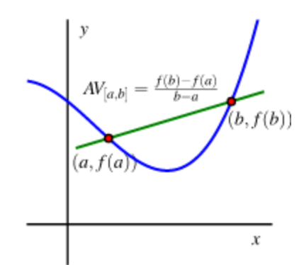{fig-align="center" width="40%"}

::: {.callout-tip title="실생활 응용: 구간 단속 vs 지점 단속"}
{fig-align="center" width="40%"}

- **구간 단속** (평균변화율 응용): 구간 거리 6km를 2분에 통과 → 평균속도 = $\frac{6}{2} = 3\,\text{km/min} = 180\,\text{km/h}$ → 과속
- **지점 단속** (미분 응용): 특정 지점에서의 순간 속도 측정
:::

### 미분의 정의

::: {.callout-note title="미분의 정의"}
함수 $f(x)$의 점 $x = a$에서의 **미분값(도함수값)** $f'(a)$는 다음과 같이 정의된다.

$$f'(a) = \lim_{h \to 0} \frac{f(a+h) - f(a)}{h}$$

$\dfrac{f(a+h)-f(a)}{h}$를 **Fermat's Difference Quotient**라 하며, 평균 변화율을 나타낸다. 극한이 존재하면 $f'(a)$는 $x=a$에서 곡선의 **접선 기울기**이다.
:::

| 개념 | 설명 |
|------|------|
| **미분 가능성** | $f'(a)$가 존재하면 $f(x)$는 $x=a$에서 미분 가능 |
| **기하학적 의미** | $f'(a)$는 곡선 $y=f(x)$의 $x=a$에서의 접선 기울기 |
| **연속성과의 관계** | 미분 가능 → 연속 (역은 성립하지 않음) |

::: {.callout-important title="미분 가능성과 연속성"}
미분 가능하면 반드시 연속이지만, **연속이라고 항상 미분 가능하지는 않다.**

예: $f(x) = |x|$는 $x=0$에서 연속이지만 미분 불가능 ($x=0$에서 뾰족점)
:::

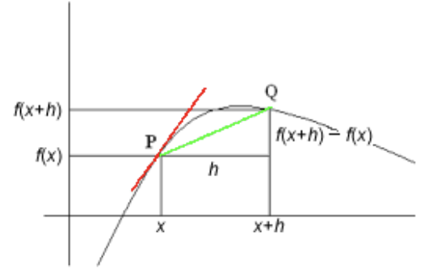{fig-align="center" width="40%"}

### 미분 규칙

| 규칙 | 공식 |
|------|------|
| 상수 | $\dfrac{d}{dx}[c] = 0$ |
| 거듭제곱 | $\dfrac{d}{dx}[x^n] = nx^{n-1}$ |
| 상수배 | $\dfrac{d}{dx}[c\cdot f(x)] = c\cdot f'(x)$ |
| 합/차 | $\dfrac{d}{dx}[f \pm g] = f' \pm g'$ |
| 곱 | $\dfrac{d}{dx}[f\cdot g] = f'g + fg'$ |
| 몫 | $\dfrac{d}{dx}\!\left[\dfrac{f}{g}\right] = \dfrac{f'g - fg'}{g^2},\; g \neq 0$ |
| 로그 | $\dfrac{d}{dx}[\ln x] = \dfrac{1}{x}$, $\;\dfrac{d}{dx}[\log_a x] = \dfrac{1}{x\ln a}$ |
| 지수 | $\dfrac{d}{dx}[e^x] = e^x$, $\;\dfrac{d}{dx}[a^x] = a^x \ln a$ |
| **체인룰** | $\dfrac{d}{dx}[f(g(x))] = f'(g(x))\cdot g'(x)$ |

::: {.callout-tip title="예제 1. 거듭제곱 미분"}
$f(x) = 2\sqrt{x}$를 미분하시오.

$$f'(x) = 2 \cdot \frac{1}{2} x^{1/2-1} = x^{-1/2} = \frac{1}{\sqrt{x}}$$
:::

::: {.callout-tip title="예제 2. 체인룰 (연쇄법칙)"}
$f(x) = 2\sqrt{3x^2 - 1}$을 미분하시오.

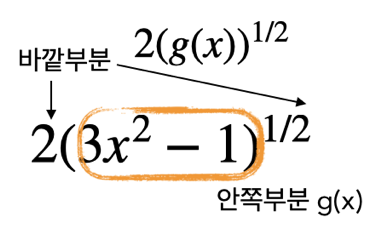{fig-align="center" width="30%"}

바깥 함수를 미분하고, 안쪽 함수를 그대로 유지한 뒤, 안쪽 함수를 미분하여 곱한다.

$$f'(x) = 2 \cdot \frac{1}{2}(3x^2-1)^{-1/2} \cdot 6x = \frac{6x}{\sqrt{3x^2-1}}$$
:::

::: {.callout-tip title="예제 3. 로그 미분 + 체인룰"}
$f(x) = \ln(x^2 - 1)$을 미분하시오.

$$f'(x) = \frac{1}{x^2-1} \cdot 2x = \frac{2x}{x^2-1}$$
:::

```python
import sympy as sp

x = sp.Symbol('x')
f = 5*(x**2 - 2*x)**2

derivative = sp.diff(f, x)
print(derivative)
```

### 미분 응용

#### 최대·최소

::: {.callout-note title="1차 미분 정리 (페르마의 정리)"}
함수 $f(x)$가 구간 $(a,b)$에서 미분 가능하고 점 $c$에서 극값을 가지면:

$$f'(c) = 0$$

단, $f'(c)=0$은 극값의 **필요조건**이지 충분조건은 아니다 (변곡점일 수 있음).
:::

**증가·감소 판단**

| 조건 | 판단 |
|------|------|
| $f'(x) > 0$ | 구간 $I$에서 엄격히 증가 |
| $f'(x) < 0$ | 구간 $I$에서 엄격히 감소 |
| $f'(x) = 0$ | 극값 후보 (추가 검사 필요) |

**오목성 (Concavity)**

| 조건 | 의미 | 형태 |
|------|------|------|
| $f''(x) > 0$ | Concave up (위로 볼록) | ∪ |
| $f''(x) < 0$ | Concave down (아래로 볼록) | ∩ |
| $f''(x)$ 부호 변화 | **변곡점** | 오목성 전환점 |

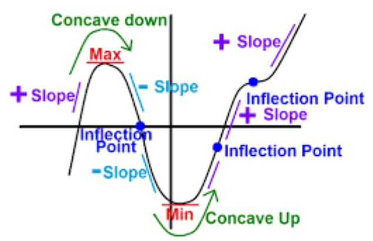{fig-align="center" width="40%"}

::: {.callout-note title="2차 미분 테스트 (극값 판정)"}
$f'(c) = 0$일 때:

- $f''(c) > 0$ → $x=c$에서 **극솟값**
- $f''(c) < 0$ → $x=c$에서 **극댓값**
- $f''(c) = 0$ → 판정 불가 (고차 미분 또는 부호 변화 확인)
:::

#### 통계학 응용: OLS 추정

**단순 회귀모형**

$$y_i = \beta_0 + \beta_1 x_i + \varepsilon_i, \quad i=1,2,\ldots,n$$

잔차제곱합 $S(\beta_0, \beta_1) = \sum_{i=1}^{n}(y_i - \beta_0 - \beta_1 x_i)^2$을 최소화한다.

**정규방정식** (편미분 = 0)

$$\frac{\partial S}{\partial \beta_0} = -2\sum_{i=1}^{n}(y_i - \beta_0 - \beta_1 x_i) = 0$$

$$\frac{\partial S}{\partial \beta_1} = -2\sum_{i=1}^{n}x_i(y_i - \beta_0 - \beta_1 x_i) = 0$$

**OLS 추정치**

$$\hat{\beta}_1 = \frac{\sum_{i=1}^{n}(x_i - \bar{x})(y_i - \bar{y})}{\sum_{i=1}^{n}(x_i - \bar{x})^2} = \frac{\text{Cov}(x,y)}{\text{Var}(x)}, \qquad \hat{\beta}_0 = \bar{y} - \hat{\beta}_1\bar{x}$$

```python
import numpy as np
import matplotlib.pyplot as plt
from scipy.optimize import curve_fit

np.random.seed(0)
x_data = np.linspace(-5, 5, 20)
y_data = 2*x_data**3 - 3*x_data**2 + 4*x_data + 10 + np.random.normal(0, 10, 20)

def linear(x, a, b):    return a*x + b
def quadratic(x, a, b, c):  return a*x**2 + b*x + c
def cubic(x, a, b, c, d):   return a*x**3 + b*x**2 + c*x + d

params_l, _ = curve_fit(linear,    x_data, y_data)
params_q, _ = curve_fit(quadratic, x_data, y_data)
params_c, _ = curve_fit(cubic,     x_data, y_data)

rss_l = np.sum((y_data - linear(x_data,    *params_l))**2)
rss_q = np.sum((y_data - quadratic(x_data, *params_q))**2)
rss_c = np.sum((y_data - cubic(x_data,     *params_c))**2)

plt.figure(figsize=(10, 6))
plt.scatter(x_data, y_data, label='data', color='black')
plt.plot(x_data, linear(x_data, *params_l),
         label=f'Linear (RSS={rss_l:.1f})', color='blue')
plt.plot(x_data, quadratic(x_data, *params_q),
         label=f'Quadratic (RSS={rss_q:.1f})', color='green')
plt.plot(x_data, cubic(x_data, *params_c),
         label=f'Cubic (RSS={rss_c:.1f})', color='red')
plt.title('Curve Fitting by OLS')
plt.xlabel('x'); plt.ylabel('y')
plt.legend(); plt.grid(); plt.show()
```

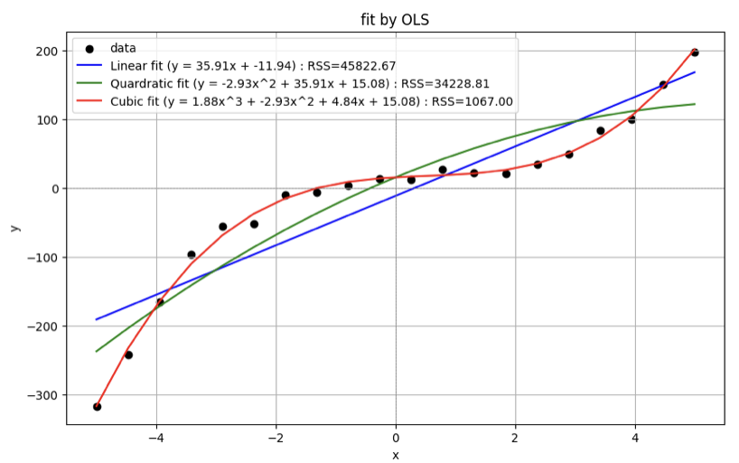{fig-align="center"}

#### 한계효용체감의 법칙

한계효용(marginal utility)은 재화 1단위 추가 소비 시 증가하는 총효용의 변화분이다. 인간은 가장 시급한 욕구부터 충족하는 특성 때문에, 소비량이 늘수록 한계효용은 감소한다.

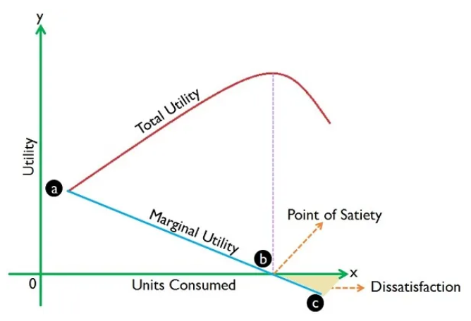{fig-align="center" width="40%"}

| 개념 | 설명 |
|------|------|
| 총효용 (Total Utility) | 특정 기간 동안 소비로 얻은 총 만족도 |
| 한계효용 (Marginal Utility) | 마지막 1단위 추가 소비로 인한 총효용의 변화 |
| 포화점 (Satiety Point) | 한계효용 = 0인 지점; 총효용이 최대 |
| 한계효용 음수 구간 | 포화점 이후 추가 소비 시 총효용 감소 |

#### Cobb-Douglas 생산함수

$$Q = f(K, L) = A L^{\alpha} K^{\beta}$$

$Q$: 생산량, $K$: 자본, $L$: 노동, $A, \alpha, \beta$: 모수

양변에 로그를 취하면:

$$\ln Q = \ln A + \alpha \ln L + \beta \ln K$$

- $\dfrac{\partial \ln Q}{\partial L} = \alpha$: 노동의 생산탄력성 (한계 노동 생산량)
- $\dfrac{\partial \ln Q}{\partial K} = \beta$: 자본의 생산탄력성 (한계 자본 생산량)

---

## 적분

고대 수학자들은 직선 도형의 면적은 쉽게 계산했지만, 곡선 아래의 면적은 큰 도전이었다. 아르키메데스는 곡선을 작은 직사각형으로 분할하여 근사하는 방법을 처음 탐구했다. 이후 뉴턴과 라이프니츠가 미적분학의 기본정리를 정립하면서 **미분과 적분이 서로 역연산** 관계임을 밝혔다.

통계학에서 적분은 확률 계산, 기댓값, 분산, 베이지안 추론의 기초이며, 머신러닝과 데이터 분석 실무에서도 광범위하게 활용된다.

### 부정적분 (Indefinite Integral)

::: {.callout-note title="원시함수와 부정적분"}
$F'(x) = f(x)$를 만족하는 $F(x)$를 $f(x)$의 **원시함수(anti-derivative)** 또는 **부정적분**이라 한다.

$$\int f(x)\,dx = F(x) + C$$

$C$는 적분상수이며, 임의의 상수를 가질 수 있다.
:::

**미적분학의 기본정리**

적분과 미분은 역연산이다.

$$F(x) = \int_a^x f(t)\,dt \implies \frac{d}{dx}F(x) = f(x)$$

### 정적분 (Definite Integral)

#### 정적분의 개념

구간 $[a, b]$를 $n$등분하여 각 소구간에서 직사각형 면적을 합산한 **리만합(Riemann sum)**의 극한이 정적분이다.

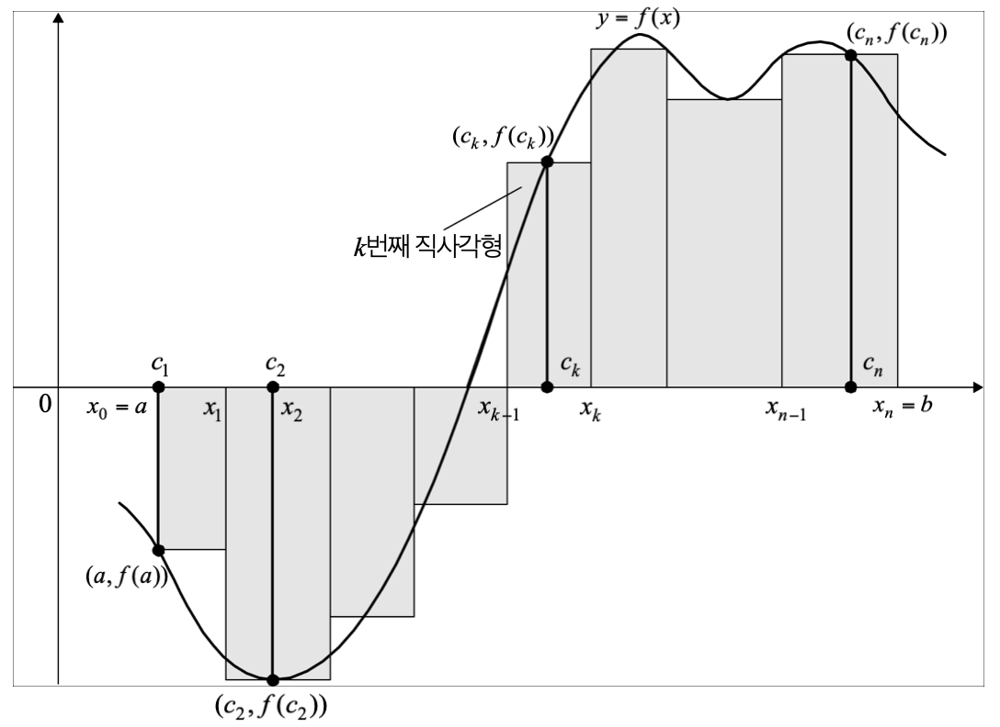{fig-align="center" width="60%"}

$$\int_a^b f(x)\,dx = \lim_{n \to \infty} \sum_{i=1}^{n} f(x_i^*)\,\Delta x$$

#### 뉴턴-라이프니츠 정리

::: {.callout-important title="미적분학의 기본정리 (Newton-Leibniz)"}
$f(x)$가 $[a,b]$에서 연속이고 $F'(x) = f(x)$이면:

$$\int_a^b f(x)\,dx = F(b) - F(a) = \Big[F(x)\Big]_a^b$$
:::

#### 정적분 규칙

| 규칙 | 공식 | 비고 |
|------|------|------|
| 점 적분 | $\int_a^a f(x)\,dx = 0$ | 연속 확률변수에서 점 확률 = 0 |
| 구간 반전 | $\int_a^b f\,dx = -\int_b^a f\,dx$ | 방향을 바꾸면 부호 반전 |
| 상수배 | $\int_a^b c\cdot f\,dx = c\int_a^b f\,dx$ | 상수는 밖으로 꺼냄 |
| 합/차 | $\int_a^b (f \pm g)\,dx = \int_a^b f\,dx \pm \int_a^b g\,dx$ | 분배법칙 |
| 구간 분할 | $\int_a^b f\,dx = \int_a^c f\,dx + \int_c^b f\,dx$ | 구간을 나눠 계산 |
| 비음수 함수 | $f(x) \geq 0 \implies \int_a^b f\,dx \geq 0$ | 확률은 항상 ≥ 0 |
| PDF 조건 | $\int_{-\infty}^{\infty} f(x)\,dx = 1$ | 확률의 총합 = 1 |

**주요 함수의 적분 공식**

| 함수 | 적분 |
|------|------|
| $x^n\; (n \neq -1)$ | $\dfrac{x^{n+1}}{n+1} + C$ |
| $\dfrac{1}{x}$ | $\ln|x| + C$ |
| $e^x$ | $e^x + C$ |
| $a^x$ | $\dfrac{a^x}{\ln a} + C$ |
| $\ln x$ | $x\ln x - x + C$ |
| $\log_a x$ | $\dfrac{x\ln x - x}{\ln a} + C$ |

**치환적분 (Substitution)**

$u = g(x)$으로 치환하면 $du = g'(x)\,dx$:

$$\int f(g(x))\cdot g'(x)\,dx = \int f(u)\,du$$

::: {.callout-tip title="예제: 치환적분"}
$\displaystyle\int x\,e^{x^2}dx$를 구하시오.

$u = x^2$으로 치환 → $du = 2x\,dx$ → $x\,dx = \dfrac{1}{2}du$

$$\int x\,e^{x^2}dx = \int e^u \cdot \frac{1}{2}\,du = \frac{1}{2}e^u + C = \frac{1}{2}e^{x^2} + C$$
:::

**부분적분 (Integration by Parts)**

$$\int u\,dv = uv - \int v\,du$$

::: {.callout-tip title="예제: 부분적분"}
$\displaystyle\int x e^x dx$를 구하시오.

$u = x$, $dv = e^x dx$ → $du = dx$, $v = e^x$

$$\int x e^x dx = xe^x - \int e^x dx = xe^x - e^x + C$$
:::

::: {.callout-tip title="예제: 정적분 계산"}
$\displaystyle\int_0^1 \left(x^2 + \sqrt{x}\right)dx$를 구하시오.

$$F(x) = \frac{x^3}{3} + \frac{2}{3}x^{3/2}$$

$$\int_0^1 \left(x^2 + \sqrt{x}\right)dx = \Big[F(x)\Big]_0^1 = F(1) - F(0) = \frac{1}{3} + \frac{2}{3} = 1$$
:::

```python
# 부정적분
from sympy import *
x = Symbol('x')
integrate(x**2 + x**0.5, x)
# → x**3/3 + 0.667*x**1.5

# 정적분
from scipy.integrate import quad
quad(lambda x: x**2 + x**0.5, 0, 1)
# → (1.0, 1.11e-15)  첫 번째: 적분값, 두 번째: 수치 오차
```

#### 표 적분 (Tabular Integration)

부분적분을 반복 적용할 때 표로 정리하면 계산이 용이하다.

- **$u$**: 미분하면 차수가 줄어드는 함수 (다항식 등)
- **$dv$**: 반복 적분이 가능한 함수 ($e^x$, $\sin x$ 등)

$$\int u\,dv = (u)(v_1) - (u')(v_2) + (u'')(v_3) - \cdots \Big|_a^b$$

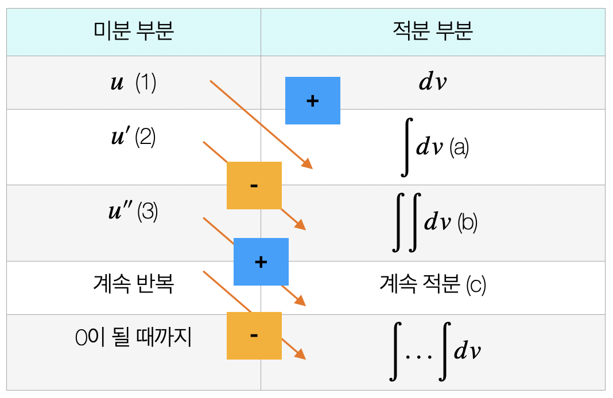{fig-align="center" width="60%"}

::: {.callout-tip title="예제: $\int_0^\infty xe^{-x}dx$"}
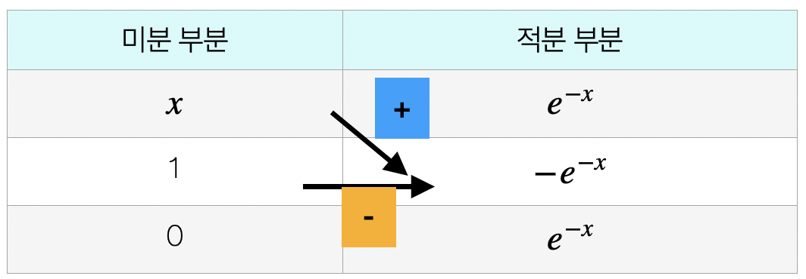{fig-align="center" width="60%"}

$$\Big[x(-e^{-x}) - (-e^{-x})\Big]_0^\infty = \Big[-xe^{-x} - e^{-x}\Big]_0^\infty = 0 - (-1) = 1$$
:::

::: {.callout-tip title="예제: $\int_1^2 \ln x\,dx$"}
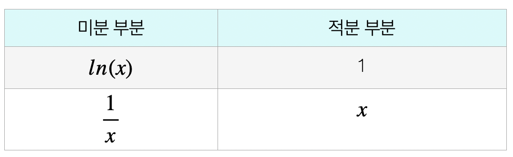{fig-align="center" width="60%"}

$$\Big[\ln(x)\cdot x\Big]_1^2 - \int_1^2 1\,dx = \left(2\ln 2 - \ln 1\right) - \Big[x\Big]_1^2 = 2\ln 2 - 1 \approx 0.386$$
:::

### 적분 응용

**연속형 확률분포**

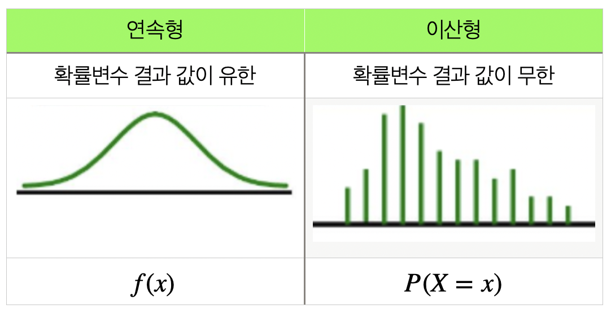{fig-align="center" width="60%"}

$$P(a \leq X \leq b) = \int_a^b f(x)\,dx, \qquad \int_{-\infty}^{\infty} f(x)\,dx = 1$$

::: {.callout-tip title="예제: 표준정규분포"}
$P(-1 \leq Z \leq 1) = \displaystyle\int_{-1}^{1} \phi(z)\,dz$, 단 $\phi(z) = \dfrac{1}{\sqrt{2\pi}}e^{-z^2/2}$

```python
from scipy.integrate import quad
import numpy as np

phi = lambda z: np.exp(-z**2/2) / np.sqrt(2*np.pi)
result, _ = quad(phi, -1, 1)
print(f"P(-1 ≤ Z ≤ 1) ≈ {result:.4f}")   # → 0.6827
```
:::

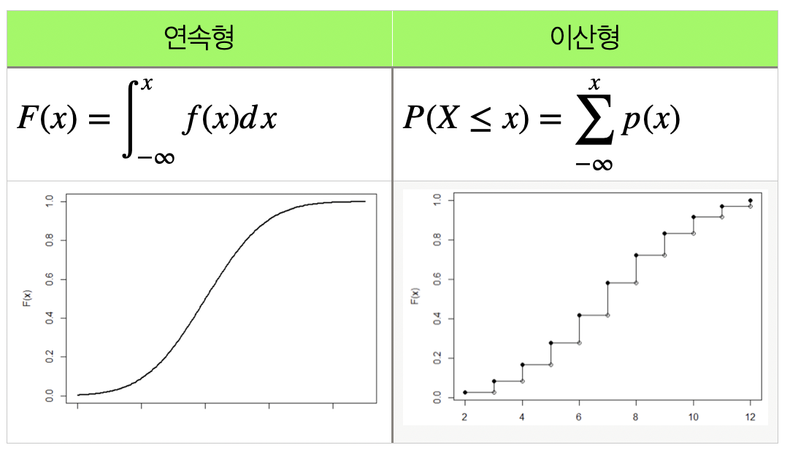{fig-align="center" width="60%"}

| 통계 개념 | 적분 표현 |
|----------|----------|
| 기댓값 | $E(X) = \displaystyle\int_{-\infty}^{\infty} x\,f(x)\,dx$ |
| 분산 | $\text{Var}(X) = \displaystyle\int_{-\infty}^{\infty} (x-\mu)^2 f(x)\,dx$ |
| CDF | $F(x) = \displaystyle\int_{-\infty}^{x} f(t)\,dt$ |
| $P$번째 백분위 | $F(x_P) = \displaystyle\int_{-\infty}^{x_P} f(x)\,dx = \dfrac{P}{100}$ |
