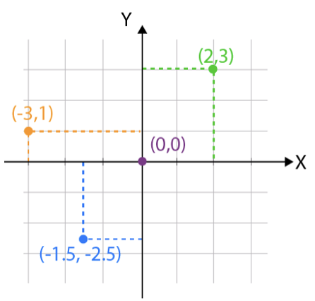
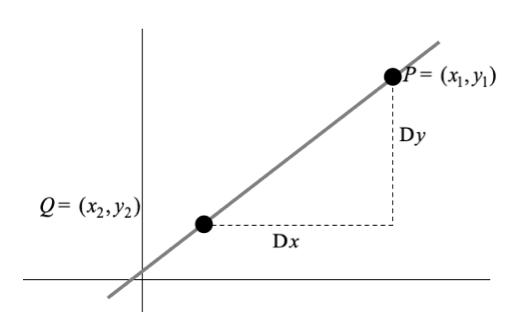
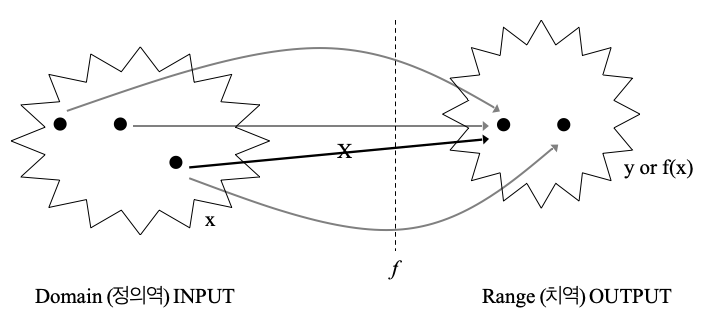
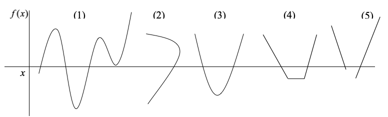

## 기초

### 함수와 통계학

함수는 통계학에서 데이터를 설명하고 모델링하는 핵심 수단이다. 데이터 간의 관계를 수학적으로 표현하고, 확률분포·추정·검정 등 다양한 통계 기법의 기반이 된다.

| 개념 | 표현 | 설명 |
|------|------|------|
| 통계함수 | $y = f(x) + \varepsilon$ | 독립변수 $x$와 종속변수 $y$ 사이의 관계, $\varepsilon$은 오차항 |
| 확률밀도함수 | $p(x)$ | 확률변수의 상대적 발생 가능성을 나타내는 함수 |
| 기댓값 | $E(X) = \sum x\, p(x)$ | 확률변수의 가중평균 (장기 평균값) |

### 함수와 시리즈

시리즈(급수)는 복잡한 함수를 다항식으로 근사하거나, 함수의 특성을 분석하는 데 사용된다.

$$S_{n} = \sum_{k=1}^{n} a_k \qquad S_{\infty} = \sum_{k=1}^{\infty} a_k$$

---

**이항시리즈 (Binomial Series)**

$$(a + b)^{n} = \sum_{k=0}^{n} \binom{n}{k} a^{n-k} b^{k}$$

::: {.callout-tip title="특수한 경우 ($|x| < 1$)"}
$$\frac{1}{1 + x} = 1 - x + x^{2} - x^{3} + \cdots$$

$$\frac{1}{(1 + x)^{2}} = 1 - 2x + 3x^{2} - 4x^{3} + \cdots$$
:::

---

**지수시리즈 (Exponential Series)**

$$e^{x} = 1 + x + \frac{x^{2}}{2!} + \frac{x^{3}}{3!} + \cdots = \lim_{n \to \infty}\left(1 + \frac{x}{n}\right)^{n}$$

$$\ln(1 + x) = x - \frac{x^{2}}{2} + \frac{x^{3}}{3} - \frac{x^{4}}{4} + \cdots, \quad -1 < x \leq 1$$

---

**산술시리즈 (Arithmetic Series)**

$$S_{n} = a + (a + d) + (a + 2d) + \cdots + [a + (n-1)d]$$

- $a$: 첫째 항, $d$: 공차, $n$: 항의 개수

$$S_{n} = \frac{n}{2}[2a + (n-1)d]$$

---

**기하시리즈 (Geometric Series)**

$$S_{n} = a + ar + ar^{2} + \cdots + ar^{n-1} = \frac{a(1 - r^{n})}{1 - r}, \quad r \neq 1$$

- $a$: 첫째 항, $r$: 공비

$$S_{\infty} = \frac{a}{1 - r}, \quad -1 < r < 1$$

### 통계학 주요 상수

| 상수 | 값 | 의미 |
|------|------|------|
| 자연상수 $e$ | $\approx 2.71828\ldots$ | 자연로그의 밑; 정규분포·포아송분포의 핵심 항 |
| $\ln 2$ | $\approx 0.69315\ldots$ | 정보 이론에서 1비트의 정보량 |
| 황금비 $\phi$ | $\approx 1.61803\ldots$ | $\phi = \dfrac{1+\sqrt{5}}{2}$; $a/b = (a+b)/a$ 만족 |
| 오일러 상수 $\gamma$ | $\approx 0.57722\ldots$ | $\gamma = \lim_{n\to\infty}\left(\sum_{k=1}^{n}\dfrac{1}{k} - \ln n\right)$ |

#### 그리스 문자 기호표

| 소문자 | 대문자 | 발음 | 소문자 | 대문자 | 발음 |
|:------:|:------:|------|:------:|:------:|------|
| $\alpha$ | $A$ | alpha | $\nu$ | $N$ | nu |
| $\beta$ | $B$ | beta | $\xi$ | $\Xi$ | xi (ksi) |
| $\gamma$ | $\Gamma$ | gamma | $o$ | $O$ | omicron |
| $\delta$ | $\Delta$ | delta | $\pi$ | $\Pi$ | pi |
| $\varepsilon$ | $E$ | epsilon | $\rho$ | $P$ | rho |
| $\zeta$ | $Z$ | zeta | $\sigma$ | $\Sigma$ | sigma |
| $\eta$ | $H$ | eta | $\tau$ | $T$ | tau |
| $\theta$ | $\Theta$ | theta | $\upsilon$ | $\Upsilon$ | upsilon |
| $\iota$ | $I$ | iota | $\phi$ | $\Phi$ | phi |
| $\kappa$ | $K$ | kappa | $\chi$ | $X$ | chi |
| $\lambda$ | $\Lambda$ | lambda | $\psi$ | $\Psi$ | psi |
| $\mu$ | $M$ | mu | $\omega$ | $\Omega$ | omega |

---

## 좌표와 직선방정식

### 이차원 평면과 데카르트 좌표

{fig-align="center" width="40%"}

이차원 평면에서 모든 점은 두 좌표 $(a, b)$로 표현된다. 수평의 $x$-축과 수직의 $y$-축이 원점에서 직각으로 교차하며, 원점에서 $x$-축 방향으로 $a$, $y$-축 방향으로 $b$만큼 떨어진 점이 $(a, b)$이다.

이 표기법을 **데카르트(Cartesian) 좌표계**라 하며, 점·선·곡선·기하학적 형태를 방정식으로 표현하는 기반이 된다.

### 직선과 증가

#### 증가량 (Increment)

{fig-align="center" width="40%"}

두 점 $(x_1, y_1)$과 $(x_2, y_2)$ 사이의 좌표 변화량을 증가량이라 한다.

$$\Delta x = x_2 - x_1, \qquad \Delta y = y_2 - y_1$$

#### 기울기 (Slope)

$$m = \frac{\Delta y}{\Delta x} = \frac{y_2 - y_1}{x_2 - x_1}, \quad \Delta x \neq 0$$

| 조건 | 의미 |
|------|------|
| $m > 0$ | 오른쪽으로 올라간다 |
| $m < 0$ | 오른쪽으로 내려간다 |
| $m = 0$ | 수평선 |
| $m$ 미정의 ($\Delta x = 0$) | 수직선 |

#### 평행과 수직

- **평행**: $m_1 = m_2$ → 두 직선은 교차하지 않는다.
- **수직**: $m_1 \cdot m_2 = -1$ → 두 직선은 $90°$ 각도로 교차한다.

### 직선 방정식 (Linear Equation)

직선의 일반 형태: $y = bx + a$

- $b$: 기울기 (slope), $a$: $y$절편 (intercept)

| 유형 | 방정식 | 조건 |
|------|--------|------|
| 일반 직선 | $y = bx + a$ | $b \neq 0$ |
| 수평선 | $y = a$ | $b = 0$; $x$-축과 평행 |
| 수직선 | $x = c$ | 기울기 미정의; $y$-축과 평행 |

---

## 함수란?

### 함수 정의

::: {.callout-note title="함수의 정의"}
함수 $f: X \to Y$는 정의역 $X$의 각 원소 $x$에 대해 공역 $Y$의 원소 $y$를 **정확히 하나** 대응시키는 규칙이다.

$$y = f(x)$$

"$y$는 $x$의 함수이다"라고 읽는다.
:::

{fig-align="center" width="60%"}

- **정의역 (domain)**: 함수 $f(x)$가 유효하게 정의되는 모든 입력값 $x$의 집합
- **치역 (range)**: 정의역의 원소를 $f$에 대입했을 때 나오는 출력값 $y$의 집합
- **대응 규칙**: 정의역의 한 $x$값에 치역의 값이 **정확히 하나**여야 한다

::: {.callout-tip title="함수 판별"}
아래 그림에서 (2)번은 동일한 $x$값에 2개의 $y$값이 대응되므로 **함수가 아니다**. 나머지는 모두 함수이다.
:::

{fig-align="center" width="60%"}

### 우함수와 기함수

:::: {.columns}

::: {.column width="50%"}
**우함수 (Even Function)**

$$f(-x) = f(x), \quad \forall x \in \text{정의역}$$

- $y$-축 대칭
- 예: $f(x) = x^2$, $\cos(x)$
:::

::: {.column width="50%"}
**기함수 (Odd Function)**

$$f(-x) = -f(x), \quad \forall x \in \text{정의역}$$

- 원점 대칭
- 예: $f(x) = x^3$, $\sin(x)$
:::

::::

### 함수 종류

#### 합성함수 (Composite Function)

두 함수 $f$와 $g$가 있을 때, $g(x)$의 출력을 $f$의 입력으로 사용하는 새로운 함수이다.

$$(f \circ g)(x) = f(g(x))$$

- $g(x)$: 먼저 적용되는 함수
- $f(x)$: $g(x)$의 출력을 받는 함수
- 정의역: $x \in \text{dom}(g)$ 이고 $g(x) \in \text{dom}(f)$인 집합

::: {.callout-tip title="예제"}
$f(x) = 2x + 1$, $g(x) = x^2$일 때,

$$f(g(x)) = f(x^2) = 2x^2 + 1$$
$$g(f(x)) = g(2x+1) = (2x+1)^2$$

$f \circ g \neq g \circ f$ — 합성 순서가 중요하다.
:::

#### 절대값 함수

$$|x| = \begin{cases} x, & x \geq 0 \\ -x, & x < 0 \end{cases}$$

$|x|$는 수직선 위에서 $x$와 원점 사이의 거리를 나타낸다. 결과는 항상 $\geq 0$이다.

#### 바닥함수 (Floor Function)

$$\lfloor x \rfloor = \text{최대 정수 } n, \quad n \leq x$$

- $\lfloor 2.7 \rfloor = 2$, $\lfloor -1.3 \rfloor = -2$
- $n \leq x < n+1$을 항상 만족

### 함수의 사칙연산

두 함수 $f(x)$, $g(x)$의 연산은 각 점에서 함수값에 대해 수행된다.

| 연산 | 정의 | 정의역 조건 |
|------|------|------------|
| 덧셈/뺄셈 | $(f \pm g)(x) = f(x) \pm g(x)$ | $f$, $g$ 동시 정의 구간 |
| 곱셈 | $(f \cdot g)(x) = f(x) \cdot g(x)$ | $f$, $g$ 동시 정의 구간 |
| 나눗셈 | $\left(\dfrac{f}{g}\right)(x) = \dfrac{f(x)}{g(x)}$ | $f$, $g$ 동시 정의 + $g(x) \neq 0$ |

---

## 함수의 응용 및 극한

### 함수의 통계 응용

| 분야 | 핵심 함수 | 용도 |
|------|----------|------|
| 확률밀도함수 (PDF) | $f(x) \geq 0$, $\int_{-\infty}^{\infty} f(x)\,dx = 1$ | 연속형 확률변수의 분포 |
| 누적분포함수 (CDF) | $F(x) = P(X \leq x) = \int_{-\infty}^{x} f(t)\,dt$ | 확률 계산, 분위수 결정 |
| 회귀모형 | $y = \beta_0 + \beta_1 x + \varepsilon$ | 변수 간 관계 모델링 |
| 생존함수 | $S(t) = P(T > t) = 1 - F(t)$ | 생존 확률 분석 |
| 위험함수 | $h(t) = f(t)/S(t)$ | 순간 사건 발생 위험률 |
| 자기회귀 | $X_t = \phi_1 X_{t-1} + \phi_2 X_{t-2} + \cdots + \varepsilon_t$ | 시계열 예측 |

::: {.callout-note title="정규분포 PDF"}
$$f(x) = \frac{1}{\sqrt{2\pi\sigma^{2}}}\, e^{-\frac{(x-\mu)^{2}}{2\sigma^{2}}}$$

구간 $[a, b]$의 확률: $P(a \leq X \leq b) = \int_{a}^{b} f(x)\,dx$
:::

### 함수의 극한

#### 극한의 정의

$x$가 $a$에 가까워질 때 $f(x)$가 특정 값 $L$에 수렴하면, $\lim_{x \to a} f(x) = L$이라 한다.

::: {.callout-note title="엄밀한 정의 ($\varepsilon$-$\delta$ 정의)"}
$$\forall\,\varepsilon > 0,\; \exists\,\delta > 0 \text{ such that } 0 < |x - a| < \delta \Rightarrow |f(x) - L| < \varepsilon$$

- $\varepsilon$: $f(x)$와 $L$ 사이의 허용 오차
- $\delta$: $x$와 $a$ 사이의 거리 제한
:::

#### 함수값과 극한값

- **함수값** $f(a)$: $x = a$에서 함수가 실제로 갖는 값
- **극한값** $\lim_{x \to a} f(x)$: $x$가 $a$에 가까워질 때 $f(x)$가 향하는 값

> 함수값과 극한값은 달라도 된다. 함수가 $x = a$에서 정의되지 않아도 극한값은 존재할 수 있다.

좌극한과 우극한이 일치할 때 극한이 존재한다:

$$\lim_{x \to a^{-}} f(x) = \lim_{x \to a^{+}} f(x) = L$$

#### 연속함수의 조건

::: {.callout-important title="$f(x)$가 $x = a$에서 연속이려면"}
1. $f(a)$가 정의되어야 한다.
2. $\lim_{x \to a} f(x)$가 존재해야 한다.
3. $\lim_{x \to a} f(x) = f(a)$이어야 한다.
:::

#### 극한 계산 규칙

| 규칙 | 수식 |
|------|------|
| 상수 | $\lim_{x \to a} c = c$ |
| 항등 | $\lim_{x \to a} x = a$ |
| 선형성 | $\lim_{x \to a} [f(x) \pm g(x)] = \lim f(x) \pm \lim g(x)$ |
| 곱셈 | $\lim_{x \to a} [f(x) \cdot g(x)] = \lim f(x) \cdot \lim g(x)$ |
| 나눗셈 | $\lim_{x \to a} \dfrac{f(x)}{g(x)} = \dfrac{\lim f(x)}{\lim g(x)}, \quad \lim g(x) \neq 0$ |
| 거듭제곱 | $\lim_{x \to a} [f(x)]^n = [\lim f(x)]^n$ |
| 루트 | $\lim_{x \to a} \sqrt[n]{f(x)} = \sqrt[n]{\lim f(x)}, \quad \lim f(x) \geq 0$ |

::: {.callout-tip title="L'Hôpital's Rule"}
$f(x)/g(x)$가 $\frac{0}{0}$ 또는 $\frac{\infty}{\infty}$ 형태일 때:

$$\lim_{x \to a}\frac{f(x)}{g(x)} = \lim_{x \to a}\frac{f'(x)}{g'(x)}$$

**예시:**

- $\dfrac{0}{0}$ 형태: $\lim_{x \to 0}\dfrac{\sin x}{x} = \lim_{x \to 0}\dfrac{\cos x}{1} = 1$

- $\dfrac{\infty}{\infty}$ 형태: $\lim_{x \to \infty}\dfrac{x}{e^x} = \lim_{x \to \infty}\dfrac{1}{e^x} = 0$
:::

**무한대에서의 극한**

$$\lim_{x \to \pm\infty}\frac{1}{x} = 0, \qquad \lim_{x \to \pm\infty} c = c$$

분수 형태는 분모의 최고차항으로 나누어 계산한다.

**주요 함수의 극한**

$$\lim_{x \to \infty} e^{-x} = 0, \qquad \lim_{x \to 0}\frac{\sin x}{x} = 1, \qquad \lim_{x \to 0}\frac{1 - \cos x}{x^2} = \frac{1}{2}$$

### 수렴 (Convergence)

::: {.callout-note title="수렴의 정의"}
함수 $f(x)$ 또는 수열 $\{a_n\}$이 특정 값 $L$에 **수렴**한다는 것은, 극한값이 존재하고 그 값에 점점 가까워진다는 의미이다.

- **수열**: $\forall\,\varepsilon > 0$에 대해 $n \geq N$이면 $|a_n - L| < \varepsilon$인 $N$이 존재
- **함수**: $\lim_{x \to a} f(x) = L$
:::

| 개념 | 설명 |
|------|------|
| 극한 | 특정 점에서 함수가 어떻게 **접근**하는지 기술 |
| 수렴 | 극한값이 존재하고 일정 값으로 가까워지는 **성질** |

### 확률수렴과 분포수렴

#### 확률수렴 (Convergence in Probability)

$$\lim_{n \to \infty} P(|X_n - X| \geq \varepsilon) = 0 \quad \Leftrightarrow \quad X_n \overset{P}{\to} X$$

- **해석**: $X_n$과 $X$의 차이가 임의로 작아질 확률이 1로 수렴
- **성질**: 극한값 $X$는 유일; $g$가 연속이면 $g(X_n) \overset{P}{\to} g(X)$
- **통계학 응용**: 추정량의 **일치성** — $\hat{\theta}_n \overset{P}{\to} \theta$

::: {.callout-tip title="큰 수의 약법칙 (Weak Law of Large Numbers)"}
$$\bar{X}_n \overset{P}{\to} \mu$$
:::

#### 분포수렴 (Convergence in Distribution)

$$\lim_{n \to \infty} F_{X_n}(x) = F_X(x) \quad \Leftrightarrow \quad X_n \overset{\mathcal{D}}{\to} X$$

- **해석**: $X_n$의 분포 형태 자체가 $X$의 분포로 수렴 (개별 실현값이 아니라 분포 전체)
- **성질**: $g$가 연속이면 $g(X_n) \overset{\mathcal{D}}{\to} g(X)$

::: {.callout-tip title="중심극한정리 (Central Limit Theorem)"}
$$\sqrt{n}(\bar{X}_n - \mu) \overset{\mathcal{D}}{\to} N(0, \sigma^2)$$
:::

#### 확률수렴과 분포수렴의 관계

::: {.callout-important title="핵심 관계"}
$$X_n \overset{P}{\to} X \implies X_n \overset{\mathcal{D}}{\to} X$$

역은 일반적으로 성립하지 않는다 — 분포수렴이 확률수렴을 보장하지 않는다.
:::
