## 행렬 기초

### 개념

#### 통계학과 행렬

행렬은 통계학에서 데이터를 표현하고 분석하는 데 핵심적인 도구로 사용된다. 행렬은 대규모 데이터의 구조를 간단히 표현하고, 계산을 효율적으로 수행하여 통계학에서 중요한 역할을 한다.

**데이터 표현**: 데이터를 행렬로 저장하여 표 형식으로 표현한다. 다음은 관측값(행)과 변수(열)로 구성된 데이터 행렬이다.

$$X = \begin{bmatrix}
x_{11} & x_{12} & \cdots & x_{1p} \\
x_{21} & x_{22} & \cdots & x_{2p} \\
\vdots & \vdots & \ddots & \vdots \\
x_{n1} & x_{n2} & \cdots & x_{np}
\end{bmatrix}$$

**연산의 간결화**: 여러 변수와 관측값 간의 관계를 분석할 때 행렬식으로 간단히 표현하고 행렬 연산을 이용하여 추정값을 계산한다.

$$Y = X\beta + \epsilon, \qquad \text{OLS 추정} = \hat{\beta} = (X'X)^{-1}X'Y$$

#### 정의

::: {.callout-note}
**행렬 (Matrix)**

행과 열로 배열된 숫자, 기호 또는 표현식의 직사각형 배열을 **행렬**이라 한다. 행의 차수는 $m$, 열의 차수는 $n$이다.

$$A_{m \times n} = \begin{bmatrix}
a_{11} & a_{12} & \cdots & a_{1n} \\
a_{21} & a_{22} & \cdots & a_{2n} \\
\vdots & \vdots & \ddots & \vdots \\
a_{m1} & a_{m2} & \cdots & a_{mn}
\end{bmatrix} \qquad \text{(간편식)} \quad A = \{a_{ij}\}$$
:::

- 행렬의 각 셀을 **원소(element)**라 한다.
- 행의 차수 $m = 1$인 행렬을 **행(row) 벡터**이다.
- 열의 차수 $n = 1$인 행렬을 **열(column) 벡터**이다.
- 행의 차수, 열의 차수 모두 1인 행렬을 **스칼라(scalar)**이다.
- 행렬을 $n$-열벡터로 표현: $A_{m \times n} = \begin{bmatrix} a_1 & a_2 & \cdots & a_n \end{bmatrix}$
- 행렬을 $m$-행벡터로 표현: $A_{m \times n} = \left[\begin{array}{r} a_1 \\ a_2 \\ \vdots \\ a_m \end{array}\right]$

#### 동일 행렬이란

- 행의 차수와 열의 차수가 같다. $A_{m \times n} = B_{m \times n}$
- 대응하는 모든 원소 값은 동일하다. $a_{ij} = b_{ij}$ for all $i, j$

### 특수한 행렬

| 행렬 종류 | 정의 | 기호 |
|----------|------|------|
| **영행렬 (zero matrix)** | 모든 원소가 0 | $O_{m \times n}$ |
| **정방행렬 (square matrix)** | 행차수 = 열차수 | $A_{m \times m} = A_m$ |
| **대각행렬 (diagonal matrix)** | 대각원소 외 모두 0 | $A_{ij} = 0$ for $i \neq j$ |
| **단위행렬 (identity matrix)** | 대각원소=1, 나머지=0 | $I_{ij} = \begin{cases} 1 & i=j \\ 0 & i \neq j \end{cases}$ |
| **상삼각행렬 (upper triangular)** | 대각 아래 원소가 0 | $A_{ij} = 0$ for $i > j$ |
| **하삼각행렬 (lower triangular)** | 대각 위 원소가 0 | $A_{ij} = 0$ for $i < j$ |

**대각행렬 예시:**

$$D = \begin{pmatrix} -1 & 0 \\ 0 & 7 \end{pmatrix}, \qquad tr(D) = -1 + 7 = 6$$

**단위행렬 확장 예시:**

$$A = \begin{bmatrix} 1 & 2 & 3 \\ 3 & 4 & 5 \end{bmatrix} \implies \begin{bmatrix} I & A \\ 0 & I \end{bmatrix} = \begin{bmatrix} 1 & 0 & 1 & 2 & 3 \\ 0 & 1 & 3 & 4 & 5 \\ 0 & 0 & 1 & 0 & 0 \\ 0 & 0 & 0 & 1 & 0 \\ 0 & 0 & 0 & 0 & 1 \end{bmatrix}$$

**희소행렬 (Sparse matrix)**: 행렬 원소의 대부분이 0인 행렬이다. $nnz(A)$은 행렬 $A_{m \times n}$에서 0이 아닌 원소의 개수를 나타내며 $nnz(A)/(m \times n)$을 행렬의 밀도라 정의한다.

수학자 James H. Wilkinson의 정의: "행렬이 충분히 많은 0 원소를 포함하고 있어 이를 활용하는 것이 유리한 경우, 그 행렬을 희소 행렬이라 한다." 희소행렬은 컴퓨터에서 효율적으로 저장하고 조작할 수 있다.

영행렬 > 단위행렬 > 대각행렬 > 삼각행렬 : 대표적인 희소행렬

### 행렬 놈

::: {.callout-note}
**행렬 놈 (Matrix Norm)**

모든 원소의 제곱합의 양의 제곱근:

$$\|A\| = \sqrt{\sum_{i=1}^{m}\sum_{j=1}^{n} a_{ij}^2}$$

행렬의 평균제곱근: $RMS(A) = \dfrac{\|A\|}{\sqrt{mn}}$
:::

**성질**

| 성질 | 수식 |
|------|------|
| 비음수 | $\|A\| \geq 0$ |
| 스칼라 곱 | $\|cA\| = |c| \|A\|$ |
| 삼각 부등식 | $\|A + B\| \leq \|A\| + \|B\|$ |
| 거리 | $\|A - B\|$: 두 행렬의 유사성(거리) |
| 전치 불변 | $\|A\| = \|A^T\|$ |

### 전치

전치(transpose)는 행과 열을 서로 바꾸는 연산: $(A^T)_{ij} = A_{ji}$

| 성질 | 수식 |
|------|------|
| 이중 전치 | $(A^T)^T = A$ |
| 합의 전치 | $(A + B)^T = A^T + B^T$ |
| 스칼라 곱 전치 | $(cA)^T = cA^T$ |
| 곱의 전치 | $(AB)^T = B^T A^T$ |

원행렬과 전치행렬이 동일한 행렬을 **대칭행렬**이라 한다. $A = A^T$

---

## 행렬 연산

### 행렬 합 연산

행렬의 합은 두 행렬의 차수가 동일해야 하며(conformable for addition), 각 행렬에서 대응하는 원소들의 합을 그 위치에 적으면 된다.

$$(A + B)_{m \times n} = \{a_{ij} + b_{ij}\}$$

::: {.callout-tip}
**【예제】**

$$\begin{bmatrix} 1 & 3 & 5 \\ 7 & 3 & 1 \end{bmatrix} + \begin{bmatrix} 1 & 0 & 1 \\ -1 & 1 & 0 \end{bmatrix} = \begin{bmatrix} 2 & 3 & 6 \\ 6 & 4 & 1 \end{bmatrix}$$
:::

**성질**

| 성질 | 수식 |
|------|------|
| 교환법칙 | $A + B = B + A$ |
| 결합법칙 | $A + (B + C) = (A + B) + C$ |
| 영행렬과 합 | $A + O = O + A = A$ |
| 합의 전치 | $(A + B)^T = A^T + B^T$ |

### 스칼라-행렬 곱

행렬 모든 원소에 스칼라를 곱하며, 결과는 원행렬과 동일한 차수의 행렬이다. $cA = \{ca_{ij}\} = Ac$

| 성질 | 수식 |
|------|------|
| 전치 | $(cA)^T = cA^T$ |
| 배분법칙 | $(c + d)A = cA + dA$ |

### 행렬×벡터 곱

::: {.callout-note}
**행렬×벡터 곱**

행렬 $A_{m \times n}$와 열벡터 $x_{n \times 1}$ 곱 연산의 결과는 열벡터 $y_{m \times 1} = A_{m \times n}x_{n \times 1}$이며 차수는 $m$이다.

- **연산 가능 조건**: 앞 행렬의 열차수와 뒤 벡터의 행차수가 동일해야 한다.
:::

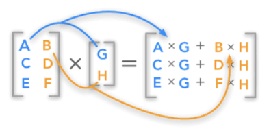{fig-align="center" width="40%"}

:::: {.columns}
::: {.column width="50%"}
**행 측면**

$A$의 $i$-번째 행벡터를 $a_i^T$라 하면:
$$y_i = a_i^T x \quad \text{(내적)}$$
:::
::: {.column width="50%"}
**열 측면**

$A$의 $k$-번째 열벡터를 $a_k$라 하면:
$$y = x_1 a_1 + x_2 a_2 + \cdots + x_n a_n$$
:::
::::

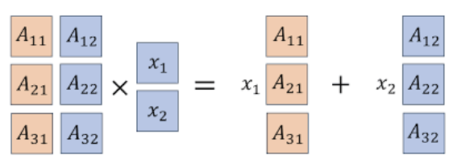{fig-align="center" width="40%"}

**행렬 $A$의 열벡터 선형독립**: 만약 $x = 0$인 경우에만 $Ax = 0$이 성립하면, 열벡터는 선형독립이다.

**활용**

| 활용 | 설명 |
|------|------|
| $A$가 영행렬 | $Ax = \mathbf{0}$ |
| $A$가 단위행렬 | $Ax = x$ |
| $j$-번째 열벡터 | $Ae_j = a_j$ |
| $i$-번째 행벡터 | $(A^T e_i)^T$ |

**예제**

- (예측데이터 행렬) Feature matrix $X_{N \times n}$는 $N$개의 객체에 대한 특성 $n$-벡터, 객체들에 대한 가중치 $w$-벡터(차수 $N$)라 하면 $X^T w$는 객체들에 대한 가중 점수 벡터이다.
- (포트폴리오) 포트폴리오 자산 수익률 행렬 $R_{T \times n}$($T$ 기간 동안 $n$개의 자산 수익률)이라 하고 $w$를 포트폴리오 $n$-벡터라 하면 $Rw$는 $T$기간 포트폴리오 수익률이다.
- (문서 점수화) $A$는 $N \times n$ 문서-단어 행렬, $w$는 단어 가중치 $n$-벡터이면 $Aw$는 각 문서의 점수 $N$-벡터이다.

### 행렬×행렬 곱

#### 정의

::: {.callout-note}
**행렬 곱 (Matrix Product)**

앞 행렬의 열차수와 뒤 행렬의 행차수가 일치해야 곱이 가능하다(conformable for product). 결과의 차수는 앞 행렬의 행차수, 뒤 행렬의 열차수를 갖는다.

$$A_{m \times n} B_{n \times p} = (AB)_{m \times p}, \qquad (AB)_{ij} = \sum_{k=1}^n a_{ik} b_{kj}$$
:::

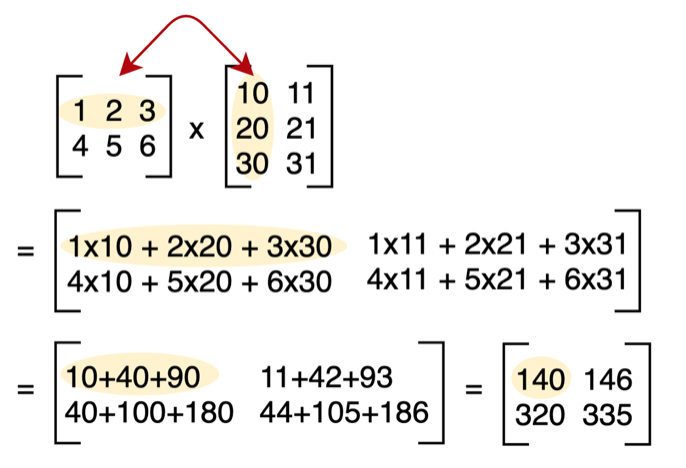{fig-align="center" width="40%"}

#### 곱의 성질

| 성질 | 수식 |
|------|------|
| 결합법칙 | $(AB)C = A(BC)$ |
| 배분법칙 | $A(B + C) = AB + AC$ |
| 전치 | $(AB)^T = B^T A^T$ |
| 전개 | $(A + B)(C + D) = AC + AD + BC + BD$ |
| 내적 | $y^T(Ax) = (y^T A)x = (A^T y)^T x$ |

#### 행렬의 거듭제곱

$$A^2 = AA, \quad A^3 = AAA, \quad A^4 = AAAA, \quad \cdots$$

**directed graph**: 인접(adjacency) 행렬 $A_{ij}$를 다음과 같이 정의하자.

$$A_{ij} = \begin{cases} 1 & \text{there is an edge from vertex } j \text{ to vertex } i \\ 0 & \text{otherwise} \end{cases}$$

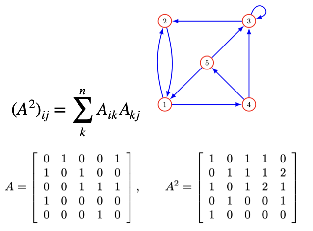{fig-align="center" width="40%"}

#### 멱등행렬 (Idempotent Matrix)

자신의 행렬 곱이 자신이 되는 행렬을 멱등행렬이라 한다. $M^2 = M^3 = \cdots = M$. 자신의 곱이 연산 가능해야 하므로 멱등행렬이려면 정방행렬이어야 한다.

### QR 분해

Q는 직교정규행렬, R은 상삼각행렬

#### 직교정규행렬 (Orthonormal Matrix)

::: {.callout-note}
**직교정규행렬**

열벡터 $A_{m \times n}$의 $n$-벡터 $a_1, a_2, \ldots, a_m$들이 orthonormal하면, 즉 $A^T A = I$를 만족하는 행렬을 **직교정규행렬**이라 한다.

만약 $A_{m \times n}$가 직교정규행렬, $x, y$는 $n$-벡터라 하면:

| 성질 | 수식 |
|------|------|
| 놈 보존 | $\|Ax\| = \|x\|$ |
| 내적 보존 | $(Ax)^T(Ay) = x^T y$ |
| 각도 보존 | $\angle(Ax, Ay) = \angle(x, y)$ |
:::

**【recall】 Gram-Schmidt 알고리즘**

만약 벡터들이 선형독립이라면, Gram-Schmidt 알고리즘은 직교정규 벡터 $q_1, q_2, \ldots, q_k$를 생성한다.

#### QR 분해 $A = QR$

행렬 $A_{n \times k}$의 $n$-벡터 $a_1, a_2, \ldots, a_k$가 선형독립인 경우, Gram-Schmidt 알고리즘을 적용하여 얻은 직교정규 벡터 $q_1, q_2, \ldots, q_k$로 직교정규 행렬 $Q$를 생성하면 $Q^T Q = I$이다.

$a_i$와 $q_i$의 관계식:

$$a_i = (q_1^T a_i)q_1 + \cdots + (q_{i-1}^T a_i)q_{i-1} + \|\tilde{q}_i\| q_i$$

이를 다시 쓰면 $a_i = R_{1i}q_1 + R_{2i}q_2 + \cdots + R_{ii}q_i$이다.

$$R_{ij} = q_i^T a_j \text{ for } i < j, \qquad R_{ij} = 0 \text{ for } i > j, \qquad R_{ii} = \|\tilde{q}_i\|$$

그러므로 $A_{n \times k}$(열이 독립인 행렬)은 직교정규 행렬 $Q_{n \times k}$과 상삼각행렬 $R_{k \times k}$로 분해된다.

#### QR 분해 활용

| 활용 | 설명 |
|------|------|
| **선형 시스템 해** | $A = QR$ 분해 후 $Rx = Q^T b$를 후진 대입으로 풀기 |
| **최소자승 문제** | $\hat{x} = R^{-1} Q^T b$ |
| **고유값 계산** | QR 알고리즘으로 상삼각 변환 후 고유값 추출 |
| **행렬 특성 분석** | 계수(rank) 결정, 정칙 여부 파악 |

```python
import numpy as np
A = np.array([[1, 1], [1, -1], [1, 1]])
Q, R = np.linalg.qr(A)
print("Q:"); print(Q)
print("\nR:"); print(R)
```
【결과】
Q:
[[-0.57735027  0.40824829]
 [-0.57735027 -0.81649658]
 [-0.57735027  0.40824829]]

R:
[[-1.73205081 -0.57735027]
 [ 0.          1.63299316]]

### 역행렬

#### 왼쪽·오른쪽 역행렬

::: {.callout-note}
**역행렬 존재 조건**

- **left-invertible**: $XA = I$를 만족하는 $X$가 존재하면 $A$는 left-invertible이다.
- **right-invertible**: $AX = I$를 만족하는 $X$가 존재하면 $A$는 right-invertible이다.

**left-invertible ↔ 열벡터 선형독립**: $A$가 left-inverse 행렬 $C$를 가지면 $A$의 열벡터는 선형독립이다.
:::

**【증명】** $Ax = 0 \Rightarrow 0 = C(Ax) = Ix = x$, 즉 $x = 0$이므로 선형독립.

**연립방정식 해:**

:::: {.columns}
::: {.column width="50%"}
**Left-invertible** $C$ 이용:

$$x_n = C_{n \times n} b_n$$
:::
::: {.column width="50%"}
**Right-invertible** $B$ 이용:

$x = Bb$. 【증명】 $Ax = A(Bb) = (AB)b = b$
:::
::::

**left, right invertible 관계**: $A$의 right inverse $B$가 있으면 $B^T$는 $A^T$의 left inverse이다.

【증명】 $AB = I \Rightarrow (AB)^T = I^T \Rightarrow B^T A^T = I$

#### 역행렬 구하기

::: {.callout-note}
**역행렬 (Inverse Matrix)**

행렬 $A$에 무엇을 곱하면 항등행렬 $I$가 될까? 이를 **역행렬**이라 한다.

$$AA^{-1} = A^{-1}A = I, \qquad A^{-1} = \frac{1}{|A|} adj(A)$$
:::

**행렬식(determinant)**: 정방행렬에서만 계산되며 결과는 스칼라이다. 기호: $det(A)$ 또는 $|A|$

$$A_{2 \times 2} = \begin{bmatrix} a & b \\ c & d \end{bmatrix} \implies det(A) = ad - bc$$

::: {.callout-tip}
**【예제】** $A = \begin{bmatrix} 1 & 3 \\ 2 & 4 \end{bmatrix}$, $|A| = 4 - 6 = -2$
:::

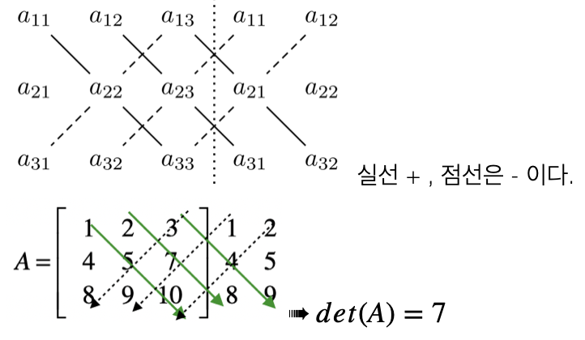{fig-align="center" width="60%"}

**행렬식 성질**

| 성질 | 수식 |
|------|------|
| 전치 불변 | $|A^T| = |A|$ |
| 순서 무관 | $|AB| = |BA|$ |
| 곱의 행렬식 | $|AB| = |A||B|$ |
| 열 연산 | 한 열에 $k$배 후 다른 열에 더해도 행렬식 불변 |
| 선형종속 | 한 열이 다른 열의 선형결합이면 행렬식 = 0 |

**소행렬(minor)**: $i$행, $j$열을 제외한 행렬을 소행렬 $M_{ij}$, 소행렬의 행렬식을 소행렬식 $|M_{ij}|$라 한다.

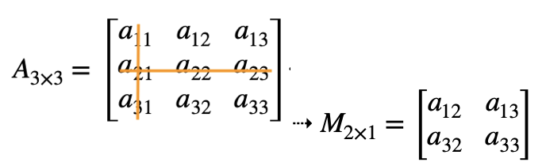{fig-align="center" width="60%"}

**여인수(cofactor)**: $C_{ij} = (-1)^{i+j}|M_{ij}|$

$$|A_{n \times n}| = \sum_{i=1}^n a_{ij}(-1)^{i+j}|M_{ij}| = \sum_{j=1}^n a_{ij}(-1)^{i+j}|M_{ij}|$$

**수반행렬(adjoint)**:

$$C_{ij} = \begin{bmatrix} C_{11} & C_{12} & C_{13} \\ C_{21} & C_{22} & C_{23} \\ C_{31} & C_{32} & C_{33} \end{bmatrix} \implies adj(A) = \begin{bmatrix} C_{11} & C_{21} & C_{31} \\ C_{12} & C_{22} & C_{32} \\ C_{13} & C_{23} & C_{33} \end{bmatrix}$$

**역행렬 성질**

| 성질 | 수식 |
|------|------|
| 유일성 | $(A^{-1})^{-1} = A$ |
| 곱의 역행렬 | $(AB)^{-1} = B^{-1}A^{-1}$ |
| 전치의 역행렬 | $(A^T)^{-1} = (A^{-1})^T$ |
| 행렬식 | $|A^{-1}| = \frac{1}{|A|}$ |

**계수(rank)**: 행렬 $A_{n \times n}$에서 선형독립인 행의 개수와 열의 개수 중 작은 것을 행렬의 계수라 한다. 행렬의 차수와 계수가 동일하면 **full-rank**라 한다.

::: {.callout-important}
**역행렬 존재 조건 정리**

| 역행렬 $A^{-1}$ 존재 | 역행렬 $A^{-1}$ 不존재 |
|---------------------|----------------------|
| 행렬식 ≠ 0: $det(A) \neq 0$ | 행렬식 = 0: $det(A) = 0$ |
| full rank: $rank(A) = n$ | not full rank: $rank(A) < n$ |
| non-singular | singular |
| $AX = \mathbf{b}$ 해 존재 | $AX = \mathbf{b}$ 해 없음 |
:::

---

## 행렬 활용

### 연립방정식 해 구하기 $Ax = b$

:::: {.columns}
::: {.column width="50%"}
**① QR 분해 이용**

1. $A = QR$로 분해
2. $Q^T b$ 계산
3. $Rx = Q^T b$를 후진 제거로 풀기
:::
::: {.column width="50%"}
**② 역행렬 계산 $A^{-1}$**

행렬 $A$의 역행렬을 이용하여 해를 구한다.

$$\hat{x} = A^{-1}b$$
:::
::::

### 최소자승법 $Ax = b$

#### 최소자승 문제

$A_{m \times n}x_n = b_m$ (단 $m > n$)에서 방정식이 변수보다 많으므로 일반적으로 해가 없다. 잔차 $r = Ax - b$를 최소화하는 $x$를 찾는 것을 **최소자승법**이라 한다.

$$\text{minimize} \quad \|Ax - b\|$$

::: {.callout-tip}
**【예제】** 방정식 3개, 미지수 2개

$2x_1 = 1, \; -x_1 + x_2 = 0, \; 2x_2 = -1$

$$Ax = b: \quad \begin{bmatrix} 2 & 0 \\ -1 & 1 \\ 0 & 2 \end{bmatrix}\begin{bmatrix} x_1 \\ x_2 \end{bmatrix} = \begin{bmatrix} 1 \\ 0 \\ -1 \end{bmatrix}$$
:::

#### 최소자승 해 구하기

::: {.callout-note}
**최소자승 해 (Least Squares Solution)**

$\text{minimize} \; f(x) = \|Ax - b\|^2$의 해 $\hat{x}$는 $\nabla f(x) = 2A^T(Ax - b) = 0$에서:

$$\hat{x} = (A^T A)^{-1} A^T b$$

**QR 분해 이용**: $A = QR$이면 $\hat{x} = R^{-1}Q^T b$, $\; RMS = \sqrt{\|b - A\hat{x}\|^2}$
:::

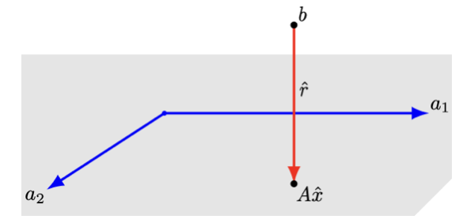{fig-align="center" width="40%"}

**매출 광고 사례**

행은 사회인구학적 특성 10개, 열은 3개 광고 채널이고 $R_{ij}$는 $i$-사회인구학적특성의 $j$-광고채널의 1달러당 노출횟수(단위: 1000)이다.

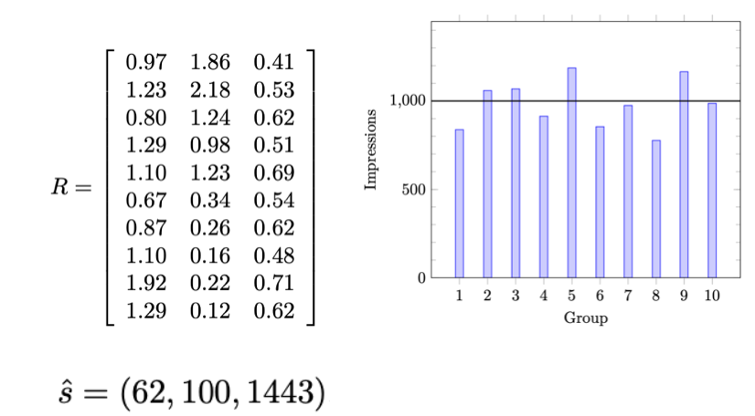{fig-align="center" width="40%"}

$R_{10 \times 3}x_3 = 10^3 \mathbf{1}_3$에 대한 최소자승해는 $\hat{x} = (62, 100, 1443)$으로 각 채널당 광고비이다. $RMS = 13.2\%$이다.

#### 최소자승 데이터 적합

$n$-벡터 $x$(feature 벡터, 독립변수), 스칼라 $y$는 다음 근사 함수 관계가 있다고 하자: $y \approx \hat{f}(x)$

$\hat{f}(x)$는 파라미터 $p$-벡터 $\theta$의 선형 함수이다.

$$\hat{f}(x) = \theta_1 f_1(x) + \theta_2 f_2(x) + \cdots + \theta_p f_p(x)$$

**최소자승 모델 적합** ($i = 1, 2, \ldots, N$; $j = 1, 2, \ldots, p$)

$$\hat{y}^{(i)} = A_{i1}\theta_1 + A_{i2}\theta_2 + \cdots + A_{ip}\theta_p, \quad \text{where} \quad A_{ij} = \hat{f}_j(x^{(i)})$$

$\hat{y}^d = A\theta$이므로 $\|r^d\|^2 = \|y^d - A\theta\|^2$이다.

$$\hat{\theta} = (A^T A)^{-1} A^T y^d$$

#### 다항식 적합

**모형**: $\hat{f}(x) = \theta_1 + \theta_2 x + \cdots + \theta_p x^{p-1}$

$$A = \begin{bmatrix}
1 & x^{(1)} & \cdots & (x^{(1)})^{p-1} \\
1 & x^{(2)} & \cdots & (x^{(2)})^{p-1} \\
\vdots & & & \vdots \\
1 & x^{(N)} & \cdots & (x^{(N)})^{p-1}
\end{bmatrix}$$

**Piecewise-Linear Fit (분절선형 적합)**

1. 절단점 식별: 선의 기울기가 변하는 지점을 결정한다.
2. 선형 구간 적합: 절단점으로 분리된 각 데이터 구간에 선형 모델을 적합한다.
3. 구간 결합: 절단점에서 구간함수를 연결하여 연속적인 분절선형 함수를 형성한다.

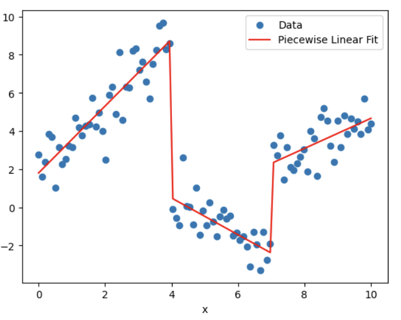{fig-align="center" width="40%"}

```python
import numpy as np
import matplotlib.pyplot as plt
from scipy.optimize import curve_fit
np.random.seed(0)
x = np.linspace(0, 10, 100)
y = np.piecewise(x, [x < 4, (x >= 4) & (x < 7), x >= 7],
    [lambda x: 2*x + 1 + np.random.normal(size=len(x)),
     lambda x: -x + 5 + np.random.normal(size=len(x)),
     lambda x: 0.5*x - 1 + np.random.normal(size=len(x))])

def piecewise_linear(x, x0, x1, y0, y1, y2, k1, k2, k3):
    conds = [x < x0, (x >= x0) & (x < x1), x >= x1]
    funcs = [lambda x: k1*x + y0, lambda x: k2*x + y1, lambda x: k3*x + y2]
    return np.piecewise(x, conds, funcs)

p0 = [4, 7, 1, 5, -1, 2, -1, 0.5]
params, _ = curve_fit(piecewise_linear, x, y, p0=p0)
x_fit = np.linspace(0, 10, 100)
y_fit = piecewise_linear(x_fit, *params)
plt.scatter(x, y, label='Data')
plt.plot(x_fit, y_fit, color='red', label='Piecewise Linear Fit')
plt.xlabel('x'); plt.ylabel('y'); plt.legend(); plt.show()
```

### 간선행렬 $Ax = b$

간선행렬(Incidence matrix)은 그래프 이론에서 정점(vertices)과 간선(edges, nodes) 사이의 관계를 나타내는 행렬이다.

간선 행렬 $G_{n \times m}$은 정점이 $n$개, 간선이 $m$개이다.

| 원소 | 조건 | 의미 |
|------|------|------|
| $A_{ij} = 1$ | 정점 $i$와 간선 $j$가 연결 | 정점 $i$는 간선 $j$의 **끝(head)** 정점 |
| $A_{ij} = -1$ | 정점 $i$와 간선 $j$가 연결 | 정점 $i$는 간선 $j$의 **시작(tail)** 정점 |
| $A_{ij} = 0$ | — | 정점 $i$와 간선 $j$는 연결되지 않음 |

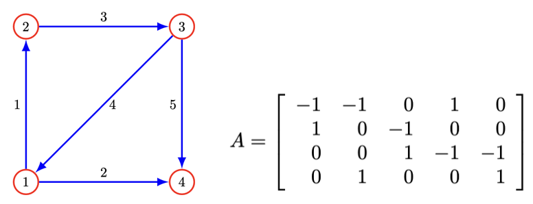{fig-align="center" width="40%"}

### 네트워크

만약 $x$가 네트워크에서의 흐름을 나타내는 $m$-벡터라면, $x_j$는 간선 $j$를 통한 흐름으로 해석된다. 양의 값은 흐름이 간선 $j$의 방향으로, 음의 값은 반대 방향으로 이동함을 의미한다.

네트워크 구조를 나타내는 $G_{n \times m}$를 사용하여 $y = Gx$는 각 노드로 들어오는 순흐름을 나타내는 $n$-벡터이다. $y_i$는 $i$-노드의 흐름 잉여(surplus)이다.

만약 $Gx = 0$이면 각 노드에서 들어오는 흐름과 나가는 흐름이 일치하여 **흐름 보존**이 일어난다.

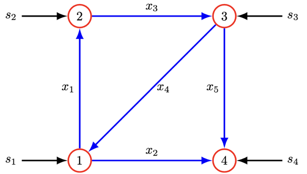{fig-align="center" width="40%"}

소스(source): $s_i > 0$이면 외부에서 들어오는 흐름, $s_i < 0$이면 싱크(sink)라 한다.

$$\text{소스 포함된 흐름 보전: } Ax + s = 0$$

### 선형함수 모델 $Ax = b$

두 변수 집합 간의 선형 함수를 모형(model) 또는 근사(approximation) 값으로 정의한다.

#### 수요의 가격 탄력성 (Price Elasticity of Demand)

가격 $n$-벡터 $p$, 수요 $n$-벡터 $d$, 가격변화 $\delta^{price}_i = \frac{p_i^{new} - p_i}{p_i}$, 수요변화 $\delta^{dem}_i = \frac{d_i^{new} - d_i}{d_i}$라 하면:

$$\delta^{dem} = E^d \delta^{price}, \quad E^d \text{는 } (n \times n) \text{ 수요 탄력성 행렬}$$

$E_{11}^d = -0.4$, $E_{21}^d = 0.2$이면, 첫 번째 상품의 가격이 1% 증가할 때 첫 번째 상품의 수요는 0.4% 감소하고 두 번째 상품의 수요는 0.2% 증가한다.

#### 탄성 변형 (Elastic Deformation)

$f$를 구조물에 작용하는 힘(하중) $n$-벡터, $d$를 $m$개 지점의 변위 $m$-벡터라 하면 변위와 하중 사이의 관계는 선형으로 근사된다:

$$d = Cf, \quad C: m \times n \text{ 컴플라이언스 행렬 (단위: m/N)}$$

#### 테일러 근사

함수 $f: \mathbb{R}^n \rightarrow \mathbb{R}^m$이 1차 미분이 가능하면:

$$\hat{f}(x)_i = f_i(z) + \nabla f_i(z)^T(x - z), \qquad \hat{f}(x) = f(z) + Df(z)(x - z)$$

단, $Df(z)_{ij} = \dfrac{\partial f_i}{\partial x_j}(z), \; i = 1, \ldots, m, \; j = 1, \ldots, n$

#### 회귀모형

표본 크기 $N$, 예측변수 벡터 $x^{(1)}, x^{(2)}, \ldots, x^{(N)}$이다. $i$-개체의 예측치는:

$$\hat{y}^{(i)} = (x^{(i)})^T \beta + v, \quad i = 1, 2, \ldots, N$$

- 잔차: $r^{(i)} = y^{(i)} - \hat{y}^{(i)}$
- 절편 없는 회귀모형: $\hat{y}^d = X^T \beta + v\mathbf{1}$
- 절편 회귀모형: $\hat{y}^d = \begin{bmatrix} \mathbf{1}^T \\ X \end{bmatrix}^T \begin{bmatrix} v \\ \beta \end{bmatrix}$

### 선형 동적 시스템

시간에 따라 변하는 상태 벡터의 선형 관계를 설명하는 모델로, 현재 상태가 다음 상태를 예측할 수 있는 수학적 구조이다. $x_t$가 현재 상태인 $x_1, x_2, \ldots$ $n$-벡터 시계열이라 하자.

#### 입력이 포함된 선형 동적 시스템

$$x_{t+1} = A_t x_t + B_t u_t, \quad t = 1, 2, \ldots$$

$u_t$는 시간 $t$에서의 입력벡터, $B_t$는 입력행렬이다.

#### $K$-Markov 모형

$$x_{t+1} = A_1 x_t + \cdots + A_K x_{t-K+1}, \quad t = K, K+1, \ldots$$

- **상태(State)**: 시스템이 가질 수 있는 모든 가능한 상태들의 집합(상태 공간 $S$). 예: 날씨 예측 모델에서 "맑음", "흐림", "비" 등
- **상태 전이**: 한 상태에서 다른 상태로의 전이. $P_i$는 초기상태 확률분포
- **전이 확률**: $P(x_{t+1} = s_j | x_t = s_i)$: 현재 상태 $i$에서 상태 $j$로 전이될 확률

```python
import numpy as np
P = np.array([[0.8, 0.2],[0.4, 0.6]])
pi_0 = np.array([0.6, 0.4])
states = ["Sunny", "Rainy"]
num_steps = 10
current_state = np.random.choice(states, p=pi_0)
print(f"Day 0: {current_state}")
for t in range(1, num_steps + 1):
    if current_state == "Sunny":
        next_state = np.random.choice(states, p=P[0])
    else:
        next_state = np.random.choice(states, p=P[1])
    print(f"Day {t}: {next_state}")
    current_state = next_state
```
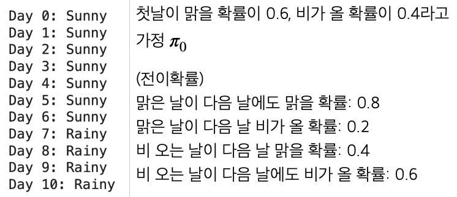{fig-align="center" width="40%"}

### 인구 동태

100-벡터 $(x_t)_i$는 $t$ 시점의 $(i-1)$세 인구이다. 100-벡터 $b$의 $b_i$는 $(i-1)$세의 평균 출생률이다. 가임 연령을 고려하면 $b_i = 0$ for $i < 13$ or $i > 50$이다. 만약 사망, 이민 없다고 가정하면 내년 0세 인구는 $(x_{t+1})_1 = b^T x_t$이다.

나이 $i$세 $(t+1)$ 시점의 인구수: $(x_{t+1})_{i+1} = (1 - d_i)(x_t)_i, \; i = 1, 2, \ldots, 99$

인구 동태 모형: $x_{t+1} = Ax_t, \; t = 1, 2, \ldots$

**전이행렬 $A$:**

$$A = \begin{bmatrix}
b_1 & b_2 & b_3 & \cdots & b_{98} & b_{99} & b_{100} \\
1-d_1 & 0 & 0 & \cdots & 0 & 0 & 0 \\
0 & 1-d_2 & 0 & \cdots & 0 & 0 & 0 \\
\vdots & \vdots & \vdots & \ddots & \vdots & \vdots & \vdots \\
0 & 0 & 0 & \cdots & 1-d_{98} & 0 & 0 \\
0 & 0 & 0 & \cdots & 0 & 1-d_{99} & 0
\end{bmatrix}$$

이민을 고려한 인구 동태 모형: $x_{t+1} = Ax_t + u_t$

간단한 인구동태 방정식: $P_{t+1} = P_t + (B_t - D_t) + M_t$

```python
import numpy as np
import matplotlib.pyplot as plt
initial_population = 330_000_000
birth_rate = 12.4 / 1000
death_rate = 8.9 / 1000
annual_net_migration = 1_000_000
years = 10
population = np.zeros(years + 1)
population[0] = initial_population
for t in range(1, years + 1):
    births = population[t-1] * birth_rate
    deaths = population[t-1] * death_rate
    population[t] = population[t-1] + births - deaths + annual_net_migration
for t in range(years + 1):
    print(f"Year {2023 + t}: {population[t]:,.0f}")
```

### 전염병 동태

전염 역학 모델은 전염병의 전파와 확산을 연구하는 분야로, 질병의 전염 방식과 전파 속도를 이해하고 예측하는 데 중점을 둔다.

::: {.callout-note}
**SIRD 모델 상태** $x_t = (S, I, R, D)$, $S + I + R + D = 1$

| 상태 | 기호 | 설명 |
|------|------|------|
| 감염 가능 | $S$ | 현재 비감염이지만 감염될 수 있는 사람들 |
| 감염 | $I$ | 현재 질병에 감염된 사람들 |
| 회복 | $R$ | 질병을 회복하고 면역을 획득한 사람들 |
| 사망 | $D$ | 질병으로 사망한 사람들 |
:::

**약학 모델 동력학**: $\beta$: 감염율, $\gamma$: 회복율, $\mu$: 사망율

$$\frac{dS}{dt} = -\beta SI, \qquad \frac{dI}{dt} = \beta SI - \gamma I - \mu I$$

$$\frac{dR}{dt} = \gamma I, \qquad \frac{dD}{dt} = \mu I$$

**사례연구**: $x_t = (0.99, 0.01, 0, 0)$, $\beta = 0.3$, $\mu = 0.02$, $\gamma = 0.1$ (전염 상태 잔류 88%)

$$x_{t+1} = Ax_t, \quad A = \begin{bmatrix} 0.99 & 0.1 & 0 & 0 \\ 0.01 & 0.88 & 0 & 0 \\ 0 & 0.1 & 1 & 0 \\ 0 & 0.02 & 0 & 1 \end{bmatrix}$$

```python
import numpy as np
from scipy.integrate import odeint
import matplotlib.pyplot as plt
S0, I0, R0, D0 = 0.99, 0.01, 0.0, 0.0
initial_conditions = [S0, I0, R0, D0]
beta, gamma, mu = 0.3, 0.1, 0.02

def sird_model(y, t, beta, gamma, mu):
    S, I, R, D = y
    dS_dt = -beta * S * I
    dI_dt = beta * S * I - gamma * I - mu * I
    dR_dt = gamma * I
    dD_dt = mu * I
    return [dS_dt, dI_dt, dR_dt, dD_dt]

t = np.linspace(0, 160, 160)
solution = odeint(sird_model, initial_conditions, t, args=(beta, gamma, mu))
S, I, R, D = solution.T
plt.figure(figsize=(10, 6))
plt.plot(t, S, label='Susceptible'); plt.plot(t, I, label='Infected')
plt.plot(t, R, label='Recovered'); plt.plot(t, D, label='Deceased')
plt.xlabel('Time (days)'); plt.ylabel('Proportion of Population')
plt.legend(); plt.title('SIRD Model'); plt.grid(True); plt.show()
```

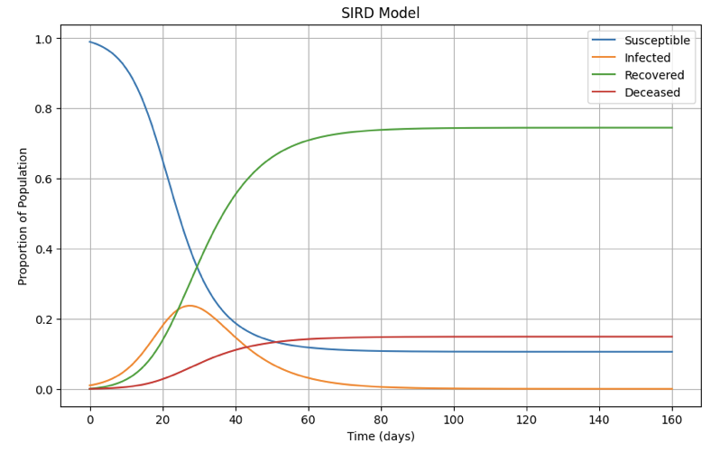{fig-align="center" width="60%"}

---

## 고유치와 고유벡터

### 기초

#### 개념

::: {.callout-note}
**고유치·고유벡터 (Eigenvalue·Eigenvector)**

특정 벡터(고유벡터)가 행렬 $A$에 의해 변환될 때, 방향은 변하지 않고 크기만 일정 비율로 변한다면, 이 비율을 **고유치(eigenvalue)**, 해당 벡터를 **고유벡터(eigenvector)**라고 한다.

$$A\mathbf{v} = \lambda\mathbf{v}$$
:::

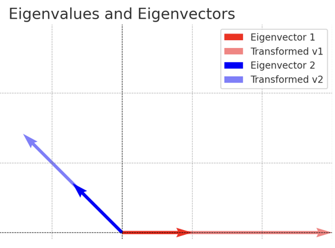{fig-align="center" width="40%"}

위 그래프는 행렬 $A = \begin{bmatrix} 3 & 1 \\ 0 & 2 \end{bmatrix}$의 고유치 $(\lambda = 3, 2)$와 고유벡터의 변환을 시각적으로 보여준다. 고유벡터의 방향은 행렬 변환 후에도 유지되며, 크기만 고유치 값에 따라 변한다.

#### 통계학 활용

| 방법론 | 활용 |
|--------|------|
| **PCA** | 공분산행렬의 고유치→주성분 중요도, 차원 축소 |
| **LDA** | 클래스 간/내 분산 행렬의 고유치→최적 분리 축 |
| **MDS** | 거리 행렬의 고유치 분해→저차원 시각화 |
| **공분산 분석** | 고유치 0에 가까우면 변수 간 선형 종속 암시 |
| **SVD** | 추천 시스템, 텍스트 분석(LSA)에서 사용 |
| **시계열 AR** | 고유치 > 1이면 시스템 불안정 |

**주성분 분석(PCA)**: 공분산 행렬에서 가장 큰 고유치는 데이터의 분산을 가장 많이 설명하는 방향(주성분)을 나타낸다. 변수 100개로 구성된 데이터도 2~3개의 주성분만 선택해 차원을 축소할 수 있다.

**선형 판별 분석(LDA)**: 클래스 간 분산 행렬과 클래스 내 분산 행렬의 비율로 구성된 행렬의 고유치를 계산하여 최적의 분리 축을 결정한다.

**다차원 척도법(MDS)**: 거리 행렬을 고유치 분해하여 데이터를 저차원 공간에 배치한다.

**행렬 분해 및 차원 축소**: 고유치와 고유벡터는 특이값 분해(SVD), 고유분해(Eigendecomposition)의 핵심으로 차원 축소, 데이터 압축, 노이즈 제거 등에 사용된다.

### 고유치·고유벡터 구하기

대칭행렬 $A_{n \times n}$에 대하여 고유치 $\lambda$, 고유벡터 $\mathbf{v}$는 다음 방정식이 성립한다.

$$A\mathbf{v} = \lambda\mathbf{v}$$

#### 고유치 (Eigenvalue) 구하기

::: {.callout-note}
**고유방정식**

$$\det(A - \lambda I) = 0$$

을 만족하는 $\lambda$를 고유치라 한다. 고유치는 행렬 $A$의 차수만큼 존재한다: $\lambda_1, \lambda_2, \ldots, \lambda_n$
:::

#### 고유벡터 (Eigenvector) 구하기

$A\mathbf{v}_i = \lambda_i \mathbf{v}_i$를 만족하는 벡터 $\mathbf{v}$를 고유벡터라 한다.

$\det(A - \lambda I) = 0$(singular)가 성립하므로 고유벡터는 무수히 많이 존재한다.

고유벡터 중 Norm($\mathbf{v}'\mathbf{v} = 1$)이 1인 정규 고유벡터를 주성분분석에서 사용한다.

### 고유치 활용

#### 고유치 분해 (Eigenvalue Decomposition)

::: {.callout-note}
**고유치 분해**

정방행렬 $A_{n \times n}$의 고유치 $(\lambda_i)$를 대각원소로 하는 대각행렬 $\Lambda$, 고유벡터 $(\mathbf{v}_i)$로 이루어진 직교 행렬 $Q$라 하면:

$$A = Q\Lambda Q^{-1}$$
:::

#### 주성분분석

데이터 행렬: $X_{n \times p}$ (변수 개수 $p$)

- $\mathbf{y} = P\mathbf{x}$: 원 변수의 선형결합(선형계수 행렬은 고유벡터)으로 주성분 변수를 만든다.
- $X'X$의 고유치 분해: $X'X = Q\Lambda Q^T$ ($X'X$는 대칭행렬이므로 $Q^T = Q^{-1}$)
- $X$의 공분산행렬로부터 고유치와 정규 고유벡터($\|\mathbf{v}\|=1$)를 구하여 서로 독립인 차원으로 변환한다.
- 공분산행렬에 대한 고유치, 고유벡터: $COV_{p \times p} \mathbf{v} = \lambda \mathbf{v}$
- 공분산 행렬은 양의 정부호 행렬이므로 변수의 차수만큼의 고유치, 그에 대응하는 고유벡터가 존재한다.
- 주요 2~3개 차원만으로 $p$차원의 원변수 변동(정보)을 축약한다. 이를 **주성분분석**이라 한다.

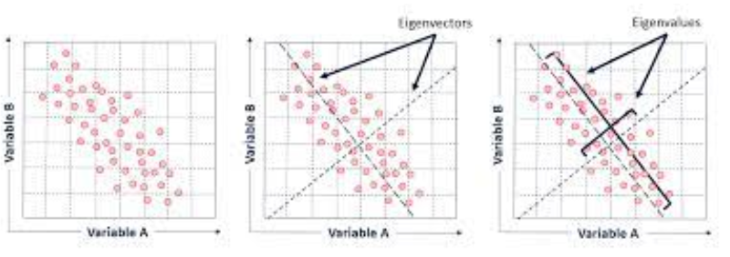{fig-align="center" width="40%"}

#### 특이값 분해 (SVD, Singular Value Decomposition)

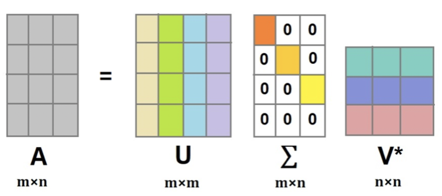{fig-align="center" width="40%"}

| 구성 | 정의 |
|------|------|
| 직교행렬 $U$ ($UU' = I$) | $AA'$의 고유벡터 |
| 직교행렬 $V'$ ($V'V = I$) | $A'A$의 고유벡터 |
| 대각행렬 $\Sigma$ | $AA'$, $A'A$ 고유치의 제곱근을 대각원소로 |

#### Cholesky 분해

::: {.callout-note}
**Cholesky 분해**

대칭행렬 $A$가 양의 정부호 행렬일 경우:

$$A = LL^T, \quad L: \text{대각원소가 양인 하단 삼각행렬}$$

【활용】 $A\mathbf{x} = \mathbf{b}$ (연립방정식) → $LL^T \mathbf{x} = \mathbf{b}$ → $\mathbf{x} = (L^{-1})'L^{-1}\mathbf{b}$

최소제곱추정과 같은 최적해를 구할 때 사용하면 빠른 연산이 가능하다.
:::

```python
import numpy as np
A = np.array([[1,2,3], [4,5,7],[8,9,10]])
import numpy.linalg as la
val, vec = la.eig(A)
val, vec
```
【결과】 (array([17.71571559, -1.44163052, -0.27408507]),
 array([[-0.21078452, -0.49872133,  0.47929184],
        [-0.52147269, -0.47685414, -0.81047488],
        [-0.82682291,  0.7238005,   0.33676373]]))

```python
import numpy as np
A = np.array([[1,2,3], [4,5,7],[8,9,10]])
import numpy.linalg as la
val, vec = la.eig(A)
S = np.diag(val); P = vec
P @ S @ la.inv(P)
```
【결과】 array([[ 1.,  2.,  3.],
       [ 4.,  5.,  7.],
       [ 8.,  9., 10.]])

```python
#SVD decomposition
u, s, vh = np.linalg.svd(A, full_matrices=True)
u, s, vh
```
【결과】 (array([[-0.19462586, -0.6193003,  -0.76064966],
        [-0.5071685,  -0.6002356,   0.61846369],
        [-0.83958376,  0.50614657, -0.19726824]]),
 array([18.62202941,  1.46779937,  0.25609691]),
 array([[-0.48007495, -0.56284671, -0.67285334],
        [ 0.70100172,  0.21497525, -0.67998694],
        [ 0.52737523, -0.79811604,  0.29135228]]))

```python
#Cholesky decomposition
import numpy as np
A = np.array([[25,15,-5], [15,18,0],[-5,0,11]])
np.linalg.cholesky(A)
```
【결과】 array([[ 5.,  0.,  0.],
       [ 3.,  3.,  0.],
       [-1.,  1.,  3.]])

```python
#확인 LL'
np.linalg.cholesky(A) @ np.linalg.cholesky(A).T
```
【결과】 array([[25., 15., -5.],
       [15., 18.,  0.],
       [-5.,  0., 11.]])

---

## 행렬미분

### 미분 공식

#### 벡터미분

상수벡터 $\mathbf{a}_n = (a_1, a_2, \ldots, a_n)^T$, 확률변수 벡터 $\mathbf{x}_n = (x_1, x_2, \ldots, x_n)^T$, $x_i \sim (iid) f(x)$는 확률표본이다.

$$\frac{\partial(\mathbf{a}'\mathbf{x})}{\partial \mathbf{x}} = \mathbf{a}, \qquad \frac{\partial(\mathbf{x}'\mathbf{a})}{\partial \mathbf{x}} = \mathbf{a}$$

#### 이차형식 미분

$$\frac{\partial(\mathbf{x}'A\mathbf{x})}{\partial \mathbf{x}} = (A + A')\mathbf{x}$$

만약 $A$가 대칭행렬이면: $\dfrac{\partial(\mathbf{x}'A\mathbf{x})}{\partial \mathbf{x}} = 2A\mathbf{x}$

### 이차형식

#### 이차형식 정의

::: {.callout-note}
**이차형식 (Quadratic Form)**

$$Q(x_1, x_2, \ldots, x_n) = \mathbf{x}'A\mathbf{x}$$

- 2차형식의 경우 대칭행렬인 $A$는 적어도 한 개는 존재한다.
:::

#### 이차형식 종류

대칭행렬 $A$, 이차형식 $Q = \mathbf{x}'A\mathbf{x}$에 대하여:

| 종류 | 조건 |
|------|------|
| 양의 정부호 (positive definite) | 모든 $x \neq 0$에 대하여 $Q > 0$ |
| 양의 반부호 (positive semidefinite) | 모든 $x \neq 0$에 대하여 $Q \geq 0$ |

#### 주축정리 (Principal Axes Theorem)

::: {.callout-note}
**주축정리**

이차형식 $\mathbf{x}'A\mathbf{x}$을 교차항이 없는 이차형식 $\mathbf{y}'D\mathbf{y}$으로 변환하는 직교변환 $\mathbf{x} = P\mathbf{y}$가 존재한다. $P$를 주축행렬이라 하고 대칭행렬 $A$의 고유벡터로 이루어져 있다.
:::

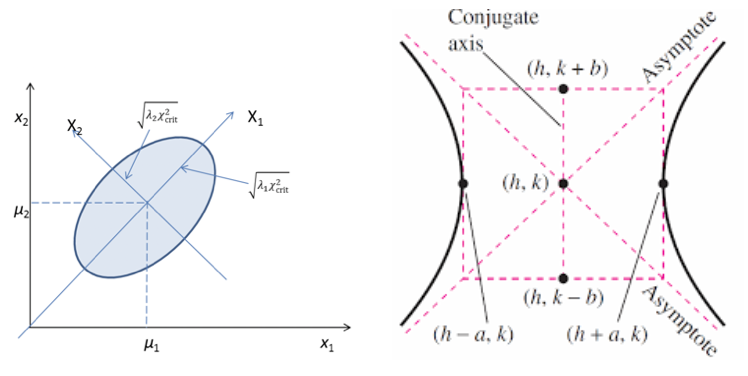{fig-align="center" width="60%"}

#### 이차형식과 고유치 관계

| 이차형식 | 고유치 |
|---------|--------|
| 양의 정부호 | 모든 고유치 > 0 |
| 양의 반부호 | 모든 고유치 ≥ 0 |
| 역행렬도 양의 정부호 | 양의 정부호 행렬의 역행렬도 양의 정부호 |
| 공분산 행렬 | 항상 양의 정부호 |

### 이차형식 만들기

$$Q(x) = x_1^2 + 2x_2^2 - 7x_3^2 - 4x_1 x_2 + 8x_1 x_3$$

제곱항은 그대로 대각원소로, 교차항은 1/2로 하여 각 셀에 배분한다.

$$Q(x) = \begin{bmatrix} x_1 & x_2 & x_3 \end{bmatrix} \begin{bmatrix} 1 & -2 & 4 \\ -2 & 2 & 0 \\ 4 & 0 & -7 \end{bmatrix} \begin{bmatrix} x_1 \\ x_2 \\ x_3 \end{bmatrix} = \mathbf{x}'A\mathbf{x}$$

- $\mathbf{x} = P\mathbf{y}$: 주축행렬 $P$는 대칭행렬 $A$의 고유벡터이다.
- $A$의 고유치를 대각원소로 하는 행렬 $D = diag(\lambda_1, \lambda_2, \lambda_3)$를 이용하여 교차항이 없는 이차형식으로 변형한다.
- $Q(x) = \mathbf{x}'A\mathbf{x} \implies Q(y) = \mathbf{y}'D\mathbf{y}$ ($\mathbf{x} = P\mathbf{y}$)

### 선형 회귀모형

#### 데이터 구조

목표변수 1개, $p$개 예측변수, 표본크기 $n$인 데이터를 가정하면 선형 회귀모형은:

$$\mathbf{y} = X\boldsymbol{\beta} + \mathbf{e}$$

$$\begin{bmatrix} y_1 \\ y_2 \\ \vdots \\ y_n \end{bmatrix} = \begin{bmatrix} 1 & x_{11} & x_{12} & \cdots & x_{1p} \\ 1 & x_{21} & x_{22} & \cdots & x_{2p} \\ \vdots & \vdots & \vdots & \ddots & \vdots \\ 1 & x_{n1} & x_{n2} & \cdots & x_{np} \end{bmatrix} \begin{bmatrix} a \\ b_1 \\ \vdots \\ b_p \end{bmatrix} + \begin{bmatrix} e_1 \\ e_2 \\ \vdots \\ e_n \end{bmatrix}$$

#### 예측변수 데이터 행렬·벡터

$$X_{n \times p} = \begin{bmatrix} \mathbf{x}_1 & \mathbf{x}_2 & \cdots & \mathbf{x}_p \end{bmatrix}, \qquad \mathbf{x}_k = \begin{bmatrix} x_{1k} \\ x_{2k} \\ \vdots \\ x_{nk} \end{bmatrix}$$

#### 확률변수 벡터, 평균벡터, 공분산행렬

$$\mathbf{x} = \begin{bmatrix} x_1 \\ x_2 \\ \vdots \\ x_p \end{bmatrix}, \quad E(x_i) = \mu_i, \quad V(x_i) = \sigma_{ii}, \quad COV(x_i, x_j) = \sigma_{ij}$$

$$E(\mathbf{x}) = \boldsymbol{\mu} = \begin{bmatrix} \mu_1 \\ \mu_2 \\ \vdots \\ \mu_p \end{bmatrix}, \qquad COV(\mathbf{x}) = \Sigma = \begin{bmatrix} \sigma_{11} & \sigma_{12} & \cdots & \sigma_{1p} \\ \sigma_{21} & \sigma_{22} & \cdots & \sigma_{2p} \\ \vdots & \vdots & \ddots & \vdots \\ \sigma_{p1} & \sigma_{p2} & \cdots & \sigma_{pp} \end{bmatrix}$$

상수벡터 $\mathbf{a} = (a_1, a_2, \ldots, a_p)^T$에 대하여:

$$E(\mathbf{a}'\mathbf{x}) = \mathbf{a}'\boldsymbol{\mu}, \qquad V(\mathbf{a}'\mathbf{x}) = \mathbf{a}'\Sigma\mathbf{a}$$

#### 선형 회귀모형

$$\mathbf{y} = X\mathbf{b} + \mathbf{e}, \qquad \mathbf{e} \sim N(\mathbf{0}, \sigma^2 I)$$

::: {.callout-note}
**최소제곱법 추정**

$$\min_{\mathbf{b}} \mathbf{e}'\mathbf{e} = \min_{\mathbf{b}} (\mathbf{y} - X\mathbf{b})'(\mathbf{y} - X\mathbf{b})$$

$$Q(\mathbf{b}) = \mathbf{y}'\mathbf{y} + \mathbf{b}'X'X\mathbf{b} - 2\mathbf{y}'X\mathbf{b}$$

$$\frac{\partial Q}{\partial \mathbf{b}} = 2X'X\mathbf{b} - 2X'\mathbf{y} = 0 \implies \hat{\mathbf{b}} = (X'X)^{-1}X'\mathbf{y}$$
:::

**적합치·잔차**

$$\hat{\mathbf{y}} = X\hat{\mathbf{b}} = X(X'X)^{-1}X'\mathbf{y} = H\mathbf{y}, \qquad H = X(X'X)^{-1}X' \; \text{(hat 행렬)}$$

$$\hat{\mathbf{e}} = \mathbf{y} - \hat{\mathbf{y}} = (I - H)\mathbf{y}$$

$H$는 대칭행렬이고 멱등행렬이다: $HH = H$, $H' = H$. $(I-H)$도 멱등행렬이다.

**잔차의 분포**: $\hat{\mathbf{e}} \sim N(\mathbf{0}, \sigma^2(I-H))$

**목표변수 분해**: $\mathbf{y} = H\mathbf{y} + (I-H)\mathbf{y}$ = (설명하는 변동) + (설명하지 못하는 변동)

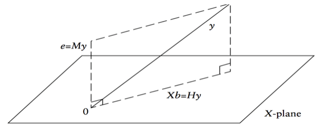{fig-align="center" width="60%"}

**추정치 분포**

$$E(\hat{\mathbf{b}}) = (X'X)^{-1}X'E(\mathbf{y}) = (X'X)^{-1}X'X\mathbf{b} = \mathbf{b}$$

$$V(\hat{\mathbf{b}}) = \sigma^2(X'X)^{-1}, \qquad \hat{\mathbf{b}} \sim N(\mathbf{b},\; \sigma^2(X'X)^{-1})$$

$$\hat{\sigma}^2 = MSE = \frac{SSE}{n-p-1}$$

**변동 분해 ANOVA**

$$SST = \sum(y_i - \bar{y})^2 = \mathbf{y}'(I - \tfrac{1}{n}J)\mathbf{y}$$

$$SSE = \sum(y_i - \hat{y}_i)^2 = \mathbf{y}'(I-H)\mathbf{y}, \qquad \frac{SSE}{\sigma^2} \sim \chi^2(n-p-1)$$

$$SSR = \hat{\mathbf{b}}'X'\mathbf{y} - \tfrac{1}{n}\mathbf{y}'J\mathbf{y} = \mathbf{y}'(H - \tfrac{1}{n}J)\mathbf{y}, \qquad \frac{SSR}{\sigma^2} \sim \chi^2(p)$$

$$R^2 = \frac{SSR}{SST} = 1 - \frac{SSE}{SST}, \qquad F = \frac{SSR/p}{SSE/(n-p-1)} \sim F(p,\; n-p-1)$$

**분산분석 표**

| 변동 | 제곱변동 | 자유도 | 평균제곱 | F |
|------|---------|--------|---------|---|
| 회귀 | $SSR$ | $p$ | $MSR = \frac{SSR}{p}$ | $\frac{MSR}{MSE}$ |
| 오차 | $SSE$ | $n-p-1$ | $MSE = \frac{SSE}{n-p-1}$ | |
| 총변동 | $SST$ | $n-1$ | $E(MSE) = \sigma^2$, $E(MSR) = \sigma^2 + \mathbf{b}_1^2\sum(x_i - \bar{x})^2$ | |
