### Chapter 1. 선형대수 개념

#### 1. 선형대수 정의

선형대수는 벡터 공간과 그 안에 존재하는 벡터 간의 관계를 다루는 수학의 한 분야로, 벡터와 행렬을 이용한 수학적 표현과 계산을 중심으로 구성된다. 이 분야의 기본 구성 요소로는 벡터, 행렬, 스칼라가 있으며, 주요 개념에는 선형 변환, 고유값과 고유벡터, 내적과 외적, 행렬의 분해 등이 포함된다.

통계학에서 선형대수는 데이터를 벡터와 행렬의 형태로 구조화함으로써 복잡한 수치 연산을 간결하게 수행할 수 있도록 돕는다. 특히 고차원 데이터의 계산과 변환을 수학적으로 명확하게 정의할 수 있기 때문에, 데이터 구조를 이해하고 차원을 축소하는 데 핵심적인 도구로 사용된다.

이러한 선형대수의 기법은 통계 모델링과 머신러닝의 기초가 되며, 회귀 분석이나 주성분 분석(PCA), 군집 분석 등 다양한 통계적 방법론에서 필수적인 역할을 수행한다.

#### 2. 선형대수와 선형변환

선형대수는 선형적인 관계를 다루는 수학의 한 분야로, 이 이론 체계 내에서 이루어지는 연산과 변환은 모두 선형성을 만족해야 한다. 함수의 특수한 형태인 선형 변환은 벡터 공간의 구조를 보존하면서 벡터를 다른 벡터로 사상하는 과정을 의미하며, 행렬을 이용해 구체적으로 표현될 수 있다.

**함수 $y = f(x)$**

- 함수는 두 집합 사이의 관계로, 각 입력값(정의역, domain)에 대해 정확히 하나의 출력값(공역, range)을 대응시키는 규칙이다.
- 함수는 일반적으로 $f:D \rightarrow R$와 같이 표기되며, $D$는 정의역, $R$는 공역이다.
- 특정 함수에 대하여 함수값이 0인 $f(x) = 0$를 방정식이라 하고 이를 만족하는 $x$를 방정식의 해(root, solution)라고 한다.

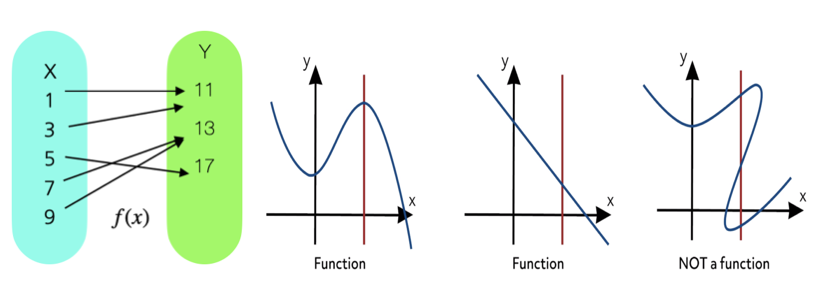{fig-align="center" width="60%"}

::: {.callout-note}
**선형변환 (Linear Transformation)**

동일 차원의 벡터 $\mathbf{u}, \mathbf{v}$에 대하여 함수 $T$가 다음 두 조건을 만족하면 **선형변환**이라 한다.

- **덧셈 선형성:** $T(\mathbf{u} + \mathbf{v}) = T(\mathbf{u}) + T(\mathbf{v})$
- **스칼라 곱 선형성:** $T(c\mathbf{u}) = cT(\mathbf{u})$
:::

**선형함수** $f(x) = a + bx$: $a$는 절편, $b$는 기울기

:::: {.columns}
::: {.column width="50%"}
**가법성 (Additivity)**
$$f(x + y) = f(x) + f(y)$$
:::
::: {.column width="50%"}
**동차성 (Homogeneity)**
$$f(cx) = cf(x), \quad c\text{는 상수}$$
:::
::::

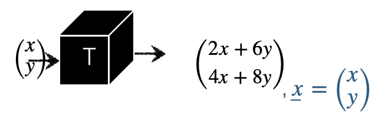{fig-align="center" width="60%"}

---

### Chapter 2. 벡터 vector 기초

#### 1. 벡터 정의

::: {.callout-note}
**벡터 (Vector)**

벡터는 정렬된 유한한 수들의 목록으로, 일반적으로 수직 형태(열벡터, column vector)로 표현된다.

$$\left(\begin{array}{r} 1 \\ -2 \\ 0 \end{array}\right), \quad \left[\begin{array}{r} 1 \\ -2 \\ 0 \end{array}\right]$$

벡터를 행으로 사용할 때는 쉼표로 구분하고 괄호로 둘러싼다: $(1, -2, 0)$
:::

배열의 값을 벡터의 **원소(element)**라 하고 원소의 개수를 벡터의 **크기(차원, dimension)**라고 한다. $n$크기의 벡터는 $n$-벡터라고 부르며, 1-벡터는 숫자와 같은 것으로 간주한다. 숫자는 **스칼라(scalar)**라 한다. 벡터의 각 원소는 스칼라이고 원소가 실수인 $a_i \in \mathbb{R}^n$ 벡터를 실수 벡터라 한다.

#### 2. 벡터 기호

$n$-벡터를 나타내기 위해 $\mathbf{a}_n$(구별이 가능한 경우 알파벳 $a$를 벡터로 표현) 기호를 사용한다. $\mathbf{a}_n$벡터의 $i$-번째 요소는 $a_i$로 표시된다.

두 벡터 $\mathbf{a}_n, \mathbf{b}_n$가 동일하다는 것은 (1) 크기도 $n$으로 동일하고 (2) 각 대응 원소가 동일 $a_i = b_i$함을 의미한다.

#### 3. 특수한 벡터

:::: {.columns}
::: {.column width="33%"}
**영벡터 (Zero Vector)**

모든 원소가 0인 벡터이며 $\mathbf{0}_n$으로 표현된다.

$$\mathbf{0} = \left[\begin{array}{r} 0 \\ 0 \\ 0 \end{array}\right]$$
:::
::: {.column width="33%"}
**단위벡터 (Unit Vector)**

$i$-번째 원소만 1이고 나머지는 0인 벡터이며 $\mathbf{e}_i$로 표현한다.

$$\mathbf{e}_1 = \left[\begin{array}{r} 1 \\ 0 \\ 0 \end{array}\right], \quad \mathbf{e}_2 = \left[\begin{array}{r} 0 \\ 1 \\ 0 \end{array}\right]$$
:::
::: {.column width="34%"}
**일벡터 (Ones Vector)**

모든 원소가 1인 $n$-벡터이며 $\mathbf{1}_n$으로 표현한다.

$$\mathbf{1} = \left[\begin{array}{r} 1 \\ 1 \\ 1 \end{array}\right]$$
:::
::::

#### 4. 벡터 개념

##### \(1) 위치 (Location)

2차원 공간(평면)의 위치를 나타내는 데 사용될 수 있다. 3-벡터는 3차원 공간에서 어떤 지점의 위치를 나타내는 데 사용된다.

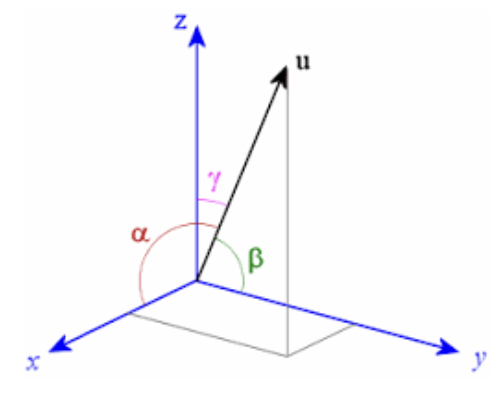{fig-align="center" width="40%"}

벡터는 주어진 시간에 평면이나 3차원 공간에서 움직이는 지점의 속도나 가속도를 나타내는 데 사용될 수 있다.

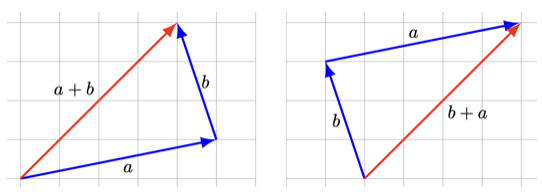{fig-align="center" width="40%"}

##### \(2) 희소성 (Sparsity)

많은 원소가 0이면 희소(sparse)하다고 한다. $n$-벡터 $\mathbf{a}_n$의 0이 아닌 항목의 수는 $nnz(\mathbf{a}_n)$로 표시한다. 단위벡터는 0이 아닌 항목이 하나만 있고 0 벡터는 0이 아닌 항목이 없기 때문에 희소한 벡터이다.

##### \(3) 이미지 (Image)

3차원 벡터는 빨간색, 녹색 및 파란색(R-G-B) 강도 값(0에서 1 사이)을 제공하는 항목을 통해 색상을 나타낸다. 벡터 $(0,0,0)$는 검은색, 벡터 $(0, 1, 0)$는 밝은 순수한 녹색, 벡터 $(1, 0.5, 0.5)$는 분홍색을 나타낸다.

---

### Chapter 3. 벡터 연산과 크기

#### 1. 벡터 연산

##### \(1) 벡터 합

두 벡터의 합은 (1) 차수가 동일한 두 벡터의 (2) 동일 위치의 원소를 합하여 하나의 벡터를 계산한다.

$$\left[\begin{array}{r} 1 \\ -2 \\ 0 \end{array}\right] + \left[\begin{array}{r} 1 \\ 2 \\ 3 \end{array}\right] = \left[\begin{array}{r} 2 \\ 0 \\ 3 \end{array}\right], \qquad \left[\begin{array}{r} 1 \\ -2 \\ 0 \end{array}\right] - \left[\begin{array}{r} 1 \\ 2 \\ 3 \end{array}\right] = \left[\begin{array}{r} 0 \\ -4 \\ -3 \end{array}\right]$$

**성질** | 차수가 동일한 벡터 $a, b, c$에 대하여:

| 성질 | 수식 |
|------|------|
| 교환법칙 | $a + b = b + a$ |
| 결합법칙 | $(a + b) + c = a + (b + c)$ |
| 영벡터 | $a \pm \mathbf{0} = a$ |
| 자기차 | $a - a = \mathbf{0}$ |

##### \(2) 스칼라-벡터 곱

벡터의 모든 요소에 스칼라를 곱하여 수행한다. 스칼라를 왼쪽, 벡터를 오른쪽에 적지만 순서를 바꾸어도 결과는 동일하다.

$$a = \left[\begin{array}{r} 1 \\ -2 \\ 0 \end{array}\right] \implies 3a = a3 = \left[\begin{array}{r} 3 \\ -6 \\ 0 \end{array}\right]$$

**성질** | 벡터 $a$, 스칼라 $c, k$에 대하여:

| 성질 | 수식 |
|------|------|
| 교환법칙 | $ka = ak$ |
| 배분법칙 | $(c + k)a = ca + ka$ |

##### \(3) 선형 결합 (Linear Combination)

::: {.callout-note}
**선형결합 정의**

차수 $n$-벡터 $a_1, a_2, \ldots, a_m$, 스칼라 $k_1, k_2, \ldots, k_m$에 대하여 다음 $n$-벡터를 **선형결합**이라 하고, 스칼라 $k_1, k_2, \ldots, k_m$는 **계수**라 한다.

$$k_1 a_1 + k_2 a_2 + \cdots + k_m a_m$$
:::

| 조건 | 결합 종류 |
|------|-----------|
| $k_1 = k_2 = \cdots = k_m = 1$ | 벡터 합 |
| $k_1 = k_2 = \cdots = k_m = \frac{1}{m}$ | 벡터 평균 |
| $k_1 + k_2 + \cdots + k_m = 1$ | Affine 결합 |
| Affine 결합 + 모든 계수 양수 | 가중평균 |

##### \(4) 내적 (Inner Product)

::: {.callout-note}
**내적 정의**

차수($m$)가 동일한 두 벡터 $(u, v)$의 내적은 다음과 같이 정의되며, 결과는 **스칼라**이다.

$$u^T v = [u_1, u_2, \ldots, u_m]\left[\begin{array}{r} v_1 \\ v_2 \\ \vdots \\ v_m \end{array}\right] = u_1 v_1 + u_2 v_2 + \cdots + u_m v_m = \sum_{i=1}^{m} u_i v_i$$

단, $u^T$는 $u$의 전치(transpose)라 하고 열벡터를 행벡터로 변환한 것이다.
:::

::: {.callout-tip}
**【예제】** 내적 계산

$$[1, 3, 5]\left[\begin{array}{r} 0 \\ -1 \\ 1 \end{array}\right] = (1)(0) + (3)(-1) + (5)(1) = 2$$
:::

**내적 성질**

| 성질 | 수식 |
|------|------|
| 단위벡터 | $e_i^T v = v_i$ |
| 벡터 합 | $\mathbf{1}_m^T v = \sum_{i=1}^{m} v_i$ |
| 벡터 평균 | $avg(v) = \frac{1}{n}\mathbf{1}_m^T v$ |
| 제곱합 | $v^T v = \sum_{i=1}^{m} v_i^2$ |

::: {.callout-important}
**Cauchy-Schwarz 부등식**

차수가 동일한 두 벡터의 내적에 대하여 다음이 성립한다.

$$|a^T b| \leq \|a\| \|b\|$$

$$\left|\sum_{i=1}^n a_i b_i\right| \leq \left(\sum a_i^2\right)^{1/2} \left(\sum b_i^2\right)^{1/2}$$
:::

##### \(5) 외적 (Cross Product)

주로 3차원 공간에서 두 벡터로부터 새로운 벡터를 생성하는 연산이다. 결과는 두 벡터에 모두 수직인 벡터이며, 크기는 두 벡터가 이루는 평행사변형의 면적에 해당한다.

::: {.callout-note}
**외적 정의**

벡터 $\mathbf{a} = (a_1, a_2, a_3)$와 벡터 $\mathbf{b} = (b_1, b_2, b_3)$의 외적 $\mathbf{a} \times \mathbf{b}$는 다음과 같다.

| 성분 | 계산식 |
|------|--------|
| $x$ 성분 | $a_2 b_3 - a_3 b_2$ |
| $y$ 성분 | $a_3 b_1 - a_1 b_3$ |
| $z$ 성분 | $a_1 b_2 - a_2 b_1$ |
:::

::: {.callout-tip}
**【예제】** 외적 계산

벡터 $\mathbf{a} = (2, 3, 4)$와 벡터 $\mathbf{b} = (5, 6, 7)$의 외적은 $\mathbf{c} = \mathbf{a} \times \mathbf{b} = (-3, 6, -3)$이다.

외적은 벡터 $\mathbf{a}, \mathbf{b}$와 수직($\mathbf{c}^T \mathbf{a} = 0$, $\mathbf{c}^T \mathbf{b} = 0$)이며, 외적의 크기(놈)는 두 벡터가 이루는 평행사면형 면적이다.
:::

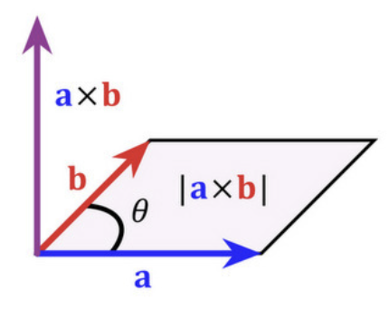{fig-align="center" width="40%"}

#### 2. 선형함수

::: {.callout-note}
**선형함수 정의**

$f: \mathbb{R}^n \rightarrow \mathbb{R}$는 크기 $n$-벡터를 실수(스칼라)로 매핑하는 함수이다. 다음 조건을 만족하는 $f$를 **선형함수**라 한다. 단, $\alpha$는 스칼라, $(x, y)$는 $n$-벡터이다.

- **동차성 (Homogeneity):** $f(\alpha x) = \alpha f(x)$
- **가법성 (Additivity):** $f(x + y) = f(x) + f(y)$

두 조건을 결합하면: $f(\alpha x + \beta y) = \alpha f(x) + \beta f(y)$
:::

::: {.callout-tip}
**【예제】** 선형함수 판별

$$f: \mathbb{R}^4 \rightarrow \mathbb{R}: \quad f(x) = x_1 - x_2 + x_4^2$$

$x_4^2$ 항이 포함되므로 이 함수는 선형함수가 **아니다**. 선형함수의 예: $f(x) = x_1 - x_2 + x_4$
:::

차수 $n$-벡터 $a, x$에 대하여 내적 함수 $f(x) = a^T x$는 선형함수이다.

##### \(1) 절편 Affine 함수

::: {.callout-note}
**Affine 함수**

선형 함수에 상수 항을 추가한 형태이다. $n$-벡터 $x$에 대하여 $a$는 $n$-벡터, $k$는 스칼라일 때:

$$f(x) = a^T x + k$$
:::

::: {.callout-tip}
**【예제】** Affine 함수

$$f(x) = 7 - 2x_1 + 3x_2 - x_3, \quad k = 7, \quad a = \left[\begin{array}{r} -2 \\ 3 \\ -1 \end{array}\right]$$
:::

##### \(2) 선형함수의 내적 표현

$e_i$ 단위벡터, $x_n$ 차수 $n$-벡터, $f$ 선형함수라 하면,

$$f(x) = f(x_1 e_1 + x_2 e_2 + \cdots + x_n e_n) = x_1 f(e_1) + x_2 f(e_2) + \cdots + x_n f(e_n) = a^T x$$

여기서 $a^T = [f(e_1), f(e_2), \ldots, f(e_n)]$

##### \(3) 사례: sag 처짐 (단위: mm)

하중벡터 $w = (w_1, w_2, w_3)^T$(단위: 톤), 변형 compliance 민감도 벡터 $c = (c_1, c_2, c_3)^T$(단위: mm/톤)이라면 교량 처짐 sag은 $s = c^T w$(하중 가중합)이다.

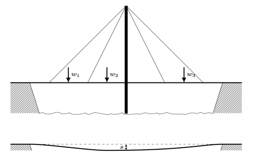{fig-align="center" width="40%"}

##### \(4) 테일러 근사 (Taylor Approximation)

::: {.callout-note}
**1차 테일러 근사**

함수 $f: \mathbb{R}^n \rightarrow \mathbb{R}$이 1차 미분이 가능하다고 하면, $n$-벡터 $z$와 가까운 $x$에서의 근사값은 다음과 같다.

$$\hat{f}(x) = f(z) + \frac{\partial f}{\partial x_1}(z)(x_1 - z_1) + \cdots + \frac{\partial f}{\partial x_n}(z)(x_n - z_n)$$
:::

::: {.callout-tip}
**【예제】** 테일러 근사

함수 $f: \mathbb{R}^2 \rightarrow \mathbb{R}$을 $f(x) = x_1 + \exp(x_2 - x_1)$라 하자. $z = (1, 2)$에서:

$$\nabla f(z) = \left[\begin{array}{r} 1 - \exp(z_2 - z_1) \\ \exp(z_2 - z_1) \end{array}\right]\bigg|_{z=(1,2)} = (-1.72,\; 2.72)$$

$$\hat{f}(x) = 3.718 + \left[\begin{array}{r} -1.72 \\ 2.72 \end{array}\right]^T \left(\left[\begin{array}{r} x_1 \\ x_2 \end{array}\right] - \left[\begin{array}{r} 1 \\ 2 \end{array}\right]\right)$$
:::

##### \(5) 회귀모형

차원 2-예측(독립) 벡터 $x = (x_1, x_2)^T$, 회귀계수 벡터 $b = (b_1, b_2)^T$, 절편 스칼라 $a$라 하면 회귀모형은 다음과 같다.

$$\hat{y} = \left[\begin{array}{r} 1 \\ x \end{array}\right]^T \left[\begin{array}{r} a \\ b \end{array}\right] = \tilde{x}^T \tilde{b}$$

OLS 추정치: $\hat{\tilde{b}} = (\tilde{x}^T \tilde{x})^{-1} \tilde{x}^T y$

#### 3. 벡터놈 (Norm)

##### \(1) 정의

::: {.callout-note}
**유클리디안 놈 (Euclidean Norm)**

벡터의 유클리디안 놈 $\|x\|$은 벡터의 크기에 대한 척도로, 원점에서의 거리를 나타낸다.

$$\|x\| = \sqrt{x_1^2 + x_2^2 + \cdots + x_n^2} = \sqrt{x^T x}$$
:::

::: {.callout-tip}
**【예제】** 놈 계산

$$\left\|\left[\begin{array}{r} 0 \\ -1 \\ 1 \end{array}\right]\right\| = \sqrt{2}, \qquad \left\|\left[\begin{array}{r} -1 \\ 2 \end{array}\right]\right\| = \sqrt{5}$$
:::

**성질**

| 성질 | 수식 |
|------|------|
| 비음수 동차성 | $\|\beta x\| = |\beta| \|x\|$, $\beta$는 스칼라 |
| 삼각 부등식 | $\|x + y\| \leq \|x\| + \|y\|$ |
| 비음수 | $\|x\| \geq 0$ |

##### \(2) 놈의 종류

:::: {.columns}
::: {.column width="50%"}
**L1 놈 (Manhattan)**

$$L_1 = \sum_{i=1}^n |x_i|$$

절대값의 합으로 지도의 거리 측정에 사용된다.
:::
::: {.column width="50%"}
**L2 놈 (Euclidean)**

$$L_2 = \left(\sum_{i=1}^n x_i^2\right)^{1/2}$$

통계학에서 가장 많이 사용되며, 최소제곱추정에 사용된다.
:::
::::

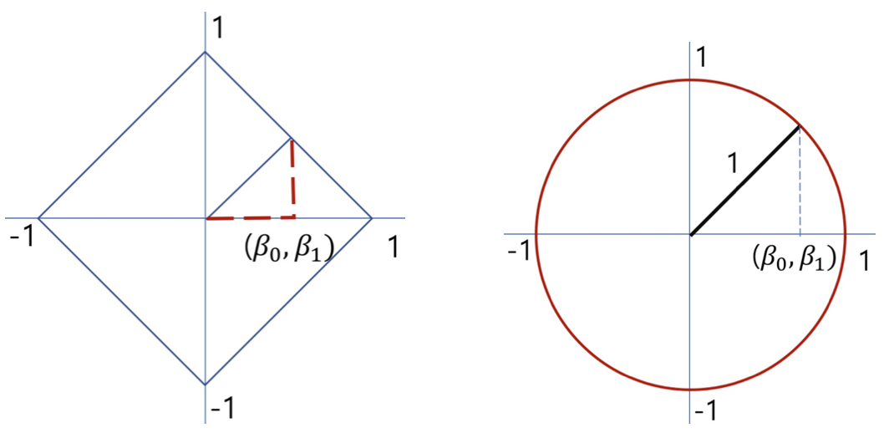{fig-align="center" width="40%"}

```python
import numpy as np
A = np.array([[1,2,3], [4,5,7],[8,9,10]])
# L1 norm (Manhattan)
np.linalg.norm(A, axis=1, ord=1)
```
【결과】 array([ 6., 16., 27.])

```python
# L2 norm (Euclidean)
np.linalg.norm(A, axis=1, ord=2)
```
【결과】 array([ 3.74165739,  9.48683298, 15.65247584])

##### \(3) 평균 제곱근 (RMS)

$$rms(x) = \frac{\|x\|}{\sqrt{n}} = \sqrt{\frac{1}{n}\sum x_i^2}$$

데이터 크기를 정량화하는 데 사용되며 데이터의 평균적인 크기를 나타낸다.

##### \(4) 두 벡터의 합의 놈

$$\|x + y\|^2 = \|x\|^2 + 2x^T y + \|y\|^2$$

##### \(5) Chebyshev 부등식

::: {.callout-important}
**Chebyshev 부등식**

차수 $n$-벡터 $x$에서 $x_i^2 \geq a^2$을 만족하는 원소 개수를 $k$라 하면, $\|x\|^2 = x_1^2 + \cdots + x_n^2 \geq ka^2$이다. 따라서:

$$k \leq \frac{\|x\|^2}{a^2}, \qquad \frac{k}{n} \leq \left(\frac{rms(x)}{a}\right)^2$$

왼쪽 항은 벡터의 성분 중 절대값이 최소한 $a$ 이상인 성분의 비율을 나타낸다. 예를 들어, 벡터의 성분 중 1/25 = 4% 이상은 RMS 값의 5배를 초과할 수 없다.
:::

---

### Chapter 4. 벡터간 거리

#### 1. 유클리디안 거리

##### \(1) 정의

::: {.callout-note}
**유클리디안 거리**

차수가 동일한 두 벡터 $(a, b)$의 유클리디안 거리는 다음과 같이 정의된다.

$$dist(a, b) = \|a - b\| = \|b - a\| = \sqrt{(a_1-b_1)^2 + (a_2-b_2)^2 + \cdots + (a_n-b_n)^2}$$

두 벡터의 RMS 편차: $\dfrac{\|x - y\|}{\sqrt{n}}$
:::

::: {.callout-tip}
**【예제】**

$$a = \left[\begin{array}{r} 0 \\ -1 \\ 1 \end{array}\right], \quad b = \left[\begin{array}{r} 1 \\ -2 \\ 1 \end{array}\right], \quad c = \left[\begin{array}{r} 1 \\ 0 \\ 3 \end{array}\right]$$

$$dist(a,b) = \sqrt{2}, \quad dist(b,c) = 2.8284$$
:::

```python
import numpy as np
a = np.array([[0],[-1],[1]])
b = np.array([[1],[-2],[1]])
c = np.array([[1],[0],[3]])
np.linalg.norm(a-b), np.linalg.norm(b-c)
```
【결과】 (np.float64(1.4142135623730951), np.float64(2.8284271247461903))

##### \(2) 활용

| 활용 | 수식 | 설명 |
|------|------|------|
| Feature 거리 | $\|x - y\|$ | 두 개체의 유사성 척도 |
| Nearest Neighbor | $\|x - z_i\|$ | k-means 군집화 |
| RMS 예측오차 | $rms(y - \hat{y})$ | 예측 정확도 척도 |

```python
import numpy as np
from sklearn.neighbors import KNeighborsClassifier
from sklearn.feature_extraction.text import TfidfVectorizer
texts = ["I love this product", "This is terrible", "Absolutely fantastic", "Not good at all"]
labels = [1, 0, 1, 0]
vectorizer = TfidfVectorizer()
X = vectorizer.fit_transform(texts)
knn = KNeighborsClassifier(n_neighbors=1, metric='euclidean')
knn.fit(X, labels)
new_text = ["I hate this product"]
new_vector = vectorizer.transform(new_text)
prediction = knn.predict(new_vector)
print(f"Prediction: {'Positive' if prediction[0] == 1 else 'Negative'}")
```
【결과】 Prediction: Positive

##### \(3) 삼각 부등식

$$\|a - c\| \leq \|a - b\| + \|b - c\|$$

##### \(4) Triangle 부등식

$$\|a + b\|^2 \leq (\|a\| + \|b\|)^2$$

##### \(5) 맨해튼 거리 (Manhattan Distance)

$$d(\mathbf{a}, \mathbf{b}) = \sum_{i=1}^{n} |a_i - b_i|$$

맨해튼 거리는 그리드 기반 공간에서 이동하는 경우에 적합하다. 도로망이 격자 형태로 이루어진 맨해튼 도시 구조에서 유래되었다.

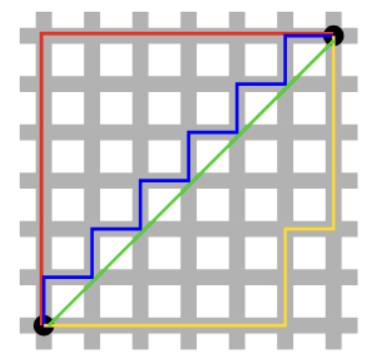{fig-align="center" width="20%"}

#### 2. 유클리디안 거리와 통계

##### \(1) De-meaned 벡터

【recall】 차수 $n$-벡터 $x_n$, 평균은 $avg(x) = (\mathbf{1}_n^T x)/n = \bar{x}$

::: {.callout-note}
**De-meaned 벡터**

$$\tilde{x} = x - avg(x)\mathbf{1}_n$$

벡터의 각 원소에서 평균을 뺀 벡터이다.

**성질:** $avg(\tilde{x}) = 0$
:::

**활용:**

- **통계 분석:** 분산이나 공분산과 같은 통계적 특성을 더 명확하게 분석할 수 있다.
- **PCA:** 데이터의 분산을 분석하기 전에 데이터를 중심에 맞추기 위해 사용된다.
- **회귀 분석:** 독립 변수와 종속 변수의 평균을 제거하여 상수항 없이 회귀 모델을 구축할 수 있다.

##### \(2) 표준편차 (Standard Deviation)

$$std(x) = \sqrt{\frac{(x_1 - avg(x))^2 + (x_2 - avg(x))^2 + \cdots + (x_n - avg(x))^2}{n}} = \frac{\|x - (\mathbf{1}^T x/n)\mathbf{1}\|}{\sqrt{n}}$$

【응용】 투자에서 평균은 일정 기간 평균 수익률, 표준편차는 위험 척도이다.

**표준편차 성질**

| 성질 | 수식 |
|------|------|
| 상수 덧셈 불변 | $std(x + a\mathbf{1}) = std(x)$ |
| 스칼라 곱 | $std(kx) = |k| \cdot std(x)$ |
| 분산 관계 | $std(x)^2 = var(x)$ |
| RMS·평균 관계 | $std(x)^2 = rms(x)^2 - avg(x)^2$ |

::: {.callout-important}
**Chebyshev 부등식 (통계 버전)**

차원 $n$-벡터에서 $|x_i - avg(x)| \geq a$을 만족하는 원소 개수를 $k$라 하면:

$$\frac{k}{n} \leq \left(\frac{std(x)}{a}\right)^2$$

평균으로부터 $k$ 표준편차 이내에 있는 성분 비율은 최소 $1 - \dfrac{1}{k^2}$이다.

$$P(|X - \mu| > k\sigma) \leq \frac{1}{k^2}$$

예: 투자 평균 수익률 8%, 리스크(표준편차) 3%인 경우, 손실 또는 16% 이상 수익을 기록한 기간의 비율은 최대 $(3/8)^2 = 14.1\%$이다.
:::

##### \(3) 실증적 규칙 (Empirical Rule)

| $k$ | 실증적 규칙 | Chebyshev 규칙 |
|-----|------------|----------------|
| 1 | 68.3% | — (보장 없음) |
| 2 | 95.4% | ≥ 75% |
| 3 | 99.7% | ≥ 88.9% |

| 특징 | 실증적 규칙 | Chebyshev 규칙 |
|------|-----------|----------------|
| 분포 가정 | 정규분포에만 적용 | 모든 분포에 적용 |
| 그래프 모양 | 종형 곡선(정규분포) | 정규·비대칭·멀티모달 등 |
| 보장 수준 | 정확한 비율 | 최솟값 보장 (보수적) |

#### 3. 거리와 개체 군집화

##### \(1) 개념

$N$개의 차수 $n$-벡터 $(x_1, x_2, \ldots, x_N)$에 대하여 각 벡터(개체) 쌍 사이의 거리로 측정하여 서로 가까운 개체를 클러스터로 묶는 작업이다. 클러스터링의 목표는 벡터들을 $k$개의 클러스터로 묶어, 각 클러스터 내의 벡터들이 서로 가깝도록 하는 것이다. 다음은 $n = 2$(군집변수 2개), $k = 3$으로 클러스터링한 사례이다.

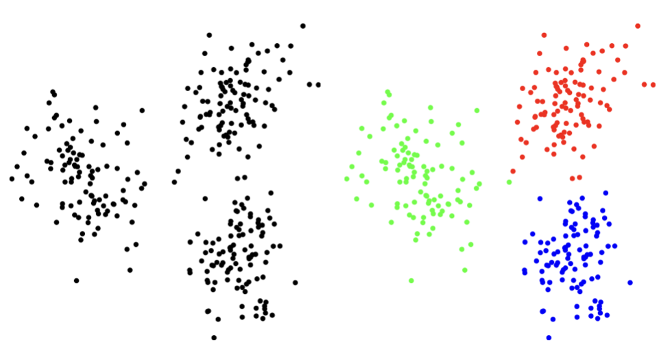{fig-align="center" width="40%"}

##### \(2) 클러스터 할당

$N$개 개체, $x_i$를 개체($i = 1, 2, \ldots, N$), $c_i$는 $i$-개체가 할당된 클러스터($j = 1, 2, \ldots, k$), $G_j$을 $j$-클러스터에 속한 개체의 집합이라 하면:

$$G_j = \{i \mid c_i = j\}$$

클러스터를 대표하는 차수 $n$-벡터를 $z_1, z_2, \ldots, z_k$라 하면, $i$-개체가 $j = c_i$에 있다면 $\|x_i - z_{c_i}\|$은 모든 클러스터 중 가장 가까워야 한다.

##### \(3) 클러스터 목적함수

$$J^{clust} = \frac{\|x_1 - z_{c_1}\| + \|x_2 - z_{c_2}\| + \cdots + \|x_N - z_{c_N}\|}{N}$$

이 함수를 최소화하는 $z_{c_1}, z_{c_2}, \ldots, z_{c_N}$을 구한다.

##### \(4) 최적 클러스터링

목적함수 $J^{clust}$를 최소화하는 것은 개체 수가 많고 차원이 커지면 계산 횟수가 기하급수적으로 늘어나 불가능하다. 그러므로 차선(sub-optimal) 방법으로 대표 벡터를 고정화하는 **k-평균 방법**을 사용한다.

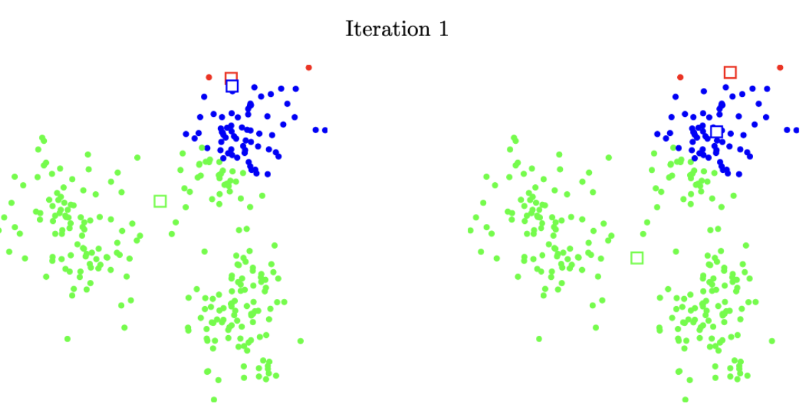{fig-align="center" width="40%"}

#### 4. k-means 알고리즘

##### \(1) 개념

클러스터 대표자를 선택하고 클러스터 할당을 반복하는 k-means 알고리즘은 1957년 Stuart Lloyd와 Hugo Steinhaus에 의해 독립적으로 처음 제안되어 Lloyd 알고리즘이라고도 불린다.

##### \(2) k-평균 알고리즘

$N$개 개체를 $k$개 클러스터로 분류한다고 가정하자. $z_1, z_2, \ldots, z_k$을 각 클러스터의 대표 벡터라 하면, k-평균 알고리즘은 다음 작업을 반복한다.

::: {.callout-note}
**k-means 알고리즘 단계**

1. 대표 벡터를 결정하고 각 개체를 가장 가까운 대표 벡터의 클러스터로 분류한다.
2. 클러스터에 할당된 개체의 중심점(평균 벡터)을 대표 벡터로 설정한다.
3. 수렴 조건을 만족할 때까지 위의 작업을 반복한다.
:::

##### \(3) 이슈사항

| 이슈 | 내용 |
|------|------|
| **타이 브레이커** | 두 개 이상의 클러스터와 최소 거리인 개체는 클러스터 할당을 하지 않음 |
| **수렴 조건** | 개체의 클러스터 이동이 더 이상 발생하지 않으면 수렴 |
| **$k$ 결정** | Elbow Method를 사용하여 $(k, J^{clust})$ 꺾이는 지점 선택 |
| **대표벡터 해석** | 군집에 속한 개체의 특성으로 이름을 부여하고 해석 |

**고정 대표 벡터 분할하기:** $z_1, z_2, \ldots, z_j$를 고정하면 최적 클러스터링 문제는 다음과 같다.

$$\|x_i - z_{c_i}\| = \min_{j=1,2,\ldots,k} \|x_i - z_j\|$$

$$J^{clust} = \frac{\min_{j} \|x_1 - z_j\| + \cdots + \min_{j} \|x_N - z_j\|}{N}$$

고정 벡터를 group (or cluster) centroid라 한다.

##### \(4) 사례

```python
# 60000(train)/10000(test), 28x28
import numpy as np
import matplotlib.pyplot as plt
from tensorflow.keras.datasets import mnist
(x_train, y_train), (x_test, y_test) = mnist.load_data()
print(f"x_train shape: {x_train.shape}")
print(f"y_train shape: {y_train.shape}")
print(f"x_test shape: {x_test.shape}")
print(f"y_test shape: {y_test.shape}")
num_samples = 10
plt.figure(figsize=(10, 1))
for i in range(num_samples):
    plt.subplot(1, num_samples, i+1)
    plt.imshow(x_train[i], cmap='gray')
    plt.title(y_train[i])
    plt.axis('off')
plt.show()
```
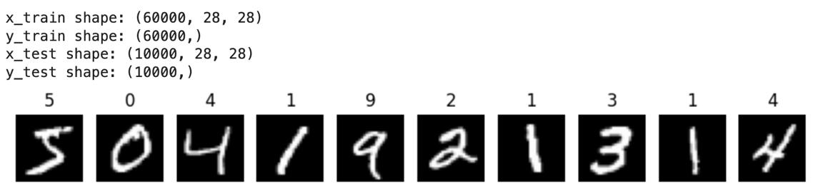{fig-align="center" width="40%"}

```python
# 훈련 데이터 클러스터링, 첫 20개 군집결과
x_train2 = x_train.reshape((x_train.shape[0], -1))
x_test2 = x_test.reshape((x_test.shape[0], -1))
x_train2 = x_train2 / 255.0
x_test2 = x_test2 / 255.0
kmeans = KMeans(n_clusters=10, random_state=42)
kmeans.fit(x_train2)
y_kmeans = kmeans.predict(x_train2)
num_samples = 20
plt.figure(figsize=(10, 1))
for i in range(num_samples):
    plt.subplot(1, num_samples, i+1)
    plt.imshow(x_train[i], cmap='gray')
    plt.title(y_kmeans[i])
    plt.axis('off')
plt.show()
```
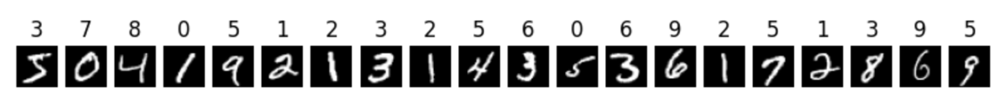{fig-align="center" width="40%"}

10개 클러스터명은 임의로 정해져 숫자와 매칭이 되지 않는다. 클러스터에 속한 이미지를 이용하여 결정한다.

```python
# 클러스터 3 평균벡터 출력
plt.figure(figsize=(10, 1))
plt.imshow((x_train[0]+x_train[7]+x_train[17])/3, cmap='gray')
plt.title('cluster 3')
plt.axis('off')
plt.show()
```
{fig-align="center" width="40%"}

#### 5. 벡터의 각도

##### \(1) 코사인 유사도

::: {.callout-note}
**코사인 유사도 (Cosine Similarity)**

두 벡터 간의 방향적 유사성을 측정하는 지표로, 벡터 간의 각도 $\theta$의 코사인 값으로 계산된다.

$$\text{Cosine Similarity} = \cos(\theta) = \frac{\mathbf{A} \cdot \mathbf{B}}{\|\mathbf{A}\| \|\mathbf{B}\|}$$

**값의 범위:** $[-1, 1]$

| 값 | 의미 |
|----|------|
| $\cos(\theta) = 1$ | 두 벡터가 완전히 같은 방향 |
| $\cos(\theta) = 0$ | 두 벡터가 직교 (90도) |
| $\cos(\theta) = -1$ | 두 벡터가 완전히 반대 방향 |
:::

코사인 유사도와 유클리드 거리의 차이:

- **코사인 유사도:** 두 벡터의 방향에 집중하며, 벡터 크기의 차이를 무시한다.
- **유클리드 거리:** 두 벡터 사이의 실제 거리(크기 차이 포함)를 측정한다.

【예제】

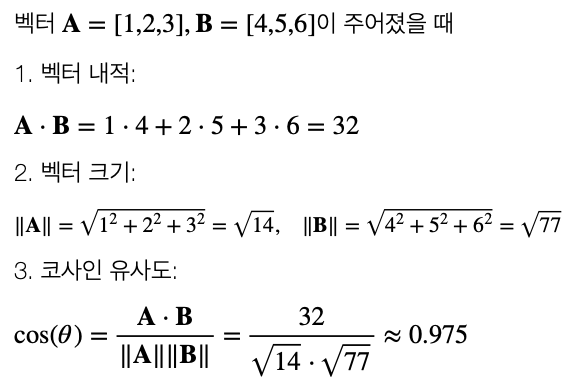{fig-align="center" width="60%"}

##### \(2) 코사인 유사도의 특징

코사인 유사도는 벡터의 크기가 아닌 방향만 고려되므로 벡터를 정규화하지 않고도 비교할 수 있다. 고차원 벡터에도 적용 가능하여 텍스트 데이터, 추천 시스템, 정보 검색, 클러스터링 등에서 널리 사용된다.

**각도 종류**

| 각도 | 관계 |
|------|------|
| $\theta = 90° = \pi/2$ | 직교 (orthogonal) |
| $\theta = 0°$ | 정렬 (aligned) |
| $\theta = 180° = \pi$ | 역정렬 (anti-aligned) |
| $\theta > 90°$ | 둔각 (obtuse) |
| $\theta < 90°$ | 예각 (acute) |

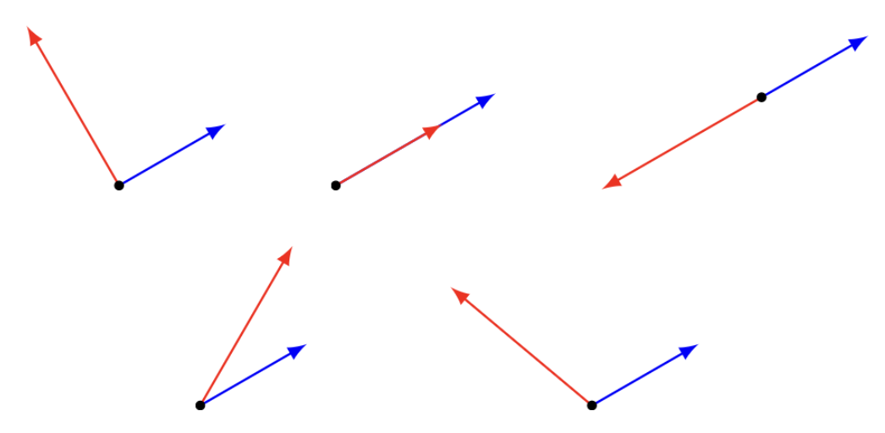{fig-align="center" width="40%"}

**두 벡터 합의 놈과 각도**

$$\|x + y\|^2 = \|x\|^2 + 2\|x\|\|y\|\cos(\theta) + \|y\|^2$$

만약 $\theta = 90° = \pi/2$이면 $\|x + y\|^2 = \|x\|^2 + \|y\|^2$ (피타고라스 정리)

#### 6. 상관계수

##### \(1) 상관계수 정의

::: {.callout-note}
**상관계수 (Correlation Coefficient)**

$\tilde{a} = a - avg(a)\mathbf{1}$, $\tilde{b} = b - avg(b)\mathbf{1}$이면, 상관계수 $\rho$는 다음과 같이 정의된다.

$$\rho = \frac{\tilde{a}^T \tilde{b}}{\|\tilde{a}\| \|\tilde{b}\|} = \left(\frac{\tilde{a}}{std(a)}\right)^T \left(\frac{\tilde{b}}{std(b)}\right) \bigg/ n$$
:::

| 관계 | 수식 |
|------|------|
| 공분산 | $cov(a,b) = \tilde{a}^T \tilde{b}/n$ |
| 분산 | $var(a) = std(a)^2$ |
| 상관-공분산 관계 | $cov(a,b) = \rho \cdot std(a) \cdot std(b)$ |
| 완전 상관 | $\rho = \pm 1$: 두 벡터가 (역)정렬 |
| 독립 | $\rho = 0$: 두 벡터가 직교, $cov(a,b) = 0$ |

##### \(2) 두 벡터 합의 분산

$$var(a + b) = var(a) + 2\rho \cdot std(a) \cdot std(b) + var(b)$$

| 조건 | 결과 |
|------|------|
| $\rho = 0$ | $var(a+b) = var(a) + var(b)$ |
| $\rho = 1$ | $var(a+b) = (std(a) + std(b))^2$ |
| $\rho = -1$ | $var(a+b) = (std(a) - std(b))^2$ |

##### \(3) 헤징 (Hedging) 투자

두 개 회사 주가 벡터 $(a, b)$의 평균은 $\mu$, 표준편차(위험) $\sigma$, 상관계수 $\rho$이다. 각각 50% 투자, $c = (a+b)/2$의 평균 수익률과 표준편차는 다음과 같다.

| 지표 | 수식 |
|------|------|
| 평균 | $avg\!\left(\frac{a+b}{2}\right) = \mu$ |
| 표준편차 | $std(c) = \sigma\sqrt{(1+\rho)/2}$ |
| $\rho = 0$ (독립) | 표준편차가 $\frac{1}{\sqrt{2}}$만큼 감소 |
| $\rho = 1$ (완전상관) | 표준편차는 동일 |

---

### Chapter 5. 선형독립

#### 1. 선형독립 정의

##### \(1) 선형 종속 (Linear Dependence)

::: {.callout-note}
**선형 종속 정의**

$k \geq 2$개의 크기 $n$-벡터 $x_1, x_2, \ldots, x_k$가 다음을 만족하면 **선형종속**이라 한다.

$$a_1 x_1 + a_2 x_2 + \cdots + a_k x_k = 0$$

을 만족하는 $a_i$가 적어도 하나는 0이 아니다.

선형종속이면 적어도 하나의 $a_i$는 0이 아니므로 벡터 $x_k$는 다른 벡터의 선형함수로 표현될 수 있다:

$$x_k = \frac{-a_1}{a_i}x_1 + \cdots + \frac{-a_{i-1}}{a_i}x_{i-1} + \frac{-a_{i+1}}{a_i}x_{i+1} + \cdots + \frac{-a_{k-1}}{a_i}x_{k-1}$$
:::

::: {.callout-tip}
**【예제】** 선형 종속

$$x_1 = \left[\begin{array}{r} 0 \\ -1 \\ 1 \end{array}\right], \quad x_2 = \left[\begin{array}{r} 1 \\ -2 \\ 1 \end{array}\right], \quad x_3 = \left[\begin{array}{r} 1 \\ 0 \\ -1 \end{array}\right]$$

$-2x_1 + x_2 - x_3 = 0$ $\implies$ 선형종속
:::

##### \(2) 선형 독립 (Linear Independence)

::: {.callout-note}
**선형 독립 정의**

만약 $a_1 x_1 + a_2 x_2 + \cdots + a_k x_k = 0$이 모든 $a_k = 0$일 때만 만족한다면, $n$-벡터 $x_1, x_2, \ldots, x_k$를 **선형독립**이라 한다.
:::

::: {.callout-tip}
**【예제】** 선형 독립

$$x_1 = \left[\begin{array}{r} 1 \\ 0 \\ 0 \end{array}\right], \quad x_2 = \left[\begin{array}{r} 0 \\ -1 \\ 1 \end{array}\right], \quad x_3 = \left[\begin{array}{r} -1 \\ 1 \\ 1 \end{array}\right]$$

이 세 벡터는 선형독립이다.
:::

##### \(3) 선형독립 벡터의 선형결합

::: {.callout-note}
**유일성 정리**

선형독립인 $x_1, x_2, \ldots, x_k$의 선형결합 $x = a_1 x_1 + a_2 x_2 + \cdots + a_k x_k$의 모든 계수 $a_k$는 **유일하다**.
:::

【증명】 다른 계수를 $b_k$라 하자. $x = b_1 x_1 + \cdots + b_k x_k$이면, $0 = (a_1 - b_1)x_1 + \cdots + (a_k - b_k)x_k$이다. $x_1, \ldots, x_k$가 선형독립이므로 모든 $(a_i - b_i) = 0$이 만족한다.

#### 2. 기저

##### \(1) 기저 개념

::: {.callout-note}
**기저 (Basis)**

특정 벡터 공간의 **기저**는 그 공간 안의 모든 벡터들을 생성할 수 있는 최소한의 독립적인 벡터들의 집합이다.

예: 2차원 공간에서의 기저 — $(1, 0)$과 $(0, 1)$ (기저는 유일하지 않음)
:::

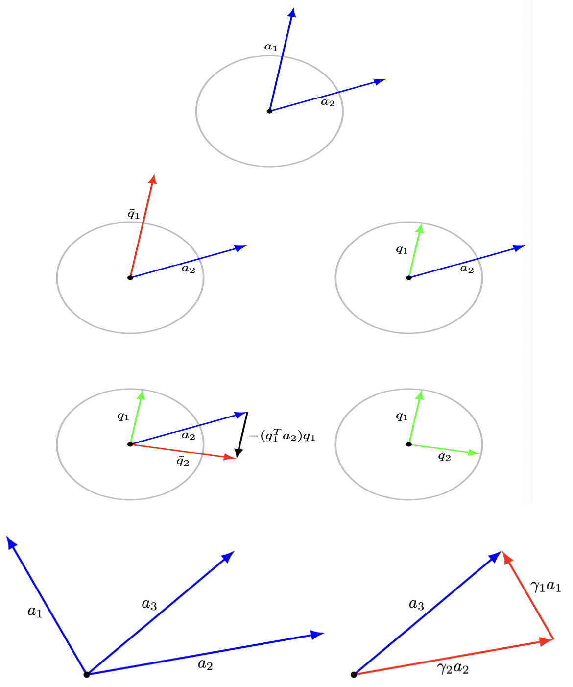{fig-align="center" width="60%"}

크기 2인 벡터의 기저 벡터는 $k = 2$개이다. 위 그림에서 $a_3$벡터는 기저 벡터 $(a_1, a_2)$의 선형결합으로 만들 수 있다.

##### \(2) 기저 정의

::: {.callout-note}
**기저 정의**

$n$개의 선형독립인 크기 $n$-벡터를 **기저(basis)**라 한다. $n$-벡터 $(x_1, x_2, \ldots, x_n)$가 기저이면, 모든 크기 $n$-벡터는 $(x_1, x_2, \ldots, x_n)$의 선형결합으로 표현할 수 있다.
:::

【증명】 $(n+1)$개 차원 $n$-벡터 $(x_1, x_2, \ldots, x_n, y)$가 있다고 가정하자. $(x_1, x_2, \ldots, x_n)$은 선형독립이며 기저이다. 이들 벡터는 선형종속(차원 개수 $n$보다 벡터 개수가 $n+1$로 크다)이므로 다음을 만족하는 모든 $a_i$가 0은 아니다:

$$a_1 x_1 + a_2 x_2 + \cdots + a_n x_n + a_{n+1} y = 0$$

만약 $a_{n+1} = 0$이면, $a_1 x_1 + \cdots + a_n x_n = 0$을 만족하는 모든 $a_i = 0$이다. 왜냐하면 $(x_1, x_2, \ldots, x_n)$은 선형독립이기 때문이다. (모순)

#### 3. 직교정규

##### \(1) 정의

::: {.callout-note}
**직교정규 (Orthonormal)**

만약 $\|x_i\| = 1$이고 $x_i^T x_j = 0 \text{ for } i \neq j$(두 벡터 $(x_i, x_j)$는 직교)이면, $(x_1, x_2, \ldots, x_k)$ 벡터 집합은 **직교정규(orthonormal)** 벡터라고 한다.

직교정규성은 선형종속·선형독립처럼 [집합의 속성]{.underline}이지 개별 벡터의 속성은 아니다.
:::

##### \(2) 예제

- $n$개의 단위벡터는 직교정규 벡터이다.

- 직교정규벡터의 예:

$$\left[\begin{array}{r} -1 \\ 0 \\ 0 \end{array}\right], \qquad \frac{1}{\sqrt{2}}\left[\begin{array}{r} 0 \\ 1 \\ 1 \end{array}\right], \qquad \frac{1}{\sqrt{2}}\left[\begin{array}{r} 0 \\ -1 \\ 1 \end{array}\right]$$

- 직교정규 벡터는 선형독립이다.

##### \(3) 직교정규 성질

::: {.callout-note}
**직교정규 성질**

1. 벡터 $x$가 직교정규 벡터의 선형결합 $x = a_1 x_1 + a_2 x_2 + \cdots + a_k x_k$이면, 내적을 이용하여 계수를 얻을 수 있다:

$$x_i^T x = a_i$$

2. $(x_1, x_2, \ldots, x_k)$가 직교정규 벡터이면:

$$x = (x_1^T x)x_1 + (x_2^T x)x_2 + \cdots + (x_k^T x)x_k$$
:::

::: {.callout-tip}
**【예제】** 직교정규 선형결합

벡터 $(1, 2, 3)$을 직교정규 벡터의 선형결합으로 표현하자.

$$\left[\begin{array}{r} 1 \\ 2 \\ 3 \end{array}\right] = 1\left[\begin{array}{r} 1 \\ 0 \\ 0 \end{array}\right] + 2\left[\begin{array}{r} 0 \\ 1 \\ 0 \end{array}\right] + 3\left[\begin{array}{r} 0 \\ 0 \\ 1 \end{array}\right]$$

$$[-1\ 0\ 0]\left[\begin{array}{r} 1 \\ 2 \\ 3 \end{array}\right] = -1, \quad \frac{1}{\sqrt{2}}[0\ 1\ 1]\left[\begin{array}{r} 1 \\ 2 \\ 3 \end{array}\right] = \frac{5}{\sqrt{2}}, \quad \frac{1}{\sqrt{2}}[0\ {-1}\ 1]\left[\begin{array}{r} 1 \\ 2 \\ 3 \end{array}\right] = \frac{1}{\sqrt{2}}$$

$$\left[\begin{array}{r} 1 \\ 2 \\ 3 \end{array}\right] = -1\left[\begin{array}{r} -1 \\ 0 \\ 0 \end{array}\right] + \frac{5}{2}\left[\begin{array}{r} 0 \\ 1 \\ 1 \end{array}\right] + \frac{1}{2}\left[\begin{array}{r} 0 \\ -1 \\ 1 \end{array}\right]$$
:::

#### 4. Gram-Schmidt 알고리즘

##### \(1) 개념

::: {.callout-note}
**Gram-Schmidt 알고리즘**

$n$-벡터 $x_1, x_2, \ldots, x_k$가 선형독립인지 여부를 결정하고, 선형독립이라면 직교정규 벡터 $q_1, q_2, \ldots, q_k$를 생성하는 알고리즘이다. (수학자 Gram과 Schmidt의 이름을 따서 명명)

**속성:**

1. 각 $i = 1, 2, \ldots, k$에서 $x_i$는 $q_1, q_2, \ldots, q_i$의 선형결합이다.
2. 각 $i = 1, 2, \ldots, k$에서 $q_i$는 $x_1, x_2, \ldots, x_i$의 선형결합이다.
3. 만약 $x_1, \ldots, x_{i-1}$은 선형독립이나 $x_1, \ldots, x_i$는 선형종속이면 멈춘다.
:::

##### \(2) 알고리즘

::: {.callout-note}
**Gram-Schmidt 단계** ($i = 1, 2, \ldots, k$)

1. **직교화:**
$$\tilde{q}_i = x_i - (q_1^T x_i)q_1 - \cdots - (q_{i-1}^T x_i)q_{i-1}$$

2. **선형종속 검증:** 만약 $\tilde{q}_i = 0$이면, 멈춘다.

3. **정규화:**
$$q_i = \frac{\tilde{q}_i}{\|\tilde{q}_i\|}$$
:::

이렇게 얻은 $q_1, q_2, \ldots, q_i$는 직교정규 벡터이다. 알고리즘이 중간에 중단되면 기저벡터가 아니다.

##### \(3) Gram-Schmidt 알고리즘 예제

::: {.callout-tip}
**【예제】**

$x_1 = (-1, 1, -1, 1)$, $x_2 = (-1, 3, -1, 3)$, $x_3 = (1, 3, 5, 7)$에 Gram-Schmidt 알고리즘을 적용하자.

**i = 1**

$\|\tilde{q}_1\| = 2$이므로:
$$q_1 = \frac{\tilde{q}_1}{\|\tilde{q}_1\|} = \left[\begin{array}{r} -1/2 \\ 1/2 \\ -1/2 \\ 1/2 \end{array}\right]$$

**i = 2**

$q_1^T x_2 = 4$이므로:
$$\tilde{q}_2 = x_2 - (q_1^T x_2)q_1 = \left[\begin{array}{r} 1 \\ 1 \\ 1 \\ 1 \end{array}\right], \quad \|\tilde{q}_2\| = 2$$

$$q_2 = \frac{\tilde{q}_2}{\|\tilde{q}_2\|} = \left[\begin{array}{r} 1/2 \\ 1/2 \\ 1/2 \\ 1/2 \end{array}\right]$$

**i = 3**

$q_1^T x_3 = 2$, $q_2^T x_3 = 8$이므로:
$$\tilde{q}_3 = x_3 - (q_1^T x_3)q_1 - (q_2^T x_3)q_2 = \left[\begin{array}{r} -2 \\ -2 \\ 2 \\ 2 \end{array}\right], \quad \|\tilde{q}_3\| = 4$$

$$q_3 = \frac{\tilde{q}_3}{\|\tilde{q}_3\|} = \left[\begin{array}{r} -1/2 \\ -1/2 \\ 1/2 \\ 1/2 \end{array}\right]$$
:::

```python
import numpy as np

def gram_schmidt(A):
    n, k = A.shape
    Q = np.zeros((n, k))
    for j in range(k):
        v = A[:, j]
        for i in range(j):
            v -= np.dot(Q[:, i], A[:, j]) * Q[:, i]
        Q[:, j] = v / np.linalg.norm(v)
    return Q

A = np.array([[-1,-1,1],
              [1,3,3],
              [-1,-1,5],
              [1,3,7]], dtype=float)

gram_schmidt(A)
```
【결과】 array([[-0.5,  0.5, -0.5],
       [ 0.5,  0.5, -0.5],
       [-0.5,  0.5,  0.5],
       [ 0.5,  0.5,  0.5]])
