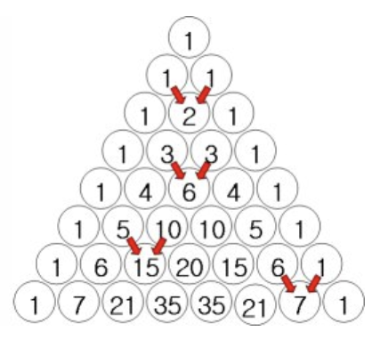
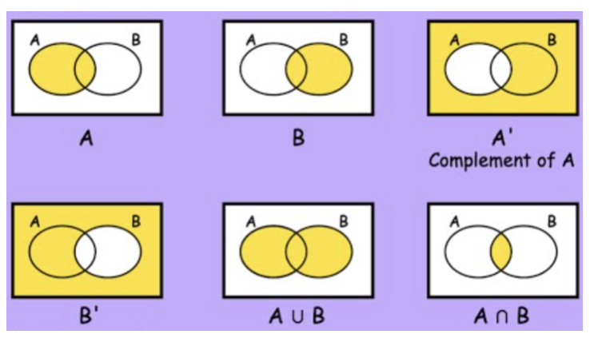
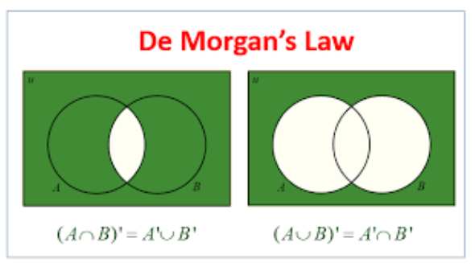
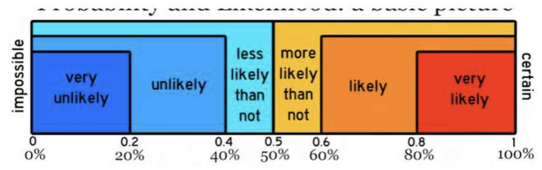
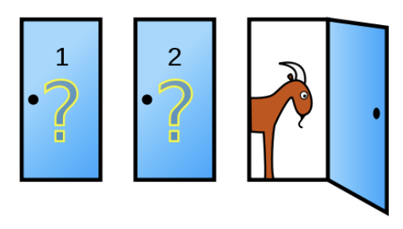
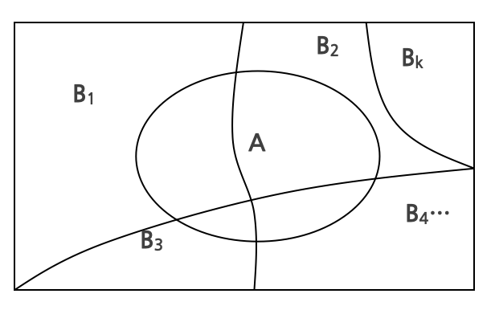
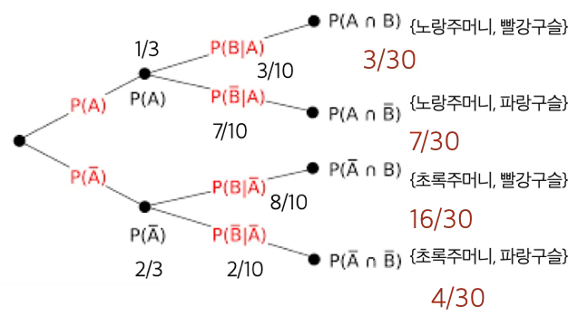
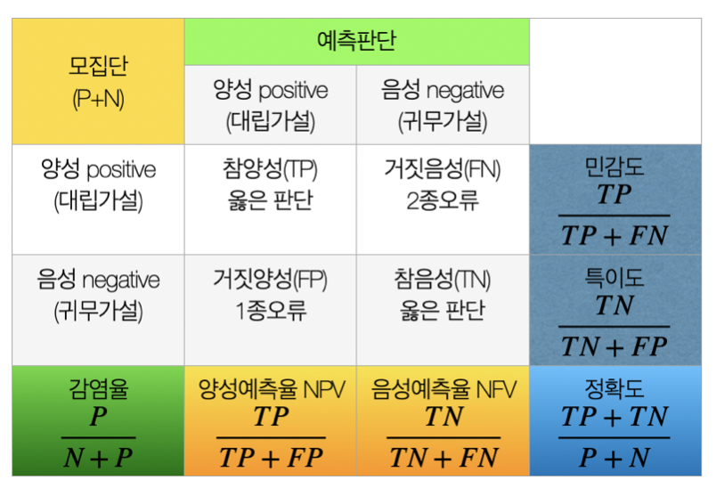

### Chapter 1. 집합론

#### 1. 확률론이란?

파스칼의 삼각형은 숫자를 삼각형 모양으로 배열하여 이항 계수를 나타내는 도형이다. 각 행의 숫자는 조합의 개수를 의미하며, 위에서부터 차례로 0행, 1행, 2행 등으로 번호를 매긴다. 특정 행의 각 항은 바로 위 행의 두 항을 더한 값으로 계산된다.

이 삼각형은 프랑스의 수학자 블레즈 파스칼의 이름을 따서 불리지만, 그 기원은 훨씬 이전으로 거슬러 올라간다. 인도, 중국, 페르시아 등 여러 고대 문명에서도 이미 유사한 형태의 삼각형이 사용되었으며, 특히 중국에서는 '양휘삼각형'이라는 이름으로 알려져 있다.

오늘날 파스칼의 삼각형은 조합론, 확률론, 수열의 성질 분석 등 다양한 수학 분야에서 핵심적인 도구로 활용된다.

{fig-align="center" width="40%"}

이항전개 계수:

$$(a + b)^{n} = \sum_{k=0}^{n} \binom{n}{k} a^{n-k} b^{k}$$

$$\text{예: } (a + b)^{4} = a^{4} + 4a^{3}b + 6a^{2}b^{2} + 4ab^{3} + b^{4}$$

$11^{n}$의 값: $11^{3} = 1331$

7전 4선승제로 진행되는 경기에서 두 선수의 실력이 동등하다고 가정할 때, 현재 A는 1승, B는 2승을 거둔 상태에서 경기가 종료되었다고 하자. 이 경우, 남은 경기에서 A는 3번, B는 2번을 추가로 이겨야 승리할 수 있었던 상황이다.

이러한 조건에서 상금을 공정하게 배분하려면, 이후 가능한 모든 경기 결과의 경우의 수를 고려해야 한다. 이는 파스칼의 삼각형에서 5번째 행(즉, 5개의 경기가 남은 경우)에 해당하며, 그 합은 16이다.

이 중 A가 3승을 먼저 달성하는 경우는 앞쪽 2개의 항(즉, A가 이기는 모든 경우)에 해당하며, 그 합은 5이다. 반대로 B가 2승을 추가하여 먼저 4승을 달성하는 경우는 뒤쪽 3개의 항의 합이며, 이는 11이다.

따라서 A는 상금의 5/16, B는 11/16을 받는 것이 확률적으로 공정한 분배가 된다.

#### 2. 표본공간과 사건

통계분석의 주요 목표 중 하나는 실험이나 관찰을 통해 특정 집단에 대한 합리적인 결론을 도출하는 데 있다. 이를 위해서는 먼저 실험이나 조사를 통해 얻을 수 있는 모든 가능한 결과의 집합, 즉 표본공간을 명확히 정의하는 것이 출발점이다.

##### (1) 표본공간 정의

::: {.callout-note title="표본공간 (Sample Space)"}
표본공간(sample space)은 통계 실험 또는 관찰에서 발생할 수 있는 모든 가능한 결과의 집합을 의미하며, 일반적으로 $S$로 표기한다.
:::

- 동전 던지기: $S = \{H, T\}$
- 수능 점수 관찰 (10점 단위): $S = \{100, 110, \ldots, 505\}$
- 반응 시간 관찰: $S = (0, \infty)$

##### (2) 표본공간의 유형

표본공간은 원소의 개수에 따라 두 가지로 구분된다.

| 유형 | 정의 | 예 |
|------|------|-----|
| 가산(countable) | 원소가 정수 집합과 1:1 대응 가능 | 동전 던지기, SAT 점수 |
| 비가산(uncountable) | 양의 실수처럼 정수와 1:1 대응 불가 | 반응 시간 $(0,\infty)$ |

반응 시간을 가장 가까운 초 단위로 측정한다면 $S = \{0, 1, 2, 3, \ldots\}$로 가산 표본공간이 된다.

##### (3) 사건

::: {.callout-note title="사건 (Event)"}
사건(event)이란 실험에서 발생 가능한 결과들의 모임, 즉 표본공간 $S$의 임의의 부분집합을 말한다. 표본공간 $S$ 자체도 하나의 사건으로 포함된다.

어떤 사건 $A$가 표본공간 $S$의 부분집합일 때, 실험의 결과가 $A$에 속하면 사건 $A$가 **발생했다**고 한다.
:::

사건과 집합의 기본 관계:

- **포함 관계**: $A \subseteq B \Longleftrightarrow x \in A \Longrightarrow x \in B$
- **동일성**: $A = B \Longleftrightarrow A \subseteq B \text{ and } B \subseteq A$

#### 3. 집합연산

::: {.callout-note title="기본 집합 개념"}
- $\phi$: 공집합(null or empty set) — 원소가 하나도 없는 집합
- $A \subset B$: 집합 $A$의 모든 원소가 집합 $B$에 있는 경우 ($A$는 $B$의 부분집합)
- $A^{C}$ or $\overline{A}$: 집합 $A$의 여집합(complement) — $A$에 있는 원소를 제외한 표본공간의 모든 원소 ⇔ NOT
:::

{fig-align="center" width="60%"}

두 사건 $A$와 $B$에 대한 기본 집합 연산:

- $A \cup B$ **합집합(union)**: $A \cup B = \{ x : x \in A \text{ 또는 } x \in B \}$
- $A \cap B$ **교집합(intersection)**: $A \cap B = \{ x : x \in A \text{ 그리고 } x \in B \}$

::: {.callout-important title="집합 연산 법칙"}
표본공간 $S$에서 정의된 임의의 세 사건 $A, B, C$에 대해 다음이 성립한다.

| 법칙 | 수식 |
|------|------|
| 교환법칙 | $A \cup B = B \cup A$, $\quad A \cap B = B \cap A$ |
| 결합법칙 | $A \cup (B \cup C) = (A \cup B) \cup C$, $\quad A \cap (B \cap C) = (A \cap B) \cap C$ |
| 분배법칙 | $A \cap (B \cup C) = (A \cap B) \cup (A \cap C)$, $\quad A \cup (B \cap C) = (A \cup B) \cap (A \cup C)$ |
| 드모르간 법칙 | $(A \cup B)^{c} = A^{c} \cap B^{c}$, $\quad (A \cap B)^{c} = A^{c} \cup B^{c}$ |
:::

{fig-align="center" width="60%"}

무한 집합 연산 (집합 $A_1, A_2, A_3, \ldots$가 표본공간 $S$ 위에 정의된 경우):

$$\bigcup_{i=1}^{\infty} A_i = \{ x \in S : x \in A_i \text{ for some } i \}$$

$$\bigcap_{i=1}^{\infty} A_i = \{ x \in S : x \in A_i \text{ for all } i \}$$

::: {.callout-tip title="예제: 집합 연산"}
주사위를 한 번씩 두 번 던져 나타난 합으로 표본공간을 정의하자.

$S = \{2, 3, 4, 5, 6, 7, 8, 9, 10, 11, 12\}$

집합 $A = \{$두 번째 주사위 눈금이 짝수$\}$, $B = \{$두 주사위 눈금의 합이 짝수$\}$, $C = \{$두 주사위 눈금 중 적어도 하나가 홀수$\}$라 정의할 때 $B^{C}, A \cup B, A \cap B^{C}, A^{C} \cap C$를 구하라.

$A = \{ 3, 4, 5, 6, 7, 8, 9, 10, 11 \}$, $B = \{ 2, 4, 6, 8, 10, 12 \}$, $C = \{ 2, 3, 4, 5, 6, 7, 8, 9, 10, 11 \}$

**풀이:**

$A^{c} = \{2, 12\}$, $B^{c} = \{3, 5, 7, 9, 11\}$

$$A \cup B = S, \quad A \cap B^{c} = \{3, 5, 7, 9, 11\}, \quad A^{C} \cap C = \{2\}$$
:::

#### 4. 상호 배타적 사건

::: {.callout-note title="상호 배타적 사건 (Mutually Exclusive Events)"}
만약 $A \cap B = \varnothing$이면, 두 사건 $A$와 $B$는 **서로소(disjoint)** 또는 **상호 배타적(mutually exclusive)**이라 한다.

$A_i \cap A_j = \varnothing$ for all $i \neq j$이면 사건 $A_1, A_2, \ldots$는 **쌍별로 서로소**라 한다.

$A_1, A_2, \ldots$가 쌍별로 서로소이고 $\bigcup_{i=1}^{\infty} A_i = S$이면, 이 집합 모음은 $S$의 **분할(partition)**을 이룬다.
:::

**유용한 사례:** 집합 $A_i = [i, i+1)$은 $[0, \infty)$의 분할을 이룬다.

---

### Chapter 2. 확률론 기초

확률 실험(probability experiment)이란 특정 조건 하에서 수행되며, 그 결과가 미리 확정되어 있지 않은 실험이다. 이러한 실험은 불확정성, 반복 가능성, 확률적 설명 가능성이라는 세 가지 특징을 갖는다.

확률은 관심 사건이 일어날 **가능성(chance or likelihood)**을 0과 1 사이의 숫자로 표현한다. 확률이 0이면 해당 사건은 절대로 발생하지 않음을 의미하고, 확률이 1이면 항상 발생함을 뜻한다.

결국 확률은 불확실성을 수치화하여 미래를 예측하고 의사결정을 도울 수 있도록 하는 도구라 할 수 있다.

#### 1. 확률 측정

{fig-align="center" width="80%"}

##### 상대 빈도 (Relative Frequency)

동전을 무한히 반복해서 던지면 상대빈도가 일정한 값에 수렴하며, 이를 해당 사건의 확률로 정의한다.

$$P(A) = \lim_{n \to \infty} \frac{f}{n}$$

여기서 $n$은 실험 횟수, $f$는 사건 $A$가 발생한 횟수이다.

| 실험자 | 시행 횟수 | 앞면 횟수 | $P$(앞면) |
|--------|-----------|-----------|-----------|
| Count Buffon (1707–1788) | 4,040 | 2,048 | 0.5069 |
| Karl Pearson (1900) | 24,000 | 12,012 | 0.5005 |
| John Kerrich | 10,000 | 5,067 | 0.5067 |

##### Laplace 확률 (고전적 확률)

표본공간의 각 원소들이 일어날 가능성이 같다고 가정하고 확률을 정의한다.

$$P(A) = \frac{\text{사건 } A \text{ 에 속한 원소의 수}}{\text{표본공간의 원소 수}}$$

예: 주사위에서 짝수가 나올 확률 $= \dfrac{3}{6} = 0.5$

고전적 정의는 모든 결과가 동등하게 가능하다는 **균등가능성(equally likely)** 가정에 의존한다는 점에서 현실의 복잡한 확률 현상을 설명하는 데에는 한계가 있다.

##### 공리적 정의

::: {.callout-note title="시그마 대수 (Sigma Algebra / Borel Field)"}
사건들의 집합 $\mathcal{B}$가 다음 세 조건을 만족하면 **시그마 대수(sigma algebra)** 또는 **보렐 필드(Borel field)**라 한다.

1. $\varnothing \in \mathcal{B}$
2. $A \in \mathcal{B} \Rightarrow A^{c} \in \mathcal{B}$
3. $A_1, A_2, \ldots \in \mathcal{B} \Rightarrow \bigcup_{i=1}^{\infty} A_i \in \mathcal{B}$

가장 간단한 시그마 대수: $\{\varnothing, S\}$
:::

::: {.callout-important title="Kolmogorov 공리 (확률함수 정의)"}
확률함수 $P$는 다음 세 가지 조건을 만족하는 $\mathcal{B}$ 상의 함수이다.

1. **비음성 조건**: $P(A) \geq 0 \text{ for all } A \in \mathcal{B}$
2. **정규화 조건**: $P(S) = 1$
3. **가산 가법성**: $A_1, A_2, \ldots$가 쌍별로 상호배타적이라면,
   $$P\left(\bigcup_{i=1}^{\infty} A_i\right) = \sum_{i=1}^{\infty} P(A_i)$$

**확률 공간**: $(S, \mathcal{B}, P)$ — $S$는 표본공간, $\mathcal{B}$는 시그마 대수, $P$는 확률함수
:::

#### 2. 확률정의 방법

##### (1) 유한 표본공간에서의 확률

::: {.callout-important title="정리: 유한 표본공간의 확률 정의"}
표본공간 $S = \{s_1, s_2, \ldots, s_n\}$, $p_1, p_2, \ldots, p_n \geq 0$이고 $\sum_{i=1}^{n} p_i = 1$이면:

$$P(A) = \sum_{\{i : s_i \in A\}} p_i, \qquad P(\varnothing) = 0$$

가산 집합 $S = \{s_1, s_2, \ldots\}$인 경우에도 동일하게 정의할 수 있다.
:::

**동전 던지기 예시:**

$$S = \{H, T\},\quad \mathcal{B} = \{S,\, \varnothing,\, \{H\},\, \{T\}\},\quad P(\{H\}) = 0.5$$

공정한 동전: $P(\{H\}) = P(\{T\})$. Kolmogorov 공리에 의해 $P(\{H\}) + P(\{T\}) = 1$이므로 $P(\{H\}) = P(\{T\}) = 0.5$.

##### (2) 연속 표본공간에서의 확률 (다트 게임)

다트 보드의 반지름이 $r$이고 점수 $i$에 해당하는 영역의 면적 비율로 확률을 정의한다.

$$P(\text{scoring } i \text{ points}) = \frac{\text{영역 } i \text{ 의 면적}}{\text{다트 보드 면적}}$$

$$P(\text{scoring 1 point}) = \frac{\pi r^{2} - \pi(4r/5)^{2}}{\pi r^{2}} = 1 - \left(\frac{4}{5}\right)^{2}$$

$$P(\text{scoring } i \text{ points}) = \frac{(6-i)^{2} - (5-i)^{2}}{5^{2}}, \quad i = 1, 2, \ldots, 5$$

$\pi$와 $r$은 상쇄되므로 확률은 반지름과 독립적이며, 각 영역 확률의 합은 1이다.

---

### Chapter 3. 확률 계산

#### 1. 확률계산 관련 정리

확률의 공리적 정의를 바탕으로 확률 함수의 다양한 성질을 유도할 수 있으며, 이러한 성질들은 복잡한 확률 계산에 효과적으로 활용된다.

::: {.callout-important title="정리 ①"}
$P$가 확률 함수이고 $A \in \mathcal{B}$일 때:

1. $P(\varnothing) = 0$
2. $P(A) \leq 1$
3. $P(A^{c}) = 1 - P(A)$
:::

::: {.callout-important title="정리 ②"}
$P$가 확률 함수이고 $A, B \in \mathcal{B}$일 때:

1. $P(B \cap A^{c}) = P(B) - P(A \cap B)$
2. $P(A \cup B) = P(A) + P(B) - P(A \cap B)$
3. $A \subseteq B \Rightarrow P(A) \leq P(B)$

$P(A \cup B) \leq 1$이므로 정리 ②-2로부터 다음과 같이 쓸 수 있다.

$$\textbf{Bonferroni's Inequality:} \quad P(A \cap B) \geq P(A) + P(B) - 1$$
:::

::: {.callout-important title="정리 ③"}
1. $P(A) = \sum_{i=1}^{\infty} P(A \cap C_i)$, 각 $C_i$는 상호배타적이고 $\bigcup_{i=1}^{\infty} C_i = S$.

2. **Boole's Inequality**: $P\left(\bigcup_{i=1}^{\infty} A_i\right) \leq \sum_{i=1}^{\infty} P(A_i)$, 모든 $A_i$는 임의의 집합.
:::

#### 2. 확률계산 방법

**Sample-Point 방법** (이산형 확률실험)

1. 실험을 정의하고 표본공간의 원소 개수 $N$을 카운트한다.
2. 라플라스 가정에 의해 각 원소의 할당 확률은 $1/N$이다.
3. 사건 $A$에 속하는 원소의 개수 $n$을 카운트한다.
4. $P(A) = n/N$

**경우의 수 계산 방법 요약**

| 방법 | 조건 | 공식 |
|------|------|------|
| 곱의 법칙 | $r$번 실험, 각 결과 수 $n_1, \ldots, n_r$ | $n_1 \times n_2 \times \cdots \times n_r$ |
| 반복 있고 순서 고려 | 결과 $n$개, $r$번 반복 | $n^r$ |
| 반복 없이 나열 | $n$개 전체 나열 | $n!$ |
| 순열 (반복 없고 순서 고려) | $n$개 중 $r$개 나열 | $_{n}P_{r} = \dfrac{n!}{(n-r)!}$ |
| 조합 (반복·순서 모두 없음) | $n$개 중 $r$개 선택 | $_{n}C_{r} = \dfrac{n!}{(n-r)!\, r!}$ |

::: {.callout-tip title="예제: 비밀번호 만들기"}
총 7자리 중 첫 2자리는 소문자, 3번째는 대문자, 남은 4자리는 0~9 숫자일 때 총 비밀번호 개수:

$$26 \times 26 \times 26 \times 10^{4}$$
:::

::: {.callout-tip title="예제: 4자리 숫자 비밀번호"}
- **반복 가능**: 최악의 경우 $10^{4}$번
- **반복 불가 (0 제외)**: 최악의 경우 $9 \times 9 \times 8 \times 7$번
- **반복 불가**: 최악의 경우 $_{10}P_{4} = 10 \times 9 \times 8 \times 7$번
:::

::: {.callout-tip title="예제: PEPPER 만들기"}
주머니에 6개의 칩이 있고 칩에는 E, E, P, P, P, R이 각각 적혀 있다. 하나씩 차례로 6개를 뽑아 영어 단어 PEPPER를 만들 확률:

**(1) 복원 추출:**
$$P(\text{"PEPPER"}) = \frac{1}{2} \times \frac{1}{3} \times \frac{1}{2} \times \frac{1}{2} \times \frac{1}{3} \times \frac{1}{6}$$

**(2) 비복원 추출:**
$$\frac{6!}{3! \times 2! \times 1!} = \frac{720}{12} = 60 \qquad \Rightarrow \qquad P = \frac{60}{720} = \frac{1}{12}$$
:::

::: {.callout-tip title="예제: 대학원생·학부생 선발"}
5명의 대학원생과 3명의 학부생 중 4명을 선발할 때, 대학원생이 3명 포함될 확률:

$$\frac{_{5}C_{3} \times {}_{3}C_{1}}{_{8}C_{4}}$$
:::

**Enumerating Outcomes**

유한 표본공간 $S = \{s_1, s_2, \ldots, s_N\}$에서 각 결과가 동등하게 발생할 때:

$$P(A) = \frac{\text{사건 } A \text{ 의 원소 수}}{\text{표본공간의 원소 수}} = \sum_{s_i \in A} \frac{1}{N}$$

---

### Chapter 4. 조건부 확률과 독립

#### 1. 조건부 확률

::: {.callout-note title="조건부 확률 (Conditional Probability)"}
사건 $A$와 $B$가 표본공간 $S$에서 정의되고 $P(B) > 0$이면, $B$가 발생했을 때 $A$가 발생할 **조건부 확률**:

$$P(A|B) = \frac{P(A \cap B)}{P(B)}$$

재표현: $P(A \cap B) = P(A|B) \cdot P(B)$
:::

조건부 확률은 사건 $B$가 발생했다고 가정하므로 $B$가 새로운 표본 공간 역할을 한다. 상호 배타적인 사건 $A$와 $B$는 공통 원소가 없으므로 $P(A|B) = 0$이다.

::: {.callout-tip title="예제: 에이스 4장"}
잘 섞인 52장의 카드 중에서 4장을 뽑을 때, 뽑은 4장이 모두 에이스일 확률:

**(방법 1)**
$$P(\text{4 aces}) = \frac{1}{\binom{52}{4}}$$

**(방법 2)**
$$P(\text{4 aces}) = \frac{4}{52} \times \frac{3}{51} \times \frac{2}{50} \times \frac{1}{49} = \frac{1}{270{,}725}$$
:::

::: {.callout-tip title="예제: 조건부 에이스 확률"}
뽑힌 $i$장 카드 중 에이스가 $i$개 있다면, 뽑은 4장이 모두 에이스일 조건부 확률:

$$P(\text{4 aces in 4 cards} \mid i \text{ aces in } i \text{ cards}) = \frac{P(\text{4 aces in 4 cards})}{P(i \text{ aces in } i \text{ cards})} = \frac{1}{\binom{52-i}{4-i}}$$
:::

::: {.callout-tip title="Monte Hall Show"}
몬티 홀 딜레마는 미국 TV 게임쇼 "Make a Deal"에서 유래한 퀴즈 게임으로, 진행자 몬티 홀의 이름을 따왔다. 참가자는 세 개의 문 중 하나를 선택해 문 뒤에 숨겨진 선물을 받을 기회를 갖는다. 세 문 중 하나 뒤에는 자동차가, 나머지 두 문 뒤에는 염소가 있다.

참가자가 1번 문을 선택하면, 진행자는 3번 문을 열어 염소를 보여준 후 2번 문으로 바꿀 기회를 제안한다.

{fig-align="center" width="40%"}

| 전략 | 자동차 당첨 확률 |
|------|----------------|
| 선택 유지 | $\dfrac{1}{3}$ |
| 선택 변경 | $\dfrac{2}{3}$ |

선택을 바꾸는 것이 합리적 전략이다. 대부분의 참가자가 처음 선택을 고수하는 경향은 전통 경제학의 합리성 가정에 반하는 사례로 유명하다.
:::

::: {.callout-tip title="죄수 3인의 딜레마"}
수감자 A, B, C 중 한 명이 무작위로 사면된다. 교도관이 A에게 B가 처형된다고 알려준 사건을 $P$라 하자.

$$P(A|P) = \frac{P(A)P(P|A)}{P(A)P(P|A) + P(B)P(P|B) + P(C)P(P|C)}
= \frac{1/3 \times 1/2}{1/3 \times 1/2 + 1/3 \times 0 + 1/3 \times 1} = \frac{1}{3}$$

$$P(C|P) = \frac{P(C)P(P|C)}{P(A)P(P|A) + P(B)P(P|B) + P(C)P(P|C)}
= \frac{1/3 \times 1}{1/3 \times 1/2 + 1/3 \times 0 + 1/3 \times 1} = \frac{2}{3}$$

A의 사면 확률은 여전히 $\frac{1}{3}$, C의 사면 확률이 $\frac{2}{3}$로 증가한다. C의 판단이 옳다.
:::

#### 2. 독립

::: {.callout-note title="독립 (Independence)"}
두 사건 $A$와 $B$가 **독립**이면:

$$P(A \cap B) = P(A) \cdot P(B)$$
:::

::: {.callout-note title="상호 독립 (Mutual Independence)"}
사건 $E_1, E_2, \ldots, E_k$가 다음 조건을 만족하면 **서로 독립(mutually independent)**이라 한다:

$$P(E_1 E_2 \cdots E_k) = P(E_1) \cdot P(E_2) \cdots P(E_k)$$
:::

::: {.callout-tip title="사례: 도박사 Chevalier de Meré"}
주사위를 4번 던졌을 때, 최소한 한 번 '6'이 나올 확률:

$$P(\text{at least 1 six in 4 rolls}) = 1 - P(\text{no six in 4 rolls}) = 1 - \left(\frac{5}{6}\right)^{4}$$
:::

::: {.callout-tip title="사례: 조건부 확률 계산"}
$P(A) = 0.5,\ P(B) = 0.3,\ P(AB) = 0.1$일 때:

1. $P(A|B) = P(AB)/P(B) = 0.1/0.3 = 1/3$
2. $P(A|A \cup B) = \dfrac{P(A \cap (A \cup B))}{P(A \cup B)} = \dfrac{0.5}{0.5 + 0.3 - 0.1} = \dfrac{5}{7}$
3. $P(A|A \cap B) = \dfrac{P(A \cap (A \cap B))}{P(A \cap B)} = \dfrac{0.1}{0.1} = 1$
:::

::: {.callout-tip title="사례: 상호 배반과 독립"}
$P(A) > 0,\ P(B) > 0$이고 사건 $A, B$가 상호 배반이면 독립인가?

**풀이:** 상호 배반이면 $A \cap B = \phi$이므로 $P(A \cap B) = 0$이다. 그런데 $P(A)P(B) > 0$이므로 $P(AB) \neq P(A)P(B)$ — 독립이 아니다.
:::

::: {.callout-tip title="사례: 독립의 대칭성"}
$P(A) > 0,\ P(B) > 0$이고 $P(A) < P(A|B)$이면 $P(B) < P(B|A)$임을 증명하라.

**풀이:** $P(A) < \dfrac{P(AB)}{P(B)}$이므로 $P(A)P(B) < P(AB)$. 따라서 $P(B) < P(AB)/P(A) = P(B|A)$.
:::

::: {.callout-tip title="사례: $A$와 $B^c$의 독립성"}
두 사건 $A, B$가 서로 독립이면 $A$와 $B^c$도 독립인가?

**풀이:**
$$P(AB^{c}) = P(A) - P(AB) = P(A) - P(A)P(B) = P(A)(1-P(B)) = P(A)P(B^{c})$$

독립이다. 동일한 방법으로 $(A^c, B^c)$와 $(A^c, B)$도 독립임을 보일 수 있다.
:::

::: {.callout-tip title="사례: 동전 세 번 던지기"}
$S = \{HHH, HHT, HTH, THH, TTH, THT, HTT, TTT\}$에서 $H_i$를 "$i$번째 던짐에서 앞면이 나오는 사건"으로 정의하면 $H_1, H_2, H_3$는 서로 독립이다.
:::

---

### Chapter 5. 베이즈 확률

베이즈 규칙(Bayes' rule)은 영국의 수학자이자 장로교 목사였던 토머스 베이즈(Thomas Bayes, 1702–1761)가 발견한 확률 이론의 핵심 정리이다. 그는 생전에 이를 발표하지 않았지만, 사후에 동료였던 리처드 프라이스(Richard Price)가 미완성 원고를 정리하여 1763년에 왕립학회에 발표하였다.

베이즈 정리는 관측된 증거에 근거하여 사건의 확률을 갱신하는 방법, 즉 **사전 확률(prior probability)**과 조건부 확률을 통해 **사후 확률(posterior probability)**을 계산하는 공식이다. 이는 통계학, 기계 학습, 의학, 법학 등 다양한 분야에서 불확실한 정보를 체계적으로 업데이트하는 도구로 널리 활용된다.

베이즈의 연구는 두 가지 핵심 방향으로 전개되었다.

- **역추론 문제(Inverse Inference)**: 결과가 관측되었을 때 그 결과를 유발한 원인을 역으로 추정하는 방법
- **불확실한 상황에서의 의사결정**: 추가 정보가 주어졌을 때 확률을 동적으로 갱신하여 더 나은 의사결정 도모

#### 1. 전확률 법칙

$B_1, B_2, \ldots, B_k$가 다음 조건을 만족하는 사건이라 하자.

$$S = \bigcup_{i=1}^{k} B_i, \quad B_i \cap B_j = \varnothing \text{ for } i \neq j, \quad P(B_i) > 0$$

::: {.callout-important title="전확률 법칙 (Law of Total Probability)"}
임의의 사건 $A$에 대하여:

$$P(A) = \sum_{i=1}^{k} P(AB_i) = \sum_{i=1}^{k} P(B_i) \cdot P(A|B_i)$$
:::

{fig-align="center" width="60%"}

#### 2. 베이즈 규칙

::: {.callout-important title="베이즈 규칙 (Bayes' Rule)"}
$B_1, B_2, \ldots, B_k$가 상호 배타적이고 전체 표본공간을 구성할 때:

$$P(B_j|A) = \frac{P(B_j)P(A|B_j)}{\sum_{i=1}^{k} P(B_i)P(A|B_i)}$$

가설 $H$와 데이터 $D$로 표현하면:

$$P(H|D) = \frac{P(D|H) \cdot P(H)}{P(D)}$$
:::

::: {.callout-tip title="예제: 구슬 뽑기"}
노랑 주머니에는 빨강 3개, 파랑 7개가 있고, 초록 주머니에는 빨강 8개, 파랑 2개가 있다. 주사위를 굴려 5 이상이면 노랑 주머니에서, 4 이하이면 초록 주머니에서 구슬을 뽑는다. 뽑은 구슬이 빨강이었다면 노랑 주머니에서 나왔을 확률은?

{fig-align="center" width="60%"}

**답: $\dfrac{1}{3}$**
:::

#### 3. 특이도와 민감도

{fig-align="center" width="60%"}

::: {.callout-note title="진단 지표 정의"}
| 지표 | 정의 |
|------|------|
| 민감도 (Sensitivity) | 실제 양성 중 양성으로 올바르게 예측한 비율 |
| 특이도 (Specificity) | 실제 음성 중 음성으로 올바르게 예측한 비율 |
| 양성 예측률 (Precision / PPV) | 양성 예측 중 실제 양성 비율 |
| 음성 예측률 (NPV) | 음성 예측 중 실제 음성 비율 |
| 감염률 (Prevalence) | 전체 검사자 중 양성 비율 |
| 정확도 (Accuracy) | 전체 예측 중 올바르게 예측한 비율 |

$$\text{F1 Score} = 2 \cdot \frac{\text{Precision} \times \text{Recall}}{\text{Precision} + \text{Recall}}$$

정밀도와 민감도의 조화 평균으로 불균형 데이터셋에서 유용하다.
:::
