## 확률변수와 확률분포함수

많은 확률 실험에서 원래의 복잡한 표본공간을 직접 다루기보다는, 관심 있는 정보를 요약한 확률변수를 정의하여 문제를 단순화하는 것이 보다 효율적이다.

예를 들어, 하나의 주사위를 10번 던지는 실험을 생각해보자. 표본공간은 $S = \{(x_1, x_2, \ldots, x_{10}) \mid x_i \in \{1,2,3,4,5,6\}\}$으로 가능한 결과의 수는 총 $6^{10}$개에 이른다. 그러나 관심 있는 양이 단지 "숫자 6이 나온 횟수"라면, 확률변수 $X$를 다음과 같이 정의할 수 있다.

$$X = \text{10번 던졌을 때 6이 나온 횟수}$$

이렇게 정의하면 $X$는 $\{0, 1, 2, \ldots, 10\}$으로 단순화된다. 확률변수는 복잡한 현실 세계의 정보를 수학적으로 구조화하고 요약하는 핵심적인 도구이다.

### 확률변수

#### 확률변수 정의

::: {.callout-note title="확률변수 (Random Variable)"}
확률변수는 표본공간 $S$에서 실수로의 함수이다.

$$P_X(X = x_i) = P(\{s_j \in S : X(s_j) = x_i\})$$
:::

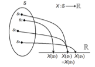{fig-align="center" width="40%"}

확률변수란 확률실험의 결과, 즉 표본공간의 원소에 실수 값을 대응시키는 함수이다. 보통 확률변수는 $X, Y, Z$ 등의 알파벳 기호로 나타낸다.

표본공간 $S = \{s_1, s_2, \ldots, s_n\}$과 확률함수 $P$가 주어졌을 때, 확률변수 $X$의 범위(range)를 $\mathcal{X} = \{x_1, x_2, \ldots, x_m\}$이라 하면, 새로운 확률함수 $P_X(x_i) = P(X = x_i)$를 정의할 수 있다.

::: {.callout-tip title="예제: 동전 세 번 던지기"}
공정한 동전을 세 번 던질 때 앞면의 수를 나타내는 확률변수 $X$:

| 확률실험 | HHH | HHT | HTH | HTT | THH | THT | TTH | TTT |
|----------|:---:|:---:|:---:|:---:|:---:|:---:|:---:|:---:|
| 확률변수 $X$ | 3 | 2 | 2 | 1 | 2 | 1 | 1 | 0 |

확률변수 $X$의 범위: $\mathcal{X} = \{0, 1, 2, 3\}$

표본공간의 8개 점이 각각 확률 $\frac{1}{8}$을 가지면:

| $x$ | 0 | 1 | 2 | 3 |
|-----|:---:|:---:|:---:|:---:|
| $P_X(X=x)$ | $1/8$ | $3/8$ | $3/8$ | $1/8$ |
:::

#### 확률변수 종류

수리 통계적 관점에서는 확률변수를 두 가지 유형으로 나눈다.

**1. 이산형 확률변수 (Discrete Random Variable)**

이산형 확률변수란 가능한 값들의 집합이 유한하거나 셀 수 있는 경우를 의미한다. 확률질량함수(PMF)를 통해 각 값에 확률을 정의한다.

| 유형 | 예시 |
|------|------|
| 유한한 이산형 | 두 주사위 눈금의 합: $\mathcal{X} = \{2, 3, \ldots, 12\}$ |
| 무한한 이산형 | 하루 교통사고 발생 건수: $\mathcal{X} = \{0, 1, 2, 3, \ldots\}$ |

대표적인 이산형 분포: 베르누이(Bernoulli), 이항(Binomial), 포아송(Poisson)

**2. 연속형 확률변수 (Continuous Random Variable)**

연속형 확률변수는 정의된 임의의 구간 내에서 모든 실수값을 가질 수 있다.

- 특정 값 하나에서의 확률: $P(X = x) = 0$
- 구간에 대한 확률은 확률밀도함수(PDF)의 적분으로 계산

대표적인 연속형 분포: 정규분포, 지수분포, 감마분포

| 사례 | 특성 |
|------|------|
| 자동차 연비 (km/L) | 소수점 단위의 연속적 값 |
| 수능 시험 점수 | 정규분포 가정 가능 |
| 항공기 비행 시간 | 임의의 실수값 |

**3. 데이터 분석에서의 확률변수 구분**

데이터 분석 관점에서 확률변수는 다음과 같이 구분된다.

:::: {.columns}
::: {.column width="50%"}
**정량적(Quantitative) 변수**

수치적 값을 가지며 산술 연산이 가능한 변수.

- 이산형 예시: 생산량, 자녀 수, 결함 개수
- 연속형 예시: 연봉, 키, 몸무게, 점수, 소득
:::
::: {.column width="50%"}
**정성적(Qualitative) 변수**

수치적 의미가 없는 범주(categorical)로 구성된 변수. 이산형 확률변수로 분류.

- 명목형(nominal): 성별, 혈액형, 지역
- 순서형(ordinal): 선호도(매우 좋음/보통/나쁨), 만족도(1~5점)
:::
::::

### 확률분포함수

#### 분포함수 정의

무작위 확률변수 $X$의 **누적분포함수(CDF)**는 $F_X(x)$로 나타내며, 다음과 같이 정의된다.

$$F_X(x) = P(X \leq x)$$

- 확률변수가 **연속형**이려면 CDF는 연속 함수이어야 한다.
- 확률변수가 **이산형**이려면 CDF는 계단 함수이어야 한다.

::: {.callout-note title="동일 분포 (Identically Distributed)"}
확률변수 $X$와 $Y$가 동일한 분포를 갖는다는 것은, 모든 집합 $A \in \mathcal{B}^1$에 대해 $P(X \in A) = P(Y \in A)$가 성립하는 것이다.

이는 모든 $x$에 대해 $F_X(x) = F_Y(x)$인 것과 동치이다.
:::

#### CDF 성질

::: {.callout-important title="CDF의 주요 성질"}
1. $F(x)$는 비감소(non-decreasing) 함수: $x_1 < x_2 \Rightarrow F(x_1) \leq F(x_2)$
2. $F(-\infty) = 0,\quad F(\infty) = 1$
3. 이산형: $P(X = x) = F(x) - F(x^-)$
4. 연속형: $F'(x) = f(x)$ (CDF의 미분이 PDF)
:::

### 확률밀도함수

#### 확률질량함수

::: {.callout-note title="PMF 정의 (이산형)"}
이산형 확률변수 $X$의 확률질량함수:

$$p_X(x) = P(X = x) \quad \text{ for all } x$$
:::

::: {.callout-tip title="예제: 4면 주사위"}
4면(1, 2, 3, 4) 주사위 2개를 동시에 던져 큰 수를 확률변수 $X$라 하면:

$$p(x) = P(X = x) = \frac{2x-1}{16}, \quad x = 1, 2, 3, 4$$

| $x$ | 1 | 2 | 3 | 4 |
|-----|:---:|:---:|:---:|:---:|
| $p(x)$ | $1/16$ | $3/16$ | $5/16$ | $7/16$ |
| $F(x)$ | $1/16$ | $4/16$ | $9/16$ | $16/16$ |
:::

::: {.callout-tip title="예제: 기하분포"}
앞면이 나올 확률이 $p$인 동전에서 "앞면이 처음 나올 때까지 던진 횟수"를 $X$로 정의하면:

$$P(X = x) = (1-p)^{x-1}p, \quad x = 1, 2, \ldots$$

누적분포함수:
$$F_X(x) = P(X \leq x) = \sum_{i=1}^{x}(1-p)^{i-1}p = 1 - (1-p)^x, \quad x = 1, 2, 3, \ldots$$
:::

#### 확률밀도함수

::: {.callout-note title="PDF 정의 (연속형)"}
연속형 확률변수 $X$의 확률밀도함수 $f_X(x)$는 다음 조건을 만족하는 함수이다.

$$F_X(x) = \int_{-\infty}^{x} f_X(t)\, dt \quad \text{ for all } x$$

즉, $\dfrac{d}{dx} F_X(x) = f_X(x)$이다.
:::

#### 확률계산

- **이산형**: $P(X = x) = F_X(x) - F_X(x^-)$

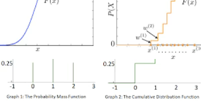{fig-align="center" width="60%"}

- **연속형**: $P(a < X < b) = F_X(b) - F_X(a)$

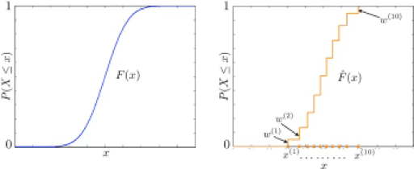{fig-align="center" width="60%"}

#### 확률밀도함수 관련 정리

::: {.callout-important title="PDF/PMF의 필요충분조건"}
함수 $f_X(x)$ 또는 $p_X(x)$가 확률변수 $X$의 PDF 또는 PMF가 되기 위한 필요충분조건:

1. $f_X(x) \geq 0 \text{ for all } x$
2. $\displaystyle\int_{-\infty}^{\infty} f_X(x)\, dx = 1$ (연속형) 또는 $\displaystyle\sum_{x} p_X(x) = 1$ (이산형)
:::

---

## 데이터 확률밀도함수

데이터로부터 확률밀도함수를 추정하는 대표적인 방법으로는 **히스토그램(histogram)**과 **커널 밀도 추정(KDE)**이 있다.

- 히스토그램: 데이터를 구간으로 나누고 상대도수로 표현
- KDE: 각 데이터 지점에 커널 함수를 적용하여 매끄러운 밀도 추정

### 확률모형

확률모형이란 확률변수의 PDF 또는 PMF를 의미한다.

- **이산형**: 막대그래프 형태, 각 막대의 높이 = 해당 값의 확률
- **연속형**: 곡선 아래 면적 = 확률. 특정 점의 확률은 $P(X = x) = 0$이므로, 구간 $P(a \leq X \leq b)$에 대해 확률을 정의한다.

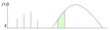{fig-align="center" width="60%"}

**모집단 확률분포함수 $f(x)$ 가정**

모집단 분포를 이론적으로 가정한 뒤, 통계량의 샘플링 분포를 구하여 분석을 수행한다.

- 오차항이 정규분포를 따른다고 가정하면 회귀계수 검정통계량은 $t$-분포를 따른다.
- 모형 전체의 유의성 검정에는 $F$-분포를 사용한다.
- 소표본($n < 30$)에서는 정규분포 가정 하에 표본평균이 $t$-분포를 따른다.

**모집단 확률분포함수 가정이 불가능한 경우**

::: {.callout-note title="분포 검토 방법"}
1. **적합성 검정(Goodness-of-fit test)**: 카이제곱($\chi^2$) 검정으로 관측빈도와 기대빈도 비교
2. **그래프 기반 방법**
   - P-P plot: 누적상대도수 vs. 이론적 누적분포 비교
   - Q-Q plot: 분위수 비교 — 직선에 가까울수록 분포가 유사
   - 히스토그램, KDE 그래프로 분포 형태 시각적 확인
3. **경험적 판단(rule of thumb)**: 좌우 대칭이고 중심이 뚜렷하면 정규분포 가정 가능
:::

### 히스토그램

#### 이산형 데이터

이산형 데이터의 히스토그램은 가로축(확률변수 값), 세로축(확률)으로 구성된다. 상대빈도가 각 값의 확률을 나타내며, 바차트(bar chart)라고도 불린다.

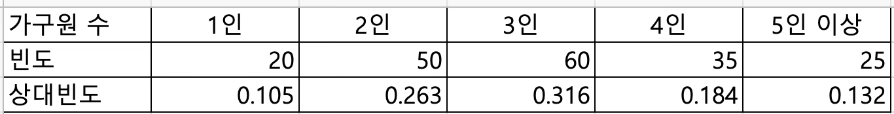{fig-align="center" width="80%"}

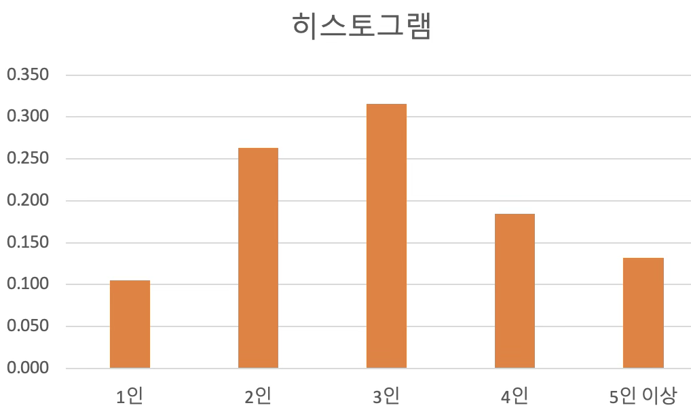{fig-align="center" width="60%"}

#### 연속형 데이터

연속형 데이터는 데이터 범위를 일정한 폭의 구간으로 나누어 히스토그램을 작성한다. 각 구간 중앙값을 연결하면 확률분포의 형태를 추정할 수 있다.

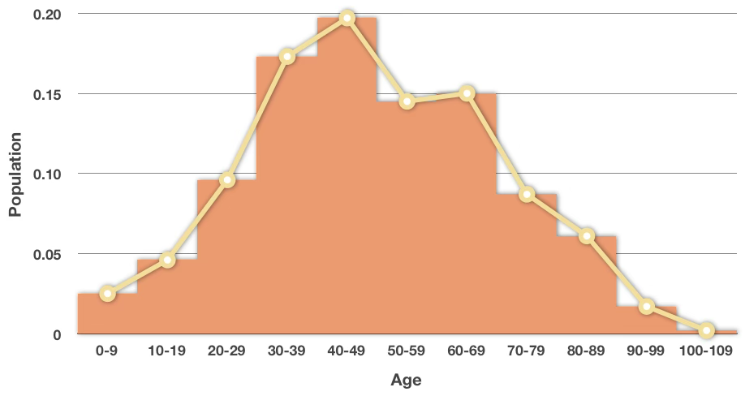{fig-align="center" width="60%"}

**히스토그램 작성 절차:**

1. 데이터 범위 계산: $\text{범위} = \text{최대값} - \text{최소값}$
2. 빈(bin) 개수 결정 (일반적으로 8~12개). **Sturges 규칙**: $K = 1 + 3.322\log_{10}(N)$
3. 전체 범위 ÷ 빈 개수로 구간 폭(interval width) 결정
4. 각 구간의 도수 및 상대빈도 계산
5. 막대그래프로 표현

### Kernel 추정

유한개의 표본 데이터를 이용하여 모집단 PDF를 매끄럽게 추정하는 방법이다. 신호처리 분야에서는 Parzen-Rosenblatt window 방법이라 부른다.

KDE는 각 관측값에 커널 함수를 중심으로 확률밀도를 부여하고, 이를 합산하여 연속적인 밀도함수를 생성한다.

::: {.callout-note title="커널함수 정의"}
커널함수 $K(x)$는 $\int_{-\infty}^{\infty} K(x)\, dx = 1$을 만족하는 비음수, 좌우 대칭인 함수이다.

| 커널 유형 | 공식 |
|-----------|------|
| Gaussian | $K(x;h) \propto e^{-x^2/(2h^2)}$ |
| Epanechnikov | $K(x;h) \propto 1 - x^2/h^2$ |
| Linear | $K(x;h) \propto 1 - x/h, \quad x < h$ |
:::

확률표본 $x_1, x_2, \ldots, x_n$이 주어진 경우 커널추정량:

$$\hat{f}_h(x) = \frac{1}{n}\sum_{i=1}^{n} K_h(x - x_i) = \frac{1}{nh}\sum_{i=1}^{n} K\!\left(\frac{x - x_i}{h}\right)$$

$h$는 bandwidth 모수이다. $h$가 크면 완만한 형태, 작으면 뾰족한 형태가 된다.

최적 bandwidth:
$$h = \left(\frac{4\hat{\sigma}^5}{3n}\right)^{1/5} \approx 1.06\, \hat{\sigma}\, n^{-0.2}$$

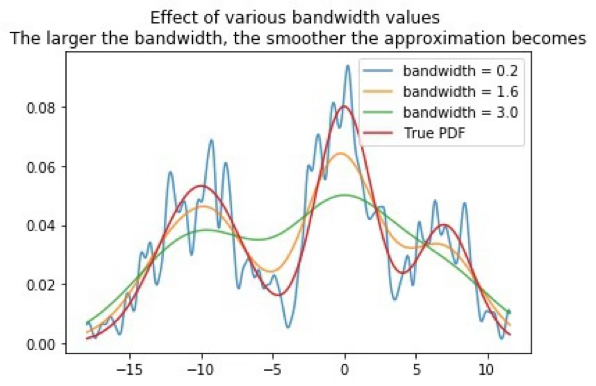{fig-align="center" width="60%"}

### 봉우리

확률분포함수에서 발생 확률이 높은 구간은 봉우리로 나타나며, 그 중 가장 높은 봉우리에 해당하는 확률변수 값을 **최빈값(mode)**이라고 한다.

{fig-align="center" width="60%"}

| 유형 | 설명 | 예 |
|------|------|-----|
| 단봉(unimodal) | 봉우리가 하나 | 정규분포 |
| 쌍봉(bimodal) | 봉우리가 두 개 | 두 이질적 집단이 혼재 |
| 다봉(multimodal) | 세 개 이상 | 여러 집단의 혼합 |

**쌍봉 분포의 한계**

이봉(bimodal) 분포에서 단순 평균 추론은 다음과 같은 문제를 야기한다.

1. **대표성 부족**: 평균이 두 봉우리 사이에 위치하여 실제 데이터가 거의 없는 구간을 대표값으로 제시
2. **왜곡된 해석**: 두 모집단 특성이 하나의 평균에 뭉개짐
3. **분산 증가**: 전체 분산이 커지고 신뢰구간이 넓어져 추론 정확성 저하
4. **정규성 위반**: t-검정, ANOVA 등의 정규성 가정 불충족
5. **혼합 모집단**: 하위 집단별 평균을 개별 추정하는 것이 더 적절

쌍봉 분포 데이터에는 군집 분석, 혼합분포 모형(Gaussian Mixture Model), 또는 중앙값 활용을 권장한다.

### 치우침

#### 정의

종 모양(bell-shaped)이며 좌우 대칭인 분포는 평균, 중앙값, 최빈값이 모두 같은 위치에 존재한다(정규분포).

| 분포 형태 | 특징 | 예 |
|-----------|------|-----|
| 우측 치우침(positive skewed) | 오른쪽 꼬리가 길고, 평균 > 중앙값 | 소득, 부동산 가격 |
| 대칭(symmetric) | 평균 = 중앙값 = 최빈값 | 정규분포 |
| 좌측 치우침(negative skewed) | 왼쪽 꼬리가 길고, 평균 < 중앙값 | 대부분 높은 점수 분포 |

#### 치우침과 중앙 위치 통계량 관계

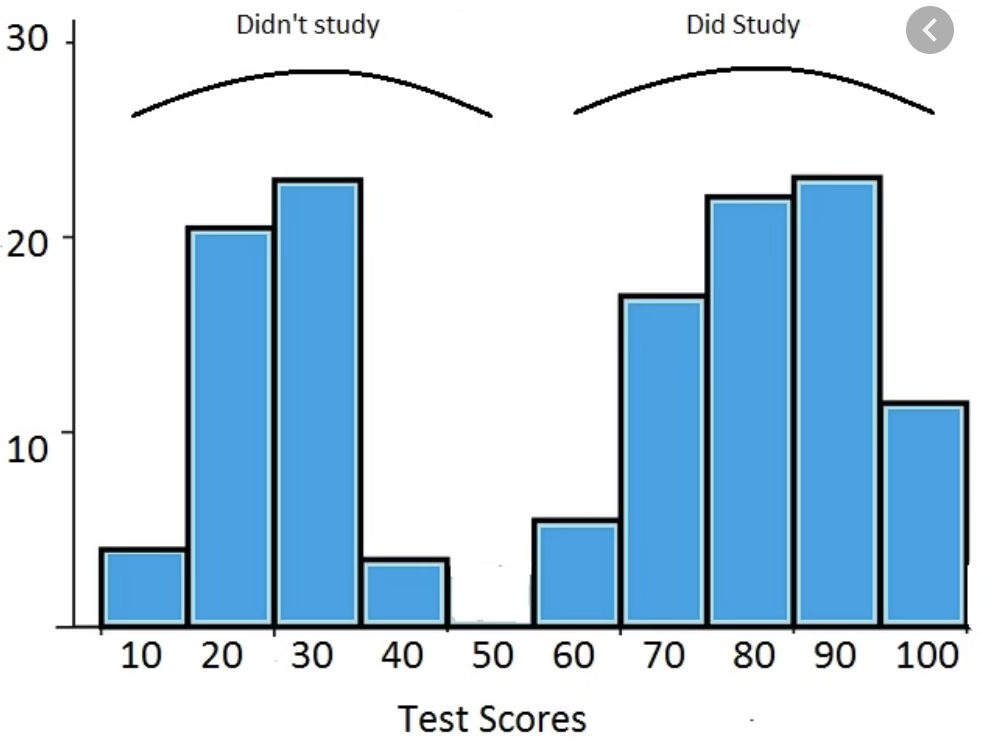{fig-align="center" width="60%"}

| 중심 척도 | 정의 | 특징 |
|-----------|------|------|
| 평균(mean) | 전체 값의 가중 합 | 이상치 영향 큼 |
| 중앙값(median) | 크기 순서 중 중앙값 | 이상치 영향 적음 |
| 최빈값(mode) | 가장 자주 나타나는 값 | 이산형·다봉 분포에 유용 |

정규분포: 세 척도 모두 같은 위치. 비대칭 분포: 평균이 극단값에 끌려 중앙값·최빈값과 차이 발생.

#### 치우침 척도

**평균 기반 왜도**

$$\text{Skewness} = E\left[\left(\frac{X-\mu}{\sigma}\right)^3\right] = \frac{\mu_3}{\sigma^3}$$

좌우 대칭인 정규분포의 왜도는 0이고, 지수분포의 왜도는 2로 강한 우측 치우침을 나타낸다.

**중앙값 기반 척도**

- Pearson's First Skewness: $\text{skew} = \dfrac{\text{mean} - \text{mode}}{\text{std}}$

- Pearson's Second Skewness: $\text{skew} = \dfrac{3(\text{mean} - \text{median})}{\text{std}}$

**사분위 기반 Bowley's Skewness**

$$\text{skew} = \frac{Q_3 + Q_1 - 2Q_2}{\text{IQR}}$$

이상치의 영향을 덜 받는다.

**Groeneveld & Meeden's Coefficient**

$$\text{skew} = \frac{\text{mean} - \text{median}}{E(|X - \text{median}|)}$$

#### 치우침 판단 기준

| Pearson 2차 | 분포 형태 | Bowley's | Groeneveld & Meeden's |
|:----------:|----------|:--------:|:--------------------:|
| $= 0$ | 대칭 분포 | $= 0$ | $= 0$ |
| $0 < \text{skew} < 0.5$ | 거의 대칭 | $0 < \text{skew} < 0.25$ | $0 < \text{skew} < 0.1$ |
| $0.5 \leq \text{skew} < 1.0$ | 약한 우측 치우침 | $0.25 \leq \text{skew} < 0.5$ | $0.1 \leq \text{skew} < 0.3$ |
| $\geq 1.0$ | 강한 우측 치우침 | $\geq 0.5$ | $\geq 0.3$ |
| $-0.5 < \text{skew} < 0$ | 약한 좌측 치우침 | $-0.25 < \text{skew} < 0$ | $-0.1 < \text{skew} < 0$ |
| $-1.0 < \text{skew} \leq -0.5$ | 중간 정도 좌측 치우침 | $-0.5 < \text{skew} \leq -0.25$ | $-0.3 < \text{skew} \leq -0.1$ |
| $\leq -1.0$ | 강한 좌측 치우침 | $\leq -0.5$ | $\leq -0.3$ |

### 확률밀도함수 관련 법칙

#### 실증적 법칙 (Empirical Rule)

확률변수 $X$의 PDF가 벨 모양 좌우 대칭이고 평균 $\mu$, 표준편차 $\sigma$를 가지면:

$$P(|X - \mu| < k\sigma) \geq \alpha$$

| $k$ | 구간 | 포함 비율($\alpha$) |
|-----|------|:------------------:|
| 1 | $(\mu - \sigma,\, \mu + \sigma)$ | 적어도 68% |
| 2 | $(\mu - 2\sigma,\, \mu + 2\sigma)$ | 적어도 95% |
| 3 | $(\mu - 3\sigma,\, \mu + 3\sigma)$ | 적어도 99.8% |
| 6 | $(\mu - 6\sigma,\, \mu + 6\sigma)$ | 100만개 중 2개만 이탈 ($6\sigma$ 품질운동) |

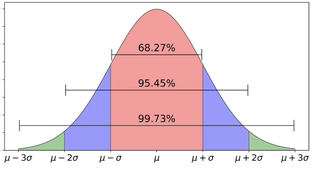{fig-align="center" width="60%"}

#### Chebyshev 부등식

평균 $\mu$, 표준편차 $\sigma$를 갖는 확률변수 $X$의 PDF 형태를 알 수 없는 경우에도 성립한다.

::: {.callout-important title="Chebyshev 부등식"}
$$P(|X - \mu| < k\sigma) \geq 1 - \frac{1}{k^2}$$

- $k = 2$: 평균 $\pm 2\sigma$ 구간에 적어도 **75%** 포함
- $k = 3$: 평균 $\pm 3\sigma$ 구간에 적어도 **89%** 포함
:::

```python
#데이터 읽기 (연속형 데이터)
import pandas as pd
data = pd.read_csv('https://vincentarelbundock.github.io/Rdatasets/csv/fpp2/ausair.csv')
data.info()
```

```python
#상대빈도표
import numpy as np
pd.cut(data['value'], np.arange(0, 80, 10)).value_counts() / len(data)
```

```
(10, 20]    0.361702
(30, 40]    0.148936
(60, 70]    0.127660
(20, 30]    0.106383
(40, 50]    0.106383
(0, 10]     0.085106
(50, 60]    0.042553
```

```python
#확률밀도함수, KDE
import matplotlib.pyplot as plt
df = pd.DataFrame(data, columns=['value'])
ax = df.plot.hist(bins=10)
df.plot.kde(ax=ax, secondary_y=True, bw_method=0.3)
plt.show()
```

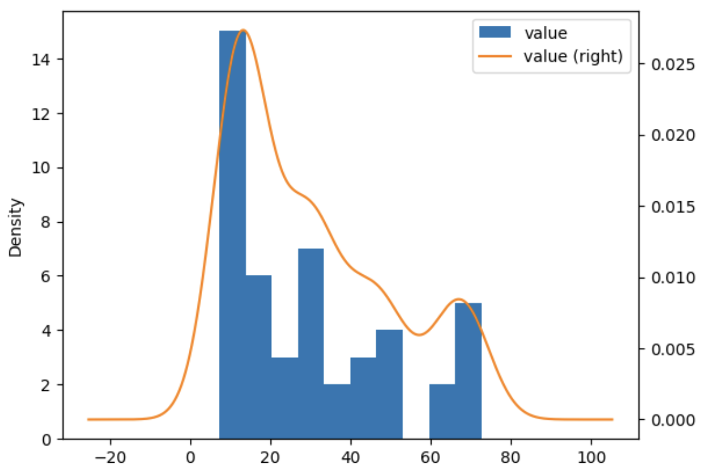{fig-align="center" width="60%"}

```python
#CDF, PDF 그리기
import matplotlib.pyplot as plt
fig, ax = plt.subplots()
ax2 = ax.twinx()
n, bins, patches = ax.hist(data['value'], bins=10)
n, bins, patches = ax2.hist(data['value'], cumulative=1, histtype='step', bins=10, color='tab:orange')
plt.show()
```

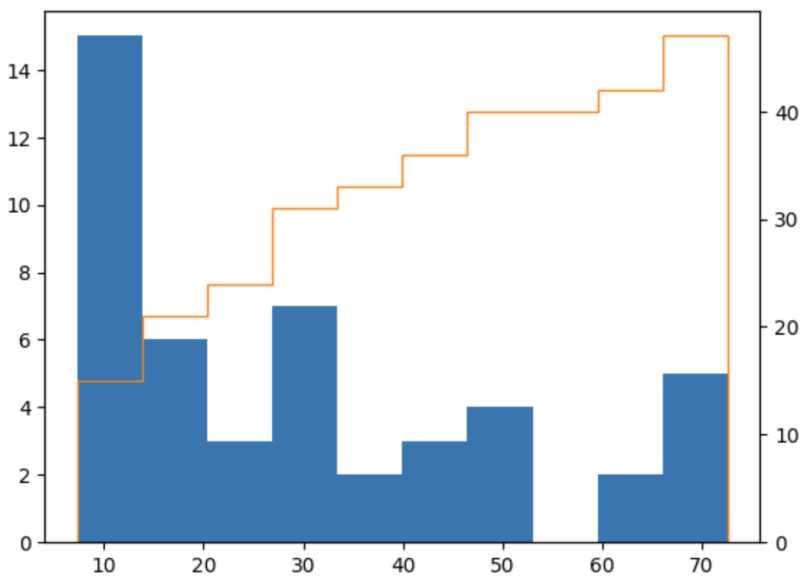{fig-align="center" width="60%"}

---

## 변수변환

모집단을 누적분포함수를 가진 확률변수 $X$로 모델링하면, $X$ 자체뿐만 아니라 $g(X)$의 분포 특성에도 관심을 갖게 된다.

### 개념

확률변수 $X$의 임의의 함수 $g(X)$도 확률변수가 된다. 새로운 확률변수 $Y = g(X)$로 표기하며, 임의의 집합 $A$에 대하여:

$$P(Y \in A) = P(g(X) \in A)$$

$y = g(x)$에서 함수 $g$는 $\mathcal{X} \to \mathcal{Y}$의 매핑을 정의한다. 역함수 매핑 $g^{-1}$은 $\mathcal{Y}$의 부분집합을 $\mathcal{X}$의 부분집합으로 변환한다.

$$g^{-1}(A) = \{x \in \mathcal{X} : g(x) \in A\}$$

확률변수 $Y = g(X)$와 임의의 집합 $A \subset \mathcal{Y}$에 대해:

$$P(Y \in A) = P(g(X) \in A) = P(X \in g^{-1}(A))$$

### 이산형 확률변수 변수변환

확률변수 $X$가 이산 확률변수라면 $Y = g(X)$도 이산 확률변수이다. PMF는 다음과 같이 주어진다.

$$f_Y(y) = P(Y = y) = \sum_{x \in g^{-1}(y)} f_X(x), \quad y \in \mathcal{Y}$$

::: {.callout-tip title="예제: 동전 던지기 실험 횟수"}
확률변수 $X$를 첫 번째 앞면이 나온 던지기 횟수로 정의: $P(X = x) = (1/2)^x,\ x = 1, 2, \ldots$

앞면이 나오기 전까지의 던진 횟수 $Y = g(X) = X - 1$:

1. 역함수: $g^{-1}(y) = y + 1$
2. 표본공간: $\mathcal{Y} = \{0, 1, 2, \ldots\}$
3. PMF: $p_Y(y) = p_X(y+1) = \left(\dfrac{1}{2}\right)^{y+1}, \quad y = 0, 1, 2, \ldots$
:::

::: {.callout-tip title="예제: 이항분포의 실패 횟수"}
이산 확률변수 $X \sim \text{Binomial}(n, p)$:

$$f_X(x) = \binom{n}{x} p^x (1-p)^{n-x}, \quad x = 0, 1, \ldots, n$$

$Y = g(X) = n - X$ (실패 횟수)의 PMF를 구하면:

1. 역함수: $g^{-1}(y) = n - y$
2. 표본공간: $\mathcal{Y} = \{0, 1, \ldots, n\}$

$$p_Y(y) = \binom{n}{y}(1-p)^y p^{n-y}$$

즉, $Y \sim \text{Binomial}(n,\ 1-p)$이다.
:::

### 연속형 확률변수 변수변환

#### 분포함수 이용하기

확률변수 $Y = g(X)$의 CDF:

$$F_Y(y) = P(Y \leq y) = P(g(X) \leq y) = \int_{\{x \in \mathcal{X} : g(x) \leq y\}} f_X(x)\, dx$$

::: {.callout-tip title="예제: $g(X) = X^2$ 변환"}
$f_X(x) = \dfrac{1}{2},\quad -1 < x < 1$에서 $Y = X^2$의 PDF를 구하라.

1. 표본공간: $\mathcal{Y} = \{y : 0 \leq y < 1\}$
2. CDF:

$$F_Y(y) = \begin{cases} 0 & y < 0 \\ \displaystyle\int_{-\sqrt{y}}^{\sqrt{y}} \frac{1}{2}\, dx = \sqrt{y} & 0 \leq y < 1 \\ 1 & 1 \leq y \end{cases}$$

3. PDF:

$$f_Y(y) = \begin{cases} \dfrac{1}{2\sqrt{y}} & 0 < y < 1 \\ 0 & \text{그 외} \end{cases}$$
:::

#### Jacobian 이용하기

$X$가 PDF $f_X(x)$를 가지는 연속 확률변수이고 $Y = g(X)$에서 $g(x)$가 일대일 미분 가능 함수일 때:

::: {.callout-important title="Jacobian 변환 정리"}
$g(X)$의 역함수를 $x = g^{-1}(y)$라 하면:

$$f_Y(y) = f_X(g^{-1}(y)) \left|\frac{dx}{dy}\right|, \quad y \in S_Y$$

CDF를 통한 표현:

- $g(X)$가 증가 함수: $F_Y(y) = F_X(g^{-1}(y))$
- $g(X)$가 감소 함수: $F_Y(y) = 1 - F_X(g^{-1}(y))$
:::

::: {.callout-tip title="예제: 균일분포 → 지수분포 변환"}
$X \sim f(x) = 1,\quad 0 < x < 1$에서 $Y = -\ln(1-X)$의 PDF를 구하라.

1. $Y = -\ln(1-X)$는 $X$의 증가 함수이고, 역함수: $X = 1 - e^{-y}$
2. $\dfrac{dx}{dy} = e^{-y}$
3. $Y$의 영역: $0 \leq x \leq 1 \Rightarrow 0 < y < \infty$
4. $f_Y(y) = f_X(x)\left|\dfrac{dx}{dy}\right| = e^{-y},\quad 0 < y$

즉, $Y \sim \text{Exp}(1)$이다.
:::

::: {.callout-tip title="예제: 정규분포와 카이제곱분포"}
$X \sim N(0,1)$에서 $Y = X^2$의 PDF를 구하라.

$$f_X(x) = \frac{1}{\sqrt{2\pi}} e^{-x^2/2}, \quad -\infty < x < \infty$$

구간 $A_1 = (-\infty, 0)$과 $A_2 = (0, \infty)$로 분할:

$$f_Y(y) = \frac{1}{\sqrt{2\pi}} e^{-y/2} \left|\frac{-1}{2\sqrt{y}}\right| + \frac{1}{\sqrt{2\pi}} e^{-y/2} \left|\frac{1}{2\sqrt{y}}\right| = \frac{1}{\sqrt{2\pi}} \frac{1}{\sqrt{y}} e^{-y/2}, \quad 0 < y < \infty$$

이는 자유도 1의 카이제곱 분포이다.
:::

---

## 기대값

확률밀도함수는 분포 형태를 보여주지만, 중심 경향과 같은 요약 정보를 직접 제공하지는 않는다. 이러한 요약 정보를 수치로 표현한 것을 **기술 요약값(descriptive summary statistics)**이라 하며, 대표적인 예가 **기대값(expected value)**이다.

기대값은 각 값이 발생할 확률을 고려한 **가중 평균**이다.

### 기대값 정의

::: {.callout-note title="기대값 정의"}
확률변수 $g(X)$의 기대값:

$$E[g(X)] = \begin{cases} \displaystyle\int_{-\infty}^{\infty} g(x) f_X(x)\, dx & X \text{ 가 연속형} \\[6pt] \displaystyle\sum_{x \in \mathcal{X}} g(x) f_X(x) & X \text{ 가 이산형} \end{cases}$$

단, $E|g(X)| = \infty$이면 기대값이 존재하지 않는다.
:::

::: {.callout-tip title="예제: 지수분포 평균"}
$f_X(x) = \dfrac{1}{\lambda}e^{-x/\lambda},\quad 0 \leq x < \infty$에서:

$$E[X] = \int_0^{\infty} \frac{1}{\lambda} x\, e^{-x/\lambda}\, dx = \lambda$$
:::

::: {.callout-tip title="예제: 이항분포 평균"}
$X \sim \text{Binomial}(n, p)$:

$$P_X(x) = \binom{n}{x} p^x (1-p)^{n-x}, \quad x = 0, 1, \ldots, n$$

$x\binom{n}{x} = n\binom{n-1}{x-1}$를 이용하여:

$$E[X] = \sum_{x=0}^{n} x \binom{n}{x} p^x (1-p)^{n-x} = np \sum_{y=0}^{n-1} \binom{n-1}{y} p^y (1-p)^{n-1-y} = np$$
:::

### 주요 기대값

::: {.callout-note title="평균, 분산, 표준편차 정의"}
- **평균**: $\mu = E(X)$
- **분산**: $\sigma^2 = \text{Var}(X) = E[(X-\mu)^2] = E(X^2) - \mu^2$
- **표준편차**: $\sigma = \sqrt{\text{Var}(X)}$
- **성질**: $\text{Var}(aX + b) = a^2\, \text{Var}(X)$
:::

::: {.callout-note title="왜도 (Skewness)"}
$$\text{Skewness} = E\left[\left(\frac{X-\mu}{\sigma}\right)^3\right]$$

- $= 0$: 분포가 완전히 대칭 (정규분포)
- $> 0$: 오른쪽 꼬리가 길다 (positive skewed)
- $< 0$: 왼쪽 꼬리가 길다 (negative skewed)
:::

::: {.callout-note title="첨도 (Kurtosis)"}
$$\text{Kurtosis} = E\left[\left(\frac{X-\mu}{\sigma}\right)^4\right] - 3$$

- $= 0$: 정규분포와 동일한 꼬리 두께
- $> 0$ (leptokurtic): 꼬리가 두껍고 중심이 뾰족 — 이상치 빈번
- $< 0$ (platykurtic): 꼬리가 얇고 중심이 평평
:::

::: {.callout-note title="적률 (Moment)"}
- $n$차 적률: $\mu_n' = E[X^n]$
- $n$차 중심적률: $\mu_n = E[(X-\mu)^n]$
:::

::: {.callout-note title="적률생성함수 (MGF)"}
$$M_X(t) = E[e^{tX}]$$

$-h < t < h$인 어떤 $h > 0$에 대해 $E[e^{tX}]$가 존재하면 MGF가 존재한다.

**주요 정리:**

- $E[X^n] = M_X^{(n)}(0)$ — $n$차 적률은 MGF의 $n$차 도함수를 $t=0$에서 계산한 값

- $F_X(z) = F_Y(z)$ for all $z$ $\Longleftrightarrow$ $M_X(t) = M_Y(t)$ for all $t \in (-h, h)$ for some $h > 0$

즉, 두 확률변수의 MGF가 일치하면 동일한 확률분포를 따른다.
:::

::: {.callout-tip title="예제: 감마분포 MGF"}
모수 $(\alpha, \beta)$인 감마분포의 PDF:

$$f(x) = \frac{1}{\Gamma(\alpha)\beta^{\alpha}} x^{\alpha-1} e^{-x/\beta}, \quad 0 < x < \infty,\quad \alpha > 0,\, \beta > 0$$

적률생성함수:

$$M_X(t) = \left(\frac{1}{1 - \beta t}\right)^{\alpha}, \quad t < \frac{1}{\beta}$$

평균:

$$E[X] = \left.\frac{d}{dt} M_X(t)\right|_{t=0} = \frac{\alpha\beta}{(1-\beta t)^{\alpha+1}}\bigg|_{t=0} = \alpha\beta$$
:::

::: {.callout-tip title="예제: 이항분포 MGF"}
$X \sim \text{Binomial}(n, p)$:

$$M_X(t) = \sum_{x=0}^{n} e^{tx} \binom{n}{x} p^x (1-p)^{n-x} = [pe^t + (1-p)]^n$$

$$E[X] = \left.\frac{d}{dt} M_X(t)\right|_{t=0} = np e^t [pe^t + (1-p)]^{n-1}\bigg|_{t=0} = np$$
:::

### 기대값 관련 정리 및 부등식

::: {.callout-important title="기대값의 선형성 및 단조성"}
$X$를 확률변수, $a, b, c$를 상수, $g_1(x)$와 $g_2(x)$를 기댓값이 존재하는 함수라 하자.

1. **선형성**: $E(ag_1(X) + bg_2(X) + c) = aE[g_1(X)] + bE[g_2(X)] + c$
2. **비음성**: $g_1(x) \geq 0$ for all $x$ 이면, $E[g_1(X)] \geq 0$
3. **단조성**: $g_1(x) \geq g_2(x)$ 이면, $E[g_1(X)] \geq E[g_2(X)]$
4. **유계성**: $a \leq g_1(x) \leq b$ 이면, $a \leq E[g_1(X)] \leq b$

**차수 관계**: $E[X^m]$이 존재하면, $k \leq m$인 양의 정수 $k$에 대해 $E[X^k]$도 존재한다.
:::

::: {.callout-important title="Markov 부등식과 Chebyshev 부등식"}
**(Markov's Inequality)** $u(X)$를 비음수 함수라 하면, 모든 양의 상수 $c$에 대해:

$$P[u(X) \geq c] \leq \frac{E[u(X)]}{c}$$

**(Chebyshev's Inequality)** 확률변수 $X$가 유한한 분산 $\sigma^2$를 가지면, 모든 $k > 0$에 대해:

$$P(|X - \mu| < k\sigma) \geq 1 - \frac{1}{k^2}$$
:::
