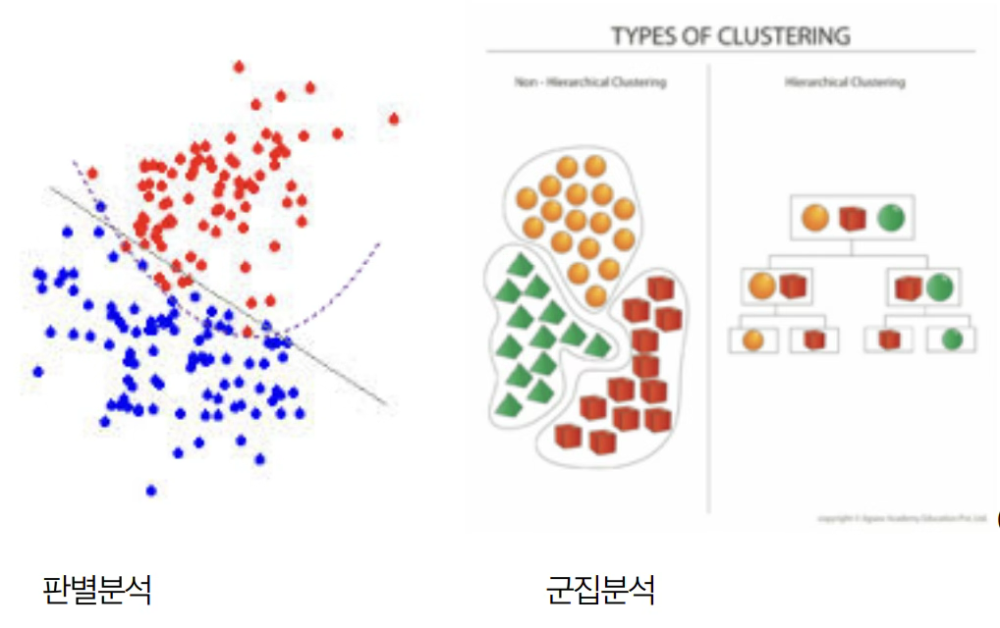
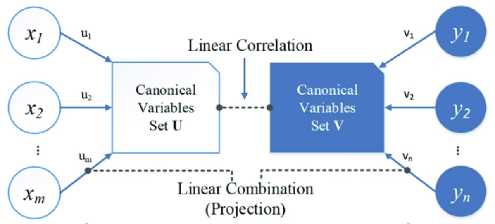
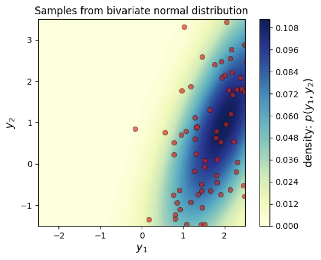
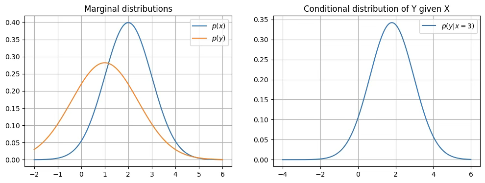
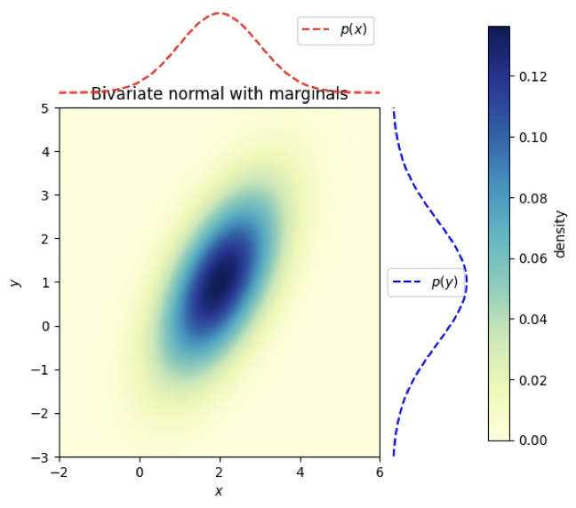
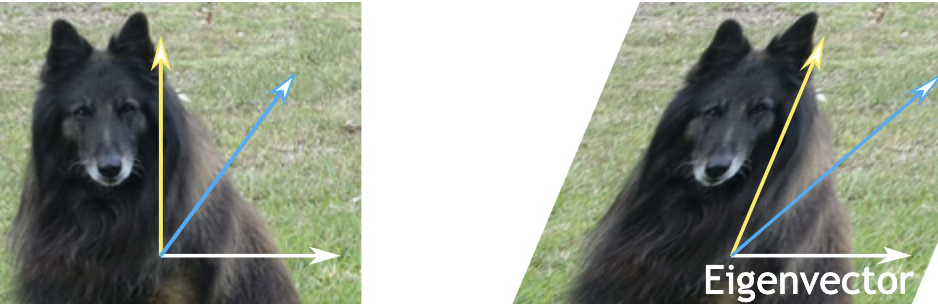
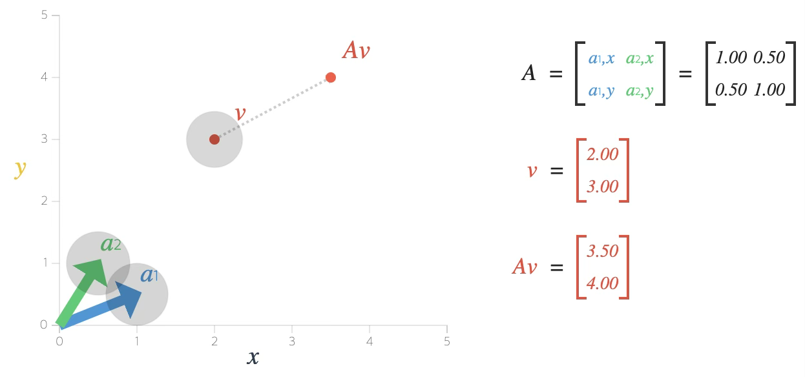
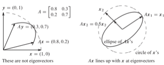
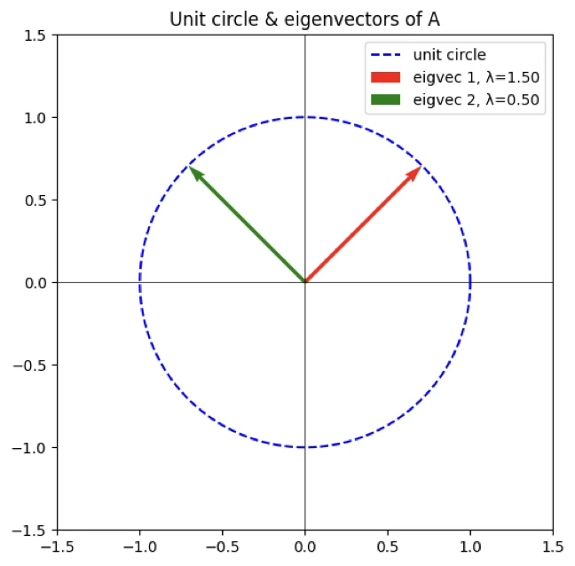

## 다변량분석 기초

::: {.callout-note icon=false}
## 정의
**다변량분석(Multivariate Analysis)**은 여러 개의 변수를 동시에 고려하면서 데이터 속 패턴이나 관계를 이해하려는 통계적 방법론이다. (1) 여러 변수의 상호작용과 구조를 이해하고, (2) 복잡한 데이터를 간결하게 표현하며, (3) 예측·분류·요약·시각화 등 다양한 응용 목적을 가진 종합적인 분석 틀이다.
:::

### 다변량분석 개념

다변량분석은 크게 두 가지 축에서 작동한다. 하나는 변수들 사이의 구조적 관계를 파악하는 것, 다른 하나는 관측 대상들(사람, 기업, 지역 등)의 집단적 유사성이나 차이를 밝히는 것이다. 전자는 주성분분석(PCA), 요인분석, 다변량회귀 같은 기법으로, 변수 간 상관 구조를 축약하거나 설명하는 데 활용된다. 후자는 판별분석, 군집분석, 다차원척도법 등으로, 관측 대상을 분류하거나 시각적으로 표현하는 데 쓰인다.

또한, 다변량분석은 단순히 기술적 도구를 넘어 차원을 축소하고 해석을 단순화하는 역할도 한다. 현실 데이터는 차원이 높아질수록(변수가 많아질수록) 분석이 복잡해지고, 소위 '차원의 저주'라 불리는 문제에 부딪히게 된다. 주성분분석처럼 핵심적인 몇 개의 축으로 변수를 압축하거나, 군집분석처럼 비슷한 대상끼리 묶어 구조를 단순화하는 것은 해석의 가독성을 높여준다.

여기서 흥미로운 점은, 이 전통적인 다변량분석 기법들이 오늘날 머신러닝, 인공지능의 여러 알고리즘과 맞닿아 있다는 것이다. 예컨대 판별분석은 현대의 분류 문제와 연결되고, 주성분분석은 신경망의 차원축소 과정과 닮아 있다. 다변량분석을 배우는 것은 통계적 사고의 전통과, 데이터 과학의 최신 흐름을 이어주는 가교를 이해하는 일과 같다.

### 다변량 분석 유형

::: {.callout-tip icon=false}
## 다변량 분석 3가지 유형

| 유형 | 중심 개념 | 주요 연구 질문 | 대표 기법 | 응용 사례 |
|------|---------|------------|---------|---------|
| **인과 관계** | 변수 간 원인-결과 구조 | "어떤 변수가 다른 변수에 영향을 주는가?" | 회귀분석, ANOVA, SEM | 교육 수준 → 소득, 신약 투여 → 혈압 변화 |
| **상관 관계** | 변수 간 공분산·상관 구조 | "변수들이 어떻게 함께 움직이는가?" | PCA, 요인분석, MDS | 고객 만족 요인 축약, 시험 과목 간 점수 패턴 |
| **개체 유사성** | 개체 간 유사성 기반 그룹화 | "어떤 개체들이 서로 비슷한가?" | 판별분석, 군집분석, K-means | 고객 세분화, 질병 패턴 분류, 이미지 인식 |
:::

#### 인과 관계 [변수 관계]

다변량 분석에서 가장 전통적이고도 중요한 접근 가운데 하나는 변수들 사이의 인과 관계를 규명하는 것이다. 여기서 인과 관계란 어떤 변수가 다른 변수에 영향을 주고받는 구조를 의미한다.

원인이 되는 변수는 설명변수, 독립변수, 혹은 예측변수라고 부른다. 반대로, 설명 변수의 영향을 받아 나타나는 결과 변수는 종속변수, 반응변수, 혹은 목표변수라고 한다. 일반적으로 수식으로는 목표변수를 Y, 예측변수를 X로 표기한다. 예컨대, 교육수준(X)이 소득(Y)에 영향을 준다고 설정하면, 교육 수준은 독립 변수이고 소득은 종속 변수가 된다.

통계 분석에서는 연구 설계와 맥락에 따라 이 용어들이 조금씩 달리 쓰이기도 한다. 예를 들어 분산분석(ANOVA)에서는 설명 변수를 '처리 효과(treatment effect)' 또는 '요인(factor)'이라고 부른다.

중요한 점은 인과 관계의 설정이 단순히 통계적 기법이나 데이터 분석만으로 결정되는 것이 아니라는 사실이다. 인과 관계는 반드시 이론적 근거나 경험적 타당성에 바탕하여 연구 목적 속에서 먼저 규정된다. 따라서 인과적 다변량 분석은 '데이터 → 인과 규명'의 순서가 아니라, 먼저 '이론·가설 → 데이터 분석 → 검증'의 순서를 따른다.

#### 상관관계 [변수 관계]

다변량 분석에서 두 번째 유형은 상관 관계를 중심으로 한 분석이다. 상관 관계란 변수들이 얼마나 유사하게 변동하는가, 즉 함께 움직이는 정도를 나타낸다. 이를 계량화하는 대표적인 지표가 상관계수이며, 더 일반적으로는 공분산 구조이다.

상관 관계 분석의 첫 번째 활용은 변수 간의 함수적 관계를 탐색하는 것이다. 두 번째 활용은 변수들 간의 유사성을 바탕으로 차원을 줄이는 것이다. 변수의 수가 많을수록 자료 구조가 복잡해지므로, 서로 높은 상관성을 가진 변수들을 몇 개의 대표적인 요인이나 축으로 요약하는 기법이 필요하다. 이러한 맥락에서 주성분분석(PCA), 요인분석(factor analysis) 등이 개발되었다.

특히 주성분분석은 공분산 행렬을 분해하여 데이터가 가장 크게 퍼져 있는 방향(주성분)을 찾아내고, 이를 통해 다차원 자료를 소수의 차원으로 축약한다. 요인분석은 변수들 간 상관구조를 설명하는 잠재 요인을 가정하고, 관측된 변수들의 공통적 변동성을 요인으로 요약한다.

따라서 현대의 상관 관계 분석은 단순한 변수 요약을 넘어, 데이터 전체의 구조를 간결하게 표현하는 도구로 발전하고 있다.

#### 개체의 유사성 (Similarity of Objects)

세 번째 유형은 개체의 유사성을 중심으로 한 분석이다. 여기서는 변수들이 매개체 역할을 하여 개체 간 거리를 정의하고, 서로 비슷한 개체들을 묶어 분류하는 것이 핵심이다.

분석 접근은 크게 두 가지로 나뉜다.

첫째는 판별분석(discriminant analysis)이다. 이 방법은 이미 사전에 정의된 그룹이 있을 때, 그룹 간의 차이를 가장 잘 설명하는 선형 혹은 비선형 판별함수를 구축한다. 예를 들어 학생들의 성적과 생활 습관을 이용하여 "우수 학업 집단"과 "일반 집단"을 구분하는 모형을 만드는 것이 판별분석의 전형적 응용이다.

둘째는 분류(classification) 또는 군집분석(clustering)이다. 판별분석이 사전에 그룹이 정의된 경우라면, 군집분석은 그룹이 전혀 정의되지 않은 상태에서 출발한다. 유사성 분석의 응용 범위는 매우 넓다. 마케팅에서는 고객 세분화(customer segmentation), 의학에서는 질병 패턴 분류(disease classification), 공학에서는 영상 인식(image recognition) 등 다양한 분야에서 활용된다.

즉, 인과 관계 분석이 "왜 발생했는가?"라는 질문에, 상관 관계 분석이 "어떻게 함께 변하는가?"라는 질문에 답한다면, 유사성 분석은 "누가 누구와 비슷한가?"라는 질문에 답한다.

### 다변량분석 방법론

#### 예측 모델

$\underset{¯}{y} = X\underset{¯}{b} + \underset{¯}{e}$, $\underset{¯}{e} \sim MN(\underset{¯}{0},\sigma^{2}I)$

예측을 목적으로 하는 다변량 분석의 대표적 도구는 회귀분석과 분산분석이다.

회귀분석은 한 변수(종속 변수)가 다른 변수들(설명 변수)에 의해 어떻게 변화하는지를 모델링한다. 설명 변수는 하나일 수도 있고 여러 개일 수도 있는데, 후자의 경우 다중회귀분석이 된다.

분산분석은 주로 실험 설계에서 사용되며, 여러 집단 간 평균 차이가 통계적으로 유의미한가를 검증하는 방법이다. 예를 들어, 세 가지 교육 프로그램이 학생들의 성적에 차이를 만드는지를 비교할 때 활용된다.

회귀분석과 분산분석은 모두 인과적 설명과 예측을 목적으로 하며, 실험적 연구와 관찰적 연구에서 모두 중요한 역할을 한다.

#### 차원 축소: 주성분분석

현대 데이터는 변수의 수가 많아지는 고차원적 특성을 띠는데, 모든 변수를 동시에 다루는 것은 해석과 계산 모두에서 부담이 크다. 이를 해결하기 위한 방법이 주성분분석이다.

주성분분석은 변수들 간의 상관 구조를 바탕으로, 변동성을 가장 잘 설명하는 새로운 축(주성분)을 찾아낸다. 이렇게 얻어진 주성분들은 서로 독립적이며, 원래의 많은 변수를 소수의 대표적 성분으로 요약한다. 예컨대 수십 개의 시험 과목 점수를 소수의 주성분으로 줄이면, "수학·과학적 능력"과 "언어·사회적 능력" 같은 큰 축이 드러난다.

#### 판별분석

판별분석은 이미 사전에 정의된 집단이 있을 때, 어떤 개체가 어느 집단에 속하는지를 판별하는 기법이다. 대표적인 방법은 선형판별분석(LDA: linear discriminant analysis)이다. LDA는 집단 간 차이가 최대가 되면서 집단 내 변동은 최소가 되도록 하는 판별 축을 찾는다.

판별분석은 회귀분석과 달리 종속 변수가 연속형이 아니라 범주형이라는 특징을 가진다. 의료 분야의 질병 진단, 마케팅에서의 고객 분류, 교육에서의 학업 성취도 그룹 판별 등 다양한 분야에서 응용된다.

#### 군집분석

군집분석은 판별분석과 달리 사전에 집단이 정의되어 있지 않을 때 활용되는 방법이다. 데이터 자체의 유사성 구조를 바탕으로, 비슷한 개체들을 묶어 새로운 집단을 형성하는 것이 목적이다.

군집분석에는 여러 접근이 있다. 계층적 군집분석(hierarchical clustering)은 개체들을 순차적으로 묶거나 나누어 dendrogram을 형성한다. K-평균 군집(K-means clustering)은 사용자가 미리 설정한 군집 수에 따라 데이터를 분류하며, 각 군집의 중심점과 가까운 개체들을 배정하는 방식이다.

군집분석은 탐색적 분석의 성격을 강하게 띠며, 데이터 속에 숨어 있는 패턴을 찾아내는 데 유용하다. 대표적인 응용 사례로는 마케팅에서의 고객 세분화, 생물학에서의 종 분류, 소셜 네트워크에서의 커뮤니티 탐지 등이 있다.

#### 판별 및 분류 비교

::: {.callout-tip icon=false}
## 판별분석 vs. 군집분석 비교

| 구분 | 판별분석 (Discrimination) | 군집분석 (Classification/Clustering) |
|------|------------------------|-------------------------------------|
| **사전 그룹 정의** | 있음 (기존 그룹 존재) | 없음 (데이터에서 자동 발견) |
| **목적** | 새 개체가 어느 그룹에 속하는지 판별 | 비슷한 개체끼리 자동 그룹화 |
| **지도 학습** | 지도 학습 (Supervised) | 비지도 학습 (Unsupervised) |
| **결과** | 판별함수, 사후확률 | 군집 레이블, 덴드로그램 |
| **대표 기법** | LDA, QDA | K-means, 계층적 군집분석 |
:::

**개체 판별 discrimination**: 판별분석은 자료 수집 시 이미 그룹이 나누어져 있어(빨간 원, 파랑 원 개체) 이를 가장 잘 판별하는 판별규칙(측정변수의 거리에 의해 개체의 유사성을 측정함)을 도출하여 새로운 개체의 군집을 판별하는 방법이다.

**개체분류 classification**: 군집분석에서는 개체의 그룹에 대한 정보 없이(사전에는 △□◎ 구분이 없이 동일하나 분석 후 나누어 짐) 유사성이 가까운 개체들끼리 계층적으로 묶어 가거나 군집의 개수를 정하여 군집의 중심점을 이용하여 개체를 군집화 하는 방법이다.

{fig-align="center" width="60%"}

#### 정준상관분석 canonical correlation

서로 다른 변수 군으로부터 상관계수 0(서로 독립) 변수군을 만들어 변수군 간 상관분석을 실시한다. 변수의 개수를 줄이는 한 방법이다.

{fig-align="center" width="60%"}

#### 다차원척도법 (Multidimensional Scaling, MDS)

다차원척도법은 개체들 사이의 유사성(similarity)이나 비유사성(dissimilarity) 정보를 바탕으로, 그 구조를 저차원의 공간(보통 2차원 또는 3차원)에 시각적으로 배치하는 기법이다. 즉, 개체 간 거리를 보존하면서 "지도 위에 점찍기"처럼 공간 좌표를 재구성하는 방법이다.

예를 들어 여러 나라 간 무역 구조의 유사성, 소비자들이 브랜드를 얼마나 비슷하다고 인식하는지, 도시 간 이동 시간 등을 입력으로 주면, MDS는 이를 가능한 한 잘 반영하는 좌표를 찾아낸다. MDS는 주성분분석처럼 차원을 줄이지만, 변수 중심이 아니라 개체 간 거리를 중심으로 한다는 점에서 차별화된다.

#### 대응분석 (Correspondence Analysis, CA)

대응분석은 주로 범주형 자료, 특히 교차표 형태의 자료를 분석할 때 쓰이는 차원축소 기법이다. 교차표에서 행과 열의 관계를 시각적으로 단순화해, 범주들 간의 연관성을 직관적으로 보여주는 것이 목적이다.

예를 들어 "연령대 × 선호 브랜드" 교차표가 주어졌다고 하자. 대응분석은 이 교차표의 행과 열을 동시에 저차원 공간에 배치한다. 그 결과 특정 연령대와 특정 브랜드가 가까이 놓인다면, 그 두 범주 간에 밀접한 연관이 있음을 의미한다.

대응분석은 일종의 범주형 데이터 전용의 주성분분석이라 할 수 있다. 마케팅에서는 소비자-제품 선호 분석, 사회학에서는 계층-문화 선호 분석 등 다양한 범주형 자료 해석에 널리 쓰인다.

#### 다변량분석 방법론 총괄

::: {.callout-note icon=false}
## 다변량분석 방법론 비교 (S=Sometimes, D=Definitely, N=Never, P=Possible)

| 내용 | 예측모형 | 주성분분석 | 요인분석 | 판별분석 | 군집분석 | 정준상관분석 |
|------|:-------:|:--------:|:------:|:------:|:------:|:----------:|
| 변수 관계 탐색 | D | S | D | N | N | S |
| 자료 탐색 | D | D | S | N | S | N |
| 새 변수 만들기 | N | D | D | N | N | D |
| 개체 분류 | N | N | N | D | D | N |
| 변수 그룹 | N | P | P | N | N | D |
| 차원 줄이기 | N | D | P | N | N | N |
:::

## 다변량 확률분포

### 다변량 데이터

#### 데이터 행렬

다변량 데이터란 두 개 이상의 확률변수로 이루어진 데이터 형태를 말한다. 하나의 데이터셋에서 각 열은 관심 있는 확률변수를, 각 행은 분석 대상이 되는 개체를 나타낸다.

$\mathbf{X} = \begin{bmatrix}
x_{11} & x_{12} & \cdots & x_{1p} \\
x_{21} & x_{22} & \cdots & x_{2p} \\
 \vdots & \vdots & \ddots & \vdots \\
x_{n1} & x_{n2} & \cdots & x_{np}
\end{bmatrix}$, 여기서 n은 데이터 개수(행의 수), p는 확률변수의 수(열의 수), 그리고 $x_{ij}$는 i-번째 개체의 j-번째 변수에 대한 관측치이다.

다변량분석에서는 주로 수치형(정량적) 변수들이 기본 자료로 사용된다. 이러한 분석은 크게 두 가지 방향에서 전개된다. 첫째, 변수들 간의 함수적 관계를 모형화하여 예측에 활용하거나, 변수 간 유사성을 바탕으로 차원을 축소한다. 둘째, 개체들 간의 유사성을 이용해 집단을 분류하거나 군집을 찾는다.

다만 예측 모형을 설정할 때는 정성적 변수(예: 범주형, 질적 변수) 역시 독립변수로 포함시킬 수 있다.

#### 확률변수 (열)벡터, 평균벡터, 공분산행렬

p개의 다변량 확률변수 벡터는 $\underset{¯}{x} = \left( \begin{array}{r}
x_{1} \\
x_{2} \\
\ldots \\
x_{p}
\end{array} \right)$으로 표현하며, 다변량 확률변수의 평균벡터와 공분산행렬은 다음과 같다.

$$\mathbf{\mu} = E\lbrack\mathbf{x}\rbrack = \left\lbrack \begin{array}{r}
\mu_{1} \\
\mu_{2} \\
 \vdots \\
\mu_{p}
\end{array} \right\rbrack$$

$\mathbf{\Sigma} = Cov(\mathbf{x}) = \begin{bmatrix}
\sigma_{11} & \sigma_{12} & \cdots & \sigma_{1p} \\
\sigma_{21} & \sigma_{22} & \cdots & \sigma_{2p} \\
 \vdots & \vdots & \ddots & \vdots \\
\sigma_{p1} & \sigma_{p2} & \cdots & \sigma_{pp}
\end{bmatrix}$, 여기서 $\mu_{j} = E\lbrack x_{j}\rbrack$는 j-번째 확률변수의 평균, $\sigma_{ij} = Cov(x_{i},x_{j})$는 i-번째와 j-번째 확률변수 간의 공분산을 의미한다. 즉, $\mathbf{\mu}$는 $p \times 1$벡터, $\mathbf{\Sigma}$는 $p \times p$대칭행렬이 된다.

#### 데이터 평균·공분산행렬

데이터 평균 벡터는 $E(\underset{¯}{x}) = \overline{\mathbf{x}} = \left\lbrack \begin{array}{r}
{\overline{x}}_{1} \\
{\overline{x}}_{2} \\
 \vdots \\
{\overline{x}}_{p}
\end{array} \right\rbrack$이다. 여기서 ${\overline{x}}_{j} = \frac{1}{n}\overset{n}{\sum_{i = 1}}x_{ij}$, $j = 1,2,\ldots,p$이다.

$E(\underset{¯}{x}) = \overline{\mathbf{x}} = \frac{1}{n}\mathbf{1}_{n}^{T}\mathbf{X}$

데이터 공분산행렬 $\mathbf{S} = \frac{1}{n - 1}\left( \mathbf{X} - \mathbf{1}_{n}{\overline{\mathbf{x}}}^{T} \right)^{T}\left( \mathbf{X} - \mathbf{1}_{n}{\overline{\mathbf{x}}}^{T} \right)$은 이렇게 표시한다. $\mathbf{S} = Cov(\mathbf{x}) = \begin{bmatrix}
s_{11} & s_{12} & \cdots & s_{1p} \\
s_{21} & s_{22} & \cdots & s_{2p} \\
 \vdots & \vdots & \ddots & \vdots \\
s_{p1} & s_{p2} & \cdots & s_{pp}
\end{bmatrix}$

### 다변량 확률분포함수

#### 다변량 확률분포함수 정의

다변량 확률분포함수(multivariate probability distribution function)는 둘 이상의 확률변수들이 동시에 어떻게 분포하는지를 나타내는 함수이다.

::: {.callout-note icon=false}
## 다변량 확률분포함수가 필요한 이유

| 이유 | 내용 |
|------|------|
| **변수 간 관계 파악** | 두 변수 X와 Y가 독립인지, 상관성이 있는지, 어떤 구조로 얽혀 있는지 모두 결합분포로 설명 |
| **조건부 확률과 예측** | 특정 변수 값이 주어졌을 때 다른 변수의 분포 파악 → 예측모형·베이즈 추론의 근간 |
| **차원축소와 요약** | PCA·요인분석은 다변량 정규분포의 공분산 구조를 해석하는 과정 |
| **현실 데이터 반영** | 혈압·혈당·체중처럼 여러 변수가 동시에 움직이는 현실 반영 |
:::

확률변수가 p개라면, 이들을 $\mathbf{X} = (X_{1},X_{2},\ldots,X_{p})^{T}$라 두고, 그들의 결합분포함수(joint distribution)를 $F(x_{1},x_{2},\ldots,x_{p})$ 정의하고 연속형인 경우에는 결합확률밀도함수(joint PDF)는 다음과 같이 정의한다.

$f(x_{1},x_{2},\ldots,x_{p})$, $\int_{-\infty}^{\infty}\cdots\int_{-\infty}^{\infty}f(x_{1},x_{2},\ldots,x_{p})dx_{1}\cdots dx_{p} = 1$

다변량 확률분포함수는 "변수들이 함께 어떻게 움직이는가"를 수학적으로 그려낸 지도이다. 이를 알아야 차원축소, 분류, 예측 등 다변량분석 기법의 의미와 한계를 제대로 이해할 수 있다.

#### 다변량 정규분포 ${\underset{¯}{x}}_{p} \sim MVN({\underset{¯}{\mu}}_{p},\Sigma_{p \times p})$

::: {.callout-note icon=false}
## 다변량 정규분포의 주요 특성

| 특성 | 내용 |
|------|------|
| **완전한 규정** | 평균벡터 $\underset{¯}{\mu}$와 공분산행렬 $\Sigma$ 두 가지 요소만으로 완전히 규정 |
| **주변·조건부 분포** | 주변분포와 조건부분포가 모두 정규분포 형태 유지 |
| **선형변환** | 선형변환에 대해 닫혀 있음 → 주성분분석의 이론적 기반 |
| **CLT 확장** | 중심극한정리가 다변량 상황에서도 성립 → 현실 데이터 근사 가능 |
| **켤레사전분포** | 베이즈 추론에서 켤레사전분포(conjugate prior) 성질 → 계산 단순화 |
:::

다변량 정규분포는 다변량 분석에서 가장 중요한 확률분포이다. 다변량 정규분포는 고전적 통계기법의 이론적 토대이기도 하다. 판별분석, 주성분분석, 요인분석, 회귀분석과 같은 기법들은 데이터가 다변량 정규분포를 따른다는 가정 위에서 성립하거나, 그 구조를 해석하는 과정으로 설명된다.

차수 p인 확률변수 벡터 ${\underset{¯}{x}}_{p} \sim MN({\underset{¯}{\mu}}_{p},\Sigma_{p \times p})$는 평균이 $\underset{¯}{\mu}$, 공분산행렬이 $\Sigma$인 다변량 정규분포의 확률분포함수는 다음과 같다.

$$f(\underset{¯}{x};\underset{¯}{\mu},\Sigma) = \frac{1}{(2\pi)^{\frac{p}{2}}|\Sigma|^{\frac{1}{2}}}\exp\lbrack - \frac{1}{2}(\underset{¯}{x} - \mu)'\Sigma^{- 1}(\underset{¯}{x} - \mu)\rbrack$$

**$\Sigma = \sigma^{2}I$**: 다변량 확률변수는 서로 독립이고 동일 분산(등분산)을 갖는다.

::: {.callout-note icon=false}
## 다변량 정규분포 성질

- 각 확률변수의 조건부 확률분포함수, 주변확률분포함수는 모두 정규분포를 따른다.
- 선형계수벡터 ${\underset{¯}{a}}^{T} = \lbrack a_{1}a_{2}\ldots,a_{p}\rbrack_{p \times 1}$에 대하여 ${\underset{¯}{a}}^{T}{\underset{¯}{x}}_{p \times 1} \sim MVN({\underset{¯}{a}}^{T}\underset{¯}{\mu},{\underset{¯}{a}}^{T}\Sigma\underset{¯}{a})$
:::

#### 이차형식 Quadratic form ${\underset{¯}{x}}^{T}A\underset{¯}{x}$

다변량 확률변수(열벡터) ${\underset{¯}{x}}_{p}$, 정방행렬 $A_{p \times p}$에 대하여 ${\underset{¯}{x}}^{T}A\underset{¯}{x}$을 이차형식이라 한다.

만약 $A = I$(항등행렬)인 경우: ${\underset{¯}{x}}^{T}\underset{¯}{x} = x_{1}^{2} + x_{2}^{2} + \ldots + x_{p}^{2}$

**Positive semi-Definite matrix 양(준)정부호행렬**: 행렬 $A$는 양(준)정부호행렬 ↔ 모든 $\underset{¯}{x}$에 대하여 ${\underset{¯}{x}}^{T}A\underset{¯}{x} > 0$, ${\underset{¯}{x}}^{T}A\underset{¯}{x} \geq 0$

- 양정부호행렬의 고유값은 양수이다. (semi의 경우는 0을 포함한 양수)
- 양정부호행렬은 Choleski-분해(decomposition) $A = LL^{*}$ ($L$= 하삼각행렬) 가능하다.

::: {.callout-note icon=false}
## 이차형식의 평균과 분산

만약 ${\underset{¯}{x}}_{p} \sim MVN({\underset{¯}{\mu}}_{p},\Sigma_{p \times p})$이고, $A$가 대칭행렬이라면:

$$E({\underset{¯}{x}}^{T}A\underset{¯}{x}) = tr(A\Sigma) + {\underset{¯}{\mu}}^{T}A\underset{¯}{\mu}$$

$$V({\underset{¯}{x}}^{T}A\underset{¯}{x}) = 2tr(A\Sigma A\Sigma) + 4{\underset{¯}{\mu}}^{T}A\Sigma A\underset{¯}{\mu}$$

**마할라노비스 거리**: $(\underset{¯}{x} - \underset{¯}{\mu})^{T}\Sigma^{-1}(\underset{¯}{x} - \underset{¯}{\mu}) \sim \chi^{2}(p)$
:::

### 데이터 생성(시뮬레이션)

이변량정규분포 생성 $\left\lbrack \begin{array}{r}
x \\
y
\end{array} \right\rbrack \sim BN(\left\lbrack \begin{array}{r}
\mu_{x} \\
\mu_{y}
\end{array} \right\rbrack,\begin{bmatrix}
\sigma_{x} & \sigma_{xy} \\
\sigma_{xy} & \sigma_{y}
\end{bmatrix})$

**수리적 변수변환 이용**: 만약 $Z_{1},Z_{2} \sim iidN(0,1)$, $X = \sigma_{x}Z_{1} + \mu_{x}$, $Y = \sigma_{y}\lbrack\rho Z_{1} + \sqrt{1 - \rho^{2}}Z_{2} + \mu_{y}\rbrack$은 이변량 정규분포를 따른다.

$$\left\lbrack \begin{array}{r}
x \\
y
\end{array} \right\rbrack \sim BN(\left\lbrack \begin{array}{r}
2 \\
1
\end{array} \right\rbrack,\begin{bmatrix}
1 & 1.4 \\
1.4 & 4
\end{bmatrix})$$

```python
import numpy as np

z1 = np.random.normal(0, 1, 100)
z2 = np.random.normal(0, 1, 100)

x = z1 + 2
y = 2 * (0.7*z1 + np.sqrt(1 - 0.7**2)*z2 + 1)

print(np.cov(x, y))
```

[[1.11733863 1.44628517]
<br>
[1.44628517 4.25387359]]
<br>
[[1. 0.66339048]
<br>
[0.66339048 1.]]

**함수 이용**

```python
import numpy as np

mean = [2, 1]
cov = [[1, 1.4],
       [1.4, 4]]

x, y = np.random.multivariate_normal(mean, cov, 100).T

print(np.cov(x, y))
print(np.corrcoef(x, y))
```

[[1.01638644 1.39742159]
<br>
[1.39742159 4.18379016]]
<br>
[[1. 0.67766191]
<br>
[0.67766191 1.]]

**Affine transformations of the multivariate normal**: 만약 $X \sim N(\mu_{X},\Sigma_{X})$이고 $Y = LX + u$ ($L$=선형변환행렬, $u$=임의의 벡터)이라면 확률변수(벡터) $Y$는 정규분포를 따르고 $\mu_{Y} = u + L\mu_{X}$이고 $\Sigma_{Y} = L\Sigma_{X}L^{T}$이다.

이변량 정규분포를 생성하는 경우에는 $X \sim N(\mu,\sigma^{2}I)$을 사용하므로 $Y$의 공분산은 $\Sigma_{Y} = LL^{T}$이다. 선형변환행렬 $L$은 공분산행렬을 사용한 Cholesky Decomposition(분해)을 이용한다.

$(X,Y)$의 공분산행렬(양반정치행렬 Positive semidefinite matrix) $\Sigma = LL^{*}$, $L$=하한대각행렬, $L^{*}$=대각행렬 L의 conjugate transpose이다.

$$Y \sim BN(\left\lbrack \begin{array}{r}
2 \\
1
\end{array} \right\rbrack,\begin{bmatrix}
1 & 1.4 \\
1.4 & 4
\end{bmatrix})$$

```python
d = 2
n = 100

mean = np.array([[2],
                 [1]])

covariance = np.array([[1,   1.4],
                       [1.4, 4]])

L = np.linalg.cholesky(covariance)

X = np.random.normal(size=(d, n))

Y = L.dot(X) + mean

print(L, X.shape, Y.shape)
```

[[1. 0.]
<br>
[1.4 1.42828569]] (2, 100) (2, 100)

**다변량 정규분포함수 그리기**

```python
import numpy as np

def mvn_pdf(X, mean, cov):
    """
    X: (n, d) 배열, 각 행이 한 점
    mean: (d,) 또는 (d,1) 평균벡터
    cov: (d, d) 대칭 양의정정부호 공분산 행렬
    반환: (n,) 각 점에서의 다변량 정규분포 밀도값
    """
    X = np.atleast_2d(X)
    mean = np.asarray(mean).reshape(-1)
    d = mean.size

    L = np.linalg.cholesky(cov)
    log_norm = -0.5 * (d * np.log(2*np.pi) + 2*np.sum(np.log(np.diag(L))))

    Xm = X - mean
    z = np.linalg.solve(L, Xm.T)
    quad = np.sum(z*z, axis=0)

    log_pdf = log_norm - 0.5 * quad
    return np.exp(log_pdf)

def generate_surface_fast(mean, covariance, xlim=(-5,5), ylim=(-5,5), nb_of_x=200):
    x1s = np.linspace(*xlim, num=nb_of_x)
    x2s = np.linspace(*ylim, num=nb_of_x)
    X1, X2 = np.meshgrid(x1s, x2s)
    grid = np.column_stack([X1.ravel(), X2.ravel()])
    pdf = mvn_pdf(grid, mean, covariance).reshape(nb_of_x, nb_of_x)
    return X1, X2, pdf
```

```python
import numpy as np
import matplotlib.pyplot as plt
from matplotlib import cm

def mvn_pdf(X, mean, cov):
    X = np.atleast_2d(X)
    mean = np.asarray(mean).reshape(-1)
    d = mean.size
    L = np.linalg.cholesky(cov)
    log_norm = -0.5 * (d * np.log(2*np.pi) + 2*np.sum(np.log(np.diag(L))))
    Xm = X - mean
    z = np.linalg.solve(L, Xm.T)
    quad = np.sum(z*z, axis=0)
    log_pdf = log_norm - 0.5 * quad
    return np.exp(log_pdf)

def generate_surface_fast(mean, covariance, xlim=(-5,5), ylim=(-5,5), nb_of_x=200):
    x1s = np.linspace(*xlim, num=nb_of_x)
    x2s = np.linspace(*ylim, num=nb_of_x)
    X1, X2 = np.meshgrid(x1s, x2s)
    grid = np.column_stack([X1.ravel(), X2.ravel()])
    pdf = mvn_pdf(grid, mean, covariance).reshape(nb_of_x, nb_of_x)
    return X1, X2, pdf

mean = [2, 1]
covariance = [[1, 1.4],
              [1.4, 4]]

d, n = 2, 100
L = np.linalg.cholesky(covariance)
X = np.random.normal(size=(d, n))
Y = L.dot(X) + np.array(mean).reshape(-1,1)

fig, ax = plt.subplots(figsize=(6, 4.5))

x1, x2, p = generate_surface_fast(mean, covariance, xlim=(-2.5,2.5), ylim=(-1.5,3.5))
con = ax.contourf(x1, x2, p, 100, cmap=cm.YlGnBu)

ax.plot(Y[0,:], Y[1,:], 'ro', alpha=.6, markeredgecolor='k', markeredgewidth=0.5)

ax.set_xlabel('$y_1$', fontsize=13)
ax.set_ylabel('$y_2$', fontsize=13)
ax.axis([-2.5, 2.5, -1.5, 3.5])
ax.set_aspect('equal')
ax.set_title('Samples from bivariate normal distribution')

cbar = plt.colorbar(con)
cbar.ax.set_ylabel('density: $p(y_1, y_2)$', fontsize=13)

plt.show()
```

{fig-align="center" width="60%"}

**주변 정규분포함수·조건부 확률밀도함수 그리기**

```python
import numpy as np
import matplotlib.pyplot as plt
from scipy.stats import multivariate_normal, norm

mean = np.array([2, 1])
cov = np.array([[1, 0.8],
                [0.8, 2]])

marginal_X = norm(loc=mean[0], scale=np.sqrt(cov[0,0]))
marginal_Y = norm(loc=mean[1], scale=np.sqrt(cov[1,1]))

def conditional_Y_given_X(x0):
    mu_X, mu_Y = mean
    var_X = cov[0,0]
    var_Y = cov[1,1]
    cov_YX = cov[1,0]
    cond_mean = mu_Y + cov_YX/var_X * (x0 - mu_X)
    cond_var = var_Y - cov_YX**2 / var_X
    return norm(loc=cond_mean, scale=np.sqrt(cond_var))

fig, axes = plt.subplots(1, 2, figsize=(12, 4))

xs = np.linspace(-2, 6, 200)
axes[0].plot(xs, marginal_X.pdf(xs), label='$p(x)$')
axes[0].plot(xs, marginal_Y.pdf(xs), label='$p(y)$')
axes[0].set_title('Marginal distributions')
axes[0].legend()
axes[0].grid(True)

x0 = 3
cond_dist = conditional_Y_given_X(x0)
ys = np.linspace(-4, 6, 200)
axes[1].plot(ys, cond_dist.pdf(ys), label=f'$p(y|x={x0})$')
axes[1].set_title('Conditional distribution of Y given X')
axes[1].legend()
axes[1].grid(True)

plt.show()
```

{fig-align="center" width="80%"}

```python
import numpy as np
import matplotlib.pyplot as plt
from matplotlib import gridspec
from scipy.stats import multivariate_normal, norm

mu = np.array([2, 1])
Sigma = np.array([[1, 0.8],
                  [0.8, 2]])

x = np.linspace(-2, 6, 200)
y = np.linspace(-3, 5, 200)
X, Y = np.meshgrid(x, y)
pos = np.dstack((X, Y))
rv = multivariate_normal(mu, Sigma)
Z = rv.pdf(pos)

marg_x = norm(loc=mu[0], scale=np.sqrt(Sigma[0,0]))
marg_y = norm(loc=mu[1], scale=np.sqrt(Sigma[1,1]))

fig = plt.figure(figsize=(6,6))
gs = gridspec.GridSpec(2, 2, width_ratios=[4,1], height_ratios=[1,4],
                       wspace=0.05, hspace=0.05)

ax_joint = plt.subplot(gs[1,0])
ax_margx = plt.subplot(gs[0,0], sharex=ax_joint)
ax_margy = plt.subplot(gs[1,1], sharey=ax_joint)

im = ax_joint.imshow(Z, extent=(x.min(), x.max(), y.min(), y.max()),
                     origin='lower', cmap="YlGnBu", aspect='auto')

ax_margx.plot(x, marg_x.pdf(x), 'r--', label='$p(x)$')
ax_margx.axis('off')
ax_margx.legend()

ax_margy.plot(marg_y.pdf(y), y, 'b--', label='$p(y)$')
ax_margy.axis('off')
ax_margy.legend()

cbar = fig.colorbar(im, ax=[ax_joint, ax_margx, ax_margy], fraction=0.046, pad=0.04)
cbar.set_label('density')

ax_joint.set_xlabel('$x$')
ax_joint.set_ylabel('$y$')
ax_joint.set_title('Bivariate normal with marginals')

plt.show()
```

{fig-align="center" width="60%"}

### 놈과 고유치

#### 벡터 놈 Norm

::: {.callout-note icon=false}
## 벡터 놈 정의

벡터의 단일 척도로 추상화된 길이이다. 벡터 $\underset{¯}{x} = \left( \begin{array}{r}
x_{1} \\
x_{2} \\
\ldots \\
x_{n}
\end{array} \right)$에 대한 놈 정의는 다음과 같다.

$p - Norm$: $|\underset{¯}{x}|_{p} = (\sum_{i}|x_{i}|^{p})^{(1/p)}$

${\underset{¯}{x}}' = (1\ 3\ 4)$에 대하여,

$$L1 - norm:|\underset{¯}{x}| = \sum_{i}|x_{i}| = 8$$

- $L2 - norm:|\underset{¯}{x}|_{2} = (\sum_{i}x_{i}^{2})^{\frac{1}{2}} = \sqrt{26}$: 유클리디안 거리
- $L\infty - norm:|\underset{¯}{x}|_{\infty} = \max|x_{i}| = 4$: 최대값
:::

```python
import numpy as np
import numpy.linalg as la

L1 = la.norm(np.array([1, 3, 4]), 1)
L2 = la.norm(np.array([1, 3, 4]), 2)
print(L1, L2)
```

8.0 5.099019513592785

#### 고유값 eigen value

{fig-align="center" width="60%"}

{fig-align="center" width="60%"}

행렬 $A$는 $v$ 벡터를 방향의 변화 없이 변환한다. Eigen 독일어 어원, own 자신의, typical 전형적인. 고유값 $\lambda=1$ → 변화없음, $\lambda = 2$ → 길이가 2배, $\lambda = -1$ → 방향 반대

::: {.callout-note icon=false}
## 고유값·고유벡터 정의

**고유 방정식 (Characteristic Equation)**: $A\underset{¯}{x} = \lambda\underset{¯}{x}$

- $\lambda$: 고유값(eigen value, characteristic value, latent value)
- $\underset{¯}{x}$: 각 고유값에 대응하는 고유벡터(eigen vector)

**구하는 방법**: $(A - \lambda I)\underset{¯}{x} = 0$ → $\det(A - \lambda I) = 0$ → 차수 n인 특성방정식 $f(\lambda) = 0$ → n개의 고유값 $\lambda_1, \lambda_2, ..., \lambda_n$
:::

**고유값 구하기**: 차수가 $k$인 정방행렬 $A_{k \times k}$(선형계수행렬), 벡터 $\underset{¯}{x}$로 이루어진 고유 방정식(characteristic equation) $A\underset{¯}{x} = \lambda\underset{¯}{x}$를 만족하는 $\lambda$들을 고유치(eigen value, characteristic value, latent value)라 하고 각 고유치에 대해 고유방정식을 만족하는 벡터를 고유 벡터(eigen vector)라 한다.

$(A - \lambda I)\underset{¯}{x} = 0$을 만족하는 해는 $\det(A - \lambda I) = 0$ ↔ $|A - \lambda I| = 0$을 만족하는 $\lambda$를 구하면 된다(Cramer Rule). 이렇게 구한 것을 고유값이라 한다.

- 차수가 n인 정방행렬 $A_{n \times n}$의 $|A - \lambda I|$ 행렬식을 계산한다. 이 방정식은 차수가 n인 $f(\lambda) = a_1 \lambda^n + a_2 \lambda^{n-1} + \ldots + a_n$의 다항방정식이다.
- $f(\lambda) = 0$ 특성방정식(characteristic equation)을 만족하는 $\lambda_1, \lambda_2, \ldots, \lambda_n$ (n개 존재)을 고유치(eigen value, characteristic value, latent value)라 한다.
- 이렇게 구한 $\lambda_i$는 $(A - \lambda I)$ 행렬을 singular(역행렬이 존재하지 않는다)로 만든다.

::: {.callout-note icon=false}
## 고유벡터 구하기

- 각 $\lambda_i$에 대하여 $(A - \lambda_i I)\underline{x} = 0$을 만족하는 $\underline{x}$을 구하면 이를 고유벡터라 한다.
- 단점: $\lambda_i$는 $(A - \lambda I)$ 행렬은 singular이므로 고유벡터 $\underline{x}$는 무수히 많이 존재한다.
- 활용: 이 성질 때문에 요인 분석에서 요인 회전이 가능하고 주성분분석에서 주성분변수 벡터를 활용 시 $\underline{x}'\underline{x} = 1$을 만족하는 정규(Norm) 고유벡터만을 사용한다.
:::

::: {.callout-note icon=false}
## 고유값·고유벡터 성질

| 성질 | 내용 |
|------|------|
| **고유값 합** | 고유치의 합은 행렬 A의 대각원소의 합이다. $\sum\lambda_{i} = tr(A)$ |
| **고유벡터 독립성** | 고유벡터는 서로 독립이다. → 좌표를 독립(상호 독립, 직교) 공간에 표현 |
| **고유벡터 무수히 많음** | 이 성질 때문에 요인분석에서 요인 회전이 가능 |
| **단위 고유벡터** | 주성분분석에서 $\underline{x}'\underline{x} = 1$을 만족하는 정규(Norm) 고유벡터 사용 |
:::

{fig-align="center" width="60%"}

**활용**: 고유치와는 달리 고유 벡터는 무수히 많이 존재한다는 것이다. 이 성질 때문에 요인 분석에서 요인 회전이 가능하다. 다음은 벡터의 놈이 1인 단위 고유벡터(주성분분석의 주성분 벡터)를 구한 예제이다.

```python
import numpy as np
import numpy.linalg as la
import matplotlib.pyplot as plt

A = np.array([[1, 0.5],
              [0.5, 1]])

eigval, eigvec = la.eig(A)
print("고유값:", eigval)
print("고유벡터:\n", eigvec)

theta = np.linspace(0, 2*np.pi, 200)
circle = np.array([np.cos(theta), np.sin(theta)])

fig, ax = plt.subplots(figsize=(6,6))

ax.plot(circle[0], circle[1], 'b--', label='unit circle')

origin = np.zeros(2)
colors = ['r', 'g']

for i in range(len(eigval)):
    v = eigvec[:, i] / la.norm(eigvec[:, i])
    ax.quiver(*origin, *v, angles='xy', scale_units='xy', scale=1,
              color=colors[i], label=f'eigvec {i+1}, λ={eigval[i]:.2f}')

ax.set_xlim(-1.5, 1.5)
ax.set_ylim(-1.5, 1.5)
ax.set_aspect('equal')
ax.axhline(0, color='k', linewidth=0.5)
ax.axvline(0, color='k', linewidth=0.5)
ax.legend()
ax.set_title("Unit circle & eigenvectors of A")

plt.show()
```

고유값: [1.5 0.5]
<br>
고유벡터:
<br>
[[ 0.70710678 -0.70710678]
<br>
[ 0.70710678  0.70710678]]

{fig-align="center" width="60%"}
