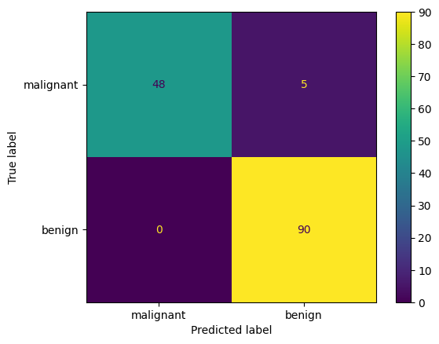
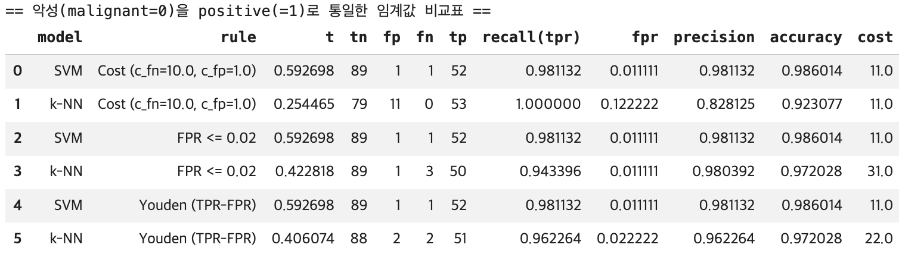
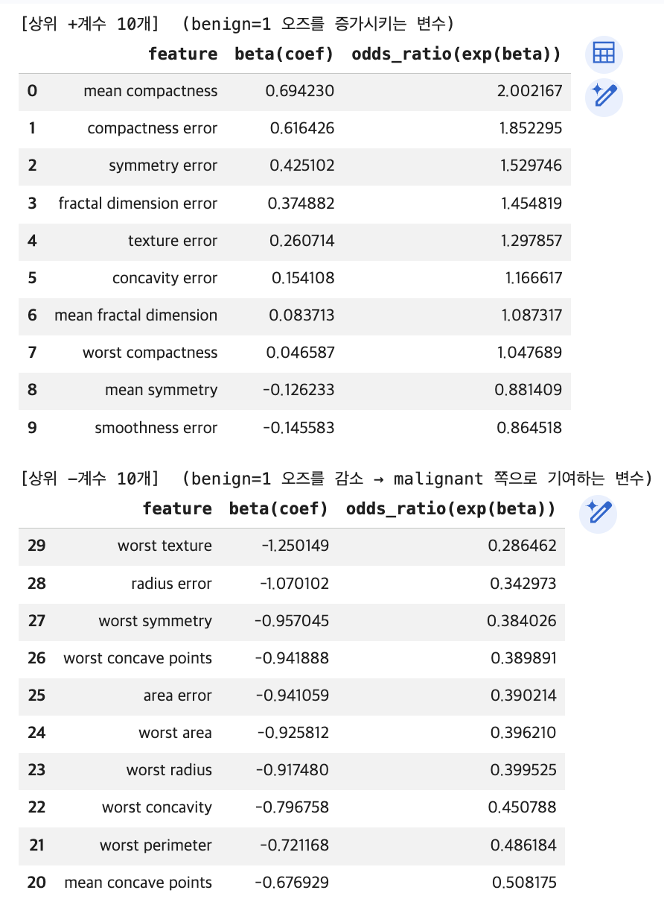
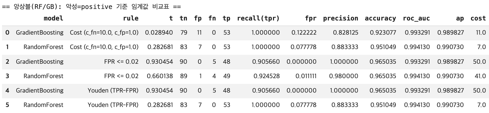
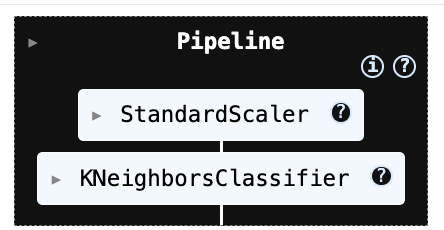
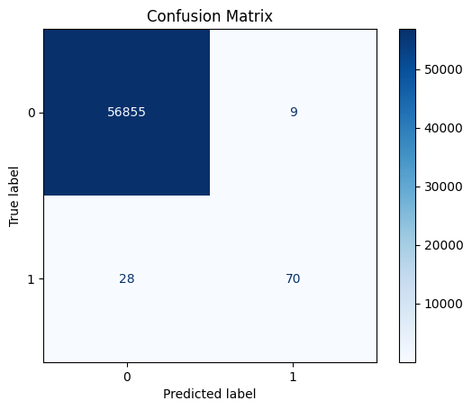
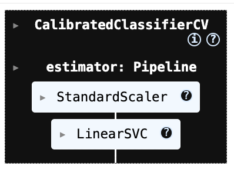
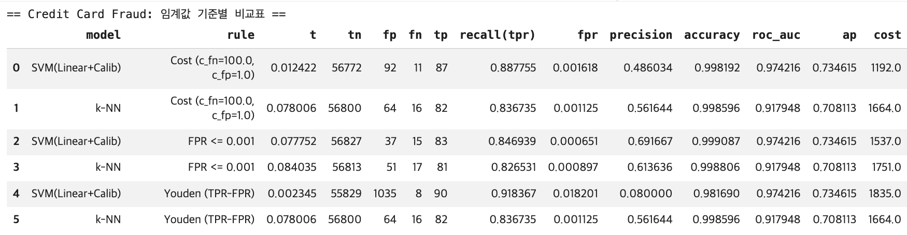
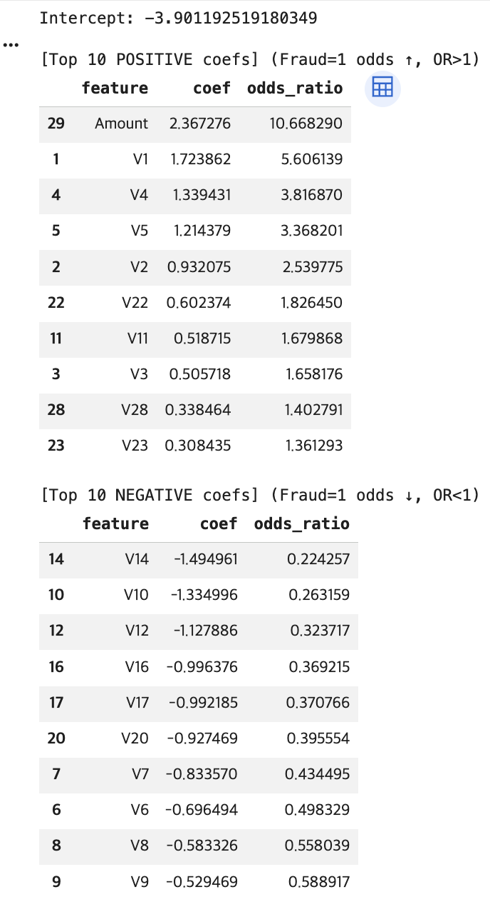
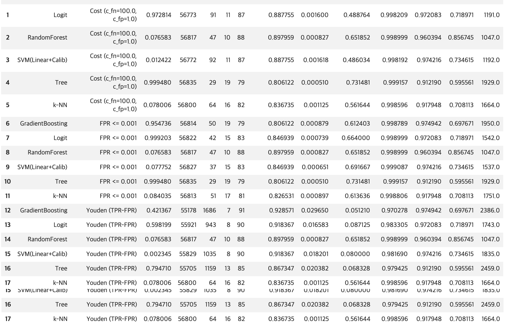

### 머신러닝 분류 (k-NN \| SVM) 이진형 분류 사례분석

#### 1. 사례분석 (이진분류)
##### \(1) 데이터

본 실습에서는 이진분류 예제로 널리 사용되는 Breast Cancer Wisconsin (Diagnostic) 데이터를 사용한다. 이 데이터는 유방 종양의 세포핵(nucleus) 형태 특성으로부터 종양이 악성(malignant 0) 인지 양성(benign 1) 인지를 분류하는 문제를 다룬다. 표본 수는 𝑛 = 569, 변수(특징) 수는 p=30이다.

30개의 입력 변수는 모두 연속형 수치 변수로, 종양의 형태를 요약한 통계적 특성들이다. 예를 들어 평균 반지름(mean radius), 둘레(mean perimeter), 면적(mean area) 등 “mean / error / worst” 유형의 파생 특징들이 포함된다.

```python
# 1) 데이터 불러오기: Breast Cancer Wisconsin (Diagnostic)
import numpy as np
import pandas as pd
from sklearn.datasets import load_breast_cancer

data = load_breast_cancer()

X = data.data
y = data.target
feature_names = data.feature_names
target_names = data.target_names

print("X shape:", X.shape)
print("y shape:", y.shape)
print("Classes:", dict(enumerate(target_names)))
print("Class counts:", dict(zip(*np.unique(y, return_counts=True))))

# DataFrame으로 보기 좋게(선택)
df = pd.DataFrame(X, columns=feature_names)
df["target"] = y
df.info()
```

##### \(2) 전처리

**왜 train/test 분할을 먼저 하는가?**

모형 성능 평가는 “새로운 데이터에서 얼마나 잘 맞추는가”를 보는 것이므로, 전체 데이터를 학습용(train) 과 평가용(test) 으로 나눈다. 이때 핵심 원칙은 테스트 데이터는 학습 과정에 절대 사용되지 않아야 한다는 점이다. (데이터 누수 방지)

코드에서는 다음처럼 75%는 학습, 25%는 테스트로 분할했다.

학습 데이터: 426개 / 테스트 데이터: 143개

**“층화(stratify)”는 왜 필요한가?**

이 데이터는 이진분류이며 클래스(악성/양성)의 비율이 212:357로 약간 불균형이다.
무작위 분할만 하면 우연히 한쪽 클래스가 테스트에 과소/과다 포함될 수 있어 평가가 흔들릴 수 있다.

train_test_split(..., stratify=y)는
훈련/테스트 각각에서 클래스 비율이 원 데이터와 유사하게 유지되도록 분할한다.

그래서 출력에서 train: (0) 159, (1) 267 / test : (0) 53, (1) 90처럼 비율이 큰 폭으로 깨지지 않는다.


**StandardScaler(표준화)를 왜 하는가?**

SVM(특히 RBF 커널)과 k-NN은 거리/내적 기반이라 변수 스케일에 매우 민감하다.

예를 들어, mean area 같은 변수는 값의 스케일이 크고, mean smoothness 같은 변수는 스케일이 작다. 표준화 없이 거리 계산을 하면 스케일이 큰 변수가 거리를 지배해, 모델이 “큰 단위 변수”만 보고 판단하는 부작용이 생긴다.

**파이프라인(Pipeline)을 쓰는 이유: 누수 방지 + 재사용성**

표준화는 반드시 학습 데이터에서만 평균/표준편차를 추정(fit)해야 한다. 만약 테스트 데이터까지 포함해 스케일을 맞추면, 테스트 정보가 학습 단계에 섞이는 데이터 누수가 발생한다. 즉, 테스트 데이터는 “변환(transform)”만 한다.

```python
# 2단계: train/test 분할(층화) + 표준화(Standardization) 파이프라인 준비

import numpy as np
import pandas as pd
from sklearn.datasets import load_breast_cancer
from sklearn.model_selection import train_test_split
from sklearn.pipeline import Pipeline
from sklearn.preprocessing import StandardScaler

# (1) 데이터 로드
data = load_breast_cancer()
X = data.data
y = data.target

# (2) train/test 분할 (층화: stratify=y)
X_train, X_test, y_train, y_test = train_test_split(
    X, y,
    test_size=0.25,
    random_state=42,
    stratify=y
)

print("[Split]")
print("X_train:", X_train.shape, "X_test:", X_test.shape)
print("y_train counts:", dict(zip(*np.unique(y_train, return_counts=True))))
print("y_test  counts:", dict(zip(*np.unique(y_test, return_counts=True))))

# (3) 표준화 파이프라인(학습 데이터로 fit, 테스트에는 transform만 적용)
scaler_pipe = Pipeline([
    ("scaler", StandardScaler())
])

# 표준화 적용(이후 k-NN, SVM 파이프라인에 그대로 끼워 넣을 예정)
X_train_scaled = scaler_pipe.fit_transform(X_train)
X_test_scaled  = scaler_pipe.transform(X_test)
```

[Split]
X_train: (426, 30) X_test: (143, 30)
<br>
y_train counts: {np.int64(0): np.int64(159), np.int64(1): np.int64(267)}
<br>
y_test  counts: {np.int64(0): np.int64(53), np.int64(1): np.int64(90)}

##### \(3) KNN

**kNN 분석 및 성능 출력**

이 코드는 Breast Cancer Wisconsin 데이터에 대해 k-NN 분류기를 학습하고, 테스트셋에서 기본 성능(정확도/혼동행렬/분류리포트)을 확인하는 절차를 구현한다. 특히 k-NN은 거리 기반 방법이므로 표준화(Standardization) 를 반드시 포함해야 하며, 이를 누수 없이 수행하기 위해 Pipeline을 사용한다.

먼저 Pipeline([("scaler", StandardScaler()), ("knn", KNeighborsClassifier(...))]) 형태로 전처리와 모델을 하나의 흐름으로 묶는다. 여기서 StandardScaler()는 각 변수를 훈련 데이터 기준 평균, 표준편차로 정규화 변환한다. 

이 변환은 거리 계산에서 특정 변수(스케일이 큰 변수)가 과도하게 영향을 주는 문제를 막기 위해 필수적이다. Pipeline을 쓰면 표준화의 fit이 훈련 데이터에서만 수행되고, 테스트 데이터에는 동일한 변환이 transform으로만 적용되어 데이터 누수(leakage) 를 방지한다.

KNeighborsClassifier의 주요 설정은 다음 의미를 갖는다.
n_neighbors=15: 예측 시 가장 가까운 이웃 k=15개를 사용한다. k가 작으면 잡음에 민감(분산↑), 너무 크면 경계가 과도하게 매끄러워짐(편향↑)이므로 적절한 균형이 필요하다.

p=2: 유클리드 거리(Euclidean)를 계산된다. (p=1이면 맨해튼 거리)

weights="distance": 단순 다수결이 아니라 가까운 이웃에 더 큰 가중치를 두어 투표한다. 경계 근처에서 더 안정적인 예측을 기대할 수 있다.

학습은 knn_model.fit(X_train, y_train)로 수행된다. k-NN은 손실함수 최적화로 파라미터를 학습하기보다는 “훈련 데이터를 저장해두고”, 예측 시 매번 이웃을 검색하는 형태이므로(게으른 학습), 실질적 계산 부담은 예측 단계에 더 크게 발생한다.

이후 predict(X_test)로 클래스 라벨을 예측하고, accuracy_score, confusion_matrix, classification_report를 통해 성능을 요약한다.

```python
from sklearn.pipeline import Pipeline
from sklearn.preprocessing import StandardScaler
from sklearn.neighbors import KNeighborsClassifier
from sklearn.metrics import accuracy_score, confusion_matrix, classification_report, ConfusionMatrixDisplay
import matplotlib.pyplot as plt

# k-NN 모델 (표준화 + kNN)
knn_model = Pipeline([
    ("scaler", StandardScaler()),
    ("knn", KNeighborsClassifier(
        n_neighbors=15,      # k
        weights="distance",  # 가까운 이웃 가중↑
        p=2                  # p=2: Euclidean, p=1: Manhattan
    ))
])

# 학습
knn_model.fit(X_train, y_train)

# 예측(클래스)
y_pred_knn = knn_model.predict(X_test)

# labels는 0,1로 유지
labels = knn_model.named_steps["knn"].classes_   # array([0,1])

# labels(0,1)에 대응되는 "이름"을 문자열로 만들어 줌
target_names = data.target_names[labels].astype(str)  # ['malignant','benign']

print("[k-NN] Accuracy:", accuracy_score(y_test, y_pred_knn))

cm = confusion_matrix(y_test, y_pred_knn, labels=labels)
print("[k-NN] Confusion matrix:\n", cm)

print("[k-NN] Classification report:\n",
      classification_report(
          y_test, y_pred_knn,
          labels=labels,
          target_names=target_names
      ))

disp = ConfusionMatrixDisplay(confusion_matrix=cm, display_labels=target_names)
disp.plot(values_format="d")
plt.show()
```
```text
[k-NN] Accuracy: 0.965034965034965
[k-NN] Confusion matrix:
 [[48  5]
 [ 0 90]]
[k-NN] Classification report:
               precision    recall  f1-score   support

   malignant       1.00      0.91      0.95        53
      benign       0.95      1.00      0.97        90

    accuracy                           0.97       143
   macro avg       0.97      0.95      0.96       143 
weighted avg       0.97      0.97      0.96       143
```

{fig-align="center" width="60%"}

**사후 확률 출력**

```python
import pandas as pd
import numpy as np

def posterior_df(model, X, data=None, n=10):
    """
    model: sklearn estimator or Pipeline (with predict_proba)
    X: feature matrix (e.g., X_test)
    data: load_breast_cancer() 객체 (있으면 클래스명 표시)
    n: 앞에서 n개만 미리보기
    """
    proba = model.predict_proba(X)

    # classes_ 가져오기 (Pipeline이면 마지막 step)
    classes = getattr(model, "classes_", None)
    if classes is None and hasattr(model, "named_steps"):
        classes = list(model.named_steps.values())[-1].classes_
    classes = np.array(classes)

    # 컬럼명: 가능하면 malignant/benign 같은 이름으로
    if data is not None and hasattr(data, "target_names"):
        colnames = [f"P({data.target_names[c]})" for c in classes]
    else:
        colnames = [f"P(class={c})" for c in classes]

    df = pd.DataFrame(proba, columns=colnames)
    return df.head(n), df  # (미리보기, 전체)

# 예시) k-NN 사후확률
knn_head, knn_all = posterior_df(knn_model, X_test, data=data, n=10)
print("=== k-NN posterior (head) ===")
display(knn_head)
```

```text
=== k-NN posterior (head) ===
P(malignant)	P(benign)
0	0.061387	0.938613
1	1.000000	0.000000
2	0.319358	0.680642
3	0.134996	0.865004
4	0.422818	0.577182
5	1.000000	0.000000
6	0.940374	0.059626
7	0.934269	0.065731
8	1.000000	0.000000
9	0.000000	1.000000
```

**k-NN: ROC/PR 곡선과 임계값(Threshold) 선택**

이 코드는 k-NN 분류기가 출력하는 확률(score) 을 이용해, (1) ROC 곡선과 PR 곡선을 계산하고 (2) 임계값 t를 바꿀 때 혼동행렬과 성능지표가 어떻게 변하는지 확인하며 (3) 운영 목적에 맞는 임계값을 선택하는 절차를 구현한다. 

핵심 아이디어는 “확률을 0/1로 바꾸는 기준이 임계값이며, 임계값을 어디에 두느냐에 따라 FP/FN이 달라진다”는 점이다.

ROC/PR 및 임계값 선택은 항상 “어떤 클래스를 positive(관심 이벤트)로 볼 것인가”를 먼저 정해야 한다. Breast Cancer 데이터는 라벨이 0=malignant(악성), 1=benign(양성) 이므로, 코드의 기본 설정(A)은 positive=1(benign) 로 둔다. 따라서 y_pos = y_test 그대로 사용하고, 확률도 P(y=1|x)를 사용한다.

다만 의료 진단에서는 보통 “악성(놓치면 치명적)”을 positive로 두는 해석이 자연스럽다. 이를 위해 코드에는 옵션(B)이 포함되어 있으며, 이 경우 y_pos = (y_test==0)처럼 악성을 1로 재코딩하고, score도 P(malignant|x)가 되도록 1 - P(benign|x)로 뒤집어 사용한다.
즉, 같은 모델이라도 positive 정의에 따라 ROC/PR의 의미가 달라진다.

k-NN은 predict_proba를 제공하므로, 테스트 데이터에 대해 “positive 클래스의 확률”을 다음처럼 만든다. p_pos1 = knn_model.predict_proba(X_test)[:,1] 이 확률 벡터가 이후 ROC/PR 곡선과 임계값 분석의 유일한 핵심 입력(score) 이 된다.

**ROC 곡선과 AUC 계산**

ROC는 임계값 t를 0에서 1까지 움직이며, 각 임계값에서 다음 두 값을 계산해 그린 곡선이다.

- TPR(재현율, 민감도) = TP / (TP + FN)
- FPR(위양성률) = FP / (FP + TN)

코드의 roc_curve(y_pos, score)는 (FPR 배열, TPR 배열, 그리고 그때의 임계값 배열)을 반환한다. 이어서 auc(fpr, tpr)는 ROC 곡선 아래 면적(AUC)을 계산한다.
AUC는 “positive 샘플이 negative보다 더 높은 점수(score)를 받도록 정렬되는 능력(순위 분리 성능)”을 요약한 값이다.

**PR 곡선과 AP 계산**

PR 곡선은 임계값 변화에 따라 다음 두 값의 trade-off를 본다.

- Precision(정밀도) = TP / (TP + FP)
- Recall(재현율) = TP / (TP + FN)

특히 양성 클래스가 희귀한 상황에서는 ROC보다 PR이 운영 품질을 더 직접적으로 보여주는 경우가 많다. average_precision_score로 계산한 AP는 PR 곡선을 하나의 수치로 요약한 값이다.

**“임계값 t 하나”에서 혼동행렬과 지표를 계산하는 함수**

metrics_at_threshold()는 특정 임계값 t를 주면 다음을 수행한다.

확률을 이진 예측으로 변환: y_hat = (score >= t). 즉, score가 임계값 이상이면 positive로 판정한다.

혼동행렬(TN, FP, FN, TP) 계산하고 그 혼동행렬로부터 지표 recall(TPR), fpr, precision, accuracy을 계산한다. 이 함수는 ROC/PR 같은 “곡선”을 실제 운영 관점의 “한 점(임계값 하나)”으로 풀어주는 역할을 한다.

여러 임계값(grid)을 찍어보며 FP/FN trade-off를 확인: 코드는 t=0.1,0.2,…,0.9에 대해 metrics_at_threshold 결과를 출력한다. 일반적으로 임계값을 올리면 positive 판정이 보수적으로 변하면서: FP는 감소(정밀도는 증가하는 경향), FN은 증가(재현율은 감소하는 경향). 즉, 임계값은 “오경보(FP)를 줄이느냐, 놓침(FN)을 줄이느냐”의 균형을 조절하는 손잡이다.

**임계값 선택 규칙 (A): Youden’s J 최대화**

Youden’s J는 ROC 관점에서 균형점을 잡는 단순한 기준이다.

J(t) = TPR(t) − FPR(t)

코드는 모든 ROC 점에서 J를 계산하고, J가 최대인 지점의 임계값을 선택한다.
이 방식은 “재현율을 높이되 위양성률도 너무 크지 않게” 만드는 균형형 기준으로 이해하면 된다.

**임계값 선택 규칙 (B): FPR 제약 조건 하에서 최적화**

운영에서 “오경보는 최대 α까지만 허용” 같은 정책이 있을 때, 먼저 FPR ≤ α를 만족하는 임계값 후보들만 남긴 뒤, 그중에서 TPR(재현율)이 가장 큰 임계값을 선택한다.
즉, 제약 조건을 먼저 만족시키고 그 안에서 성능을 최대로 만드는 방식이다. 예컨대 α=0.02는 매우 보수적인 오경보 제한에 해당하므로 임계값이 상대적으로 높아지고, 그 결과 recall이 일부 감소할 수 있다.

**임계값 선택 규칙 (C): 비용 기반 최소화**

현실에서는 FN과 FP의 비용이 다르므로, 비용함수를 두고 임계값을 고를 수 있다.

Cost(t) = c_fn * FN(t) + c_fp * FP(t)

코드는 가능한 임계값 후보들을 순회하면서 비용을 계산하고, 비용이 최소인 임계값을 선택한다.
예를 들어 c_fn을 크게 두면(놓침 비용이 큼), 모델은 FN을 줄이기 위해 임계값을 낮추는 방향으로 선택되는 경향이 강해진다. 반대로 c_fp가 크면 오경보를 줄이기 위해 임계값을 올리는 방향이 된다.

```python
# k-NN: ROC / PR + 임계값(Threshold) 선택 코드
# (전제) knn_model이 이미 fit 되어 있고, X_test, y_test가 준비되어 있어야 함.

import numpy as np
from sklearn.metrics import (
    roc_curve, auc,
    precision_recall_curve, average_precision_score,
    confusion_matrix
)

# =========================================================
# 0) Positive(관심 클래스) 정의
#    - 기본: positive = 1 (benign)  [데이터 라벨 그대로]
#    - 의료진단 관점: positive = 0 (malignant) 로 바꾸려면 옵션 B 사용
# =========================================================

# 1) score(확률): P(y=1 | x)
p_pos1 = knn_model.predict_proba(X_test)[:, 1]

# A) positive = 1(benign)
y_pos = y_test
score = p_pos1

# B) (옵션) positive = malignant(0)로 변경 시
# y_pos = (y_test == 0).astype(int)
# score = 1.0 - p_pos1   # = P(malignant | x)

# =========================================================
# 1) ROC curve + AUC
# =========================================================
fpr, tpr, thr_roc = roc_curve(y_pos, score)
roc_auc = auc(fpr, tpr)

# =========================================================
# 2) PR curve + AP
# =========================================================
precision, recall, thr_pr = precision_recall_curve(y_pos, score)
ap = average_precision_score(y_pos, score)

print("[k-NN] ROC AUC =", roc_auc)
print("[k-NN] PR  AP  =", ap)
print("ROC thresholds:", thr_roc.shape, "| PR thresholds:", thr_pr.shape)

# =========================================================
# 3) 임계값 t에서 혼동행렬/지표 계산
# =========================================================
def metrics_at_threshold(y_true01, score, t):
    """
    y_true01: {0,1} (1이 positive)
    score   : positive 점수(확률)
    t       : threshold
    """
    y_hat = (score >= t).astype(int)
    tn, fp, fn, tp = confusion_matrix(y_true01, y_hat).ravel()

    recall_ = tp / (tp + fn) if (tp + fn) > 0 else 0.0  # TPR
    fpr_    = fp / (fp + tn) if (fp + tn) > 0 else 0.0
    prec_   = tp / (tp + fp) if (tp + fp) > 0 else 0.0
    acc_    = (tp + tn) / (tp + tn + fp + fn)

    return {
        "t": float(t),
        "tn": int(tn), "fp": int(fp), "fn": int(fn), "tp": int(tp),
        "recall(tpr)": float(recall_),
        "fpr": float(fpr_),
        "precision": float(prec_),
        "accuracy": float(acc_)
    }

# =========================================================
# 4) 임계값 grid로 변화 확인(0.1~0.9)
# =========================================================
grid = np.arange(0.1, 1.0, 0.1)
for t in grid:
    print(metrics_at_threshold(y_pos, score, t))

# =========================================================
# 5) 임계값 선택 규칙 (A) Youden J = TPR - FPR 최대
# =========================================================
J = tpr - fpr
best_idx = np.argmax(J)
best_t_youden = thr_roc[best_idx]

print("\n[Youden J]")
print("best t =", best_t_youden)
print(metrics_at_threshold(y_pos, score, best_t_youden))

# =========================================================
# 6) 임계값 선택 규칙 (B) FPR <= alpha 조건에서 TPR 최대
# =========================================================
def best_threshold_fpr_constraint(y_true01, score, alpha=0.02):
    fpr, tpr, thr = roc_curve(y_true01, score)
    candidates = np.where(fpr <= alpha)[0]
    if len(candidates) == 0:
        return None
    i = candidates[np.argmax(tpr[candidates])]
    return thr[i]

alpha = 0.02
best_t_fpr = best_threshold_fpr_constraint(y_pos, score, alpha=alpha)

print("\n[FPR constraint]")
print("alpha =", alpha, "best t =", best_t_fpr)
if best_t_fpr is not None:
    print(metrics_at_threshold(y_pos, score, best_t_fpr))

# =========================================================
# 7) 임계값 선택 규칙 (C) 비용 기반: c_fn*FN + c_fp*FP 최소
# =========================================================
def best_threshold_cost(y_true01, score, c_fn=10.0, c_fp=1.0):
    thresholds = np.unique(np.r_[0.0, score, 1.0])
    best_t, best_m, best_cost = None, None, np.inf

    for t in thresholds:
        m = metrics_at_threshold(y_true01, score, t)
        cost = c_fn * m["fn"] + c_fp * m["fp"]
        if cost < best_cost:
            best_t, best_m, best_cost = float(t), m, float(cost)

    return best_t, best_m, best_cost

best_t_cost, best_m_cost, best_cost_val = best_threshold_cost(y_pos, score, c_fn=10, c_fp=1)

print("\n[Cost-based]")
print("best t =", best_t_cost, "cost =", best_cost_val)
print(best_m_cost)
```

**(A) Youden J 최대:** t≈0.5953 / tn=51, fp=2, fn=2, tp=88 

FPR = 0.0377, TPR(recall)=0.9778

ROC 관점에서 TPR을 높이면서 FPR도 낮추는 “균형점”이다. t=0.5보다 FP(악성 놓침)가 5→2로 감소하지만, FN이 0→2로 소폭 증가한다.

**(B) FPR 제약:** α=0.02 → t≈0.7527

tn=53, fp=0, fn=11, tp=79 

FPR=0 (악성을 benign으로 놓치는 일이 0) 대신 FN=11 (benign을 악성으로 오경보 증가) → “악성(malignant)을 benign으로 놓치면 안 된다” 같은 정책이라면(오경보 비용보다 놓침 비용이 큰 경우) 이 방식이 자연스럽다.

**(C) 비용 기반:** $C_{FN}=10, C_{FP}=1 $ → t≈0.7527

tn=49, fp=4, fn=0, tp=90, cost=4

FN(benign을 악성으로 오경보)을 10배로 벌점 주었기 때문에, FN=0을 유지하려고 t가 상대적으로 낮게 선택된다. 그 대가로 FP=4를 허용한다. → 이 결과는 “양성(benign)을 악성으로 오경보 내는 게 매우 비싸다”는 운영 가정에 맞춘 임계값입니다.

[k-NN] ROC AUC = 0.9947589098532496
<br>
[k-NN] PR  AP  = 0.9968371869230795
<br>
ROC thresholds: (11,) | PR thresholds: (52,)
{'t': 0.1, 'tn': 43, 'fp': 10, 'fn': 0, 'tp': 90, 'recall(tpr)': 1.0, 'fpr': 0.18867924528301888, 'precision': 0.9, 'accuracy': 0.9300699300699301}
<br>
(중간생략)
<br>
{'t': 0.9, 'tn': 53, 'fp': 0, 'fn': 18, 'tp': 72, 'recall(tpr)': 0.8, 'fpr': 0.0, 'precision': 1.0, 'accuracy': 0.8741258741258742}

[Youden J]
<br>
best t = 0.5952751094038484
<br>
{'t': 0.5952751094038484, 'tn': 51, 'fp': 2, 'fn': 2, 'tp': 88, 'recall(tpr)': 0.9777777777777777, 'fpr': 0.03773584905660377, 'precision': 0.9777777777777777, 'accuracy': 0.972027972027972}

[FPR constraint]
<br>
alpha = 0.02 best t = 0.7527356507381722
<br>
{'t': 0.7527356507381722, 'tn': 53, 'fp': 0, 'fn': 11, 'tp': 79, 'recall(tpr)': 0.8777777777777778, 'fpr': 0.0, 'precision': 1.0, 'accuracy': 0.9230769230769231}

[Cost-based]
<br>
best t = 0.5563197878398277 cost = 4.0
<br>
{'t': 0.5563197878398277, 'tn': 49, 'fp': 4, 'fn': 0, 'tp': 90, 'recall(tpr)': 1.0, 'fpr': 0.07547169811320754, 'precision': 0.9574468085106383, 'accuracy': 0.972027972027972}

##### \(4) SVM

이 코드는 Breast Cancer Wisconsin 데이터에 대해 SVM(서포트 벡터 머신) 분류기를 학습하고, 테스트 데이터에서 기본 분류 성능(정확도·혼동행렬·분류리포트) 을 확인하는 절차를 구현한다. 

특히 SVM은 입력 변수의 스케일에 민감하므로, 표준화(Standardization) 와 모델을 Pipeline으로 묶어 전처리와 학습·예측 과정을 한 번에 처리하도록 구성하였다.

먼저 Pipeline([("scaler", StandardScaler()), ("svm", SVC(...))]) 형태로 파이프라인을 정의한다. 여기서 StandardScaler()는 훈련 데이터에서 각 변수의 평균과 표준편차를 추정한 뒤, 모든 변수를 정규 변환하여 평균 0, 분산 1 수준으로 맞춘다. 

SVM은 거리·내적 기반(특히 RBF 커널은 거리 기반)의 분류기이므로 변수 스케일이 다르면 특정 변수의 영향이 과도해질 수 있는데, 표준화는 이를 방지하여 학습을 안정화한다. 또한 Pipeline을 사용하면 표준화의 fit은 훈련 데이터에만 적용되고 테스트 데이터에는 같은 변환이 transform으로만 적용되어, 테스트 정보가 학습에 섞이는 데이터 누수(leakage) 를 막는다.

두 번째 단계인 SVC(...)는 SVM 분류기를 의미한다. 여기서 kernel="rbf"는 비선형 분류를 가능하게 하는 가우시안(RBF) 커널을 사용한다는 뜻이며, 입력공간에서 선형 분리가 어렵더라도 고차원 특징공간에서의 분리 초평면을 통해 복잡한 결정경계를 학습할 수 있다. 

C=1.0은 마진을 넓게 유지하려는 성향과 학습 데이터 오분류를 줄이려는 성향 사이의 균형을 조절하는 규제(regularization) 파라미터로, C가 커지면 오분류를 더 강하게 벌점 주어 훈련 데이터에 더 맞추려 하고, 작아지면 마진을 넓게 두며 일반화를 더 중시하는 경향이 있다. 

gamma="scale"은 RBF 커널의 폭(영향 범위)을 자동으로 설정하는 옵션으로, 값이 커지면 결정경계가 더 구불구불해져 과적합 위험이 커지고, 작아지면 더 매끈한 경계가 된다. probability=True는 SVM이 기본적으로는 “확률”이 아니라 결정함수 값(decision score) 을 출력하는 모델이기 때문에, ROC/PR 곡선 및 임계값 조정을 위해 확률 형태의 출력(predict_proba) 을 사용할 수 있도록 내부적으로 확률 보정(calibration)을 수행하겠다는 설정이다. 

random_state=42는 확률 보정 과정 등에서 재현성을 확보하기 위한 난수 시드로 이해하면 된다.

모델 학습은 svm_model.fit(X_train, y_train)에서 이루어진다. 이때 파이프라인이 먼저 훈련 데이터를 표준화한 뒤, 표준화된 입력으로 SVM을 학습한다. 학습이 끝나면 svm_model.predict(X_test)로 테스트 데이터의 클래스 라벨(0/1)을 예측한다. 

마지막으로 accuracy_score는 전체 정확도를 계산하고, confusion_matrix는 실제 라벨과 예측 라벨을 교차 집계하여 TN, FP, FN, TP의 구조를 제공한다. classification_report는 클래스별로 precision, recall, F1-score를 요약해주므로, 단순 정확도뿐 아니라 “악성을 얼마나 놓치는지(FN)” 또는 “양성을 얼마나 악성으로 오경보하는지(FP)”와 같은 오류 유형을 더 세밀하게 해석할 수 있게 한다.

요약하면, 이 코드는 (표준화 → RBF SVM 학습 → 테스트 예측 → 기본 성능 평가) 의 전형적인 이진분류 실습 흐름을 파이프라인 형태로 깔끔하게 구현한 예제이며, 이후 ROC/PR 분석 및 임계값 선택으로 자연스럽게 확장할 수 있는 기본 골격을 제공한다.

```python
from sklearn.pipeline import Pipeline
from sklearn.preprocessing import StandardScaler
from sklearn.svm import SVC
from sklearn.metrics import accuracy_score, confusion_matrix, classification_report

# SVM 모델 (표준화 + SVM)
svm_model = Pipeline([
    ("scaler", StandardScaler()),
    ("svm", SVC(
        kernel="rbf",        # 'linear', 'rbf' 등
        C=1.0,
        gamma="scale",
        probability=True,    # ROC/PR용 확률 필요
        random_state=42
    ))
])

# 학습
svm_model.fit(X_train, y_train)

# 예측(클래스)
y_pred_svm = svm_model.predict(X_test)

# 평가(기본)
print("[SVM] Accuracy:", accuracy_score(y_test, y_pred_svm))
print("[SVM] Confusion matrix:\n", confusion_matrix(y_test, y_pred_svm))
print("[SVM] Classification report:\n", classification_report(y_test, y_pred_svm, target_names=data.target_names))
```
```text
[SVM] Accuracy: 0.9790209790209791
[SVM] Confusion matrix:
 [[52  1]
 [ 2 88]]
[SVM] Classification report:
               precision    recall  f1-score   support

   malignant       0.96      0.98      0.97        53
      benign       0.99      0.98      0.98        90

    accuracy                           0.98       143
   macro avg       0.98      0.98      0.98       143
weighted avg       0.98      0.98      0.98       143
```

```python
# =========================================================
# SVM 임계값(Threshold) 결정 파트
#   - 지표 함수(metrics_at_threshold)
#   - Youden J 최적
#   - FPR <= alpha 제약 최적
#   - 비용 기반(c_fn*FN + c_fp*FP) 최적
# (전제) svm_model.fit(...) 완료, X_test, y_test 존재
# =========================================================

import numpy as np
from sklearn.metrics import confusion_matrix, roc_curve

# ---------------------------------------------------------
# 0) Positive(관심 클래스) 정의
#   - 기본: positive = 1 (benign)  [원 라벨 그대로]
#   - 의료진단 관점: positive = malignant(0)로 바꾸려면 옵션 B 사용
# ---------------------------------------------------------

# SVM 확률(score): P(y=1 | x)
p_pos1_svm = svm_model.predict_proba(X_test)[:, 1]

# A) positive = 1(benign)
y_pos = y_test
score = p_pos1_svm

# B) (옵션) positive = malignant(0)로 변경 시 (악성을 1로 재코딩)
# y_pos = (y_test == 0).astype(int)
# score = 1.0 - p_pos1_svm   # = P(malignant | x)

# ---------------------------------------------------------
# 1) 임계값 t에서 혼동행렬/지표 계산
# ---------------------------------------------------------
def metrics_at_threshold(y_true01, score, t):
    """
    y_true01: {0,1} (1이 positive)
    score   : positive 점수(확률)
    t       : threshold
    """
    y_hat = (score >= t).astype(int)
    tn, fp, fn, tp = confusion_matrix(y_true01, y_hat).ravel()

    recall_ = tp / (tp + fn) if (tp + fn) > 0 else 0.0  # TPR
    fpr_    = fp / (fp + tn) if (fp + tn) > 0 else 0.0
    prec_   = tp / (tp + fp) if (tp + fp) > 0 else 0.0
    acc_    = (tp + tn) / (tp + tn + fp + fn)

    return {
        "t": float(t),
        "tn": int(tn), "fp": int(fp), "fn": int(fn), "tp": int(tp),
        "recall(tpr)": float(recall_),
        "fpr": float(fpr_),
        "precision": float(prec_),
        "accuracy": float(acc_)
    }

print("[Default t=0.5]")
print(metrics_at_threshold(y_pos, score, 0.5))

# (선택) 임계값 변화 감 확인
print("\n[Grid check]")
for t in np.arange(0.1, 1.0, 0.1):
    print(metrics_at_threshold(y_pos, score, t))

# ---------------------------------------------------------
# 2) (A) Youden's J = TPR - FPR 최대화
# ---------------------------------------------------------
fpr, tpr, thr_roc = roc_curve(y_pos, score)
J = tpr - fpr
best_t_youden = float(thr_roc[np.argmax(J)])

print("\n[Youden J]")
print("best t =", best_t_youden)
print(metrics_at_threshold(y_pos, score, best_t_youden))

# ---------------------------------------------------------
# 3) (B) FPR <= alpha 제약에서 TPR 최대화
# ---------------------------------------------------------
def best_threshold_fpr_constraint(y_true01, score, alpha=0.02):
    fpr, tpr, thr = roc_curve(y_true01, score)
    candidates = np.where(fpr <= alpha)[0]
    if len(candidates) == 0:
        return None
    i = candidates[np.argmax(tpr[candidates])]
    return float(thr[i])

alpha = 0.02
best_t_fpr = best_threshold_fpr_constraint(y_pos, score, alpha=alpha)

print("\n[FPR constraint]")
print("alpha =", alpha, "best t =", best_t_fpr)
if best_t_fpr is not None:
    print(metrics_at_threshold(y_pos, score, best_t_fpr))

# ---------------------------------------------------------
# 4) (C) 비용 기반: cost = c_fn*FN + c_fp*FP 최소화
# ---------------------------------------------------------
def best_threshold_cost(y_true01, score, c_fn=10.0, c_fp=1.0):
    thresholds = np.unique(np.r_[0.0, score, 1.0])
    best_t, best_m, best_cost = None, None, np.inf

    for t in thresholds:
        m = metrics_at_threshold(y_true01, score, t)
        cost = c_fn * m["fn"] + c_fp * m["fp"]
        if cost < best_cost:
            best_t, best_m, best_cost = float(t), m, float(cost)

    return best_t, best_m, best_cost

best_t_cost, best_m_cost, best_cost_val = best_threshold_cost(
    y_pos, score, c_fn=10, c_fp=1
)

print("\n[Cost-based]")
print("best t =", best_t_cost, "cost =", best_cost_val)
print(best_m_cost)
```

[Default t=0.5]
{'t': 0.5, 'tn': 52, 'fp': 1, 'fn': 2, 'tp': 88, 'recall(tpr)': 0.9777777777777777, 'fpr': 0.018867924528301886, 'precision': 0.9887640449438202, 'accuracy': 0.9790209790209791}

[Grid check]
{'t': 0.1, 'tn': 44, 'fp': 9, 'fn': 0, 'tp': 90, 'recall(tpr)': 1.0, 'fpr': 0.16981132075471697, 'precision': 0.9090909090909091, 'accuracy': 0.9370629370629371}

(이하 생략)

[Youden J] best t = 0.4325023552646032

{'t': 0.4325023552646032, 'tn': 52, 'fp': 1, 'fn': 1, 'tp': 89, 'recall(tpr)': 0.9888888888888889, 'fpr': 0.018867924528301886, 'precision': 0.9888888888888889, 'accuracy': 0.986013986013986}

[FPR constraint] alpha = 0.02 best t = 0.4325023552646032

{'t': 0.4325023552646032, 'tn': 52, 'fp': 1, 'fn': 1, 'tp': 89, 'recall(tpr)': 0.9888888888888889, 'fpr': 0.018867924528301886, 'precision': 0.9888888888888889, 'accuracy': 0.986013986013986}

[Cost-based] best t = 0.2980459103264749 cost = 3.0

{'t': 0.2980459103264749, 'tn': 50, 'fp': 3, 'fn': 0, 'tp': 90, 'recall(tpr)': 1.0, 'fpr': 0.05660377358490566, 'precision': 0.967741935483871, 'accuracy': 0.9790209790209791}

##### \(5) knn vs.SVM 비교

```python
import numpy as np
import pandas as pd
from sklearn.metrics import roc_curve, confusion_matrix

# =========================================================
# 1) 악성=positive(1)로 재코딩 + 모델 score(악성 확률) 추출
# =========================================================
def get_score_for_class(model, X, class_label):
    """predict_proba 기반으로 특정 class_label의 확률을 반환 (Pipeline 포함)."""
    if not hasattr(model, "predict_proba"):
        raise ValueError("This model has no predict_proba. (SVC는 probability=True 필요)")
    proba = model.predict_proba(X)

    # Pipeline인 경우 classes_ 접근을 안전하게 처리
    classes = getattr(model, "classes_", None)
    if classes is None and hasattr(model, "named_steps"):
        classes = list(model.named_steps.values())[-1].classes_
    classes = np.array(classes)

    idx = np.where(classes == class_label)[0][0]
    return proba[:, idx]

# 악성(malignant=0)을 positive=1로 두기
y_pos = (y_test == 0).astype(int)  # 1이면 malignant

# 각 모델의 "악성 확률" score
score_knn = get_score_for_class(knn_model, X_test, class_label=0)  # P(malignant|x)
score_svm = get_score_for_class(svm_model, X_test, class_label=0)  # P(malignant|x)

# =========================================================
# 2) 임계값 t에서 지표 계산
# =========================================================
def metrics_at_threshold(y_true01, score, t):
    y_hat = (score >= t).astype(int)
    tn, fp, fn, tp = confusion_matrix(y_true01, y_hat).ravel()

    recall_ = tp / (tp + fn) if (tp + fn) > 0 else 0.0  # TPR
    fpr_    = fp / (fp + tn) if (fp + tn) > 0 else 0.0
    prec_   = tp / (tp + fp) if (tp + fp) > 0 else 0.0
    acc_    = (tp + tn) / (tp + tn + fp + fn)

    return {
        "t": float(t),
        "tn": int(tn), "fp": int(fp), "fn": int(fn), "tp": int(tp),
        "recall(tpr)": float(recall_),
        "fpr": float(fpr_),
        "precision": float(prec_),
        "accuracy": float(acc_)
    }

# =========================================================
# 3) 임계값 선택 규칙 3종
# =========================================================
def threshold_youden(y_true01, score):
    fpr, tpr, thr = roc_curve(y_true01, score)
    J = tpr - fpr
    return float(thr[np.argmax(J)])

def threshold_fpr_constraint(y_true01, score, alpha=0.02):
    fpr, tpr, thr = roc_curve(y_true01, score)
    cand = np.where(fpr <= alpha)[0]
    if len(cand) == 0:
        return None
    i = cand[np.argmax(tpr[cand])]
    return float(thr[i])

def threshold_cost(y_true01, score, c_fn=10.0, c_fp=1.0):
    thresholds = np.unique(np.r_[0.0, score, 1.0])
    best_t, best_cost = None, np.inf
    for t in thresholds:
        m = metrics_at_threshold(y_true01, score, t)
        cost = c_fn * m["fn"] + c_fp * m["fp"]
        if cost < best_cost:
            best_cost = cost
            best_t = float(t)
    return best_t, float(best_cost)

# =========================================================
# 4) k-NN vs SVM 비교표 생성
# =========================================================
def build_rows(model_name, y_true01, score, alpha=0.02, c_fn=10.0, c_fp=1.0):
    rows = []

    # Youden
    t_y = threshold_youden(y_true01, score)
    m_y = metrics_at_threshold(y_true01, score, t_y)
    m_y.update({"model": model_name, "rule": "Youden (TPR-FPR)", "cost": c_fn*m_y["fn"] + c_fp*m_y["fp"]})
    rows.append(m_y)

    # FPR constraint
    t_f = threshold_fpr_constraint(y_true01, score, alpha=alpha)
    if t_f is not None:
        m_f = metrics_at_threshold(y_true01, score, t_f)
        m_f.update({"model": model_name, "rule": f"FPR <= {alpha}", "cost": c_fn*m_f["fn"] + c_fp*m_f["fp"]})
    else:
        m_f = {"model": model_name, "rule": f"FPR <= {alpha}", "t": None,
               "tn": None, "fp": None, "fn": None, "tp": None,
               "recall(tpr)": None, "fpr": None, "precision": None, "accuracy": None,
               "cost": None}
    rows.append(m_f)

    # Cost-based
    t_c, best_cost = threshold_cost(y_true01, score, c_fn=c_fn, c_fp=c_fp)
    m_c = metrics_at_threshold(y_true01, score, t_c)
    m_c.update({"model": model_name, "rule": f"Cost (c_fn={c_fn}, c_fp={c_fp})", "cost": best_cost})
    rows.append(m_c)

    return rows

alpha = 0.02
c_fn, c_fp = 10.0, 1.0

rows = []
rows += build_rows("k-NN", y_pos, score_knn, alpha=alpha, c_fn=c_fn, c_fp=c_fp)
rows += build_rows("SVM",  y_pos, score_svm, alpha=alpha, c_fn=c_fn, c_fp=c_fp)

df_cmp = pd.DataFrame(rows)[
    ["model","rule","t","tn","fp","fn","tp","recall(tpr)","fpr","precision","accuracy","cost"]
].sort_values(["rule","model"]).reset_index(drop=True)

print("== 악성(malignant=0)을 positive(=1)로 통일한 임계값 비교표 ==")
display(df_cmp)
```

SVM은 t≈0.593에서 TN=89, FP=1, FN=1, TP=52로 나타나며, 이는 악성 53건 중 52건을 찾아 재현율(Recall)=0.981을 달성하면서도, 양성 90건 중 오경보는 1건뿐이라 FPR=0.011로 매우 낮다는 뜻이다. 정확도도 0.986으로 높다. 

즉 SVM은 놓침(FN)과 오경보(FP)를 동시에 작게 유지하는 균형형 운영점을 제공한다. 또한 이 데이터에서는 Youden 기준과 FPR≤0.02 제약 기준이 같은 임계값(동일한 ROC 구간의 최적점)으로 수렴하여, “오경보를 2% 이내로 제한”하더라도 성능 저하 없이 같은 운영점이 선택되었다고 해석할 수 있다. (표본이 유한하면 ROC가 계단형이어서 여러 규칙이 같은 점을 선택하는 일이 흔하다.)

반면 k-NN은 비용기반(c_FN=10, c_FP=1)에서 t≈0.254로 임계값이 낮게 선택되며, 이때 FN=0이 되어 악성 놓침이 발생하지 않는다(Recall=1.0). 하지만 그 대가로 FP=11이 발생해 FPR이 0.122로 커지고, 정확도도 0.923으로 떨어진다. 즉 k-NN의 비용기반 선택은 “악성을 절대 놓치지 않는 것”을 우선하는 대신, 양성에 대한 오경보를 많이 감수하는 운영점이다.

k-NN에서 FPR≤0.02 제약을 강하게 적용하면 t≈0.423에서 FP=1로 오경보를 거의 SVM 수준까지 줄일 수 있지만, 그때 FN=3으로 악성 놓침이 증가하여(Recall≈0.943) 비용(여기서는 c_FN이 크므로)이 커진다. Youden 기준은 t≈0.406에서 FP=2, FN=2로 균형을 잡지만, 여전히 SVM의 운영점(FP=1, FN=1)보다 전체적으로 불리하다.

따라서 이 표가 시사하는 결론은 다음과 같다. 일반적인 균형 성능(낮은 FN과 낮은 FP를 동시에)과 높은 정확도를 원하면 SVM이 우세하며, 특히 현재 설정에서는 SVM의 Youden(=FPR 제약) 임계값이 가장 안정적인 선택이다. 

반대로 “악성 놓침(FN)=0”이 정책적으로 절대조건이라면, 현재 표에서는 k-NN의 비용기반 임계값이 그 조건을 만족하지만, 오경보(FP)가 크게 늘어나는 점을 함께 감수해야 한다. (실무적으로는 같은 목적을 위해 SVM도 임계값을 더 낮춰 FN=0을 만족하는 지점을 찾는 방식으로 조정할 수도 있다.)

{fig-align="center" width="80%"}

##### \(6) 회귀기반 분류

```python
from sklearn.pipeline import Pipeline
from sklearn.preprocessing import StandardScaler
from sklearn.linear_model import LogisticRegression
from sklearn.metrics import accuracy_score, confusion_matrix, classification_report

# 로지스틱 회귀 모델 (표준화 + Logistic Regression)
logit_model = Pipeline([
    ("scaler", StandardScaler()),
    ("logit", LogisticRegression(
        penalty="l2",
        C=1.0,
        solver="lbfgs",      # 이진/다중 모두 안정적
        max_iter=5000,
        random_state=42
    ))
])

# 학습
logit_model.fit(X_train, y_train)

# 예측(클래스)
y_pred_logit = logit_model.predict(X_test)

# 평가(기본)
print("[Logistic] Accuracy:", accuracy_score(y_test, y_pred_logit))
print("[Logistic] Confusion matrix:\n", confusion_matrix(y_test, y_pred_logit))
print("[Logistic] Classification report:\n",
      classification_report(y_test, y_pred_logit, target_names=data.target_names))
```
```text
[Logistic] Accuracy: 0.986013986013986
[Logistic] Confusion matrix:
 [[52  1]
 [ 1 89]]
[Logistic] Classification report:
               precision    recall  f1-score   support

   malignant       0.98      0.98      0.98        53
      benign       0.99      0.99      0.99        90

    accuracy                           0.99       143
   macro avg       0.99      0.99      0.99       143
weighted avg       0.99      0.99      0.99       143
```

```python
import numpy as np
from sklearn.metrics import (
    roc_curve, auc,
    precision_recall_curve, average_precision_score,
    confusion_matrix
)

# ---------------------------------------------------------
# (A) 악성(malignant=0)을 positive(=1)로 통일
# ---------------------------------------------------------
y_pos = (y_test == 0).astype(int)  # 1이면 malignant

# 로지스틱 회귀 확률: P(y=1|x)에서 클래스 0(malignant) 확률을 score로 사용
proba = logit_model.predict_proba(X_test)  # shape: (n, 2)
classes = logit_model.named_steps["logit"].classes_
idx_malignant = np.where(classes == 0)[0][0]
score = proba[:, idx_malignant]            # score = P(malignant | x)

# ---------------------------------------------------------
# (B) ROC / PR
# ---------------------------------------------------------
fpr, tpr, thr_roc = roc_curve(y_pos, score)
roc_auc = auc(fpr, tpr)

precision, recall, thr_pr = precision_recall_curve(y_pos, score)
ap = average_precision_score(y_pos, score)

print("[Logistic] ROC AUC =", roc_auc)
print("[Logistic] PR  AP  =", ap)

# ---------------------------------------------------------
# (C) 임계값 t에서 혼동행렬/지표 계산
# ---------------------------------------------------------
def metrics_at_threshold(y_true01, score, t):
    y_hat = (score >= t).astype(int)
    tn, fp, fn, tp = confusion_matrix(y_true01, y_hat).ravel()

    recall_ = tp / (tp + fn) if (tp + fn) > 0 else 0.0  # TPR
    fpr_    = fp / (fp + tn) if (fp + tn) > 0 else 0.0
    prec_   = tp / (tp + fp) if (tp + fp) > 0 else 0.0
    acc_    = (tp + tn) / (tp + tn + fp + fn)

    return {
        "t": float(t),
        "tn": int(tn), "fp": int(fp), "fn": int(fn), "tp": int(tp),
        "recall(tpr)": float(recall_),
        "fpr": float(fpr_),
        "precision": float(prec_),
        "accuracy": float(acc_)
    }

print("\n[Default t=0.5]")
print(metrics_at_threshold(y_pos, score, 0.5))

print("\n[Grid check]")
for t in np.arange(0.1, 1.0, 0.1):
    print(metrics_at_threshold(y_pos, score, t))

# ---------------------------------------------------------
# (D) 임계값 선택 1: Youden J = TPR - FPR 최대
# ---------------------------------------------------------
J = tpr - fpr
best_t_youden = float(thr_roc[np.argmax(J)])

print("\n[Youden J]")
print("best t =", best_t_youden)
print(metrics_at_threshold(y_pos, score, best_t_youden))

# ---------------------------------------------------------
# (E) 임계값 선택 2: FPR <= alpha 제약에서 TPR 최대
# ---------------------------------------------------------
def best_threshold_fpr_constraint(y_true01, score, alpha=0.02):
    fpr, tpr, thr = roc_curve(y_true01, score)
    cand = np.where(fpr <= alpha)[0]
    if len(cand) == 0:
        return None
    i = cand[np.argmax(tpr[cand])]
    return float(thr[i])

alpha = 0.02
best_t_fpr = best_threshold_fpr_constraint(y_pos, score, alpha=alpha)

print("\n[FPR constraint]")
print("alpha =", alpha, "best t =", best_t_fpr)
if best_t_fpr is not None:
    print(metrics_at_threshold(y_pos, score, best_t_fpr))

# ---------------------------------------------------------
# (F) 임계값 선택 3: 비용 기반 (c_fn*FN + c_fp*FP) 최소
# ---------------------------------------------------------
def best_threshold_cost(y_true01, score, c_fn=10.0, c_fp=1.0):
    thresholds = np.unique(np.r_[0.0, score, 1.0])
    best_t, best_m, best_cost = None, None, np.inf

    for t in thresholds:
        m = metrics_at_threshold(y_true01, score, t)
        cost = c_fn * m["fn"] + c_fp * m["fp"]
        if cost < best_cost:
            best_t, best_m, best_cost = float(t), m, float(cost)

    return best_t, best_m, best_cost

best_t_cost, best_m_cost, best_cost_val = best_threshold_cost(y_pos, score, c_fn=10, c_fp=1)

print("\n[Cost-based]")
print("best t =", best_t_cost, "cost =", best_cost_val)
print(best_m_cost)
```

[Logistic] ROC AUC = 0.9976939203354298
[Logistic] PR  AP  = 0.9967570754716981

[Youden J] best t = 0.636819048492104

{'t': 0.636819048492104, 'tn': 90, 'fp': 0, 'fn': 1, 'tp': 52, 'recall(tpr)': 0.9811320754716981, 'fpr': 0.0, 'precision': 1.0, 'accuracy': 0.993006993006993}

[FPR constraint] alpha = 0.02 best t = 0.636819048492104

{'t': 0.636819048492104, 'tn': 90, 'fp': 0, 'fn': 1, 'tp': 52, 'recall(tpr)': 0.9811320754716981, 'fpr': 0.0, 'precision': 1.0, 'accuracy': 0.993006993006993}

[Cost-based] best t = 0.636819048492104 cost = 10.0

{'t': 0.636819048492104, 'tn': 90, 'fp': 0, 'fn': 1, 'tp': 52, 'recall(tpr)': 0.9811320754716981, 'fpr': 0.0, 'precision': 1.0, 'accuracy': 0.993006993006993}

```python
import numpy as np
import pandas as pd

# (전제) logit_model = Pipeline([("scaler", StandardScaler()), ("logit", LogisticRegression(...))])
#       logit_model.fit(X_train, y_train) 가 이미 수행되었다고 가정

# 1) 학습된 로지스틱 회귀 계수 꺼내기
logit = logit_model.named_steps["logit"]
coef = logit.coef_.ravel()          # shape: (p,)
intercept = float(logit.intercept_[0])

# 2) 변수명 준비 (앞에서 feature_names를 만들었다면 그대로 사용)
#    feature_names = data.feature_names
feature_names = list(feature_names)

# 3) 오즈비(OR) 계산
odds_ratio = np.exp(coef)

# 4) 결과 테이블 생성
coef_df = pd.DataFrame({
    "feature": feature_names,
    "beta(coef)": coef,
    "odds_ratio(exp(beta))": odds_ratio
}).sort_values("beta(coef)", ascending=False).reset_index(drop=True)

#print("Intercept (beta0) =", intercept)
#display(coef_df.head(10))

# 5) 상위 양(+) / 음(-) 계수 변수 출력
top_k = 10

top_pos = coef_df.head(top_k)                  # benign(=1) 확률을 높이는 방향
top_neg = coef_df.tail(top_k).iloc[::-1]       # malignant(=0) 쪽으로 기여(benign 확률 낮춤)

print(f"\n[상위 +계수 {top_k}개]  (benign=1 오즈를 증가시키는 변수)")
display(top_pos)

print(f"\n[상위 -계수 {top_k}개]  (benign=1 오즈를 감소 → malignant 쪽으로 기여하는 변수)")
display(top_neg)
```

본 로지스틱 회귀모형에서 종속변수는 benign = 1로 정의되었으며, 회귀계수는 각 설명변수가 양성 종양일 오즈(odds)에 미치는 영향을 나타낸다. 양(+)의 회귀계수는 해당 변수가 증가할수록 양성일 오즈가 증가함을, 음(–)의 회귀계수는 반대로 악성일 가능성이 상대적으로 높아짐을 의미한다.

먼저, 양성(benign) 오즈를 증가시키는 변수로는 mean compactness가 가장 큰 영향을 보였다. 이 변수의 회귀계수는 0.694로, 다른 조건이 동일할 때 평균 compactness가 1단위 증가하면 양성일 오즈는 약 2.00배 증가하는 것으로 나타났다. 이는 종양의 형태적 압축도가 높을수록 상대적으로 양성으로 분류될 가능성이 커짐을 시사한다. 

이외에도 compactness error, symmetry error, fractal dimension error 등 형태의 불규칙성과 관련된 오차 변수들이 양성 오즈를 유의하게 증가시키는 방향으로 작용하였다. 전반적으로 보면, 평균 수준의 형태 지표보다는 측정 오차(error) 계열 변수들이 양성 분류에 상대적으로 긍정적인 기여를 하고 있다는 점이 특징적이다.

반면, 양성 오즈를 감소시키는(즉, 악성 방향으로 기여하는) 변수들은 주로 worst 접두어가 붙은 변수들로 구성되어 있다. 특히 worst texture는 회귀계수 –1.25로 가장 큰 음의 효과를 보였으며, 이는 해당 변수가 1단위 증가할 때 양성일 오즈가 약 0.29배로 감소함을 의미한다. 다시 말해, 종양의 최악(worst) 상태에서 관측된 질감이나 크기, 둘레, 면적 관련 지표들은 악성 종양을 강하게 시사하는 특징으로 작용한다. 

worst radius, worst area, worst perimeter, mean concave points 등도 모두 일관되게 음의 계수를 보여, 종양의 크기 및 경계의 침습성이 악성 여부 판단에 핵심적인 역할을 함을 확인할 수 있다.

종합하면, 본 분석 결과는 악성 종양의 판별에는 ‘worst-case’ 형태 지표들이 결정적이며, 반대로 양성 종양의 경우 평균적 형태 특성이나 변동성(오차) 관련 지표들이 상대적으로 중요한 역할을 한다는 점을 시사한다. 이는 임상적으로도 종양의 최대 크기나 가장 불리한 형태적 특징이 악성 여부 판단에 우선적으로 고려된다는 기존 의학적 해석과도 정합적인 결과이다.

{fig-align="center" width="80%"}


##### \(7) 트리기반(단일) 분류

```python
from sklearn.tree import DecisionTreeClassifier
from sklearn.metrics import accuracy_score, confusion_matrix, classification_report

# Decision Tree (분할 기반)
tree_model = DecisionTreeClassifier(
    criterion="gini",        # or "entropy"
    max_depth=4,             # 과적합 방지용(예시). None이면 끝까지 분할
    min_samples_leaf=5,      # 잎노드 최소 표본수
    random_state=42
)

# 학습
tree_model.fit(X_train, y_train)

# 예측(클래스)
y_pred_tree = tree_model.predict(X_test)

# 평가(기본)
print("[Tree] Accuracy:", accuracy_score(y_test, y_pred_tree))
print("[Tree] Confusion matrix:\n", confusion_matrix(y_test, y_pred_tree))
print("[Tree] Classification report:\n",
      classification_report(y_test, y_pred_tree, target_names=data.target_names))
```
```text
[Tree] Accuracy: 0.9300699300699301
[Tree] Confusion matrix:
 [[48  5]
 [ 5 85]]
[Tree] Classification report:
               precision    recall  f1-score   support

   malignant       0.91      0.91      0.91        53
      benign       0.94      0.94      0.94        90

    accuracy                           0.93       143
   macro avg       0.93      0.93      0.93       143
weighted avg       0.93      0.93      0.93       143
```

```python
import numpy as np
from sklearn.metrics import (
    roc_curve, auc,
    precision_recall_curve, average_precision_score,
    confusion_matrix
)

# ---------------------------------------------------------
# 0) 악성(malignant=0)을 positive(=1)로 통일
# ---------------------------------------------------------
y_pos = (y_test == 0).astype(int)  # 1이면 malignant

# DecisionTree의 "악성 확률" score = P(malignant | x)
proba_tree = tree_model.predict_proba(X_test)
idx_malignant = np.where(tree_model.classes_ == 0)[0][0]
score = proba_tree[:, idx_malignant]

# ---------------------------------------------------------
# 1) ROC / PR
# ---------------------------------------------------------
fpr, tpr, thr_roc = roc_curve(y_pos, score)
roc_auc = auc(fpr, tpr)

prec, rec, thr_pr = precision_recall_curve(y_pos, score)
ap = average_precision_score(y_pos, score)

print("[Tree] ROC AUC =", roc_auc)
print("[Tree] PR  AP  =", ap)

# ---------------------------------------------------------
# 2) 임계값 t에서 혼동행렬/지표 계산
# ---------------------------------------------------------
def metrics_at_threshold(y_true01, score, t):
    y_hat = (score >= t).astype(int)
    tn, fp, fn, tp = confusion_matrix(y_true01, y_hat).ravel()

    recall_ = tp / (tp + fn) if (tp + fn) > 0 else 0.0  # TPR
    fpr_    = fp / (fp + tn) if (fp + tn) > 0 else 0.0
    prec_   = tp / (tp + fp) if (tp + fp) > 0 else 0.0
    acc_    = (tp + tn) / (tp + tn + fp + fn)

    return {
        "t": float(t),
        "tn": int(tn), "fp": int(fp), "fn": int(fn), "tp": int(tp),
        "recall(tpr)": float(recall_),
        "fpr": float(fpr_),
        "precision": float(prec_),
        "accuracy": float(acc_)
    }

print("\n[Default t=0.5]")
print(metrics_at_threshold(y_pos, score, 0.5))

# ---------------------------------------------------------
# 3) Youden J = TPR - FPR 최대
# ---------------------------------------------------------
J = tpr - fpr
best_t_youden = float(thr_roc[np.argmax(J)])

print("\n[Youden J]")
print("best t =", best_t_youden)
print(metrics_at_threshold(y_pos, score, best_t_youden))

# ---------------------------------------------------------
# 4) FPR <= alpha 제약에서 TPR 최대
# ---------------------------------------------------------
def best_threshold_fpr_constraint(y_true01, score, alpha=0.02):
    fpr, tpr, thr = roc_curve(y_true01, score)
    cand = np.where(fpr <= alpha)[0]
    if len(cand) == 0:
        return None
    i = cand[np.argmax(tpr[cand])]
    return float(thr[i])

alpha = 0.02
best_t_fpr = best_threshold_fpr_constraint(y_pos, score, alpha=alpha)

print("\n[FPR constraint]")
print("alpha =", alpha, "best t =", best_t_fpr)
if best_t_fpr is not None:
    print(metrics_at_threshold(y_pos, score, best_t_fpr))

# ---------------------------------------------------------
# 5) 비용 기반: c_fn*FN + c_fp*FP 최소
# ---------------------------------------------------------
def best_threshold_cost(y_true01, score, c_fn=10.0, c_fp=1.0):
    thresholds = np.unique(np.r_[0.0, score, 1.0])
    best_t, best_m, best_cost = None, None, np.inf

    for t in thresholds:
        m = metrics_at_threshold(y_true01, score, t)
        cost = c_fn * m["fn"] + c_fp * m["fp"]
        if cost < best_cost:
            best_t, best_m, best_cost = float(t), m, float(cost)
    return best_t, best_m, best_cost

best_t_cost, best_m_cost, best_cost_val = best_threshold_cost(y_pos, score, c_fn=10, c_fp=1)

print("\n[Cost-based]")
print("best t =", best_t_cost, "cost =", best_cost_val)
print(best_m_cost)
```
[Tree] ROC AUC = 0.931446540880503
[Tree] PR  AP  = 0.9139770620510188

[Default t=0.5]

{'t': 0.5, 'tn': 85, 'fp': 5, 'fn': 5, 'tp': 48, 'recall(tpr)': 0.9056603773584906, 'fpr': 0.05555555555555555, 'precision': 0.9056603773584906, 'accuracy': 0.9300699300699301}

[Youden J] best t = 1.0

{'t': 1.0, 'tn': 88, 'fp': 2, 'fn': 5, 'tp': 48, 'recall(tpr)': 0.9056603773584906, 'fpr': 0.022222222222222223, 'precision': 0.96, 'accuracy': 0.951048951048951}

[FPR constraint] alpha = 0.02 best t = inf

{'t': inf, 'tn': 90, 'fp': 0, 'fn': 53, 'tp': 0, 'recall(tpr)': 0.0, 'fpr': 0.0, 'precision': 0.0, 'accuracy': 0.6293706293706294}

[Cost-based] best t = 0.4 cost = 47.0

{'t': 0.4, 'tn': 83, 'fp': 7, 'fn': 4, 'tp': 49, 'recall(tpr)': 0.9245283018867925, 'fpr': 0.07777777777777778, 'precision': 0.875, 'accuracy': 0.9230769230769231}

##### \(8) 앙상블 기법

**RandomForest 학습** 

```python
from sklearn.ensemble import RandomForestClassifier
from sklearn.metrics import accuracy_score, confusion_matrix, classification_report

rf_model = RandomForestClassifier(
    n_estimators=500,
    max_depth=None,
    min_samples_leaf=2,
    random_state=42,
    n_jobs=-1
)

rf_model.fit(X_train, y_train)
y_pred_rf = rf_model.predict(X_test)

print("[RF] Accuracy:", accuracy_score(y_test, y_pred_rf))
print("[RF] Confusion matrix:\n", confusion_matrix(y_test, y_pred_rf))
print("[RF] Classification report:\n",
      classification_report(y_test, y_pred_rf, target_names=data.target_names))
```
```text
[RF] Accuracy: 0.958041958041958
[RF] Confusion matrix:
 [[49  4]
 [ 2 88]]
[RF] Classification report:
               precision    recall  f1-score   support

   malignant       0.96      0.92      0.94        53
      benign       0.96      0.98      0.97        90

    accuracy                           0.96       143
   macro avg       0.96      0.95      0.95       143
weighted avg       0.96      0.96      0.96       143
```

**GradientBoosting 학습**

```python
from sklearn.ensemble import GradientBoostingClassifier
from sklearn.metrics import accuracy_score, confusion_matrix, classification_report

gb_model = GradientBoostingClassifier(
    n_estimators=300,
    learning_rate=0.05,
    max_depth=2,        # 약한 트리(깊이 낮게) 권장
    random_state=42
)

gb_model.fit(X_train, y_train)
y_pred_gb = gb_model.predict(X_test)

print("[GB] Accuracy:", accuracy_score(y_test, y_pred_gb))
print("[GB] Confusion matrix:\n", confusion_matrix(y_test, y_pred_gb))
print("[GB] Classification report:\n",
      classification_report(y_test, y_pred_gb, target_names=data.target_names))
```

```text
[GB] Accuracy: 0.951048951048951
[GB] Confusion matrix:
 [[48  5]
 [ 2 88]]
[GB] Classification report:
               precision    recall  f1-score   support

   malignant       0.96      0.91      0.93        53
      benign       0.95      0.98      0.96        90

    accuracy                           0.95       143
   macro avg       0.95      0.94      0.95       143
weighted avg       0.95      0.95      0.95       143
```

**RF / GB 공통: ROC/PR + 임계값(Youden / FPR제약 / 비용기반)**

```python
import numpy as np
import pandas as pd
from sklearn.metrics import (
    roc_curve, auc,
    precision_recall_curve, average_precision_score,
    confusion_matrix
)

# --------------------------------------------
# 0) 악성=positive(1)로 통일
# --------------------------------------------
y_pos = (y_test == 0).astype(int)  # 1이면 malignant

def get_score_for_class(model, X, class_label=0):
    """특정 클래스(class_label)의 확률 score = P(class_label|x)"""
    proba = model.predict_proba(X)
    classes = np.array(model.classes_)
    idx = np.where(classes == class_label)[0][0]
    return proba[:, idx]

def metrics_at_threshold(y_true01, score, t):
    y_hat = (score >= t).astype(int)
    tn, fp, fn, tp = confusion_matrix(y_true01, y_hat).ravel()

    recall_ = tp / (tp + fn) if (tp + fn) > 0 else 0.0
    fpr_    = fp / (fp + tn) if (fp + tn) > 0 else 0.0
    prec_   = tp / (tp + fp) if (tp + fp) > 0 else 0.0
    acc_    = (tp + tn) / (tp + tn + fp + fn)

    return {
        "t": float(t),
        "tn": int(tn), "fp": int(fp), "fn": int(fn), "tp": int(tp),
        "recall(tpr)": float(recall_),
        "fpr": float(fpr_),
        "precision": float(prec_),
        "accuracy": float(acc_)
    }

def threshold_youden(y_true01, score):
    fpr, tpr, thr = roc_curve(y_true01, score)
    J = tpr - fpr
    return float(thr[np.argmax(J)])

def threshold_fpr_constraint(y_true01, score, alpha=0.02):
    fpr, tpr, thr = roc_curve(y_true01, score)
    cand = np.where(fpr <= alpha)[0]
    if len(cand) == 0:
        return None
    i = cand[np.argmax(tpr[cand])]
    return float(thr[i])

def threshold_cost(y_true01, score, c_fn=10.0, c_fp=1.0):
    thresholds = np.unique(np.r_[0.0, score, 1.0])
    best_t, best_cost = None, np.inf
    for t in thresholds:
        m = metrics_at_threshold(y_true01, score, t)
        cost = c_fn*m["fn"] + c_fp*m["fp"]
        if cost < best_cost:
            best_cost = cost
            best_t = float(t)
    return best_t, float(best_cost)

def build_rows(model_name, y_true01, score, alpha=0.02, c_fn=10.0, c_fp=1.0):
    rows = []

    # AUC/AP (요약용)
    fpr, tpr, _ = roc_curve(y_true01, score)
    roc_auc = auc(fpr, tpr)
    ap = average_precision_score(y_true01, score)

    # Youden
    t_y = threshold_youden(y_true01, score)
    m_y = metrics_at_threshold(y_true01, score, t_y)
    m_y.update({"model": model_name, "rule": "Youden (TPR-FPR)", "roc_auc": roc_auc, "ap": ap,
                "cost": c_fn*m_y["fn"] + c_fp*m_y["fp"]})
    rows.append(m_y)

    # FPR constraint
    t_f = threshold_fpr_constraint(y_true01, score, alpha=alpha)
    if t_f is not None:
        m_f = metrics_at_threshold(y_true01, score, t_f)
        m_f.update({"model": model_name, "rule": f"FPR <= {alpha}", "roc_auc": roc_auc, "ap": ap,
                    "cost": c_fn*m_f["fn"] + c_fp*m_f["fp"]})
        rows.append(m_f)
    else:
        rows.append({"model": model_name, "rule": f"FPR <= {alpha}", "t": None,
                     "tn": None, "fp": None, "fn": None, "tp": None,
                     "recall(tpr)": None, "fpr": None, "precision": None, "accuracy": None,
                     "roc_auc": roc_auc, "ap": ap, "cost": None})

    # Cost-based
    t_c, best_cost = threshold_cost(y_true01, score, c_fn=c_fn, c_fp=c_fp)
    m_c = metrics_at_threshold(y_true01, score, t_c)
    m_c.update({"model": model_name, "rule": f"Cost (c_fn={c_fn}, c_fp={c_fp})",
                "roc_auc": roc_auc, "ap": ap, "cost": best_cost})
    rows.append(m_c)

    return rows

# --------------------------------------------
# 1) RF / GB score 추출 (악성 확률)
# --------------------------------------------
score_rf = get_score_for_class(rf_model, X_test, class_label=0)  # P(malignant|x)
score_gb = get_score_for_class(gb_model, X_test, class_label=0)  # P(malignant|x)

# --------------------------------------------
# 2) 비교표 생성
# --------------------------------------------
alpha = 0.02
c_fn, c_fp = 10.0, 1.0

rows = []
rows += build_rows("RandomForest", y_pos, score_rf, alpha=alpha, c_fn=c_fn, c_fp=c_fp)
rows += build_rows("GradientBoosting", y_pos, score_gb, alpha=alpha, c_fn=c_fn, c_fp=c_fp)

df_cmp_ens = pd.DataFrame(rows)[
    ["model","rule","t","tn","fp","fn","tp","recall(tpr)","fpr","precision","accuracy","roc_auc","ap","cost"]
].sort_values(["rule","model"]).reset_index(drop=True)

print("== 앙상블(RF/GB): 악성=positive 기준 임계값 비교표 ==")
display(df_cmp_ens)
```

{fig-align="center" width="100%"}


#### 2. 사례분석(이진분류, 회소성공-불균형)

데이터는 표본이 매우 커서 RBF SVM / kNN은 그대로 돌리면 느릴 수 있어 실무적으로는 (1) Linear SVM + calibration 또는 (2) kNN/SVM은 학습 샘플을 일부만 사용을 권장합니다(코드에 반영).

##### \(1) 데이터

**데이터 불러오기**

Credit Card Fraud(creditcard.csv) 데이터는 대표적인 이진 분류(surveillance / fraud detection) 벤치마크로, 한 건의 거래가 사기(Fraud) 인지 정상(Normal) 인지를 판정하는 문제를 다룬다. 

반응변수는 Class 하나이며 보통 Class=0을 정상(negative), Class=1을 사기(positive)로 정의한다. 즉 목표는 각 거래 $P(Y=1∣X=x)$ 을 추정하고, 운영 목적(오탐/미탐 비용, 검토량 등)에 맞는 임계값 t를 정해 $\hat y =1{p(x)≥t}$ 형태로 의사결정을 내리는 것이다.

데이터 규모는 284,807건의 거래로 구성되며, 총 31개 변수를 가진다. 이 중 Class가 타깃(y)이고 나머지 30개가 입력 변수(X) 다. 입력 변수는 Time, V1~V28, Amount로 이루어진다. 자료형 관점에서 입력 변수들은 대부분 연속형이며(실수형), Class만 정수형 라벨이다. 

특히 V1~V28은 원래 거래 속성들을 그대로 제공한 것이 아니라, 개인정보 보호 및 비식별화를 위해 PCA(주성분 분석) 로 변환된 특징들이다. 따라서 각 $V_k$ 는 원변수들의 선형결합으로 얻어진 주성분 점수이며, 원래 변수의 해석 가능성은 제한된다. 

반면 Time과 Amount는 비교적 직관적인 의미를 유지한다. Time은 기준 시점 이후의 경과 시간으로 시간대에 따른 패턴을 반영할 수 있고, Amount는 거래 금액으로서 사기 여부와 연관된 중요한 신호가 될 수 있다.

이 데이터의 가장 결정적인 특성은 극심한 클래스 불균형(extreme class imbalance) 이다. 정상 거래(Class=0)는 284,315건으로 전체의 약 99.827%를 차지하는 반면, 사기 거래(Class=1)는 492건으로 약 0.173%에 불과하다. 

이런 환경에서는 단순 정확도(Accuracy)가 쉽게 과대평가된다. 예를 들어 모든 거래를 정상으로만 예측해도 정확도는 약 99.8%에 달할 수 있으나, 이는 사기 탐지라는 목적을 전혀 달성하지 못한다. 따라서 실무적으로는 양성(사기) 탐지 성능을 직접 반영하는 지표, 예컨대 Precision–Recall(PR) 관점의 평가(AP 포함)나, 오탐을 일정 수준 이하로 제한하는 FPR 제약 기반 임계값 선택, 혹은 미탐(FN)과 오탐(FP)의 비용을 반영한 비용기반 임계값 설계가 핵심이 된다.

```python
!pip -q install kagglehub

import kagglehub
import pandas as pd
import os

# 데이터 다운로드 (캐시 경로 반환)
path = kagglehub.dataset_download("mlg-ulb/creditcardfraud")
print("downloaded to:", path)
print(os.listdir(path)[:10])

# CSV 로드
df = pd.read_csv(os.path.join(path, "creditcard.csv"))
```

**데이터 메타정보 (불균형 확인)**

```python
import numpy as np

print("shape:", df.shape)

# 타깃
y = df["Class"].astype(int)        # 1=Fraud(positive), 0=Normal
X = df.drop(columns=["Class"])

# 불균형 정도
cnt = y.value_counts().sort_index()
ratio = cnt / cnt.sum()

print("\nClass counts:")
print(cnt)
print("\nClass ratio:")
print(ratio)

print("\nFraud rate =", ratio.loc[1])
```
```text
shape: (284807, 31)

Class counts:
Class
0    284315
1       492
Name: count, dtype: int64

Class ratio:
Class
0    0.998273
1    0.001727
Name: count, dtype: float64

Fraud rate = 0.001727485630620034
```
**Train/Test 분할(층화) + 표준화 파이프라인**

이 코드는 (1) 데이터를 훈련/테스트로 나누고, (2) 불균형 상황에서도 라벨 비율이 유지되도록 층화(stratify) 하며, 이후 모델링에서 반복적으로 쓸 표준화(Standardization) 도구를 준비하는 단계다.

먼저 train_test_split은 전체 데이터 (X,y)를 훈련용(train) 과 평가용(test) 으로 분리한다. 여기서 test_size=0.2는 전체의 20%를 테스트 세트로 떼어두겠다는 뜻이며, 결과적으로 학습은 80%, 평가는 20% 데이터로 수행된다. 

random_state=42는 분할 과정에서 난수 시드를 고정해, 코드를 다시 실행해도 동일한 분할 결과가 나오도록 한다. 즉 재현성(reproducibility)을 확보한다.

특히 중요한 옵션이 stratify=y다. Credit Card Fraud처럼 양성(사기) 비율이 극단적으로 작은 데이터에서는, 무작위 분할만 하면 테스트 세트에 양성이 거의 없거나(혹은 우연히 몰리거나) 하는 일이 발생할 수 있다. 

그러면 평가 지표(ROC/PR 등)가 불안정해지고, 모델 비교도 왜곡된다. stratify=y는 분할할 때 훈련/테스트 각각에서 클래스 비율이 원자료와 거의 같도록 강제한다. 즉 
$P(Y=1) in train≈P(Y=1) in test≈P(Y=1) in full data$ 가 되게 만드는 장치다. 불균형 탐지 문제에서는 사실상 필수 옵션에 가깝다.

마지막의 scaler = StandardScaler()는 입력 변수 X를 표준화하기 위한 객체를 만든다. 표준화는 각 변수를 평균 0, 분산 1이 되도록 변환하는 것이다. 이는 k-NN처럼 거리(distance) 에 민감한 모델이나 SVM처럼 결정경계가 스케일에 영향을 받는 모델에서 특히 중요하다. 

여기서는 scaler만 “따로” 만들어 두었고, 실제로는 이후 Pipeline([("scaler", StandardScaler()), ("model", ...)]) 형태로 모델과 함께 묶어 훈련 데이터로만 표준화 파라미터(평균/표준편차)를 추정하고, 그 변환을 테스트 데이터에 동일하게 적용하는 방식으로 사용한다. 이렇게 해야 데이터 누수(data leakage)가 생기지 않는다.


```python
from sklearn.model_selection import train_test_split
from sklearn.pipeline import Pipeline
from sklearn.preprocessing import StandardScaler

X_train, X_test, y_train, y_test = train_test_split(
    X, y,
    test_size=0.2,
    stratify=y,          # 극심 불균형이므로 필수
    random_state=42
)

# 표준화 파이프라인(모델마다 붙여 쓰기 위해 scaler만 따로 정의)
scaler = StandardScaler()
```

##### \(2) 모델 학습 (k-NN / SVM)

**k-NN (대용량이라 학습 샘플 일부만 사용 권장)**

```python
from sklearn.neighbors import KNeighborsClassifier
from sklearn.pipeline import Pipeline
from sklearn.preprocessing import StandardScaler
import numpy as np

# kNN은 대용량에서 느리므로 학습 데이터 일부만 사용
n_sub = min(50000, len(X_train))
sub_idx = np.random.RandomState(42).choice(len(X_train), size=n_sub, replace=False)

# ✅ DataFrame/Series는 .iloc로 '행' 선택
X_train_knn = X_train.iloc[sub_idx]
y_train_knn = y_train.iloc[sub_idx]

knn_model = Pipeline([
    ("scaler", StandardScaler()),
    ("knn", KNeighborsClassifier(
        n_neighbors=15,
        weights="distance",
        p=2
    ))
])

knn_model.fit(X_train_knn, y_train_knn)
```

{fig-align="center" width="20%"}

```python
from sklearn.metrics import confusion_matrix, classification_report, accuracy_score, ConfusionMatrixDisplay
import matplotlib.pyplot as plt

# 예측
y_pred = knn_model.predict(X_test)   # svm_knn_model 등 넣기

# 1) 텍스트로 출력
print("Accuracy:", accuracy_score(y_test, y_pred))
print("Confusion Matrix:\n", confusion_matrix(y_test, y_pred))
print("\nClassification Report:\n", classification_report(y_test, y_pred, digits=4))

# 2) 그림(heatmap)으로 출력 (선택)
labels = getattr(knn_model, "classes_", None)
if labels is None and hasattr(knn_model, "named_steps"):  # Pipeline 대응
    last = list(knn_model.named_steps.values())[-1]
    labels = getattr(last, "classes_", None)

disp = ConfusionMatrixDisplay.from_predictions(
    y_test, y_pred,
    labels=labels,
    display_labels=labels,
    cmap="Blues",
    values_format="d"
)
plt.title("Confusion Matrix")
plt.show()
```
```text
Accuracy: 0.9993504441557529
Confusion Matrix:
 [[56855     9]
 [   28    70]]

Classification Report:
               precision    recall  f1-score   support

           0     0.9995    0.9998    0.9997     56864
           1     0.8861    0.7143    0.7910        98

    accuracy                         0.9994     56962
   macro avg     0.9428    0.8571    0.8953     56962
weighted avg     0.9993    0.9994    0.9993     56962
```
{fig-align="center" width="40%"}

```python
#사후 확률 출력
import numpy as np
import pandas as pd

proba = knn_model.predict_proba(X_test)
pos_idx = np.where(knn_model.classes_ == 1)[0][0]
p_fraud = proba[:, pos_idx]

topN = 5
idx = np.argsort(-p_fraud)[:topN]

df_top = pd.DataFrame({
    "p_fraud": p_fraud[idx],
    "y_true": np.asarray(y_test)[idx],
})

display(df_top)
```
```text

p_fraud	y_true
0	1.0	1
1	1.0	1
2	1.0	1
3	1.0	0
4	1.0	1
5	1.0	1
```
```python
#오분류 출력
import numpy as np
import pandas as pd

# 예측
y_pred = knn_model.predict(X_test)

# numpy로 통일(인덱싱 안정)
y_true = np.asarray(y_test).ravel()
y_pred = np.asarray(y_pred).ravel()
X_test_df = X_test.copy()  # DataFrame 가정

# 오분류 인덱스
mis_idx = np.where(y_true != y_pred)[0]

# FP / FN 분리
fp_idx = np.where((y_true == 0) & (y_pred == 1))[0]
fn_idx = np.where((y_true == 1) & (y_pred == 0))[0]

print("Total misclassified:", len(mis_idx))
print("FP (0->1):", len(fp_idx))
print("FN (1->0):", len(fn_idx))

# 오분류 샘플 테이블
df_mis = X_test_df.iloc[mis_idx].copy()
df_mis["y_true"] = y_true[mis_idx]
df_mis["y_pred"] = y_pred[mis_idx]
df_mis["type"] = np.where(df_mis["y_true"].values == 1, "FN(1->0)", "FP(0->1)")

display(df_mis.head(3))  # 처음 3개만
```
```text
Total misclassified: 37
FP (0->1): 9
FN (1->0): 28
V1	Amount	y_true	y_pred	type
102442	-13.192671	1.00	1	0	FN(1->0)
14920	-17.950631	1.00	0	1	FP(0->1)
153457	-3.141115	45.51	0	1	FP(0->1)
```

**SVM (실무 권장: Linear SVM + 확률 보정(calibration))**

```python
from sklearn.svm import LinearSVC
from sklearn.calibration import CalibratedClassifierCV

# Linear SVM (결정함수) + 확률 보정(sigmoid)
svm_base = Pipeline([
    ("scaler", StandardScaler()),
    ("svm", LinearSVC(
        C=1.0,
        class_weight="balanced",   # 불균형 대응(기본 옵션)
        random_state=42
    ))
])

# CalibratedClassifierCV는 estimator가 이미 pipeline이어도 동작
svm_model = CalibratedClassifierCV(
    estimator=svm_base,
    method="sigmoid",
    cv=3
)

svm_model.fit(X_train, y_train)
```

{fig-align="center" width="20%"}

```python
#svm confusion matrix
from sklearn.metrics import confusion_matrix, classification_report

y_pred_svm = svm_model.predict(X_test)

print("[SVM] Confusion Matrix")
print(confusion_matrix(y_test, y_pred_svm))

print("\n[SVM] Classification Report")
print(classification_report(y_test, y_pred_svm, digits=4))
```

```text
[SVM] Confusion Matrix
[[56850    14]
 [   41    57]]

[SVM] Classification Report
              precision    recall  f1-score   support

           0     0.9993    0.9998    0.9995     56864
           1     0.8028    0.5816    0.6746        98

    accuracy                         0.9990     56962
   macro avg     0.9010    0.7907    0.8370     56962
weighted avg     0.9989    0.9990    0.9990     56962
```

**ROC/PR + 임계값(Youden / FPR제약 / 비용기반) + 비교표**

```python
import numpy as np
import pandas as pd
from sklearn.metrics import (
    roc_curve, auc,
    precision_recall_curve, average_precision_score,
    confusion_matrix
)

# (안전) y를 numpy 1차원으로 통일
y_train = np.asarray(y_train).ravel()
y_test  = np.asarray(y_test).ravel()
y_pos   = y_test  # 1=Fraud(positive)

def get_pos_score(model, X):
    proba = model.predict_proba(X)
    classes = np.array(model.classes_)
    idx = np.where(classes == 1)[0][0]
    return proba[:, idx]

def metrics_at_threshold(y_true01, score, t):
    y_hat = (score >= t).astype(int)
    tn, fp, fn, tp = confusion_matrix(y_true01, y_hat).ravel()

    tpr = tp / (tp + fn) if (tp + fn) > 0 else 0.0
    fpr = fp / (fp + tn) if (fp + tn) > 0 else 0.0
    prec = tp / (tp + fp) if (tp + fp) > 0 else 0.0
    acc = (tp + tn) / (tp + tn + fp + fn)

    return {"t": float(t), "tn": int(tn), "fp": int(fp), "fn": int(fn), "tp": int(tp),
            "recall(tpr)": float(tpr), "fpr": float(fpr), "precision": float(prec), "accuracy": float(acc)}

def threshold_youden(y_true01, score):
    fpr, tpr, thr = roc_curve(y_true01, score)
    J = tpr - fpr
    return float(thr[np.argmax(J)])

def threshold_fpr_constraint(y_true01, score, alpha=0.001):
    fpr, tpr, thr = roc_curve(y_true01, score)
    cand = np.where(fpr <= alpha)[0]
    if len(cand) == 0:
        return None
    i = cand[np.argmax(tpr[cand])]
    return float(thr[i])

def threshold_cost(y_true01, score, c_fn=100.0, c_fp=1.0):
    thresholds = np.unique(np.r_[0.0, score, 1.0])
    best_t, best_cost = None, np.inf
    for t in thresholds:
        m = metrics_at_threshold(y_true01, score, t)
        cost = c_fn*m["fn"] + c_fp*m["fp"]
        if cost < best_cost:
            best_cost = cost
            best_t = float(t)
    return best_t, float(best_cost)

def build_rows(model_name, y_true01, score, alpha=0.001, c_fn=100.0, c_fp=1.0):
    rows = []
    fpr, tpr, _ = roc_curve(y_true01, score)
    roc_auc = auc(fpr, tpr)
    ap = average_precision_score(y_true01, score)

    # Youden
    t_y = threshold_youden(y_true01, score)
    m_y = metrics_at_threshold(y_true01, score, t_y)
    m_y.update({"model": model_name, "rule": "Youden (TPR-FPR)", "roc_auc": roc_auc, "ap": ap,
                "cost": c_fn*m_y["fn"] + c_fp*m_y["fp"]})
    rows.append(m_y)

    # FPR constraint
    t_f = threshold_fpr_constraint(y_true01, score, alpha=alpha)
    if t_f is not None:
        m_f = metrics_at_threshold(y_true01, score, t_f)
        m_f.update({"model": model_name, "rule": f"FPR <= {alpha}", "roc_auc": roc_auc, "ap": ap,
                    "cost": c_fn*m_f["fn"] + c_fp*m_f["fp"]})
        rows.append(m_f)
    else:
        rows.append({"model": model_name, "rule": f"FPR <= {alpha}", "t": None,
                     "tn": None, "fp": None, "fn": None, "tp": None,
                     "recall(tpr)": None, "fpr": None, "precision": None, "accuracy": None,
                     "roc_auc": roc_auc, "ap": ap, "cost": None})

    # Cost-based
    t_c, best_cost = threshold_cost(y_true01, score, c_fn=c_fn, c_fp=c_fp)
    m_c = metrics_at_threshold(y_true01, score, t_c)
    m_c.update({"model": model_name, "rule": f"Cost (c_fn={c_fn}, c_fp={c_fp})",
                "roc_auc": roc_auc, "ap": ap, "cost": best_cost})
    rows.append(m_c)

    return rows

# score
score_knn = get_pos_score(knn_model, X_test)
score_svm = get_pos_score(svm_model, X_test)

alpha = 0.001
c_fn, c_fp = 100.0, 1.0

rows = []
rows += build_rows("k-NN", y_pos, score_knn, alpha=alpha, c_fn=c_fn, c_fp=c_fp)
rows += build_rows("SVM(Linear+Calib)", y_pos, score_svm, alpha=alpha, c_fn=c_fn, c_fp=c_fp)

df_cmp = pd.DataFrame(rows)[
    ["model","rule","t","tn","fp","fn","tp","recall(tpr)","fpr","precision","accuracy","roc_auc","ap","cost"]
].sort_values(["rule","model"]).reset_index(drop=True)

display(df_cmp)
```

{fig-align="center" width="100%"}

##### \(3) 모델 학습 (회귀기반 트리기반 앙상블)

**회귀기반**

```python
from sklearn.pipeline import Pipeline
from sklearn.preprocessing import StandardScaler
from sklearn.linear_model import LogisticRegression
from sklearn.metrics import confusion_matrix, classification_report

logit_model = Pipeline([
    ("scaler", StandardScaler()),
    ("logit", LogisticRegression(
        C=1.0,
        solver="lbfgs",
        max_iter=5000,
        class_weight="balanced",   # 극심 불균형 대응(기본 옵션)
        random_state=42
    ))
])

logit_model.fit(X_train, y_train)

y_pred_logit = logit_model.predict(X_test)
print("[Logit] Confusion matrix:\n", confusion_matrix(y_test, y_pred_logit))
print("[Logit] Classification report:\n", classification_report(y_test, y_pred_logit, digits=4))
```
```text
[Logit] Confusion matrix:
 [[55478  1386]
 [    8    90]]
[Logit] Classification report:
               precision    recall  f1-score   support

           0     0.9999    0.9756    0.9876     56864
           1     0.0610    0.9184    0.1144        98

    accuracy                         0.9755     56962
   macro avg     0.5304    0.9470    0.5510     56962
weighted avg     0.9982    0.9755    0.9861     56962
```

```python
import numpy as np
import pandas as pd

# 1) 계수 꺼내기 (표준화된 스케일 기준)
logit  = logit_model.named_steps["logit"]
coef   = logit.coef_.ravel()
intercept = float(logit.intercept_[0])

feature_names = X.columns

df_coef = pd.DataFrame({
    "feature": feature_names,
    "coef": coef,
    "odds_ratio": np.exp(coef),        # OR = exp(beta)
    "abs_coef": np.abs(coef),
    "abs_logOR": np.abs(coef)          # log(OR)=coef 이므로 절댓값은 동일
}).sort_values("abs_coef", ascending=False)

print("Intercept:", intercept)

# 2) (+) 계수 큰 것 Top10  -> OR > 1
top_pos10 = df_coef[df_coef["coef"] > 0].sort_values("coef", ascending=False).head(10)

# 3) (-) 계수 '큰 것' Top10  -> 가장 음수(절댓값 큰 음수), OR < 1
top_neg10 = df_coef[df_coef["coef"] < 0].sort_values("coef", ascending=True).head(10)

print("\n[Top 10 POSITIVE coefs] (Fraud=1 odds ↑, OR>1)")
display(top_pos10[["feature","coef","odds_ratio"]])

print("\n[Top 10 NEGATIVE coefs] (Fraud=1 odds ↓, OR<1)")
display(top_neg10[["feature","coef","odds_ratio"]])
```

{fig-align="center" width="60%"}


**트리기반**

```python
from sklearn.tree import DecisionTreeClassifier
from sklearn.metrics import confusion_matrix, classification_report

tree_model = DecisionTreeClassifier(
    criterion="gini",
    max_depth=6,
    min_samples_leaf=50,     # fraud에서는 leaf를 너무 작게 두면 과적합 쉬움
    class_weight="balanced",
    random_state=42
)

tree_model.fit(X_train, y_train)

y_pred_tree = tree_model.predict(X_test)
print("[Tree] Confusion matrix:\n", confusion_matrix(y_test, y_pred_tree))
print("[Tree] Classification report:\n", classification_report(y_test, y_pred_tree, digits=4))
```
```text
[Tree] Confusion matrix:
 [[55491  1373]
 [   13    85]]
[Tree] Classification report:
               precision    recall  f1-score   support

           0     0.9998    0.9759    0.9877     56864
           1     0.0583    0.8673    0.1093        98

    accuracy                         0.9757     56962
   macro avg     0.5290    0.9216    0.5485     56962
weighted avg     0.9981    0.9757    0.9862     56962
```

**앙상블**

```python
from sklearn.ensemble import RandomForestClassifier, GradientBoostingClassifier
from sklearn.utils.class_weight import compute_sample_weight
from sklearn.metrics import confusion_matrix, classification_report

# (1) RandomForest
rf_model = RandomForestClassifier(
    n_estimators=300,
    max_depth=None,
    min_samples_leaf=2,
    max_features="sqrt",
    class_weight="balanced_subsample",
    n_jobs=-1,
    random_state=42
)
rf_model.fit(X_train, y_train)

y_pred_rf = rf_model.predict(X_test)
print("[RF] Confusion matrix:\n", confusion_matrix(y_test, y_pred_rf))
print("[RF] Classification report:\n", classification_report(y_test, y_pred_rf, digits=4))

# (2) GradientBoosting (+ sample_weight)
GradientBoostingClassifier(
    n_estimators=150,     # 300 → 150
    learning_rate=0.1,    # 0.05 → 0.1
    max_depth=2,
    subsample=0.7,        # 추가
    random_state=42
)
sw = compute_sample_weight(class_weight="balanced", y=y_train)  # 불균형 가중치
gb_model.fit(X_train, y_train, sample_weight=sw)

y_pred_gb = gb_model.predict(X_test)
print("[GB] Confusion matrix:\n", confusion_matrix(y_test, y_pred_gb))
print("[GB] Classification report:\n", classification_report(y_test, y_pred_gb, digits=4))
```
```text
[RF] Confusion matrix:
 [[56860     4]
 [   22    76]]
[RF] Classification report:
               precision    recall  f1-score   support

           0     0.9996    0.9999    0.9998     56864
           1     0.9500    0.7755    0.8539        98

    accuracy                         0.9995     56962
   macro avg     0.9748    0.8877    0.9269     56962
weighted avg     0.9995    0.9995    0.9995     56962

[GB] Confusion matrix:
 [[55591  1273]
 [    9    89]]
[GB] Classification report:
               precision    recall  f1-score   support

           0     0.9998    0.9776    0.9886     56864
           1     0.0653    0.9082    0.1219        98

    accuracy                         0.9775     56962
   macro avg     0.5326    0.9429    0.5553     56962
weighted avg     0.9982    0.9775    0.9871     56962
```

**모델 비교**

```python
import numpy as np
import pandas as pd
from sklearn.metrics import roc_curve, auc, average_precision_score, confusion_matrix

# y는 0/1로, 1이 Fraud(positive)
y_test_np = np.asarray(y_test).ravel()

def get_pos_score(model, X):
    proba = model.predict_proba(X)
    classes = np.array(model.classes_)
    pos_idx = np.where(classes == 1)[0][0]
    return proba[:, pos_idx]

def metrics_at_threshold(y_true01, score, t):
    y_hat = (score >= t).astype(int)
    tn, fp, fn, tp = confusion_matrix(y_true01, y_hat).ravel()
    tpr = tp / (tp + fn) if (tp + fn) else 0.0
    fpr = fp / (fp + tn) if (fp + tn) else 0.0
    prec = tp / (tp + fp) if (tp + fp) else 0.0
    acc = (tp + tn) / (tp + tn + fp + fn)
    return {"t": float(t), "tn": int(tn), "fp": int(fp), "fn": int(fn), "tp": int(tp),
            "recall(tpr)": float(tpr), "fpr": float(fpr), "precision": float(prec), "accuracy": float(acc)}

def threshold_youden(y_true01, score):
    fpr, tpr, thr = roc_curve(y_true01, score)
    # inf(아무도 양성 예측 안 함) 제외
    mask = np.isfinite(thr)
    J = (tpr - fpr)
    J[~mask] = -np.inf
    return float(thr[np.argmax(J)])

def threshold_fpr_constraint(y_true01, score, alpha=0.001):
    fpr, tpr, thr = roc_curve(y_true01, score)
    # inf 제외 + (TPR>0) 조건으로 trivial 해 방지
    mask = np.isfinite(thr) & (tpr > 0)
    cand = np.where(mask & (fpr <= alpha))[0]
    if len(cand) == 0:
        return None
    i = cand[np.argmax(tpr[cand])]
    return float(thr[i])

def threshold_cost(y_true01, score, c_fn=100.0, c_fp=1.0):
    thresholds = np.unique(score)
    thresholds = np.r_[0.0, thresholds, 1.0]  # 범위 포함
    best_t, best_cost = None, np.inf
    for t in thresholds:
        m = metrics_at_threshold(y_true01, score, t)
        cost = c_fn*m["fn"] + c_fp*m["fp"]
        if cost < best_cost:
            best_cost, best_t = cost, float(t)
    return best_t, float(best_cost)

def summarize_model(model_name, y_true01, score, alpha=0.001, c_fn=100.0, c_fp=1.0):
    fpr, tpr, _ = roc_curve(y_true01, score)
    roc_auc = auc(fpr, tpr)
    ap = average_precision_score(y_true01, score)

    rows = []

    t_y = threshold_youden(y_true01, score)
    m_y = metrics_at_threshold(y_true01, score, t_y)
    m_y.update({"model": model_name, "rule": "Youden (TPR-FPR)", "roc_auc": roc_auc, "ap": ap,
                "cost": c_fn*m_y["fn"] + c_fp*m_y["fp"]})
    rows.append(m_y)

    t_f = threshold_fpr_constraint(y_true01, score, alpha=alpha)
    if t_f is not None:
        m_f = metrics_at_threshold(y_true01, score, t_f)
        m_f.update({"model": model_name, "rule": f"FPR <= {alpha}", "roc_auc": roc_auc, "ap": ap,
                    "cost": c_fn*m_f["fn"] + c_fp*m_f["fp"]})
        rows.append(m_f)
    else:
        rows.append({"model": model_name, "rule": f"FPR <= {alpha}", "t": None,
                     "tn": None, "fp": None, "fn": None, "tp": None,
                     "recall(tpr)": None, "fpr": None, "precision": None, "accuracy": None,
                     "roc_auc": roc_auc, "ap": ap, "cost": None})

    t_c, best_cost = threshold_cost(y_true01, score, c_fn=c_fn, c_fp=c_fp)
    m_c = metrics_at_threshold(y_true01, score, t_c)
    m_c.update({"model": model_name, "rule": f"Cost (c_fn={c_fn}, c_fp={c_fp})",
                "roc_auc": roc_auc, "ap": ap, "cost": best_cost})
    rows.append(m_c)

    return rows

# ===== 모델 score 모으기(이미 앞에서 학습된 것으로 가정) =====
models = {
    "k-NN": knn_model,
    "SVM(Linear+Calib)": svm_model,
    "Logit": logit_model,
    "Tree": tree_model,
    "RandomForest": rf_model,
    "GradientBoosting": gb_model
}

alpha = 0.001          # 사기탐지에서 흔한 FPR 제약(0.1%)
c_fn, c_fp = 100.0, 1.0  # FN(사기 놓침) 비용을 크게

rows = []
for name, m in models.items():
    score = get_pos_score(m, X_test)
    rows += summarize_model(name, y_test_np, score, alpha=alpha, c_fn=c_fn, c_fp=c_fp)

df_all = pd.DataFrame(rows)[
    ["model","rule","t","tn","fp","fn","tp","recall(tpr)","fpr","precision","accuracy","roc_auc","ap","cost"]
].sort_values(["rule","model"]).reset_index(drop=True)
display(df_all)
```

{fig-align="center" width="100%"}
