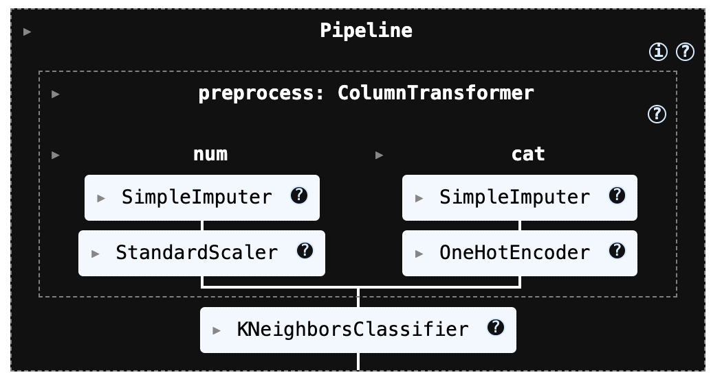
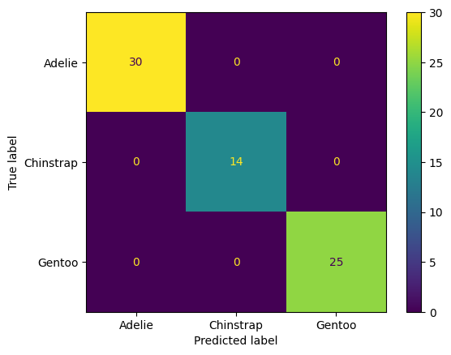
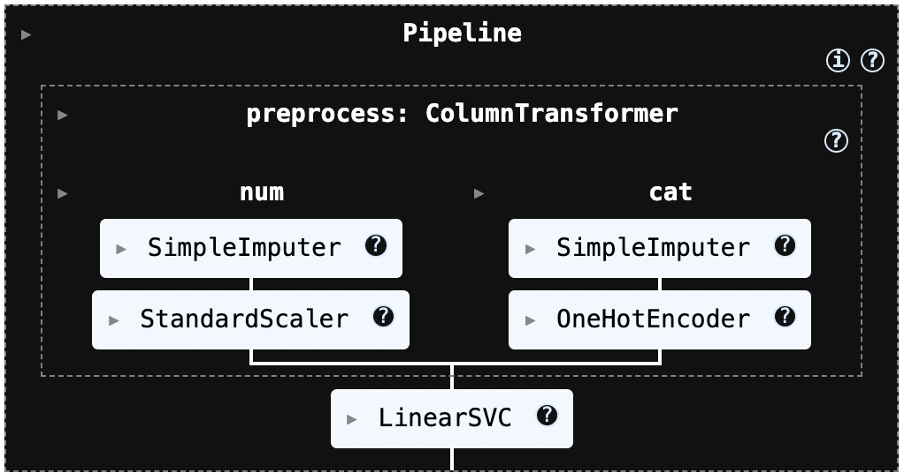
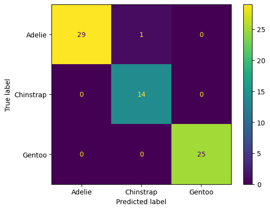
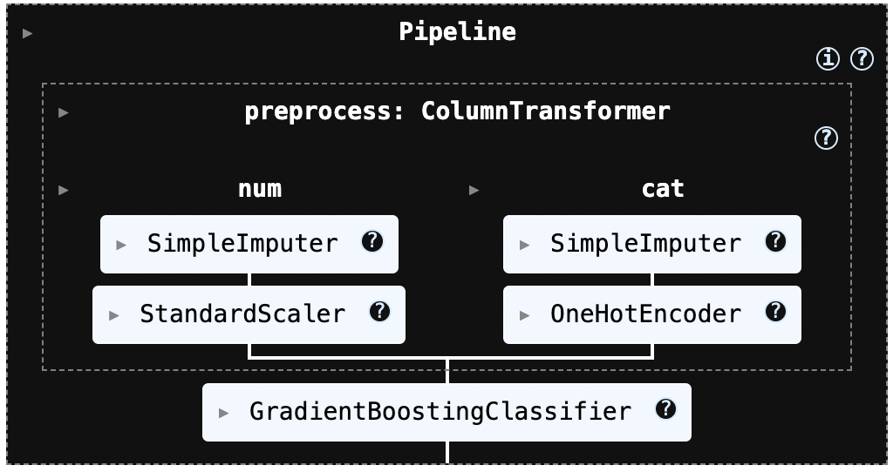
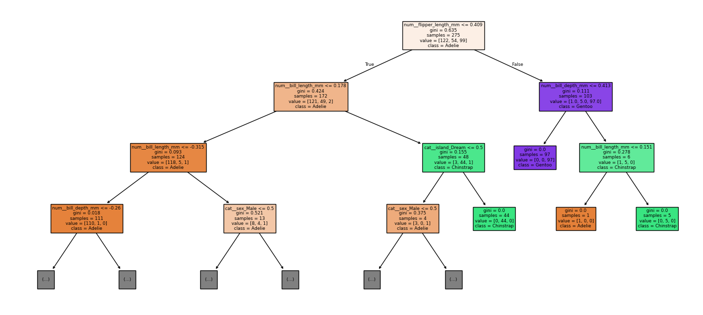
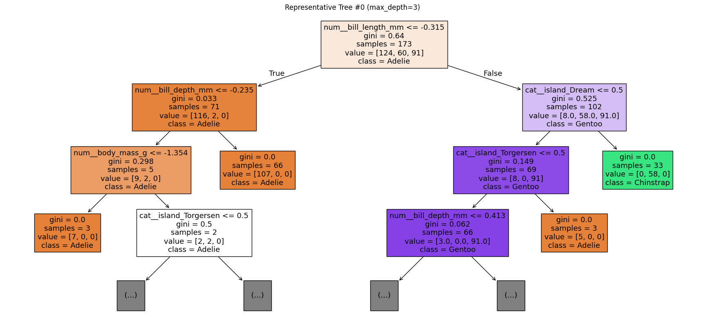

## 머신러닝 분류 (k-NN \| SVM) 3개 이상 범주형 분류 사례분석

### 데이터

::: {.callout-note}
## Penguins 데이터셋 개요

| 항목 | 내용 |
|------|------|
| **목적** | 펭귄 종(species) 다중분류 (3개 클래스) |
| **표본 수** | 344개 행 × 7개 열 |
| **타깃(y)** | species: Adelie / Chinstrap / Gentoo |
| **수치형 변수** | bill_length_mm, bill_depth_mm, flipper_length_mm, body_mass_g (4개) |
| **범주형 변수** | island, sex (2개) |
| **결측치** | 수치형 각 2개, sex 11개 |

혼합형 데이터(수치형 + 범주형) + 결측치 존재 → **Pipeline 기반 전처리 필수**
:::

seaborn의 `penguins` 데이터셋을 불러온 결과, 전체 데이터는 344개 행과 7개 열로 구성되어 있으며, 이 중 타깃(y)은 species 1개 열, 설명변수(X)는 species를 제외한 6개 열로 분리된다. 종(species)은 Adelie, Chinstrap, Gentoo의 3개 범주로 이루어진 다중분류 문제에 해당한다.

데이터의 변수 구성은 종(species)과 섬(island), 그리고 부리 길이/깊이(bill_length_mm, bill_depth_mm), 날개 길이(flipper_length_mm), 체중(body_mass_g) 같은 연속형 수치 변수와 성별(sex) 같은 범주형 변수로 되어 있다. 자료형을 보면 수치형(float64) 변수가 4개, 문자열(object) 변수가 3개로 혼합되어 있다.

결측치도 일부 존재한다. 부리 길이, 부리 깊이, 날개 길이, 체중은 각각 342개만 관측되어 있어 각 변수마다 2개씩 결측치가 있고, 성별(sex)은 333개만 관측되어 11개의 결측치가 확인된다. 반면 종(species)과 섬(island)은 모든 344개가 결측 없이 채워져 있다. 따라서 이후 모델링을 위해서는 결측치 처리(대치)와 범주형 변수 인코딩(예: 원-핫 인코딩), 그리고 k-NN/SVM처럼 스케일에 민감한 모델을 위한 표준화가 필요하다.

### 전처리

::: {.callout-tip}
## 혼합형 데이터 전처리 파이프라인 구성

| 변수 유형 | 처리 방법 |
|---------|---------|
| **수치형** | 중앙값 결측 대치(median impute) → StandardScaler |
| **범주형** | 최빈값 결측 대치(most_frequent) → OneHotEncoder |

**핵심 원칙**: Pipeline 내에서 `fit`은 train에만, `transform`은 test에도 적용 (데이터 누수 방지) + `stratify=y`로 클래스 비율 유지
:::

해당 전처리 과정은 k-NN과 SVM 모델에서 성능에 큰 영향을 주는 스케일링(표준화)을 파이프라인 안에 자동으로 포함하도록 구성되어 있다. 또한 데이터에 결측치가 존재하더라도 수치형 변수는 적절한 방식으로 대치한 뒤 표준화를 수행하고, 범주형 변수는 원-핫 인코딩으로 변환해 모델이 바로 학습할 수 있는 형태로 처리한다. 

즉, 데이터의 누락값과 범주형 변수를 별도로 수작업 처리하지 않아도 일관된 방식으로 전처리가 진행되며, k-NN/SVM에 필요한 입력 형태를 안정적으로 보장한다.

이 코드는 전체 데이터에서 입력 변수(X)와 정답 라벨(y)를 학습용과 테스트용으로 나누기 위해 `train_test_split()`을 사용한 것입니다. 여기서 `test_size=0.2`는 전체 데이터의 20%를 테스트 세트로 떼어 내고, 나머지 80%를 학습 세트로 쓰겠다는 의미입니다. 이렇게 분리하면 모델을 학습할 때는 `X_train, y_train`만 사용하고, 학습에 쓰지 않은 데이터인 `X_test, y_test`로 성능을 평가할 수 있어 “새 데이터에서도 잘 맞히는지(일반화 성능)”를 확인할 수 있습니다.

특히 `stratify=y`는 분류 문제에서 매우 중요한 옵션인데, 학습/테스트로 나눌 때 각 클래스의 비율이 원본 데이터와 최대한 비슷하게 유지되도록(층화 추출) 해줍니다. 예를 들어 데이터가 불균형(한 클래스가 훨씬 많음)한 경우, 층화 없이 무작정 나누면 테스트 세트에 특정 클래스가 거의 없거나 아예 빠지는 일이 생길 수 있고, 그러면 평가 결과가 왜곡되거나 ROC/PR 같은 지표 계산 자체가 어려워질 수도 있습니다. `stratify=y`를 주면 이런 위험을 크게 줄일 수 있습니다.

```python
import numpy as np
import pandas as pd

from sklearn.model_selection import train_test_split
from sklearn.compose import ColumnTransformer
from sklearn.pipeline import Pipeline
from sklearn.preprocessing import StandardScaler, OneHotEncoder
from sklearn.impute import SimpleImputer

# -------------------------------------------------------
# (0) X, y 준비 (예: df에서 타깃 분리)
# -------------------------------------------------------
# y = df["Class"]  # 또는 df["species"] 등
# X = df.drop(columns=["Class"])

# -------------------------------------------------------
# (1) Train/Test split (분류면 stratify 권장)
# -------------------------------------------------------
X_train, X_test, y_train, y_test = train_test_split(
    X, y,
    test_size=0.2,
    stratify=y,          # 불균형/분류에서 매우 중요
    random_state=42
)

# -------------------------------------------------------
# (2) 컬럼 타입 분리
# -------------------------------------------------------
num_cols = X_train.select_dtypes(include=["number"]).columns.tolist()
cat_cols = X_train.select_dtypes(exclude=["number"]).columns.tolist()

# -------------------------------------------------------
# (3) 전처리 파이프라인
#   - 수치형: 결측치 중앙값 대치 + 표준화
#   - 범주형: 최빈값 대치 + 원핫인코딩
# -------------------------------------------------------
numeric_pipe = Pipeline([
    ("imputer", SimpleImputer(strategy="median")),
    ("scaler", StandardScaler())
])

# sklearn 버전에 따라 sparse 옵션명이 다를 수 있어 try 처리
try:
    ohe = OneHotEncoder(handle_unknown="ignore", sparse_output=False)
except TypeError:
    ohe = OneHotEncoder(handle_unknown="ignore", sparse=False)

categorical_pipe = Pipeline([
    ("imputer", SimpleImputer(strategy="most_frequent")),
    ("onehot", ohe)
])

preprocess = ColumnTransformer(
    transformers=[
        ("num", numeric_pipe, num_cols),
        ("cat", categorical_pipe, cat_cols),
    ],
    remainder="drop"   # 안 쓰는 컬럼 버릴지/살릴지 선택
)
```

### 머신러닝 분류

::: {.callout-note}
## kNN vs SVM: 다중분류 특성 비교

| 항목 | k-NN | SVM |
|------|------|-----|
| **원리** | 거리 기반 이웃 다수결 | 결정경계 마진 최대화 |
| **다중분류** | 자연스럽게 확장 | OvR 또는 OvO 전략 사용 |
| **스케일 민감** | ✅ 매우 민감 | ✅ 매우 민감 |
| **확률 출력** | predict_proba 지원 | `probability=True` 필요 (느림) |
| **튜닝 파라미터** | k, weights, metric | C, kernel, gamma |
| **대규모 데이터** | ⚠️ 느림 (매 예측시 전 학습셋 탐색) | ⚠️ 느림 (RBF) / 빠름 (Linear) |
:::

#### kNN

**실행코드**

```python
from sklearn.neighbors import KNeighborsClassifier

knn_model = Pipeline([
    ("preprocess", preprocess),
    ("knn", KNeighborsClassifier(
        n_neighbors=15,
        weights="distance",
        p=2
    ))
])

knn_model.fit(X_train, y_train)         # (전체학습 시)
```

{fig-align="center" width="40%"}

confusion matrix

```python
from sklearn.metrics import confusion_matrix, ConfusionMatrixDisplay, classification_report
import matplotlib.pyplot as plt
import numpy as np

# 예측
y_pred = knn_model.predict(X_test)

# (멀티클래스/문자열 라벨 포함) 라벨 순서 고정
labels = knn_model.named_steps["knn"].classes_  # Pipeline이면 마지막 모델의 classes_

# confusion matrix
cm = confusion_matrix(y_test, y_pred, labels=labels)
print("Confusion matrix:\n", cm)

# (선택) classification report
print("\nClassification report:\n",
      classification_report(y_test, y_pred, labels=labels, target_names=labels.tolist()))

# (선택) 시각화
disp = ConfusionMatrixDisplay(confusion_matrix=cm, display_labels=labels)
disp.plot(values_format="d")
plt.show()
```
```text
Confusion matrix:
 [[30  0  0]
 [ 0 14  0]
 [ 0  0 25]]

Classification report:
               precision    recall  f1-score   support

      Adelie       1.00      1.00      1.00        30
   Chinstrap       1.00      1.00      1.00        14
      Gentoo       1.00      1.00      1.00        25

    accuracy                           1.00        69
   macro avg       1.00      1.00      1.00        69
weighted avg       1.00      1.00      1.00        69
```

{fig-align="center" width="40%"}

**사후확률 출력**

```python
#사후 확률 계산
# (n_samples, n_classes)
proba_knn = knn_model.predict_proba(X_test)

# Pipeline이면 classes_는 마지막 모델에서 가져오기
classes_knn = knn_model.named_steps["knn"].classes_

proba_knn_df = pd.DataFrame(proba_knn, columns=classes_knn)
display(proba_knn_df.head())
```
```text
Adelie	Chinstrap	Gentoo
0	1.000000	0.000000	0.0
1	1.000000	0.000000	0.0
2	0.000000	0.000000	1.0
3	0.000000	0.000000	1.0
4	0.053935	0.946065	0.0
```

**분류 영향변인 출력**

다음 코드는 테스트 데이터에서 특정 1개 샘플을 골라, 그 샘플이 preprocess(전처리기: 결측치 처리/스케일링/원핫인코딩 등)를 거친 뒤 어떤 “전처리된 피처들”로 변환되는지를 확인해서, 그중 영향(값의 절댓값)이 큰 피처 Top-k만 보기 좋게 출력하는 코드이다.

```python
# 특정 샘플이 전처리 후 어떤 피처로 바뀌는지 출력
import pandas as pd
import numpy as np

def show_transformed_features(preprocess, X_row, topk=20):
    Xt = preprocess.transform(X_row)
    feat = preprocess.get_feature_names_out()
    s = pd.Series(Xt.ravel(), index=feat)
    # 값이 큰 순으로(원핫은 0/1이라 topk로 보면 편함)
    return s.reindex(s.abs().sort_values(ascending=False).head(topk).index)

i = 0
x0 = X_test.iloc[[i]]
display(show_transformed_features(preprocess, x0, topk=30))
```

출력은 전처리(preprocess)를 거친 뒤, 테스트 데이터 0번 샘플이 “모델 입력 피처 벡터”로 바뀐 값을 보여준다. (코드에서 get_feature_names_out() + preprocess.transform() 결과를 Series로 만든 것)

cat__... (범주형 원-핫 인코딩) 해석

원-핫 인코딩은 해당 범주면 1, 아니면 0입니다.

cat__sex_Male = 1.0 → 이 샘플의 성별은 Male
<br>
cat__sex_Female = 0.0 → Female이 아님
<br>
cat__island_Dream = 1.0 → 섬은 Dream
<br>
cat__island_Biscoe = 0.0, cat__island_Torgersen = 0.0 → 다른 섬이 아님
<br>
즉, “Dream 섬의 수컷”이라는 뜻이다.

num__... (수치형 표준화 z-score) 해석

수치형은 StandardScaler()가 적용되어 (값 − 평균) / 표준편차 형태의 표준화 점수(z-score) 로 변환된다.
그래서 단위(mm, g)가 사라지고, “훈련 데이터 평균 대비 몇 표준편차 위/아래인가”로 해석된다.

num__bill_depth_mm = 0.663 → 부리 깊이가 평균보다 0.66 표준편차 정도 큼 (조금 큰 편)
<br>
num__bill_length_mm = -0.471 → 부리 길이가 평균보다 0.47 표준편차 정도 작음 (조금 작은 편)
<br>
num__body_mass_g = -0.262 → 몸무게가 평균보다 0.26 표준편차 정도 작음 (약간 가벼운 편)
<br>
num__flipper_length_mm = 0.013 → 지느러미 길이가 거의 평균 수준 (평균과 매우 비슷)

이 값들이 모델에서 의미하는 것

k-NN: 이 벡터들로 거리를 계산하니, 절댓값이 큰 항목(예: bill_depth 0.66, bill_length -0.47)이 거리/이웃 선택에 더 영향을 주기 쉬움

```text
cat__sex_Male	1.000000
cat__island_Dream	1.000000
num__bill_depth_mm	0.663008
num__bill_length_mm	-0.470502
num__body_mass_g	-0.262136
num__flipper_length_mm	0.013088
cat__island_Biscoe	0.000000
cat__island_Torgersen	0.000000
cat__sex_Female	0.000000
```
이웃 개체 거리 정보

다음 코드는 k-NN 모델이 특정 샘플 1개(`X_row`)를 어떤 근거로 분류했는지를 “이웃 기반”으로 설명하기 위한 함수이다. 입력으로는 전처리+모델이 묶인 `Pipeline`(`pipeline`), 학습 데이터 `X_train`, 학습 라벨 `y_train`, 설명 대상 1행 데이터프레임 `X_row`, 그리고 이웃 수 `k`를 받는다.

```python
#kNN 분류 과정 출력: “어떤 이웃들이 결정했는지”
import numpy as np
import pandas as pd

def explain_knn(pipeline, X_train, y_train, X_row, k=15):
    pre = pipeline.named_steps["preprocess"]
    knn = pipeline.named_steps["knn"]

    Xt_row = pre.transform(X_row)
    dist, ind = knn.kneighbors(Xt_row, n_neighbors=k, return_distance=True)
    dist, ind = dist[0], ind[0]

    neigh = X_train.iloc[ind].copy()
    neigh["y"] = y_train.iloc[ind].to_numpy()
    neigh["distance"] = dist

    # weights="distance"인 경우 가중치(거리의 역수)로 투표가 이루어짐
    if getattr(knn, "weights", None) == "distance":
        w = 1.0 / (dist + 1e-12)
    else:
        w = np.ones_like(dist)

    vote = pd.Series(w).groupby(neigh["y"]).sum().sort_values(ascending=False)
    pred = pipeline.predict(X_row)[0]
    proba = pipeline.predict_proba(X_row)[0]
    classes = knn.classes_

    print("pred =", pred)
    print("proba =", dict(zip(classes, proba)))
    print("\n[weighted vote by class]")
    display(vote)

    return neigh.sort_values("distance")

i = 0
x0 = X_test.iloc[[i]]
display(explain_knn(knn_model, X_train, y_train, x0, k=3))
```

출력은 “k-NN이 왜 Adelie라고 예측했는지”를 아주 직관적으로 보여준다.

pred = Adelie: k-NN의 최종 예측 클래스가 Adelie라는 뜻이다. k개의 이웃(예: k=15)이 어느 클래스에 더 “가깝게/많이” 몰려있느냐로 결정된다.

proba = {'Adelie': 1.0, 'Chinstrap': 0.0, 'Gentoo': 0.0}: predict_proba는 이웃들의 투표 결과를 확률처럼 정규화해서 보여준다.

지금은 Adelie가 1.0(=100%)인 걸 보면, (거의 확실하게) 선택된 k개 이웃이 전부 Adelie이거나 거리 가중치 합이 Adelie 쪽에만 몰려 있다는 뜻이다. 그래서 모델이 “이 샘플은 Adelie일 가능성이 매우 높다”고 판단한 겁니다.

[weighted vote by class]: weights="distance"를 쓰면, 각 이웃의 표(투표)가 가까울수록 더 크게 반영된다. 보통 가중치가 1 / distance 형태로 들어간다. 그래서 [weighted vote by class]는 클래스별로 가중치 합(=투표 점수 합) 을 보여준다. 지금 결과가 사실상 Adelie로만 찍힌 건 “가까운 이웃들이 Adelie로만 구성”되었음을 의미한다.

이 표는 가장 가까운 이웃들 일부를 보여준 거고, distance는 “전처리(표준화 + 원핫)” 이후 공간에서의 거리라서 원래 단위(mm, g) 그대로의 거리는 아니다. 가까운 이웃들이 전부 Adelie → 그래서 예측도 Adelie로 강하게 쏠림.

```python
pred = Adelie
proba = {'Adelie': np.float64(1.0), 'Chinstrap': np.float64(0.0), 'Gentoo': np.float64(0.0)}

island	bill_length_mm	bill_depth_mm	flipper_length_mm	body_mass_g	sex	y	distance
97	Dream	40.3	18.5	196.0	4350.0	Male	Adelie	0.606939
95	Dream	40.8	18.9	208.0	4300.0	Male	Adelie	0.671009
139	Dream	39.7	17.9	193.0	4250.0	Male	Adelie	0.791762
137	Dream	40.2	20.1	200.0	3975.0	Male	Adelie	0.836881
135	Dream	41.1	17.5	190.0	3900.0	Male	Adelie	0.947113
133	Dream	37.5	18.5	199.0	4475.0	Male	Adelie	0.952186
149	Dream	37.8	18.1	193.0	3750.0	Male	Adelie	0.962429
43	Dream	44.1	19.7	196.0	4400.0	Male	Adelie	0.981460
143	Dream	40.7	17.0	190.0	3725.0	Male	Adelie	1.151793
45	Dream	39.6	18.8	190.0	4600.0	Male	Adelie	1.153475
85	Dream	41.3	20.3	194.0	3550.0	Male	Adelie	1.173729
36	Dream	38.8	20.0	190.0	3950.0	Male	Adelie	1.197918
33	Dream	40.9	18.9	184.0	3900.0	Male	Adelie	1.250992
93	Dream	39.6	18.1	186.0	4450.0	Male	Adelie	1.281267
145	Dream	39.0	18.7	185.0	3650.0	Male	Adelie	1.317596
```

#### SVM

**실행 코드**

```python
from sklearn.neighbors import KNeighborsClassifier

knn_model = Pipeline([
    ("preprocess", preprocess),
    ("knn", KNeighborsClassifier(
        n_neighbors=15,
        weights="distance",
        p=2
    ))
])

knn_model.fit(X_train, y_train)         # (전체학습 시)
```

{fig-align="center" width="40%"}

```python
from sklearn.metrics import accuracy_score, confusion_matrix, classification_report, ConfusionMatrixDisplay
import matplotlib.pyplot as plt

# 예측
y_pred_svm = svm_model.predict(X_test)

# ✅ 라벨(클래스 이름) 가져오기: data.target_names 대신 사용
labels = svm_model.named_steps["svm"].classes_   # 예: ['Adelie','Chinstrap','Gentoo']

# 평가
print("[k-NN] Accuracy:", accuracy_score(y_test, y_pred_svm))

cm = confusion_matrix(y_test, y_pred_svm, labels=labels)
print("[k-NN] Confusion matrix:\n", cm)

print("[k-NN] Classification report:\n",
      classification_report(y_test, y_pred_svm,
                            labels=labels,
                            target_names=labels.tolist()))

# (선택) 보기 좋게 그림으로 출력
disp = ConfusionMatrixDisplay(confusion_matrix=cm, display_labels=labels)
disp.plot(values_format="d")
plt.show()
```
```text
[k-NN] Accuracy: 0.9855072463768116
[k-NN] Confusion matrix:
 [[29  1  0]
 [ 0 14  0]
 [ 0  0 25]]
[k-NN] Classification report:
               precision    recall  f1-score   support

      Adelie       1.00      0.97      0.98        30
   Chinstrap       0.93      1.00      0.97        14
      Gentoo       1.00      1.00      1.00        25

    accuracy                           0.99        69
   macro avg       0.98      0.99      0.98        69
weighted avg       0.99      0.99      0.99        69
```

{fig-align="center" width="40%"}

**사후확률 출력**

```python
#사후확률 
from sklearn.calibration import CalibratedClassifierCV

# svm_model 자체가 Pipeline이어도 그대로 감쌀 수 있습니다.
svm_cal = CalibratedClassifierCV(svm_model, method="sigmoid", cv=5)
svm_cal.fit(X_train, y_train)

proba_svm = svm_cal.predict_proba(X_test)
classes_svm = svm_cal.classes_

proba_svm_df = pd.DataFrame(proba_svm, columns=classes_svm)
display(proba_svm_df.head())
```
```text

Adelie	Chinstrap	Gentoo
0	0.895637	0.077118	0.027245
1	0.944391	0.029562	0.026046
2	0.017208	0.026771	0.956021
3	0.036579	0.002759	0.960662
4	0.122979	0.866984	0.010037
```
**임계값 출력**

POS_LABEL = "Gentoo": 양성, 다른 두 종은 "Adelie" / "Chinstrap" 음성으로 분류하는 ROC/PR(AUC/AP) 계산, 임계값 3종(Youden / FPR 제약 / 비용기반) 선택, 모델별 비교표(DataFrame) 생성한다.

```python
import numpy as np
import pandas as pd
from sklearn.metrics import roc_curve, auc, average_precision_score, confusion_matrix

# ✅ 멀티클래스에서 "양성 클래스" 하나를 지정 (원하는 걸로 바꾸세요)
POS_LABEL = "Gentoo"   # "Adelie" / "Chinstrap" 도 가능

def _get_classes(model):
    # Pipeline이면 마지막 estimator의 classes_를 가져오도록 보강
    classes = getattr(model, "classes_", None)
    if classes is None and hasattr(model, "named_steps"):
        last = list(model.named_steps.values())[-1]
        classes = getattr(last, "classes_", None)
    return None if classes is None else np.array(classes)

def get_pos_score(model, X, pos_label):
    classes = _get_classes(model)

    # 1) predict_proba 우선
    if hasattr(model, "predict_proba"):
        proba = model.predict_proba(X)
        proba = np.asarray(proba)
        if proba.ndim == 1:
            return proba
        if classes is None:
            raise ValueError("classes_를 찾지 못했습니다. (Pipeline/Estimator 확인 필요)")
        idx = np.where(classes == pos_label)[0]
        if len(idx) == 0:
            raise ValueError(f"pos_label={pos_label} 가 classes_에 없습니다: {classes}")
        return proba[:, idx[0]]

    # 2) 없으면 decision_function 사용 (LinearSVC는 여기로 옴)
    if hasattr(model, "decision_function"):
        s = np.asarray(model.decision_function(X))
        if s.ndim == 1:
            return s
        if s.ndim == 2:
            if classes is None:
                raise ValueError("decision_function이 2D인데 classes_를 찾지 못했습니다.")
            idx = np.where(classes == pos_label)[0]
            if len(idx) == 0:
                raise ValueError(f"pos_label={pos_label} 가 classes_에 없습니다: {classes}")
            return s[:, idx[0]]

    raise ValueError(f"{type(model)}: predict_proba/decision_function 둘 다 없습니다.")

def metrics_at_threshold(y_true01, score, t):
    y_hat = (score >= t).astype(int)
    cm = confusion_matrix(y_true01, y_hat, labels=[0, 1])
    tn, fp, fn, tp = cm.ravel()

    tpr = tp / (tp + fn) if (tp + fn) else 0.0
    fpr = fp / (fp + tn) if (fp + tn) else 0.0
    prec = tp / (tp + fp) if (tp + fp) else 0.0
    acc = (tp + tn) / (tp + tn + fp + fn) if (tp + tn + fp + fn) else 0.0

    return {
        "t": float(t),
        "tn": int(tn), "fp": int(fp), "fn": int(fn), "tp": int(tp),
        "recall(tpr)": float(tpr),
        "fpr": float(fpr),
        "precision": float(prec),
        "accuracy": float(acc),
    }

def best_thresholds(y_true01, score, alpha=0.001, c_fn=100.0, c_fp=1.0):
    fpr, tpr, thr = roc_curve(y_true01, score)  # y_true01은 0/1이어야 함
    roc_auc = auc(fpr, tpr)
    ap = average_precision_score(y_true01, score)

    finite = np.isfinite(thr)
    thr_fin, fpr_fin, tpr_fin = thr[finite], fpr[finite], tpr[finite]

    # (A) Youden
    J = tpr_fin - fpr_fin
    t_y = float(thr_fin[np.argmax(J)])

    # (B) FPR<=alpha 중 TPR 최대
    cand = np.where((fpr_fin <= alpha) & (tpr_fin > 0))[0]
    t_f = float(thr_fin[cand[np.argmax(tpr_fin[cand])]]) if len(cand) > 0 else None

    # (C) 비용 기반
    cand_thr = np.r_[-np.inf, thr_fin, np.inf]
    best_t, best_cost = None, np.inf
    for t in cand_thr:
        m = metrics_at_threshold(y_true01, score, t)
        cost = c_fn * m["fn"] + c_fp * m["fp"]
        if cost < best_cost:
            best_cost, best_t = cost, float(t)

    return {"roc_auc": float(roc_auc), "ap": float(ap),
            "t_youden": t_y, "t_fpr": t_f,
            "t_cost": best_t, "best_cost": float(best_cost)}

def summarize_model(model_name, y_true01, score, alpha=0.001, c_fn=100.0, c_fp=1.0):
    info = best_thresholds(y_true01, score, alpha=alpha, c_fn=c_fn, c_fp=c_fp)
    rows = []

    # Youden
    m = metrics_at_threshold(y_true01, score, info["t_youden"])
    m.update({"model": model_name, "rule": "Youden (TPR-FPR)",
              "roc_auc": info["roc_auc"], "ap": info["ap"],
              "cost": c_fn*m["fn"] + c_fp*m["fp"]})
    rows.append(m)

    # FPR constraint
    if info["t_fpr"] is not None:
        m = metrics_at_threshold(y_true01, score, info["t_fpr"])
        m.update({"model": model_name, "rule": f"FPR <= {alpha}",
                  "roc_auc": info["roc_auc"], "ap": info["ap"],
                  "cost": c_fn*m["fn"] + c_fp*m["fp"]})
        rows.append(m)
    else:
        rows.append({"model": model_name, "rule": f"FPR <= {alpha}", "t": None,
                     "tn": None, "fp": None, "fn": None, "tp": None,
                     "recall(tpr)": None, "fpr": None, "precision": None, "accuracy": None,
                     "roc_auc": info["roc_auc"], "ap": info["ap"], "cost": None})

    # Cost-based
    m = metrics_at_threshold(y_true01, score, info["t_cost"])
    m.update({"model": model_name, "rule": f"Cost (c_fn={c_fn}, c_fp={c_fp})",
              "roc_auc": info["roc_auc"], "ap": info["ap"],
              "cost": info["best_cost"]})
    rows.append(m)

    return rows

# -----------------------------
# ✅ 실행부 (멀티클래스 → one-vs-rest로 0/1 만들기)
# -----------------------------
y_test_arr = np.asarray(y_test)
y_pos = (y_test_arr == POS_LABEL).astype(int)

# 양성/음성이 둘 다 있어야 ROC 계산 가능
if y_pos.sum() == 0 or y_pos.sum() == len(y_pos):
    raise ValueError(f"y_test에 '{POS_LABEL}' 양성/음성이 한쪽만 있습니다. POS_LABEL이나 split을 확인하세요.")

models = {
    "k-NN": knn_model,
    "SVM(LinearSVC)": svm_model,
}

alpha = 0.001
c_fn, c_fp = 100.0, 1.0

rows = []
for name, model in models.items():
    score = get_pos_score(model, X_test, pos_label=POS_LABEL)  # ✅ POS_LABEL 컬럼 점수
    rows += summarize_model(name, y_pos, score, alpha=alpha, c_fn=c_fn, c_fp=c_fp)

df_cmp = pd.DataFrame(rows)[
    ["model","rule","t","tn","fp","fn","tp","recall(tpr)","fpr","precision","accuracy","roc_auc","ap","cost"]
].sort_values(["rule","model"]).reset_index(drop=True)

display(df_cmp)
```
**왜 k-NN 점수가 1.0이 자주 나오나?**

결과를 보면 ( tn=44, tp=25, fp=0, fn=0 )를 보면, k-NN의 POS_LABEL(Gentoo) 점수가 “1.0인 샘플 = 전부 Gentoo”, “1.0 미만 = 전부 비-Gentoo”로 완벽 분리가 된 상태이다. 그래서 Youden / FPR≤0.001 / Cost 같은 임계값 선택 규칙이 전부 “가장 높은 임계값” 쪽(=1.0)을 골라도 성능이 안 떨어져서 t가 항상 1.0으로 고정됩니다.

k-NN의 predict_proba는 이웃들의 “투표 비율”이라서 이론적으로 0~1 사이의 이산값만 나온다. 특히 weights="distance"일 때는 아래 상황에서 확률이 정확히 1.0이 쉽게 나온다. 거리 0인 이웃(완전히 동일한 전처리 결과) 이 존재
→ scikit-learn은 거리 0이면 그 이웃(들)에게 사실상 모든 가중치가 몰려서 한 클래스 확률이 1.0이 될 수 있다.

또는 k개 이웃이 전부 같은 클래스 → 그 클래스 확률이 1.0. 펭귄 데이터처럼 클래스가 잘 분리되거나, 결측치 대치/원핫/스케일링 후에 동일한 패턴이 생기면 이런 일이 더 잘 생깁니다.

```text
	model	rule	t	tn	fp	fn	tp	recall(tpr)	fpr	precision	accuracy	roc_auc	ap	cost
0	SVM(LinearSVC)	Cost (c_fn=100.0, c_fp=1.0)	0.656852	44	0	0	25	1.0	0.0	1.0	1.0	1.0	1.0	0.0
1	k-NN	Cost (c_fn=100.0, c_fp=1.0)	1.000000	44	0	0	25	1.0	0.0	1.0	1.0	1.0	1.0	0.0
2	SVM(LinearSVC)	FPR <= 0.001	0.656852	44	0	0	25	1.0	0.0	1.0	1.0	1.0	1.0	0.0
3	k-NN	FPR <= 0.001	1.000000	44	0	0	25	1.0	0.0	1.0	1.0	1.0	1.0	0.0
4	SVM(LinearSVC)	Youden (TPR-FPR)	0.656852	44	0	0	25	1.0	0.0	1.0	1.0	1.0	1.0	0.0
5	k-NN	Youden (TPR-FPR)	1.000000	44	0	0	25	1.0	0.0	1.0	1.0	1.0	1.0	0.0
```

```python
score_knn = get_pos_score(knn_model, X_test, pos_label=POS_LABEL)
y_pos = (np.asarray(y_test) == POS_LABEL).astype(int)

pos_scores = score_knn[y_pos == 1]
neg_scores = score_knn[y_pos == 0]

print("unique scores (top 20):", np.unique(score_knn)[:20])
print("count(score==1):", np.sum(score_knn == 1.0))
print("pos min:", pos_scores.min(), "neg max:", neg_scores.max())
```
지금 출력은 k-NN이 Gentoo(POS_LABEL)를 거의 완벽하게 분리하고 있다는 신호예요.

이 결과가 의미하는 것

unique scores = [0, 0.03668, 0.05069, 1]
→ Gentoo 확률(p(Gentoo))이 딱 4가지 값만 나옵니다.

count(score==1): 25
→ 테스트에서 p(Gentoo)=1인 샘플이 25개.

pos min: 1.0
→ 실제 Gentoo인 샘플은 전부 p(Gentoo)=1 (최소가 1이니까 전부 1).

neg max: 0.050686...
→ Gentoo가 아닌 샘플 중 가장 큰 p(Gentoo)도 0.05 정도.

즉, 테스트셋에서

양성(Gentoo): 점수 = 전부 1

음성(비 Gentoo): 점수 = 최대 0.0507

이라서 **0.0507과 1 사이에 큰 “간격(gap)”**이 생깁니다.
그래서 임계값을 t로 잡을 때 0.0507 < t ≤ 1 아무거나 선택해도 TPR=1, FPR=0 (완벽 분류)가 됩니다.
이런 경우 ROC/AUC, 임계값 탐색이 “이상하게 쉬워 보이거나” 값이 뭉쳐 보이는 게 정상이에요.

왜 점수가 이렇게 “이산적(몇 개 값만)”일까?

k-NN의 확률은 본질적으로 **이웃들의 투표(가중치 합 / 전체 가중치 합)**라서,

데이터가 잘 분리되어 있으면 많은 점들이 이웃이 전부 Gentoo → 확률 1,

혹은 Gentoo 이웃이 아예 없음 → 확률 0,

경계 근처 일부만 “조금 섞여”서 0.03~0.05 같은 값이 나옵니다.

(특히 펭귄 데이터는 Gentoo가 몇 개 수치 특성에서 꽤 깔끔하게 구분되는 편이라 이런 패턴이 자주 나옵니다.)

```text
unique scores (top 20): [0.         0.03668167 0.05068641 1.        ]
count(score==1): 25
pos min: 1.0 neg max: 0.0506864093164956
```

### 트리기반 분류

::: {.callout-important}
## 6개 모델 Gentoo 분류 성능 비교 (OvR 기준)

| 모델 | ROC-AUC | AP | 특이점 |
|------|---------|-----|--------|
| **GradientBoosting** | 1.0 | 1.0 | 완벽 분리 |
| **RandomForest** | 1.0 | 1.0 | 완벽 분리 |
| **Logit** | 1.0 | 1.0 | 완벽 분리 |
| **Tree** | 1.0 | 1.0 | 완벽 분리 |
| **SVM(Linear+Calib)** | 1.0 | 1.0 | 완벽 분리 |
| **k-NN** | 1.0 | 1.0 | 완벽 분리 |

**해석**: Penguins 데이터에서 Gentoo는 수치 특성으로 매우 깔끔하게 분리됨 → 모든 모델 완벽 성능. 모델 비교의 실질적 차이는 **Chinstrap 분류**(Adelie와 유사)에서 드러난다.
:::

#### logit/tree/rf/gb 모델 학습

```python
from sklearn.linear_model import LogisticRegression
from sklearn.tree import DecisionTreeClassifier
from sklearn.ensemble import RandomForestClassifier, GradientBoostingClassifier

# Logit
logit_model = Pipeline([
    ("preprocess", preprocess),
    ("logit", LogisticRegression(max_iter=2000))
])
logit_model.fit(X_train, y_train)

# Tree
tree_model = Pipeline([
    ("preprocess", preprocess),
    ("tree", DecisionTreeClassifier(random_state=42))
])
tree_model.fit(X_train, y_train)

# RandomForest
rf_model = Pipeline([
    ("preprocess", preprocess),
    ("rf", RandomForestClassifier(
        n_estimators=300, random_state=42
    ))
])
rf_model.fit(X_train, y_train)

# GradientBoosting
gb_model = Pipeline([
    ("preprocess", preprocess),
    ("gb", GradientBoostingClassifier(random_state=42))
])
gb_model.fit(X_train, y_train)
```

{fig-align="center" width="40%"}

**모델평가 및 임계값 t 결정**

```python
import numpy as np
import pandas as pd
from sklearn.metrics import roc_curve, auc, average_precision_score, confusion_matrix

def _get_classes(model):
    # 1) 일반 estimator
    if hasattr(model, "classes_"):
        return np.array(model.classes_)
    # 2) Pipeline이면 마지막 step에서 classes_
    if hasattr(model, "named_steps"):
        last = list(model.named_steps.values())[-1]
        if hasattr(last, "classes_"):
            return np.array(last.classes_)
    return None

def get_pos_score(model, X, pos_label=1):
    # 1) predict_proba 우선
    if hasattr(model, "predict_proba"):
        proba = np.asarray(model.predict_proba(X))
        if proba.ndim == 1:
            return proba
        classes = _get_classes(model)
        if classes is None:
            raise ValueError("classes_를 찾지 못했습니다. (Pipeline/Estimator 확인 필요)")
        idx = np.where(classes == pos_label)[0]
        if len(idx) == 0:
            raise ValueError(f"pos_label={pos_label} 가 classes_에 없습니다: {classes}")
        return proba[:, idx[0]]

    # 2) 없으면 decision_function (LinearSVC 등)
    if hasattr(model, "decision_function"):
        s = np.asarray(model.decision_function(X))
        if s.ndim == 1:
            return s.ravel()
        classes = _get_classes(model)
        if classes is None:
            raise ValueError("decision_function이 2D인데 classes_를 찾지 못했습니다.")
        idx = np.where(classes == pos_label)[0]
        if len(idx) == 0:
            raise ValueError(f"pos_label={pos_label} 가 classes_에 없습니다: {classes}")
        return s[:, idx[0]]

    raise ValueError(f"{type(model)}: predict_proba/decision_function 둘 다 없음")

def metrics_at_threshold(y_true01, score, t):
    y_hat = (score >= t).astype(int)
    cm = confusion_matrix(y_true01, y_hat, labels=[0, 1])  # ✅ 항상 2x2 보장
    tn, fp, fn, tp = cm.ravel()

    tpr = tp / (tp + fn) if (tp + fn) else 0.0
    fpr = fp / (fp + tn) if (fp + tn) else 0.0
    prec = tp / (tp + fp) if (tp + fp) else 0.0
    acc = (tp + tn) / (tp + tn + fp + fn) if (tp + tn + fp + fn) else 0.0
    return {"t": float(t), "tn": int(tn), "fp": int(fp), "fn": int(fn), "tp": int(tp),
            "recall(tpr)": float(tpr), "fpr": float(fpr), "precision": float(prec), "accuracy": float(acc)}

def best_thresholds(y_true01, score, alpha=0.001, c_fn=100.0, c_fp=1.0):
    # ✅ ROC 계산 가능 여부 체크 (한 클래스만 있으면 roc_curve가 에러)
    y_true01 = np.asarray(y_true01).astype(int)
    if y_true01.sum() == 0 or y_true01.sum() == len(y_true01):
        raise ValueError("y_true01에 0/1이 둘 다 있어야 ROC 계산이 가능합니다. split/데이터 확인!")

    fpr, tpr, thr = roc_curve(y_true01, score)
    roc_auc = auc(fpr, tpr)
    ap = average_precision_score(y_true01, score)

    finite = np.isfinite(thr)
    thr_fin, fpr_fin, tpr_fin = thr[finite], fpr[finite], tpr[finite]

    # (A) Youden
    J = tpr_fin - fpr_fin
    t_y = float(thr_fin[np.argmax(J)])

    # (B) FPR<=alpha 중 TPR 최대
    cand = np.where((fpr_fin <= alpha) & (tpr_fin > 0))[0]
    t_f = float(thr_fin[cand[np.argmax(tpr_fin[cand])]]) if len(cand) > 0 else None

    # (C) 비용 기반
    cand_thr = np.r_[-np.inf, thr_fin, np.inf]
    best_t, best_cost = None, np.inf
    for t in cand_thr:
        m = metrics_at_threshold(y_true01, score, t)
        cost = c_fn * m["fn"] + c_fp * m["fp"]
        if cost < best_cost:
            best_cost, best_t = cost, float(t)

    return {"roc_auc": float(roc_auc), "ap": float(ap),
            "t_youden": t_y, "t_fpr": t_f, "t_cost": best_t,
            "best_cost": float(best_cost)}

def summarize_model(model_name, y_true01, score, alpha=0.001, c_fn=100.0, c_fp=1.0):
    info = best_thresholds(y_true01, score, alpha=alpha, c_fn=c_fn, c_fp=c_fp)
    rows = []

    m = metrics_at_threshold(y_true01, score, info["t_youden"])
    m.update({"model": model_name, "rule": "Youden (TPR-FPR)",
              "roc_auc": info["roc_auc"], "ap": info["ap"],
              "cost": c_fn*m["fn"] + c_fp*m["fp"]})
    rows.append(m)

    if info["t_fpr"] is not None:
        m = metrics_at_threshold(y_true01, score, info["t_fpr"])
        m.update({"model": model_name, "rule": f"FPR <= {alpha}",
                  "roc_auc": info["roc_auc"], "ap": info["ap"],
                  "cost": c_fn*m["fn"] + c_fp*m["fp"]})
        rows.append(m)
    else:
        rows.append({"model": model_name, "rule": f"FPR <= {alpha}", "t": None,
                     "tn": None, "fp": None, "fn": None, "tp": None,
                     "recall(tpr)": None, "fpr": None, "precision": None, "accuracy": None,
                     "roc_auc": info["roc_auc"], "ap": info["ap"], "cost": None})

    m = metrics_at_threshold(y_true01, score, info["t_cost"])
    m.update({"model": model_name, "rule": f"Cost (c_fn={c_fn}, c_fp={c_fp})",
              "roc_auc": info["roc_auc"], "ap": info["ap"], "cost": info["best_cost"]})
    rows.append(m)

    return rows
```

```python
# ✅ 양성으로 볼 클래스 지정 (원하는 걸로 바꾸세요)
POS_LABEL = "Gentoo"   # "Adelie" / "Chinstrap" 도 가능

# ✅ y_test(문자열) -> 0/1로 변환
y_pos = (np.asarray(y_test) == POS_LABEL).astype(int)

models = {
    "k-NN": knn_model,
    "SVM(Linear+Calib)": svm_cal,   # 확률 쓰려면 calibration 버전
    "Logit": logit_model,
    "Tree": tree_model,
    "RandomForest": rf_model,
    "GradientBoosting": gb_model
}

alpha = 0.001
c_fn, c_fp = 100.0, 1.0

rows = []
for name, model in models.items():
    # ✅ pos_label을 1이 아니라 POS_LABEL(문자열)로!
    score = get_pos_score(model, X_test, pos_label=POS_LABEL)
    rows += summarize_model(name, y_pos, score, alpha=alpha, c_fn=c_fn, c_fp=c_fp)

df_cmp = pd.DataFrame(rows)[
    ["model","rule","t","tn","fp","fn","tp","recall(tpr)","fpr","precision","accuracy","roc_auc","ap","cost"]
].sort_values(["rule","model"]).reset_index(drop=True)

display(df_cmp)

df_t = df_cmp.pivot(index="model", columns="rule", values="t")
```
```text

model	rule	t	tn	fp	fn	tp	recall(tpr)	fpr	precision	accuracy	roc_auc	ap	cost
0	GradientBoosting	Cost (c_fn=100.0, c_fp=1.0)	0.999803	44	0	0	25	1.0	0.0	1.0	1.0	1.0	1.0	0.0
1	Logit	Cost (c_fn=100.0, c_fp=1.0)	0.930046	44	0	0	25	1.0	0.0	1.0	1.0	1.0	1.0	0.0
2	RandomForest	Cost (c_fn=100.0, c_fp=1.0)	0.746667	44	0	0	25	1.0	0.0	1.0	1.0	1.0	1.0	0.0
3	SVM(Linear+Calib)	Cost (c_fn=100.0, c_fp=1.0)	0.635238	44	0	0	25	1.0	0.0	1.0	1.0	1.0	1.0	0.0
4	Tree	Cost (c_fn=100.0, c_fp=1.0)	1.000000	44	0	0	25	1.0	0.0	1.0	1.0	1.0	1.0	0.0
5	k-NN	Cost (c_fn=100.0, c_fp=1.0)	1.000000	44	0	0	25	1.0	0.0	1.0	1.0	1.0	1.0	0.0
6	GradientBoosting	FPR <= 0.001	0.999803	44	0	0	25	1.0	0.0	1.0	1.0	1.0	1.0	0.0
7	Logit	FPR <= 0.001	0.930046	44	0	0	25	1.0	0.0	1.0	1.0	1.0	1.0	0.0
8	RandomForest	FPR <= 0.001	0.746667	44	0	0	25	1.0	0.0	1.0	1.0	1.0	1.0	0.0
9	SVM(Linear+Calib)	FPR <= 0.001	0.635238	44	0	0	25	1.0	0.0	1.0	1.0	1.0	1.0	0.0
10	Tree	FPR <= 0.001	1.000000	44	0	0	25	1.0	0.0	1.0	1.0	1.0	1.0	0.0
11	k-NN	FPR <= 0.001	1.000000	44	0	0	25	1.0	0.0	1.0	1.0	1.0	1.0	0.0
12	GradientBoosting	Youden (TPR-FPR)	0.999803	44	0	0	25	1.0	0.0	1.0	1.0	1.0	1.0	0.0
13	Logit	Youden (TPR-FPR)	0.930046	44	0	0	25	1.0	0.0	1.0	1.0	1.0	1.0	0.0
14	RandomForest	Youden (TPR-FPR)	0.746667	44	0	0	25	1.0	0.0	1.0	1.0	1.0	1.0	0.0
15	SVM(Linear+Calib)	Youden (TPR-FPR)	0.635238	44	0	0	25	1.0	0.0	1.0	1.0	1.0	1.0	0.0
16	Tree	Youden (TPR-FPR)	1.000000	44	0	0	25	1.0	0.0	1.0	1.0	1.0	1.0	0.0
17	k-NN	Youden (TPR-FPR)	1.000000	44	0	0	25	1.0	0.0	1.0	1.0	1.0	1.0	0.0
```

#### 다항로짓

**혼동행렬 출력**

```python
#혼동행렬 출력
from sklearn.metrics import accuracy_score, confusion_matrix, classification_report, ConfusionMatrixDisplay
import matplotlib.pyplot as plt

# 예측
y_pred_logit = logit_model.predict(X_test)

# ✅ 라벨(클래스 이름) 가져오기: data.target_names 대신 사용
labels = logit_model.named_steps["logit"].classes_   # 예: ['Adelie','Chinstrap','Gentoo']

# 평가
print("[logit]] Accuracy:", accuracy_score(y_test, y_pred_logit))

cm = confusion_matrix(y_test, y_pred_logit, labels=labels)
print("[logit] Confusion matrix:\n", cm)

print("[logi] Classification report:\n",
      classification_report(y_test, y_pred_logit,
                            labels=labels,
                            target_names=labels.tolist()))
```
```text
[logit]] Accuracy: 1.0
[logit] Confusion matrix:
 [[30  0  0]
 [ 0 14  0]
 [ 0  0 25]]
[logi] Classification report:
               precision    recall  f1-score   support

      Adelie       1.00      1.00      1.00        30
   Chinstrap       1.00      1.00      1.00        14
      Gentoo       1.00      1.00      1.00        25

    accuracy                           1.00        69
   macro avg       1.00      1.00      1.00        69
weighted avg       1.00      1.00      1.00        69
```

**사후확률 및 회귀계수 출력**

```python
#사후확률 출력 및 회귀계수

import numpy as np
import pandas as pd

# ===== 1) 사후확률(Posterior probabilities) =====
proba = logit_model.predict_proba(X_test)  # (n_samples, n_classes)
classes = logit_model.named_steps["logit"].classes_
proba_df = pd.DataFrame(proba, columns=classes)
display(proba_df.head())

# 특정 클래스(예: POS_LABEL) 확률만 보고 싶으면:
POS_LABEL = "Gentoo"
pos_proba = proba_df[POS_LABEL]
display(pos_proba.head())

# ===== 2) 회귀계수(coef) + 절편(intercept) =====
logit = logit_model.named_steps["logit"]
pre  = logit_model.named_steps["preprocess"]

# 전처리 후 feature 이름 뽑기 (sklearn 최신 버전 기준)
feat_names = pre.get_feature_names_out()

coef = logit.coef_               # (n_classes, n_features) 또는 (1, n_features)
intercept = logit.intercept_     # (n_classes,) 또는 (1,)

coef_df = pd.DataFrame(coef, columns=feat_names, index=classes)
intercept_s = pd.Series(intercept, index=classes, name="intercept")

display(intercept_s)
display(coef_df.iloc[:, :10].head())  # 일부만 미리보기

# 각 클래스별로 |계수| 큰 상위 15개 보기
topk = 15
for c in classes:
    s = coef_df.loc[c].sort_values(key=lambda x: np.abs(x), ascending=False).head(topk)
    print(f"\n=== Top {topk} coefficients for class: {c} ===")
    display(s)
```

표에 나온 값(예: 0번 개체: Adelie 0.918, Chinstrap 0.069, Gentoo 0.012)은 그 개체가 각 종일 ‘확률’(모델의 추정 확률)이다. 즉 0번은 Adelie일 가능성이 약 91.8%로 가장 크므로 최종 분류는 Adelie로 분류된다.

이런 식으로 사후확률은 “맞혔다/틀렸다”를 넘어서, 모델이 얼마나 확신하는지(불확실성)까지 보여주고, 확률이 한 클래스에 쏠리면(0.95 이상 등) 판정이 매우 견고하고, 세 값이 비슷하면 경계 사례(애매한 개체)이다.

```text
Adelie	Chinstrap	Gentoo
0	0.918290	0.069404	0.012307
1	0.988199	0.008662	0.003139
2	0.001760	0.008249	0.989991
3	0.000773	0.000746	0.998481
4	0.036945	0.962263	0.000792

Gentoo
0	0.012307
1	0.003139
2	0.989991
3	0.998481
4	0.000792
```
다항 로짓은 각 클래스 $η_k​(x)=αk​+x⊤β_k​$ 를 만든 뒤, softmax로 확률, $P(Y=k∣x)=\frac{exp(ηk​)-max_j n_j}{∑_j​ exp(ηj​ - max_j n_j)}$​ 계산한다.

따라서 계수 $\beta_k$ 는 변수 x가 커질 때 클래스 k의 점수(로그오즈)가 얼마나 증가/감소하는지를 뜻한다. 계수 양(+): 그 변수가 증가할수록 그 클래스일 가능성이 커지는 방향으로 계수 음(-): 그 변수가 증가할수록 그 클래스일 가능성이 작아지는 방향이다. 크기(절대값)가 클수록 영향이 크다.

지금 출력된 변수들은 num__...는 표준화(평균0, 표준편차1) 된 값이라, “1 증가”는 원 단위 1mm가 아니라 1표준편차 증가이다. 그리고 범주형(섬/성별)은 원핫이므로 계수는 “그 범주일 때(1일 때) vs 아닐 때(0일 때)”의 효과이다.

**Adelie 클래스**

bill_length_mm 계수 -2.344 (큰 음수): 부리 길이가(표준화 기준으로) 길어질수록 Adelie일 가능성은 뚜렷하게 감소한다. 즉, 짧은 부리가 Adelie 쪽으로 강하게 작용한다.

bill_depth_mm 계수 +0.991 (양수): 부리 깊이가 깊어질수록 Adelie일 확률이 증가한다. (깊은 부리 → Adelie 쪽)

island_Torgersen 계수 +0.649 (양수): 서식지가 Torgersen이면 Adelie일 가능성이 상대적으로 높아진다.

flipper_length_mm 계수 -0.572 (음수): 날개(플리퍼) 길이가 길수록 Adelie일 가능성은 감소한다. 즉, 플리퍼가 상대적으로 짧은 개체가 Adelie 일 가능성 높다.

island_Dream 계수 -0.548 (음수): Dream 섬이면 Adelie 확률은 낮아지는 방향이다.

sex_Male +0.468 / sex_Female -0.462
남성(수컷) 표시는 Adelie 쪽으로 약간 밀고, 암컷은 반대 방향이지만, 이 성별 효과는 부리/플리퍼 변수들에 비해 “결정타”라기보다는 보조적입니다.

👉 요약하면, 이 모델에서 Adelie는 “짧은 부리 길이 + 깊은 부리 + 짧은 플리퍼 + (Torgersen)”의 조합으로 설명된다.

**다른 2종에 대해서도 동일한 해석이 가능하다.** 이 다항 로짓 모델은 펭귄 종을 구분할 때, 부리 길이/깊이와 플리퍼 길이, 체중, 그리고 섬(island) 정보가 핵심 결정요인으로 작동한다. 

Adelie는 상대적으로 짧은 부리 길이와 깊은 부리, 짧은 플리퍼(특히 Torgersen) 특징을 보이며, Chinstrap은 긴 부리와 Dream 섬, 비교적 가벼운 체중이 특징적이다. Gentoo는 Biscoe 섬에 있을 때 확률이 크게 증가하고, 긴 플리퍼와 큰 체중이 Gentoo 쪽으로 강하게 작동하는 반면, 부리 깊이는 Gentoo에 불리하게(얕을수록 Gentoo 유리) 작동한다. 

```text
dtype: float64
intercept
Adelie	0.626198
Chinstrap	-0.487019
Gentoo	-0.139179

num__bill_length_mm	num__bill_depth_mm	num__flipper_length_mm	num__body_mass_g	cat__island_Biscoe	cat__island_Dream	cat__island_Torgersen	cat__sex_Female	cat__sex_Male
Adelie	-2.344400	0.990900	-0.571682	0.00089	-0.094988	-0.548209	0.649429	-0.461786	0.468019
Chinstrap	1.882937	0.344919	-0.287865	-0.74111	-0.770085	1.189199	-0.421828	0.516992	-0.519705
Gentoo	0.461463	-1.335819	0.859546	0.74022	0.865073	-0.640990	-0.227602	-0.055206	0.051687

=== Top 15 coefficients for class: Adelie ===
Adelie
num__bill_length_mm	-2.344400
num__bill_depth_mm	0.990900
cat__island_Torgersen	0.649429
num__flipper_length_mm	-0.571682
cat__island_Dream	-0.548209
cat__sex_Male	0.468019
cat__sex_Female	-0.461786
cat__island_Biscoe	-0.094988
num__body_mass_g	0.000890

=== Top 15 coefficients for class: Chinstrap ===
Chinstrap
num__bill_length_mm	1.882937
cat__island_Dream	1.189199
cat__island_Biscoe	-0.770085
num__body_mass_g	-0.741110
cat__sex_Male	-0.519705
cat__sex_Female	0.516992
cat__island_Torgersen	-0.421828
num__bill_depth_mm	0.344919
num__flipper_length_mm	-0.287865

=== Top 15 coefficients for class: Gentoo ===
Gentoo
num__bill_depth_mm	-1.335819
cat__island_Biscoe	0.865073
num__flipper_length_mm	0.859546
num__body_mass_g	0.740220
cat__island_Dream	-0.640990
num__bill_length_mm	0.461463
cat__island_Torgersen	-0.227602
cat__sex_Female	-0.055206
cat__sex_Male	0.051687
```

#### tree 기반

**혼동행렬 출력**
```python
from sklearn.metrics import accuracy_score, confusion_matrix, classification_report, ConfusionMatrixDisplay
import matplotlib.pyplot as plt

# 예측
y_pred_tree = tree_model.predict(X_test)

# ✅ 라벨(클래스 이름) 가져오기: data.target_names 대신 사용
labels = tree_model.named_steps["tree"].classes_   # 예: ['Adelie','Chinstrap','Gentoo']

# 평가
print("[tree] Accuracy:", accuracy_score(y_test, y_pred_tree))

cm = confusion_matrix(y_test, y_pred_tree, labels=labels)
print("[tree] Confusion matrix:\n", cm)

print("[tree] Classification report:\n",
      classification_report(y_test, y_pred_tree,
                            labels=labels,
                            target_names=labels.tolist()))
```
```text
[tree] Accuracy: 1.0
[tree] Confusion matrix:
 [[30  0  0]
 [ 0 14  0]
 [ 0  0 25]]
[tree] Classification report:
               precision    recall  f1-score   support

      Adelie       1.00      1.00      1.00        30
   Chinstrap       1.00      1.00      1.00        14
      Gentoo       1.00      1.00      1.00        25

    accuracy                           1.00        69
   macro avg       1.00      1.00      1.00        69
weighted avg       1.00      1.00      1.00        69
```

**사후확률 출력**
```python
#사후 확률 출력
import pandas as pd

# (n_samples, n_classes)
proba_tree = tree_model.predict_proba(X_test)

tree_clf = tree_model.named_steps["tree"]
classes_tree = tree_clf.classes_

proba_tree_df = pd.DataFrame(proba_tree, columns=classes_tree)
display(proba_tree_df.head())
```
```text
Adelie	Chinstrap	Gentoo
0	1.0	0.0	0.0
1	1.0	0.0	0.0
2	0.0	0.0	1.0
3	0.0	0.0	1.0
4	0.0	1.0	0.0
```
**의사결정 출력**
```python
import numpy as np
import pandas as pd

def explain_tree_path(pipeline, X_row, feature_names=None):
    """
    pipeline: tree_model (preprocess + tree)
    X_row: DataFrame 1행 (예: X_test.iloc[[i]])
    """
    pre = pipeline.named_steps["preprocess"]
    clf = pipeline.named_steps["tree"]

    # 전처리된 2D 행렬
    Xt = pre.transform(X_row)

    # feature name
    if feature_names is None:
        feature_names = pre.get_feature_names_out()

    # decision path
    node_indicator = clf.decision_path(Xt)
    leaf_id = clf.apply(Xt)[0]

    tree_ = clf.tree_
    node_index = node_indicator.indices[
        node_indicator.indptr[0] : node_indicator.indptr[1]
    ]

    rows = []
    for node_id in node_index:
        if node_id == leaf_id:
            # leaf에서의 class count / posterior
            counts = tree_.value[node_id][0]  # (n_classes,)
            probs = counts / counts.sum() if counts.sum() > 0 else counts
            rows.append({
                "node": int(node_id),
                "type": "LEAF",
                "class_counts": counts.tolist(),
                "posterior": {str(c): float(p) for c, p in zip(clf.classes_, probs)}
            })
        else:
            f = tree_.feature[node_id]
            thr = tree_.threshold[node_id]
            feat_name = feature_names[f]
            val = Xt[0, f]
            direction = "LEFT (<=)" if val <= thr else "RIGHT (>)"
            rows.append({
                "node": int(node_id),
                "type": "SPLIT",
                "feature": feat_name,
                "value_in_node": float(val),
                "threshold": float(thr),
                "go": direction
            })

    return pd.DataFrame(rows), int(leaf_id)

# 사용 예시: i번째 테스트 샘플 경로 보기
i = 0
path_df, leaf = explain_tree_path(tree_model, X_test.iloc[[i]])
display(path_df)

# 예측/확률도 같이 확인
print("pred =", tree_model.predict(X_test.iloc[[i]])[0])
print("proba =", dict(zip(tree_model.named_steps["tree"].classes_,
                         tree_model.predict_proba(X_test.iloc[[i]])[0])))
print("leaf =", leaf)
```

**모델: 결정트리(전처리 포함)**

대상: 테스트 데이터 중 특정 개체 1개
<br>
결과: 예측 클래스: Adelie
<br>
사후확률: P(Adelie)=1.0,P(Chinstrap)=0,P(Gentoo)=0
<br>
최종 도착 리프: leaf = 7

**단계별 분기 해석 (의사결정 과정)**

첫 번째 분기: 조건 flipper_length_mm≤0.409, 이 값은 표준화된 값(z-score)이다. → 플리퍼 길이가 평균보다 길지 않다. Gentoo는 플리퍼가 매우 긴 종이므로 이 조건을 만족하면 Gentoo 가능성이 크게 감소한다. 따라서 트리는 Gentoo를 1차적으로 배제하고 왼쪽으로 이동한다.

두 번째 분기: 조건 bill_length_mm≤0.178 → 부리 길이가 평균보다 약간 짧거나 비슷한 수준이다. Chinstrap은 부리 길이가 긴 편이므로 이 조건은 Chinstrap 가능성을 낮추는 방향이다. 트리는 Adelie/Chinstrap 중에서도 Adelie 쪽으로 기울기 시작한다.

세 번째 분기: 조건 bill_length_mm≤−0.315 → 부리 길이가 평균보다 상당히 짧음. 짧은 부리는 Adelie의 핵심 특징을 가지므로 Chinstrap 가능성은 여기서 거의 제거된다.

네 번째 분기: 조건 bill_depth_mm>−0.260 → 부리 깊이가 너무 얕지 않음(즉, 상대적으로 두꺼운 부리). Adelie는 짧고 깊은 부리를 가지므로 이 조건은 Adelie의 전형적 형질과 정확히 일치한다.

리프 노드 도착: 리프 정보 class_counts = [1, 0, 0] posterior = {Adelie: 1.0} → 이 경로로 도달한 학습 데이터가 모두 Adelie. 모델은 확률 1.0으로 Adelie 판정

본 개체는 플리퍼 길이가 평균보다 길지 않아 Gentoo일 가능성이 초기 단계에서 배제되었으며, 부리 길이가 평균보다 상당히 짧아 Chinstrap 가능성 또한 단계적으로 감소하였다. 

이후 부리 깊이가 상대적으로 깊은 특성을 보임에 따라, 해당 개체는 Adelie의 전형적인 형태적 특성을 충족하는 것으로 판단되었고, 이에 따라 본 결정트리는 해당 개체를 Adelie로 확률 1.0으로 분류하였다.

```text
node	type	feature	value_in_node	threshold	go	class_counts	posterior
0	0	SPLIT	num__flipper_length_mm	0.013088	0.409002	LEFT (<=)	NaN	NaN
1	1	SPLIT	num__bill_length_mm	-0.470502	0.178449	LEFT (<=)	NaN	NaN
2	2	SPLIT	num__bill_length_mm	-0.470502	-0.315119	LEFT (<=)	NaN	NaN
3	3	SPLIT	num__bill_depth_mm	0.663008	-0.260357	RIGHT (>)	NaN	NaN
4	7	LEAF	NaN	NaN	NaN	NaN	[1.0, 0.0, 0.0]	{'Adelie': 1.0, 'Chinstrap': 0.0, 'Gentoo': 0.0}
pred = Adelie
proba = {'Adelie': np.float64(1.0), 'Chinstrap': np.float64(0.0), 'Gentoo': np.float64(0.0)}
leaf = 7
```
```python
from sklearn.tree import export_text

pre = tree_model.named_steps["preprocess"]
clf = tree_model.named_steps["tree"]
feat_names = pre.get_feature_names_out()

print(export_text(clf, feature_names=list(feat_names), max_depth=4))
```

제시된 출력은 펭귄 데이터셋을 전처리(수치형 표준화, 범주형 원핫인코딩)한 뒤, 의사결정나무(DecisionTreeClassifier)가 분류를 수행하는 규칙을 텍스트로 펼쳐 놓은 결과이다. 맨 앞의 |---는 분기 조건을 뜻하며, 위에서 아래로 내려가면서 조건을 만족하는 경로를 따라가면 최종 예측 클래스가 결정되는 구조이다. 

num__로 시작하는 변수는 표준화된 수치형 특성(평균 0, 표준편차 1 기준의 값)이고, cat__로 시작하는 변수는 원핫인코딩된 범주형 더미 변수이다. 따라서 cat__sex_Male <= 0.500은 “Male 더미가 0인 경우”, 즉 남성이 아닌 경우(대개 Female 또는 결측이 다른 값으로 처리된 경우)라는 뜻이다.

가장 먼저 모델은 num__flipper_length_mm를 기준으로 전체를 두 갈래로 나누는 구조이다. num__flipper_length_mm <= 0.409이면 상대적으로 지느러미 길이가 짧은 쪽 집단으로 들어가고, num__flipper_length_mm > 0.409이면 상대적으로 지느러미 길이가 긴 쪽 집단으로 들어가는 방식이다. 이 분기 자체가 “지느러미 길이가 길면 Gentoo일 가능성이 크다”는 큰 패턴을 반영한 규칙이라고 볼 수 있다.

지느러미 길이가 짧은 집단(<= 0.409) 안에서는 num__bill_length_mm(부리 길이)로 다시 갈라지는 구조이다. num__bill_length_mm <= 0.178이면 부리 길이가 상대적으로 짧거나 보통인 쪽이며, 여기서 num__bill_length_mm <= -0.315처럼 더 짧은 구간으로 들어가면 num__bill_depth_mm(부리 깊이) 조건이 추가로 붙는다. 

특히 num__bill_depth_mm > -0.260인 경우에는 잎노드에서 weights: [103.000, 0.000, 0.000] class: Adelie로 끝나는데, 이는 그 지점까지 도달한 학습 표본의 클래스 분포가 Adelie 103, Chinstrap 0, Gentoo 0이며 최종 예측이 Adelie라는 뜻이다. 반대로 num__bill_depth_mm <= -0.260처럼 더 얕은 경우에는 부리 길이를 한 번 더 쪼개어 Adelie 7개가 모인 잎으로 가거나, 매우 드물게 Chinstrap 1개가 모인 잎으로 가는 구조도 나타난다.

같은 “지느러미 짧음” 가지에서 num__bill_length_mm > -0.315로 넘어가면 cat__sex_Male이 등장한다. cat__sex_Male <= 0.500이면 weights: [0.000, 4.000, 0.000] class: Chinstrap으로 끝나서 Chinstrap으로 예측되는 구간이 생긴다. 

cat__sex_Male > 0.500이면 다시 num__bill_depth_mm로 갈라지는데, 일부는 truncated branch of depth 2로 표시되어 출력에서 더 깊은 분기가 생략된 부분이다. 출력에 보이는 범위에서는 num__bill_depth_mm > 0.139인 경우 weights: [7.000, 0.000, 0.000] class: Adelie로 귀결되는 구간이 존재한다.

한편 num__bill_length_mm > 0.178인 쪽(부리 길이가 상대적으로 긴 쪽)에서는 cat__island_Dream이 핵심 분기이다. cat__island_Dream > 0.500이면 weights: [0.000, 44.000, 0.000] class: Chinstrap으로 바로 끝나며, Dream 섬으로 인코딩된 경우 Chinstrap이 매우 강하게 예측되는 규칙임을 보여준다. 

cat__island_Dream <= 0.500인 경우에는 다시 cat__sex_Male로 갈라지면서, 남성이 아니면 Gentoo 1개가 모인 잎으로, 남성이면 Adelie 3개가 모인 잎으로 가는 작은 보조 규칙이 붙어 있다.

지느러미 길이가 긴 집단(> 0.409)에서는 모델이 먼저 num__bill_depth_mm로 분기한다. num__bill_depth_mm <= 0.413이면 weights: [0.000, 0.000, 97.000] class: Gentoo로 끝나며, 이 구간은 거의 순수하게 Gentoo로 구성된 매우 강한 규칙이다. 

반대로 num__bill_depth_mm > 0.413이면 num__bill_length_mm로 한 번 더 갈라져서, <= 0.151인 경우 Adelie 1개가 모인 잎으로, > 0.151인 경우 Chinstrap 5개가 모인 잎으로 가는 예외 규칙이 존재한다.

정리하면, 이 의사결정나무는 지느러미 길이로 큰 틀을 먼저 나누고, 그 다음에 부리 길이/부리 깊이 및 섬(Dream)과 성별(Male 더미) 같은 정보로 세 종(Adelie, Chinstrap, Gentoo)을 판별하는 구조이다. 

각 잎노드의 weights: [a, b, c]는 해당 규칙까지 도달한 학습 데이터의 클래스 분포이며, 그 분포에서 가장 많은 클래스를 class:로 예측하는 방식인 것이다. 또한 수치형 기준값들이 표준화 좌표이므로, 임계값의 크기 자체는 “원래 단위(mm)”가 아니라 “평균 대비 몇 표준편차인가”를 의미하는 값이라는 점이 핵심 전제이다.

```text
|--- num__flipper_length_mm <= 0.409
|   |--- num__bill_length_mm <= 0.178
|   |   |--- num__bill_length_mm <= -0.315
|   |   |   |--- num__bill_depth_mm <= -0.260
|   |   |   |   |--- num__bill_length_mm <= -0.836
|   |   |   |   |   |--- weights: [7.000, 0.000, 0.000] class: Adelie
|   |   |   |   |--- num__bill_length_mm >  -0.836
|   |   |   |   |   |--- weights: [0.000, 1.000, 0.000] class: Chinstrap
|   |   |   |--- num__bill_depth_mm >  -0.260
|   |   |   |   |--- weights: [103.000, 0.000, 0.000] class: Adelie
|   |   |--- num__bill_length_mm >  -0.315
|   |   |   |--- cat__sex_Male <= 0.500
|   |   |   |   |--- weights: [0.000, 4.000, 0.000] class: Chinstrap
|   |   |   |--- cat__sex_Male >  0.500
|   |   |   |   |--- num__bill_depth_mm <= 0.139
|   |   |   |   |   |--- truncated branch of depth 2
|   |   |   |   |--- num__bill_depth_mm >  0.139
|   |   |   |   |   |--- weights: [7.000, 0.000, 0.000] class: Adelie
|   |--- num__bill_length_mm >  0.178
|   |   |--- cat__island_Dream <= 0.500
|   |   |   |--- cat__sex_Male <= 0.500
|   |   |   |   |--- weights: [0.000, 0.000, 1.000] class: Gentoo
|   |   |   |--- cat__sex_Male >  0.500
|   |   |   |   |--- weights: [3.000, 0.000, 0.000] class: Adelie
|   |   |--- cat__island_Dream >  0.500
|   |   |   |--- weights: [0.000, 44.000, 0.000] class: Chinstrap
|--- num__flipper_length_mm >  0.409
|   |--- num__bill_depth_mm <= 0.413
|   |   |--- weights: [0.000, 0.000, 97.000] class: Gentoo
|   |--- num__bill_depth_mm >  0.413
|   |   |--- num__bill_length_mm <= 0.151
|   |   |   |--- weights: [1.000, 0.000, 0.000] class: Adelie
|   |   |--- num__bill_length_mm >  0.151
|   |   |   |--- weights: [0.000, 5.000, 0.000] class: Chinstrap
```

```python
import matplotlib.pyplot as plt
from sklearn.tree import plot_tree

pre = tree_model.named_steps["preprocess"]
clf = tree_model.named_steps["tree"]
feat_names = pre.get_feature_names_out()

plt.figure(figsize=(18, 8))
plot_tree(clf, feature_names=feat_names, class_names=clf.classes_, filled=True, max_depth=3)
plt.show()
```
{fig-align="center" width="100%"}

#### random forest

**혼동행렬 출력**

```python
from sklearn.metrics import accuracy_score, confusion_matrix, classification_report, ConfusionMatrixDisplay
import matplotlib.pyplot as plt

# 예측
y_pred_tree = rf_model.predict(X_test)

# ✅ 라벨(클래스 이름) 가져오기: data.target_names 대신 사용
labels = tree_model.named_steps["tree"].classes_   # 예: ['Adelie','Chinstrap','Gentoo']

# 평가
print("[Random Forest] Accuracy:", accuracy_score(y_test, y_pred_tree))

cm = confusion_matrix(y_test, y_pred_tree, labels=labels)
print("[Random Forest] Confusion matrix:\n", cm)

print("[Random Forest] Classification report:\n",
      classification_report(y_test, y_pred_tree,
                            labels=labels,
                            target_names=labels.tolist()))
```
```text
[Random Forest] Accuracy: 1.0
[Random Forest] Confusion matrix:
 [[30  0  0]
 [ 0 14  0]
 [ 0  0 25]]
[Random Forest] Classification report:
               precision    recall  f1-score   support

      Adelie       1.00      1.00      1.00        30
   Chinstrap       1.00      1.00      1.00        14
      Gentoo       1.00      1.00      1.00        25

    accuracy                           1.00        69
   macro avg       1.00      1.00      1.00        69
weighted avg       1.00      1.00      1.00        69
```
**사후확률 출력**
```python
import pandas as pd

# (n_samples, n_classes)
proba_rf = rf_model.predict_proba(X_test)

rf_clf = rf_model.named_steps["rf"]
classes_rf = rf_clf.classes_

proba_rf_df = pd.DataFrame(proba_rf, columns=classes_rf)
display(proba_rf_df.head())
```
```text
Adelie	Chinstrap	Gentoo
0	0.853333	0.146667	0.0
1	0.986667	0.013333	0.0
2	0.000000	0.000000	1.0
3	0.000000	0.000000	1.0
4	0.060000	0.940000	0.0
```

**의사결정 과정**

```python
from sklearn.tree import export_text

def explain_one_tree(rf_pipeline, tree_idx=0, max_depth=4):
    pre = rf_pipeline.named_steps["preprocess"]
    rf  = rf_pipeline.named_steps["rf"]
    feat_names = list(pre.get_feature_names_out())

    tree = rf.estimators_[tree_idx]
    print(export_text(tree, feature_names=feat_names, max_depth=max_depth))

explain_one_tree(rf_model, tree_idx=0, max_depth=4)
```

이 규칙은 전처리된 변수(수치형은 표준화된 값, 범주형은 원-핫 인코딩된 0/1 값)를 기준으로 최종 클래스를 결정하는 분기 규칙이다. 여기서 cat__island_Torgersen, cat__island_Dream은 원-핫 변수이므로 값이 0.50 이하이면 해당 섬이 아닌 경우이고, 0.50 초과이면 해당 섬인 경우로 해석하는 것이 자연스러운 규칙이다.

또한 num__bill_length_mm, num__bill_depth_mm, num__body_mass_g는 표준화된 수치일 가능성이 높으므로 임계값 -0.32, -0.24, -1.35, 0.41 등은 원 단위(mm, g)가 아니라 표준화 스케일 기준의 경계값인 해석이다.

첫 번째 큰 분기는 num__bill_length_mm이 -0.32 이하인지 여부로 나뉘는 규칙이다. 

- num__bill_length_mm이 -0.32 이하이면, 다음으로 num__bill_depth_mm이 -0.24 이하인지 확인하는 규칙이다.
- num__bill_depth_mm이 -0.24 이하이면, num__body_mass_g이 -1.35 이하인지 확인하는 규칙이다.
- num__body_mass_g이 -1.35 이하이면 최종 클래스는 0.0인 규칙이다.
- num__body_mass_g이 -1.35 초과이면 cat__island_Torgersen이 0.50 이하인지 확인하는 규칙이다.
- cat__island_Torgersen이 0.50 이하이면 최종 클래스는 1.0인 규칙이다.
- cat__island_Torgersen이 0.50 초과이면 최종 클래스는 0.0인 규칙이다.
- num__bill_length_mm이 -0.32 이하이면서 num__bill_depth_mm이 -0.24 초과이면 최종 클래스는 0.0인 규칙이다.

두 번째 큰 분기는 num__bill_length_mm이 -0.32 초과인 경우의 규칙이다.

- num__bill_length_mm이 -0.32 초과이면, cat__island_Dream이 0.50 이하인지 확인하는 규칙이다.
- cat__island_Dream이 0.50 이하이면, cat__island_Torgersen이 0.50 이하인지 확인하는 규칙이다.
- cat__island_Torgersen이 0.50 이하이면, num__bill_depth_mm이 0.41 이하인지 확인하는 규칙이다.
- num__bill_depth_mm이 0.41 이하이면 최종 클래스는 2.0인 규칙이다.
- num__bill_depth_mm이 0.41 초과이면 최종 클래스는 0.0인 규칙이다.
- cat__island_Torgersen이 0.50 초과이면 최종 클래스는 0.0인 규칙이다.
- num__bill_length_mm이 -0.32 초과이면서 cat__island_Dream이 0.50 초과이면 최종 클래스는 1.0인 규칙이다.

정리하면, 이 트리는 (1) 표준화된 부리 길이와 부리 깊이, 체중 같은 수치형 경계값과 (2) 특정 섬 여부(원-핫)를 조합하여 최종 클래스를 0.0, 1.0, 2.0으로 결정하는 규칙 집합인 해석이다.

```text
|--- num__bill_length_mm <= -0.32
|   |--- num__bill_depth_mm <= -0.24
|   |   |--- num__body_mass_g <= -1.35
|   |   |   |--- class: 0.0
|   |   |--- num__body_mass_g >  -1.35
|   |   |   |--- cat__island_Torgersen <= 0.50
|   |   |   |   |--- class: 1.0
|   |   |   |--- cat__island_Torgersen >  0.50
|   |   |   |   |--- class: 0.0
|   |--- num__bill_depth_mm >  -0.24
|   |   |--- class: 0.0
|--- num__bill_length_mm >  -0.32
|   |--- cat__island_Dream <= 0.50
|   |   |--- cat__island_Torgersen <= 0.50
|   |   |   |--- num__bill_depth_mm <= 0.41
|   |   |   |   |--- class: 2.0
|   |   |   |--- num__bill_depth_mm >  0.41
|   |   |   |   |--- class: 0.0
|   |   |--- cat__island_Torgersen >  0.50
|   |   |   |--- class: 0.0
|   |--- cat__island_Dream >  0.50
|   |   |--- class: 1.0
```

```python
import numpy as np
import pandas as pd
import matplotlib.pyplot as plt
from sklearn.tree import plot_tree

# =========================================================
# 0) 입력: rf_model(Pipeline), X_test(DataFrame) 가 이미 있다고 가정
# =========================================================

# ---------------------------------------------------------
# 1) 특정 샘플 1개에 대해: 트리별 투표(확률) + 평균/표준편차
# ---------------------------------------------------------
def rf_vote_summary(rf_pipeline, X_row):
    pre = rf_pipeline.named_steps["preprocess"]
    rf  = rf_pipeline.named_steps["rf"]

    Xt = pre.transform(X_row)
    classes = rf.classes_

    # 각 트리의 predict_proba
    probs = np.array([est.predict_proba(Xt)[0] for est in rf.estimators_])  # (n_trees, n_classes)
    df = pd.DataFrame(probs, columns=classes)

    mean_proba = df.mean().sort_values(ascending=False)
    std_proba  = df.std().sort_values(ascending=False)

    pred = mean_proba.index[0]
    return pred, mean_proba, std_proba, df


# ---------------------------------------------------------
# 2) "대표 트리" 선택: (A) 평균예측과 같은 클래스를 내는 트리 중
#    (B) 해당 샘플에서 예측확률이 가장 높은 트리 1개를 고름
# ---------------------------------------------------------
def pick_representative_tree(rf_pipeline, X_row, target_class=None):
    pre = rf_pipeline.named_steps["preprocess"]
    rf  = rf_pipeline.named_steps["rf"]
    Xt = pre.transform(X_row)
    classes = list(rf.classes_)

    # target_class를 안 주면 RF 평균 예측 클래스로
    if target_class is None:
        mean_proba = np.mean([est.predict_proba(Xt)[0] for est in rf.estimators_], axis=0)
        target_class = classes[int(np.argmax(mean_proba))]

    c_idx = classes.index(target_class)

    best_idx, best_p = None, -1
    for i, est in enumerate(rf.estimators_):
        proba = est.predict_proba(Xt)[0]
        pred  = classes[int(np.argmax(proba))]
        if pred == target_class and proba[c_idx] > best_p:
            best_p = float(proba[c_idx])
            best_idx = i

    # 혹시 일치 트리가 없다면(거의 없지만) 그냥 확률 최대 트리
    if best_idx is None:
        best_idx = int(np.argmax([est.predict_proba(Xt)[0][c_idx] for est in rf.estimators_]))
        best_p   = float(rf.estimators_[best_idx].predict_proba(Xt)[0][c_idx])

    return best_idx, target_class, best_p


# ---------------------------------------------------------
# 3) 특정 트리에서 "한 샘플"의 결정 경로(path) 표로 출력
#    (split feature, threshold, 실제 값, LEFT/RIGHT, 마지막 leaf의 posterior)
# ---------------------------------------------------------
def tree_decision_path_for_one(estimator_tree, Xt_row_2d, feature_names, class_names):
    clf = estimator_tree
    tree_ = clf.tree_

    node_indicator = clf.decision_path(Xt_row_2d)
    leaf_id = clf.apply(Xt_row_2d)[0]

    node_index = node_indicator.indices[
        node_indicator.indptr[0]: node_indicator.indptr[1]
    ]

    rows = []
    for node_id in node_index:
        if node_id == leaf_id:
            counts = tree_.value[node_id][0]
            probs = counts / counts.sum() if counts.sum() > 0 else counts
            rows.append({
                "node": int(node_id),
                "type": "LEAF",
                "class_counts": counts.tolist(),
                "posterior": {str(c): float(p) for c, p in zip(class_names, probs)}
            })
        else:
            f = tree_.feature[node_id]
            thr = tree_.threshold[node_id]
            feat_name = feature_names[f]
            val = float(Xt_row_2d[0, f])
            go = "LEFT(<=)" if val <= thr else "RIGHT(>)"
            rows.append({
                "node": int(node_id),
                "type": "SPLIT",
                "feature": feat_name,
                "value_in_node": val,
                "threshold": float(thr),
                "go": go
            })

    return pd.DataFrame(rows), int(leaf_id)


# ---------------------------------------------------------
# 4) 한 번에 실행: 투표요약 + 대표트리 시각화 + path 출력
# ---------------------------------------------------------
def explain_random_forest_sample(rf_pipeline, X_row, plot_max_depth=3, figsize=(22, 10), topn_trees=10):
    pre = rf_pipeline.named_steps["preprocess"]
    rf  = rf_pipeline.named_steps["rf"]

    # (A) RF 투표 요약
    pred, mean_proba, std_proba, all_tree_df = rf_vote_summary(rf_pipeline, X_row)
    print("=== RandomForest final prediction (mean proba) ===")
    print("pred =", pred)
    print("\n[mean proba]")
    print(mean_proba)
    print("\n[std proba]  (트리들 의견 불일치 정도)")
    print(std_proba)

    # 트리별로 '예측된 클래스' 집계(다수결 느낌)
    tree_preds = all_tree_df.idxmax(axis=1)
    print("\n[top class vote count]")
    print(tree_preds.value_counts())

    # (B) 대표 트리 선택
    rep_idx, target_class, rep_p = pick_representative_tree(rf_pipeline, X_row, target_class=pred)
    print(f"\n=== Representative tree ===\nindex={rep_idx}, target_class={target_class}, tree_proba={rep_p:.4f}")

    # (C) 대표 트리 시각화
    feat_names = pre.get_feature_names_out()
    rep_tree = rf.estimators_[rep_idx]

    plt.figure(figsize=figsize)
    plot_tree(
        rep_tree,
        feature_names=feat_names,
        class_names=[str(c) for c in rf.classes_],
        filled=True,
        max_depth=plot_max_depth
    )
    plt.title(f"Representative Tree #{rep_idx} (max_depth={plot_max_depth})")
    plt.show()

    # (D) 대표 트리에서 해당 샘플의 결정 경로
    Xt = pre.transform(X_row)
    path_df, leaf_id = tree_decision_path_for_one(rep_tree, Xt, feat_names, rf.classes_)
    print("\n=== Decision path in representative tree ===")
    display(path_df)
    print("leaf_id =", leaf_id)

    # (E) 참고: target_class에 높은 확률을 준 트리 TOP-N
    c_idx = list(rf.classes_).index(target_class)
    tree_scores = all_tree_df[target_class].sort_values(ascending=False).head(topn_trees)
    print(f"\n=== Top-{topn_trees} trees by P({target_class}) ===")
    display(tree_scores)

    return {
        "pred": pred,
        "mean_proba": mean_proba,
        "std_proba": std_proba,
        "tree_proba_table": all_tree_df,
        "rep_tree_idx": rep_idx,
        "path_df": path_df
    }


# =========================
# 사용 예시
# =========================
i = 0
x0 = X_test.iloc[[i]]          # DataFrame 1행 유지가 포인트!
out = explain_random_forest_sample(rf_model, x0, plot_max_depth=3)
```

랜덤포레스트(RandomForest)는 여러 개의 결정트리의 예측을 평균내어 최종 클래스를 결정하는 앙상블 모델이다. 본 샘플에 대해 트리들의 예측확률을 평균낸 결과, 최종 예측 클래스는 Adelie이다. 평균 사후확률(mean proba)은 Adelie 0.853333, Chinstrap 0.146667, Gentoo 0.000000으로 나타나 Adelie일 가능성이 가장 높다고 판단된다.

트리별 예측확률의 표준편차(std proba)는 Adelie 0.354364, Chinstrap 0.354364, Gentoo 0.000000이다. 이는 Adelie와 Chinstrap에 대해 트리들 사이의 의견 불일치가 존재함을 의미한다. 특히 확률이 0 또는 1처럼 극단적으로 갈리는 트리가 섞여 있을 때 표준편차가 크게 나타나는 경향이 있다. 반면 Gentoo는 평균도 0이고 표준편차도 0이므로, 거의 모든 트리가 Gentoo 가능성을 사실상 배제한 상태이다.

다수결 관점의 집계(top class vote count)에서 전체 300개 트리 중 256개 트리가 Adelie, 44개 트리가 Chinstrap을 최종 클래스로 선택하였다. Gentoo를 최종 클래스로 선택한 트리는 없었다. 따라서 ‘대부분의 트리는 Adelie로 분류하되, 일부 트리는 Chinstrap으로 분류하는’ 구조라고 해석된다.

대표 트리(representative tree)는 전체 평균 예측과 동일한 목표 클래스(Adelie)를 내는 트리들 중에서, 해당 샘플에 대해 Adelie 확률을 가장 높게 산출한 트리로 선택된 것이다. 선택된 대표 트리는 index=0이며, 이 트리에서의 Adelie 예측확률(tree_proba)은 1.0000으로 완전 확신에 해당한다.

대표 트리에서의 결정 경로(decision path)는 전처리(표준화 및 원핫인코딩) 이후의 특징 공간에서 이루어진 분기 규칙의 연쇄이다. 첫 분기에서 num__bill_length_mm의 표준화 값이 -0.470502이고 임계값 -0.315119 이하이므로 왼쪽(LEFT)으로 이동한다. 

다음 분기에서 num__bill_depth_mm의 표준화 값이 0.663008이고 임계값 -0.235401보다 크므로 오른쪽(RIGHT)으로 이동한다. 그 결과 leaf_id=7에 도달하며, 이 리프의 클래스 분포(class_counts)는 [1.0, 0.0, 0.0]이고 사후확률(posterior)은 {Adelie: 1.0, Chinstrap: 0.0, Gentoo: 0.0}이다. 즉 대표 트리 기준으로는 해당 조건을 만족하는 리프에 Adelie만 존재하여 Adelie로 단정하는 구조이다.

추가로, Adelie에 대한 확률이 1.0인 트리가 상위 10개(예: 298, 0, 1, 2, 3, 297, 5, 6, 7, 8 등)로 확인된다. 이는 일부 트리들이 해당 샘플을 Adelie로 매우 강하게(확률 1.0) 분류하고 있음을 보여주는 근거이다. 다만 전체적으로는 Chinstrap으로 분류하는 트리도 일정 비율 존재하므로, 모델 내부에서는 Adelie와 Chinstrap의 경계 근처에 위치한 샘플일 가능성이 있음을 시사한다.

```text
=== RandomForest final prediction (mean proba) ===
pred = Adelie

[mean proba]
Adelie       0.853333
Chinstrap    0.146667
Gentoo       0.000000
dtype: float64

[std proba]  (트리들 의견 불일치 정도)
Adelie       0.354364
Chinstrap    0.354364
Gentoo       0.000000
dtype: float64

[top class vote count]
Adelie       256
Chinstrap     44
Name: count, dtype: int64

=== Representative tree ===
index=0, target_class=Adelie, tree_proba=1.0000
```
{fig-align="center" width="100%"}


node 0에서 num__bill_length_mm = -0.4705 이고 기준이 -0.3151이니까 -0.4705 <= -0.3151 → LEFT로 감

node 1에서 num__bill_depth_mm = 0.6630 기준 -0.2354보다 크니까 → RIGHT로 감

node 7 (LEAF) 도착
class_counts = [1.0, 0.0, 0.0] → 이 잎 노드에 도달한 (학습 데이터 기준) 클래스 분포가 Adelie만 있었다는 뜻이다.  그래서 posterior = {'Adelie': 1.0, ...}로 Adelie 확률 100%가 된다.

class_counts/posterior는 “테스트 샘플의 진짜 정답”이 아니라, 그 leaf에 모인 학습 샘플(또는 가중치)의 분포라서 트리가 그렇게 “믿는다”는 근거예요.

leaf_id = 7: 이 샘플이 대표 트리에서 최종적으로 도착한 잎 노드의 ID가 7이라는 의미입니다.

=== Top-10 trees by P(Adelie) ===: 랜덤포레스트에는 트리가 엄청 많다(예: 300개). 그중에서 이 샘플에 대해 Adelie 확률을 가장 높게 준 트리 10개를 보여준 거예요.

예를 들어: 트리 298번은 이 샘플을 Adelie 확률 1.0으로 봤다 트리 0,1,2,...도 1.0으로 봤다. 즉, 여러 트리가 아주 강하게 Adelie로 동의하고 있는 상황이라 랜덤포레스트 최종 예측도 흔들림이 적습니다.

```text
=== Decision path in representative tree ===
node	type	feature	value_in_node	threshold	go	class_counts	posterior
0	0	SPLIT	num__bill_length_mm	-0.470502	-0.315119	LEFT(<=)	NaN	NaN
1	1	SPLIT	num__bill_depth_mm	0.663008	-0.235401	RIGHT(>)	NaN	NaN
2	7	LEAF	NaN	NaN	NaN	NaN	[1.0, 0.0, 0.0]	{'Adelie': 1.0, 'Chinstrap': 0.0, 'Gentoo': 0.0}

leaf_id = 7

=== Top-10 trees by P(Adelie) ===
Adelie
298	1.0
0	1.0
1	1.0
2	1.0
3	1.0
297	1.0
5	1.0
6	1.0
7	1.0
8	1.0
```