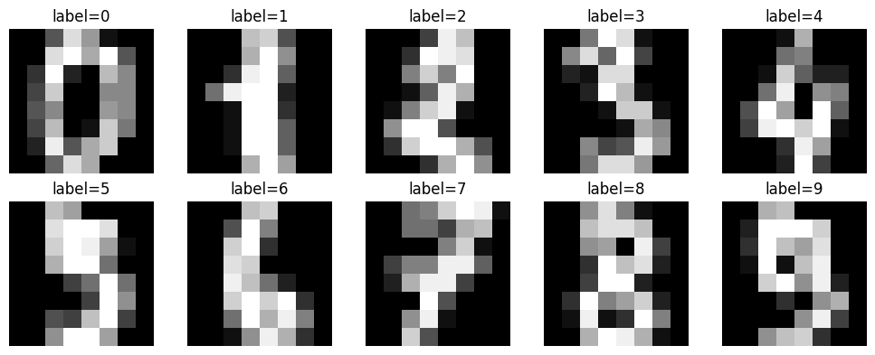
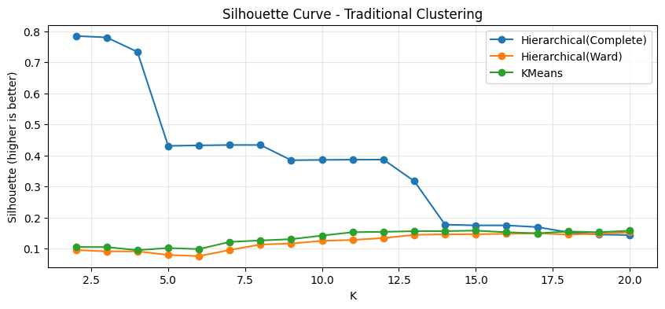
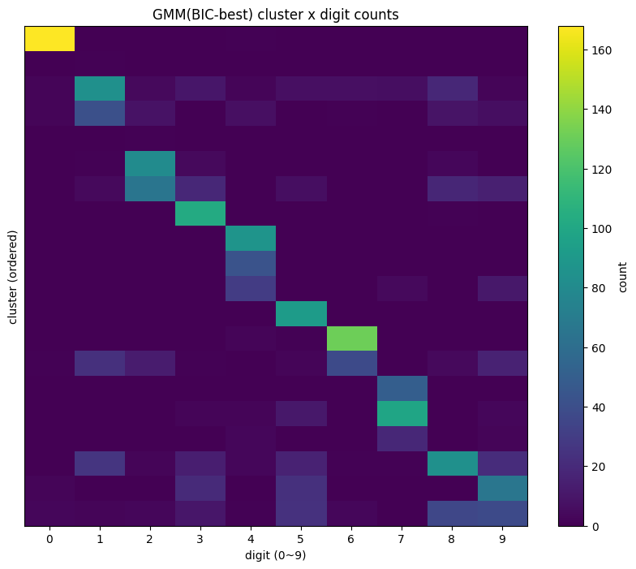
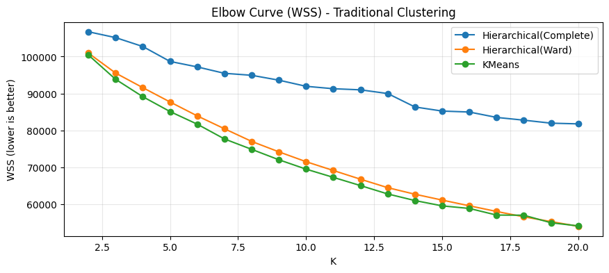
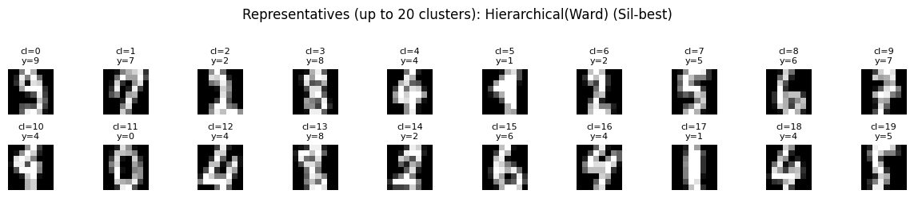
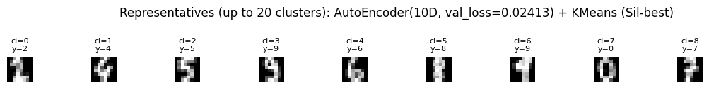
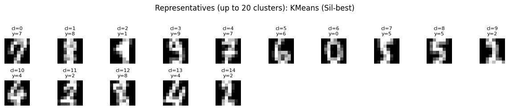

## Digits 데이터 불러오기 및 설명

::: {.callout-note}
## Digits 데이터셋 소개

Digits 데이터셋은 UCI의 Optical Recognition of Handwritten Digits 자료(원래 5,620개 중 scikit-learn에는 테스트셋 1,797개가 수록됨)로, 손글씨 숫자를 미리 인쇄된 양식에 작성하게 한 뒤 이미지를 전처리하여 구축된 것이다.

- 각 손글씨는 NIST 전처리 프로그램으로 정규화된 32×32 비트맵으로 만든 다음, 겹치지 않는 4×4 블록으로 나누어 각 블록에서 ‘켜진 픽셀(on pixel)’ 개수를 세어 0~16 범위의 값을 얻는다.
- 이렇게 계산된 **8×8(=64개) 값이 한 관측치의 특징벡터**가 된다.
- "픽셀값"은 일반 회색조 밝기라기보다, 해당 영역에서 글씨가 차지하는 정도를 요약한 **블록 단위 밀도(density) 지표**이다.
:::

::: {.callout-tip}
## 이 데이터를 군집 실습에 쓰는 이유

| 특성 | 의미 |
|------|------|
| $n = 1{,}797$, $p = 64$ | 고차원 효과가 있으나 과도하지 않아 기법 비교에 적합 |
| 다양한 군집 방법 적용 가능 | 거리 기반, GMM, PCA/딥 임베딩 기반 비교 실습 용이 |
| 정답 라벨(0~9) 존재 | 학습에는 숨기고, 최종 평가에만 외부지표(ARI, NMI)로 활용 |

이후 분석에서 입력 데이터는 $X \in \mathbb{R}^{n \times p}$ ($n=1797, p=64$), 라벨 $y$는 평가용 보조정보로만 사용한다.
:::

```python
import numpy as np
import pandas as pd
import matplotlib.pyplot as plt

from sklearn.datasets import load_digits

# 재현성
RANDOM_STATE = 42
np.random.seed(RANDOM_STATE)

# 데이터 로드
digits = load_digits()
X = digits.data          # (n, 64) : 8x8 이미지를 1차원 벡터로 펼친 것
y = digits.target        # (n,)     : 실제 숫자 라벨(평가용으로만 사용할 것)
images = digits.images   # (n, 8, 8) : 원래 이미지 형태

n, p = X.shape
print(f"n = {n}, p = {p}")
print(f"pixel value range: min={X.min():.1f}, max={X.max():.1f}")
print("classes:", np.unique(y), " (총", len(np.unique(y)), "개)")

# 클래스 분포 확인(평가용 참고)
counts = pd.Series(y).value_counts().sort_index()
display(pd.DataFrame({"count": counts, "proportion": counts / counts.sum()}))

# 샘플 이미지 시각화 (각 숫자별 1개씩)
fig, axes = plt.subplots(2, 5, figsize=(10, 4))
axes = axes.ravel()

for digit_label in range(10):
    idx = np.where(y == digit_label)[0][0]
    axes[digit_label].imshow(images[idx], cmap="gray")
    axes[digit_label].set_title(f"label={digit_label}")
    axes[digit_label].axis("off")

plt.tight_layout()
plt.show()

# 데이터 행렬의 간단 요약(평균/표준편차)
X_df = pd.DataFrame(X)
summary = pd.DataFrame({
    "mean": X_df.mean(),
    "std": X_df.std(),
    "min": X_df.min(),
    "max": X_df.max()
})
display(summary.head(5))
```
**데이터 X.shape = (1797, 64)**
```text
array([[ 0.,  0.,  5., ...,  0.,  0.,  0.],
       [ 0.,  0.,  0., ..., 10.,  0.,  0.],
       [ 0.,  0.,  0., ..., 16.,  9.,  0.],
       ...,
       [ 0.,  0.,  1., ...,  6.,  0.,  0.],
       [ 0.,  0.,  2., ..., 12.,  0.,  0.],
       [ 0.,  0., 10., ..., 12.,  1.,  0.]])
```

```text
n = 1797, p = 64
pixel value range: min=0.0, max=16.0
classes: [0 1 2 3 4 5 6 7 8 9]  (총 10 개)
count	proportion
0	178	0.099054
1	182	0.101280
2	177	0.098497
3	183	0.101836
4	181	0.100723
5	182	0.101280
6	181	0.100723
7	179	0.099610
8	174	0.096828
9	180	0.100167
```
::: {.callout-note}
## 샘플 이미지 해석

- 각 패널(label=0~9)은 숫자 클래스별로 관측치 1개씩을 선택하여 보여준 것이다.
- 한 장의 이미지는 8×8 격자이며, 한 관측치가 **64개의 변수(픽셀/블록 값)**로 이루어진다.
- **밝을수록** 값이 크다: 해당 위치(블록)에 글씨 획이 많이 포함됨을 의미한다.
- 흰색 → 글씨가 많이 지나간 영역 / 검은색 → 거의 비어 있는 영역

3과 8, 4와 9처럼 **모양이 비슷한 클래스**가 존재하므로, 이후 군집에서 군집 간 분리가 완벽하지 않을 수 있음을 미리 시사한다.
:::

{fig-align="center" width="60%"}

```text
	mean	std	min	max
0	0.000000	0.000000	0.0	0.0
1	0.303840	0.907192	0.0	8.0
2	5.204786	4.754826	0.0	16.0
3	11.835838	4.248842	0.0	16.0
4	11.848080	4.287388	0.0	16.0
```

### 전처리: 표준화

::: {.callout-tip}
## 표준화 적용 판단 기준

Digits 데이터는 픽셀 값이 0~16 범위로 제한되어 있어 표준화가 반드시 필요하지는 않다. 그러나 **거리 계산이 포함되는 군집 기법(K-means, GMM)**에서는 스케일링이 성능에 영향을 주므로, 표준화는 일반적으로 권장되는 전처리 단계이다.

표준화를 적용하면 각 픽셀의 평균이 0, 표준편차가 1이 되어 모든 픽셀이 동일한 스케일로 비교된다.
:::

```python
#(선택) 표준화 데이터도 함께 준비(2단계부터 비교용으로 유용)
from sklearn.preprocessing import StandardScaler

scaler = StandardScaler()
X_std = scaler.fit_transform(X)

print("X_std summary:")
print("mean (approx):", X_std.mean(axis=0)[:5])
print("std  (approx):", X_std.std(axis=0)[:5])
```

## 모델기반 군집 (GMM)

::: {.callout-note}
## 이 절의 목적

Digits 데이터에 대해 Gaussian Mixture Model(GMM)을 적합하여 군집을 수행하고, 군집 수 $K$와 공분산 형태(covariance type)를 바꿔가며 AIC/BIC로 최적 조합을 선택한다. 선택된 모형의 군집 성능을 외부지표(ARI/NMI)로 요약하고, AIC/BIC 곡선을 시각화한다.
:::

### 분석 설정

::: {.callout-note}
## 주요 파라미터 설명

| 파라미터 | 설정값 | 의미 |
|----------|--------|------|
| `X_use` | `X_std` | 표준화된 데이터 — GMM은 공분산 추정 시 스케일 차이에 민감 |
| `K_list` | `range(2, 21)` | 군집 수 후보 $K = 2, \ldots, 20$ |
| `cov_types` | 4종 | 구형/축정렬/공유/자유 공분산 가정 비교 |
| `N_INIT` | `10` | EM을 여러 초기값으로 반복, 더 좋은 해 선택 |
| `MAX_ITER` | `500` | EM 반복 횟수 상한 |
| `REG_COVAR` | `1e-6` | 공분산 특이(singularity) 문제 완화 정규화 항 |
:::

### AIC/BIC 기반 최적 조합 선택

::: {.callout-important}
## AIC vs BIC 차이

- 이중 반복문으로 모든 $(K, \text{covariance\_type})$ 조합에 대해 `GaussianMixture(...).fit(X_use)` 수행
- 적합 후 `gmm.aic()`, `gmm.bic()` 계산 → `best_bic_row`, `best_aic_row` 선택
- **BIC는 복잡도 패널티가 더 강하여** AIC보다 보수적인 $K$를 선택하는 경향이 있다.
- `converged` 값으로 EM 수렴 여부를 진단한다.
:::

### 최적 모형 재학습 및 군집 라벨 생성

- `z_hat = gmm.predict(X_use)`: 사후확률 최대 성분에 배정한 **hard assignment** 군집 라벨
- `resp = gmm.predict_proba(X_use)`: 관측치별 군집 소속확률(**책임도**) 행렬
- BIC-best와 AIC-best 각각에 대해 `z_bic`, `z_aic` 및 책임도 생성

### 외부평가 및 시각화

- `adjusted_rand_score(y, z_*)`, `normalized_mutual_info_score(y, z_*)`: 실제 숫자 라벨 $y$와 군집 결과의 일치도 (사후 평가용, 학습에 라벨 사용 안 함)
- 공분산 형태별 AIC/BIC 곡선: (i) 어떤 공분산 구조가 유리한지, (ii) 최적 $K$ 위치, (iii) AIC vs BIC 선택 차이 확인

```python
import numpy as np
import pandas as pd
import matplotlib.pyplot as plt

from sklearn.cluster import KMeans, AgglomerativeClustering
from sklearn.metrics import silhouette_score, adjusted_rand_score, normalized_mutual_info_score

# =========================
# 0) 공통 설정
# =========================
RANDOM_STATE = 42

# 동일 데이터 기준으로 비교 (권장: 표준화)
X_use = X_std   # 필요하면 X로 변경 가능
K_list = list(range(2, 21))

# =========================
# 1) 보조 함수: WSS(Within SS) 계산 (모든 알고리즘 공통)
#    - k-means는 inertia_가 WSS와 동일
#    - 계층군집도 라벨만 있으면 centroid 기반 WSS 계산 가능
# =========================
def compute_wss(X, labels):
    """각 군집의 중심(평균) 기준으로 WSS = sum ||x - mu_k||^2 계산"""
    wss = 0.0
    for k in np.unique(labels):
        Xk = X[labels == k]
        mu = Xk.mean(axis=0)
        wss += ((Xk - mu) ** 2).sum()
    return float(wss)

def elbow_k_by_second_diff(Ks, wss_values):
    """
    간단한 Elbow 자동화:
    - WSS를 0~1로 정규화한 뒤
    - 2차 차분(곡률)이 가장 큰 K를 elbow로 선택
    """
    Ks = np.array(Ks, dtype=float)
    wss = np.array(wss_values, dtype=float)
    # 단조감소가 아닐 수도 있는 수치오차 대비
    wss = np.maximum(wss, 0)

    # 정규화 (큰 값/작은 값 스케일 영향 제거)
    wss_norm = (wss - wss.min()) / (wss.max() - wss.min() + 1e-12)

    # 2차 차분
    d1 = np.diff(wss_norm)
    d2 = np.diff(d1)  # 길이: len(Ks)-2
    if len(d2) == 0:
        return int(Ks[0])

    # 곡률이 가장 큰 지점(절대값 크게)
    idx = np.argmax(np.abs(d2))
    # d2는 K[0..] 기준으로 (K[idx+1]) 위치에 해당
    return int(Ks[idx + 1])

# =========================
# 2) (4.2) 전통적 군집: k-means / 계층군집(Ward, Complete)
#    - 각 K에서 silhouette, WSS, ARI, NMI 계산
# =========================
records = []

# ---- (A) k-means ----
for K in K_list:
    km = KMeans(n_clusters=K, random_state=RANDOM_STATE, n_init=20)
    z = km.fit_predict(X_use)
    sil = silhouette_score(X_use, z, metric="euclidean")
    wss = float(km.inertia_)  # = WSS
    records.append({
        "method": "KMeans",
        "K": K,
        "silhouette": sil,
        "wss": wss,
        "ARI": adjusted_rand_score(y, z),
        "NMI": normalized_mutual_info_score(y, z)
    })

# ---- (B) Hierarchical: Ward / Complete ----
def agglomerative_fit_predict(X, K, linkage):
    # sklearn 버전 호환(affinity vs metric)
    try:
        model = AgglomerativeClustering(n_clusters=K, linkage=linkage, metric="euclidean")
    except TypeError:
        model = AgglomerativeClustering(n_clusters=K, linkage=linkage, affinity="euclidean")
    return model.fit_predict(X)

for K in K_list:
    # Ward
    z_ward = agglomerative_fit_predict(X_use, K, linkage="ward")
    sil_ward = silhouette_score(X_use, z_ward, metric="euclidean")
    wss_ward = compute_wss(X_use, z_ward)
    records.append({
        "method": "Hierarchical(Ward)",
        "K": K,
        "silhouette": sil_ward,
        "wss": wss_ward,
        "ARI": adjusted_rand_score(y, z_ward),
        "NMI": normalized_mutual_info_score(y, z_ward)
    })

    # Complete
    z_comp = agglomerative_fit_predict(X_use, K, linkage="complete")
    sil_comp = silhouette_score(X_use, z_comp, metric="euclidean")
    wss_comp = compute_wss(X_use, z_comp)
    records.append({
        "method": "Hierarchical(Complete)",
        "K": K,
        "silhouette": sil_comp,
        "wss": wss_comp,
        "ARI": adjusted_rand_score(y, z_comp),
        "NMI": normalized_mutual_info_score(y, z_comp)
    })

trad_results = pd.DataFrame(records).sort_values(["method", "K"]).reset_index(drop=True)
display(trad_results.head(10))

# =========================
# 3) K 선택: Silhouette-best + Elbow-best(자동) 각각 구하기
# =========================
best_rows = []

for m in trad_results["method"].unique():
    dfm = trad_results[trad_results["method"] == m].copy()

    # (i) Silhouette-best
    sil_best = dfm.loc[dfm["silhouette"].idxmax()]

    # (ii) Elbow-best (WSS 곡률 기반)
    elbowK = elbow_k_by_second_diff(dfm["K"].values, dfm["wss"].values)
    elbow_row = dfm[dfm["K"] == elbowK].iloc[0]

    best_rows.append({
        "method": m,
        "K_sil_best": int(sil_best["K"]),
        "silhouette_sil_best": float(sil_best["silhouette"]),
        "wss_sil_best": float(sil_best["wss"]),
        "ARI_sil_best": float(sil_best["ARI"]),
        "NMI_sil_best": float(sil_best["NMI"]),
        "K_elbow": int(elbow_row["K"]),
        "silhouette_elbow": float(elbow_row["silhouette"]),
        "wss_elbow": float(elbow_row["wss"]),
        "ARI_elbow": float(elbow_row["ARI"]),
        "NMI_elbow": float(elbow_row["NMI"]),
    })

selection_table = pd.DataFrame(best_rows).sort_values("method").reset_index(drop=True)
display(selection_table)

# =========================
# 4) 그래프: Elbow(WSS) / Silhouette 곡선 (방법별)
# =========================
methods = trad_results["method"].unique()

# (A) WSS Elbow
plt.figure(figsize=(10, 4))
for m in methods:
    dfm = trad_results[trad_results["method"] == m]
    plt.plot(dfm["K"], dfm["wss"], marker="o", label=m)
plt.xlabel("K")
plt.ylabel("WSS (lower is better)")
plt.title("Elbow Curve (WSS) - Traditional Clustering")
plt.grid(True, alpha=0.3)
plt.legend()
plt.show()

# (B) Silhouette
plt.figure(figsize=(10, 4))
for m in methods:
    dfm = trad_results[trad_results["method"] == m]
    plt.plot(dfm["K"], dfm["silhouette"], marker="o", label=m)
plt.xlabel("K")
plt.ylabel("Silhouette (higher is better)")
plt.title("Silhouette Curve - Traditional Clustering")
plt.grid(True, alpha=0.3)
plt.legend()
plt.show()

# =========================
# 5) GMM(BIC-best)와 동일 형식 비교표 만들기
#    - 기존 셀에서 best_bic_row, z_bic, results(GMM AIC/BIC table)가 존재한다고 가정
# =========================
comparison_rows = []

# (A) GMM(BIC-best) 포함 (있을 때만)
if "best_bic_row" in globals() and "z_bic" in globals():
    K_gmm = int(best_bic_row["K"])
    cov_gmm = str(best_bic_row["covariance_type"])

    # silhouette/WSS도 같이 계산(내부지표 통일)
    sil_gmm = silhouette_score(X_use, z_bic, metric="euclidean")
    wss_gmm = compute_wss(X_use, z_bic)

    # AIC/BIC 값도 같이 적어두면 보고서가 깔끔함
    aic_gmm = float(best_bic_row["aic"]) if "aic" in best_bic_row else np.nan
    bic_gmm = float(best_bic_row["bic"]) if "bic" in best_bic_row else np.nan

    comparison_rows.append({
        "method": f"GMM(BIC-best, {cov_gmm})",
        "K": K_gmm,
        "silhouette": sil_gmm,
        "wss": wss_gmm,
        "ARI": adjusted_rand_score(y, z_bic),
        "NMI": normalized_mutual_info_score(y, z_bic),
        "AIC": aic_gmm,
        "BIC": bic_gmm
    })
else:
    print("⚠️ best_bic_row 또는 z_bic가 없습니다. (GMM 셀 실행 후 다시 실행하세요.)")

# (B) 전통적 군집: silhouette-best 기준으로 한 줄씩 요약
for _, row in selection_table.iterrows():
    comparison_rows.append({
        "method": row["method"] + " (Sil-best)",
        "K": int(row["K_sil_best"]),
        "silhouette": float(row["silhouette_sil_best"]),
        "wss": float(row["wss_sil_best"]),
        "ARI": float(row["ARI_sil_best"]),
        "NMI": float(row["NMI_sil_best"]),
        "AIC": np.nan,
        "BIC": np.nan
    })

comparison = pd.DataFrame(comparison_rows)
# 보기 좋게 정렬: 내부지표(실루엣 높은 순) 또는 ARI 높은 순
comparison_sorted = comparison.sort_values(["ARI", "silhouette"], ascending=False).reset_index(drop=True)

display(comparison_sorted)
```
::: {.callout-caution}
## GMM(BIC-best) 결과 핵심 해석

BIC 기준으로 선택된 GMM은 **대각 공분산(diag), K=20**을 택하였다. 이는 숫자 10종을 직접 재현하기보다, 숫자 내부 필기체 변이를 포함한 더 세분화된 잠재집단 구조를 제안한 것이다.

- ARI/NMI: 중간 수준 외부 일치도
- silhouette: 낮게 나타남 → 군집들이 공간상 겹치는 경향

전통적 군집에서는 **실루엣이 가장 높은 Complete(K=2)이 ARI/NMI는 거의 0**, 실루엣이 낮은 **Ward(K=20)이 ARI/NMI는 가장 높다** → 실루엣과 외부 일치도 간의 트레이드오프.
:::

::: {.callout-note}
## K=20의 의미: "숫자 10종"이 아닌 "세분화된 구조"

Digits의 실제 숫자 라벨은 0~9, 총 10개이다. GMM이 BIC로 고른 군집 수는 K=20이다.

- ‘0을 두 부류(둥근 0 / 찌그러진 0)’, ‘1을 두 부류(가느다란 1 / 굵은 1)’ 처럼, **같은 숫자 안에서도 필기 스타일 차이**를 따로 군집으로 분리한 것이다.
- 즉, 숫자(10개)보다 더 세분화된 잠재집단(20개)을 제안한 결과이다.

**ARI/NMI가 "중간"인 이유**: GMM은 숫자 하나를 여러 군집으로 쪼갤 수 있어 "숫자 10개와 1:1로 딱 맞는 군집"이 되기 어렵다. "완전한 숫자 분류는 아니지만, 숫자 구조와 어느 정도 관련은 있다"는 의미이다.

**silhouette가 낮은 이유**: 3과 8, 4와 9처럼 모양이 비슷한 숫자가 있고, 같은 숫자 안에서도 다양한 필기체가 있어 데이터가 공간상 겹치기 쉽다. GMM이 20개로 잘게 쪼개도 군집들이 "멀리 떨어진 섬"처럼 분리되지 않고 가까운 곳에 겹쳐 있는 상태가 된다.
:::

```text
method	K	silhouette	wss	ARI	NMI
0	Hierarchical(Complete)	2	0.784424	106721.094913	0.000002	0.001556
1	Hierarchical(Complete)	3	0.779755	105134.196220	0.000002	0.002223
2	Hierarchical(Complete)	4	0.733223	102725.043083	-0.000002	0.003753
3	Hierarchical(Complete)	5	0.430919	98680.223906	0.000290	0.020400
4	Hierarchical(Complete)	6	0.432321	97196.179621	0.000353	0.023599
5	Hierarchical(Complete)	7	0.433767	95458.376649	0.000352	0.026290
6	Hierarchical(Complete)	8	0.433629	94923.776923	0.000353	0.026916
7	Hierarchical(Complete)	9	0.384715	93599.700879	0.000311	0.027731
8	Hierarchical(Complete)	10	0.385738	91939.649024	0.000298	0.031561
9	Hierarchical(Complete)	11	0.386541	91283.712892	0.000289	0.032888
method	K_sil_best	silhouette_sil_best	wss_sil_best	ARI_sil_best	NMI_sil_best	K_elbow	silhouette_elbow	wss_elbow	ARI_elbow	NMI_elbow
0	Hierarchical(Complete)	2	0.784424	106721.094913	0.000002	0.001556	13	0.317344	89979.315231	0.000289	0.036864
1	Hierarchical(Ward)	20	0.152754	54003.237083	0.688082	0.794962	3	0.091561	95529.286988	0.276093	0.493419
2	KMeans	15	0.158307	59534.498937	0.568326	0.688241	18	0.155479	57000.786005	0.524090	0.683195
```
{fig-align="center" width="80%"}

{fig-align="center" width="80%"}

```text
method	K	silhouette	wss	ARI	NMI	AIC	BIC
0	Hierarchical(Ward) (Sil-best)	20	0.152754	54003.237083	0.688082	0.794962	NaN	NaN
1	KMeans (Sil-best)	15	0.158307	59534.498937	0.568326	0.688241	NaN	NaN
2	GMM(BIC-best, diag)	20	0.093540	62457.729652	0.437694	0.596951	-232769.805429	-218601.104675
3	Hierarchical(Complete) (Sil-best)	2	0.784424	106721.094913	0.000002	0.001556	NaN	NaN
```
### GMM(BIC-best) 군집 결과 해석

GMM(BIC-best)로 얻은 군집 라벨 `z_bic`이 실제 숫자 라벨 `y(0~9)`와 어떻게 대응되는지 해석한다. 분석의 초점은 "군집 수가 10개인가?"가 아니라, 각 군집이 얼마나 한 숫자에 순수하게 대응하는가(섞임/혼합), 각 숫자가 몇 개의 군집으로 분해되는가(쪼개짐/분할)에 있다.

### 군집 × 실제 숫자 교차표

$ct = \text{crosstab}(z_{\text{bic}}, y)$

- **행(row)**: GMM이 만든 cluster
- **열(column)**: 실제 숫자 digit(0~9)
- **원소 $ct_{k,d}$**: "군집 $k$에 속한 표본 중 실제 숫자가 $d$인 개수"

이 표는 두 가지를 동시에 보여준다: **군집 혼합(mixing)**과 **숫자 분할(splitting)**.

### 군집별 대표 숫자와 순도(purity)

::: {.callout-important}
## 순도(Purity) 정의

군집 $k$에 대해:

$$n_k = \sum_{d=0}^{9} ct_{k,d}, \quad d_k^* = \arg\max_d ct_{k,d}, \quad m_k = \max_d ct_{k,d}$$

$$\text{purity}_k = \frac{m_k}{n_k}$$

- $\text{purity}_k \approx 1$ → 군집 $k$는 거의 하나의 숫자에 대응하는 **순수 군집**
- $\text{purity}_k$ 낮음 → 여러 숫자가 섞인 **혼합 군집**
:::

### 전체 순도(Overall Purity)

::: {.callout-tip}
## Overall Purity의 직관적 의미

$$\text{Overall Purity} = \frac{\sum_k m_k}{n}$$

"각 군집에 대표 숫자 라벨을 하나 붙이고(다수결), 그렇게 분류했다고 생각하면 전체적으로 얼마나 맞는가?" — 군집 결과를 가장 단순한 방식으로 숫자와 매핑했을 때의 전체 정확도에 해당하는 요약 지표이다.
:::

### 숫자별 "쪼개짐(분할)" 정량화

::: {.callout-note}
## 분할 지표 두 가지

**(A) 80%를 설명하는 최소 군집 수** $k_{80\%}(d)$

숫자 $d$ 표본을 많이 담고 있는 군집부터 정렬한 뒤, 누적 비율이 80%를 넘는 데 필요한 군집 개수를 계산한다.

- 값이 1 → 거의 한 군집에 집중(쪼개짐이 작음)
- 값이 크다 → 여러 군집으로 분산(쪼개짐이 큼)

**(B) 유의미한 분할 군집 수** (표본이 10개 이상인 군집 수)

소량(몇 개) 흩어진 것은 노이즈일 수 있으므로 함께 확인한다.
:::

### 히트맵으로 섞임·쪼개짐 시각화

교차표를 히트맵으로 그리면:

- 특정 숫자 **열**이 여러 군집 **행**으로 퍼져 있으면 → 그 숫자는 쪼개짐
- 특정 군집 **행**이 여러 숫자 **열**에 걸쳐 있으면 → 그 군집은 섞임

군집 번호는 임의이므로 대표 숫자 → 순도 → 크기 순으로 정렬해 시각화하면 해석이 용이해진다.

### 숫자별 상위 군집 비중(top3 share)

- 상위 1~3개 비중이 높다 → 해당 숫자는 소수 군집에 집중(쪼개짐 작음)
- 상위 3개 비중이 낮다 → 다양한 형태로 여러 군집에 분해(쪼개짐 큼)

::: {.callout-note}
## 핵심 정리

GMM(BIC-best) 군집 결과는 "10개 숫자를 10개 군집으로 맞췄는가"보다, 숫자별 형태 다양성 때문에 **하나의 숫자가 여러 군집으로 분해되는 현상**과 **군집 내부에 여러 숫자가 섞이는 현상**을 함께 보여준다. 군집별 순도는 "군집이 얼마나 순수한가"를, 숫자별 분할 지표는 "숫자가 얼마나 쪼개졌는가"를, overall purity는 전체 구조 대응 수준을 한 줄로 요약한다.
:::

```python
import numpy as np
import pandas as pd
import matplotlib.pyplot as plt

# ===== 0) 교차표(클러스터 x 실제 숫자) =====
ct = pd.crosstab(z_bic, y, rownames=["cluster"], colnames=["digit"])
display(ct)

# ===== 1) 각 클러스터의 대표 숫자(다수결)와 순도(purity) =====
cluster_size = ct.sum(axis=1)
major_digit = ct.idxmax(axis=1)
major_count = ct.max(axis=1)
cluster_purity = (major_count / cluster_size)

cluster_summary = pd.DataFrame({
    "size": cluster_size,
    "major_digit": major_digit,
    "major_count": major_count,
    "purity": cluster_purity
}).sort_values(["purity","size"], ascending=False)

print("=== Cluster summary (major digit & purity) ===")
display(cluster_summary)

# ===== 2) "한 숫자(digit)가 몇 개 클러스터로 쪼개졌는가?" =====
# 기준 A: 그 숫자 샘플 중 80%를 설명하는 데 필요한 클러스터 개수
# 기준 B: 그 숫자에서 표본이 일정 이상(예: >=10개) 들어있는 클러스터 개수
threshold = 10
cover_rate = 0.80

digit_rows = []
for d in range(10):
    col = ct[d]
    total = int(col.sum())
    if total == 0:
        continue
    # 클러스터별로 해당 숫자 count 내림차순 정렬
    counts_sorted = col.sort_values(ascending=False)

    # (A) 상위 몇 개 클러스터가 cover_rate(예: 80%)를 커버하는가
    cum = counts_sorted.cumsum() / total
    k_cover = int((cum < cover_rate).sum() + 1)  # 80% 넘기는 최소 개수

    # (B) 표본이 threshold 이상 들어있는 클러스터 개수(유의미한 분할 수)
    k_ge_thr = int((counts_sorted >= threshold).sum())

    # 상위 5개 클러스터 비중(어디에 몰려 있는지)
    top5 = (counts_sorted.head(5) / total).values
    digit_rows.append({
        "digit": d,
        "n_samples": total,
        f"clusters_to_cover_{int(cover_rate*100)}%": k_cover,
        f"clusters_with_>=_{threshold}": k_ge_thr,
        "top1_share": top5[0] if len(top5)>0 else np.nan,
        "top2_share": (top5[0]+top5[1]) if len(top5)>1 else np.nan,
        "top5_share": np.sum(top5) if len(top5)>0 else np.nan,
    })

digit_split = pd.DataFrame(digit_rows).sort_values("digit")
print("=== Digit split summary ===")
display(digit_split)

# ===== 3) 히트맵(클러스터 x 숫자)로 "쪼개짐/섞임" 시각화 =====
# 보기 좋게: 클러스터를 대표숫자→순도→크기 순으로 정렬
order = cluster_summary.sort_values(["major_digit","purity","size"], ascending=[True, False, False]).index
ct_ordered = ct.loc[order]

plt.figure(figsize=(10, 8))
plt.imshow(ct_ordered.values, aspect="auto")
plt.colorbar(label="count")
plt.xlabel("digit (0~9)")
plt.ylabel("cluster (ordered)")
plt.title("GMM(BIC-best) cluster x digit counts")
plt.xticks(ticks=np.arange(10), labels=np.arange(10))
plt.yticks([])  # 클러스터가 많으니 y축 라벨은 생략
plt.show()

# ===== 4) (선택) "숫자별로 상위 클러스터 3개" 출력 =====
for d in range(10):
    s = ct[d].sort_values(ascending=False)
    total = s.sum()
    top3 = (s.head(3) / total).round(3)
    print(f"digit {d}: top3 clusters shares -> {top3.to_dict()}")
```
```text
digit	0	1	2	3	4	5	6	7	8	9
cluster										
0	2	84	4	10	2	7	7	6	19	2
1	0	0	0	0	0	92	0	0	0	0
2	0	0	0	0	87	0	0	0	0	0
3	0	0	0	103	0	0	0	0	1	0
4	0	0	0	0	3	0	0	19	0	2
5	0	0	0	0	2	1	131	0	0	0
6	0	26	2	14	3	16	1	1	84	21
7	3	2	3	10	1	24	3	0	36	38
8	0	0	0	2	2	11	0	99	0	3
9	2	0	0	20	0	23	0	0	0	66
10	0	0	0	0	30	0	0	4	0	11
11	0	0	0	0	43	0	0	0	0	0
12	0	0	0	0	0	0	0	50	0	0
13	0	1	81	4	0	0	0	0	3	0
14	0	4	65	19	0	6	0	0	18	15
15	0	1	0	0	0	0	0	0	0	0
16	0	0	1	0	0	0	0	0	0	0
17	168	0	0	0	1	0	0	0	0	0
18	2	41	8	0	7	0	1	0	9	6
19	1	23	13	1	0	2	38	0	4	16
=== Cluster summary (major digit & purity) ===
size	major_digit	major_count	purity
cluster				
1	92	5	92	1.000000
2	87	4	87	1.000000
12	50	7	50	1.000000
11	43	4	43	1.000000
15	1	1	1	1.000000
16	1	2	1	1.000000
17	169	0	168	0.994083
3	104	3	103	0.990385
5	134	6	131	0.977612
13	89	2	81	0.910112
8	117	7	99	0.846154
4	24	7	19	0.791667
10	45	4	30	0.666667
9	111	9	66	0.594595
0	143	1	84	0.587413
18	74	1	41	0.554054
14	127	2	65	0.511811
6	168	8	84	0.500000
19	98	6	38	0.387755
7	120	9	38	0.316667
=== Digit split summary ===
digit	n_samples	clusters_to_cover_80%	clusters_with_>=_10	top1_share	top2_share	top5_share
0	0	178	1	1	0.943820	0.960674	0.994382
1	1	182	3	4	0.461538	0.686813	0.978022
2	2	177	2	3	0.457627	0.824859	0.966102
3	3	183	4	6	0.562842	0.672131	0.907104
4	4	181	3	3	0.480663	0.718232	0.939227
5	5	182	4	5	0.505495	0.637363	0.912088
6	6	181	2	2	0.723757	0.933702	0.994475
7	7	179	2	3	0.553073	0.832402	0.994413
8	8	174	4	4	0.482759	0.689655	0.954023
9	9	180	5	6	0.366667	0.577778	0.866667
```
{fig-align="center" width="60%"}

```text
digit 0: top3 clusters shares -> {17: 0.944, 7: 0.017, 0: 0.011}
digit 1: top3 clusters shares -> {0: 0.462, 18: 0.225, 6: 0.143}
digit 2: top3 clusters shares -> {13: 0.458, 14: 0.367, 19: 0.073}
digit 3: top3 clusters shares -> {3: 0.563, 9: 0.109, 14: 0.104}
digit 4: top3 clusters shares -> {2: 0.481, 11: 0.238, 10: 0.166}
digit 5: top3 clusters shares -> {1: 0.505, 7: 0.132, 9: 0.126}
digit 6: top3 clusters shares -> {5: 0.724, 19: 0.21, 0: 0.039}
digit 7: top3 clusters shares -> {8: 0.553, 12: 0.279, 4: 0.106}
digit 8: top3 clusters shares -> {6: 0.483, 7: 0.207, 0: 0.109}
digit 9: top3 clusters shares -> {9: 0.367, 7: 0.211, 6: 0.117}
```

## 전통적 군집분석

::: {.callout-note}
## 이 절의 목적

거리 기반 전통적 군집방법인 K-means와 계층적 군집(Ward, Complete)을 동일 데이터에서 비교한다. 비교 기준:

| 지표 유형 | 지표 | 비고 |
|-----------|------|------|
| 내부 지표 | Silhouette, WSS | 정답 라벨 없이도 계산 가능 |
| 외부 지표 | ARI, NMI | 정답 라벨이 있을 때만 사용 가능 — 여기서는 평가 목적으로만 활용 |
:::

### 기본 설정과 데이터 준비

- 군집 알고리즘: `KMeans`, `AgglomerativeClustering`
- 평가 지표: `silhouette_score`, `adjusted_rand_score`, `normalized_mutual_info_score`
- `RANDOM_STATE = 42` 설정으로 결과 재현성 확보
- 거리 기반 군집은 스케일에 민감하므로 표준화된 `X_std` 사용
- 군집 수 후보: $K = 2, \ldots, 20$

### WSS 계산 함수

::: {.callout-important}
## WSS 정의

$$WSS = \sum_{k=1}^{K} \sum_{i \in C_k} \|x_i - \mu_k\|^2, \quad \mu_k \text{: 군집 } k \text{의 중심}$$

K-means는 `inertia_`로 WSS를 직접 제공하지만, 계층군집은 그렇지 않다. `compute_wss(X, labels)` 함수를 만들어 **모든 방법에 동일한 WSS 정의를 적용**하면 공정한 비교가 가능하다.
:::

### Elbow 자동 선택 함수

::: {.callout-note}
## Elbow 자동화 절차

WSS 감소 곡선에서 꺾이는 지점을 찾아 적절한 $K$를 자동 선택한다.

1. WSS 값을 0~1 범위로 정규화
2. 1차 차분과 2차 차분 계산
3. **2차 차분 절댓값이 가장 큰 지점을 Elbow로 선택**

이는 WSS 감소 속도가 급격히 완만해지는 지점을 수치적으로 탐지하는 방법이다.
:::

### K별 군집 수행 및 지표 계산

각 $K(2 \sim 20)$에 대해 다음을 수행한다.

**K-means**: `KMeans` 실행 → silhouette, WSS(`inertia_`), ARI, NMI 계산

**계층군집(Ward, Complete)**: `AgglomerativeClustering` 실행 → `compute_wss`로 WSS 계산, silhouette·외부지표 동일하게 계산

방법 × K 조합별 성능이 `trad_results`에 저장된다.

### K 선택 기준 비교

- **Silhouette-best**: $K^*_{sil} = \arg\max_K \text{silhouette}(K)$ — 분리도 중심
- **Elbow-best**: 2차 차분 자동 선택 — 응집도 감소 패턴 중심

두 기준이 같은 $K$를 제시하면 선택이 명확하지만, 다를 경우 해석과 분석 목적을 고려해야 한다.

::: {.callout-tip}
## 이 분석의 의미

단순한 알고리즘 실행이 아니라, **"군집 수 선택"과 "지표 해석"**이라는 군집분석의 핵심 문제를 학습하기 위한 구조이다.

- 동일 데이터에서 여러 방법 비교
- **내부 지표와 외부 지표의 차이** 이해
- K 선택이 단일 기준으로 결정되지 않음을 확인
- 이후 GMM 등 확률모형 기반 군집과의 구조적 비교 준비
:::

```python
import numpy as np
import pandas as pd
import matplotlib.pyplot as plt

from sklearn.cluster import KMeans, AgglomerativeClustering
from sklearn.metrics import silhouette_score, adjusted_rand_score, normalized_mutual_info_score

# =========================
# 0) 공통 설정
# =========================
RANDOM_STATE = 42

# 동일 데이터 기준으로 비교 (권장: 표준화)
X_use = X_std   # 필요하면 X로 변경 가능
K_list = list(range(2, 21))

# =========================
# 1) 보조 함수: WSS(Within SS) 계산 (모든 알고리즘 공통)
#    - k-means는 inertia_가 WSS와 동일
#    - 계층군집도 라벨만 있으면 centroid 기반 WSS 계산 가능
# =========================
def compute_wss(X, labels):
    """각 군집의 중심(평균) 기준으로 WSS = sum ||x - mu_k||^2 계산"""
    wss = 0.0
    for k in np.unique(labels):
        Xk = X[labels == k]
        mu = Xk.mean(axis=0)
        wss += ((Xk - mu) ** 2).sum()
    return float(wss)

def elbow_k_by_second_diff(Ks, wss_values):
    """
    간단한 Elbow 자동화:
    - WSS를 0~1로 정규화한 뒤
    - 2차 차분(곡률)이 가장 큰 K를 elbow로 선택
    """
    Ks = np.array(Ks, dtype=float)
    wss = np.array(wss_values, dtype=float)
    # 단조감소가 아닐 수도 있는 수치오차 대비
    wss = np.maximum(wss, 0)

    # 정규화 (큰 값/작은 값 스케일 영향 제거)
    wss_norm = (wss - wss.min()) / (wss.max() - wss.min() + 1e-12)

    # 2차 차분
    d1 = np.diff(wss_norm)
    d2 = np.diff(d1)  # 길이: len(Ks)-2
    if len(d2) == 0:
        return int(Ks[0])

    # 곡률이 가장 큰 지점(절대값 크게)
    idx = np.argmax(np.abs(d2))
    # d2는 K[0..] 기준으로 (K[idx+1]) 위치에 해당
    return int(Ks[idx + 1])

# =========================
# 2) (4.2) 전통적 군집: k-means / 계층군집(Ward, Complete)
#    - 각 K에서 silhouette, WSS, ARI, NMI 계산
# =========================
records = []

# ---- (A) k-means ----
for K in K_list:
    km = KMeans(n_clusters=K, random_state=RANDOM_STATE, n_init=20)
    z = km.fit_predict(X_use)
    sil = silhouette_score(X_use, z, metric="euclidean")
    wss = float(km.inertia_)  # = WSS
    records.append({
        "method": "KMeans",
        "K": K,
        "silhouette": sil,
        "wss": wss,
        "ARI": adjusted_rand_score(y, z),
        "NMI": normalized_mutual_info_score(y, z)
    })

# ---- (B) Hierarchical: Ward / Complete ----
def agglomerative_fit_predict(X, K, linkage):
    # sklearn 버전 호환(affinity vs metric)
    try:
        model = AgglomerativeClustering(n_clusters=K, linkage=linkage, metric="euclidean")
    except TypeError:
        model = AgglomerativeClustering(n_clusters=K, linkage=linkage, affinity="euclidean")
    return model.fit_predict(X)

for K in K_list:
    # Ward
    z_ward = agglomerative_fit_predict(X_use, K, linkage="ward")
    sil_ward = silhouette_score(X_use, z_ward, metric="euclidean")
    wss_ward = compute_wss(X_use, z_ward)
    records.append({
        "method": "Hierarchical(Ward)",
        "K": K,
        "silhouette": sil_ward,
        "wss": wss_ward,
        "ARI": adjusted_rand_score(y, z_ward),
        "NMI": normalized_mutual_info_score(y, z_ward)
    })

    # Complete
    z_comp = agglomerative_fit_predict(X_use, K, linkage="complete")
    sil_comp = silhouette_score(X_use, z_comp, metric="euclidean")
    wss_comp = compute_wss(X_use, z_comp)
    records.append({
        "method": "Hierarchical(Complete)",
        "K": K,
        "silhouette": sil_comp,
        "wss": wss_comp,
        "ARI": adjusted_rand_score(y, z_comp),
        "NMI": normalized_mutual_info_score(y, z_comp)
    })

trad_results = pd.DataFrame(records).sort_values(["method", "K"]).reset_index(drop=True)
display(trad_results.head(10))

# =========================
# 3) K 선택: Silhouette-best + Elbow-best(자동) 각각 구하기
# =========================
best_rows = []

for m in trad_results["method"].unique():
    dfm = trad_results[trad_results["method"] == m].copy()

    # (i) Silhouette-best
    sil_best = dfm.loc[dfm["silhouette"].idxmax()]

    # (ii) Elbow-best (WSS 곡률 기반)
    elbowK = elbow_k_by_second_diff(dfm["K"].values, dfm["wss"].values)
    elbow_row = dfm[dfm["K"] == elbowK].iloc[0]

    best_rows.append({
        "method": m,
        "K_sil_best": int(sil_best["K"]),
        "silhouette_sil_best": float(sil_best["silhouette"]),
        "wss_sil_best": float(sil_best["wss"]),
        "ARI_sil_best": float(sil_best["ARI"]),
        "NMI_sil_best": float(sil_best["NMI"]),
        "K_elbow": int(elbow_row["K"]),
        "silhouette_elbow": float(elbow_row["silhouette"]),
        "wss_elbow": float(elbow_row["wss"]),
        "ARI_elbow": float(elbow_row["ARI"]),
        "NMI_elbow": float(elbow_row["NMI"]),
    })

selection_table = pd.DataFrame(best_rows).sort_values("method").reset_index(drop=True)
display(selection_table)

# =========================
# 4) 그래프: Elbow(WSS) / Silhouette 곡선 (방법별)
# =========================
methods = trad_results["method"].unique()

# (A) WSS Elbow
plt.figure(figsize=(10, 4))
for m in methods:
    dfm = trad_results[trad_results["method"] == m]
    plt.plot(dfm["K"], dfm["wss"], marker="o", label=m)
plt.xlabel("K")
plt.ylabel("WSS (lower is better)")
plt.title("Elbow Curve (WSS) - Traditional Clustering")
plt.grid(True, alpha=0.3)
plt.legend()
plt.show()

# (B) Silhouette
plt.figure(figsize=(10, 4))
for m in methods:
    dfm = trad_results[trad_results["method"] == m]
    plt.plot(dfm["K"], dfm["silhouette"], marker="o", label=m)
plt.xlabel("K")
plt.ylabel("Silhouette (higher is better)")
plt.title("Silhouette Curve - Traditional Clustering")
plt.grid(True, alpha=0.3)
plt.legend()
plt.show()

# =========================
# 5) GMM(BIC-best)와 동일 형식 비교표 만들기
#    - 기존 셀에서 best_bic_row, z_bic, results(GMM AIC/BIC table)가 존재한다고 가정
# =========================
comparison_rows = []

# (A) GMM(BIC-best) 포함 (있을 때만)
if "best_bic_row" in globals() and "z_bic" in globals():
    K_gmm = int(best_bic_row["K"])
    cov_gmm = str(best_bic_row["covariance_type"])

    # silhouette/WSS도 같이 계산(내부지표 통일)
    sil_gmm = silhouette_score(X_use, z_bic, metric="euclidean")
    wss_gmm = compute_wss(X_use, z_bic)

    # AIC/BIC 값도 같이 적어두면 보고서가 깔끔함
    aic_gmm = float(best_bic_row["aic"]) if "aic" in best_bic_row else np.nan
    bic_gmm = float(best_bic_row["bic"]) if "bic" in best_bic_row else np.nan

    comparison_rows.append({
        "method": f"GMM(BIC-best, {cov_gmm})",
        "K": K_gmm,
        "silhouette": sil_gmm,
        "wss": wss_gmm,
        "ARI": adjusted_rand_score(y, z_bic),
        "NMI": normalized_mutual_info_score(y, z_bic),
        "AIC": aic_gmm,
        "BIC": bic_gmm
    })
else:
    print("⚠️ best_bic_row 또는 z_bic가 없습니다. (GMM 셀 실행 후 다시 실행하세요.)")

# (B) 전통적 군집: silhouette-best 기준으로 한 줄씩 요약
for _, row in selection_table.iterrows():
    comparison_rows.append({
        "method": row["method"] + " (Sil-best)",
        "K": int(row["K_sil_best"]),
        "silhouette": float(row["silhouette_sil_best"]),
        "wss": float(row["wss_sil_best"]),
        "ARI": float(row["ARI_sil_best"]),
        "NMI": float(row["NMI_sil_best"]),
        "AIC": np.nan,
        "BIC": np.nan
    })

comparison = pd.DataFrame(comparison_rows)
# 보기 좋게 정렬: 내부지표(실루엣 높은 순) 또는 ARI 높은 순
comparison_sorted = comparison.sort_values(["ARI", "silhouette"], ascending=False).reset_index(drop=True)

display(comparison_sorted)
```

이 절에서는 표준화된 digits 데이터(X_std)를 대상으로 전통적 군집방법 세 가지(KMeans, Hierarchical(Ward), Hierarchical(Complete))를 적용했을 때의 성능 지표를 해석한다. 비교는 내부 지표(silhouette, WSS)와 외부 지표(ARI, NMI)를 함께 사용한다. 내부 지표는 실제 라벨이 없는 일반적 군집 상황에서도 사용 가능한 반면, 외부 지표는 digits처럼 정답 라벨이 존재하는 데이터에서만 계산 가능하므로 여기서는 평가 목적의 참고값으로 이해한다.

### Hierarchical(Complete) 결과 해석

::: {.callout-warning}
## Complete Linkage의 함정: silhouette 높음 ≠ 좋은 군집

- K=2에서 silhouette **0.7844로 매우 높음** — 그러나 ARI=0.000002, NMI=0.001556으로 **거의 0**
- Complete linkage는 "큰 덩어리 분리(전체 밝기, 획의 양 등)"는 잘 만들 수 있으나, **digits의 실제 클래스 구조와 일치하지 않는다.**
- K를 늘려도(K=3: silhouette 0.7798, ARI≈0) 이 경향은 크게 바뀌지 않는다.

**결론**: 내부 지표(silhouette)가 높더라도 외부 지표(ARI/NMI)가 0에 가까운 경우는, 데이터의 다른 요인(크기/강도/밀도)에 의해 단순 분리만 된 상황으로 해석해야 한다. 외부 지표를 반드시 함께 확인해야 한다.
:::

### Hierarchical(Ward) 결과 해석

::: {.callout-note}
## Ward: 내부 지표는 낮지만 외부 지표는 최강

- Silhouette-best K=20, silhouette=**0.1528(낮음)** — 그러나 ARI=**0.6881**, NMI=**0.7950(매우 높음)**
- digits 데이터는 고차원(64차원)이고 클래스 간 경계가 "단순 거리"만으로 설명되기 어렵기 때문에, 실제 클래스와의 대응이 좋더라도 silhouette는 높게 나오지 않을 수 있다.
- Elbow-best(K=3): silhouette=0.0916, ARI=0.2761, NMI=0.4934 — Sil-best 대비 크게 떨어짐 → elbow 자동 선택이 너무 작은 K를 제안할 수 있음

**결론**: "군집 품질을 무엇으로 정의하느냐"에 따라 해석이 달라지는 전형적인 사례.
:::

### KMeans 결과 해석

::: {.callout-tip}
## KMeans: 안정적인 베이스라인

- Sil-best K=15, silhouette=0.1583 / ARI=0.5683, NMI=0.6882 — Ward보다 외부 지표 낮음
- 구형 군집·동분산 가정 때문에 digits의 복잡한 변형(필기체 다양성, 숫자 간 모양 유사성)을 완전히 반영하기 어렵다.
- Elbow-best(K=18): silhouette=0.1555, ARI=0.5241 → Sil-best와 큰 차이 없음 — KMeans는 WSS 기반 목적함수와 정합성이 높은 편

**결론**: 전반적으로 안정적이며, 이후 임베딩 기반 방법과 비교하는 기준선으로 적합.
:::

### 전통적 방법 간 종합 비교

::: {.callout-important}
## 세 방법 한눈 비교

| 방법 | K(Sil-best) | silhouette | ARI | NMI | 특징 |
|------|------------|-----------|-----|-----|------|
| Hierarchical(Ward) | 20 | 0.153 | **0.688** | **0.795** | 외부 지표 최강, 내부 지표 낮음 |
| KMeans | 15 | 0.158 | 0.568 | 0.688 | 안정적 베이스라인 |
| Hierarchical(Complete) | 2 | **0.784** | ≈0 | ≈0 | 내부 지표 높음 ≠ 유의미한 군집 |

digits 데이터에서 전통적 군집만 놓고 보면:
- **실제 라벨 구조를 가장 잘 반영**: Ward → KMeans 순
- **Complete linkage**: 내부 지표만 보고 선택하면 잘못된 결론 도출 위험
:::

```text

method	K	silhouette	wss	ARI	NMI
0	Hierarchical(Complete)	2	0.784424	106721.094913	0.000002	0.001556
1	Hierarchical(Complete)	3	0.779755	105134.196220	0.000002	0.002223
2	Hierarchical(Complete)	4	0.733223	102725.043083	-0.000002	0.003753
3	Hierarchical(Complete)	5	0.430919	98680.223906	0.000290	0.020400
4	Hierarchical(Complete)	6	0.432321	97196.179621	0.000353	0.023599
5	Hierarchical(Complete)	7	0.433767	95458.376649	0.000352	0.026290
6	Hierarchical(Complete)	8	0.433629	94923.776923	0.000353	0.026916
7	Hierarchical(Complete)	9	0.384715	93599.700879	0.000311	0.027731
8	Hierarchical(Complete)	10	0.385738	91939.649024	0.000298	0.031561
9	Hierarchical(Complete)	11	0.386541	91283.712892	0.000289	0.032888
method	K_sil_best	silhouette_sil_best	wss_sil_best	ARI_sil_best	NMI_sil_best	K_elbow	silhouette_elbow	wss_elbow	ARI_elbow	NMI_elbow
0	Hierarchical(Complete)	2	0.784424	106721.094913	0.000002	0.001556	13	0.317344	89979.315231	0.000289	0.036864
1	Hierarchical(Ward)	20	0.152754	54003.237083	0.688082	0.794962	3	0.091561	95529.286988	0.276093	0.493419
2	KMeans	15	0.158307	59534.498937	0.568326	0.688241	18	0.155479	57000.786005	0.524090	0.683195
```

{fig-align="center" width="60%"}

{fig-align="center" width="60%"}

```text
method	K	silhouette	wss	ARI	NMI	AIC	BIC
0	Hierarchical(Ward) (Sil-best)	20	0.152754	54003.237083	0.688082	0.794962	NaN	NaN
1	KMeans (Sil-best)	15	0.158307	59534.498937	0.568326	0.688241	NaN	NaN
2	GMM(BIC-best, diag)	20	0.093540	62457.729652	0.437694	0.596951	-232769.805429	-218601.104675
3	Hierarchical(Complete) (Sil-best)	2	0.784424	106721.094913	0.000002	0.001556	NaN	NaN
```

## 표현기반 군집 (PCA + Clustering)

::: {.callout-note}
## 이 절의 구조

원자료 $X$(64차원 픽셀 벡터)를 그대로 군집화하지 않고, 먼저 차원을 줄인 뒤 그 표현 공간에서 군집을 수행한다. **PCA 임베딩 + KMeans/GMM**으로 구성된다. 결과는 기존 비교표 `comparison_sorted`에 동일한 형식으로 추가된다.
:::

### 공통 설정

- 기준 공간: `X_std` (표준화 데이터)
- 군집 수 후보: $K = 2, \ldots, 20$
- PCA 차원 수: `dims = [2, 10, 20]` — 극단적으로 낮음 / 중간 / 상대적으로 큰 차원

### PCA 임베딩 생성과 설명력(EV)

::: {.callout-note}
## EV(설명된 분산비율 합)의 의미

$$Z = \text{PCA}_q(X_\text{std}), \quad EV(q) = \sum_{j=1}^{q} \text{EVR}_j$$

EV는 "$q$차원으로 줄였을 때 원래 데이터 변동을 얼마나 보존했는가"를 요약하는 값이다. `method` 문자열에 EV를 포함시켜, 동일한 $q$라도 데이터 보존 정도를 함께 확인한다.
:::

### PCA + KMeans

$Z$ 공간에서 KMeans 수행 → 각 K에서 silhouette, WSS, ARI, NMI 계산 → **silhouette 최대 K 선택**.

::: {.callout-caution}
## PCA 차원 수와 성능의 트레이드오프

- $q$가 너무 작으면(2D): 군집이 단순화되어 silhouette는 높아지지만 실제 클래스 구조(ARI/NMI)와의 대응은 나빠질 수 있다.
- $q$가 커지면: 정보 보존이 늘어 ARI/NMI가 좋아질 가능성이 있지만, silhouette는 반드시 함께 증가하지는 않는다.

**silhouette는 $Z$ 공간에서 계산됨** — 원공간 분리도가 아닌 PCA 압축 공간에서의 분리도이다.
:::

### PCA + GMM (BIC 기반 모델 선택)

- covariance_type 4종 × K=2~20 조합을 모두 탐색 → **BIC 최소 조합 선택**
- BIC는 모델 복잡도를 벌점으로 부과 → "설명력 대비 적절한 복잡도"의 모델 선택
- BIC-best 결과 = "군집 수"와 "군집 모양 가정"을 **동시에 최적화**한 결과

::: {.callout-tip}
## 표현기반 군집 핵심 관찰 포인트

1. **저차원($q$ 낮음)**: 시각화·분리도는 좋아 보이나 실제 클래스 구조와의 대응 보장 없음
2. **PCA+GMM**: BIC 기반으로 모델 복잡도를 제어 — 단순히 K만 바꾸는 방식보다 "모델 선택"의 성격이 강함
3. **비교표 통합**: 전통 방법 / GMM / PCA 기반 방법이 같은 기준으로 비교됨
:::

```python
import numpy as np
import pandas as pd

from sklearn.decomposition import PCA
from sklearn.cluster import KMeans
from sklearn.mixture import GaussianMixture
from sklearn.metrics import silhouette_score, adjusted_rand_score, normalized_mutual_info_score

# =========================
# 공통 설정
# =========================
RANDOM_STATE = 42
X_use = X_std                 # 동일 비교 기준(권장: 표준화)
K_list = list(range(2, 21))
dims = [2, 10, 20]
cov_types = ["spherical", "diag", "tied", "full"]

# GMM 옵션(앞에서 사용한 것과 동일하게)
N_INIT = 10
MAX_ITER = 500
REG_COVAR = 1e-6

# 혹시 compute_wss 함수가 없으면 재정의
def compute_wss(X, labels):
    wss = 0.0
    for k in np.unique(labels):
        Xk = X[labels == k]
        mu = Xk.mean(axis=0)
        wss += ((Xk - mu) ** 2).sum()
    return float(wss)

# =========================
# (A) 기존 comparison_sorted가 없으면 생성(안전장치)
# =========================
if "comparison_sorted" not in globals():
    comparison_sorted = pd.DataFrame(columns=["method","K","silhouette","wss","ARI","NMI","AIC","BIC"])

# =========================
# (B) PCA + KMeans / PCA + GMM(BIC) 결과 생성 후 comparison_sorted에 추가
# =========================
new_rows = []

for q in dims:
    # 1) PCA 임베딩
    pca = PCA(n_components=q, random_state=RANDOM_STATE)
    Z = pca.fit_transform(X_use)
    evr = pca.explained_variance_ratio_.sum()

    # -------------------------
    # 2) PCA + KMeans : Silhouette-best K 선택
    # -------------------------
    km_records = []
    for K in K_list:
        km = KMeans(n_clusters=K, random_state=RANDOM_STATE, n_init=20)
        z_km = km.fit_predict(Z)

        km_records.append({
            "K": K,
            "silhouette": silhouette_score(Z, z_km, metric="euclidean"),
            "wss": float(km.inertia_),  # PCA 공간에서의 WSS
            "ARI": adjusted_rand_score(y, z_km),
            "NMI": normalized_mutual_info_score(y, z_km),
        })

    km_df = pd.DataFrame(km_records)
    km_best = km_df.loc[km_df["silhouette"].idxmax()]

    new_rows.append({
        "method": f"PCA({q}D, EV={evr:.3f}) + KMeans (Sil-best)",
        "K": int(km_best["K"]),
        "silhouette": float(km_best["silhouette"]),
        "wss": float(km_best["wss"]),
        "ARI": float(km_best["ARI"]),
        "NMI": float(km_best["NMI"]),
        "AIC": np.nan,
        "BIC": np.nan
    })

    # -------------------------
    # 3) PCA + GMM : (cov_type, K) 중 BIC 최소 선택
    # -------------------------
    gmm_records = []
    for cov in cov_types:
        for K in K_list:
            gmm = GaussianMixture(
                n_components=K,
                covariance_type=cov,
                random_state=RANDOM_STATE,
                n_init=N_INIT,
                max_iter=MAX_ITER,
                reg_covar=REG_COVAR,
                init_params="kmeans"
            )
            gmm.fit(Z)

            gmm_records.append({
                "covariance_type": cov,
                "K": K,
                "AIC": gmm.aic(Z),
                "BIC": gmm.bic(Z),
            })

    gmm_df = pd.DataFrame(gmm_records)
    best = gmm_df.loc[gmm_df["BIC"].idxmin()]
    bestK = int(best["K"])
    bestCov = str(best["covariance_type"])

    # 선택된 설정으로 재학습 후 라벨 산출
    gmm_best = GaussianMixture(
        n_components=bestK,
        covariance_type=bestCov,
        random_state=RANDOM_STATE,
        n_init=N_INIT,
        max_iter=MAX_ITER,
        reg_covar=REG_COVAR,
        init_params="kmeans"
    ).fit(Z)

    z_gmm = gmm_best.predict(Z)

    new_rows.append({
        "method": f"PCA({q}D, EV={evr:.3f}) + GMM(BIC-best, {bestCov})",
        "K": bestK,
        "silhouette": silhouette_score(Z, z_gmm, metric="euclidean"),
        "wss": compute_wss(Z, z_gmm),
        "ARI": adjusted_rand_score(y, z_gmm),
        "NMI": normalized_mutual_info_score(y, z_gmm),
        "AIC": float(best["AIC"]),
        "BIC": float(best["BIC"])
    })

# =========================
# (C) comparison_sorted에 행 추가 + 재정렬
# =========================
new_df = pd.DataFrame(new_rows)

comparison_sorted = (
    pd.concat([comparison_sorted, new_df], ignore_index=True)
      .sort_values(["ARI", "silhouette"], ascending=False)
      .reset_index(drop=True)
)

display(new_df)              # 이번에 추가된 행만 확인
display(comparison_sorted)   # 전체 비교표(전통적 + GMM + PCA기반 확장)
```
### 표현기반 군집 결과 해석

::: {.callout-important}
## PCA 차원별 성능 요약

| PCA 차원 | EV | silhouette | ARI | NMI | 특징 |
|----------|-----|-----------|-----|-----|------|
| 2D | 0.216 | 0.37~0.39 (높음) | 0.20~0.33 (낮음) | 0.44~0.47 | 과압축 → "보기 좋은 분리" ≠ 정답 일치 |
| **10D** | 0.589 | 0.25~0.29 | **0.54~0.56** | **0.67~0.71** | **내부·외부 균형 최적** |
| 20D | 0.793 | 0.19~0.22 | 0.55 | 0.68~0.70 | 정보 보존 ↑, 성능 이득은 미미 |

10차원에서 이미 군집에 유리한 핵심 변동을 상당히 포착한다. 20차원으로 늘리면 노이즈·필기체 차이까지 함께 담겨 군집 경계가 다소 흐릴 수 있다.
:::

::: {.callout-note}
## KMeans vs GMM (동일 PCA 차원)

- **10차원**: GMM이 KMeans보다 ARI/NMI가 약간 더 높다 — 타원형 분포·군집별 분산 차이를 더 잘 반영
- **2차원**: 두 방법 모두 외부지표 낮음 — 모델 선택의 이득보다 **차원 축소 정보 손실이 더 지배적**

digits 형태 기반 데이터에서는 **10차원 내외에서 GMM 또는 KMeans를 비교하는 전략**이 합리적이다. 이후 오토인코더/DEC류 방법을 도입하면 선형 PCA가 담지 못한 비선형 구조까지 반영 가능하다.
:::

```text

method	K	silhouette	wss	ARI	NMI	AIC	BIC
0	PCA(2D, EV=0.216) + KMeans (Sil-best)	8	0.392024	3563.424744	0.331101	0.472753	NaN	NaN
1	PCA(2D, EV=0.216) + GMM(BIC-best, full)	4	0.370952	8414.589706	0.199783	0.436065	16308.982097	16435.341197
2	PCA(10D, EV=0.589) + KMeans (Sil-best)	12	0.287190	23293.872256	0.538087	0.669544	NaN	NaN
3	PCA(10D, EV=0.589) + GMM(BIC-best, full)	13	0.251226	25275.837661	0.564898	0.707620	50025.756510	54734.006431
4	PCA(20D, EV=0.793) + KMeans (Sil-best)	15	0.222177	37368.974559	0.551132	0.681702	NaN	NaN
5	PCA(20D, EV=0.793) + GMM(BIC-best, full)	11	0.193245	47099.997586	0.545944	0.697619	61251.650935	75206.090607
method	K	silhouette	wss	ARI	NMI	AIC	BIC
0	Hierarchical(Ward) (Sil-best)	20	0.152754	54003.237083	0.688082	0.794962	NaN	NaN
1	KMeans (Sil-best)	15	0.158307	59534.498937	0.568326	0.688241	NaN	NaN
2	PCA(10D, EV=0.589) + GMM(BIC-best, full)	13	0.251226	25275.837661	0.564898	0.707620	50025.756510	54734.006431
3	PCA(20D, EV=0.793) + KMeans (Sil-best)	15	0.222177	37368.974559	0.551132	0.681702	NaN	NaN
4	PCA(20D, EV=0.793) + GMM(BIC-best, full)	11	0.193245	47099.997586	0.545944	0.697619	61251.650935	75206.090607
5	PCA(10D, EV=0.589) + KMeans (Sil-best)	12	0.287190	23293.872256	0.538087	0.669544	NaN	NaN
6	GMM(BIC-best, diag)	20	0.093540	62457.729652	0.437694	0.596951	-232769.805429	-218601.104675
7	PCA(2D, EV=0.216) + KMeans (Sil-best)	8	0.392024	3563.424744	0.331101	0.472753	NaN	NaN
8	PCA(2D, EV=0.216) + GMM(BIC-best, full)	4	0.370952	8414.589706	0.199783	0.436065	16308.982097	16435.341197
9	Hierarchical(Complete) (Sil-best)	2	0.784424	106721.094913	0.000002	0.001556	NaN	NaN
```

## 오토인코더 기반 표현 군집 (Deep Clustering 개념 실험)

::: {.callout-note}
## 오토인코더 기본 구조

원자료 $X$를 직접 군집화하지 않고, 신경망 기반 오토인코더(AutoEncoder)로 **잠재표현(latent representation)**을 학습한 뒤 그 잠재공간에서 군집을 수행한다.

$$\text{입력층} \to \text{인코더} \to \underbrace{\text{잠재공간(} Z, q\text{차원)}}_{\text{군집 수행}} \to \text{디코더} \to \text{복원출력}$$

학습 목적: $\min_{\theta} \sum_{i=1}^{n} \|x_i - \hat{x}_i\|^2$

PCA와 달리 **비선형 변환**이므로, 데이터의 복잡한 곡선형 구조를 더 잘 포착할 가능성이 있다.
:::

### 잠재표현(Z) 추출

학습 완료 후 인코더 부분만 사용:

$$Z = \text{Encoder}(X_\text{std})$$

이 $Z$는 원자료의 비선형 구조가 반영된 임베딩이다.

### 잠재공간에서의 군집

**AutoEncoder + KMeans**: K=2~20에서 silhouette 최대 K 선택

**AutoEncoder + GMM**: covariance_type × K 조합 → BIC 최소 선택

::: {.callout-caution}
## 재구성 최적화 ≠ 군집 최적화

| 방법 | 목적 | 잠재공간 구조 |
|------|------|--------------|
| PCA | 분산 최대화 | 선형 변환 |
| AutoEncoder | **복원 오차 최소화** | 비선형 변환 |

오토인코더 잠재공간은 "군집하기 좋은 공간"이 된다는 보장이 없다. PCA에서 잘 분리되지 않던 구조가 더 명확해질 수도 있고, 반대로 복원 위주 학습 때문에 군집 분리가 뚜렷하지 않을 수도 있다.
:::

::: {.callout-tip}
## 지표 해석 관점

| 지표 | 의미 |
|------|------|
| **silhouette** | 잠재공간에서 군집 간 분리도 |
| **ARI, NMI** | 실제 숫자 구조와의 일치도 |

- ARI가 높다 → 잠재표현이 실제 클래스 구조를 잘 반영
- silhouette 높고 ARI 낮다 → 잠재공간에서 **다른 요인**(밝기, 획 두께)에 의해 분리된 가능성
:::

```python
# =========================
# Deep clustering (개념 실험): AutoEncoder 임베딩 + KMeans
#  - 임베딩 공간에서 KMeans를 수행하고 Silhouette-best K를 선택
#  - 결과를 comparison_sorted에 행(row)로 추가
# =========================

import numpy as np
import pandas as pd

from sklearn.preprocessing import MinMaxScaler
from sklearn.cluster import KMeans
from sklearn.metrics import silhouette_score, adjusted_rand_score, normalized_mutual_info_score

import tensorflow as tf
from tensorflow import keras
from tensorflow.keras import layers

# ---- 재현성 ----
RANDOM_STATE = 42
np.random.seed(RANDOM_STATE)
tf.random.set_seed(RANDOM_STATE)

# ---- 안전장치: comparison_sorted가 없으면 생성 ----
if "comparison_sorted" not in globals():
    comparison_sorted = pd.DataFrame(columns=["method","K","silhouette","wss","ARI","NMI","AIC","BIC"])

# ---- WSS 계산 함수(임베딩 공간) ----
def compute_wss(X, labels):
    wss = 0.0
    for k in np.unique(labels):
        Xk = X[labels == k]
        mu = Xk.mean(axis=0)
        wss += ((Xk - mu) ** 2).sum()
    return float(wss)

# =========================
# 1) 오토인코더 학습용 데이터 준비
#   - NN은 보통 0~1 스케일이 안정적이므로 MinMaxScaler를 사용
# =========================
scaler_nn = MinMaxScaler()
X_nn = scaler_nn.fit_transform(X).astype("float32")  # X: 원자료(0~16)

# =========================
# 2) 오토인코더 모델 정의/학습
# =========================
latent_dim = 10      # 임베딩 차원(원하면 2, 10, 20 등 바꿔 실험 가능)
hidden_dim = 32      # 은닉층 크기(간단 구조)

inputs = keras.Input(shape=(X_nn.shape[1],))
h = layers.Dense(hidden_dim, activation="relu")(inputs)
z = layers.Dense(latent_dim, activation="linear", name="latent")(h)

h2 = layers.Dense(hidden_dim, activation="relu")(z)
outputs = layers.Dense(X_nn.shape[1], activation="sigmoid")(h2)

autoencoder = keras.Model(inputs, outputs, name="autoencoder")
encoder = keras.Model(inputs, z, name="encoder")

autoencoder.compile(optimizer=keras.optimizers.Adam(1e-3), loss="mse")

early = keras.callbacks.EarlyStopping(
    monitor="val_loss", patience=5, restore_best_weights=True
)

history = autoencoder.fit(
    X_nn, X_nn,
    epochs=50,
    batch_size=128,
    validation_split=0.2,
    callbacks=[early],
    verbose=0
)

final_val = float(np.min(history.history["val_loss"]))
print(f"[AE] latent_dim={latent_dim}, best val_loss={final_val:.6f}")

# 임베딩 추출
Z_ae = encoder.predict(X_nn, verbose=0)  # (n, latent_dim)

# =========================
# 3) 임베딩 공간에서 KMeans 수행 → Silhouette-best K 선택
# =========================
K_list = list(range(2, 21))
km_records = []

for K in K_list:
    km = KMeans(n_clusters=K, random_state=RANDOM_STATE, n_init=20)
    z_km = km.fit_predict(Z_ae)

    km_records.append({
        "K": K,
        "silhouette": silhouette_score(Z_ae, z_km, metric="euclidean"),
        "wss": float(km.inertia_),  # 임베딩 공간에서의 WSS
        "ARI": adjusted_rand_score(y, z_km),
        "NMI": normalized_mutual_info_score(y, z_km),
    })

km_df = pd.DataFrame(km_records)
km_best = km_df.loc[km_df["silhouette"].idxmax()]

new_row = {
    "method": f"AutoEncoder({latent_dim}D, val_loss={final_val:.4g}) + KMeans (Sil-best)",
    "K": int(km_best["K"]),
    "silhouette": float(km_best["silhouette"]),
    "wss": float(km_best["wss"]),
    "ARI": float(km_best["ARI"]),
    "NMI": float(km_best["NMI"]),
    "AIC": np.nan,
    "BIC": np.nan
}

new_df = pd.DataFrame([new_row])
display(new_df)

# =========================
# 4) comparison_sorted에 행 추가 + 재정렬
# =========================
comparison_sorted = (
    pd.concat([comparison_sorted, new_df], ignore_index=True)
      .sort_values(["ARI", "silhouette"], ascending=False)
      .reset_index(drop=True)
)

display(comparison_sorted)
```

### 오토인코더 임베딩 + KMeans 결과 해석

::: {.callout-note}
## AE+KMeans 결과 핵심

- **best val_loss=0.024130**: 재구성 품질은 확보되었으나, "재구성에 좋은 표현" ≠ "군집에 좋은 표현"
- **최적 K=9, silhouette=0.2807**: PCA(10D)+KMeans(0.2872)와 비슷한 내부지표 수준
- **ARI=0.5977, NMI=0.7012**: PCA(10D)+KMeans(ARI=0.5381)보다 분명히 개선

비선형 표현이 digits의 형태 변동을 더 잘 정리한 덕분에 정답 라벨과의 정합성(ARI)이 상승하였다.
:::

::: {.callout-caution}
## K=9 선택의 의미

digits의 실제 클래스는 10개인데 최적 K=9로 선택된 것은, 필기체 변형이 큰 숫자쌍(1↔7, 3↔8, 4↔9 등)이 임베딩 공간에서 충분히 분리되지 못하고 하나의 군집으로 합쳐졌을 가능성을 시사한다. **cluster×digit 교차표**에서 어느 숫자가 합쳐졌는지 확인하는 것이 해석의 핵심이다.

전통적 방법 중 Hierarchical(Ward)는 ARI=0.6881로 여전히 최고 성능이다. AE+KMeans는 PCA 기반 대비 성능을 유의미하게 끌어올렸으나, DEC류처럼 임베딩 학습과 군집 목적을 동시에 최적화하면 추가 개선 여지가 있다.
:::

```text
[AE] latent_dim=10, best val_loss=0.024130
method	K	silhouette	wss	ARI	NMI	AIC	BIC
0	AutoEncoder(10D, val_loss=0.02413) + KMeans (S...	9	0.280719	21491.103516	0.597681	0.70121	NaN	NaN
method	K	silhouette	wss	ARI	NMI	AIC	BIC
0	Hierarchical(Ward) (Sil-best)	20	0.152754	54003.237083	0.688082	0.794962	NaN	NaN
1	AutoEncoder(10D, val_loss=0.02413) + KMeans (S...	9	0.280719	21491.103516	0.597681	0.701210	NaN	NaN
2	KMeans (Sil-best)	15	0.158307	59534.498937	0.568326	0.688241	NaN	NaN
3	PCA(10D, EV=0.589) + GMM(BIC-best, full)	13	0.251226	25275.837661	0.564898	0.707620	50025.756510	54734.006431
4	PCA(20D, EV=0.793) + KMeans (Sil-best)	15	0.222177	37368.974559	0.551132	0.681702	NaN	NaN
5	PCA(20D, EV=0.793) + GMM(BIC-best, full)	11	0.193245	47099.997586	0.545944	0.697619	61251.650935	75206.090607
6	PCA(10D, EV=0.589) + KMeans (Sil-best)	12	0.287190	23293.872256	0.538087	0.669544	NaN	NaN
7	GMM(BIC-best, diag)	20	0.093540	62457.729652	0.437694	0.596951	-232769.805429	-218601.104675
8	PCA(2D, EV=0.216) + KMeans (Sil-best)	8	0.392024	3563.424744	0.331101	0.472753	NaN	NaN
9	PCA(2D, EV=0.216) + GMM(BIC-best, full)	4	0.370952	8414.589706	0.199783	0.436065	16308.982097	16435.341197
10	Hierarchical(Complete) (Sil-best)	2	0.784424	106721.094913	0.000002	0.001556	NaN	NaN
```

## Deep Clustering: AE 임베딩 + KL(군집) 동시 최적화 (DEC 개념 실험)

::: {.callout-important}
## AE+KMeans vs DEC: 핵심 차이

| 방식 | 특징 |
|------|------|
| AE + KMeans | AE로 임베딩 학습(MSE) → **고정된 Z** 위에서 KMeans 수행 |
| **DEC류** | 임베딩 학습 + 군집 목적을 **동시에 최적화** → Z 공간 자체가 군집에 유리하도록 조정 |

AE+KMeans에서 Z는 "군집을 위해" 학습된 것이 아니라 "입력 복원을 위해" 학습된 결과이므로, 군집에 유리한 공간이 된다는 보장이 없다.
:::

### DEC(Deep Embedded Clustering) 절차

::: {.callout-note}
## DEC 학습 구조

1. AE를 재구성 손실(MSE)로 **사전학습(pretrain)** → 초기 임베딩 $Z_0$
2. $Z_0$에서 KMeans로 초기 군집 중심 $\mu_k$ 생성
3. Student-t 기반 **soft assignment** $q_{ik}$ 정의
4. $q_{ik}$를 sharpen한 **target distribution** $p_{ik}$ 생성
5. $KL(P \| Q) + \gamma \cdot MSE$를 최소화 → encoder와 군집 중심을 **함께 업데이트**
6. 라벨 변화율이 `tol` 미만이면 조기 종료

임베딩 공간 자체가 군집 구조를 더 잘 드러내도록 학습 과정에서 조정된다.
:::

```python
# ============================================================
# Deep clustering (DEC 개념 실험): AE 임베딩 + KL(군집) 동시 최적화
#  - AE 사전학습(pretrain) 후
#  - 임베딩에서 K를 Silhouette-best로 선택
#  - DEC(soft assignment q, target p)로 KL(P||Q) + gamma*MSE 재구성 손실 최적화
#  - 최종 결과를 comparison_sorted에 행(row) 추가
# ============================================================

import numpy as np
import pandas as pd

from sklearn.preprocessing import MinMaxScaler
from sklearn.cluster import KMeans
from sklearn.metrics import silhouette_score, adjusted_rand_score, normalized_mutual_info_score

import tensorflow as tf
from tensorflow import keras
from tensorflow.keras import layers

# -------------------------
# 재현성
# -------------------------
RANDOM_STATE = 42
np.random.seed(RANDOM_STATE)
tf.random.set_seed(RANDOM_STATE)

# -------------------------
# 안전장치: 비교표 없으면 생성
# -------------------------
if "comparison_sorted" not in globals():
    comparison_sorted = pd.DataFrame(columns=["method","K","silhouette","wss","ARI","NMI","AIC","BIC"])

def compute_wss(X, labels):
    wss = 0.0
    for k in np.unique(labels):
        Xk = X[labels == k]
        mu = Xk.mean(axis=0)
        wss += ((Xk - mu) ** 2).sum()
    return float(wss)

# ============================================================
# 1) 데이터 준비 (NN용 0~1 스케일)
# ============================================================
scaler_nn = MinMaxScaler()
X_nn = scaler_nn.fit_transform(X).astype("float32")

n, p = X_nn.shape
print("X_nn shape:", X_nn.shape)

# ============================================================
# 2) AutoEncoder 사전학습(Pretrain)
# ============================================================
latent_dim = 10
hidden_dim = 64

inp = keras.Input(shape=(p,))
h1 = layers.Dense(hidden_dim, activation="relu")(inp)
z  = layers.Dense(latent_dim, activation="linear", name="latent")(h1)

h2 = layers.Dense(hidden_dim, activation="relu")(z)
out = layers.Dense(p, activation="sigmoid")(h2)

autoencoder = keras.Model(inp, out, name="AE")
encoder = keras.Model(inp, z, name="Encoder")

# decoder는 encoder 출력을 받아 복원하는 모델로 따로 만든다
z_in = keras.Input(shape=(latent_dim,))
dh = layers.Dense(hidden_dim, activation="relu")(z_in)
dout = layers.Dense(p, activation="sigmoid")(dh)
decoder = keras.Model(z_in, dout, name="Decoder")

autoencoder.compile(optimizer=keras.optimizers.Adam(1e-3), loss="mse")
early = keras.callbacks.EarlyStopping(monitor="val_loss", patience=5, restore_best_weights=True)

hist = autoencoder.fit(
    X_nn, X_nn,
    epochs=50, batch_size=128,
    validation_split=0.2,
    callbacks=[early],
    verbose=0
)
best_val = float(np.min(hist.history["val_loss"]))
print(f"[Pretrain AE] latent_dim={latent_dim}, best val_loss={best_val:.6f}")

Z0 = encoder.predict(X_nn, verbose=0)  # (n, latent_dim)

# ============================================================
# 3) K 선택: 임베딩 Z0에서 Silhouette-best
# ============================================================
K_list = list(range(2, 21))
sil_list = []

for K in K_list:
    km = KMeans(n_clusters=K, random_state=RANDOM_STATE, n_init=20)
    labels = km.fit_predict(Z0)
    sil = silhouette_score(Z0, labels, metric="euclidean")
    sil_list.append(sil)

K_best = int(K_list[int(np.argmax(sil_list))])
print(f"[K selection on embedding] K_best={K_best}, best silhouette={max(sil_list):.4f}")

# 초기 군집 중심 (kmeans)
km_init = KMeans(n_clusters=K_best, random_state=RANDOM_STATE, n_init=20)
init_labels = km_init.fit_predict(Z0)
init_centers = km_init.cluster_centers_.astype("float32")

# ============================================================
# 4) DEC 핵심: soft assignment q, target p, KL(P||Q) 최소화
#    + (옵션) 재구성 손실을 섞어 붕괴(collapse) 방지
# ============================================================
class ClusteringLayer(layers.Layer):
    """
    Student-t 기반 soft assignment layer.
    q_ik ∝ (1 + ||z_i - μ_k||^2 / α)^(-(α+1)/2)
    """
    def __init__(self, n_clusters, init_centers, alpha=1.0, **kwargs):
        super().__init__(**kwargs)
        self.n_clusters = n_clusters
        self.alpha = alpha
        self.init_centers = init_centers

    def build(self, input_shape):
        self.clusters = self.add_weight(
            shape=(self.n_clusters, int(input_shape[-1])),
            initializer=keras.initializers.Constant(self.init_centers),
            trainable=True,
            name="cluster_centers"
        )

    def call(self, inputs):
        # inputs: (n, latent_dim)
        # dist: (n, K)
        dist = tf.reduce_sum(tf.square(tf.expand_dims(inputs, axis=1) - self.clusters), axis=2)
        q = 1.0 / (1.0 + dist / self.alpha)
        q = tf.pow(q, (self.alpha + 1.0) / 2.0)
        q = q / tf.reduce_sum(q, axis=1, keepdims=True)
        return q

def target_distribution(q):
    # p_ik = (q_ik^2 / f_k) / sum_j (q_ij^2 / f_j)
    weight = q**2 / tf.reduce_sum(q, axis=0, keepdims=True)
    p = weight / tf.reduce_sum(weight, axis=1, keepdims=True)
    return p

# DEC 모델(encoder + clustering + decoder)
clust_layer = ClusteringLayer(K_best, init_centers, alpha=1.0, name="clustering")(encoder(inp))
recon = decoder(encoder(inp))
dec_model = keras.Model(inp, [clust_layer, recon], name="DEC_like")

# 학습 설정
gamma = 1.0   # 재구성 손실 가중치(0이면 순수 DEC, 0.5~2 정도로 실험 가능)
optimizer = keras.optimizers.Adam(1e-3)

# KL loss (P||Q)
kld = keras.losses.KLDivergence()
mse = keras.losses.MeanSquaredError()

# 학습 루프
epochs = 60
update_interval = 1   # 매 epoch마다 target p 업데이트
tol = 1e-3            # 라벨 변화율이 tol 미만이면 조기 종료

# 초기 q, p
q0, xhat0 = dec_model.predict(X_nn, verbose=0)
p0 = target_distribution(tf.constant(q0)).numpy()

prev_labels = q0.argmax(axis=1)
print("[DEC] start training...")

for epoch in range(1, epochs + 1):
    # (1) p 업데이트
    if epoch % update_interval == 0:
        q, _ = dec_model.predict(X_nn, verbose=0)
        p = target_distribution(tf.constant(q)).numpy()

        curr_labels = q.argmax(axis=1)
        delta = np.mean(curr_labels != prev_labels)
        prev_labels = curr_labels

        if epoch % 10 == 0 or epoch == 1:
            print(f"  epoch={epoch:02d}, label_change={delta:.4f}")

        if delta < tol and epoch > 5:
            print(f"  early stop at epoch={epoch}, label_change={delta:.4f}")
            break

    # (2) 한 번의 full-batch gradient step
    with tf.GradientTape() as tape:
        q_pred, x_hat = dec_model(X_nn, training=True)
        loss_kl = kld(p, q_pred)
        loss_rec = mse(X_nn, x_hat)
        loss = loss_kl + gamma * loss_rec

    grads = tape.gradient(loss, dec_model.trainable_weights)
    optimizer.apply_gradients(zip(grads, dec_model.trainable_weights))

print("[DEC] training done.")

# ============================================================
# 5) 최종 결과 평가 + comparison_sorted에 추가
# ============================================================
q_final, xhat_final = dec_model.predict(X_nn, verbose=0)
z_final = encoder.predict(X_nn, verbose=0)
labels_final = q_final.argmax(axis=1)

sil_dec = silhouette_score(z_final, labels_final, metric="euclidean")
wss_dec = compute_wss(z_final, labels_final)
ari_dec = adjusted_rand_score(y, labels_final)
nmi_dec = normalized_mutual_info_score(y, labels_final)

new_row = {
    "method": f"DEC-like(AE{latent_dim}D, K={K_best}, gamma={gamma}, val={best_val:.4g})",
    "K": int(K_best),
    "silhouette": float(sil_dec),
    "wss": float(wss_dec),
    "ARI": float(ari_dec),
    "NMI": float(nmi_dec),
    "AIC": np.nan,
    "BIC": np.nan
}
new_df = pd.DataFrame([new_row])
display(new_df)

comparison_sorted = (
    pd.concat([comparison_sorted, new_df], ignore_index=True)
      .sort_values(["ARI", "silhouette"], ascending=False)
      .reset_index(drop=True)
)
display(comparison_sorted)
```
### DEC 결과 해석

::: {.callout-warning}
## DEC-like 결과: 빠른 수렴과 제한적 성능 향상

**학습 로그**: epoch=1에서 label_change=0.0000 → epoch=6에서 조기 종료. 하드 라벨이 전혀 바뀌지 않았다는 뜻으로, KL 기반 최적화가 군집 배정을 실질적으로 재배치하지 못하고 빠르게 고정점에 도달했음을 나타낸다.

**원인 가능성**: gamma(재구성 손실 가중치)=1.0이 상대적으로 커서 임베딩이 군집 목적 방향으로 충분히 움직이지 못했을 수 있다.

**최종 지표**: silhouette=0.2522, ARI=0.5657, NMI=0.6926

- AE+KMeans(ARI=0.5977)보다 낮음 — "동시 최적화"의 효과가 제한적
- PCA(10D)+GMM(ARI=0.5649)과는 유사한 수준

WSS가 AE+KMeans보다 커진 것(29944 vs 21491)은 DEC 학습 후 임베딩 공간 스케일이 달라졌기 때문이며, silhouette·외부지표와 함께 보조적으로만 해석해야 한다.
:::

::: {.callout-tip}
## DEC 성능 개선을 위한 조정 방향

- `gamma` 줄이기 → KL 항의 영향력 증가
- `update_interval` 크게(예: 5~10 epoch) → p 업데이트 노이즈 감소
- `tol` 더 작게 → 조기 종료 방지

"군집 목적을 같이 최적화하면 무조건 좋아진다"가 아니라, **초기화·손실 가중치·target 업데이트 전략이 성능에 민감하다**는 점이 이번 실험의 핵심 교훈이다.
:::

```text
X_nn shape: (1797, 64)
[Pretrain AE] latent_dim=10, best val_loss=0.018878
[K selection on embedding] K_best=9, best silhouette=0.2455
[DEC] start training...
  epoch=01, label_change=0.0000
  early stop at epoch=6, label_change=0.0000
[DEC] training done.
method	K	silhouette	wss	ARI	NMI	AIC	BIC
0	DEC-like(AE10D, K=9, gamma=1.0, val=0.01888)	9	0.252209	29944.263672	0.565679	0.692584	NaN	NaN
method	K	silhouette	wss	ARI	NMI	AIC	BIC
0	Hierarchical(Ward) (Sil-best)	20	0.152754	54003.237083	0.688082	0.794962	NaN	NaN
1	AutoEncoder(10D, val_loss=0.02413) + KMeans (S...	9	0.280719	21491.103516	0.597681	0.701210	NaN	NaN
2	KMeans (Sil-best)	15	0.158307	59534.498937	0.568326	0.688241	NaN	NaN
3	DEC-like(AE10D, K=9, gamma=1.0, val=0.01888)	9	0.252209	29944.263672	0.565679	0.692584	NaN	NaN
4	PCA(10D, EV=0.589) + GMM(BIC-best, full)	13	0.251226	25275.837661	0.564898	0.707620	50025.756510	54734.006431
5	PCA(20D, EV=0.793) + KMeans (Sil-best)	15	0.222177	37368.974559	0.551132	0.681702	NaN	NaN
6	PCA(20D, EV=0.793) + GMM(BIC-best, full)	11	0.193245	47099.997586	0.545944	0.697619	61251.650935	75206.090607
7	PCA(10D, EV=0.589) + KMeans (Sil-best)	12	0.287190	23293.872256	0.538087	0.669544	NaN	NaN
8	GMM(BIC-best, diag)	20	0.093540	62457.729652	0.437694	0.596951	-232769.805429	-218601.104675
9	PCA(2D, EV=0.216) + KMeans (Sil-best)	8	0.392024	3563.424744	0.331101	0.472753	NaN	NaN
10	PCA(2D, EV=0.216) + GMM(BIC-best, full)	4	0.370952	8414.589706	0.199783	0.436065	16308.982097	16435.341197
11	Hierarchical(Complete) (Sil-best)	2	0.784424	106721.094913	0.000002	0.001556	NaN	NaN
```

## 최종 보고서: 상위 방법 비교 및 시각화

::: {.callout-note}
## 이 절의 구조

비교표 `comparison_sorted`에서 ARI 상위 3개 방법을 자동 선정하고, 각 방법에 대해 교차표·대표숫자·대표이미지를 생성하는 자동 리포팅 셀이다.

**전제 변수**: `X`, `X_std`, `y`, `images`, `comparison_sorted`
:::

### 주요 함수 설명

**`get_labels_by_method`**: method 문자열을 해석하여 군집 라벨을 재생성한다.

| method 유형 | 처리 방식 |
|------------|-----------|
| `GMM(BIC-best, …)` | 기존 `z_bic` 재사용 |
| `KMeans`, `Hierarchical` | `X_base`에서 동일 설정으로 재학습 |
| `PCA(qD, …)` | PCA 변환 후 +KMeans 또는 +GMM 재생성 |
| `AutoEncoder(…)` | `Z_ae` 재사용 또는 AE 재학습 |
| `DEC-like` | `labels_final` 재사용 |

**`cluster_report`**: 교차표 + 대표숫자(다수결) + 순도 + ARI/NMI + silhouette/WSS 출력

**`plot_representatives`**: 각 군집별로 centroid에 가장 가까운 표본을 선정해 8×8 흑백 이미지로 시각화

::: {.callout-tip}
## Overall Purity의 역할

클러스터를 다수결로 라벨링했을 때의 전체 정확도에 해당하는 직관적 단일 요약 지표이다. ARI/NMI와 함께 제시하면 군집 성능 해석에 균형을 제공한다.
:::


```python
# ============================================================
# 보고서용 자동 요약:
# - ARI 상위 3개 방법 선택
# - 각 방법별 "cluster x true digit" 교차표 + 대표숫자 + purity
# - 각 클러스터 대표 이미지(centroid에 가장 가까운 표본) 시각화
# ============================================================

import re
import numpy as np
import pandas as pd
import matplotlib.pyplot as plt

from sklearn.cluster import KMeans, AgglomerativeClustering
from sklearn.decomposition import PCA
from sklearn.mixture import GaussianMixture
from sklearn.metrics import adjusted_rand_score, normalized_mutual_info_score, silhouette_score
from sklearn.preprocessing import MinMaxScaler

# ----------------------------
# 공통 설정
# ----------------------------
RANDOM_STATE = 42
np.random.seed(RANDOM_STATE)

# 비교의 기준 공간(전통적/모델기반/PCA기반이 주로 사용했던 공간)
X_base = X_std   # silhouette, WSS 등을 공정하게 맞추기 위해 표준화 공간을 기본으로 둔다

def compute_wss(Xmat, labels):
    wss = 0.0
    for k in np.unique(labels):
        Xk = Xmat[labels == k]
        mu = Xk.mean(axis=0)
        wss += ((Xk - mu) ** 2).sum()
    return float(wss)

def agglomerative_fit_predict(Xmat, K, linkage):
    try:
        model = AgglomerativeClustering(n_clusters=K, linkage=linkage, metric="euclidean")
    except TypeError:
        model = AgglomerativeClustering(n_clusters=K, linkage=linkage, affinity="euclidean")
    return model.fit_predict(Xmat)

# ----------------------------
# method 문자열을 보고 라벨을 재생성(가능하면 기존 변수를 활용)
# ----------------------------
def get_labels_by_method(method_name, K):
    method_name = str(method_name)

    # (1) GMM(BIC-best, ...) : 가능하면 기존 z_bic 재사용
    if method_name.startswith("GMM(BIC-best") and ("z_bic" in globals()):
        if len(z_bic) == len(y):
            return np.asarray(z_bic)

    # (2) 전통적: KMeans / Hierarchical
    if method_name.startswith("KMeans"):
        km = KMeans(n_clusters=int(K), random_state=RANDOM_STATE, n_init=20)
        return km.fit_predict(X_base)

    if method_name.startswith("Hierarchical(Ward)"):
        return agglomerative_fit_predict(X_base, int(K), linkage="ward")

    if method_name.startswith("Hierarchical(Complete)"):
        return agglomerative_fit_predict(X_base, int(K), linkage="complete")

    # (3) PCA 기반: "PCA(10D, EV=...) + KMeans ..." 혹은 "+ GMM(...)" 파싱
    if method_name.startswith("PCA("):
        m = re.search(r"PCA\((\d+)D", method_name)
        q = int(m.group(1)) if m else 10
        Z = PCA(n_components=q, random_state=RANDOM_STATE).fit_transform(X_base)

        if "+ KMeans" in method_name:
            km = KMeans(n_clusters=int(K), random_state=RANDOM_STATE, n_init=20)
            return km.fit_predict(Z)

        if "+ GMM" in method_name:
            # covariance_type 파싱 (있으면 사용, 없으면 'full')
            cov = "full"
            m2 = re.search(r"GMM\(BIC-best,\s*([a-z]+)\)", method_name)
            if m2:
                cov = m2.group(1)

            gmm = GaussianMixture(
                n_components=int(K),
                covariance_type=cov,
                random_state=RANDOM_STATE,
                n_init=10,
                max_iter=500,
                reg_covar=1e-6,
                init_params="kmeans"
            ).fit(Z)
            return gmm.predict(Z)

    # (4) AutoEncoder 임베딩 + KMeans
    #     - 이미 Z_ae가 있으면 재사용, 없으면 간단 AE를 재학습(필요시)
    if method_name.startswith("AutoEncoder(") and "+ KMeans" in method_name:
        # latent_dim 파싱
        m = re.search(r"AutoEncoder\((\d+)D", method_name)
        latent_dim = int(m.group(1)) if m else 10

        if "Z_ae" in globals() and Z_ae.shape[0] == len(y) and Z_ae.shape[1] == latent_dim:
            Z = Z_ae
        else:
            # 간단 AE 재학습(빠르게): digits 규모라 부담 적음
            import tensorflow as tf
            from tensorflow import keras
            from tensorflow.keras import layers
            tf.random.set_seed(RANDOM_STATE)

            scaler_nn = MinMaxScaler()
            X_nn = scaler_nn.fit_transform(X).astype("float32")
            p = X_nn.shape[1]

            hidden_dim = 32
            inputs = keras.Input(shape=(p,))
            h = layers.Dense(hidden_dim, activation="relu")(inputs)
            z = layers.Dense(latent_dim, activation="linear")(h)
            h2 = layers.Dense(hidden_dim, activation="relu")(z)
            outputs = layers.Dense(p, activation="sigmoid")(h2)

            ae = keras.Model(inputs, outputs)
            enc = keras.Model(inputs, z)

            ae.compile(optimizer=keras.optimizers.Adam(1e-3), loss="mse")
            early = keras.callbacks.EarlyStopping(monitor="val_loss", patience=3, restore_best_weights=True)

            ae.fit(X_nn, X_nn, epochs=30, batch_size=128, validation_split=0.2, callbacks=[early], verbose=0)
            Z = enc.predict(X_nn, verbose=0)

        km = KMeans(n_clusters=int(K), random_state=RANDOM_STATE, n_init=20)
        return km.fit_predict(Z)

    # (5) DEC-like 결과(이미 계산되어 있으면 재사용)
    if method_name.startswith("DEC-like") and ("labels_final" in globals()):
        if len(labels_final) == len(y):
            return np.asarray(labels_final)

    # 여기까지 왔다면 재생성 불가
    return None

# ----------------------------
# cluster x digit 교차표 + 대표숫자(다수결) + purity 계산
# ----------------------------
def cluster_report(labels, title, X_for_wss=None, Z_for_sil=None):
    labels = np.asarray(labels)
    K = len(np.unique(labels))
    n = len(labels)

    # 교차표: rows=cluster, cols=true digit
    ct = pd.crosstab(labels, y, rownames=["cluster"], colnames=["true_digit"])

    # 대표 숫자(다수결) 및 purity
    major_digit = ct.idxmax(axis=1)
    major_count = ct.max(axis=1)
    cluster_size = ct.sum(axis=1)
    cluster_purity = (major_count / cluster_size).rename("cluster_purity")

    ct_ext = ct.copy()
    ct_ext["major_digit"] = major_digit
    ct_ext["cluster_size"] = cluster_size
    ct_ext["cluster_purity"] = cluster_purity

    overall_purity = float(major_count.sum() / n)

    # 내부/외부 지표
    ari = adjusted_rand_score(y, labels)
    nmi = normalized_mutual_info_score(y, labels)

    sil = np.nan
    wss = np.nan
    if Z_for_sil is not None:
        try:
            sil = float(silhouette_score(Z_for_sil, labels, metric="euclidean"))
        except Exception:
            sil = np.nan
    if X_for_wss is not None:
        wss = float(compute_wss(X_for_wss, labels))

    print(f"\n=== {title} ===")
    print(f"K={K}, overall_purity(majority vote)={overall_purity:.4f}, ARI={ari:.4f}, NMI={nmi:.4f}, silhouette={sil:.4f}, WSS={wss:.1f}")
    display(ct_ext.sort_values(["cluster_purity","cluster_size"], ascending=False))

    return ct_ext, overall_purity, ari, nmi, sil, wss

# ----------------------------
# 대표 이미지(각 cluster의 centroid에 가장 가까운 표본 1개)
# ----------------------------
def plot_representatives(labels, method_title, X_ref=None, max_clusters=20, ncols=10):
    labels = np.asarray(labels)
    clusters = np.unique(labels)
    K = len(clusters)

    if X_ref is None:
        X_ref = X  # 원공간에서 대표를 뽑는 것이 직관적이다

    # 너무 많으면 일부만
    show_clusters = clusters[:max_clusters]
    n_show = len(show_clusters)
    nrows = int(np.ceil(n_show / ncols))

    reps = []
    for c in show_clusters:
        idxs = np.where(labels == c)[0]
        Xc = X_ref[idxs]
        mu = Xc.mean(axis=0)
        dist = ((Xc - mu) ** 2).sum(axis=1)
        rep_idx = idxs[np.argmin(dist)]
        reps.append(rep_idx)

    plt.figure(figsize=(1.2*ncols, 1.2*nrows))
    for i, rep_idx in enumerate(reps):
        ax = plt.subplot(nrows, ncols, i+1)
        ax.imshow(images[rep_idx], cmap="gray")
        ax.set_title(f"cl={show_clusters[i]}\ny={y[rep_idx]}", fontsize=8)
        ax.axis("off")
    plt.suptitle(f"Representatives (up to {max_clusters} clusters): {method_title}", y=1.02)
    plt.tight_layout()
    plt.show()

    if K > max_clusters:
        print(f"※ 클러스터가 {K}개라서 대표 이미지는 처음 {max_clusters}개 클러스터만 표시했다.")

# ============================================================
# 1) Top-3 선택 (ARI 우선, 동률이면 NMI)
# ============================================================
top3 = (comparison_sorted
        .sort_values(["ARI","NMI","silhouette"], ascending=False)
        .head(3)
        .reset_index(drop=True))

print("=== Top-3 methods (by ARI/NMI) ===")
display(top3[["method","K","ARI","NMI","silhouette","wss","AIC","BIC"]])

# ============================================================
# 2) 각 방법별 보고서 생성
# ============================================================
summary_rows = []

for i, row in top3.iterrows():
    method = row["method"]
    K = int(row["K"])

    labels = get_labels_by_method(method, K)
    if labels is None:
        print(f"\n⚠️ '{method}' 은(는) 현재 세션에서 라벨을 재구성할 수 없다. (해당 셀들을 먼저 실행한 뒤 다시 시도)")
        continue

    # silhouette/WSS를 공정하게 계산하려면 "그 방법이 군집을 수행한 공간"이 필요하나
    # 여기서는 보고서 일관성을 위해:
    # - 전통/모델(GMM): X_base에서 silhouette/WSS
    # - PCA/AE/DEC: 해당 임베딩(Z)이 있으면 그 Z에서 silhouette 계산
    Z_for_sil = None
    X_for_wss = None

    if method.startswith("PCA("):
        q = int(re.search(r"PCA\((\d+)D", method).group(1))
        Z_for_sil = PCA(n_components=q, random_state=RANDOM_STATE).fit_transform(X_base)
        X_for_wss = Z_for_sil

    elif method.startswith("AutoEncoder("):
        if "Z_ae" in globals() and len(Z_ae) == len(y):
            Z_for_sil = Z_ae
            X_for_wss = Z_ae
        else:
            Z_for_sil = None
            X_for_wss = X_base

    elif method.startswith("DEC-like"):
        if "z_final" in globals() and len(z_final) == len(y):
            Z_for_sil = z_final
            X_for_wss = z_final
        else:
            Z_for_sil = None
            X_for_wss = X_base

    else:
        Z_for_sil = X_base
        X_for_wss = X_base

    ct_ext, purity, ari, nmi, sil, wss = cluster_report(
        labels, title=method, X_for_wss=X_for_wss, Z_for_sil=Z_for_sil
    )

    # 대표 이미지(원공간에서 대표를 뽑아 시각적으로 해석)
    plot_representatives(labels, method_title=method, X_ref=X, max_clusters=20, ncols=10)

    summary_rows.append({
        "method": method,
        "K": len(np.unique(labels)),
        "purity(majority)": purity,
        "ARI": ari,
        "NMI": nmi,
        "silhouette": sil,
        "WSS": wss
    })

print("\n=== Top-3 summary table ===")
summary_df = pd.DataFrame(summary_rows).sort_values(["ARI","NMI"], ascending=False).reset_index(drop=True)
display(summary_df)
```
### 군집 결과 해석: 교차표 읽는 법

::: {.callout-important}
## ARI/NMI 기준 상위 3개 방법

| 방법 | K | ARI | NMI | purity |
|------|---|-----|-----|--------|
| Hierarchical(Ward) | 20 | **0.688** | **0.795** | **0.840** |
| AutoEncoder(10D) + KMeans | 9 | 0.598 | 0.701 | 0.717 |
| KMeans(원공간) | 15 | 0.568 | 0.688 | 0.715 |

교차표에서 핵심은 두 가지다:
- **순도(purity)**: 어떤 클러스터가 거의 한 숫자만 담고 있는가
- **분할/혼합**: 어떤 숫자가 여러 클러스터로 쪼개졌는가, 또는 여러 숫자가 한 클러스터에 섞였는가
:::

### Hierarchical(Ward), K=20

전체 purity가 0.84로 가장 높다. 교차표를 보면 "거의 완전 순수" 클러스터가 여럿 있다.

- 0만 모인 클러스터(178개)
- 7만 모인 클러스터(151개)
- 2만 모인 클러스터(107개)
- 6이 거의 단독(167/168)
- 4가 거의 단독(160/164)
- 5가 거의 단독(136/140)

즉, Ward는 숫자 정답과 잘 맞는 군집을 많이 만들어낸다. 대신 K=20이라는 점이 의미하는 바는, 숫자 10개를 20개로 나눴다는 것이다. 같은 숫자라도 필기체가 여러 유형이면 여러 클러스터로 쪼개졌을 가능성이 크다(과분할). 실제로 작은 클러스터(크기 1~3짜리)가 여러 개 보이는데, 이는 "특이한 형태의 샘플"을 별도 군집으로 떼어낸 결과로 해석할 수 있다.

또한 혼합이 큰 클러스터도 있다. 대표적으로 cluster 0은 3과 9가 크게 섞여 있다(3이 168, 9가 135). 이는 3과 9가 모양이 비슷해지는 경우(닫히는 정도, 획의 굵기/기울기 등) 거리 기반에서 한 덩어리로 가까워지기 때문이라고 볼 수 있다.

silhouette가 낮은 이유(0.153)는 "라벨과는 잘 맞지만, 거리 구조 관점에서 군집 간 경계가 아주 선명하진 않다" 혹은 "K를 크게 잡아 미세 차이를 나누다 보니 군집 간 분리가 더 좋아지지 않는다" 정도로 이해하면 된다.

```text
=== Top-3 methods (by ARI/NMI) ===
method	K	ARI	NMI	silhouette	wss	AIC	BIC
0	Hierarchical(Ward) (Sil-best)	20	0.688082	0.794962	0.152754	54003.237083	NaN	NaN
1	AutoEncoder(10D, val_loss=0.02413) + KMeans (S...	9	0.597681	0.701210	0.280719	21491.103516	NaN	NaN
2	KMeans (Sil-best)	15	0.568326	0.688241	0.158307	59534.498937	NaN	NaN

=== Hierarchical(Ward) (Sil-best) ===
K=20, overall_purity(majority vote)=0.8397, ARI=0.6881, NMI=0.7950, silhouette=0.1528, WSS=54003.2
true_digit	0	1	2	3	4	5	6	7	8	9	major_digit	cluster_size	cluster_purity
cluster													
11	178	0	0	0	0	0	0	0	0	0	0	178	1.000000
9	0	0	0	0	0	0	0	151	0	0	7	151	1.000000
6	0	0	107	0	0	0	0	0	0	0	2	107	1.000000
16	0	0	0	0	3	0	0	0	0	0	4	3	1.000000
18	0	0	0	0	3	0	0	0	0	0	4	3	1.000000
12	0	0	0	0	1	0	0	0	0	0	4	1	1.000000
14	0	0	1	0	0	0	0	0	0	0	2	1	1.000000
8	0	0	0	0	0	1	167	0	0	0	6	168	0.994048
4	0	4	0	0	160	0	0	0	0	0	4	164	0.975610
7	0	0	0	0	0	136	0	0	1	3	5	140	0.971429
19	0	0	0	0	0	32	0	1	0	0	5	33	0.969697
15	0	0	0	0	0	0	13	0	0	1	6	14	0.928571
17	0	94	6	0	0	0	1	0	7	0	1	108	0.870370
3	0	1	9	11	4	0	0	0	160	21	8	206	0.776699
5	0	55	0	0	0	0	0	1	1	17	1	74	0.743243
1	0	0	0	0	9	0	0	25	0	3	7	37	0.675676
2	0	27	51	2	0	0	0	0	0	0	2	80	0.637500
0	0	0	1	168	0	12	0	1	2	135	3	319	0.526646
10	0	1	0	0	1	0	0	0	0	0	1	2	0.500000
13	0	0	2	2	0	1	0	0	3	0	8	8	0.375000
```
이 대표 이미지 결과는 Hierarchical(Ward) 방법이 숫자를 단순히 0~9의 10개 범주로 묶은 것이 아니라, 같은 숫자 안에서도 필기 스타일의 차이를 세분화하여 여러 개의 군집으로 분해했음을 보여준다. 

일부 클러스터는 0, 2, 4, 6처럼 거의 한 숫자만을 담는 전형적인 형태로 나타나 매우 높은 순도를 시각적으로 확인할 수 있는 반면, 3과 9처럼 형태가 유사한 숫자는 서로 다른 클러스터에서 반복 등장하거나 다소 애매한 대표 이미지를 보이기도 한다. 

이는 Ward가 군집 내 분산을 최소화하는 방식으로 작동하면서 숫자 내부의 획 구조, 기울기, 닫힘 여부 등의 미세한 차이까지 반영했기 때문이며, 그 결과 ARI와 purity는 높게 나타났지만 군집 수가 20개로 늘어나 과분할된 구조를 형성했음을 시사한다.

{fig-align="center" width="100%"}

### AutoEncoder(10D) 임베딩 + KMeans, K=9

이 방법은 먼저 오토인코더가 64차원 픽셀을 10차원 임베딩으로 압축(재구성 손실 최소화)하고, 그 임베딩에서 KMeans를 수행한 것이다. 결과에서 가장 눈에 띄는 건 silhouette가 0.281로 가장 높다는 점이다. 즉, 임베딩 공간에서는 군집이 더 "깔끔하게" 갈라졌다는 뜻이다.

교차표를 보면 순수도가 높은 클러스터가 몇 개 존재한다.

- 0 중심 클러스터(176/181)
- 6 중심 클러스터(176/182)
- 4 중심 클러스터(161/167)
- 5 중심 클러스터(159/180)
- 7 중심 클러스터(157/185)

반면, K=9라서 숫자 10종을 완전히 1:1로 나눌 수 없다. 그래서 몇 개 숫자는 합쳐지거나, 어떤 클러스터는 크게 섞인다.

- cluster 3은 3(160)과 9(140)이 같이 많고, 8(40)도 섞인다.
- cluster 5는 1(106)과 8(107)이 같이 많다.

이 현상은 "임베딩이 숫자 분리 목적이 아니라 재구성 목적"으로 학습되었기 때문에 자연스럽다. 즉, 비슷한 윤곽을 갖는 숫자쌍(3-9, 1-8)이 임베딩 공간에서도 가까워져 하나의 군집으로 묶이기 쉽다.

```text
=== AutoEncoder(10D, val_loss=0.02413) + KMeans (Sil-best) ===
K=9, overall_purity(majority vote)=0.7173, ARI=0.5977, NMI=0.7012, silhouette=0.2807, WSS=21491.1
true_digit	0	1	2	3	4	5	6	7	8	9	major_digit	cluster_size	cluster_purity
cluster													
7	176	0	1	0	0	1	1	0	1	1	0	181	0.972376
4	0	2	0	0	0	1	176	0	3	0	6	182	0.967033
1	2	0	0	0	161	1	1	0	2	0	4	167	0.964072
2	0	1	0	3	2	159	0	0	8	7	5	180	0.883333
8	0	0	1	7	9	0	0	157	5	6	7	185	0.848649
0	0	25	145	4	0	0	0	0	2	1	2	177	0.819209
6	0	48	3	2	6	0	0	17	6	22	1	104	0.461538
3	0	0	8	160	0	20	0	0	40	140	3	368	0.434783
5	0	106	19	7	3	0	3	5	107	3	8	253	0.422925
```

이 결과는 AutoEncoder(10차원 임베딩)에서 학습된 표현 공간에 KMeans를 적용했을 때 얻어진 각 클러스터의 대표 이미지이다. 전반적으로 0, 4, 6 등은 비교적 전형적인 형태로 또렷하게 분리되어 나타나며, 이는 오토인코더가 픽셀의 노이즈를 줄이고 숫자의 핵심 구조를 요약한 덕분에 같은 숫자들이 임베딩 공간에서 더 가까워졌음을 시사한다. 

그러나 일부 클러스터에서는 3과 9처럼 형태가 유사한 숫자들이 인접하게 배치되거나, 획의 굵기·기울기 차이에 따라 경계가 다소 모호한 대표 이미지도 관찰된다. 특히 K=9로 선택되었기 때문에 10개의 숫자 중 일부는 하나의 군집으로 통합될 가능성이 구조적으로 존재하며, 이는 purity와 ARI가 Ward 방법보다 다소 낮게 나타난 이유와 연결된다. 

즉, 이 결과는 표현 학습을 통해 군집 간 분리도는 개선되었지만, 군집 수 선택의 영향으로 일부 숫자 통합 현상이 함께 나타난 사례로 해석할 수 있다.

{fig-align="center" width="100%"}

### KMeans(원공간), K=15

원공간(표준화된 픽셀)에서 바로 KMeans를 돌린 결과는 간단한 베이스라인이다. 일부 숫자는 매우 깨끗하게 잡힌다.

- 4 중심 클러스터(154/155)
- 0 중심 클러스터(177/179)
- 6 중심 클러스터(173/176)

그러나 몇 개 큰 클러스터는 여러 숫자가 섞인다.

- cluster 1은 1(98)과 8(95)이 비슷한 규모로 섞인다.
- cluster 3은 3(153)과 9(144)가 강하게 섞인다.

silhouette가 낮은 이유(0.158)는 픽셀거리의 한계 때문이다. 필기체는 조금만 이동/기울어도 픽셀공간에서는 멀어질 수 있고, 반대로 다른 숫자라도 윤곽이 비슷하면 가까워질 수 있다. 그래서 "거리 기반 분리"가 임베딩 기반보다 불리하다.

**한 줄 결론**

- 정답 라벨과 가장 잘 맞춘 것은 Ward(K=20)이며, 대신 군집이 많아(20개) 숫자 하나가 여러 군집으로 쪼개지는 경향이 있다.
- 임베딩 기반(AE+KMeans)은 군집의 내부 분리(silhouette)를 가장 개선했지만, 특정 숫자쌍(3-9, 1-8 등)이 섞이는 문제가 남는다.
- 원공간 KMeans는 가장 단순한 기준선이며, 일부 숫자는 잘 잡지만 혼합 클러스터가 상대적으로 크다.

이 흐름에서 자연스럽게 이어지는 아이디어가 "deep clustering(DEC류)"이다. 재구성만 하던 임베딩을, 군집이 더 잘 분리되도록(soft assignment와 KL divergence 등) 목적함수에 군집 항을 추가해 함께 학습하는 방식이다.

```text
=== KMeans (Sil-best) ===
K=15, overall_purity(majority vote)=0.7145, ARI=0.5683, NMI=0.6882, silhouette=0.1583, WSS=59534.5
true_digit	0	1	2	3	4	5	6	7	8	9	major_digit	cluster_size	cluster_purity
cluster													
11	0	0	1	0	0	0	0	0	0	0	2	1	1.000000
13	0	0	0	0	1	0	0	0	0	0	4	1	1.000000
10	0	0	0	0	154	1	0	0	0	0	4	155	0.993548
6	177	0	0	0	0	0	1	0	1	0	0	179	0.988827
5	0	0	0	0	0	1	173	0	2	0	6	176	0.982955
14	0	0	103	4	0	0	0	2	4	0	2	113	0.911504
8	0	0	0	1	2	130	0	1	8	4	5	146	0.890411
4	0	0	2	10	5	0	0	152	2	9	7	180	0.844444
0	0	0	0	0	9	0	0	17	0	3	7	29	0.586207
9	0	27	36	1	0	0	0	0	0	0	2	64	0.562500
2	0	56	4	0	7	0	1	2	11	19	1	100	0.560000
7	0	0	13	8	0	31	0	5	3	0	5	60	0.516667
1	1	98	12	5	3	1	6	0	95	1	1	222	0.441441
3	0	0	5	153	0	18	0	0	46	144	3	366	0.418033
12	0	1	1	1	0	0	0	0	2	0	8	5	0.400000
```
이 결과는 원공간(64차원 픽셀 공간)에서 직접 KMeans를 적용했을 때의 각 클러스터 대표 이미지이다. 전반적으로 0, 4, 6과 같이 구조가 비교적 뚜렷한 숫자는 비교적 안정적으로 하나의 군집 중심으로 나타나지만, 1·8·3·9처럼 획 구조가 유사하거나 필기 스타일 변형이 큰 숫자들은 서로 다른 클러스터에서 반복되거나 형태가 다소 섞인 모습이 관찰된다. 

특히 일부 대표 이미지는 특정 숫자의 전형적 형태라기보다는 여러 숫자의 평균적인 윤곽처럼 보이는데, 이는 픽셀 기반 유클리드 거리가 숫자의 "의미적 형태 차이"를 충분히 반영하지 못했기 때문으로 해석할 수 있다. 또한 K=15로 과분할된 상태이므로 동일 숫자가 여러 군집으로 나뉘어 나타나는 경향이 있으며, 이는 purity를 일정 수준까지 끌어올리지만 군집 간 분리도(silhouette)가 높지 않은 결과와 연결된다. 

즉, 이 그림은 전통적 KMeans가 숫자의 기하학적 픽셀 유사성에는 반응하지만, 형태적 의미 구조까지 충분히 반영하지는 못하는 한계를 시각적으로 보여주는 사례라 할 수 있다.

{fig-align="center" width="100%"}

::: {.callout-note}
## 세 방법 한 문장 비교

**Ward** → 많이 쪼개서 더 순수한 덩어리를 만들었다.

**AutoEncoder+KMeans** → 표현을 바꿔서 덩어리 사이 간격을 벌렸다.

**KMeans** → 원래 픽셀 공간에서 거리로만 밀어붙인 결과다.
:::

먼저 Hierarchical(Ward)의 K=20은 숫자가 10개인데 군집이 20개라는 뜻이라, 같은 숫자라도 필기체 모양 차이를 따로 떼어내는 방향으로 작동했다. 예를 들어 9도 어떤 사람은 둥글게 쓰고 어떤 사람은 각지게 쓰는데, Ward는 이런 모양 차이를 별개의 군집으로 만들어버릴 수 있다. 그래서 purity가 0.840으로 높게 나온다. 

"잘게 나누면 덜 섞인다"는 효과가 그대로 반영된 것이다. ARI와 NMI도 가장 높아서, 결과적으로 숫자 라벨과의 정렬이 가장 잘 맞는다. 다만 silhouette가 낮다는 것은, 이렇게 만들어진 20개 덩어리가 내부적으로 아주 멀리 떨어져 있다기보다는, 가까운 덩어리들을 촘촘히 나눈 형태일 수 있음을 시사한다.

AutoEncoder(10D)+KMeans는 K=9로 선택됐다. silhouette를 기준으로 보면, 임베딩 공간에서 가장 "군집 간 간격이 깔끔해 보이는 K"가 9였다는 뜻이다. 여기서 중요한 직관은, 오토인코더가 픽셀을 그대로 쓰지 않고 "숫자 모양을 설명하는 핵심 요약 좌표"로 눌러 담아 주었다는 점이다. 

그래서 같은 숫자는 더 가까워지고 다른 숫자는 더 멀어지면서 silhouette가 가장 높게(0.281) 나온다. 그런데 K가 9라서 10개 숫자 중 일부는 합쳐질 수밖에 없다. 이 합쳐짐이 purity를 0.717 수준으로 제한하고, ARI도 Ward만큼 올라가지 못하게 만든다. 즉, 이 결과는 "표현 학습의 이득"과 "K 선택(과소분할)의 손해"가 같이 들어 있는 결과다.

KMeans는 원공간에서 K=15로 선택되었다. 숫자 10개보다 더 많이 쪼개졌기 때문에 purity가 0.715로 AE+KMeans와 비슷하게 보이지만, 의미는 다르다. 

AE+KMeans의 0.715는 "임베딩이 어느 정도 의미를 잡았는데 K가 작아 합쳐진 탓"이 섞인 값이고, KMeans의 0.715는 "원공간 거리로 애매한 구조를 쪼개서 순도를 올린 탓"이 섞인 값이다. ARI/NMI가 AE+KMeans보다 낮은 것은, 원공간 거리 기반 군집이 숫자 의미를 반영하는 데 한계가 있다는 신호로 해석할 수 있다.

최종적으로, 이 비교표가 주는 메시지는 다음과 같다. Ward는 과분할을 통해 라벨 정렬을 가장 잘 맞추는 방법이고, AutoEncoder+KMeans는 표현을 바꿔 군집 구조(내부 분리도)를 가장 선명하게 만들지만 K가 9로 선택되며 일부 숫자 합쳐짐을 감수한다. KMeans는 전통적 기준선으로서, 임베딩을 쓰면 무엇이 좋아지는지 보여주는 비교 대상으로 적합하다.

```text
=== Top-3 summary table ===
method	K	purity(majority)	ARI	NMI	silhouette	WSS
0	Hierarchical(Ward) (Sil-best)	20	0.839733	0.688082	0.794962	0.152754	54003.237083
1	AutoEncoder(10D, val_loss=0.02413) + KMeans (S...	9	0.717307	0.597681	0.701210	0.280719	21491.074219
2	KMeans (Sil-best)	15	0.714524	0.568326	0.688241	0.158307	59534.498937
```