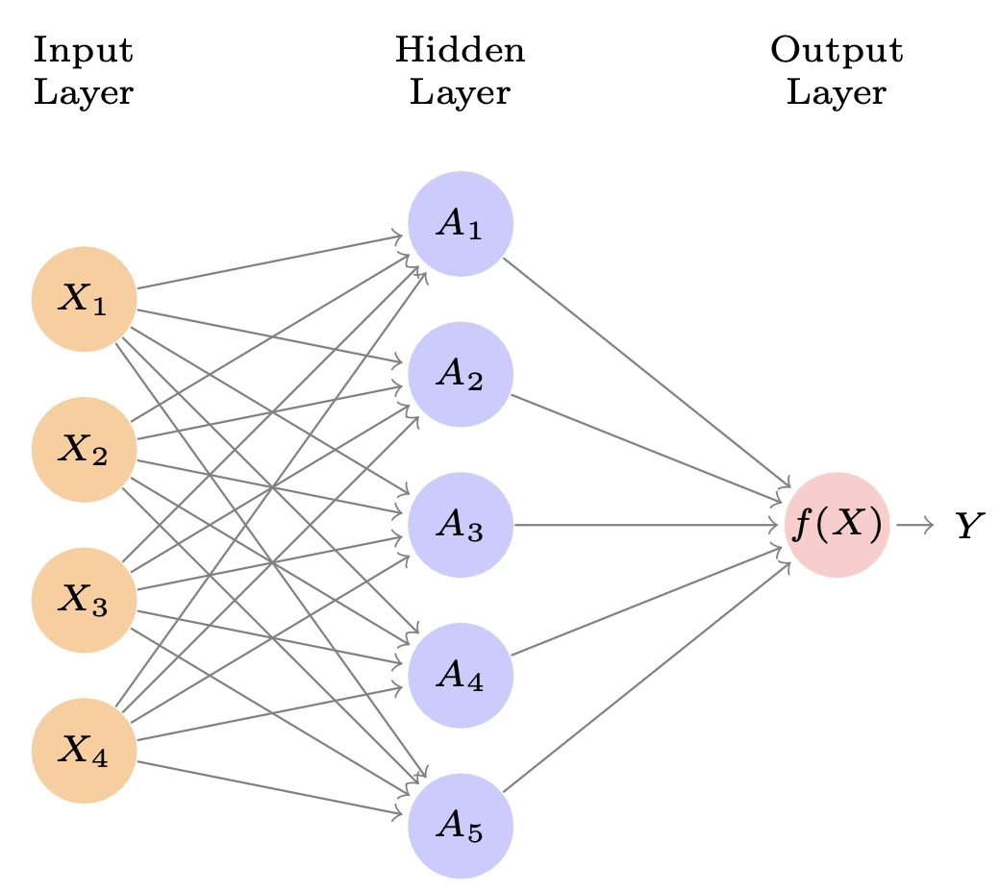
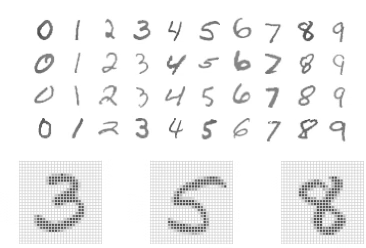
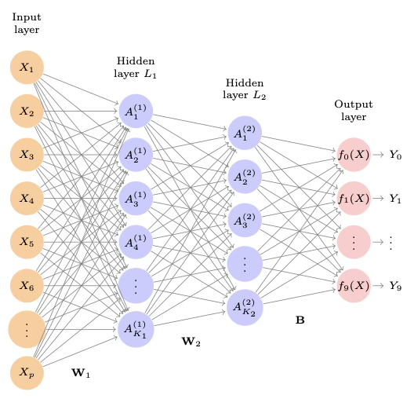
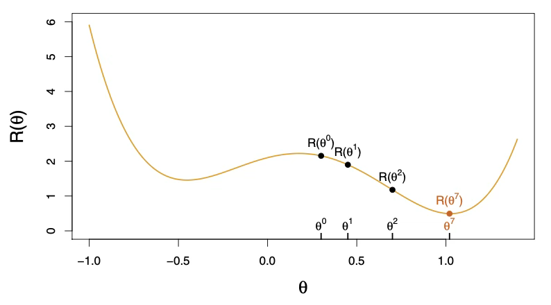
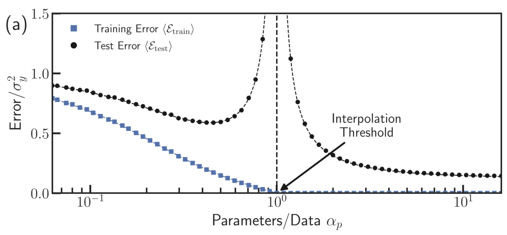
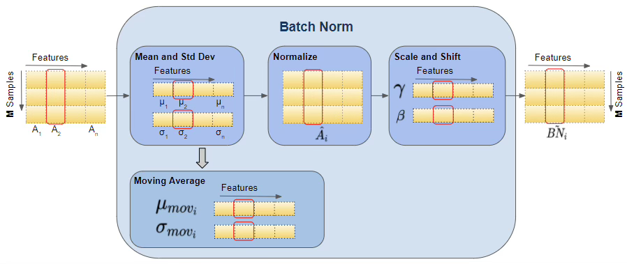

## 딥러닝 기초

### 딥러닝 모형의 기본 형태: 함수 근사 관점

딥러닝(deep learning)은 관측된 데이터 $(x_{i},y_{i})$로부터 입력 $x$를 출력 $y$로 매핑하는 미지의 관계를 하나의 함수로 근사하는 방법이다. 실제 세계의 생성 메커니즘을 $y = f^{*}(x) + \varepsilon$와 같이 생각하면, 여기서 $f^{*}$는 우리가 알지 못하는 "진짜 함수"이고 $\varepsilon$는 측정오차·잡음·설명되지 않는 변동을 나타낸다.

딥러닝의 목적은 유한한 표본만을 사용하여 $f^{*}$를 직접 추정하기 어렵기 때문에, 파라미터를 갖는 함수족 $\{ f_{\theta}\}$ 안에서 이를 잘 근사하는 $f_{\theta}$를 찾는 것이다.

::: {.callout-note}
## 딥러닝 모형의 기본 표현

딥러닝 모형은 파라미터화된 함수로 표현된다.
$$\widehat{y} = f_{\theta}(x)$$

- $x \in \mathbb{R}^{p}$: 입력(특징 벡터, 이미지·텍스트 등도 벡터로 표현)
- $\widehat{y}$: 모형의 예측값(연속값, 확률, 클래스 점수 등)
- $\theta$: 가중치(weights)와 편향(biases)을 포함하는 전체 파라미터 집합

여기서 **학습(training)**이란 $\theta$를 데이터에 맞게 조정하여 $f_{\theta}$가 관측된 $y$를 잘 맞추도록 만드는 과정이다.
:::

### 단일 은닉층 신경망

신경망은 $p$개의 변수로 이루어진 입력벡터 $X = (X_{1},X_{2},\ldots,X_{p})$를 받아, 반응변수 $Y$를 예측하기 위한 비선형 함수 $f(X)$를 구성한다. 트리, 부스팅, 일반화 가법모형 등을 이용해 비선형 예측모형을 다루고 있으나 신경망이 이러한 방법들과 구별되는 점은 모형이 갖는 특정한 구조에 있다.

다음은 $p=4$개의 예측변수를 사용하여 연속형(정량) 반응을 모델링하는 단순한 순전파(feed-forward) 신경망을 보여준다. 신경망 용어로는 네 개의 특성 $X_{1},\ldots,X_{4}$가 입력층의 유닛을 이룬다. 화살표는 입력층의 각 입력이 $K$개의 은닉 유닛 각각으로 전달됨을 의미한다($K$는 우리가 선택하며, 여기서는 5로 두었다).

{fig-align="center" width="60%"}

이 신경망 모형은 다음 형태를 갖는다.
$$f(X) = \beta_{0} + \sum_{k=1}^{K}\beta_{k}h_{k}(X) = \beta_{0} + \sum_{k=1}^{K}\beta_{k}g\!\left( w_{k0} + \sum_{j=1}^{p}w_{kj}X_{j} \right)$$

두 단계로 구성된다. 먼저 은닉층에서 $K$개의 활성값 $A_{k}(k = 1,\ldots,K)$를 입력 특성 $X_{1},\ldots,X_{p}$의 함수로 계산한다.

$$A_{k} = h_{k}(X) = g\!\left( w_{k0} + \sum_{j=1}^{p}w_{kj}X_{j} \right)$$

여기서 $g(z)$는 미리 지정하는 비선형 **활성함수**이다. 각 $A_{k}$는 원래 특성의 서로 다른 변환 $h_{k}(X)$로 볼 수 있는데, 이는 기저함수(basis function)와 유사한 관점이다. 이렇게 얻은 은닉층의 $K$개 활성값은 출력층으로 전달되어 다음을 만든다.

$$f(X) = \beta_{0} + \sum_{k=1}^{K}\beta_{k}A_{k} \tag{1}$$

즉, $K=5$개의 활성값을 설명변수로 하는 선형회귀모형이다. 모든 파라미터 $\beta_{0},\ldots,\beta_{K},w_{10},\ldots,w_{Kp}$는 데이터로부터 추정되어야 한다.

::: {.callout-tip}
## 활성함수 비교: Sigmoid vs ReLU

| 구분 | Sigmoid | ReLU |
|------|:---:|:---:|
| **수식** | $g(z) = \dfrac{1}{1+e^{-z}}$ | $g(z) = \max(0, z)$ |
| **출력 범위** | $(0,\ 1)$ | $[0,\ \infty)$ |
| **계산 효율** | 낮음 | 높음 |
| **그래디언트 소실** | 발생 가능 | 없음 |
| **사용 시기** | 초기 신경망, 확률 출력 | 현대 신경망 은닉층 |

ReLU 활성함수는 0에서 임계(threshold)를 갖지만, 선형함수에 적용되므로 상수항 $w_{k0}$가 이 꺾이는 지점(임계점)을 이동시킨다.
:::

신경망의 초기 사례에서는 시그모이드(sigmoid) 활성함수가 선호되었다.
$$g(z) = \frac{e^{z}}{1 + e^{z}} = \frac{1}{1 + e^{- z}}$$
이는 로지스틱 회귀에서 선형함수를 0과 1 사이의 확률로 변환할 때 사용하는 함수와 동일하다.

현대 신경망에서 더 선호되는 선택은 ReLU(rectified linear unit) 활성함수로, 다음과 같은 형태를 갖는다.
$$g(z) = (z)_{+} = \begin{cases} 0, & z < 0 \\ z, & \text{그 외} \end{cases}$$

말로 풀면, 위 그림 모형은 $X$의 서로 다른 5개의 선형결합을 먼저 계산한 뒤, 각각에 활성함수 $g(\cdot)$를 적용하여 "눌러(squash)" 변환함으로써 5개의 새로운 특징을 만든다. 최종 모형은 이렇게 만들어진 변수들에 대해 선형이다.

"신경망"이라는 이름은 원래 은닉 유닛을 뇌의 뉴런에 비유한 데서 나왔다. 즉 $A_{k} = h_{k}(X)$ 값이 1에 가까우면 뉴런이 발화(firing) 하는 것으로, 0에 가까우면 침묵(silent) 하는 것으로 해석하였다.

#### 활성함수의 비선형성은 왜 필수인가?

::: {.callout-important}
## 비선형성 없이는 신경망이 아니다

활성함수 $g(\cdot)$의 비선형성은 필수적이다. 이것이 없으면 모형 $f(X)$는 결국 $X_{1},\ldots,X_{p}$에 대한 단순한 선형모형으로 붕괴한다. 비선형 활성함수는 모형이 복잡한 비선형성과 **상호작용 효과**를 포착할 수 있게 한다.
:::

예를 들어 입력변수가 $p=2$개 $X = (X_{1},X_{2})$이고, 은닉 유닛이 $K=2$개 $h_{1}(X),h_{2}(X)$이며, 활성함수가 $g(z) = z^{2}$라고 하자. 다른 파라미터를 다음과 같이 두면
$$\beta_{0} = 0,\quad \beta_{1} = \frac{1}{4},\quad \beta_{2} = -\frac{1}{4},\quad w_{10} = 0,\quad w_{11} = 1,\quad w_{12} = 1,\quad w_{20} = 0,\quad w_{21} = 1,\quad w_{22} = -1$$

식 (1)로부터
$$h_{1}(X) = (0 + X_{1} + X_{2})^{2},\qquad h_{2}(X) = (0 + X_{1} - X_{2})^{2}$$
이를 대입하면
$$f(X) = \frac{1}{4}\!\left[(X_{1} + X_{2})^{2} - (X_{1} - X_{2})^{2}\right] = X_{1}X_{2}$$

즉, 선형함수에 대한 두 개의 비선형 변환을 합하면 상호작용항을 만들어낼 수 있다. 다만 실제로는 $g(z) = z^{2}$ 같은 이차함수 활성함수는 잘 쓰지 않는데, 그렇게 하면 원래 좌표 $X_{1},\ldots,X_{p}$에서 항상 2차 다항식만 얻게 되기 때문이다. 반면 시그모이드나 ReLU 활성함수는 이러한 한계를 갖지 않는다.

#### 신경망 적합(학습)과 손실함수

신경망을 적합한다는 것은 식 (1)의 미지 파라미터들을 추정하는 것을 뜻한다. 연속형 반응변수의 경우 보통 제곱오차 손실을 사용하며, 파라미터는 다음을 최소화하도록 선택된다.
$$\sum_{i=1}^{n}(y_{i} - f(x_{i}))^{2}$$

### 다층 신경망

현대의 신경망은 보통 하나 이상의 은닉층(hidden layer)을 가지며, 각 층에는 종종 많은 유닛(unit)이 존재한다. 이론적으로는 유닛 수가 매우 많은 단일 은닉층만으로도 대부분의 함수를 근사할 수 있다. 그러나 좋은 해(해결책)를 찾아내는 학습 과제는, 각 층의 크기가 적당한 여러 개의 층(multiple layers)을 사용하는 쪽이 훨씬 쉬워진다.

널리 알려져 있고 공개적으로 이용 가능한 MNIST 손글씨 숫자 데이터셋을 이용하여 큰 규모의 조밀(dense) 네트워크를 설명할 수 있다. 다음 그림은 이러한 숫자들의 예시를 보여준다.

::: {.callout-note}
## MNIST 데이터셋 개요

- **목표**: 이미지를 올바른 숫자 클래스 $0 \sim 9$로 분류
- **입력**: 각 이미지는 $p = 28 \times 28 = 784$개의 픽셀
- **픽셀 값**: 0과 255 사이의 8비트 회색조 값
- **출력 표현**: 원-핫 인코딩(one-hot encoding) $Y = (Y_{0},Y_{1},\ldots,Y_{9})$
- **데이터 규모**: 학습 60,000장, 테스트 10,000장
:::

{fig-align="center" width="40%"}

역사적으로 보면, 숫자 인식 문제는 1980년대 후반 AT&T 벨 연구소 등에서 신경망 기술 발전을 가속시킨 촉매였다. 이와 같은 패턴 인식 과제는 인간에게는 비교적 단순하다. 우리의 시각 시스템은 뇌의 큰 부분을 차지하며, 좋은 인식 능력은 생존을 위한 진화적 동력이기도 하다. 그러나 이런 과제는 기계에게는 그리 단순하지 않으며, 인간 수준의 성능에 도달하도록 신경망 구조를 정교화하는 데 30년이 넘는 시간이 걸렸다.

다음 그림은 숫자 분류 과제를 잘 해결하는 다층 신경망 구조를 보여준다. 이는 단일 은닉층 신경망과 다음과 같은 점에서 다르다.

- 은닉층이 하나가 아니라 두 개이다. $L_{1}$ (256개 유닛)과 $L_{2}$ (128개 유닛)을 갖는다.
- 출력변수가 하나가 아니라 10개이다. 여기서 10개의 변수는 사실상 하나의 범주형 변수를 표현하므로 서로 강하게 의존적이다.
- 네트워크를 학습시키는 데 사용하는 손실함수가 다중 클래스 분류 과제에 맞게 설계된다.

{fig-align="center" width="80%"}

첫 번째 은닉층은 식 (1)과 동일하게 다음과 같이 정의된다.

$$A_{k}^{(1)} = h_{k}^{(1)}(X) = g\!\left( w_{k0}^{(1)} + \sum_{j=1}^{p}w_{kj}^{(1)}X_{j} \right),\quad k = 1,\ldots,K_{1}$$

두 번째 은닉층은 첫 번째 은닉층의 활성값 $A_{k}^{(1)}$을 입력으로 받아 새로운 활성값을 계산한다.

$$A_{\ell}^{(2)} = h_{\ell}^{(2)}(X) = g\!\left( w_{\ell 0}^{(2)} + \sum_{k=1}^{K_{1}}w_{\ell k}^{(2)}A_{k}^{(1)} \right),\quad \ell = 1,\ldots,K_{2}$$

두 번째 층의 각 활성값 $A_{\ell}^{(2)} = h_{\ell}^{(2)}(X)$ 역시 입력벡터 $X$의 함수임에 주목하자. 이는 겉으로는 1층 활성값 $A_{k}^{(1)}$의 함수이지만, $A_{k}^{(1)}$ 자체가 다시 $X$의 함수이기 때문이다.

은닉층이 더 많아도 마찬가지다. 이러한 변환의 사슬을 통해 네트워크는 $X$의 꽤 복잡한 변환을 구축하고, 그 결과가 출력층으로 "특징(feature)"처럼 입력된다.

$W_{1}$은 입력층에서 첫 번째 은닉층 $L_{1}$으로 연결되는 전체 가중치 행렬을 뜻한다. 이 행렬은 $785 \times 256 = 200,960$개의 원소를 갖는데, 절편(또는 바이어스) 항을 포함해야 하므로 784가 아니라 785가 된다.

#### 출력층과 소프트맥스

첫 번째 은닉층의 각 원소 $A_{k}^{(1)}$는 $W_{2}$ 가중치 행렬을 통해 두 번째 은닉층 $L_{2}$로 전달되며, $W_{2}$의 차원은 $257 \times 128 = 32,896$이다.

출력층에서는 하나가 아니라 10개의 반응을 갖는다. 첫 단계는 단일 모델 (1)과 유사하게 10개의 선형모형을 계산하는 것이다.

$$Z_{m} = \beta_{m0} + \sum_{\ell=1}^{K_{2}}\beta_{m\ell}A_{\ell}^{(2)},\quad m = 0,1,\ldots,9$$

행렬 $B$는 이러한 가중치 $129 \times 10 = 1,290$개를 저장한다.

::: {.callout-caution}
## bias-variance의 "bias"와 신경망의 "bias"를 혼동하지 말 것

머신러닝에서는 절편 $w_{k0}$ 같은 항을 **bias**, 계수들을 **weights**라고 부르는 것이 흔하다. 이는 다른 곳에서 말하는 **"bias-variance"의 bias**와 전혀 다른 개념이다.
:::

만약 이 10개가 서로 독립적인 정량 반응변수라면, 단순히 $f_{m}(X) = Z_{m}$으로 두면 된다. 그러나 여기서는 다중 클래스 확률 $f_{m}(X) = \Pr(Y = m \mid X)$을 추정하고 싶다. 그래서 특수한 **softmax** 활성함수를 사용한다.

$$f_{m}(X) = \Pr(Y = m \mid X) = \frac{e^{Z_{m}}}{\sum_{\ell=0}^{9}e^{Z_{\ell}}},\quad m = 0,1,\ldots,9$$

이는 10개의 값이 확률처럼(음이 아니고 합이 1) 동작하도록 보장한다. 분류기는 가장 큰 확률을 갖는 클래스로 이미지를 할당한다.

이 네트워크를 학습시키기 위해(반응이 범주형이므로) 음의 다항 로그우도(negative multinomial log-likelihood)를 최소화한다.

$$- \sum_{i=1}^{n}\sum_{m=0}^{9}y_{im}\log(f_{m}(x_{i}))$$

이는 **교차엔트로피(cross-entropy)**라고도 불리며, 이진 로지스틱 회귀의 기준식을 일반화한 것이다.

### 딥러닝을 언제 사용할 것인가?

딥러닝은 숫자 분류 문제를 훌륭하게 해결했고, 심층 CNN은 이미지 분류를 사실상 혁신적으로 바꾸어 놓았다. 딥러닝의 새로운 성공 사례는 매일 접할 수 있다.

그중 많은 사례는 이미지 분류 과제와 관련되어 있는데, 예를 들어 유방촬영이나 디지털 X-ray 영상에서의 기계 진단, 안과 검사 이미지, MRI 스캔의 주석 작업 등이 그러하다. 마찬가지로 RNN은 음성 및 언어 번역, 예측, 문서 모델링에서 수많은 성공 사례를 보였다.

그렇다면 자연스럽게 이런 질문이 나온다. "우리의 기존 도구들을 모두 버리고, 데이터가 있는 모든 문제에 딥러닝을 써야 하는가?" 이 질문에 답하기 위해, Hitters 데이터셋을 활용해 보자. 회귀 문제이며, 목표는 1986년의 성적 통계를 사용해 1987년 야구 선수의 연봉을 예측하는 것이다.

우리는 데이터를 무작위로 학습용 176명(약 2/3)과 테스트용 87명(약 1/3)으로 분할하여 세 가지 방법으로 회귀모형을 적합하였다.

- **선형모형(Linear model)**: 학습 데이터에 적합하고 테스트 데이터에 대한 예측을 수행했다. 이 모형은 파라미터 20개를 갖는다.
- **라쏘 정규화(Lasso)**: 동일한 선형모형에 라쏘 정규화를 적용해 적합했다. 10-겹 교차검증으로 튜닝 파라미터를 선택한 결과 계수가 0이 아닌 변수 12개를 포함하는 모형이 선택되었다.
- **신경망**: 은닉층 1개, 그 안에 ReLU 유닛 64개로 이루어진 신경망을 적합했다. 이 모형은 파라미터가 1,409개이다.

세 모형의 성능은 비슷하게 나타난다. 더 많은 시간을 들여 정규화를 조정하면 신경망이 선형회귀나 라쏘와 비슷하거나 더 좋은 성능을 얻을 수도 있다.

::: {.callout-warning}
## 딥러닝이 항상 최선은 아니다: 오컴의 면도날

더 단순한 도구로도 같은 수준의 성능을 낼 수 있다면, 단순한 도구는 보통 적합도 더 쉽고 해석도 더 쉽고, 복잡한 접근법보다 잠재적으로 덜 취약하다.

**오컴의 면도날(Occam's razor)**: 여러 방법이 대략 비슷한 성능을 낸다면 가장 단순한 것을 택하라.

라쏘 모형을 더 탐색한 뒤, 4개의 변수만 쓰는 더 단순한 모형(소위 relaxed lasso)에서 테스트 평균절대오차 224.8을 달성하여 전체에서 가장 좋은 결과를 얻었다.

일반적으로 딥러닝이 매력적인 선택지가 되는 경우:

- 학습 데이터의 **표본 크기가 극도로 크고**
- **모형의 해석가능성**이 높은 우선순위가 아닐 때
:::

### 신경망 적합

신경망을 적합하는 일은 다소 복잡하며, 여기서는 간단한 개요를 제시한다. 다행히도 실습에서 보듯이 신경망 모형을 비교적 자동화된 방식으로 적합해주는 좋은 소프트웨어가 존재하므로, 모형 적합 절차의 기술적 세부사항을 크게 걱정하지 않아도 된다.

$$f(X) = \beta_{0} + \sum_{k=1}^{K}\beta_{k}g\!\left( w_{k0} + \sum_{j=1}^{p}w_{kj}X_{j} \right)$$

파라미터는 $\beta = (\beta_{0},\beta_{1},\ldots,\beta_{K})$와 더불어 각 $w_{k} = (w_{k0},w_{k1},\ldots,w_{kp}),\ k = 1,\ldots,K$로 구성된다. 관측치 $(x_{i},y_{i}),\ i = 1,\ldots,n$가 주어졌다고 하자. 그러면 우리는 다음의 비선형 최소제곱 문제를 풀어 모형을 적합할 수 있다.

$$\min_{\{w_{k}\}_{1}^{K},\beta}\;\frac{1}{2}\sum_{i=1}^{n}(y_{i} - f(x_{i}))^{2}$$

목적함수는 겉보기엔 단순하지만, 파라미터들이 중첩되어 나타나고 은닉 유닛들의 대칭성도 존재하기 때문에 최소화가 쉽지 않다. 이 문제는 파라미터에 대해 **비볼록(nonconvex)**이며, 따라서 해가 여러 개 존재할 수 있다.

해가 여러 개 존재하는 문제들 일부를 완화하고 과적합(overfitting)을 방지하기 위해, 신경망 적합 시 일반적으로 다음 두 전략을 사용한다.

- **느린 학습(Slow Learning)**: 경사하강법(gradient descent)을 사용해 다소 느린 반복적 방식으로 모형을 적합한다. 과적합이 감지되면 적합 과정을 중단한다.
- **정규화(Regularization)**: 라쏘나 릿지처럼, 파라미터에 벌점(penalty)을 부과한다.

모든 파라미터를 하나의 긴 벡터 $\theta$로 나타낸다고 하자. 그러면 목적함수를 다음처럼 쓸 수 있다.
$$R(\theta) = \frac{1}{2}\sum_{i=1}^{n}(y_{i} - f_{\theta}(x_{i}))^{2}$$

#### 경사하강법 절차

::: {.callout-note collapse="true"}
## 경사하강법 단계 요약

1. $\theta$의 모든 파라미터에 대해 초기값 $\theta^{0}$를 정하고, $t=0$으로 둔다.

2. 목적함수가 더 이상 감소하지 않을 때까지 반복한다.
   - (a) $\theta$의 작은 변화 $\delta$를 찾아 $\theta^{t+1} = \theta^{t} + \delta$가 목적함수를 감소시키게 한다. 즉 $R(\theta^{t+1}) < R(\theta^{t})$가 되게 한다.
   - (b) $t \leftarrow t + 1$

그림처럼 산악 지형에 서 있다고 상상할 수 있고, 목표는 여러 번의 발걸음을 통해 바닥으로 내려가는 것이다. 각 발걸음이 내려가기만 하면 결국 바닥에 도달한다. 일반적으로는 좋은 국소 최소에 도달하기를 기대한다.
:::

{fig-align="center" width="80%"}

#### 역전파(Backpropagation)

목적함수를 감소시키는 방향을 어떻게 찾을까? 현재 값 $\theta = \theta^{m}$에서의 $R(\theta)$의 기울기는 그 지점에서의 편미분으로 이루어진 벡터다.

$$\nabla R(\theta^{m}) = \left.\frac{\partial R(\theta)}{\partial\theta}\right|_{\theta = \theta^{m}}$$

이는 $\theta$-공간에서 $R(\theta)$가 가장 빠르게 증가하는 방향을 준다. 경사하강법은 "내리막"으로 가고 싶으므로 그 반대 방향으로 조금 이동한다.

$$\theta^{m+1} \leftarrow \theta^{m} - \rho\nabla R(\theta^{m})$$

학습률(learning rate) $\rho$가 충분히 작다면 이 단계는 목적함수 $R(\theta)$를 감소시킨다. 즉 $R(\theta^{m+1}) < R(\theta^{m})$. 만약 기울기 벡터가 0이라면 목적함수의 최소점에 도달했을 수 있다.

$R(\theta) = \sum_{i=1}^{n}R_{i}(\theta)$는 합 형태이므로, 그 기울기도 $n$개의 관측치에 대한 합이다. 한 항만 살펴보면

$$R_{i}(\theta) = \frac{1}{2}\!\left( y_{i} - \beta_{0} - \sum_{k=1}^{K}\beta_{k}g\!\left( w_{k0} + \sum_{j=1}^{p}w_{kj}x_{ij} \right) \right)^{2}$$

표현을 단순화하기 위해 $z_{ik} = w_{k0} + \sum_{j=1}^{p}w_{kj}x_{ij}$라고 쓰면,

먼저 $\beta_{k}$에 대해 미분하면
$$\frac{\partial R_{i}(\theta)}{\partial\beta_{k}} = -(y_{i} - f_{\theta}(x_{i})) \cdot g(z_{ik}) \tag{*}$$

이제 $w_{kj}$에 대해 미분하면
$$\frac{\partial R_{i}(\theta)}{\partial w_{kj}} = -(y_{i} - f_{\theta}(x_{i})) \cdot \beta_{k} \cdot g'(z_{ik}) \cdot x_{ij} \tag{**}$$

::: {.callout-important}
## 역전파의 핵심 구조

두 식 모두 잔차 $y_{i} - f_{\theta}(x_{i})$를 포함한다.

- 식 $(*)$에서는 잔차의 일부가 $g(z_{ik})$ 값에 따라 각 은닉 유닛으로 "배분"되는 것으로 볼 수 있다.
- 식 $(**)$에서는 은닉 유닛 $k$를 매개로 입력 $j$로 기여가 배분되는 모습을 볼 수 있다.

즉, 미분은 연쇄법칙을 통해 잔차의 일부를 각 파라미터에 할당하는데, 이 과정을 **역전파(backpropagation)**라고 부른다.
:::

#### 정규화와 확률적 경사하강법(SGD)

신경망 학습은 보통 손실함수(목적함수) $R(\theta)$를 최소화하는 문제로 정리된다. 예를 들어 회귀에서는
$$R(\theta) = \frac{1}{2}\sum_{i=1}^{n}(y_{i} - f_{\theta}(x_{i}))^{2}$$
분류(softmax)에서는 교차엔트로피 형태의
$$R(\theta) = -\sum_{i=1}^{n}\sum_{m=0}^{9}y_{im}\log f_{m}(x_{i})$$
를 최소화한다.

경사하강법(gradient descent)은 다음 갱신으로 진행된다.
$$\theta^{(t+1)} = \theta^{(t)} - \rho\nabla R(\theta^{(t)})$$

문제는 $n$이 클 때 $\nabla R(\theta) = \sum_{i=1}^{n}\nabla R_{i}(\theta)$ 계산이 매 단계마다 모든 관측치에 대한 합을 요구한다는 점이다. 한 번의 업데이트가 매우 비싸고, 수천~수만 번 반복해야 하는 신경망 학습에서는 계산 부담이 커진다.

이 계산을 줄이기 위해, 매 반복마다 전체 데이터 대신 일부 표본만 뽑아(샘플링) 기울기를 근사한다. 이를 **확률적 경사하강법(Stochastic Gradient Descent, SGD)**이라 한다.

미니배치 $B_{t} \subset \{1,\ldots,n\},\ |B_{t}| = b$를 뽑고, 전체 기울기 대신 미니배치 기울기를 사용한다.
$$\nabla R(\theta) \approx \frac{n}{b}\sum_{i \in B_{t}}\nabla R_{i}(\theta)$$

::: {.callout-tip}
## SGD의 핵심 장점

| 장점 | 설명 |
|------|------|
| **계산 속도** | 한 번의 업데이트가 빠르다 (계산량 $\propto b$) |
| **탈출 능력** | 잡음이 섞인 기울기 덕분에 국소 최소/평탄 영역에서 벗어나는 데 도움을 줄 수 있다 |
| **실용성** | 대규모 데이터에서 사실상 표준 학습 방법이다 |
:::

#### 정규화(Regularization)

신경망은 파라미터 수가 매우 많아(예: MNIST 예시에서 20만~수십만 개) 훈련 데이터에 과도하게 맞추기 쉽다. 따라서 목적함수에 벌점항을 추가하거나, 학습 절차 자체에 제약을 걸어 일반화 성능을 확보한다.

::: {.callout-tip icon=false}
## 정규화 방법 비교

| 방법 | 수식 | 핵심 효과 |
|------|------|------|
| **릿지 (가중치 감쇠)** | $R(\theta;\lambda) = R(\theta) + \lambda\sum_{j}\theta_{j}^{2}$ | 파라미터 노름 축소, 매끄러운 함수 |
| **라쏘** | $R(\theta;\lambda) = R(\theta) + \lambda\sum_{j}|\theta_{j}|$ | 희소 해, 변수 선택 |
| **조기 종료 (Early stopping)** | 검증 오차 상승 시 학습 중단 | L2 정규화와 유사한 효과 |
| **드롭아웃** | 유닛을 확률적으로 제거 | 앙상블 효과, 불확실성 주입 |

$\lambda$가 클수록 파라미터가 작아지며(노름 축소), 해가 매끄러워져 과적합이 줄어든다. 실무에서는 층별로 $\lambda$를 다르게 주기도 한다.
:::

#### 드롭아웃 학습(Dropout Learning)

드롭아웃은 비교적 새롭고 효율적인 정규화 방법으로, 랜덤포레스트의 "랜덤화" 아이디어와 유사한 측면이 있다. 학습 시 각 층의 유닛 중 일부를 무작위로 제거(drop)하여, 특정 유닛들끼리만 맞물려 과도하게 특화(over-specialize)되는 것을 방지한다.

학습 시 각 유닛(또는 활성값)에 대해 마스크 $m$을 곱한다.
$$m \sim \text{Bernoulli}(1 - \phi)$$
여기서 $\phi$는 드롭아웃 비율(dropout rate, 제거될 확률)이고 $1 - \phi$는 유지 확률(keep probability)이다.

활성값 $a$에 대해 $\tilde{a} = \frac{m}{1 - \phi} \cdot a$로 두면, 기대값이 유지된다. $\mathbb{E}[\tilde{a}] = a$

즉, 학습 중에는 일부 유닛을 0으로 만들되, 남은 유닛을 $\frac{1}{1-\phi}$만큼 스케일업하여 평균 규모를 맞춘다. 테스트 시에는 드롭아웃을 적용하지 않고 그대로 사용한다(학습 때 이미 스케일을 반영했기 때문).

#### 네트워크 튜닝(Network Tuning)

네트워크 튜닝은 신경망을 "어떤 구조로 만들고", "어떤 제약(정규화) 아래에서", "어떤 방식으로 학습(최적화)할 것인지"를 함께 결정하는 과정이다.

::: {.callout-note}
## 튜닝의 세 축

**구조(Architecture)**

- **깊이(depth)**: 층을 거치며 특징이 단계적으로 변환되는 정도를 좌우하며, 복잡한 계층적 패턴 포착에 유리하다.
- **폭(width)**: 각 층에서 동시에 표현할 수 있는 특징의 "용량(capacity)"을 크게 만든다.

**정규화 하이퍼파라미터**

- 드롭아웃 비율 $\phi$: 특정 유닛들 사이의 공적응(co-adaptation)을 억제한다.
- 릿지(가중치 감쇠) 강도 $\lambda$: 파라미터 노름을 줄이는 방향으로 학습을 유도한다.

**최적화**

구조 설계는 단독으로 결정되기보다, 정규화와 최적화 설정과 함께 조합으로 판단하는 것이 현실적이다. 튜닝의 본질은 **표현력(복잡도)을 충분히 확보하면서도 일반화 성능을 최대화하는 균형 문제**이다.
:::

### 보간(Interpolation)과 이중 하강(Double Descent)

#### 설정: 학습·테스트 오차와 보간의 의미

데이터 $\{(x_{i},y_{i})\}_{i=1}^{n}$가 있고, 어떤 함수족(모형) $\mathcal{F}_{d}$를 복잡도(예: 자유도) $d$로 매개변수화한다고 하자. 적합된 예측함수를 $\hat{f}_{d}$라 하면,

$$\text{훈련 오차}:\quad \text{Err}_{train}(d) = \frac{1}{n}\sum_{i=1}^{n}(y_{i} - \hat{f}_{d}(x_{i}))^{2}$$

$$\text{테스트 오차}:\quad \text{Err}_{test}(d) = \mathbb{E}_{(X,Y) \sim P}\!\left[(Y - \hat{f}_{d}(X))^{2}\right]$$

**보간(interpolation)**이란 $\hat{f}_{d}(x_{i}) = y_{i}\ (i = 1,\ldots,n)$, 즉 $\text{Err}_{train}(d) = 0$이 되는 상태를 말한다.

#### 편향-분산 절충의 "전형적" 그림

모형의 유연성이 증가하면 보통 훈련오차는 감소한다.
$$\text{Err}_{train}(d) \downarrow \text{ as } d \uparrow$$

반면, 테스트 오차는 대체로 U자 형태를 보인다.
$$\text{Err}_{test}(d) \approx \text{U-shape}$$

이 관점에서 "훈련 오차 0(보간)"을 무리하게 달성하면 분산이 커져 테스트 오차가 증가하기 쉽다.

#### 자연 스플라인 예: 보간 임계점 $d=n$

자연 스플라인을 $d$개의 기저함수로 표현하면 $f_{d}(x) = \sum_{j=1}^{d}\beta_{j}b_{j}(x)$이고, 설계행렬 $B \in \mathbb{R}^{n \times d}$를 $B_{ij} = b_{j}(x_{i})$로 두면, 최소제곱은
$$\hat{\beta} = \arg\min_{\beta \in \mathbb{R}^{d}} \|y - B\beta\|_{2}^{2}$$

- $d < n$: 보통 $\text{rank}(B) = d$이면 해가 유일하며, 일반적으로 $\text{Err}_{train}(d) > 0$.
- $d = n$: 일반 위치에서 $B$가 가역이면 $B\hat{\beta} = y \Rightarrow \text{Err}_{train}(d) = 0$. 즉, 보간이 "딱 가능해지는" 임계점. 이를 **보간 임계점(interpolation threshold)**이라 부르며, 이 예에서 $d=n$이 바로 그 지점이다.
- $d > n$: 미지수 $d$가 방정식 $n$개보다 많아 해가 비유일. 보간해가 무한히 많다.

#### 과매개변수화 영역 $d>n$과 최소-노름 해

$d>n$이고 $B$가 행랭크 $\text{rank}(B) = n$이면, 보간 조건은 $B\beta = y$를 만족하는 해들로 이루어진 아핀 공간(무한히 많음)이다. 이때 대표적으로 선택되는 해가 **최소-노름 해**이다.

$$\hat{\beta}_{\min} = \arg\min_{\beta \in \mathbb{R}^{d}} \|\beta\|_{2}\quad \text{s.t.}\quad B\beta = y$$

이는 "훈련 데이터를 맞추는 해들 중에서 계수의 $\ell_{2}$ 노름이 가장 작은 해"로, 많은 경우 더 매끄러운(smooth) 적합을 유도하여 분산을 줄인다. 무어-펜로즈 의사역행렬(pseudoinverse)로 $\hat{\beta}_{\min} = B^{\top}(BB^{\top})^{-1}y$로 쓸 수 있다.

::: {.callout-important}
## 이중 하강 현상의 세 단계

$d$를 증가시키며 $\hat{f}_{d}$를 적합할 때 관찰되는 전형적 패턴:

1. **$d < n$**: 기존의 편향-분산 절충처럼 $\text{Err}_{test}(d)$가 감소했다가 U자형 증가
2. **$d \approx n$ (보간 임계점)**: 해가 "하나로 결정되는" 경계에서 적합이 불안정해져 테스트 오차가 크게 튐
3. **$d > n$**: 보간해가 무한히 많아지며, 알고리즘이 최소-노름/매끄러운 해를 선택할 경우 $\text{Err}_{test}(d)$가 다시 감소하는 구간이 나타남 (**두 번째 하강**)

훈련오차는 $d \geq n$에서 0으로 고정될 수 있지만, 테스트 오차는 $d=n$ 근처에서 크게 악화되었다가 $d>n$에서 다시 좋아질 수 있다.
:::

#### 편향-분산 절충과 "훈련오차 0"의 일반적 위험

편향-분산 절충은 모형 복잡도가 증가할 때 일반화 성능이 어떻게 변하는지를 설명하는 기본 원리이다. 보통 모형이 단순하면 편향이 커서 언더피팅이 발생하고, 반대로 모형이 너무 복잡하면 분산이 커져 오버피팅이 발생한다.

따라서 테스트 오차는 대체로 중간 복잡도에서 최소가 되는 경향이 있다. 이 관점에서 많은 상황에서 훈련 데이터를 완벽히 맞추어(훈련 오차 0) 즉 "보간(interpolation)"을 달성하는 것은 테스트 오차를 크게 악화시킬 수 있으므로 일반적으로 바람직하지 않다.

#### 그런데 왜 "보간"이 때때로 잘 작동하는가? --- 이중 하강

흥미롭게도 특정한 설정에서는 훈련 데이터를 보간하는 방법이 오히려 잘 작동할 수 있고, 때로는 보간하지 않는 약간 덜 복잡한 모형보다 더 낮은 테스트 오차를 보이기도 한다. 이 현상이 바로 **이중 하강(double descent)**이다.

이중 하강의 핵심 형태는 다음과 같다.

1. **보간 임계점 이전**: 기존의 편향-분산 관점처럼 테스트 오차가 U자 형태를 보인다.
2. **보간 임계점 근처**: 훈련 오차가 0에 도달하는 지점에서 테스트 오차가 급격히 커질 수 있다(불안정/요동).
3. **보간 임계점 이후(과매개변수화 영역)**: 모형이 더 복잡해져도 테스트 오차가 다시 감소하는 구간이 나타날 수 있다. 이것이 "두 번째 하강"이며, 이 때문에 double descent라는 이름이 붙었다.

#### 이중 하강은 편향-분산 절충과 모순인가?

이중 하강은 편향-분산 절충을 "부정"하는 현상이 아니다. 오히려 많은 경우, 우리가 $x$축으로 사용하는 복잡도 지표(예: 스플라인의 자유도/기저함수 수, 파라미터 수)가 실제 "유연성"을 완전히 대변하지 못하기 때문에 이런 모양이 나타난다.

특히 보간 임계점 이후에는 해가 비유일해지고, 학습 알고리즘은 그중 특정한 해를 선택한다. 예를 들어 선형 최소제곱의 과매개변수화 영역에서는 최소-노름 해(minimum-norm solution) 같은 "매끄러운(smooth)" 해가 선택될 수 있으며, 이런 선택 규칙이 결과적으로 분산을 줄여 테스트 성능을 개선하는 역할을 하기도 한다.

::: {.callout-note}
## 왜 대부분의 전통적 방법에서는 잘 안 보이나?

**정규화를 쓰면** 보통 훈련 데이터를 완전히 보간하지 않으며, 따라서 보간 임계점 주변의 "폭발 구간" 자체가 약해지거나 사라진다. 이는 정규화의 단점이 아니라, 데이터를 보간하지 않고도 일반화 성능을 확보하는 **안정적인 전략**이기 때문이다.

**SVM/최대마진과의 연결**: 최대 마진 분류기 및 훈련 오차가 0인 SVM이 종종 매우 좋은 테스트 성능을 보이는 것은, 이들이 단순히 "훈련을 다 맞추는 것"이 아니라 그중에서도 마진을 최대화하는 해(매끄러운 해, 최소-노름 해와 유사한 성질)를 선택하기 때문이다.
:::

#### 딥러닝과의 연결: 과매개변수화, SGD의 암묵적 편향

머신러닝 커뮤니티에서는 이중 하강을, 과매개변수화(over-parameterized)된 신경망이 훈련 오차를 0까지 낮추면서도 실무에서 좋은 성능을 내는 현상을 설명하는 하나의 관점으로 활용해 왔다. 다만 다음 점이 중요하다.

- 훈련 오차를 0으로 만드는 것이 항상 최적은 아니다.
- 보간이 유리할지 여부는 **신호-대-잡음비(SNR)**에 크게 좌우된다.
- 실제 딥러닝에서는 정규화(가중치 감쇠/드롭아웃), 조기 종료(early stopping) 등이 보간을 억제하거나 완화하여 더 안정적인 일반화를 유도한다.

---

## 신경망은 왜 overfit이 잘 되는가

::: {.callout-warning}
## 이 장의 핵심 주장

신경망이 과적합되기 쉬운 이유는 단순히 "데이터가 적어서" 또는 "모델이 복잡해서"가 아니다.

- 신경망은 **구조적으로** 과적합되기 쉬운 모델이다.
- 이는 파라미터 수, 자유도, 고차원 통계 환경의 **결합된 결과**이다.
- 딥러닝의 일반화는 명시적 정규화보다 **암묵적 정규화**에 크게 의존한다.
- 과적합은 적합의 문제가 아니라 **함수 선택의 문제**이다.
:::

딥러닝 모델은 놀라울 정도로 높은 표현력을 가지며, 동시에 매우 쉽게 과적합된다. 실제로 신경망은 데이터가 충분해 보이는 상황에서도 과적합과 일반화 실패를 반복적으로 보여준다.

이 장에서는 신경망이 구조적으로 과적합되기 쉬운 이유를 파라미터 수와 자유도, 고차원 통계 환경, 그리고 암묵적 정규화라는 관점에서 통계적으로 해석한다.

### 파라미터 수와 자유도

#### 신경망의 파라미터 규모

완전연결 신경망에서 파라미터 수는 층 수와 노드 수에 따라 급격히 증가한다. 입력 차원이 $p$, 은닉층 노드 수가 $h$, 출력 차원이 1인 단일 은닉층 신경망의 경우, 파라미터 수는 대략 $(p+1)h + (h+1)$로 주어진다.

실제 딥러닝 모델에서는 이 값이 표본 크기 $n$보다 훨씬 커지는 경우가 일반적이며, 이는 **과잉 매개변수화(overparameterization)**의 전형적인 특징이다.

#### 자유도의 통계적 의미

통계학에서 자유도는 데이터에 얼마나 독립적으로 적응할 수 있는지를 나타낸다. 선형회귀에서는 자유도가 파라미터 수와 거의 일치한다. 그러나 신경망에서는 파라미터 수와 유효 자유도가 일치하지 않는다. 활성화 함수, 네트워크 구조, 가중치 공유, 학습 알고리즘 등이 자유도를 왜곡한다.

그럼에도 불구하고 신경망은 극도로 높은 표현 자유도를 갖는다. 이는 신경망이 매우 다양한 함수들을 실현할 수 있음을 의미한다.

#### 왜 훈련오차는 쉽게 0이 되는가

신경망은 임의의 레이블 할당에도 완벽히 적합할 수 있으며, 노이즈를 포함한 데이터까지 그대로 기억할 수 있다. 이는 신경망이 단순히 좋은 함수 근사기이기 때문이 아니라, 과잉 매개변수화된 구조를 갖기 때문이다. 즉, 훈련오차가 0이 되는 현상 자체는 딥러닝에서 특별한 일이 아니다.

### 고차원 통계 관점의 딥러닝

#### 고차원 영역의 통계적 특성

딥러닝은 전형적으로 표본 수 $n$보다 파라미터 수 $p$가 훨씬 큰 영역에서 작동한다.

$$p \gg n$$

이 영역에서는 고전적 통계 직관이 붕괴한다. 추정량의 일관성은 보장되지 않으며, 분산은 매우 커지고, 훈련 성능과 일반화 성능 사이의 괴리는 커진다. 즉, 딥러닝은 고차원 통계의 극단적인 영역에서 작동하는 학습 체계이다.

#### 보간(interpolation) 영역과 double descent

최근 이론은 모델 복잡도가 증가함에 따라 테스트오차가 감소했다가 증가한 뒤, 다시 감소하는 현상을 설명한다. 이를 double descent 현상이라 한다. 딥러닝 모델은 종종 훈련오차가 거의 0이 되는 보간 영역에서 학습된다.

이는 전통적 통계에서 기대했던 "과적합 이후 성능 악화"라는 단순한 직관과 충돌한다. 즉, 훈련오차가 0이라는 사실만으로 일반화 실패를 단정할 수 없다.

{fig-align="center" width="100%"}

#### 고차원에서의 직관적 설명

고차원 공간에서는 동일한 훈련 데이터에 완벽히 적합하는 함수가 매우 많다. 그러나 이들 함수의 일반화 성능은 크게 다를 수 있다. 신경망 학습은 이 중 하나의 함수를 선택하는 과정이며, 과적합은 적합 실패가 아니라 잘못된 함수 선택의 결과로 이해해야 한다.

### 암묵적 정규화 (Implicit Regularization)

#### 명시적 정규화 없이도 일반화가 되는 이유

실제 딥러닝에서는 L1이나 L2 정규화를 강하게 사용하지 않아도 테스트 성능이 상당히 우수한 경우가 많다. 이는 학습 과정 자체가 암묵적인 정규화 역할을 수행하기 때문이다.

#### 암묵적 정규화의 원천

::: {.callout-note}
## 딥러닝의 암묵적 정규화 원천

신경망 학습 과정에는 여러 암묵적 제약이 존재한다.

- **SGD**: 특정한 해, 특히 노름이 작은 해를 선호하는 경향이 있다.
- **초기화 방식**: 함수 공간에서의 출발점을 제한한다.
- **조기 종료**: L2 정규화와 유사한 효과를 낸다.
- **배치 크기**: 학습 과정의 잡음을 조절함으로써 탐색 가능한 해의 영역을 제한한다.

이러한 요소들은 모두 가능한 해 중에서 상대적으로 **덜 복잡한 해**를 선택하도록 유도한다.
:::

#### 통계적 해석

암묵적 정규화는 명시적인 prior를 두지 않더라도, 학습 알고리즘 자체가 prior의 역할을 수행한다는 의미로 해석할 수 있다. 즉, 딥러닝에서의 학습은 손실함수와 최적화 알고리즘의 결합으로 정의되며, 정규화는 이 중 최적화 과정에 숨어 있다.

### 과적합의 정리

신경망이 과적합되기 쉬운 이유는 다음 요인들이 동시에 작동하기 때문이다.

1. **과잉 매개변수화**: 매우 큰 자유도를 가진다.
2. **고차원 통계 영역**: 고전적 일반화 직관이 성립하지 않는다.
3. **명시적 제약 부재**: 데이터가 조금만 부족해도 즉시 과적합이 발생한다.
4. **암묵적 정규화의 가변성**: 설정과 학습 조건에 따라 일반화 성능이 크게 달라질 수 있다.

::: {.callout-important}
## 핵심 관점 전환

과적합은 "훈련오차가 작다"는 현상이 아니라, **어떤 함수를 선택했는가**에 대한 문제이다.

딥러닝의 일반화는 적합 자체보다, 방대한 함수 공간 중 어떤 해를 선택하도록 유도했는가에 의해 결정된다.
:::

---

## Cross-Entropy와 MLE의 연결

::: {.callout-important}
## 이 장의 핵심 명제

- 딥러닝 분류 손실은 Cross-Entropy이며, 이는 **로그우도의 음수**이다.
- Cross-Entropy 최소화는 확률모형의 **최대우도추정(MLE)과 동치**이다.
- 신경망의 출력은 분류 결과가 아니라 **확률 예측**이다.
- 분류 결정, 성능지표, 손실함수는 서로 다른 역할을 가진다.
- 딥러닝 분류는 본질적으로 **통계적 추정 문제**이다.
:::

딥러닝 분류에서 가장 널리 사용되는 손실함수는 Cross-Entropy이다. 이 손실은 흔히 분류용 손실로 소개되지만, 통계적으로는 확률모형의 최대우도추정과 정확히 대응된다. 즉, 딥러닝 분류 학습은 본질적으로 조건부 확률모형의 추정 문제이다.

### 딥러닝 분류 손실의 구조

#### 다중 분류의 설정

입력 $x$에 대해 클래스 $y \in \{1,\ldots,K\}$를 예측하는 문제를 고려하자. 신경망은 마지막 층에서 점수 벡터 $z(x) = (z_{1},\ldots,z_{K})$를 출력한다. 이 점수는 softmax 함수를 통해 확률로 변환된다.

$$p_{k}(x) = \frac{\exp(z_{k})}{\sum_{j=1}^{K}\exp(z_{j})}$$

이때 $p_{k}(x)$는 $P(Y = k \mid X = x)$로 해석된다.

#### Cross-Entropy 손실

원-핫 레이블 $y$에 대해 단일 관측치의 Cross-Entropy 손실은 다음과 같다.
$$\ell(y,p(x)) = -\sum_{k=1}^{K}\mathbf{1}(y = k)\log p_{k}(x)$$

표본 전체에 대해 평균을 취한 값이 학습의 목표 함수가 된다.

### Cross-Entropy = 음의 로그우도

#### 범주형 분포와 우도

다중 분류는 다음 확률모형을 전제한다.
$$Y \mid X = x \sim \text{Categorical}(p_{1}(x),\ldots,p_{K}(x))$$

이때 단일 관측치의 로그우도는
$$\log p(Y = y \mid X = x) = \sum_{k=1}^{K}y_{k}\log p_{k}(x)$$

#### MLE와 손실 최소화의 동치성

::: {.callout-important}
## Cross-Entropy와 MLE는 같다

표본 전체의 로그우도를 최대화하는 문제:
$$\max_{\theta}\sum_{i=1}^{n}\log p(y_{i} \mid x_{i};\theta)$$

이는 곧 **Cross-Entropy 손실의 합을 최소화**하는 문제와 동일하다.

$$\min_{\theta}\left(-\sum_{i=1}^{n}\log p(y_{i} \mid x_{i};\theta)\right) = \min_{\theta}\sum_{i=1}^{n}\ell(y_{i},p(x_{i}))$$

즉, **Cross-Entropy 최소화는 범주형 확률모형에 대한 최대우도추정**이다.
:::

### 확률 출력의 의미

#### 신경망 출력은 점수가 아니라 확률이다

Softmax 출력 $p_{k}(x)$는 단순한 점수가 아니라, 클래스에 대한 불확실성을 정량화한 확률적 산출물이다. 이는 경계 근처 관측치의 애매함을 표현하고, 비용 민감 의사결정의 기반을 제공한다.

#### 분류 결정과의 분리

분류는 확률 예측 위에 추가 규칙을 얹어 이루어진다. 예를 들어
$$\hat{y} = \arg\max_{k}p_{k}(x)$$
또는 비용을 고려한 임계값 규칙을 사용할 수 있다. 중요한 점은 Cross-Entropy가 확률을 학습하고, 분류 규칙은 그 확률을 사용하는 단계라는 사실이다. 이 둘을 혼동하면 성능지표 해석 오류가 발생한다.

#### Calibration과의 연결

Cross-Entropy는 확률의 정합성, 즉 **calibration**에 민감하다. 잘못된 예측에 대해 과신할수록 큰 페널티를 부과하며, 과신을 강하게 억제한다. 이 점에서 Cross-Entropy는 순위만을 평가하는 AUC와 다른 정보를 제공한다.

### 신경망의 통계적 해석

신경망은 유연한 확률모형이다. 딥러닝 분류기는 다음과 같이 해석할 수 있다.
$$p(y \mid x) = \text{Softmax}(f_{\theta}(x))$$

즉, 신경망은 규칙 기반 분류기가 아니라, 매우 유연한 **조건부 확률모형**이다.

#### 로지스틱 회귀의 일반화

이진 분류에서 Cross-Entropy는 로지스틱 회귀의 손실과 동일하다. 다중 분류에서 softmax와 Cross-Entropy는 다항 로지스틱 회귀에 해당한다. 신경망은 이 구조를 비선형 함수 공간으로 확장한 것이다.

#### 정규화와 베이즈 관점의 연결

명시적·암묵적 정규화는 파라미터에 대한 사전적 제약으로 해석할 수 있으며, 이는 최대사후확률 추정의 흔적이다. 이 관점에서 딥러닝 학습은 손실함수와 최적화 과정의 결합으로 정의된다.

### 흔한 오해 정리

::: {.callout-warning}
## Cross-Entropy와 Softmax에 대한 자주 하는 오해

| 오해 | 올바른 이해 |
|------|------|
| Cross-Entropy는 단순한 분류 손실 | 로그우도의 음수이며, 확률모형의 추정 기준 |
| Softmax 출력은 점수 | 조건부 확률 $P(Y=k\mid X=x)$ |
| 손실함수 = 분류 성능 | 손실, 지표, 임계값은 서로 다른 역할 |
| 훈련 손실이 낮으면 분류기가 좋다 | 분류 성능은 확률을 어떻게 사용하는지에 달림 |
:::

---

## Dropout과 Batch Normalization 통계적 해석

::: {.callout-tip}
## 이 장의 핵심

| 기법 | 통계적 역할 | 핵심 메커니즘 |
|------|------|------|
| **Dropout** | 불확실성 주입 | 확률적 뉴런 제거 → 모델 평균화 |
| **BatchNorm** | 분포 안정화 | 미니배치 정규화 → 내부 공변량 변화 억제 |

두 기법 모두 **명시적 정규화 항 없이도 일반화 성능을 개선**하는 통계적 장치이다.
:::

딥러닝에서 Dropout과 Batch Normalization(BatchNorm)은 거의 표준처럼 사용된다. 통계적 관점에서 보면, Dropout과 BatchNorm은 불확실성과 분포 안정성을 다루는 확률적 장치이며, 신경망의 일반화 성능을 설명하는 핵심 요소이다.

### Dropout의 불확실성 해석

Dropout은 학습 과정에서 각 뉴런을 확률적으로 제거한다. 은닉층의 출력 $h$에 대해, 학습 시에는 다음과 같은 연산이 적용된다.

$$\tilde{h} = m \odot h,\quad m_{j} \sim \text{Bernoulli}(1 - p)$$

즉, 각 뉴런은 확률 $p$로 비활성화되며, 테스트 시에는 전체 뉴런을 사용하되 스케일 보정을 통해 기대값을 맞춘다. 이 과정은 의도적인 무작위성을 학습에 도입한다.

#### 단순한 규제가 아닌 이유

Dropout을 단순한 과적합 방지 기법으로 설명하면 핵심을 놓친다. Dropout의 본질은 파라미터와 표현에 대한 **불확실성을 학습 과정에 주입**하는 데 있다. 이는 파라미터를 하나의 값으로 고정하지 않고, 여러 가능한 모델을 평균내는 효과를 만든다.

#### 모델 평균화 관점

Dropout 학습은 서로 다른 서브네트워크를 반복적으로 학습하는 과정으로 해석할 수 있다. 테스트 시의 예측은 이들 서브네트워크의 평균 예측을 근사한다. 이 관점에서 Dropout은 앙상블의 확률적 근사이며, 베이즈 관점에서는 사후 예측 평균과 유사한 역할을 한다.

#### Dropout과 불확실성

Dropout은 표현 수준의 불확실성을 반영하고, 특정 뉴런이나 경로에 대한 과도한 의존을 억제하며, 함수 선택의 다양성을 확보한다. 따라서 Dropout은 **암묵적 베이즈 추론의 흔적**으로 해석할 수 있다.

### Batch Normalization과 분포 안정화

#### BatchNorm의 기본 연산

BatchNorm은 각 미니배치에서 활성값을 정규화한다.

$$\hat{h} = \frac{h - \mu_{B}}{\sqrt{\sigma_{B}^{2} + \epsilon}},\quad y = \gamma\hat{h} + \beta$$

여기서 $\mu_{B}$와 $\sigma_{B}^{2}$는 미니배치 평균과 분산이며, $\gamma$와 $\beta$는 학습 가능한 재조정 파라미터이다.

{fig-align="center" width="100%"}

#### 내부 공변량 변화의 통계적 의미

BatchNorm의 동기는 흔히 **내부 공변량 변화(internal covariate shift)**의 감소로 설명된다. 통계적으로 이는 각 층 입력 분포의 위치와 스케일 변동을 억제하고, 학습 과정에서의 분포 불안정성을 줄이는 것을 의미한다. 즉, BatchNorm은 조건부 분포를 강제로 안정화시키는 장치이다.

#### BatchNorm은 왜 정규화인가

BatchNorm은 L1이나 L2 정규화처럼 파라미터 크기를 직접 제한하지 않는다. 대신 활성값의 분포를 제어함으로써 기울기 폭주와 소실을 완화하고, 최적화 경로를 안정화하며, 학습률에 대한 민감도를 감소시킨다.

#### 확률적 효과

미니배치 평균과 분산은 표본 추정량이므로, BatchNorm은 본질적으로 확률적 잡음을 학습에 주입한다. 이로 인해 BatchNorm은 Dropout과 유사한 정규화 효과를 갖게 된다.

### 일반화 성능과의 관계

#### Dropout과 일반화

Dropout은 특정 경로에 대한 의존을 줄이고, 표현의 분산을 증가시키며, 과도한 신뢰를 억제함으로써 일반화를 돕는다. 이는 앞서 논의한 암묵적 정규화의 전형적인 사례이다.

#### BatchNorm과 일반화

BatchNorm의 일반화 효과는 간접적이다. 최적화가 쉬워지면서 더 나은 해에 도달할 가능성이 커지고, 분포 안정화를 통해 학습 불안정성이 감소하며, 배치 기반 잡음으로 인해 규제 효과가 발생한다. 즉, BatchNorm은 일반화를 직접 강제하기보다 **일반화 가능한 해를 찾기 쉽게 만든다**.

::: {.callout-tip icon=false}
## Dropout vs BatchNorm 비교

| 관점 | Dropout | BatchNorm |
|------|:---:|:---:|
| **핵심 역할** | 불확실성 주입 | 분포 안정화 |
| **통계적 성격** | 모델 평균 근사 | 조건부 분포 제어 |
| **규제 방식** | 표현 제거 | 스케일·위치 조정 |
| **일반화 효과** | 직접적 | 간접적 |
| **탐색 방식** | 함수 공간 넓게 탐색 | 탐색 경로 효율화 |
| **베이즈 해석** | 암묵적 사후 평균 | 조건부 분포 제약 |
:::

### 통합적 해석

Dropout과 BatchNorm은 고차원·과잉매개변수화된 신경망에서 **어떤 함수가 선택되는가**라는 동일한 문제를 서로 다른 방식으로 해결한다.

- **Dropout**: 확률적 제거를 통해 함수 공간을 넓게 탐색하고,
- **BatchNorm**: 분포 안정화를 통해 탐색 경로를 제어한다.

이 둘은 모두 명시적 정규화 항이 없는 상태에서도 일반화 성능을 개선하는 통계적 장치이다. 이 관점에서 딥러닝의 일반화는 구조적 설계뿐 아니라, **학습 과정에 내재된 확률적 메커니즘**의 결과로 이해할 수 있다.
