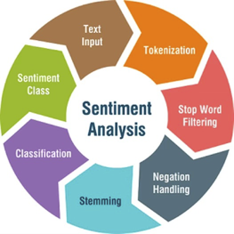
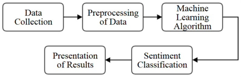
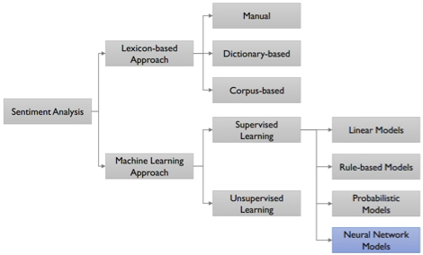
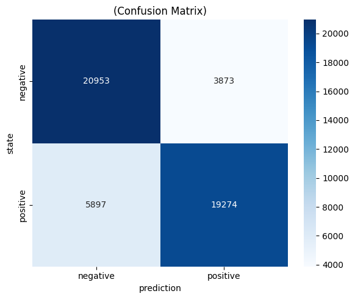
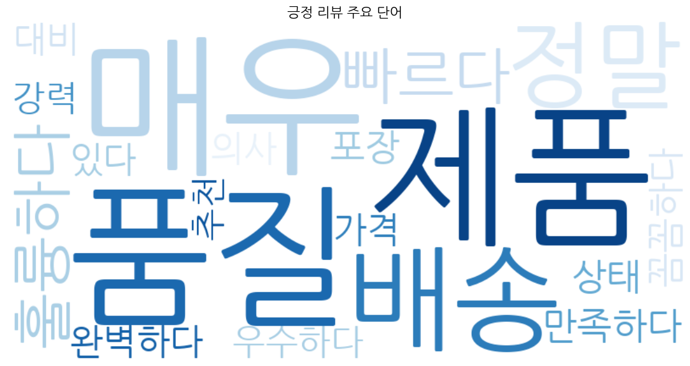

### 1. 감성분석의 개념

#### 1. 자연어 처리(NLP)와 감성분석

자연어 처리(NLP: Natural Language Processing)는 컴퓨터가 인간의 언어를
이해하고 처리할 수 있도록 하는 인공지능의 한 분야로, 일상생활과
머신러닝에서 매우 중요하게 활용된다. 스마트폰에서 문자를 입력할 때
단어를 자동으로 제안하거나 맞춤법 오류를 자동으로 수정하는 기능은 NLP와
머신러닝이 융합된 대표적인 예이다.

텍스트 마이닝(text mining)으로도 불리는 **감성분석(Sentiment Analysis)** 은
텍스트(문장)에 나타난 의견, 태도, 성향 등의 주관적인 정보를 추출하는
머신러닝 기법이다. 감성분석은 텍스트에서 긍정적이거나 부정적인 감정을
감지하여 텍스트 이면에 숨겨진 감정을 해석하는 자동화된 프로세스로,
텍스트의 극성(긍정, 부정, 중립)에 초점을 맞추는 것을 넘어서 특정 느낌과
감정(화남, 행복, 슬픔 등), 응급상황 및 의도까지 감지할 수 있다.

::: {.callout-note title="사례: 오바마 선거 캠프의 빅데이터 전략"}
2012년 미국 대통령 선거에서 오바마 캠프는 선거 2년 전부터 빅데이터 팀을 구성하여 나이·성별·지역별 사회경제 지표뿐만 아니라 **개인의 정치 성향, 취미, 관심 분야**가 담긴 소셜 데이터를 수집·수치화하여 선거 전략 수립의 근거로 활용하였다.

- SNS 텍스트에서 특정 정책에 대한 긍·부정 여론을 실시간 측정
- 지역별 감성 분포를 지도 위에 시각화하여 선거 유세 전략 최적화
- 개인 맞춤형 메시지 발송으로 부동층 설득에 활용
:::

#### 2. 감성분석의 활용 분야

| **활용 분야** | **적용 예시** | **기대 효과** |
|--------------|--------------|--------------|
| 브랜드 모니터링 | SNS·리뷰 여론 실시간 추적 | 위기 조기 탐지 |
| 고객 서비스 | 불만 리뷰 자동 분류·우선순위 지정 | 응답 효율 향상 |
| 금융·투자 | 뉴스·공시 감성으로 주가 예측 | 알파 전략 수립 |
| 정치·선거 | 소셜 데이터 기반 여론 분석 | 선거 전략 최적화 |
| 의료·헬스케어 | 환자 피드백·진료 기록 분석 | 서비스 품질 개선 |

---

### 2. 감성분석 단계

{fig-align="center" width="40%"}

{fig-align="center" width="40%"}


#### 1. 데이터 수집 (Data Collection)

인터넷 상의 자유게시판, 제품 만족도 평가 같은 공개 데이터 소스뿐만 아니라 블로그, 유튜브, 트위터, 페이스북과 같은 UCC 데이터 및 소셜 네트워크 사이트에서도 데이터를 수집할 수 있다. 감성분석 기술을 적용할 데이터를 수집하기 위해서는 일반적으로 검색 엔진이나 크롤러(crawler)를 활용한다.

::: {.callout-tip title="주요 한국어 감성분석 공개 데이터셋"}
| 데이터셋 | 규모 | 설명 |
|----------|------|------|
| **NSMC** (Naver Sentiment Movie Corpus) | 20만 건 | 네이버 영화 리뷰, 긍정/부정 2분류 |
| **KLUE-TC** | 약 45,000건 | 뉴스 주제 분류 |
| **KorSTS** | 약 8,000쌍 | 문장 유사도 |
| **AI Hub 감성대화 말뭉치** | 27만 건 | 감정 7종 분류 |
:::

#### 2. 주관성 탐지 (Subjectivity Detection) — Data Cleansing

텍스트 데이터를 수집한 뒤에는 감성분석에 사용할 텍스트 요소만 분리하는
작업이 필요하다. 웹에서 수집된 텍스트 중 '감성'과 무관한 요소를
제거하고, 다음 단계를 거쳐 데이터를 정제한다.

- **불용어 제거:** a, and, or, but, how, what 등 의미적 가치가 낮은 단어를 제거한다.
- **구두점 제거:** 쉼표, 마침표 등 분석에 불필요한 기호를 삭제한다.
- **형태소 분석:** 단어를 기본 형태(원형)로 변환하여 분석 준비를 완료한다.

#### 3. 극성 탐지 (Polarity Detection) — 감성분석·텍스트 마이닝

텍스트(단어)가 '긍정'인지 '부정'인지를 판단하는 단계이다.
감성분석에서는 텍스트 안에 있는 긍정적·부정적 단어를 탐지하고 이를
정량화한 뒤 통계적 기법을 적용한다. 문서에서 각 단어가 나타나는
'빈도'나 '긍정/부정' 속성에 따라 점수나 가중치를 부여한 후, 각 단어
점수의 총합이나 평균을 구해 전체 텍스트가 긍정적인지 부정적인지
판별한다.

### 오피니언 정의 (Opinion Definition)

문서에서 의견을 찾아내는 과정으로, 분석에 필요한 4가지 요소는 다음과 같다.

- **개체(Entity):** 의견의 대상이 되는 객체 또는 그 특성(feature)
- **감성(Sentiment):** 개체에 대한 의견에 담겨 있는 감정
- **주체(Opinion Holder):** 의견을 표현하는 주체
- **시점(Time):** 의견이 표현된 시간

::: {.callout-note title="오피니언 4요소 예시"}
문장: **"배달의민족은 2024년 12월 주문 취소 정책이 너무 불편합니다."**

| 요소 | 추출 결과 |
|------|-----------|
| 개체(Entity) | 배달의민족 — 주문 취소 정책 (aspect) |
| 감성(Sentiment) | 부정 (불편) |
| 주체(Opinion Holder) | (익명의 사용자) |
| 시점(Time) | 2024년 12월 |

이처럼 단순 긍/부정 분류를 넘어 **속성 기반 감성분석(ABSA: Aspect-Based Sentiment Analysis)** 으로 확장하면 "어떤 측면에서 부정적인지"까지 파악할 수 있다.
:::

---

### 3. 방법론

{fig-align="center" width="80%"}

#### 1. 어휘 기반 감성분석 (Lexicon-based) — 규칙 기반

감성을 표현하는 긍정적·부정적 단어 목록인 **감성사전(Sentiment Lexicon)** 을
구축하여 분석하는 방식이다. 감성사전은 문서의 각 단어가 가지는
긍정·부정의 정도를 −1(부정)부터 +1(긍정) 사이의 점수로 척도화한
레이블이다.

분석 절차는 다음과 같다.

1. 텍스트에서 명사, 형용사, 동사 등 감성을 담을 수 있는 품사의 키워드를 추출한다.
2. 추출된 키워드에 긍·부정 레이블링(labeling)을 수행한다.
3. 감성사전을 이용하여 개체별 극성이나 긍·부정을 시각화하고, 연관어 분석을 통해 어떤 단어와 함께 사용되었는지 파악한다.

##### 텍스트 전처리 절차

- **토큰화 (Tokenization):** 텍스트를 토큰(token)이라는 작은 단위로 분리한다. 문장 토큰화는 텍스트를 문장 단위로, 단어 토큰화는 문장을 개별 단어로 분리한다.

- **표제어화 (Lemmatization):** 단어를 기본형(어근)으로 변환한다. 예) is, are, am, was, been → **be**

- **불용어 제거 (Stopword Removal):** for, at, to와 같이 의미적 가치가 낮은 단어를 제거한다.

- **부정어 처리 (Negation Handling):** "not good"과 "not terrible"의 점수화 기준이 상이하다. "not good"이 "bad"와 동일한 점수인가? **부정어 처리는 감성분석의 핵심 난제이다.**

- **형태소 분석 (Stemming):** 단어의 접미사를 제거하여 기본 단어 형태로 변환하는 정규화 기술이다. PorterStemmer, SnowballStemmer 등의 라이브러리를 활용한다.

::: {.callout-important title="Stemming vs Lemmatization 차이"}
| 구분 | 방법 | 예시 | 특징 |
|------|------|------|------|
| **Stemming** | 접미사 기계적 제거 | running → runn | 빠르지만 비단어 생성 가능 |
| **Lemmatization** | 사전 기반 기본형 변환 | running → run | 정확하지만 느림 |

한국어에서는 형태소 분석기(KoNLPy)가 Lemmatization 역할을 담당한다.
:::

### 감성사전 구축 방법

| **방법** | **장점** | **단점** |
|----------|----------|----------|
| 수작업 (Manual) | 한 번 구축 후 적용이 용이 | 도메인 확장성 부족 |
| 사전 기반 (Dictionary-based) | 기존 사전 활용, 구축 불필요 | 도메인 의존성 문제 |
| 말뭉치 기반 (Corpus-based) | 도메인 의존성 극복 가능 | 대규모 말뭉치 필요 |

::: {.callout-note title="도메인 의존성 예시"}
영화 리뷰에서 **"졸리다"** 는 부정적 의미이지만, 침대 상품평에서 **"졸리다"** 는 긍정적 의미이다. 이처럼 동일한 단어도 도메인에 따라 긍·부정이 달라질 수 있다.

추가 예시:
- "작다": 스마트폰 리뷰 → 부정 / 미니멀 소품 리뷰 → 긍정
- "강렬하다": 영화 리뷰 → 긍정 / 소독약 냄새 리뷰 → 부정
- "독하다": 감기약 리뷰 → 긍정(효과 좋음) / 사람 성격 평가 → 부정
:::

#### 2. 머신러닝 감성분석

##### 1단계: 특징 추출 (Feature Extraction)

모델이 텍스트를 분류하려면 먼저 텍스트를 컴퓨터가 읽을 수 있는 형태로
변환해야 한다. 토큰화, 표제어 추출, 불용어 제거 과정을 거친 후,
**벡터화(vectorization)** 과정을 통해 텍스트를 숫자로 변환한다.

::: {.callout-note title="주요 텍스트 벡터화 방법"}
**1. Bag-of-Words (BoW)**

단어의 등장 여부(또는 빈도)만 고려하는 가장 단순한 벡터화 방식.

```
문장: "나는 영화를 좋아한다"
어휘: {나, 영화, 좋아하다, 밥, 먹다}
벡터: [1, 1, 1, 0, 0]
```

**2. TF-IDF (Term Frequency - Inverse Document Frequency)**

$$\text{TF-IDF}(t, d) = \underbrace{\frac{f_{t,d}}{\sum_{t'} f_{t',d}}}_{\text{TF}} \times \underbrace{\log \frac{N}{|\{d \in D: t \in d\}|}}_{\text{IDF}}$$

- **TF**: 문서 $d$ 내에서 단어 $t$의 상대적 빈도
- **IDF**: 전체 문서 중 단어 $t$가 등장한 문서의 역수 → **흔한 단어일수록 낮은 가중치**
- 모든 문서에 자주 등장하는 단어("있다", "이다")는 IDF가 낮아 중요도가 자동으로 하락

**3. Word2Vec / FastText (워드 임베딩)**

단어를 고차원 밀집 벡터로 표현. 의미가 유사한 단어는 벡터 공간에서 가까운 위치에 배치.

```
king - man + woman ≈ queen  (의미 연산 가능)
```

**4. BERT Embedding**

문맥(context)에 따라 동적으로 변하는 벡터. "배트가 날다"의 '배트'와 "야구 배트"의 '배트'가 다른 벡터를 가짐.
:::

### 2단계: 학습 및 예측 (Training & Prediction)

알고리즘에 감정 레이블이 지정된 훈련 데이터(training set)를 제공하고,
모델은 입력 데이터를 적절한 레이블(긍정/부정/중립)과 연결하는 방법을
학습한다. 대표적인 분류 알고리즘은 다음과 같다.

- **나이브 베이즈 (Naive Bayes):** 텍스트 분류의 기본 알고리즘으로, 단어 출현 빈도 기반의 확률 모델이다.
- **로지스틱 회귀 (Logistic Regression):** 해석이 용이하고 빠른 학습 속도를 가진다.
- **서포트 벡터 머신 (SVM):** 고차원 텍스트 특징 공간에서 탁월한 성능을 보인다.
- **랜덤 포레스트 (Random Forest):** 앙상블 기법으로 과적합을 방지하고 안정적인 성능을 제공한다.

##### 3단계: 예측 (Inference)

새로운 텍스트가 모델에 입력되면 학습된 모델이 해당 텍스트의 감성
레이블을 예측한다. 규칙 기반 방식과 달리 사전 정의된 사전이 필요하지
않으며, 보다 복잡한 언어 패턴도 처리할 수 있다는 장점이 있다.

---

### 2. 딥러닝 감성분석

#### 1. LSTM (Long Short-Term Memory)

딥러닝 알고리즘은 인간 두뇌의 구조와 기능에서 영감을 받은 접근 방식으로,
감성분석의 정확성과 효율성을 높이고 있다. 딥러닝에서 신경망은 오류가
발생했을 때 스스로 수정하는 방법을 학습할 수 있는 반면, 기존의
머신러닝에서는 사람의 개입을 통해 오류를 수정해야 한다.

::: {.callout-note title="RNN의 한계와 LSTM의 해결책"}
**기본 RNN의 문제점 — 장기 의존성(Long-term Dependency) 문제**

```
"나는 어릴 때부터 프랑스에 살았기 때문에 ... [50단어 생략] ... 프랑스어를 잘 한다."
```

RNN은 앞부분의 "프랑스" 정보가 역전파(backpropagation) 과정에서 점점 희미해지는
**기울기 소실(Vanishing Gradient)** 문제가 발생한다.

**LSTM의 해결책**: 별도의 **셀 상태(Cell State)** 를 도입하여 중요한 정보를
장거리에서도 유지하는 "기억 경로"를 만든다.
:::

LSTM은 텍스트를 순차적으로 읽으며 작업과 관련된 정보를 저장하는 구조로, 세 가지 게이트(Gate)로 구성된다.

- **Forget Gate:** 이전 데이터를 기억할지 여부를 결정한다. 작업과 관련이 없으면 해당 정보를 삭제한다.
- **Input Gate:** 새로운 데이터로부터 새로운 정보를 학습하는 단계이다.
- **Output Gate:** 업데이트된 정보를 다음 타임스텝(timestamp)으로 전달하는 단계이다.

::: {.callout-tip title="LSTM 게이트 동작 예시"}
문장: **"great"** 과 **"not great"** 사이에는 큰 차이가 있다. LSTM은 이러한 부정어 구별이 중요하다는 것을 학습할 수 있으며, 많은 양의 텍스트를 읽어 문법 규칙도 스스로 유추한다.

- "not"을 읽는 순간 → Input Gate: "부정어 존재" 정보 저장
- "great"을 읽는 순간 → Forget Gate: "great"의 원래 긍정 극성 약화
- 최종 출력 → Output Gate: "부정적 감성" 신호 전달
:::

#### 2. Transformer와 BERT 기반 감성분석 ★ 심화

2017년 Google이 발표한 Transformer 아키텍처는 **자기 주의 메커니즘(Self-Attention Mechanism)** 을 통해 문장 내 단어 간의 관계를 병렬로 처리한다. 이를 기반으로 2018년 Google이 개발한 **BERT(Bidirectional Encoder Representations from Transformers)** 는 문장을 양방향(좌→우, 우→좌)으로 동시에 이해함으로써 기존 단방향 모델의 한계를 극복하였다.

##### BERT의 핵심 특징

- **양방향 문맥 이해:** 문장의 앞뒤 맥락을 동시에 고려하여 단어의 의미를 정확하게 파악한다.
- **사전 학습 + 미세 조정 (Pre-training + Fine-tuning):** 대규모 말뭉치로 사전 학습 후, 소규모 레이블 데이터로 미세 조정하여 다양한 태스크에 적용한다.
- **서브워드 토큰화 (WordPiece):** 미등록 단어 문제를 해결하기 위해 단어를 서브워드 단위로 분리한다. 예) "playing" → "play" + "##ing"

::: {.callout-note title="BERT 사전학습 vs 파인튜닝 구조"}
```
[사전학습 단계]
대규모 말뭉치 (위키백과, 뉴스 등)
    ↓
Masked Language Model (MLM): 단어 15% 마스킹 후 예측
Next Sentence Prediction (NSP): 두 문장의 연속성 예측
    ↓
사전학습된 BERT 가중치

[파인튜닝 단계]
소규모 레이블 데이터 (감성분석용 리뷰 수천~수만 건)
    ↓
[CLS] 토큰의 출력 벡터 → 분류 레이어 추가
    ↓
감성분석 특화 모델 (긍정/부정/중립 분류)
```
:::

### BERT 기반 감성분석 모델 비교

| **모델** | **특징** | **한국어 지원** |
|----------|----------|----------------|
| BERT | 양방향 Transformer 인코더, 기본 모델 | KoBERT (SKT) |
| RoBERTa | BERT 학습 개선판, 더 많은 데이터·스텝 | RoBERTa-large |
| ELECTRA | 판별 목적 함수, 효율적 학습 | KoELECTRA |
| XLNet | 자기회귀 + 순열 언어 모델 | 제한적 |
| Sentiment-BERT | 감성분석 특화 파인튜닝 모델 | 한국어 ABSA 모델 |

##### Transformer Self-Attention 원리

Self-Attention은 입력 시퀀스의 각 토큰이 다른 모든 토큰과의 관련성(주의 가중치)을 계산하는 메커니즘이다.

| **구성 요소** | **역할** | **수식** |
|--------------|----------|---------|
| Query (Q) | 현재 처리 중인 토큰의 표현 | Q = XW_Q |
| Key (K) | 비교 대상 토큰의 표현 | K = XW_K |
| Value (V) | 가중합으로 출력될 실제 정보 | V = XW_V |
| Attention Score | Q와 K의 유사도 계산 | Attention(Q,K,V) = softmax(QK^T / √d_k)V |

::: {.callout-tip title="Self-Attention 직관적 이해"}
문장: **"그 은행은 강가에 있다"** vs **"그 은행에 돈을 입금했다"**

Self-Attention은 "은행"이라는 단어가 주변 단어들(강가 vs 돈, 입금)과 얼마나 관련 있는지를 수치화하여, 문맥에 맞는 의미(지형 vs 금융기관)를 자동으로 파악한다.

- 첫 번째 문장: "은행"↔"강가" 높은 주의 가중치 → 지형적 의미
- 두 번째 문장: "은행"↔"돈","입금" 높은 주의 가중치 → 금융적 의미
:::

#### 3. 최신 대형 언어 모델(LLM) 기반 감성분석

GPT-4, Claude, LLaMA 등 대형 언어 모델(LLM)은 Few-shot 또는 Zero-shot
방식으로 감성분석에 활용된다. 별도의 파인튜닝 없이 프롬프트(prompt)
엔지니어링만으로도 높은 성능을 달성할 수 있으며, 특히 **Aspect-Based
Sentiment Analysis(ABSA)** 등 세밀한 감성 분류에 효과적이다.

| **접근 방식** | **설명** | **장점** |
|--------------|----------|---------|
| Zero-shot | 사례 없이 프롬프트만으로 분류 | 추가 데이터 불필요 |
| Few-shot | 2~5개 예시 포함 프롬프트 | 도메인 적응 용이 |
| Fine-tuning | 레이블 데이터로 모델 파라미터 갱신 | 최고 성능 달성 |
| RAG | 검색 증강 생성, 외부 지식 활용 | 사실 기반 분석 강화 |

---

### 3. 파이썬 실습

##### 환경 설정

다음 패키지를 설치한다.
```python
# 패키지 설치
!pip install nltk textblob vaderSentiment
!pip install transformers torch
!pip install konlpy  # 한국어 형태소 분석
!pip install pandas matplotlib seaborn wordcloud
```

::: {.callout-note title="패키지별 역할"}
| 패키지 | 용도 |
|--------|------|
| `vaderSentiment` | 규칙 기반 영어 감성분석 (소셜 미디어 특화) |
| `transformers` | HuggingFace의 사전학습 모델 허브 (BERT, GPT 등) |
| `torch` | PyTorch 딥러닝 프레임워크 (transformers 의존성) |
| `konlpy` | 한국어 형태소 분석 (Okt, Kkma, Hannanum 등) |
| `seaborn` | matplotlib 기반 통계 시각화 (혼동행렬 히트맵 등) |
:::

##### VADER를 이용한 영어 감성분석

**VADER(Valence Aware Dictionary and sEntiment Reasoner)** 는 소셜 미디어
텍스트에 최적화된 규칙 기반 감성분석 도구이다.

::: {.callout-note title="VADER 동작 원리"}
VADER는 단순 단어 사전 매칭을 넘어 **언어학적 규칙** 을 추가로 적용한다.

1. **대문자 강조**: "AMAZING" > "amazing" (강도 증폭)
2. **문장 부호**: "amazing!!!" > "amazing" (느낌표로 강도 증폭)
3. **부정어 반전**: "not good" → 긍정 점수를 부정으로 반전
4. **But 접속사**: "A but B" → B에 더 높은 가중치
5. **Booster 단어**: "very", "extremely" (강도 증폭) / "barely", "slightly" (약화)

**VADER 점수 구조:**
- `neg` / `neu` / `pos`: 각 극성의 비율 (합계 = 1.0)
- `compound`: -1(완전 부정) ~ +1(완전 긍정) 의 정규화된 종합 점수
  - 분류 기준: **compound ≥ 0.05** → Positive / **≤ -0.05** → Negative / 그 외 → Neutral
:::

```python
# VADER를 이용한 영어 감성분석
from vaderSentiment.vaderSentiment import SentimentIntensityAnalyzer
import pandas as pd

analyzer = SentimentIntensityAnalyzer()

texts = [
    "This product is absolutely amazing! Best purchase ever.",
    "Terrible quality. Completely disappointed with this item.",
    "The product arrived on time. It works as described.",
    "Not bad, but could be better. Average performance.",
]

results = []
for text in texts:
    scores = analyzer.polarity_scores(text)  # neg, neu, pos, compound 반환
    # compound 임계값으로 감성 레이블 결정
    sentiment = 'Positive' if scores['compound'] >= 0.05 else \
                'Negative' if scores['compound'] <= -0.05 else 'Neutral'
    results.append({
        'text': text[:40] + '...',
        'neg': scores['neg'],
        'neu': scores['neu'],
        'pos': scores['pos'],
        'compound': scores['compound'],
        'sentiment': sentiment
    })

df = pd.DataFrame(results)
print(df.to_string(index=False))
```
```text
                                       text   neg   neu   pos  compound sentiment
This product is absolutely amazing! Best... 0.000 0.404 0.596    0.8709  Positive
Terrible quality. Completely disappointe... 0.565 0.435 0.000   -0.7574  Negative
The product arrived on time. It works as... 0.000 1.000 0.000    0.0000   Neutral
Not bad, but could be better. Average pe... 0.000 0.510 0.490    0.6980  Positive
```

::: {.callout-note title="코드 설명 — VADER 분석 루프"}
- `SentimentIntensityAnalyzer()`: VADER 분석기 객체 생성. 내부적으로 약 7,500개 단어의 감성 사전과 규칙 엔진을 로드.
- `analyzer.polarity_scores(text)`: 텍스트를 입력받아 `{'neg': ..., 'neu': ..., 'pos': ..., 'compound': ...}` 딕셔너리 반환.
- 삼항 조건식 (`A if cond else B else C`): compound 값에 따라 3가지 레이블을 한 줄로 결정.
- `text[:40] + '...'`: 출력 공간 절약을 위해 텍스트를 40자로 자르고 `...` 추가.
- `pd.DataFrame(results)`: 딕셔너리 리스트를 DataFrame으로 변환 (각 딕셔너리의 key가 열 이름이 됨).
:::

::: {.callout-tip title="결과 해석 — VADER 분석 결과"}
| 텍스트 요약 | compound | 분류 | 해석 |
|------------|----------|------|------|
| "absolutely amazing! Best..." | +0.8709 | Positive | "absolutely", "amazing", "Best"의 강한 긍정 단어 + 느낌표로 강도 증폭 |
| "Terrible...disappointed..." | -0.7574 | Negative | "Terrible", "disappointed"는 VADER 사전에서 강한 부정 점수 보유 |
| "arrived on time. works as described" | 0.0000 | Neutral | 사실 서술 문장으로 감성 어휘 없음 — 100% 중립 |
| **"Not bad, but could be better"** | **+0.6980** | **Positive** | ⚠️ **주의**: "not bad"를 긍정으로, "better"를 긍정으로 인식. 실제로는 미온적 평가이지만 VADER는 Positive로 분류 |

**마지막 결과의 한계점**: "Not bad, but could be better"는 실제로는 중립~약한 긍정이지만 compound = 0.698로 강한 긍정으로 분류된다. 규칙 기반 방식의 한계로, "could be better"의 미묘한 불만족 뉘앙스를 포착하지 못한다.
:::

---

##### KoNLPy를 이용한 한국어 전처리

한국어 텍스트 감성분석을 위해 KoNLPy의 Okt(Open Korean Text) 형태소 분석기를 사용한다.

```python
# KoNLPy를 이용한 한국어 전처리
from konlpy.tag import Okt
import re

okt = Okt()

def preprocess_korean(text):
    # 1단계: 특수문자 및 숫자 제거 (한글과 공백만 유지)
    text = re.sub(r'[^가-힣\s]', ' ', text)
    # 2단계: 연속 공백 정리
    text = re.sub(r'\s+', ' ', text).strip()
    # 3단계: 형태소 분석 (명사, 형용사, 동사만 추출)
    tokens = okt.pos(text, norm=True, stem=True)
    words = [word for word, pos in tokens
             if pos in ['Noun', 'Adjective', 'Verb']]
    return ' '.join(words)

# 한국어 불용어 목록
stopwords = ['것', '수', '등', '및', '또는', '그리고', '하지만']

texts = [
    "이 제품은 정말 훌륭합니다. 배송도 빠르고 품질도 최고예요!",
    "너무 실망스럽습니다. 품질이 형편없고 고객 서비스도 최악이에요.",
    "그냥 평범한 제품입니다. 딱히 나쁘지는 않아요.",
]

for text in texts:
    processed = preprocess_korean(text)
    print(f'원문: {text[:30]}...')
    print(f'전처리: {processed}')
    print()
```
```text
원문: 이 제품은 정말 훌륭합니다. 배송도 빠르고 품질도 최고...
전처리: 이 제품 정말 훌륭하다 배송 빠르다 품질 최고

원문: 너무 실망스럽습니다. 품질이 형편없고 고객 서비스도 최...
전처리: 실망 스럽다 품질 형편 없다 고객 서비스 최악

원문: 그냥 평범한 제품입니다. 딱히 나쁘지는 않아요....
전처리: 그냥 평범하다 제품 이다 딱하다 나쁘다 않다
```

::: {.callout-note title="코드 설명 — preprocess_korean 함수"}
**함수 구조 분석:**

1. `re.sub(r'[^가-힣\s]', ' ', text)`:
   - `[^가-힣\s]`: 한글 완성형 범위와 공백 문자 **이외** 의 모든 문자
   - 영문, 숫자, 특수문자, 느낌표 등을 공백으로 치환

2. `okt.pos(text, norm=True, stem=True)`:
   - `norm=True`: 맞춤법 정규화 ("훌륭합니다" → 정규 형태 유지)
   - `stem=True`: 어간 추출 ("훌륭합니다" → "훌륭하다", "빠르고" → "빠르다")

3. `if pos in ['Noun', 'Adjective', 'Verb']`:
   - **명사**: 객체/속성 정보 보존 (제품, 배송, 품질)
   - **형용사**: 감성 표현의 핵심 ("훌륭하다", "빠르다", "최악")
   - **동사**: 행위와 상태 표현 ("없다", "이다")
   - 조사(Josa), 어미(Eomi) 등 문법 형태소는 제외

4. `' '.join(words)`: 토큰 리스트를 공백 구분 문자열로 변환 → TF-IDF 입력 형식에 맞춤
:::

::: {.callout-tip title="결과 해석 — 한국어 전처리"}
| 원문 | 전처리 결과 | 분석 |
|------|------------|------|
| "정말 훌륭합니다. 배송도 빠르고..." | 훌륭하다, 빠르다, 최고 | 긍정 형용사 중심 → 감성 분류 용이 |
| "품질이 형편없고 고객 서비스도 최악" | 형편, 없다, 최악 | 부정어 포함 → "형편 없다"로 분리됨 |
| **"딱히 나쁘지는 않아요"** | **딱하다, 나쁘다, 않다** | ⚠️ **한계**: "나쁘지 않다"(이중 부정 = 긍정)가 "나쁘다 + 않다"로 분리되어 오분류 위험 |

**세 번째 문장의 문제**: "나쁘지는 않아요"는 이중 부정으로 **긍정적 의미** 이지만, 형태소 분석 후 "나쁘다"와 "않다"가 각각 독립적인 토큰으로 처리된다. 단순 어휘 기반 분류기는 "나쁘다"를 부정 표현으로 오인할 수 있어 **부정어 처리(Negation Handling)** 가 별도로 필요하다.
:::

---

##### 머신러닝 기반 감성분석 (TF-IDF + Logistic Regression)

Naver 영화 리뷰 데이터셋(NSMC)을 활용한 한국어 감성분석 분류 모델을 구축한다.

::: {.callout-note title="NSMC 데이터셋 구조"}
**NSMC (Naver Sentiment Movie Corpus)**

- 출처: 네이버 영화 리뷰
- 규모: train 150,000건 / test 50,000건
- 컬럼: `id`, `document`(리뷰 텍스트), `label`(0=부정, 1=긍정)
- 균형: 긍정/부정 각 50%로 균등 분포

```text
id          document                    label
9976970     아 더빙.. 진짜 짜증나네요...    0
3819312     흠포스터보고 초딩영화줄....      1
```
:::

```python
# 머신러닝 기반 감성분석 (TF-IDF + Logistic Regression)
import pandas as pd
from sklearn.model_selection import train_test_split
from sklearn.feature_extraction.text import TfidfVectorizer
from sklearn.linear_model import LogisticRegression
from sklearn.metrics import classification_report, confusion_matrix
import matplotlib.pyplot as plt
import seaborn as sns

# 데이터 로드 (NSMC: Naver Sentiment Movie Corpus)
train_df = pd.read_csv('/content/drive/MyDrive/eBook python codes/ratings_train.txt', sep='\t')
test_df  = pd.read_csv('/content/drive/MyDrive/eBook python codes/ratings_test.txt',  sep='\t')

# 결측치 제거 (document 열이 NaN인 행 삭제)
train_df = train_df.dropna(subset=['document'])
test_df  = test_df.dropna(subset=['document'])

# TF-IDF 벡터화
# max_features: 빈도 상위 30,000 단어만 특징으로 사용
# ngram_range=(1,2): 단일 단어(unigram)와 연속 두 단어(bigram) 모두 포함
tfidf   = TfidfVectorizer(max_features=30000, ngram_range=(1, 2))
X_train = tfidf.fit_transform(train_df['document'])  # 어휘 학습 + 변환
X_test  = tfidf.transform(test_df['document'])       # 학습된 어휘로만 변환
y_train = train_df['label']
y_test  = test_df['label']

# 로지스틱 회귀 모델 학습
# C=5: 규제 강도의 역수 (클수록 규제 약함, 과적합 가능성 증가)
model = LogisticRegression(C=5, max_iter=1000, random_state=42)
model.fit(X_train, y_train)

# 평가
y_pred = model.predict(X_test)
print(classification_report(y_test, y_pred, target_names=['negative(0)', 'positive(1)']))

# 혼동 행렬 시각화
cm = confusion_matrix(y_test, y_pred)
plt.figure(figsize=(6, 5))
sns.heatmap(cm, annot=True, fmt='d', cmap='Blues',
            xticklabels=['negative', 'positive'],
            yticklabels=['negative', 'positive'])
plt.title('(Confusion Matrix)')
plt.ylabel('state'); plt.xlabel('prediction')
plt.tight_layout(); plt.savefig('confusion_matrix.png', dpi=150)
plt.show()
```
```text
              precision    recall  f1-score   support

 negative(0)       0.78      0.84      0.81     24826
 positive(1)       0.83      0.77      0.80     25171

    accuracy                           0.80     49997
   macro avg       0.81      0.80      0.80     49997
weighted avg       0.81      0.80      0.80     49997
```
{fig-align="center" width="60%"}

::: {.callout-note title="코드 설명 — TF-IDF + Logistic Regression"}
**TF-IDF 벡터화 핵심 파라미터:**

- `max_features=30000`: 전체 어휘 중 TF-IDF 점수 기준 상위 30,000개만 사용. 메모리 절약 및 노이즈 단어 제거 효과.
- `ngram_range=(1,2)`: unigram("배송", "빠르다") + bigram("배송 빠르다") 동시 사용. bigram이 문맥 정보를 추가하여 성능 향상.
- `fit_transform(train)` vs `transform(test)`: **훈련 데이터로만 어휘와 IDF 값을 학습** 하고, 테스트 데이터는 같은 어휘 기준으로만 변환. 테스트 데이터 정보 누출(leakage) 방지.

**Logistic Regression 파라미터:**

- `C=5`: 정규화 강도의 역수. C가 클수록 훈련 데이터에 더 밀착 (과적합 위험). 기본값 C=1 대비 약간 느슨한 규제.
- `max_iter=1000`: 수렴을 위한 최대 반복 수. 텍스트 분류는 고차원이므로 기본값(100)으로 부족할 수 있음.
- `random_state=42`: 재현성을 위한 난수 시드.
:::

::: {.callout-tip title="결과 해석 — 분류 성능 지표 읽는 법"}
**핵심 지표 의미:**

$$\text{Precision} = \frac{TP}{TP + FP} \quad \text{Recall} = \frac{TP}{TP + FN} \quad \text{F1} = \frac{2 \times \text{Precision} \times \text{Recall}}{\text{Precision} + \text{Recall}}$$

| 지표 | negative(0) | positive(1) | 해석 |
|------|-------------|-------------|------|
| **Precision** | 0.78 | 0.83 | 긍정이라고 예측한 것 중 83%가 실제 긍정 |
| **Recall** | 0.84 | 0.77 | 실제 부정 중 84%를 부정으로 올바르게 분류 |
| **F1-score** | 0.81 | 0.80 | Precision과 Recall의 조화평균 |
| **Accuracy** | — | — | **0.80** (전체 50,000건 중 80% 정확 분류) |

**비대칭성 분석:**

- **부정(negative)**: Recall(0.84) > Precision(0.78) → 부정을 넓게 잡음 (일부 긍정을 부정으로 오분류)
- **긍정(positive)**: Precision(0.83) > Recall(0.77) → 긍정 예측은 정확하지만 일부 긍정을 놓침

**혼동 행렬 해석:**

```
                 예측: 부정    예측: 긍정
실제: 부정  [  TN: ~20,854  |  FP: ~3,972  ]
실제: 긍정  [  FN: ~5,789   |  TP: ~19,382 ]
```

FP(긍정 오분류)보다 FN(부정 오분류)이 더 많다 → 모델이 부정 텍스트를 상대적으로 더 잘 감지하는 경향.

**80% 정확도의 의미**: 단순 다수 클래스 예측(모두 긍정=50%)보다 30%p 높은 성능. 실무에서 기본 베이스라인으로 활용 가능하며, 한국어 전처리(형태소 분석) 적용 시 추가 향상 기대.
:::

---

##### BERT 기반 감성분석 (HuggingFace Transformers)

HuggingFace의 `pipeline`을 사용하면 사전 학습된 BERT 모델을 손쉽게 활용할 수 있다.

```python
from transformers import pipeline, AutoTokenizer, AutoModelForSequenceClassification
import torch

# ── 방법 1: pipeline API (간단한 추론) ────────────────────────────
# 영어 감성분석 — DistilBERT (BERT의 경량화 버전, 크기 40% 감소, 속도 60% 향상)
classifier_en = pipeline(
    'sentiment-analysis',
    model='distilbert-base-uncased-finetuned-sst-2-english'
)
texts_en = [
    'This movie is fantastic!',
    'I really hated the ending.',
    'It was okay, nothing special.'
]
results = classifier_en(texts_en)
for text, result in zip(texts_en, results):
    print(f'Text   : {text}')
    print(f'Label  : {result["label"]}, Score: {result["score"]:.4f}')
    print()

# ── 방법 2: KoELECTRA 한국어 감성분석 ─────────────────────────────
# KR-FinBert-SC: 한국어 금융 뉴스에 특화된 감성분석 모델
model_name = 'snunlp/KR-FinBert-SC'
tokenizer = AutoTokenizer.from_pretrained(model_name)
model = AutoModelForSequenceClassification.from_pretrained(model_name)

def predict_sentiment(text):
    # 텍스트를 토큰으로 변환 (최대 512 토큰으로 자름)
    inputs = tokenizer(text, return_tensors='pt', truncation=True, max_length=512)
    with torch.no_grad():  # 추론 시 기울기 계산 비활성화 (메모리 절약)
        logits = model(**inputs).logits
    # softmax로 로짓을 확률로 변환
    probs = torch.softmax(logits, dim=1).squeeze().tolist()
    labels = model.config.id2label  # {0: 'negative', 1: 'neutral', 2: 'positive'}
    return {labels[i]: round(p, 4) for i, p in enumerate(probs)}

korean_texts = [
    "이번 분기 실적이 예상치를 크게 상회하며 주가가 급등했습니다.",
    "경기 침체 우려로 소비 심리가 위축되고 있습니다.",
    "신제품 출시 일정이 예정대로 진행될 것으로 보입니다.",
]

for text in korean_texts:
    result = predict_sentiment(text)
    print(f'텍스트: {text[:35]}...')
    print(f'결과  : {result}')
    print()
```
```text
BertForSequenceClassification LOAD REPORT from: snunlp/KR-FinBert-SC
Key                          | Status     |
-----------------------------+------------+
bert.embeddings.position_ids | UNEXPECTED |

텍스트: 이번 분기 실적이 예상치를 크게 상회하며 주가가 급등했습니다....
결과  : {'negative': 0.0001, 'neutral': 0.0001, 'positive': 0.9999}

텍스트: 경기 침체 우려로 소비 심리가 위축되고 있습니다....
결과  : {'negative': 0.8352, 'neutral': 0.1644, 'positive': 0.0004}

텍스트: 신제품 출시 일정이 예정대로 진행될 것으로 보입니다....
결과  : {'negative': 0.0007, 'neutral': 0.0012, 'positive': 0.9981}
```

::: {.callout-note title="코드 설명 — HuggingFace Transformers"}
**방법 1 — pipeline API:**

- `pipeline('sentiment-analysis', model=...)`: HuggingFace의 고수준 API. 토크나이저 로드, 모델 로드, 전처리, 추론, 후처리를 한 번에 처리.
- `distilbert-base-uncased-finetuned-sst-2-english`: SST-2(Stanford Sentiment Treebank) 데이터셋으로 파인튜닝된 DistilBERT. 영어 영화 리뷰 감성분석 특화.
- 반환 형식: `[{'label': 'POSITIVE', 'score': 0.9998}, ...]`

**방법 2 — AutoClass API:**

- `AutoTokenizer.from_pretrained(name)`: 모델에 맞는 토크나이저를 자동으로 로드.
- `AutoModelForSequenceClassification`: 분류 헤드가 붙은 BERT 계열 모델 자동 로드.
- `return_tensors='pt'`: PyTorch 텐서 형식으로 반환 (`'tf'`는 TensorFlow용).
- `truncation=True, max_length=512`: BERT의 최대 입력 길이(512 토큰) 초과 시 자름.
- `torch.no_grad()`: 추론 시 기울기 계산 비활성화 → 메모리 약 50% 절약, 속도 향상.
- `torch.softmax(logits, dim=1)`: 원시 점수(logits)를 합이 1인 확률로 변환.

**UNEXPECTED 경고 무시해도 되는 이유:**

`bert.embeddings.position_ids | UNEXPECTED` 메시지는 구버전 BERT 모델 가중치 파일에 있던 키가 최신 transformers 라이브러리에서 제거되어 발생하는 경고이다. **오류(error)가 아닌 경고(warning)** 이며, 모델 성능에 영향을 주지 않는다.
:::

::: {.callout-tip title="결과 해석 — KR-FinBert 금융 감성분석"}
| 텍스트 요약 | positive | neutral | negative | 해석 |
|------------|----------|---------|----------|------|
| "실적 상회, 주가 급등" | **0.9999** | 0.0001 | 0.0001 | 명백한 긍정 뉴스. "상회", "급등" 등 금융 긍정어 강하게 활성화. |
| "경기 침체, 소비 심리 위축" | 0.0004 | 0.1644 | **0.8352** | 강한 부정. "침체", "우려", "위축"이 금융 부정 맥락의 핵심 어휘. |
| "출시 일정 예정대로" | **0.9981** | 0.0012 | 0.0007 | 긍정. 불확실성 없는 예정 진행은 금융 맥락에서 긍정 신호. |

**도메인 특화 모델의 강점**: 일반 감성분석 모델은 "위축"이나 "침체"의 금융적 부정 의미를 학습하지 못할 수 있지만, KR-FinBert는 금융 뉴스 데이터로 파인튜닝되어 **금융 도메인 고유 어휘의 감성 극성** 을 정확히 포착한다.
:::

---

##### 워드 클라우드 시각화

```python
# 패키지 설치 (Colab에서 최초 1회 실행)
!pip install wordcloud konlpy -q
!apt-get install -y fonts-nanum -q   # 나눔 한글 폰트 설치
!fc-cache -fv                         # 폰트 캐시 갱신

from matplotlib.font_manager import FontProperties
import matplotlib
matplotlib.font_manager._load_fontmanager(try_read_cache=False)  # 폰트 캐시 초기화

from wordcloud import WordCloud
import matplotlib.pyplot as plt
from collections import Counter
from konlpy.tag import Okt
import matplotlib.font_manager as fm

font_path = '/usr/share/fonts/truetype/nanum/NanumGothic.ttf'
okt = Okt()

# 샘플 리뷰 텍스트
reviews = [
    "배송이 정말 빠르고 제품 품질도 훌륭합니다. 매우 만족합니다.",
    "포장이 꼼꼼하고 제품 상태가 완벽했습니다. 재구매 의사 있습니다.",
    "가격 대비 품질이 매우 우수합니다. 강력 추천합니다!"
]

# 형용사·명사 추출
all_words = []
for review in reviews:
    pos_tags = okt.pos(review, norm=True, stem=True)
    # 길이 2 이상인 명사·형용사만 추출 (1글자 단어 제거)
    words = [w for w, p in pos_tags if p in ['Adjective', 'Noun'] and len(w) > 1]
    all_words.extend(words)

word_freq = Counter(all_words)
print("추출된 단어 빈도:", word_freq)

# 워드클라우드 생성
wc = WordCloud(
    font_path=font_path,
    background_color='white',
    width=800,
    height=400,
    max_words=50,
    colormap='Blues'
)
wc.generate_from_frequencies(word_freq)

font_prop = FontProperties(fname=font_path, size=16)

plt.figure(figsize=(12, 6))
plt.imshow(wc, interpolation='bilinear')
plt.axis('off')
plt.title('긍정 리뷰 주요 단어', fontproperties=font_prop, fontweight='bold')
plt.tight_layout()
plt.savefig('wordcloud.png', dpi=150, bbox_inches='tight')
plt.show()
```

{fig-align="center" width="100%"}

::: {.callout-note title="코드 설명 — 리뷰 워드클라우드"}
- `!apt-get install -y fonts-nanum`: Google Colab(Ubuntu 환경)에 나눔 폰트를 설치하는 시스템 명령어. `-y` 옵션으로 설치 확인 질문에 자동 응답.
- `fc-cache -fv`: 폰트 설치 후 시스템 폰트 캐시를 강제 갱신.
- `_load_fontmanager(try_read_cache=False)`: matplotlib의 폰트 캐시도 초기화. 이 단계를 빠뜨리면 새로 설치된 폰트를 matplotlib이 인식하지 못해 한글이 깨짐.
- `all_words.extend(words)`: `.append()`는 리스트를 중첩 추가, `.extend()`는 원소를 풀어서 추가. 리뷰별 단어 리스트를 하나의 리스트로 합칠 때는 `extend` 사용.
- `FontProperties(fname=font_path)`: matplotlib `title()` 등 텍스트 요소에 특정 폰트를 직접 지정. 전역 설정(`rcParams`) 대신 개별 적용하는 방식.
:::

::: {.callout-tip title="결과 해석 — 긍정 리뷰 워드클라우드"}
샘플 리뷰 3건에서 추출된 주요 긍정 키워드:

| 단어 | 품사 | 감성 의미 |
|------|------|-----------|
| 훌륭하다 | 형용사 | 강한 긍정 평가 |
| 빠르다 | 형용사 | 배송 만족도 |
| 완벽하다 | 형용사 | 최고 수준 만족 |
| 우수하다 | 형용사 | 품질 긍정 평가 |
| 제품, 품질, 배송 | 명사 | 주요 평가 속성(aspect) |

워드클라우드는 **어떤 속성(배송, 품질, 포장)에 대해 어떤 감성(빠르다, 훌륭하다, 완벽하다)이 표현되었는지** 를 시각적으로 한눈에 파악하게 해준다. 실제 서비스에서는 수천~수만 건의 리뷰에 적용하여 고객 만족/불만족 요인을 빠르게 식별한다.
:::

---

#### 4. 방법론 비교 및 선택 가이드

##### 방법론별 비교

| **방법론** | **정확도** | **데이터 필요량** | **속도** | **한국어 적용** | **적용 난이도** |
|-----------|-----------|------------------|---------|----------------|----------------|
| Lexicon-based (VADER 등) | 중간 | 불필요 | 매우 빠름 | 감성사전 필요 | 쉬움 |
| Naive Bayes / Logistic Reg. | 중간~높음 | 중간 | 빠름 | 적용 가능 | 보통 |
| SVM + TF-IDF | 높음 | 중간 | 빠름 | 적용 가능 | 보통 |
| LSTM / GRU | 높음 | 많음 | 느림 | 적용 가능 | 어려움 |
| BERT / KoBERT | 매우 높음 | 적음(Fine-tuning) | 중간 | KoBERT 활용 | 어려움 |
| LLM (GPT-4 등) | 최고 수준 | 불필요 | 느림(API) | 지원 | 쉬움~중간 |

#### 분석 목적별 방법론 선택 가이드

- **레이블 데이터가 없는 경우:** Lexicon-based 방법 또는 LLM Zero-shot 활용
- **소규모 레이블 데이터 (수천 건):** BERT Fine-tuning 또는 Few-shot 학습
- **대규모 레이블 데이터 (수십만 건):** 딥러닝 모델(LSTM, BERT) 완전 학습
- **실시간 스트리밍 처리 필요:** 경량화된 Logistic Regression 또는 DistilBERT
- **도메인 특화 분석 (금융, 의료 등):** 도메인 특화 사전 학습 모델(KR-FinBERT 등)

::: {.callout-tip title="실무 권장 전략 — 단계적 접근"}
```
1단계 (빠른 검증): VADER / 규칙 기반으로 데이터 탐색 및 레이블 기준 수립
    ↓
2단계 (베이스라인): TF-IDF + Logistic Regression으로 빠른 성능 측정
    ↓
3단계 (성능 개선): KoBERT / KoELECTRA Fine-tuning으로 정확도 향상
    ↓
4단계 (도메인 특화): 필요시 도메인 데이터로 추가 학습 또는 LLM 프롬프팅
```

각 단계에서 성능이 충분하다면 다음 단계로 넘어가지 않아도 된다.
**복잡성 대비 효용(cost-benefit)** 을 항상 고려할 것.
:::
