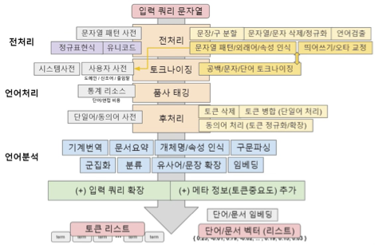
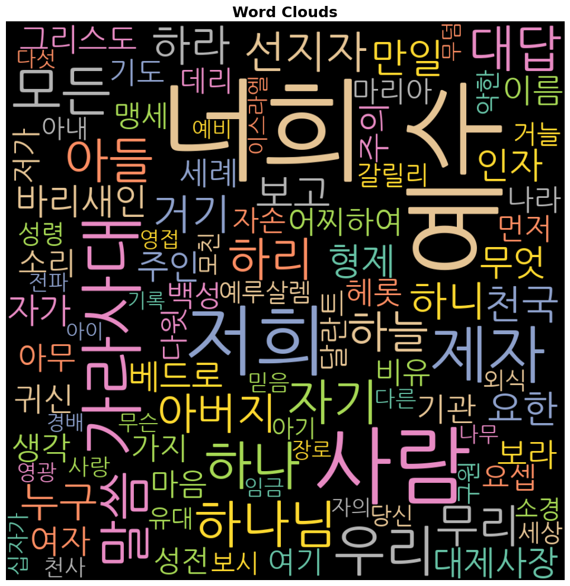

## 자연어 처리(NLP) 개요

자연어 처리(Natural Language Processing, NLP)는 인간의 언어를 컴퓨터가 이해하고 처리할 수 있도록 하는 인공지능의 핵심 분야이다. 텍스트 데이터에서 의미 있는 정보를 추출하고, 언어 구조를 분석하며, 기계가 인간의 언어를 생성·번역·요약할 수 있게 한다.

::: {.callout-note title="텍스트 마이닝(Text Mining) 처리 흐름"}
```
원시 텍스트 → 전처리(Preprocessing) → 형태소 분석 →
특징 추출(Feature Extraction) → 분석/모델링 → 결과 해석
```

| 단계 | 주요 작업 | 도구 |
|------|-----------|------|
| 데이터 수집 | PDF, 웹 크롤링, API | PyPDF2, pdfplumber, requests |
| 전처리 | 노이즈 제거, 정규화 | re, pandas |
| 형태소 분석 | 토크나이징, 품사 태깅 | KoNLPy, MeCab |
| 특징 추출 | 빈도, TF-IDF, 임베딩 | sklearn, gensim |
| 시각화 | 워드클라우드, 네트워크 | wordcloud, networkx |
:::

---

### 1. 데이터 읽어오기 pdf ➝ 문자열

텍스트 마이닝의 출발점은 원시(raw) 데이터를 파이썬이 처리할 수 있는 **문자열(string)** 형태로 변환하는 것이다. PDF는 가장 흔한 문서 형식 중 하나로, Python에서는 PyPDF2와 pdfplumber 두 가지 주요 라이브러리를 통해 텍스트를 추출할 수 있다.

#### 1. pdf ➝ 문자열

::: {.callout-tip title="PyPDF2 vs pdfplumber 비교"}
| 항목 | PyPDF2 | pdfplumber |
|------|--------|-----------|
| 속도 | 빠름 | 보통 |
| 정확도 | 보통 | 높음 |
| 표·레이아웃 처리 | 미지원 | 지원 |
| 한글 처리 | 불안정 | 안정적 |
| 권장 용도 | 간단한 영문 PDF | 복잡한 레이아웃, 한글 PDF |
:::

##### 로컬/Drive 데이터
```python
# pdf 데이터 문자열 읽기

!pip install PyPDF2

# importing required modules
import PyPDF2

url = '/content/drive/MyDrive/eBook python codes/mathew.pdf'
pdfFileObj = open(url, 'rb')           # 'rb': read binary — PDF는 이진 파일
pdfReader = PyPDF2.PdfReader(pdfFileObj)  # PdfFileReader → PdfReader (v3.x 변경)
print(len(pdfReader.pages))               # numPages → len(pages) (v3.x 변경)
pageObj = pdfReader.pages[0]              # getPage(0) → pages[0] (v3.x 변경)

pdf_str = pageObj.extract_text()  # extractText() → extract_text() (v3.x 변경)

print(pdf_str)
```
```text
(마1:8)아사는 여호사밧을 낳고 여호사밧은 요람을 낳고 요람은 웃시야를 낳고
(마1:9)웃시야는 요담을 낳고 요담은 아하스를 낳고 아하스는 히스기야를 낳고
(마1:10)히스기야는 므낫세를 낳고 므낫세는 아몬을 낳고 아몬은 요시야를 낳고(마1:11)바벨론으로 이거할 때에 요시야는 여고냐와 그의 형제를 낳으니라
```

::: {.callout-note title="코드 설명 — PyPDF2"}
- `open(url, 'rb')`: 파일을 **이진 읽기(read binary)** 모드로 열기. PDF는 텍스트가 아닌 이진 파일이므로 `'rb'` 필수.
- `PdfReader`: PDF 문서 전체를 파싱하는 객체. `.pages`로 페이지 리스트에 접근.
- `extract_text()`: 페이지 내 텍스트를 문자열로 반환. 레이아웃 정보는 손실됨.
- **PyPDF2 버전 주의**: v3.x 이후 API가 대폭 변경되어 구버전 코드(`PdfFileReader`, `numPages`, `extractText`)는 동작하지 않음.
:::

##### 웹 URL 데이터
```python
# 설치 (최초 1회만 실행)
!pip install pdfplumber requests

import pdfplumber
import requests
from io import BytesIO

# PDF 파일 URL
pdf_url = 'https://by-sekwon.github.io/api/mathew.pdf'

# URL에서 PDF 다운로드 → 메모리(BytesIO)로 읽기
response = requests.get(pdf_url)
response.raise_for_status()  # 다운로드 실패(4xx, 5xx) 시 예외 발생
pdf_file = BytesIO(response.content)  # 바이트 스트림을 파일 객체처럼 취급

# 전체 텍스트 저장 변수
pdf_str = ""

# PDF 읽기
with pdfplumber.open(pdf_file) as pdf:
    # 페이지별 텍스트 추출
    for page in pdf.pages:
        page_text = page.extract_text()
        # None 방지: 빈 페이지(이미지만 있는 페이지)는 None 반환
        if page_text:
            pdf_str += page_text + "\n"

# 확인
print(type(pdf_str))      # <class 'str'>
print(pdf_str[:1000])     # 앞 1000자 출력
```
```text
(마1:8)아사는 여호사밧을 낳고 여호사밧은 요람을 낳고 요람은 웃시야를 낳고
(마1:9)웃시야는 요담을 낳고 요담은 아하스를 낳고 아하스는 히스기야를 낳고
(마1:10)히스기야는 므낫세를 낳고 므낫세는 아몬을 낳고 아몬은 요시야를 낳고
```

::: {.callout-note title="코드 설명 — pdfplumber + requests"}
- `requests.get(url)`: HTTP GET 요청으로 파일을 바이트(bytes) 형태로 다운로드.
- `raise_for_status()`: 4xx(클라이언트 오류), 5xx(서버 오류) 응답 시 즉시 예외를 발생시켜 오류를 빠르게 감지.
- `BytesIO(response.content)`: 메모리상의 바이트 데이터를 파일처럼 다루는 버퍼 객체. 디스크에 저장하지 않고 바로 PDF 파서에 전달 가능.
- `pdfplumber.open()`: `with` 문으로 열어 사용 후 자동으로 파일을 닫아 메모리 누수 방지.
- `page.extract_text()`: 페이지 레이아웃을 고려하여 텍스트 추출. 빈 페이지는 `None` 반환.
- `if page_text`: `None`이나 빈 문자열일 때를 방어하는 조건 처리.
:::

::: {.callout-tip title="결과 해석"}
추출된 텍스트에는 `(마1:8)`, `(마1:9)` 같은 **장절 표기**가 포함되어 있다. 이는 자연어 분석에 불필요한 노이즈이므로 다음 단계인 전처리에서 제거해야 한다. `pdf_str`은 모든 페이지의 텍스트가 하나의 긴 문자열로 연결된 상태이다.
:::

---

#### 2. 문자열(String) 불필요 문자 정리

텍스트 데이터를 형태소 분석하기 전에 숫자, 특수문자, 분석에 불필요한 패턴 등을 사전에 제거하는 **전처리(Preprocessing)** 단계가 필요하다. Python에서는 **정규표현식(Regular Expression)** 을 활용하여 효율적으로 불필요한 문자를 제거할 수 있다.

::: {.callout-note title="정규표현식(Regex) 핵심 패턴"}
| 패턴 | 의미 | 예시 |
|------|------|------|
| `[가-힣]` | 완성형 한글 범위 | '아' ~ '힣' |
| `[ㄱ-ㅎ]` | 한글 자음 범위 | ㄱ, ㄴ, ㄷ ... |
| `[ㅏ-ㅣ]` | 한글 모음 범위 | ㅏ, ㅑ, ㅓ ... |
| `[^...]` | 대괄호 안 문자 **이외** | `[^가-힣]` = 한글 제외 모두 |
| `\d` | 숫자(0-9) | `\d+` = 연속 숫자 |
| `\s` | 공백 문자 | 스페이스, 탭, 줄바꿈 |
| `+` | 1회 이상 반복 | `a+` = 'a', 'aa', 'aaa' |
| `*` | 0회 이상 반복 | `a*` = '', 'a', 'aa' |
| `?` | 0 또는 1회 | `a?` = '', 'a' |
| `\(?` | 괄호 `(` 이 있을 수도 없을 수도 | 선택적 매칭 |
:::

문자열 형태로 저장된 텍스트에서 한글 이외의 문자(숫자, 특수문자, 영문자 등)를 제거한다. Python의 `re.sub()` 함수로 처리한다.

```python
import re

# 줄바꿈을 먼저 공백으로 변환
ds_str2 = pdf_str.replace('\n', ' ')

# 장절 표기 패턴 제거: (마 1), 마1, 마 1 등 "마+숫자" 형태 모두 제거
ds_str2 = re.sub(r'\(?\s*마\s*\d+\s*\)?', ' ', ds_str2)

# 한글, 공백을 제외한 모든 문자 제거
ds_str2 = re.sub('[^ㄱ-ㅎㅏ-ㅣ가-힣 ]', '', ds_str2)

# 연속된 공백을 하나로 정리
ds_str2 = re.sub(' +', ' ', ds_str2).strip()

# 결과 확인
print(ds_str2[0:100])
```
```text
아사는 여호사밧을 낳고 여호사밧은 요람을 낳고 요람은 웃시야를 낳고 웃시야는 요담을 낳고 요담은 아하스를 낳고 아하스는 히스기야를 낳고 히스기야는 므낫세를 낳고 므낫세는 아몬을 낳
```

::: {.callout-note title="코드 설명 — 정규표현식 전처리"}
**각 단계별 역할:**

1. `replace('\n', ' ')`: 줄바꿈 문자를 공백으로 치환. 줄바꿈이 남아있으면 이후 분석에서 단어가 분리될 수 있음.

2. `re.sub(r'\(?\s*마\s*\d+\s*\)?', ' ', ds_str2)`:
   - `\(?` : 여는 괄호 `(` 가 있을 수도, 없을 수도 있음 (`?` = 선택)
   - `\s*` : 공백이 0개 이상 (공백 유연하게 처리)
   - `마` : 고정 문자 '마'
   - `\d+` : 숫자 1개 이상 (장 번호)
   - `\)?` : 닫는 괄호가 있을 수도, 없을 수도 있음

3. `re.sub('[^ㄱ-ㅎㅏ-ㅣ가-힣 ]', '', ds_str2)`:
   - `^` (대괄호 내부): **부정(NOT)** 의 의미
   - `ㄱ-ㅎ`: 한글 자음 전체
   - `ㅏ-ㅣ`: 한글 모음 전체
   - `가-힣`: 완성형 한글 전체
   - 마지막 ` `: 공백 유지
   - 결론: 한글과 공백 **이외의 모든 문자** 를 제거

4. `re.sub(' +', ' ', ...).strip()`: 여러 개의 연속 공백을 하나로 압축하고 양쪽 공백 제거.
:::

::: {.callout-tip title="결과 해석"}
`(마1:8)`, `(마1:9)` 같은 장절 표기와 `:`, 숫자가 모두 제거되고 **순수 한글 텍스트**만 남았다. 단, 이 방식은 모든 내용이 하나의 긴 문자열로 이어지므로 **문장 단위 분석이 불가능**하다는 한계가 있다.
:::

::: {.callout-important title="문자열(str) vs 데이터프레임(DataFrame) 방식 비교"}
| 방식 | 장점 | 단점 | 적합한 분석 |
|------|------|------|-------------|
| 문자열(str) | 처리 간단, 전체 빈도 파악 용이 | 문장 단위 분석 불가 | 전체 빈도 분석, 워드클라우드 |
| 데이터프레임 | 문장 단위 분석 가능, 필터링 용이 | 처리 복잡 | 감성분석, TF-IDF, 문서 분류 |

> **형태소 분석 시 데이터프레임 방식을 권장한다.**
:::

##### 데이터프레임에서 불필요 문자 정리
```python
# 데이터프레임으로 읽어오기
import pandas as pd

# 줄바꿈으로 각 절(verse)을 분리 → 빈 문자열 제거 → 양쪽 공백 제거
verse_list = [v.strip() for v in pdf_str.split('\n') if v.strip()]
ds_df = pd.DataFrame(verse_list, columns=['verse'], dtype='str')
type(ds_df), ds_df.head(3)
```
```text
(pandas.core.frame.DataFrame,
                                                verse
 0        (마1:8)아사는 여호사밧을 낳고 여호사밧은 요람을 낳고 요람은 웃시야를 낳고
 1        (마1:9)웃시야는 요담을 낳고 요담은 아하스를 낳고 아하스는 히스기야를 낳고
 2  (마1:10)히스기야는 므낫세를 낳고 므낫세는 아몬을 낳고 아몬은 요시야를 낳고(마...)
```

::: {.callout-note title="코드 설명 — 리스트 컴프리헨션으로 DataFrame 생성"}
- `pdf_str.split('\n')`: 줄바꿈 기준으로 분리 → 각 절(verse)이 하나의 원소가 됨.
- `v.strip()`: 양쪽 공백 제거. `if v.strip()`으로 빈 줄 자동 제거.
- `pd.DataFrame(..., columns=['verse'])`: 리스트를 단일 열 DataFrame으로 변환.
- 결과: 각 행(row)이 성경의 한 절(verse)에 해당하는 구조.
:::

```python
import pandas as pd
# 데이터프레임 열에서 불필요한 문자 일괄 제거
# 1단계: 마태복음 장절 표기 패턴 제거 ('\(마' 이스케이프 처리)
txt = ds_df['verse'].str.replace(r'\(마', '', regex=True)
# 2단계: 한글, 공백 이외의 문자 제거
txt = txt.str.replace('[^ㄱ-ㅎㅏ-ㅣ가-힣 ]', '', regex=True)
# 결과 확인
print(type(txt))
print(txt.head(3))
```
```text
<class 'pandas.core.series.Series'>
0                아사는 여호사밧을 낳고 여호사밧은 요람을 낳고 요람은 웃시야를 낳고
1                웃시야는 요담을 낳고 요담은 아하스를 낳고 아하스는 히스기야를 낳고
2    히스기야는 므낫세를 낳고 므낫세는 아몬을 낳고 아몬은 요시야를 낳고바벨론으로 이거할...
Name: verse, dtype: object
```

::: {.callout-note title="코드 설명 — Series.str 메서드"}
- `Series.str.replace()`: pandas의 벡터화 문자열 연산. `for` 루프 없이 모든 행에 일괄 적용.
- `regex=True`: 정규표현식 패턴으로 처리 (기본값은 리터럴 문자열 치환).
- **반환 타입**: 결과는 DataFrame이 아닌 **pandas Series** (`<class 'pandas.core.series.Series'>`).
- `.str` 접근자: `Series` 객체에서 문자열 메서드를 사용하기 위한 진입점.
:::

::: {.callout-tip title="결과 해석"}
각 행이 하나의 절로 유지되면서 불필요한 문자만 제거되었다. 이 구조를 유지하면 이후 절(verse) 단위로 감성 점수를 계산하거나 TF-IDF를 적용하는 등 **문장 레벨 분석**이 가능해진다.
:::

---

### 2. 한국어 형태소 분석 (Morphological Analysis)

#### 1. 형태소(Morpheme)의 정의

형태소(morpheme)는 언어학에서 **일정한 의미가 있는 가장 작은 말의 단위**로, 더 분석하면 뜻이 없어지는 말의 단위이다. 음소와 마찬가지로 형태소는 추상적인 실체이며, 문장에서 다양한 형태로 실현될 수 있다.

- 의미가 있는 최소의 단위 (minimally meaningful unit)
- 문법적·관계적인 뜻을 나타내는 단어 또는 단어의 부분

예를 들어 "먹었다"는 **먹-(어간) + -었-(과거 시제 선어말어미) + -다(종결 어미)** 세 개의 형태소로 분석된다.

##### 실질형태소와 형식형태소

| **구분** | **별칭** | **정의** | **품사** | **예시** |
|----------|----------|----------|----------|----------|
| 실질형태소 | 어휘형태소 | 어휘적 의미를 갖는 형태소 | 명사, 동사, 형용사, 부사 | "좋-", "정보", "많-" |
| 형식형태소 | 문법형태소 | 문법적 관계를 나타내는 형태소 | 조사, 어미 | "-에", "-는", "-가", "-다" |

::: {.callout-note title="예시: 형태소 분석"}
문장: **"위키백과에는 좋은 정보가 많다."**

| 어절 | 형태소 분리 | 종류 |
|------|-------------|------|
| 위키백과에는 | 위키 + 백과 + 에는 | 어휘 + 어휘 + 문법(조사) |
| 좋은 | 좋- + -은 | 어휘(형용사 어간) + 문법(관형사형 어미) |
| 정보가 | 정보 + -가 | 어휘(명사) + 문법(주격 조사) |
| 많다 | 많- + -다 | 어휘(형용사 어간) + 문법(종결 어미) |
:::

##### 형태소 분석의 과정

- 단어(또는 어절)를 구성하는 각 형태소를 분리한다.
- 분리된 형태소의 기본형(lemma) 및 품사(POS) 정보를 추출한다.
- **분석 후보 생성:** (1) 문법 규칙에 맞는 후보 생성, (2) 형태소 분리와 기본형 추정
- **분석 후보 선택:** (1) 형태소끼리의 결합 제약 조건 만족, (2) 사전에서 기본형 확인

{fig-align="center" width="60%"}


#### 2. 형태소 분석의 관점

| **관점** | **목표** | **방법** | **특징** |
|----------|----------|----------|----------|
| 언어학/국어학 | 형태론적 언어 현상의 발견·규명 | 인간의 언어 능력 기반 | 정성적(qualitative) |
| 전산 언어학 | 컴퓨터 프로그램으로 형태소 분석 | 알고리즘·통계 기반 | 정량적(quantitative) |

##### 전산 언어학 관점의 평가 기준

- **처리 범위 (분석률):** 다양한 형태론적 현상들을 컴퓨터로 처리할 수 있는가
- **정확성:** 얼마나 정확한 분석을 수행하는가
- **처리 속도:** 시스템이 얼마나 효율적으로 동작하는가
- **기억 공간:** 메모리를 효율적으로 사용하는가

::: {.callout-tip title="한국어가 형태소 분석이 어려운 이유"}
한국어는 **교착어(agglutinative language)** 로, 어간에 다양한 어미·조사가 결합하여 의미를 변화시킨다. 같은 어근이라도 결합하는 형태소에 따라 음운 변화(연음, 축약, 탈락)가 발생하기 때문에 영어보다 형태소 분석이 훨씬 복잡하다.

- 예: "먹다" → 먹어, 먹으니, 먹고, 먹어서, 먹겠다, 먹히다...
:::

#### 3. KoNLPy를 이용한 한국어 형태소 분석

KoNLPy(Korean Natural Language Processing in Python)는 한국어 형태소 분석을 위한 대표적인 Python 라이브러리이다. 내부적으로 여러 형태소 분석기를 지원하며, 그 중 **Okt(Open Korean Text)** 는 트위터에서 개발한 오픈소스 한국어 처리 라이브러리로 소셜 미디어 텍스트 분석에 특히 효과적이다.

::: {.callout-note title="KoNLPy 주요 형태소 분석기 비교"}
| 분석기 | 기반 | 특징 | 속도 | 정확도 |
|--------|------|------|------|--------|
| **Okt** (구 Twitter) | Java | SNS 텍스트 특화, 신조어 처리 강점 | 빠름 | 중상 |
| **Kkma** | Java | 세밀한 품사 체계(57개), 오분석 적음 | 느림 | 높음 |
| **Hannanum** | Java | KAIST 개발, 표준 국어 분석 | 보통 | 높음 |
| **Komoran** | Java | 미등록어 처리 강점, 사용자 사전 지원 | 빠름 | 높음 |
| **MeCab** | C++ | 가장 빠름, 형태소 분석 정확도 높음 | 매우 빠름 | 매우 높음 |

> 일반적인 한국어 텍스트 분석에는 **Okt** 또는 **Komoran** 을 권장.
:::

##### KoNLPy 설치 및 품사 태그 체계

```python
# KoNLPy 설치
!pip install konlpy
# Okt 품사 태그 체계 확인
from konlpy.tag import Okt
okt = Okt()
print(okt.tagset)
```
```text
{'Adjective': '형용사', 'Adverb': '부사', 'Determiner': '관형사',
 'Exclamation': '감탄사', 'Josa': '조사', 'Noun': '명사',
 'Verb': '동사', 'Alpha': '영문자', 'Punctuation': '구두점',
 'Foreign': '외국어', 'Number': '숫자', 'Unknown': '알 수 없는 단어'}
```

::: {.callout-note title="Okt 품사 태그 활용 가이드"}
| 태그 | 한국어 | 텍스트 분석 활용 |
|------|--------|-----------------|
| Noun | 명사 | 핵심 키워드 추출 — **가장 많이 사용** |
| Verb | 동사 | 행동/사건 분석 |
| Adjective | 형용사 | **감성분석**에 핵심 (좋다, 나쁘다, 아름답다) |
| Adverb | 부사 | 강도 분석 (매우, 정말, 별로) |
| Josa | 조사 | 일반적으로 불용어 처리 |
| Unknown | 미등록어 | 신조어, 고유명사 — 별도 처리 필요 |
:::

##### 데이터프레임에서 명사만 추출하기
```python
from konlpy.tag import Okt
text = []    # 분석 결과를 저장할 리스트
okt = Okt()  # Okt 형태소 분석기 초기화

# 각 문장(행)에서 명사만 추출
for k in range(0, txt.shape[0]):
    nouns = okt.nouns(str(txt[k]))  # 명사만 추출
    text.append(nouns)

# 참고: 주요 분석 메서드
# okt.phrases(text) : 어구(구문) 단위 추출
# okt.nouns(text)   : 명사만 추출
# okt.pos(text)     : 모든 형태소 + 품사 태깅

print(type(text))
print(text[0:5])  # 첫 5개 문장 결과 출력
```
```text
<class 'list'>
[['아사', '여호사밧', '여호사밧', '요람', '요람', '웃시야'],
 ['웃시야', '요담', '요담', '아하스', '아하스', '히스기야'],
 ['히스기야', '므낫세', '므낫세', '아몬', '아몬', '요시야', '바벨론', '거', '때', '요시야', '여고', '그', '형제'],
 ['바벨론', '거', '후', '스알디엘', '스알디엘', '스룹바벨'],
 ['스룹바벨', '아비훗', '아비훗', '엘리', '김', '엘리', '김', '아소르', '르', '사독', '사독', '아킴를', '아킴', '엘리', '웃']]
```

::: {.callout-note title="코드 설명 — 명사 추출 루프"}
- `okt.nouns(str(txt[k]))`: k번째 절(행)을 문자열로 변환 후 명사만 추출. 결과는 명사 리스트.
- `text.append(nouns)`: 각 절의 명사 리스트를 상위 리스트에 추가 → **중첩 리스트(list of lists)** 구조 생성.
- `txt.shape[0]`: Series의 행 수(전체 절 개수)로 반복 범위 설정.
:::

::: {.callout-tip title="결과 해석"}
각 절에서 명사만 추출된 중첩 리스트를 얻었다. 고유명사(인명)가 대부분을 차지하며, '거', '때', '그' 같은 **1글자 단어**와 의미가 약한 의존 명사가 포함되어 있다. 이후 불용어 처리와 길이 필터링으로 제거할 필요가 있다.
:::

### 품사 태깅 (POS Tagging)

**품사 태깅(Part-of-Speech Tagging)** 은 텍스트의 각 형태소에 해당하는 품사를 자동으로 부착하는 작업이다. 단순 명사 추출보다 풍부한 언어 정보를 담고 있어 더 정교한 분석이 가능하다.

`okt.pos()`를 사용하면 각 형태소에 품사 태그가 부여된 **튜플 리스트** 를 반환한다.
- `norm=True` 옵션: 맞춤법 정규화 (예: "않됬다" → "않됐다")
- `stem=True` 옵션: 어간 추출 (예: "낳고", "낳아서" → "낳다")

```python
# 품사 태깅 — 데이터프레임 방식
from konlpy.tag import Okt
text2 = []
okt = Okt()

# 각 문장에서 품사 태깅 수행
for k in range(0, txt.shape[0]):
    tagged = okt.pos(str(txt[k]))  # 모든 형태소 + 품사 태깅
    text2.append(tagged)

print(text2[1])  # 두 번째 문장 태깅 결과
```
```text
[('웃시야', 'Noun'), ('는', 'Josa'), ('요담', 'Noun'), ('을', 'Josa'),
 ('낳고', 'Verb'), ('요담', 'Noun'), ('은', 'Josa'), ('아하스', 'Noun'),
 ('를', 'Josa'), ('낳고', 'Verb'), ('아하스', 'Noun'), ('는', 'Josa'),
 ('히스기야', 'Noun'), ('를', 'Josa'), ('낳고', 'Verb')]
```

::: {.callout-tip title="결과 해석 — 품사 태깅 결과"}
각 어절이 형태소 단위로 분리되어 `(형태소, 품사)` 튜플 형태로 반환된다.

- 명사(`Noun`): 웃시야, 요담, 아하스, 히스기야 — 인명(고유명사)
- 조사(`Josa`): 는, 을, 은, 를 — 한국어의 격 관계 표시
- 동사(`Verb`): 낳고 — 행위 표현

이처럼 품사 태깅 결과를 활용하면 특정 품사만 선택적으로 추출하여 분석 목적에 맞는 어휘 집합을 구성할 수 있다.
:::

```python
# 문자열 전체에 형태소 분석 적용
# norm=True: 맞춤법 정규화 / stem=True: 어간 추출
okt_pos = Okt().pos(ds_str2, norm=True, stem=True)
print(type(okt_pos))
print(okt_pos[0:10])  # 처음 10개 결과 출력
```
```text
<class 'list'>
[('아사', 'Noun'), ('는', 'Josa'), ('여호사밧', 'Noun'), ('을', 'Josa'),
 ('낳다', 'Verb'), ('여호사밧', 'Noun'), ('은', 'Josa'), ('요람', 'Noun'),
 ('을', 'Josa'), ('낳다', 'Verb')]
```

::: {.callout-note title="코드 설명 — stem=True 옵션 효과"}
`stem=True` 적용 전후를 비교하면:

| 원형 | stem=False | stem=True |
|------|-----------|-----------|
| 낳고 | 낳고(Verb) | **낳다**(Verb) |
| 낳아서 | 낳아서(Verb) | **낳다**(Verb) |
| 낳으니 | 낳으니(Verb) | **낳다**(Verb) |

동사의 다양한 활용형이 기본형(낳다)으로 통일되므로 **동일 어휘가 분산되지 않고 합산**된다. 빈도 분석 시 정확도가 높아진다.
:::

##### 원하는 품사만 필터링

```python
# 명사(Noun)만 필터링 — 리스트 컴프리헨션 활용
okt_nouns = [word for word, pos in okt_pos if pos == 'Noun']

# 복수 품사 필터링 (명사 + 형용사 + 동사)
target_pos = ['Noun', 'Adjective', 'Verb']
okt_filtering = [word for word, pos in okt_pos if pos in target_pos]

print(type(okt_filtering))
print(okt_filtering[0:5])
```
```text
<class 'list'>
['아사', '여호사밧', '낳다', '여호사밧', '요람']
```

::: {.callout-note title="코드 설명 — 리스트 컴프리헨션 필터링"}
`[word for word, pos in okt_pos if pos == 'Noun']`

- `for word, pos in okt_pos`: 튜플 리스트를 `word`와 `pos` 두 변수로 언패킹(unpacking)
- `if pos == 'Noun'`: 품사가 명사인 경우만 선택
- `word`: 조건을 만족한 단어만 최종 리스트에 포함

`if pos in target_pos`는 여러 품사를 동시에 필터링할 때 사용. 감성분석에서는 형용사와 동사까지 포함하면 더 풍부한 감성 표현을 포착할 수 있다.
:::

---

### 3. 단어 분석 (Word Analysis)

#### 1. 단어 빈도 분석 (Word Frequency)

**단어 빈도 분석(Word Frequency Analysis)** 은 텍스트에서 특정 단어가 얼마나 자주 등장하는지를 계산하는 가장 기본적인 텍스트 분석 방법이다. 어떤 주제나 개념이 문서에서 중요한지를 파악하는 첫 번째 단서가 된다.

::: {.callout-note title="단어 빈도 vs TF-IDF"}
| 방법 | 정의 | 장점 | 단점 |
|------|------|------|------|
| **단어 빈도(TF)** | 문서 내 단어 등장 횟수 | 직관적, 계산 단순 | '그', '이', '있다' 같은 일반 단어가 높은 순위 |
| **TF-IDF** | TF × IDF (역문서빈도) | 해당 문서에서 특별히 중요한 단어 부각 | 여러 문서 비교 필요 |

$$\text{TF-IDF}(t, d) = \text{TF}(t, d) \times \log\frac{N}{\text{DF}(t)}$$

- $t$: 단어, $d$: 문서, $N$: 전체 문서 수, $\text{DF}(t)$: 단어 $t$가 등장한 문서 수
- **IDF가 높은 단어** = 특정 문서에만 등장 = 해당 문서의 핵심 키워드
:::

##### 단어장(Vocabulary) 구성 및 불용어 처리
```python
import itertools
import collections
import pandas as pd
from konlpy.tag import Okt

okt = Okt()
okt_pos = okt.pos(ds_str2, norm=True, stem=True)

# 명사(Noun)만 필터링
okt_nouns = [word for word, pos in okt_pos if pos == 'Noun']

# 복수 품사 필터링 (명사 + 형용사 + 동사)
target_pos = ['Noun', 'Adjective', 'Verb']
okt_filtering = [word for word, pos in okt_pos if pos in target_pos]

print(type(okt_filtering))
print(okt_filtering[0:5])

# 불용어(Stop Words) 설정
# 분석 목적에 따라 제거할 단어를 공백으로 구분하여 지정
stop_words = ''
stop_words = set(stop_words.split(' '))

# 불용어 제거 + 길이 1 이하 제거
words = [w for w in okt_nouns if w not in stop_words and len(w) > 1]

print(type(words))
print(words[0:10])
```
```text
<class 'list'>
['아사', '여호사밧', '낳다', '여호사밧', '요람']
<class 'list'>
['아사', '여호사밧', '여호사밧', '요람', '요람', '웃시야', '웃시야', '요담', '요담', '아하스']
```

::: {.callout-note title="코드 설명 — 불용어(Stop Words) 처리"}
**불용어(Stop Words)** 란 분석에서 의미 없이 자주 등장하는 단어로, 분석 전에 제거한다.

- 한국어 일반 불용어: 그, 이, 저, 것, 수, 등, 및, 또, 더, 잘, 못
- `set(stop_words.split(' '))`: 공백 구분 문자열을 집합(set)으로 변환 → **O(1) 시간 복잡도**로 빠른 존재 여부 확인
- `len(w) > 1`: 1글자 단어 제거. '거', '때', '그' 같은 불용어성 단음절어 제거 효과
- 두 조건을 `and`로 결합: 불용어이거나 1글자인 단어 모두 제거

> 실제 프로젝트에서는 도메인에 맞는 불용어 사전을 구축하여 활용한다.
:::

##### 단어 빈도 계산 및 데이터프레임 저장
```python
# 상위 k개 단어 빈도 분석
k = 20  # 빈도 상위 k개 단어 출력
word_count = collections.Counter(words)
word_freq = pd.DataFrame(word_count.most_common(k), columns=['words', 'count'])
word_freq = word_freq.dropna()  # 결측값 제거
print(type(word_freq))
print(word_freq.head(5))
```
```text
<class 'pandas.core.frame.DataFrame'>
  words  count
0   마리아      5
1    요셉      5
2    예수      5
3   바벨론      4
4    엘리      4
```

::: {.callout-note title="코드 설명 — Counter + most_common()"}
- `collections.Counter(words)`: 리스트의 각 원소 빈도를 자동으로 계산. 결과는 딕셔너리형 객체(`{단어: 빈도}`).
- `.most_common(k)`: 빈도 내림차순으로 상위 k개 `(단어, 빈도)` 튜플 리스트 반환.
- `pd.DataFrame(..., columns=['words', 'count'])`: 튜플 리스트를 열 이름이 있는 DataFrame으로 변환.
:::

::: {.callout-tip title="결과 해석 — 마태복음 1장 단어 빈도"}
상위 빈도 단어가 `마리아(5)`, `요셉(5)`, `예수(5)`, `바벨론(4)`, `엘리(4)`인 결과는 마태복음 1장의 내용인 **예수의 족보**와 **탄생 예고** 내러티브를 반영한다.

- **마리아, 요셉**: 예수의 어머니와 약혼자로 탄생 장면에서 반복 등장
- **예수**: 본문의 핵심 인물
- **바벨론**: 족보 중간 지점으로 여러 번 언급
- **엘리**: 족보에 등장하는 인명

이처럼 단어 빈도는 **문서의 주제와 핵심 인물**을 빠르게 파악하는 데 유용하다.
:::

---

#### 2. 단어 동시 발생 빈도 (Co-occurrence Matrix)

**동시 발생 행렬(Co-occurrence Matrix)** 은 두 단어가 같은 문장(또는 문서) 안에서 함께 등장하는 빈도를 행렬 형태로 표현한 것이다.

::: {.callout-note title="Bigram과 동시 발생 행렬 이론"}
**Bigram**: 연속된 두 단어의 쌍. `['A', 'B', 'C', 'D']` → `[('A','B'), ('B','C'), ('C','D')]`

**동시 발생 행렬의 구조:**

$$M[i][j] = \text{단어 } j \text{ 다음에 단어 } i \text{ 가 등장한 횟수}$$

```
         아사  여호사밧  요람
아사      0      1      0
여호사밧   0      0      1
요람      0      0      0
```

→ "아사 → 여호사밧" 1회, "여호사밧 → 요람" 1회

**활용 분야:**
- 연관어 분석: 특정 키워드와 자주 함께 등장하는 단어 파악
- 키워드 네트워크: 단어 간 관계를 그래프로 시각화
- 언어 모델: 단어 예측 확률 계산의 기초
:::

##### 동시 발생 행렬 생성 함수
```python
import nltk
import numpy as np
import pandas as pd
import itertools
from nltk import bigrams

def generate_co_occurrence_matrix(corpus):
    """
    단어 리스트(corpus)로부터 Bigram 기반 동시 발생 행렬을 생성한다.
    Returns:
        co_occurrence_matrix : numpy.matrix (단어 x 단어 빈도 행렬)
        vocab_index          : dict (단어 → 행렬 인덱스)
    """
    vocab = list(set(corpus))                          # 고유 단어 목록 (중복 제거)
    vocab_index = {word: i for i, word in enumerate(vocab)}  # 단어 → 인덱스 사전

    # Bigram 생성 및 빈도 계산
    bi_grams = list(bigrams(corpus))                   # 연속된 두 단어 쌍 생성
    bigram_freq = nltk.FreqDist(bi_grams).most_common(len(bi_grams))  # 빈도순 정렬

    # 동시 발생 행렬 초기화 (모든 값 0)
    co_matrix = np.zeros((len(vocab), len(vocab)))

    # 빈도 채우기
    for bigram in bigram_freq:
        current  = bigram[0][1]           # 현재 단어 (뒤)
        previous = bigram[0][0]           # 이전 단어 (앞)
        count    = bigram[1]              # 해당 bigram 등장 횟수
        pos_cur  = vocab_index[current]
        pos_prev = vocab_index[previous]
        co_matrix[pos_cur][pos_prev] = count  # 행: 현재, 열: 이전

    return np.matrix(co_matrix), vocab_index

# 동시 발생 행렬 생성
matrix, vocab_index = generate_co_occurrence_matrix(words)

# DataFrame으로 변환 (행/열 레이블 = 단어)
data_matrix = pd.DataFrame(
    matrix,
    index=vocab_index.keys(),
    columns=vocab_index.keys()
)

print(data_matrix)  # (고유 단어 수 × 고유 단어 수) 크기의 행렬
```
```text
     대접   결코   바니   판결   얼굴   산나   영접   몰약  바리새인   둘째  ...   더욱   여행   안식  \
대접  0.0  0.0  0.0  0.0  0.0  0.0  0.0  0.0   1.0  0.0  ...  0.0  0.0  0.0
결코  0.0  0.0  0.0  0.0  0.0  0.0  0.0  0.0   0.0  0.0  ...  0.0  0.0  0.0
바니  0.0  0.0  0.0  0.0  0.0  0.0  0.0  0.0   0.0  0.0  ...  0.0  0.0  0.0
```

::: {.callout-note title="코드 설명 — 동시 발생 행렬 생성 함수"}
1. `set(corpus)`: 리스트에서 중복을 제거하여 고유 단어(어휘) 목록 생성.
2. `vocab_index`: 각 단어를 행렬의 인덱스 번호로 매핑. `{'단어': 0, '단어2': 1, ...}`
3. `bigrams(corpus)`: NLTK의 함수로 연속된 두 단어 쌍 생성. `[A, B, C]` → `[(A,B), (B,C)]`
4. `FreqDist`: NLTK의 빈도 분포 클래스. 각 bigram의 등장 횟수를 자동 계산.
5. `co_matrix[pos_cur][pos_prev] = count`: **행은 현재 단어, 열은 이전 단어** 로 방향성 있는 동시 발생 정보를 저장.
6. `np.zeros(...)`: 0으로 초기화된 행렬. 행렬 크기 = `(고유 단어 수) × (고유 단어 수)`.
:::

::: {.callout-tip title="결과 해석 — 동시 발생 행렬"}
행렬의 대부분이 0으로 채워진 **희소 행렬(sparse matrix)** 이다. 이는 자연어에서 모든 단어 쌍이 함께 등장하지 않기 때문에 자연스러운 현상이다. 0이 아닌 값이 있는 위치가 실제 단어 간 연관 관계를 나타낸다.

- `data_matrix['대접']['바리새인'] = 1.0`: "바리새인" 다음에 "대접"이 1회 등장
- 행렬 크기가 `(고유단어 수)²` 이므로 어휘 크기가 크면 메모리 사용량이 급증한다는 점을 유의.
:::

##### 특정 키워드 연관어 분석
```python
# 특정 키워드와 동시 발생 빈도가 높은 단어 출력
keyword = '그리스도'

# 해당 키워드와 1회 이상 동시 발생한 단어만 선택, 내림차순 정렬
result = (data_matrix[data_matrix[keyword] > 0][keyword]
          .sort_values(ascending=False))

print(f"[ '{keyword}' 연관어 분석 결과 ]")
print(result.head(10))
```
```text
[ '그리스도' 연관어 분석 결과 ]
예수    4.0
칭하    3.0
유대    2.0
모친    2.0
우리    2.0
어찌    1.0
거짓    1.0
대하    1.0
광야    1.0
여기    1.0
Name: 그리스도, dtype: float64
```

::: {.callout-tip title="결과 해석 — 그리스도 연관어 분석"}
'그리스도' 앞에 가장 많이 등장한 단어들:

- **예수(4)**: "예수 그리스도"가 4번 등장 — 예수의 공식 호칭으로 사용
- **칭하(3)**: "그리스도라 칭하는" 표현 — 정체성 선언 맥락
- **유대(2)**: "유대인의 왕 그리스도" 맥락 — 정치적·종교적 의미
- **모친(2)**: 예수 탄생 관련 절에서 등장

이 결과는 **텍스트 내 '그리스도'의 사용 맥락**을 보여준다. 연관어 분석을 통해 단순 빈도보다 풍부한 의미적 관계를 파악할 수 있다.
:::

::: {.callout-tip title="네트워크 시각화 확장 방법"}
동시 발생 행렬을 **네트워크 그래프**로 시각화하면 단어 간의 관계 구조를 직관적으로 파악할 수 있다.

```python
# 예시 코드 (참고용)
import networkx as nx
import matplotlib.pyplot as plt

G = nx.DiGraph()
threshold = 2  # 빈도 임계값

for word1 in data_matrix.index:
    for word2 in data_matrix.columns:
        if data_matrix[word2][word1] >= threshold:
            G.add_edge(word2, word1, weight=data_matrix[word2][word1])

nx.draw_networkx(G, with_labels=True, font_family='NanumGothic')
plt.show()
```
임계값(threshold)을 높이면 핵심 연관어 관계만 남겨 더 명확한 네트워크를 얻을 수 있다.
:::

---

#### 3. 워드클라우드 시각화 (Word Cloud)

워드클라우드는 **단어 빈도를 글자 크기**로 표현하여 주요 단어를 직관적으로 파악할 수 있는 시각화 기법이다. 빈도가 높을수록 크게 표시되어 한눈에 문서의 핵심 키워드를 파악할 수 있다.

```python
from wordcloud import WordCloud
from collections import Counter
import matplotlib.pyplot as plt

# 단어 빈도 딕셔너리 생성
words_count = Counter(words)

# 빈도 상위 20개 출력
print(words_count.most_common(20))

# 워드클라우드 생성
wordcloud = WordCloud(
    font_path='//content/drive/MyDrive/fonts/NanumGothic-Regular.ttf',
    background_color='black',   # 배경색
    width=1000,                  # 이미지 너비(픽셀)
    height=1000,                 # 이미지 높이(픽셀)
    max_words=100,               # 최대 표시 단어 수
    max_font_size=200,           # 최대 폰트 크기
    colormap='Set2'              # matplotlib 색상 팔레트
)

# 단어 빈도로부터 워드클라우드 생성
wordcloud = wordcloud.generate_from_frequencies(words_count)

# 시각화
plt.figure(figsize=(10, 10))
plt.imshow(wordcloud, interpolation='bilinear')
plt.axis('off')  # 축 숨기기
plt.title('Word Clouds', fontsize=18, fontweight='bold')
plt.tight_layout()
plt.savefig('wordcloud.png', dpi=150, bbox_inches='tight')
plt.show()
```
```text
[('너희', 323), ('예수', 282), ('사람', 170), ('저희', 138),
 ('가라사대', 96), ('제자', 88), ('우리', 67), ('모든', 64),
 ('말씀', 61), ('하나', 60), ('하나님', 59), ('대답', 56),
 ('자기', 54), ('아들', 51), ('하리', 48), ('무리', 46),
 ('선지자', 44), ('하늘', 44), ('아버지', 42), ('하라', 41)]
```
{fig-align="center" width="100%"}

::: {.callout-note title="코드 설명 — WordCloud 주요 파라미터"}
| 파라미터 | 설명 | 권장 설정 |
|----------|------|-----------|
| `font_path` | 한글 폰트 경로 **(필수)** | 시스템에 설치된 한글 폰트 경로 |
| `background_color` | 배경색 | 'white' 또는 'black' |
| `max_words` | 최대 표시 단어 수 | 50~200 |
| `max_font_size` | 가장 큰 단어의 폰트 크기 | 100~300 |
| `colormap` | 색상 팔레트 | 'Set2', 'viridis', 'Pastel1' |
| `width/height` | 출력 이미지 해상도 | 1000×1000 이상 권장 |

`generate_from_frequencies(dict)`: 미리 계산된 빈도 딕셔너리를 입력받아 워드클라우드 생성. `generate(text)`는 내부적으로 빈도를 자동 계산.
:::

::: {.callout-tip title="결과 해석 — 마태복음 전체 워드클라우드"}
상위 빈도 단어 분석:

| 단어 | 빈도 | 의미 해석 |
|------|------|-----------|
| 너희 | 323 | 예수의 가르침과 설교에서 청중을 지칭 |
| 예수 | 282 | 마태복음의 중심 인물 |
| 사람 | 170 | 일반적 지칭 — 교훈적 맥락에서 반복 |
| 저희 | 138 | 3인칭 복수 — 군중, 바리새인 등 지칭 |
| 가라사대 | 96 | "가라사대 ~" 형식의 직접 인용 표현 |
| 제자 | 88 | 예수의 제자들 — 핵심 청중 |
| 하나님 | 59 | 신학적 핵심 용어 |

**너희(323)가 예수(282)보다 빈도가 높은 이유**: 예수의 가르침을 전하는 마태복음의 특성상, 직접 대화 형식("너희에게 이르노니")이 매우 많기 때문이다. 이처럼 워드클라우드는 문서의 **장르적 특성과 저자의 문체**까지 반영한다.

> **주의**: '너희', '저희', '모든', '자기' 같은 고빈도 단어는 의미 분석에서 불용어로 처리하는 것이 적절하다.
:::

::: {.callout-important title="한글 폰트 설정 방법"}
| 환경 | 폰트 경로 |
|------|-----------|
| Google Colab | `/content/drive/MyDrive/fonts/NanumGothic-Regular.ttf` (구글 드라이브에 업로드 후) |
| macOS | `~/Library/Fonts/NanumGothic.ttf` 또는 `/System/Library/Fonts/AppleSDGothicNeo.ttc` |
| Windows | `C:/Windows/Fonts/malgun.ttf` (맑은 고딕) |
| Linux | `sudo apt-get install fonts-nanum` 설치 후 `/usr/share/fonts/truetype/nanum/NanumGothic.ttf` |

```python
# macOS에서 시스템 폰트 자동 탐색
import matplotlib.font_manager as fm
fonts = [f.name for f in fm.fontManager.ttflist if 'Gothic' in f.name or 'Nanum' in f.name]
print(fonts)
```
:::

---

### 주요 함수 및 라이브러리 요약

| **라이브러리** | **주요 함수** | **역할** |
|----------------|--------------|---------|
| re | `re.sub(pattern, repl, str)` | 정규표현식 기반 문자열 치환 |
| pandas | `str.replace(pattern, repl)` | DataFrame 열 문자열 일괄 치환 |
| konlpy.Okt | `okt.nouns(text)` | 명사만 추출 |
| konlpy.Okt | `okt.pos(text, norm, stem)` | 품사 태깅 (정규화·어간 추출 옵션) |
| konlpy.Okt | `okt.morphs(text)` | 형태소 단위로 분리 (품사 제외) |
| itertools | `itertools.chain(*list)` | 중첩 리스트를 단일 리스트로 평탄화 |
| collections | `Counter(words)` | 단어 빈도 계산 |
| collections | `counter.most_common(k)` | 상위 k개 빈도 단어 선택 |
| nltk | `bigrams(corpus)` | Bigram(연속된 두 단어 쌍) 생성 |
| wordcloud | `WordCloud(...).generate_from_frequencies()` | 단어 빈도 기반 워드클라우드 생성 |
| networkx | `nx.DiGraph()` | 방향성 있는 단어 네트워크 그래프 생성 |
