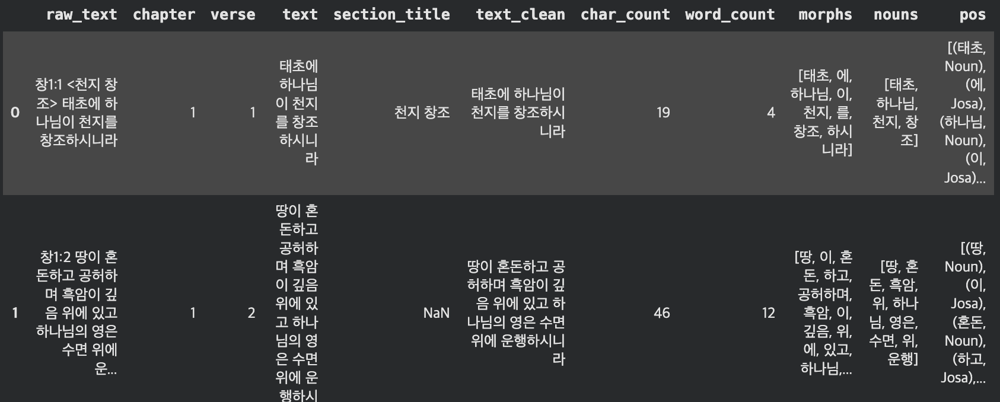
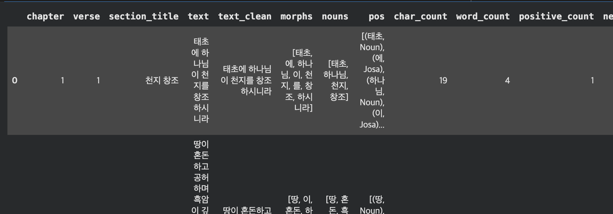
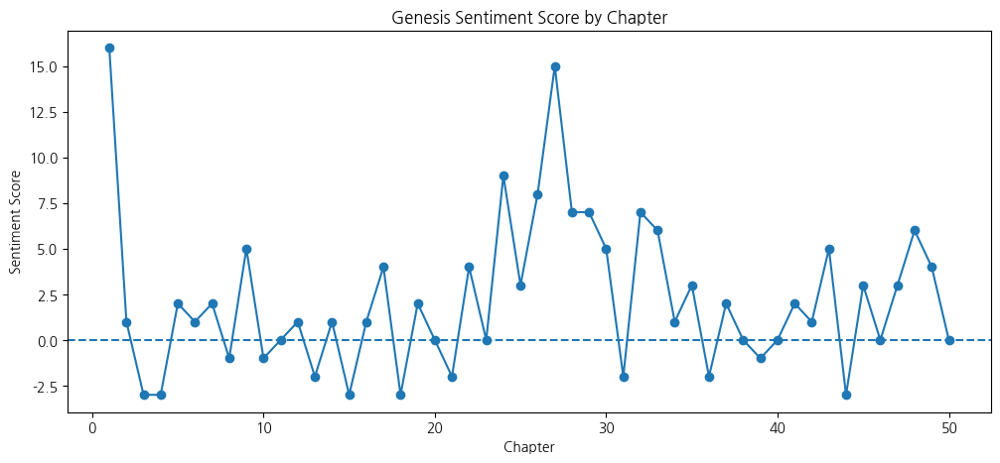
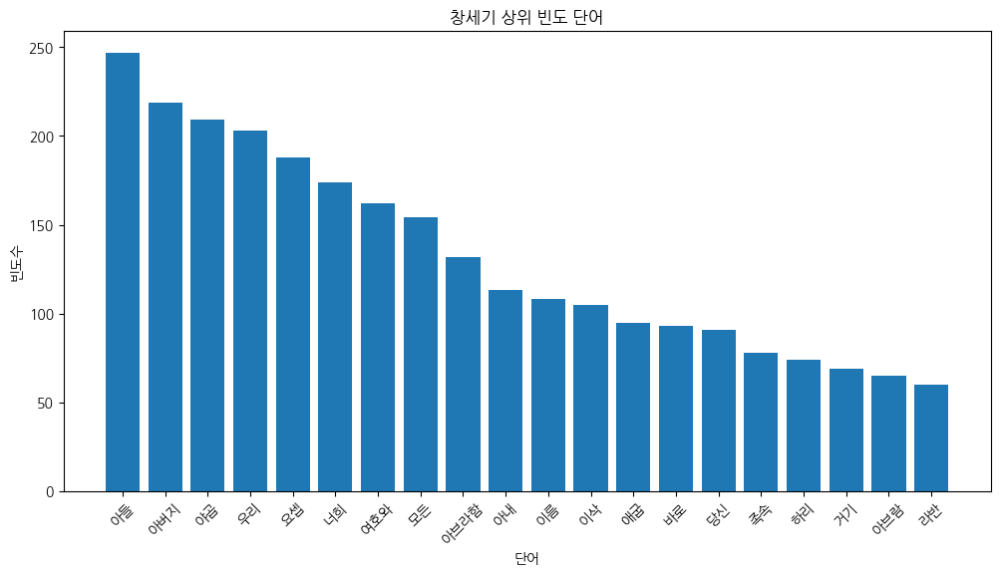
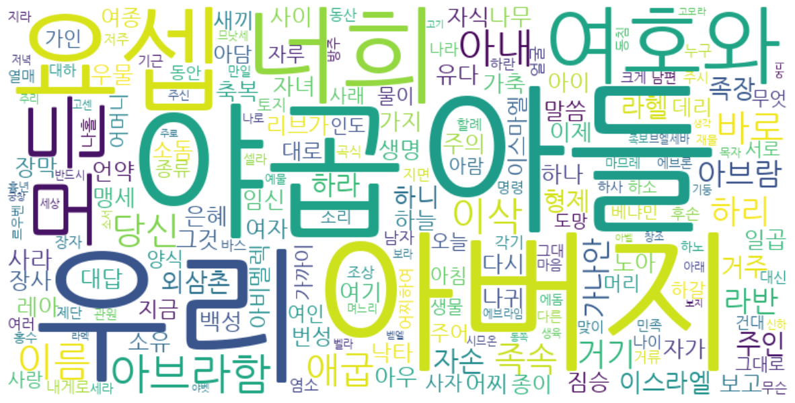
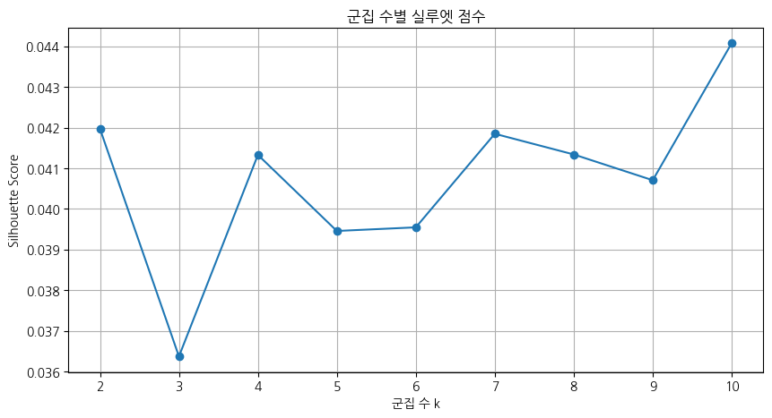
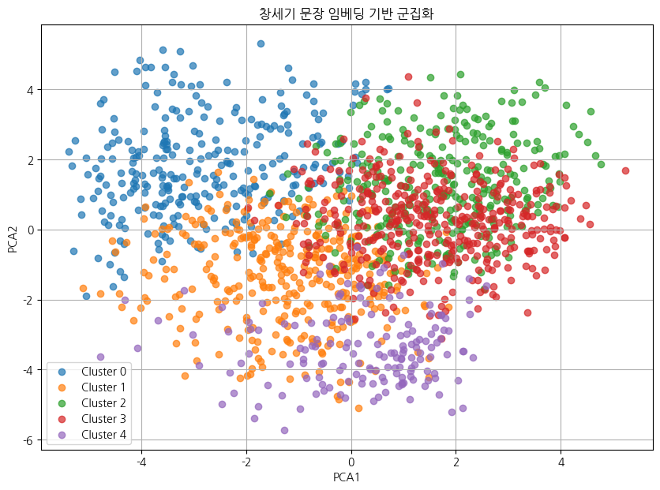

### 1. 외부 데이터 읽기
텍스트 마이닝의 출발점은 원본 텍스트 데이터를 Python으로 불러오는
것이다. TXT 파일은 웹(URL)에서 직접 읽거나 로컬(내부) 파일로 저장된 것을
불러올 수 있으며, 결과 데이터 구조는 문자열(str), 리스트(list),
데이터프레임(DataFrame) 중 하나로 관리한다.

#### 1. TXT 파일 읽기 → 문자열(str)

urllib.request 모듈을 사용하면 인터넷에 공개된 TXT 파일을 URL로 직접
가져올 수 있다. 한글 텍스트의 경우 decode(\'cp949\') 옵션이 필수이며,
읽어온 결과는 하나의 긴 문자열로 저장된다.

```python
import urllib.request

url = "https://by-sekwon.github.io/api/genesis.txt"
with urllib.request.urlopen(url) as f:
    text = f.read().decode('cp949')  # 인코딩 주의

print(type(text))
print(text[:200])
```

```text
<class 'str'>
창1:1 <천지 창조> 태초에 하나님이 천지를 창조하시니라
창1:2 땅이 혼돈하고 공허하며 흑암이 깊음 위에 있고 하나님의 영은 수면 위에 운행하시니라
창1:3 하나님이 이르시되 빛이 있으라 하시니 빛이 있었고
창1:4 빛이 하나님이 보시기에 좋았더라 하나님이 빛과 어둠을 나누사
창1:5 하나님이 빛을 낮이라 부르시고 어둠을 밤이라 부르시니라 저녁이
```

**코드 설명:** `urllib.request.urlopen(url)`은 인터넷 URL에서 파일을 열고, `f.read()`로 바이트(bytes) 형태로 읽는다. `.decode('cp949')`는 한글 Windows 인코딩(CP949)으로 바이트를 문자열로 변환하는 단계로, 한글 텍스트 처리 시 반드시 필요하다. `text[:200]`은 문자열의 앞 200자를 슬라이싱하여 미리 보기한다.

**결과 해석:** `<class 'str'>`은 변수 `text`가 하나의 긴 문자열로 저장되었음을 의미한다. 창세기 1장 1~5절 내용이 줄바꿈(`\n`)으로 구분된 상태로 출력된다. 전체를 하나의 덩어리로 다루므로 특정 패턴을 검색하거나 전처리할 때 유용하다.

#### 2. TXT 파일 → 데이터프레임으로 읽기

pandas의 urllib.request.urlopen() 함수를 사용하면 URL에서 고정 너비 텍스트 파일을 바로 DataFrame으로 읽을 수 있다. 각 행이 DataFrame의 한 행(row)으로 저장되어
이후 문장 단위 분석이 용이하다.

```python
# 외부 txt 데이터 데이터프레임으로 읽기
import pandas as pd
import urllib.request

# txt 파일 읽기 (URL은 open()으로 읽을 수 없으므로 urllib 사용)
url = 'https://by-sekwon.github.io/api/genesis.txt'
with urllib.request.urlopen(url) as f:
    text = f.read().decode('cp949')

# 줄 단위 분리
lines = text.split('\n')

# 데이터프레임 생성
df = pd.DataFrame(lines, columns=['text'])

# 공백 제거
df['text'] = df['text'].str.strip()

# 빈 행 제거
df = df[df['text'] != '']

# 인덱스 재정렬
df = df.reset_index(drop=True)

# 확인
print(df.head())
print(df.shape)
```
```text
                                                text
0                   창1:1 <천지 창조> 태초에 하나님이 천지를 창조하시니라
1  창1:2 땅이 혼돈하고 공허하며 흑암이 깊음 위에 있고 하나님의 영은 수면 위에 운...
2                   창1:3 하나님이 이르시되 빛이 있으라 하시니 빛이 있었고
3             창1:4 빛이 하나님이 보시기에 좋았더라 하나님이 빛과 어둠을 나누사
4  창1:5 하나님이 빛을 낮이라 부르시고 어둠을 밤이라 부르시니라 저녁이 되고 아침이...
(1534, 1)
```

**코드 설명:** `text.split('\n')`은 문자열을 줄바꿈 기준으로 나누어 리스트를 만들고, `pd.DataFrame(lines, columns=['text'])`은 각 줄을 DataFrame의 한 행으로 변환한다. `df['text'].str.strip()`으로 각 셀의 앞뒤 공백을 제거하고, `df[df['text'] != '']`로 빈 행을 필터링하여 깨끗한 데이터를 만든다.

**결과 해석:** `(1534, 1)`은 창세기 전체가 1,534개의 절(행)과 1개의 열(`text`)로 구성된 DataFrame임을 의미한다. 각 행이 절 하나에 대응하므로 절 단위 감성분석, 검색, 필터링에 바로 활용할 수 있다.

#### 3.TXT 파일 읽기 → 리스트(list)로 읽기

open() 함수와 readlines() 메서드를 사용하면 로컬에 저장된 TXT 파일을 줄 단위로 읽어 리스트로 저장할 수 있다. 각 줄의 끝에 줄바꿈 문자(\'\\n\')가 포함되므로 분석 전에 strip()으로 제거하는 것이 좋다.

```python
# 외부 txt 데이터를 list 형식으로 읽기
import urllib.request

# txt 파일 읽기 (URL은 open()으로 읽을 수 없으므로 urllib 사용)
url = 'https://by-sekwon.github.io/api/genesis.txt'
with urllib.request.urlopen(url) as f:
    text = f.read().decode('cp949')

# 줄 단위로 list 생성
text_list = text.split('\n')

# 공백 제거 + 빈 행 제거
text_list = [x.strip() for x in text_list if x.strip() != '']

# 확인
print(type(text_list))
print(text_list[:5])
print(len(text_list))
```

```text
<class 'list'>
['창1:1 <천지 창조> 태초에 하나님이 천지를 창조하시니라', '창1:2 땅이 혼돈하고 공허하며 흑암이 깊음 위에 있고 하나님의 영은 수면 위에 운행하시니라', '창1:3 하나님이 이르시되 빛이 있으라 하시니 빛이 있었고', '창1:4 빛이 하나님이 보시기에 좋았더라 하나님이 빛과 어둠을 나누사', '창1:5 하나님이 빛을 낮이라 부르시고 어둠을 밤이라 부르시니라 저녁이 되고 아침이 되니 이는 첫째 날이니라']
1534
```

**코드 설명:** `[x.strip() for x in text_list if x.strip() != '']`는 리스트 컴프리헨션으로, 각 줄의 앞뒤 공백을 제거하고 빈 문자열(`''`)을 한 번에 걸러낸다. `len(text_list)`로 전체 요소 수를 확인한다.

**결과 해석:** `<class 'list'>`로 변환된 1,534개의 요소가 각각 창세기의 절 하나를 담고 있다. 리스트는 인덱스(`text_list[0]`)로 특정 절에 접근하거나 `for` 반복문으로 전체를 순회할 때 편리한 구조다. DataFrame보다 가볍고 단순한 반복 처리에 적합하다.

### 2. PDF 파일 읽기

```python
# 설치 (최초 1회만 실행)
!pip install pdfplumber requests

import pdfplumber
import requests
from io import BytesIO

# PDF 파일 URL
pdf_url = 'https://by-sekwon.github.io/api/genesis.pdf'

# URL에서 PDF 다운로드 → 메모리(BytesIO)로 읽기
response = requests.get(pdf_url)
response.raise_for_status()  # 다운로드 실패 시 예외 발생
pdf_file = BytesIO(response.content)

# 전체 텍스트 저장 변수
text = ""

# PDF 읽기
with pdfplumber.open(pdf_file) as pdf:
    # 페이지별 텍스트 추출
    for page in pdf.pages:
        page_text = page.extract_text()
        # None 방지
        if page_text:
            text += page_text + "\n"

# 확인
print(type(text))      # <class 'str'>
print(text[:1000])     # 앞 1000자 출력
```
```text
<class 'str'>
창1:1 <천지 창조> 태초에 하나님이 천지를 창조하시니라
창1:2 땅이 혼돈하고 공허하며 흑암이 깊음 위에 있고 하나님의 영은 수면 위에 운행하시니라
창1:3 하나님이 이르시되 빛이 있으라 하시니 빛이 있었고
창1:4 빛이 하나님이 보시기에 좋았더라 하나님이 빛과 어둠을 나누사
창1:5 하나님이 빛을 낮이라 부르시고 어둠을 밤이라 부르시니라 저녁이 되고 아침이 되니 이는 첫째 날
이니라 (생략)
```

### 3. 데이터 유형 변환

Python에서 텍스트 데이터는 문자열(str), 리스트(list), 데이터프레임(DataFrame) 세 가지 형태로 관리된다. 분석 목적에 따라 적합한
형태로 상호 변환하는 방법을 숙지해야 한다.

#### 1. 문자열 → 리스트 변환

```python
# 문자열(str) 데이터 -> 리스트(list) 변환
# 줄 단위로 리스트 생성
text_list = text.split('\n')
# 공백 제거 + 빈 행 제거
text_list = [x.strip() for x in text_list if x.strip() != '']

# 확인
print(type(text_list))   # <class 'list'>
print(text_list[:5])     # 앞 5개 출력
print(len(text_list))    # 전체 개수
```
```text
<class 'list'>
['창1:1 <천지 창조> 태초에 하나님이 천지를 창조하시니라', '창1:2 땅이 혼돈하고 공허하며 흑암이 깊음 위에 있고 하나님의 영은 수면 위에 운행하시니라', '창1:3 하나님이 이르시되 빛이 있으라 하시니 빛이 있었고', '창1:4 빛이 하나님이 보시기에 좋았더라 하나님이 빛과 어둠을 나누사', '창1:5 하나님이 빛을 낮이라 부르시고 어둠을 밤이라 부르시니라 저녁이 되고 아침이 되니 이는 첫째 날']
2398
```

**결과 해석:** PDF에서 추출한 텍스트는 TXT 파일(1,534행)보다 많은 2,398행이 나왔다. 이는 PDF의 페이지 레이아웃에 따라 줄바꿈이 추가로 발생했기 때문이다. 실제 창세기 절 수는 1,534개이므로, 이후 전처리 단계에서 중복·오류 행을 제거해야 한다.

#### 2. 리스트 → 문자열 변환

```python
# 리스트(list) -> 문자열(str) 재변환
text_recovered = '\n'.join(text_list)
# 확인
print(type(text_recovered))   # <class 'str'>
print(text_recovered[:200])  # 앞 200자 출력
```
```text
<class 'str'>
창1:1 <천지 창조> 태초에 하나님이 천지를 창조하시니라
창1:2 땅이 혼돈하고 공허하며 흑암이 깊음 위에 있고 하나님의 영은 수면 위에 운행하시니라
창1:3 하나님이 이르시되 빛이 있으라 하시니 빛이 있었고
창1:4 빛이 하나님이 보시기에 좋았더라 하나님이 빛과 어둠을 나누사
창1:5 하나님이 빛을 낮이라 부르시고 어둠을 밤이라 부르시니라 저녁이 되고
```

**코드 설명:** `'\n'.join(text_list)`는 리스트의 각 요소를 줄바꿈 문자로 이어 붙여 하나의 문자열로 만드는 역변환이다. `split('\n')`의 반대 연산으로, 원본 문자열을 복원할 때 활용한다.

**결과 해석:** `<class 'str'>`로 다시 변환된 문자열이 원본과 동일한 형식으로 출력된다. 문자열 형태는 `re.sub()` 등 정규식 기반 전처리나 전체 텍스트를 한 번에 저장할 때 유용하다.

#### 3. 리스트 → 데이터프레임 변환

```python
# 리스트(list) -> 데이터프레임(DataFrame) 변환
import pandas as pd
# 데이터프레임 생성
df = pd.DataFrame(text_list, columns=['text'])
# 확인
print(type(df))      # <class 'pandas.core.frame.DataFrame'>

print(df.head())     # 상위 5개 출력
print(df.shape)      # 행, 열 개수
```
```text
<class 'pandas.core.frame.DataFrame'>
                                                text
0                   창1:1 <천지 창조> 태초에 하나님이 천지를 창조하시니라
1  창1:2 땅이 혼돈하고 공허하며 흑암이 깊음 위에 있고 하나님의 영은 수면 위에 운...
2                   창1:3 하나님이 이르시되 빛이 있으라 하시니 빛이 있었고
3             창1:4 빛이 하나님이 보시기에 좋았더라 하나님이 빛과 어둠을 나누사
4  창1:5 하나님이 빛을 낮이라 부르시고 어둠을 밤이라 부르시니라 저녁이 되고 아침이...
(2398, 1)
```

**코드 설명:** `pd.DataFrame(text_list, columns=['text'])`는 리스트의 각 요소를 `text` 열의 행 값으로 하는 DataFrame을 생성한다. `df.head()`는 상위 5행, `df.shape`는 (행 수, 열 수) 튜플을 반환한다.

**결과 해석:** 리스트를 DataFrame으로 변환하면 pandas의 다양한 기능(필터링, 정렬, 그룹화, 열 추가)을 활용할 수 있다. 감성분석, 형태소 분석 결과를 새 열로 추가하며 확장하기 좋은 구조다.

### 4. 전체 흐름: PDF 읽기 → 문자열 → 리스트 → 데이터프레임
창세기.pdf 읽어 텍스트를 추출하고 전처리를 거쳐 형태소 분석에 적합한 데이터프레임으로 만드는 전체 흐름의 파이프라인을 구축해보자.

##### 1. Colab 한글 폰트 설정 (선택 사항)
```python
# Colab 한글 폰트 강제 재설정

!apt-get update -qq
!apt-get install -y fonts-nanum fonts-nanum-extra > /dev/null
!fc-cache -fv > /dev/null
!rm -rf ~/.cache/matplotlib

import os
os.kill(os.getpid(), 9)
```
```python
import matplotlib.pyplot as plt
import matplotlib.font_manager as fm

font_path = '/usr/share/fonts/truetype/nanum/NanumGothic.ttf'

fm.fontManager.addfont(font_path)

plt.rcParams['font.family'] = 'NanumGothic'
plt.rcParams['axes.unicode_minus'] = False

print("현재 폰트:", plt.rcParams['font.family'])
```
런타임 -> 다시 시작한 후 

#### 2. 텍스트 추출 → 전처리 → 형태소 분석용 DataFrame 만들기

이 파이프라인은 PDF에서 원시 텍스트를 추출한 뒤, 정규식으로 전처리하고, 장(chapter)·절(verse)·본문을 분리한 후 형태소 분석까지 한 번에 수행한다. 각 단계의 역할은 다음과 같다.

| 단계 | 역할 |
|------|------|
| 1–2 | URL에서 PDF 다운로드 → 텍스트 추출 |
| 3 | 불필요한 공백·줄바꿈 정리, PDF 조판으로 끊어진 절 이어붙이기 |
| 4 | 절 단위 리스트 변환 |
| 5–6 | DataFrame 생성 후 정규식으로 `창X:Y` 패턴에서 장·절·본문 분리 |
| 7 | `<...>` 형식의 소제목 추출 후 본문에서 제거 |
| 8 | NLP용 텍스트 정제: 한글·숫자·공백만 남기고 글자 수·단어 수 계산 |
| 9 | Okt 형태소 분석기로 형태소·명사·품사 태깅 |

```python
# =====================================================
# 창세기.pdf → 텍스트 추출 → 전처리 → 형태소 분석용 DataFrame
# =====================================================

!pip install pdfplumber konlpy requests

import re
import pandas as pd
import pdfplumber
import requests
from io import BytesIO

# -----------------------------------------------------
# 1. PDF 경로 (URL)
# -----------------------------------------------------
pdf_url = 'https://by-sekwon.github.io/api/genesis.pdf'

# URL에서 PDF 다운로드 → BytesIO 객체로 변환
response = requests.get(pdf_url)
response.raise_for_status()
pdf_file = BytesIO(response.content)

# -----------------------------------------------------
# 2. PDF에서 문자열 추출
# -----------------------------------------------------
text = ""

with pdfplumber.open(pdf_file) as pdf:
    for page in pdf.pages:
        page_text = page.extract_text()
        if page_text:
            text += page_text + "\n"

print(type(text))
print(text[:500])

# -----------------------------------------------------
# 3. 기본 전처리
# -----------------------------------------------------
text_clean = text.replace('\xa0', ' ')
text_clean = re.sub(r'[ \t]+', ' ', text_clean)

# PDF 줄바꿈 때문에 끊어진 구절 이어붙이기
text_clean = re.sub(r'\n(?!창\d+:\d+)', ' ', text_clean)

# 각 절 앞에서 줄바꿈 넣기
text_clean = re.sub(r'(창\d+:\d+)', r'\n\1', text_clean)

text_clean = text_clean.strip()

# -----------------------------------------------------
# 4. 줄 단위 리스트 변환
# -----------------------------------------------------
lines = text_clean.split('\n')
lines = [line.strip() for line in lines if line.strip()]

print(len(lines))
print(lines[:5])

# -----------------------------------------------------
# 5. DataFrame 생성
# -----------------------------------------------------
df = pd.DataFrame(lines, columns=['raw_text'])

# -----------------------------------------------------
# 6. 장, 절, 본문 분리
# -----------------------------------------------------
pattern = r'^창(\d+):(\d+)\s*(.*)$'
df[['chapter', 'verse', 'text']] = df['raw_text'].str.extract(pattern)

# 패턴 매칭 실패(NaN) 행 제거
df = df.dropna(subset=['chapter', 'verse']).reset_index(drop=True)

# 장/절 숫자형 변환
df['chapter'] = df['chapter'].astype(int)
df['verse'] = df['verse'].astype(int)

# -----------------------------------------------------
# 7. 제목 분리
# -----------------------------------------------------
df['section_title'] = df['text'].str.extract(r'<([^>]+)>')

# 본문에서 제목 제거
df['text'] = df['text'].str.replace(r'<[^>]+>', '', regex=True).str.strip()

# -----------------------------------------------------
# 8. NLP용 텍스트 전처리
# -----------------------------------------------------
df['text_clean'] = df['text'].fillna('')

# 한글, 숫자, 공백만 남기기
df['text_clean'] = df['text_clean'].str.replace(r'[^가-힣0-9\s]', ' ', regex=True)

# 중복 공백 제거
df['text_clean'] = df['text_clean'].str.replace(r'\s+', ' ', regex=True).str.strip()

# 글자 수, 단어 수
df['char_count'] = df['text_clean'].str.len()
df['word_count'] = df['text_clean'].str.split().str.len().fillna(0).astype(int)

# -----------------------------------------------------
# 9. 형태소 분석
# -----------------------------------------------------
from konlpy.tag import Okt

okt = Okt()

df['morphs'] = df['text_clean'].apply(lambda x: okt.morphs(x) if x else [])
df['nouns']  = df['text_clean'].apply(lambda x: okt.nouns(x)  if x else [])
df['pos']    = df['text_clean'].apply(lambda x: okt.pos(x)    if x else [])

# -----------------------------------------------------
# 10. 확인
# -----------------------------------------------------
print(df.shape)
display(df.head())

# -----------------------------------------------------
# 11. 형태소 분석용 최종 컬럼
# -----------------------------------------------------
df_nlp = df[[
    'chapter',
    'verse',
    'section_title',
    'text',
    'text_clean',
    'morphs',
    'nouns',
    'pos',
    'char_count',
    'word_count'
]]

display(df_nlp.head())

# -----------------------------------------------------
# 12. 저장
# -----------------------------------------------------
# save_path = '/content/drive/MyDrive/eBook python codes/genesis_nlp_df.csv'
# df_nlp.to_csv(save_path, index=False, encoding='utf-8-sig')
# print("저장 완료:", save_path)
```
```text
<class 'str'>
창1:1 <천지 창조> 태초에 하나님이 천지를 창조하시니라
창1:2 땅이 혼돈하고 공허하며 흑암이 깊음 위에 있고 하나님의 영은 수면 위에 운행하시니라.
```

**코드 설명:** `requests.get(pdf_url)`은 HTTP GET 요청으로 PDF 파일을 바이트로 다운로드하고, `BytesIO(response.content)`는 바이트를 메모리 내 파일 객체로 변환해 디스크에 저장 없이 바로 처리할 수 있게 한다. `pdfplumber.open()`으로 PDF를 열고 `page.extract_text()`로 페이지별 텍스트를 추출한다. `if page_text:`는 빈 페이지(이미지만 있는 페이지)에서 `None`이 반환되는 경우를 방어하는 처리다.

**결과 해석:** PDF에서 추출한 텍스트가 TXT 파일과 동일한 형식의 문자열로 정상 출력되었다. PDF는 페이지 단위로 텍스트가 나뉘어 있어 추출 시 줄바꿈이 불규칙하게 발생할 수 있으므로, 이후 전처리에서 끊어진 구절을 이어붙이는 작업이 필요하다.

{fig-align="center" width="100%"}

### 5. 감성분석

#### 1. 긍정/부정 단어사전 기반 감성점수 계산

사전 기반(Lexicon-based) 감성분석은 미리 정의한 긍정·부정 단어 목록으로 각 문장의 감성 극성을 계산하는 가장 간단한 방법이다. 머신러닝 없이도 도메인 특화 단어를 직접 통제할 수 있는 것이 장점이다.

```python
# =====================================================
# 감성분석 예제: 긍정/부정 단어사전 기반
# =====================================================

import pandas as pd

# -----------------------------------------------------
# 1. 간단한 감성사전 만들기
# -----------------------------------------------------

positive_words = [
    '좋다', '좋았더라', '복', '생명', '창조', '번성',
    '충만', '은혜', '사랑', '기쁨', '평안', '구원'
]

negative_words = [
    '혼돈', '공허', '흑암', '저주', '죽음', '죄',
    '악', '두려움', '근심', '고통', '심판'
]

# -----------------------------------------------------
# 2. 감성점수 계산 함수
# -----------------------------------------------------

def sentiment_score(text):
    pos_count = sum(word in text for word in positive_words)
    neg_count = sum(word in text for word in negative_words)

    score = pos_count - neg_count

    if score > 0:
        label = '긍정'
    elif score < 0:
        label = '부정'
    else:
        label = '중립'

    return pd.Series([pos_count, neg_count, score, label])

# -----------------------------------------------------
# 3. 감성분석 적용
# -----------------------------------------------------

df_nlp[['positive_count', 'negative_count', 'sentiment_score', 'sentiment_label']] = (
    df_nlp['text_clean'].apply(sentiment_score)
)

# -----------------------------------------------------
# 4. 결과 확인
# -----------------------------------------------------

df_nlp.head()
```
**코드 설명:** `sentiment_score()` 함수는 문장(`text`)에 각 단어가 포함되는지 확인하여 긍정·부정 단어 수를 센다. `sum(word in text for word in positive_words)`는 불리언 합산으로, `True`가 1로 계산되어 등장 단어 수가 집계된다. 최종 점수는 `긍정 수 - 부정 수`이며, 양수면 긍정, 음수면 부정, 0이면 중립으로 분류한다. `pd.Series()`로 반환해 `apply()`와 함께 쓰면 여러 열을 동시에 생성할 수 있다.

**결과 해석:** 각 절에 긍정 단어 수(`positive_count`), 부정 단어 수(`negative_count`), 감성점수(`sentiment_score`), 감성 레이블(`sentiment_label`)이 새 열로 추가된다. 단어 기반 방식이므로 단어가 포함된 절만 점수가 부여되고, 대부분의 절은 중립(`score=0`)으로 분류된다.

{fig-align="center" width="100%"}

```python
# 장별 감성점수 요약

chapter_sentiment = (
    df_nlp
    .groupby('chapter')
    .agg(
        verse_count=('verse', 'count'),
        positive_total=('positive_count', 'sum'),
        negative_total=('negative_count', 'sum'),
        sentiment_total=('sentiment_score', 'sum'),
        sentiment_mean=('sentiment_score', 'mean')
    )
    .reset_index()
)

chapter_sentiment.head()
```
```text
chapter	verse_count	positive_total	negative_total	sentiment_total	sentiment_mean
0	1	31	19	3	16	0.516129
1	2	25	3	2	1	0.040000
2	3	24	2	5	-3	-0.125000
3	4	26	0	3	-3	-0.115385
4	5	32	3	1	2	0.062500
```

**코드 설명:** `groupby('chapter').agg()`는 장별로 절 수, 긍정·부정 단어 합계, 감성점수 합계와 평균을 한 번에 집계한다. `agg()` 안에서 `열명=(대상열, 집계함수)` 형식으로 새 열 이름을 지정할 수 있다.

**결과 해석:**

- **1장(창조 서사):** 긍정 단어 19개 vs 부정 3개, 평균 감성점수 +0.52로 가장 긍정적이다. '창조', '좋았더라', '번성' 등 긍정 단어가 집중된다.
- **3장(타락 서사):** 긍정 2개 vs 부정 5개, 평균 −0.13으로 부정 전환. '저주', '죄', '고통' 등이 등장하는 에덴동산 추방 이야기다.
- **4장(가인과 아벨):** 긍정 단어 0개, 부정 3개로 평균 −0.12. 최초의 살인 사건이 담긴 장으로 부정 감성이 두드러진다.
- **2장·5장:** 감성점수가 0에 가깝고, 에덴동산 묘사(2장)와 족보(5장) 같은 중립적 서술 위주다.

```python

import matplotlib.pyplot as plt

plt.figure(figsize=(12, 5))
plt.plot(chapter_sentiment['chapter'], chapter_sentiment['sentiment_total'], marker='o')
plt.axhline(0, linestyle='--')
plt.xlabel('Chapter')
plt.ylabel('Sentiment Score')
plt.title('Genesis Sentiment Score by Chapter')
plt.show()
```
**결과 해석:** 창세기 전체 감성 흐름을 보면 1장(창조)에서 가장 높은 긍정 점수를 보이고, 3~4장(타락·살인)에서 음수로 떨어진다. 이후 족장 서사(아브라함, 야곱, 요셉)가 전개되는 중반부에서는 점수가 등락을 반복하며, 전반적으로 중립에 가까운 서술이 많다. 이 단순한 사전 기반 방식은 한계가 있지만, 성경 서사의 대략적인 감성 흐름을 포착한다.

{fig-align="center" width="100%"}

```python
# =====================================================
# 형태소 기반 빈도분석 예제
# =====================================================

from collections import Counter
import pandas as pd

# -----------------------------------------------------
# 1. 전체 명사 리스트 만들기
# -----------------------------------------------------

all_nouns = []

for nouns in df_nlp['nouns']:
    all_nouns.extend(nouns)

print(all_nouns[:20])

# -----------------------------------------------------
# 2. 불용어 제거
# -----------------------------------------------------

stopwords = [
    '하나님', '이르시되', '그', '저', '것',
    '수', '자기', '때', '곳', '날', '사람'
]

filtered_nouns = [
    word for word in all_nouns
    if len(word) >= 2 and word not in stopwords
]

# -----------------------------------------------------
# 3. 단어 빈도 계산
# -----------------------------------------------------

word_freq = Counter(filtered_nouns)

# 상위 20개
top20 = word_freq.most_common(20)

print(top20)

# -----------------------------------------------------
# 4. 데이터프레임 변환
# -----------------------------------------------------

freq_df = pd.DataFrame(top20, columns=['word', 'frequency'])

display(freq_df)

# -----------------------------------------------------
# 5. 막대그래프 시각화
# -----------------------------------------------------

plt.figure(figsize=(12,6))

plt.bar(freq_df['word'], freq_df['frequency'])

plt.xlabel('단어')
plt.ylabel('빈도수')
plt.title('창세기 상위 빈도 단어')

plt.xticks(rotation=45)

plt.show()
```
```text
['태초', '하나님', '천지', '창조', '땅', '혼돈', '흑암', '위', '하나님', '영은', '수면', '위', '운행', '하나님', '빛', '빛', '빛', '하나님', '하나님', '빛과']
[('아들', 247), ('아버지', 219), ('야곱', 209), ('우리', 203), ('요셉', 188), ('너희', 174), ('여호와', 162), ('모든', 154), ('아브라함', 132), ('아내', 113), ('이름', 108), ('이삭', 105), ('애굽', 95), ('바로', 93), ('당신', 91), ('족속', 78), ('하리', 74), ('거기', 69), ('아브람', 65), ('라반', 60)]

**코드 설명:** `all_nouns.extend(nouns)`는 각 절의 명사 리스트를 `all_nouns`에 이어 붙인다(`append`는 리스트를 통째로 추가하므로 `extend`를 사용). 불용어(`stopwords`) 제거와 2글자 이상 필터로 조사·접속사 등 분석에 불필요한 단어를 걸러낸다. `Counter.most_common(20)`은 빈도 순 상위 20개 (단어, 빈도) 튜플 리스트를 반환한다.

**결과 해석:** 창세기 전체에서 가장 많이 등장하는 명사는 **아들(247회)**, **아버지(219회)**, **야곱(209회)**, **요셉(188회)** 순으로, 창세기가 족장들의 가족 서사를 중심으로 전개됨을 잘 보여준다. 여호와(162회)와 아브라함(132회)이 중반을 차지하며, 애굽(95회)·바로(93회)는 요셉 이야기(37~50장)의 비중을 반영한다.
word	frequency
0	아들	247
1	아버지	219
2	야곱	209
3	우리	203
4	요셉	188
5	너희	174
6	여호와	162
7	모든	154
8	아브라함	132
9	아내	113
10	이름	108
11	이삭	105
12	애굽	95
13	바로	93
14	당신	91
15	족속	78
16	하리	74
17	거기	69
18	아브람	65
19	라반	60
```
{fig-align="center" width="100%"}

#### 2. 워드 클라우드
```python
# =====================================================
# 워드클라우드
# =====================================================

!pip install wordcloud

from wordcloud import WordCloud

wordcloud = WordCloud(
    font_path='/usr/share/fonts/truetype/nanum/NanumGothic.ttf',
    width=800,
    height=400,
    background_color='white'
).generate_from_frequencies(word_freq)

plt.figure(figsize=(15, 8))
plt.imshow(wordcloud, interpolation='bilinear')
plt.axis('off')
plt.show()
```
{fig-align="center" width="100%"}

##### 3. 감성점수 분포 시각화
```python
# =====================================================
# 장별 키워드 변화 분석
# =====================================================

from collections import Counter
import pandas as pd
import matplotlib.pyplot as plt

# -----------------------------------------------------
# 1. 불용어 정의
# -----------------------------------------------------

stopwords = [
    '하나님', '이르시되', '그', '저', '것',
    '수', '자기', '때', '곳', '날', '사람'
]

# -----------------------------------------------------
# 2. 장별 상위 키워드 추출
# -----------------------------------------------------

chapter_keywords = []

for chapter in sorted(df_nlp['chapter'].unique()):

    # 해당 장 데이터
    temp = df_nlp[df_nlp['chapter'] == chapter]

    # 명사 수집
    nouns = []

    for n in temp['nouns']:
        nouns.extend(n)

    # 불용어 제거
    nouns = [
        word for word in nouns
        if len(word) >= 2 and word not in stopwords
    ]

    # 빈도 계산
    freq = Counter(nouns)

    # 상위 10개
    top10 = freq.most_common(10)

    # 저장
    for word, count in top10:

        chapter_keywords.append({
            'chapter': chapter,
            'word': word,
            'frequency': count
        })

# -----------------------------------------------------
# 3. 데이터프레임 생성
# -----------------------------------------------------

chapter_keyword_df = pd.DataFrame(chapter_keywords)

display(chapter_keyword_df.head(20))

# -----------------------------------------------------
# 4. 특정 키워드 장별 변화
# -----------------------------------------------------

target_word = '아브라함'

target_df = (
    chapter_keyword_df[
        chapter_keyword_df['word'] == target_word
    ]
)

plt.figure(figsize=(12,6))

plt.plot(
    target_df['chapter'],
    target_df['frequency'],
    marker='o'
)

plt.xlabel('장')
plt.ylabel('빈도수')
plt.title(f'{target_word} 장별 등장 빈도 변화')

plt.grid(True)

plt.show()
```
```text
	chapter	word	frequency
0	1	모든	12
1	1	종류	10
2	1	궁창	9
3	1	하늘	8
4	1	저녁	6
5	1	아침	6
6	1	그대로	6
7	1	광명체	5
8	1	번성	5
9	1	창조	4
10	2	여호와	11
11	2	아담	9
12	2	동산	5
13	2	나무	5
14	2	이름	5
15	2	모든	4
16	2	에덴	3
17	2	각종	3
18	2	취하	3
19	2	천지	2
```
{fig-align="center" width="100%"}

##### 4. 토픽모델링 LDA

LDA(Latent Dirichlet Allocation)는 문서 집합에서 잠재적인 주제(토픽)를 자동으로 발견하는 비지도 학습 모델이다. 각 문서가 여러 토픽의 혼합으로 이루어지고, 각 토픽은 단어의 확률 분포로 표현된다는 가정을 사용한다.

```python
# =====================================================
# 4. 토픽모델링: LDA
# =====================================================

!pip install gensim pyLDAvis

import pandas as pd
from gensim import corpora
from gensim.models.ldamodel import LdaModel

# 불용어
stopwords = [
    '하나님', '이르시되', '그', '저', '것',
    '수', '자기', '때', '곳', '날', '사람',
    '모든', '그대로', '여호와'
]

# 명사 기반 토픽 분석용 단어 리스트
texts_for_lda = []

for nouns in df_nlp['nouns']:
    words = [
        w for w in nouns
        if len(w) >= 2 and w not in stopwords
    ]
    texts_for_lda.append(words)

# 사전과 말뭉치 생성
dictionary = corpora.Dictionary(texts_for_lda)
dictionary.filter_extremes(no_below=2, no_above=0.5)

corpus = [dictionary.doc2bow(text) for text in texts_for_lda]

# LDA 모델
num_topics = 5

lda_model = LdaModel(
    corpus=corpus,
    id2word=dictionary,
    num_topics=num_topics,
    random_state=42,
    passes=20,
    iterations=200
)

# 토픽 출력
for topic_id, topic_words in lda_model.print_topics(num_words=10):
    print(f"\nTopic {topic_id}")
    print(topic_words)
```
**코드 설명:** `corpora.Dictionary`는 전체 단어에 고유 ID를 부여한다. `filter_extremes(no_below=2, no_above=0.5)`로 2개 미만 문서에 나온 희귀 단어와 전체의 50% 이상 문서에 나온 너무 흔한 단어를 제거한다. `doc2bow()`는 각 문서를 `(단어ID, 빈도)` 쌍의 리스트로 변환하고, `LdaModel`은 이 말뭉치로 `num_topics=5`개의 잠재 토픽을 학습한다.

```python
# 각 문서별 대표 토픽 추출

def get_dominant_topic(bow):
    topics = lda_model.get_document_topics(bow)
    if len(topics) == 0:
        return None, 0
    topic_id, prob = max(topics, key=lambda x: x[1])
    return topic_id, prob

topic_results = [get_dominant_topic(bow) for bow in corpus]

df_nlp['lda_topic'] = [x[0] for x in topic_results]
df_nlp['lda_topic_prob'] = [x[1] for x in topic_results]

df_nlp[['chapter', 'verse', 'text_clean', 'lda_topic', 'lda_topic_prob']].head()
```
```text

chapter	verse	text_clean	lda_topic	lda_topic_prob
0	1	1	태초에 하나님이 천지를 창조하시니라	3	0.399643
1	1	2	땅이 혼돈하고 공허하며 흑암이 깊음 위에 있고 하나님의 영은 수면 위에 운행하시니라	2	0.599910
2	1	3	하나님이 이르시되 빛이 있으라 하시니 빛이 있었고	0	0.200000
3	1	4	빛이 하나님이 보시기에 좋았더라 하나님이 빛과 어둠을 나누사	0	0.732417
4	1	5	하나님이 빛을 낮이라 부르시고 어둠을 밤이라 부르시니라 저녁이 되고 아침이 되니 이...	4	0.839185
```

**결과 해석:** `lda_topic`은 각 절의 대표 토픽 번호(0~4), `lda_topic_prob`는 해당 토픽에 속할 확률이다. 창1:2(혼돈·공허)는 토픽 2에 60% 확률로 배정되고, 창1:5(저녁·아침)는 토픽 4에 84%로 강하게 배정된다. `lda_topic_prob`가 높을수록 해당 절의 주제가 명확하게 특정 토픽에 집중됨을 의미한다. 반면 창1:3처럼 확률이 0.2로 낮으면 여러 토픽에 걸쳐 있는 애매한 문장이다.
```python
chapter_topic = (
    df_nlp
    .groupby(['chapter', 'lda_topic'])
    .size()
    .reset_index(name='count')
)

display(chapter_topic.head())
```
```text
chapter	lda_topic	count
0	1	0	5
1	1	1	4
2	1	2	3
3	1	3	1
4	1	4	18
```
##### 5. 문장 임베딩 BERT

Sentence-BERT는 문장을 고정 크기의 밀집 벡터(dense vector)로 변환하는 모델이다. 단순 단어 빈도(TF-IDF)와 달리 문장의 의미와 문맥을 반영하여, 의미가 유사한 문장들이 벡터 공간에서 가깝게 위치하도록 학습되었다.

```python
# =====================================================
# 5. 문장 임베딩: BERT / Sentence-BERT
# =====================================================

!pip install sentence-transformers

from sentence_transformers import SentenceTransformer

# 한국어 문장 임베딩 모델
model = SentenceTransformer('jhgan/ko-sroberta-multitask')

sentences = df_nlp['text_clean'].fillna('').tolist()

embeddings = model.encode(
    sentences,
    batch_size=32,
    show_progress_bar=True
)

print(type(embeddings))
print(embeddings.shape)
```
```python
embedding_df = pd.DataFrame(
    embeddings,
    index=df_nlp.index
)

embedding_df.head()
```
```text

0	1	2	3	4	5	6	7	8	9	...	758	759	760	761	762	763	764	765	766	767
0	0.657276	-0.546065	0.575320	-0.760937	0.052703	-0.351884	0.611507	-0.762040	0.006926	-0.484765	...	-0.554226	-0.117167	0.219536	-0.019683	0.214115	-0.203540	-0.255385	-0.475184	-0.099631	-0.493210
1	-0.184553	-0.351501	0.380491	-0.427170	-0.079727	-0.090988	0.187182	-0.844924	0.293355	-0.017009	...	0.120744	0.434955	0.002489	-0.019682	-0.349013	-0.045691	-0.147259	-0.075594	0.246253	0.380888
2	0.758370	-0.652263	1.108464	-0.855262	0.231008	-0.236906	0.378050	-0.542576	-0.106845	-0.343743	...	0.148581	0.577243	-0.050418	-0.080464	-0.240892	-0.304653	-0.135681	-0.544312	0.023646	-0.319404
3	0.434095	-0.498303	0.427033	-0.359444	-0.100046	-0.019342	0.540328	-0.493921	-0.261359	-0.635831	...	0.172899	0.765188	-0.364649	0.066002	0.201110	-0.355595	-0.298475	-0.571206	-0.213117	-0.488300
4	0.408631	-0.339974	0.427144	-0.245519	0.395403	-0.183349	0.022358	-0.597163	-0.100317	-0.637899	...	0.512158	0.185646	-0.150315	-0.027679	-0.667175	-0.317640	-0.279046	-0.577720	-0.074026	-0.081071
```

**코드 설명:** `SentenceTransformer('jhgan/ko-sroberta-multitask')`는 한국어 특화 Sentence-BERT 모델을 로드한다. `model.encode()`는 각 문장을 768차원 실수 벡터로 변환하며, `batch_size=32`는 한 번에 32개씩 처리해 속도를 높인다.

**결과 해석:** 각 행이 하나의 절, 각 열(0~767)이 벡터의 차원을 나타낸다. 이 벡터 자체는 해석이 어렵지만, 문장 간 코사인 유사도 계산이나 군집화·시각화에 활용된다. 예를 들어 "아들을 낳았다"류의 족보 절들은 서로 유사한 벡터값을 가질 것이다.

##### 6. 군집화
```python
# =====================================================
# 6. 문장 임베딩 기반 군집화
# =====================================================

from sklearn.cluster import KMeans
from sklearn.metrics import silhouette_score

X = embeddings

cluster_results = []

for k in range(2, 11):
    kmeans = KMeans(
        n_clusters=k,
        random_state=42,
        n_init=10
    )

    labels = kmeans.fit_predict(X)
    score = silhouette_score(X, labels)

    cluster_results.append({
        'k': k,
        'silhouette_score': score
    })

cluster_score_df = pd.DataFrame(cluster_results)

display(cluster_score_df)
```
```text

k	silhouette_score
0	2	0.041970
1	3	0.036374
2	4	0.041329
3	5	0.039459
4	6	0.039548
5	7	0.041848
6	8	0.041340
7	9	0.040706
8	10	0.044076
```

**코드 설명:** K-Means는 데이터를 k개의 군집으로 나누는 알고리즘이다. 실루엣 점수(Silhouette Score)는 각 데이터가 자신의 군집에 얼마나 잘 속하고 다른 군집과 얼마나 잘 분리되는지를 −1~1 범위로 측정한다. 1에 가까울수록 군집 구분이 명확하다.

**결과 해석:** 실루엣 점수가 전 구간에서 0.036~0.044로 매우 낮다. 이는 창세기 문장들이 의미적으로 유사한 표현("하나님이 이르시되", 족보 형식 등)을 반복 사용해 군집 간 경계가 불분명하기 때문이다. k=10일 때 0.044로 가장 높지만 절대값이 낮으므로, 군집 수보다 군집 결과의 내용적 해석에 집중하는 것이 더 유효하다.
```python
# 실루엣 점수 시각화
import matplotlib.pyplot as plt

plt.figure(figsize=(10, 5))

plt.plot(
    cluster_score_df['k'],
    cluster_score_df['silhouette_score'],
    marker='o'
)

plt.xlabel('군집 수 k')
plt.ylabel('Silhouette Score')
plt.title('군집 수별 실루엣 점수')

plt.grid(True)
plt.show()
```
{fig-align="center" width="100%"}

```python
#최종 군집화
# 원하는 군집 수 선택
best_k = 5

kmeans = KMeans(
    n_clusters=best_k,
    random_state=42,
    n_init=10
)

df_nlp['cluster'] = kmeans.fit_predict(X)

df_nlp[['chapter', 'verse', 'text_clean', 'lda_topic', 'cluster']].head()
```
```text

chapter	verse	text_clean	lda_topic	cluster
0	1	1	태초에 하나님이 천지를 창조하시니라	3	2
1	1	2	땅이 혼돈하고 공허하며 흑암이 깊음 위에 있고 하나님의 영은 수면 위에 운행하시니라	2	2
2	1	3	하나님이 이르시되 빛이 있으라 하시니 빛이 있었고	0	2
3	1	4	빛이 하나님이 보시기에 좋았더라 하나님이 빛과 어둠을 나누사	0	2
4	1	5	하나님이 빛을 낮이라 부르시고 어둠을 밤이라 부르시니라 저녁이 되고 아침이 되니 이...	4	2
```
```python
# 군집별 대표 문장 보기

for c in sorted(df_nlp['cluster'].unique()):
    print(f"\n==============================")
    print(f"Cluster {c}")
    print("==============================")

    sample_texts = (
        df_nlp[df_nlp['cluster'] == c]
        [['chapter', 'verse', 'text_clean']]
        .head(10)
    )

    display(sample_texts)
```
```text

==============================
Cluster 0
==============================
chapter	verse	text_clean
41	2	11	첫째의 이름은 비손이라 금이 있는 하윌라 온 땅을 둘렀으며
75	3	20	아담이 그의 아내의 이름을 하와라 불렀으니 그는 모든 산 자의 어머니가 됨이더라
81	4	2	그가 또 가인의 아우 아벨을 낳았는데 아벨은 양 치는 자였고 가인은 농사하는 자였더라
96	4	17	아내와 동침하매 그가 임신하여 에녹을 낳은지라 가인이 성을 쌓고 그의 아들의 이름으...
97	4	18	에녹이 이랏을 낳고 이랏은 므후야엘을 낳고 므후야엘은 므드사엘을 낳고 므드사엘은 라...
98	4	19	라멕이 두 아내를 맞이하였으니 하나의 이름은 아다요 하나의 이름은 씰라였더라
99	4	20	아다는 야발을 낳았으니 그는 장막에 거주하며 가축을 치는 자의 조상이 되었고
101	4	22	씰라는 두발가인을 낳았으니 그는 구리와 쇠로 여러 가지 기구를 만드는 자요 두발가인...
104	4	25	아담이 다시 자기 아내와 동침하매 그가 아들을 낳아 그의 이름을 셋이라 하였으니 이...
105	4	26	셋도 아들을 낳고 그의 이름을 에노스라 하였으며 그 때에 사람들이 비로소 여호와의 ...

==============================
Cluster 1
==============================
chapter	verse	text_clean
64	3	9	여호와 하나님이 아담을 부르시며 그에게 이르시되 네가 어디 있느냐
76	3	21	여호와 하나님이 아담과 그의 아내를 위하여 가죽옷을 지어 입히시니라
80	4	1	아담이 그의 아내 하와와 동침하매 하와가 임신하여 가인을 낳고 이르되 내가 여호 와...
83	4	4	아벨은 자기도 양의 첫 새끼와 그 기름으로 드렸더니 여호와께서 아벨과 그의 제물은 ...
85	4	6	여호와께서 가인에게 이르시되 네가 분하여 함은 어찌 됨이며 안색이 변함은 어찌 됨이냐
95	4	16	가인이 여호와 앞을 떠나서 에덴 동쪽 놋 땅에 거주하더니
134	5	29	이름을 노아라 하여 이르되 여호와께서 땅을 저주하시므로 수고롭게 일하는 우리를 이 ...
145	6	8	그러나 노아는 여호와께 은혜를 입었더라
160	7	1	여호와께서 노아에게 이르시되 너와 네 온 집은 방주로 들어가라 이 세대에서 네가 내...
198	8	15	하나님이 노아에게 말씀하여 이르시되

==============================
Cluster 2
==============================
chapter	verse	text_clean
0	1	1	태초에 하나님이 천지를 창조하시니라
1	1	2	땅이 혼돈하고 공허하며 흑암이 깊음 위에 있고 하나님의 영은 수면 위에 운행하시니라
2	1	3	하나님이 이르시되 빛이 있으라 하시니 빛이 있었고
3	1	4	빛이 하나님이 보시기에 좋았더라 하나님이 빛과 어둠을 나누사
4	1	5	하나님이 빛을 낮이라 부르시고 어둠을 밤이라 부르시니라 저녁이 되고 아침이 되니 이...
5	1	6	하나님이 이르시되 물 가운데에 궁창이 있어 물과 물로 나뉘라 하시고
6	1	7	하나님이 궁창을 만드사 궁창 아래의 물과 궁창 위의 물로 나뉘게 하시니 그대로 되니라
7	1	8	하나님이 궁창을 하늘이라 부르시니라 저녁이 되고 아침이 되니 이는 둘째 날이니라
8	1	9	하나님이 이르시되 천하의 물이 한 곳으로 모이고 뭍이 드러나라 하시니 그대로 되니라
9	1	10	하나님이 뭍을 땅이라 부르시고 모인 물을 바다라 부르시니 하나님이 보시기에 좋았더라

==============================
Cluster 3
==============================
chapter	verse	text_clean
48	2	18	여호와 하나님이 이르시되 사람이 혼자 사는 것이 좋지 아니하니 내가 그를 위하여 돕...
53	2	23	아담이 이르되 이는 내 뼈 중의 뼈요 살 중의 살이라 이것을 남자에게서 취하였은즉 ...
54	2	24	이러므로 남자가 부모를 떠나 그의 아내와 합하여 둘이 한 몸을 이룰지로다
59	3	4	뱀이 여자에게 이르되 너희가 결코 죽지 아니하리라
66	3	11	이르시되 누가 너의 벗었음을 네게 알렸느냐 내가 네게 먹지 말라 명한 그 나무 열매...
70	3	15	내가 너로 여자와 원수가 되게 하고 네 후손도 여자의 후손과 원수가 되게 하리니 여...
71	3	16	또 여자에게 이르시되 내가 네게 임신하는 고통을 크게 더하리니 네가 수고하고 자식을...
84	4	5	가인과 그의 제물은 받지 아니하신지라 가인이 몹시 분하여 안색이 변하니
86	4	7	네가 선을 행하면 어찌 낯을 들지 못하겠느냐 선을 행하지 아니하면 죄가 문에 엎드려...
87	4	8	가인이 그의 아우 아벨에게 말하고 그들이 들에 있을 때에 가인이 그의 아우 아벨을 ...

==============================
Cluster 4
==============================
chapter	verse	text_clean
854	30	24	그 이름을 요셉이라 하니 여호와는 다시 다른 아들을 내게 더하시기를 원하노라 하였더라
855	30	25	라헬이 요셉을 낳았을 때에 야곱이 라반에게 이르되 나를 보내어 내 고향 나의 땅으로...
967	33	7	레아도 그의 자식들과 더불어 나아와 절하고 그 후에 요셉이 라헬과 더불어 나아와 절하니
1035	35	24	라헬의 아들들은 요셉과 베냐민이며
1085	37	2	야곱의 족보는 이러하니라 요셉이 십칠 세의 소년으로서 그의 형들과 함께 양을 칠 때...
1086	37	3	요셉은 노년에 얻은 아들이므로 이스라엘이 여러 아들들보다 그를 더 사랑하므로 그를 ...
1088	37	5	요셉이 꿈을 꾸고 자기 형들에게 말하매 그들이 그를 더욱 미워하였더라
1089	37	6	요셉이 그들에게 이르되 청하건대 내가 꾼 꿈을 들으시오
1092	37	9	요셉이 다시 꿈을 꾸고 그의 형들에게 말하여 이르되 내가 또 꿈을 꾼즉 해와 달과 ...
1096	37	13	이스라엘이 요셉에게 이르되 네 형들이 세겜에서 양을 치지 아니하느냐 너를 그들에게로...
```

```python
#군집별 주요 명사
from collections import Counter

cluster_keywords = []

for c in sorted(df_nlp['cluster'].unique()):

    temp = df_nlp[df_nlp['cluster'] == c]

    words = []

    for nouns in temp['nouns']:
        words.extend([
            w for w in nouns
            if len(w) >= 2 and w not in stopwords
        ])

    freq = Counter(words).most_common(10)

    for word, count in freq:
        cluster_keywords.append({
            'cluster': c,
            'word': word,
            'frequency': count
        })

cluster_keyword_df = pd.DataFrame(cluster_keywords)

display(cluster_keyword_df)
```
```text

cluster	word	frequency
0	0	아들	100
1	0	이름	46
2	0	족속	44
3	0	족장	42
4	0	아내	36
5	0	자녀	25
6	0	자손	25
7	0	아브람	23
8	0	야곱	17
9	0	애굽	15
10	1	야곱	160
11	1	아브라함	105
12	1	아들	70
13	1	이삭	67
14	1	아버지	49
15	1	이름	39
16	1	라반	38
17	1	아브람	34
18	1	아내	33
19	1	거기	33
20	2	우리	30
21	2	일곱	28
22	2	너희	27
23	2	나무	25
24	2	하늘	22
25	2	노아	21
26	2	물이	19
27	2	짐승	19
28	2	하리	19
29	2	종류	18
30	3	우리	135
31	3	아버지	115
32	3	너희	98
33	3	당신	63
34	3	아들	54
35	3	하리	34
36	3	아내	33
37	3	하라	26
38	3	아우	21
39	3	바로	21
40	4	요셉	183
41	4	애굽	42
42	4	바로	41
43	4	아버지	37
44	4	너희	29
45	4	아들	20
46	4	우리	17
47	4	이스라엘	14
48	4	야곱	13
49	4	당신	11
```

**결과 해석:** k=5 군집의 내용적 의미를 키워드로 해석하면 다음과 같다.

| 군집 | 핵심 키워드 | 내용 |
|------|------------|------|
| Cluster 0 | 아들, 이름, 족속, 족장, 자손 | 족보·계보 서술 (5장, 10장, 36장 등) |
| Cluster 1 | 야곱, 아브라함, 이삭, 라반 | 족장들의 여정 이야기 (야곱·아브라함·이삭 서사) |
| Cluster 2 | 우리, 일곱, 나무, 노아, 물, 짐승, 종류 | 창조(1장) 및 홍수(6~9장) 서사 |
| Cluster 3 | 우리, 아버지, 너희, 당신, 아우 | 대화 중심 장면 (가족 간 대화, 소돔·고모라 등) |
| Cluster 4 | 요셉, 애굽, 바로 | 요셉 이야기 (37~50장) |

군집 결과가 성경 내러티브의 주요 단락(창조→홍수→족장→요셉)과 상당히 일치하여, BERT 임베딩이 의미적 유사성을 효과적으로 포착했음을 알 수 있다.

```python
# =====================================================
# 군집을 PCA 2차원 시각화
# =====================================================

from sklearn.decomposition import PCA

pca = PCA(n_components=2, random_state=42)
X_pca = pca.fit_transform(X)

df_nlp['pca1'] = X_pca[:, 0]
df_nlp['pca2'] = X_pca[:, 1]

plt.figure(figsize=(10, 7))

for c in sorted(df_nlp['cluster'].unique()):
    temp = df_nlp[df_nlp['cluster'] == c]
    plt.scatter(
        temp['pca1'],
        temp['pca2'],
        label=f'Cluster {c}',
        alpha=0.7
    )

plt.xlabel('PCA1')
plt.ylabel('PCA2')
plt.title('창세기 문장 임베딩 기반 군집화')
plt.legend()
plt.grid(True)
plt.show()
```
**코드 설명:** PCA(주성분 분석)는 768차원의 고차원 임베딩 벡터를 2차원으로 압축해 시각화한다. `pca.fit_transform(X)`는 분산이 가장 큰 두 방향(PCA1, PCA2)으로 데이터를 투영하며, 각 점이 하나의 절을 나타낸다.

**결과 해석:** 2차원 산점도에서 군집별로 색상이 구분된 점들의 분포를 확인할 수 있다. Cluster 4(요셉 이야기)와 Cluster 2(창조·홍수)처럼 내러티브가 뚜렷이 다른 군집은 공간적으로 분리되는 경향이 있다. 반면 실루엣 점수가 낮았던 것처럼 군집 간 경계가 완전히 분리되지 않고 겹치는 영역이 존재하는데, 이는 창세기 전반에 걸쳐 반복되는 유사한 문장 패턴 때문이다.

{fig-align="center" width="100%"}