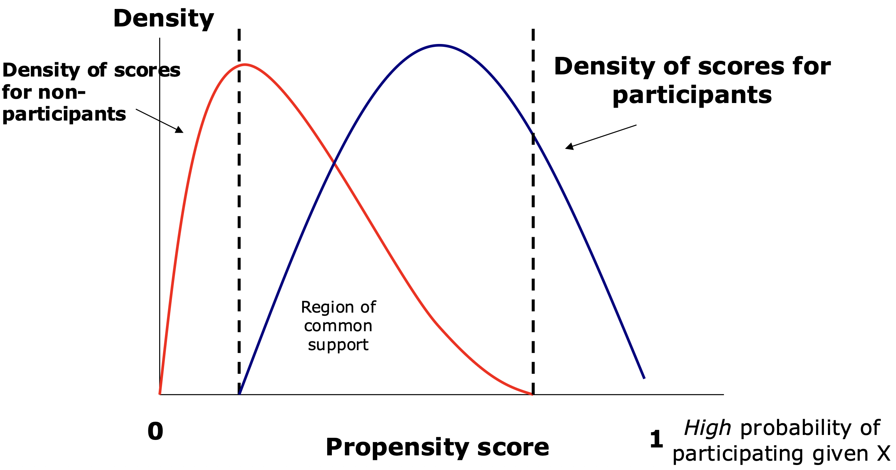

## PSM 개념

::: {.callout-note icon=false}
## 정의
**성향점수매칭(Propensity Score Matching, PSM)**은 관찰 연구에서 사용되는 준실험적 통계 기법으로, 무작위 대조군 연구(RCT)의 수행이 불가능하거나 비현실적인 경우, 특정 처치나 중재의 효과를 추정하는 데 활용된다. 처치 여부에 영향을 미칠 수 있는 교란 변수에 의해 발생하는 선택 편향을 최소화하는 것이 핵심 목표이다.
:::

정책 평가, 경제학 및 사회과학 분야에서 개입(처치, treatment)의 효과를 정량적으로 추정하는 것은 인과적 관계를 분석하는 데 있어 핵심적인 연구 과제이다. 이상적인 실험 설계는 무작위 배정을 통해 처치 그룹과 통제 그룹 간의 동질성을 보장하는 것이지만, 현실적으로 RCT를 수행하는 것은 윤리적·경제적·실무적 제약으로 인해 어려운 경우가 많다.

PSM은 개체가 처치를 받을 확률을 성향 점수로 추정한 후, 해당 점수가 유사한 개체들 간의 매칭을 수행하여 처치 효과를 분석한다. 다만, PSM은 관찰된 변수에 의한 선택 편향만을 조정할 수 있으며, 관찰되지 않은 변수에 의한 편향은 여전히 문제로 남을 수 있다는 점에서 한계를 가진다.

### 성향점수매칭 배경

PSM의 핵심은 성별, 나이 등과 같은 관측된 특성을 기반으로 특정 개체가 치료 또는 중재를 받을 확률인 성향 점수를 추정하는 것이다. 이를 계산하기 위해 일반적으로 로지스틱 회귀분석이 활용되며, 개체별 성향 점수가 산출되면, 해당 점수를 기준으로 치료를 받은 집단과 받지 않은 집단 간의 매칭이 이루어진다. 이러한 과정은 두 집단 간의 관찰된 차이를 최소화하여 보다 유사한 비교군을 형성하고, 이후 치료나 중재가 결과 변수에 미치는 인과적 효과를 보다 정확하게 평가할 수 있도록 한다.

### PSM 원리

PSM은 개입을 받은 개체(처치 그룹)와 개입을 받지 않은 개체(통제 그룹)를 유사한 특성을 가진 개체끼리 매칭하여 비교하는 방법이다. 하지만, 모든 변수의 값이 동일한 개체를 찾는 것은 현실적으로 불가능하므로 성향점수라는 개념을 활용한다.

성향점수는 특정 개체가 개입을 받을 확률을 관찰된 변수의 함수로 추정한 값을 의미한다. 즉, $P(D = 1|X)$, 여기서 $D = 1$은 개입을 받은 여부, $X$는 관찰된 개체의 특성 벡터를 의미한다.

각 개체의 성향 점수를 계산한 후, 성향 점수가 유사한 처치 그룹과 통제 그룹의 개체를 짝지어 매칭한다. 이후, 매칭된 개체들 간의 평균 결과 차이를 비교하여 개입 효과를 추정한다.

### 주요 가정

PSM이 올바른 인과적 추론을 수행하기 위해서는 다음 중요한 가정이 필요하다.

::: {.callout-important icon=false}
## PSM의 핵심 가정

| 가정 | 내용 | 조건 |
|------|------|------|
| **조건부 독립성** | $X$를 통제하면 개입 여부와 결과가 독립 | $Y(1),Y(0)\bot D\|X$ |
| **공통 지원 영역** | 처치·통제 그룹 성향점수 분포가 겹쳐야 함 | $0 < P(X) < 1$ |
:::

**조건부 독립성 가정**: 개입 여부는 관찰된 변수 $X$를 통제하면 결과와 독립적이어야 한다. 관찰되지 않은 요인이 개입과 결과를 동시에 결정한다면 PSM은 편향된 결과를 초래할 수 있다.

**공통 지원 영역**: 처치 그룹과 통제 그룹이 성향 점수의 분포에서 겹치는 부분이 있어야 한다. 성향 점수가 두 그룹 간에 크게 차이 나면 비교 가능한 개체가 없어 매칭이 어려워진다.

## 성향점수매칭 절차

::: {.callout-note icon=false}
## PSM 수행 절차

| 단계 | 내용 |
|------|------|
| **① 샘플 선정** | 개입 효과 정의, 처치·통제 그룹 데이터 확보 |
| **② 성향 점수 추정** | 로짓/프로빗 모델로 개입 확률 추정 |
| **③ 매칭 수행** | 유사 성향 점수 개체 짝짓기 (최근접 이웃, 칼리퍼 등) |
| **④ 공변량 균형성 확인** | SMD·시각화로 두 집단 간 균형 검토 |
| **⑤ 처치효과 추정** | ATT 또는 ATE 계산 |
:::

### 샘플 선정 및 데이터 확보

PSM을 수행하기 위해서는 먼저 측정할 개입 효과가 무엇인지 명확히 정의하고, 해당 효과를 분석할 수 있는 적절한 데이터 샘플을 선정해야 한다.

**효과 평가 변수 결정**: 특정 개입이 결과 변수에 미치는 영향을 추정하는 것이 핵심이다. 약물 사용 여부가 질병 발생률에 미치는 영향을 평가한다면, 약물 사용 여부를 기준으로 처치·통제 그룹을 구분한 후 매칭을 수행한다.

**개입 그룹과 비교 가능한 통제 그룹 확보**: 충분한 샘플 크기를 확보해야 하며, 데이터는 성별·연령·건강 상태·사회경제적 요인 등 성향 점수 예측에 필요한 주요 특성을 포함해야 한다.

### 성향 점수 추정

로짓(Logit) 또는 프로빗(Probit) 모델을 사용하여 개입을 받을 확률(성향점수)을 추정한다.

$$P(Y = 1) = \frac{e^{\beta_{0} + \beta_{1}X_{1} + \ldots + \beta_{k}X_{k}}}{1 + e^{\beta_{0} + \beta_{1}X_{1} + \ldots + \beta_{k}X_{k}}}$$

여기서 $X_{i}$는 개체의 관찰된 특성이다.

### 매칭 수행

성향 점수가 가장 가까운 개체를 매칭하는 방법을 사용한다. 매칭 개념은 다음과 같다.

- 각 개체에 대해 성향 점수, $P(X)$를 추정한다.
- 처치군(개입 그룹)의 개체를 하나 선택한다.
- 통제군(비개입 그룹)에서 해당 처치군 개체와 가장 가까운 성향 점수를 가진 개체를 찾아 매칭한다.
- 모든 처치군 개체에 대해 동일한 과정을 반복한다.
- 매칭이 완료되면 처치군과 통제군의 결과를 비교하여 개입 효과를 추정한다.

{fig-align="center" width="60%"}

공통지지영역(Region of Common Support)이란, 처치집단과 비교집단의 성향점수 분포가 실제로 겹치는 구간을 의미한다. 이 영역 내에서는 서로 유사한 특성을 지닌 처치자와 비처치자를 짝지을 수 있으며, 이를 통해 공정한 비교가 가능해진다.

반면, 공통지지영역을 벗어난 사례들—즉 성향점수가 지나치게 낮거나 높아 비교 가능한 상대가 존재하지 않는 경우—에는 적절한 매칭이 불가능하므로, 분석 대상에서 제외하는 것이 일반적이다.

처치 그룹을 기준으로 비처치 그룹을 매칭하므로, 비처치 그룹의 크기가 충분히 커야 한다. 일반적으로 비처치 그룹의 크기는 처치 그룹의 최소 3배 이상이 되는 것이 바람직하다.

**최근접 이웃 매칭 (Nearest Neighbor Matching)**: 처치 그룹의 개체를 기준으로, 비처치 그룹에서 가장 가까운 성향 점수를 가진 개체를 매칭하는 방법이다.

- **1:1 최근접 이웃 매칭**: 처치군 개체 1개당 비처치군 개체 1개를 매칭하는 방식으로, 성향 점수 차이가 가장 작은 개체를 찾아 매칭한다.
- **비복원 매칭**: 한 개체는 한 번만 매칭됨 (더 공정한 비교 가능).
- **복원 매칭**: 한 개체가 여러 번 매칭될 수 있음 (표본크기 유지 가능하나 권고하지 않음).

**칼리퍼 매칭 (Caliper Matching)**: 처치군과 통제군 간의 성향 점수 차이가 일정한 임계값(칼리퍼) 이하인 경우에만 매칭을 허용하는 방법이다. 처치군 개체 $i$의 성향 점수를 $P(X_{i})$, 비처치군 개체 $j$의 성향 점수를 $P(X_{j})$라고 하면,

$$|P(X_{i}) - P(X_{j})| < C$$

여기서 $C$는 칼리퍼 값(허용 임계값)이다. 일반적으로 칼리퍼 값은 성향 점수 표준 편차의 0.2~0.5배 사이에서 설정하는 것이 권장된다.

### 공변량 균형성 확인

성향점수 매칭의 핵심은, 비실험자료에서도 마치 무작위 실험과 유사한 비교가 가능하도록, 처치집단과 비교집단 간의 공변량 분포를 정렬하는 데 있다. 따라서 매칭 이후에는 두 집단의 공변량 분포가 실제로 유사해졌는지를 검토하는 절차가 필수적으로 따라야 한다. 이러한 검토 과정을 공변량 균형성 확인(balance checking)이라 한다.

공변량 균형성은 주로 다음과 같은 방법으로 평가된다.

**표준화 평균 차이 (Standardized Mean Difference, SMD)**: 가장 널리 사용되는 지표로, 두 집단의 각 공변량 평균 차이를 표준편차로 나눈 값이다. 표본 크기나 단위에 영향을 받지 않아 비교가 용이하다.

::: {.callout-note icon=false}
## SMD 판단 기준

| SMD 값 | 해석 | 조치 |
|--------|------|------|
| $\|SMD\| < 0.1$ | 양호한 균형 ✓ | 분석 진행 가능 |
| $0.1 \leq \|SMD\| < 0.2$ | 수용 가능 | 검토 권장 |
| $\|SMD\| \geq 0.2$ | 균형 부족 ⚠ | 매칭 재검토 필요 |
:::

**시각적 확인**: 각 공변량에 대해 처치집단과 비교집단의 밀도곡선(density plot)이나 박스플롯(box plot)을 중첩하여 두 집단 간 분포의 유사성을 직관적으로 확인한다. QQ-플롯이나 누적분포함수(CDF) 비교도 유용하다.

한편, 일부 연구에서는 매칭 전후의 공변량에 대해 통계적 유의성 검정(t-test, χ² 검정 등)을 시행하기도 하나, 이는 권장되지 않는다. 매칭 후 표본 크기가 작아짐에 따라 통계적 검정력이 급격히 낮아지거나, 반대로 표본 수가 매우 크면 사소한 차이도 유의하게 나타날 수 있기 때문이다. 따라서 공변량 균형성 평가는 주로 SMD와 시각적 분석을 병행하는 것이 바람직하다.

### 처치효과 추정

공변량 균형성이 확보되면, 다음 단계는 처치가 결과 변수에 미치는 영향을 추정하는 것이다. 성향점수 매칭을 통해 짝지어진 처치자와 비처치자의 결과 변수를 비교함으로써, 해당 처치의 인과적 효과(causal effect)를 도출할 수 있다.

처치효과 추정은 일반적으로 두 가지 방식으로 구분된다.

**1. ATT (Average Treatment Effect on the Treated)**: 실제로 처치를 받은 집단에 대해, 해당 처치를 받지 않았을 경우의 반사실적 결과(counterfactual outcome)를 추정하고 그 차이를 계산한 것이다.

$$ATT = E[Y(1) - Y(0) | D=1]$$

실무에서는 매칭된 쌍(pair) 간 결과값의 평균 차이로 ATT를 계산한다.

**2. ATE (Average Treatment Effect)**: 전체 집단(처치자 + 비처치자)에 대해 처치가 있을 경우와 없을 경우의 결과 차이를 추정하며, 보다 강한 가정을 필요로 한다. ATE는 종종 성향점수 기반 가중치(weighting)를 통해 추정된다.

처치효과 추정 시 고려해야 할 중요한 점은 다음과 같다.

- **공통지지영역 밖의 표본 제거**: 성향점수가 지나치게 높은 혹은 낮은 사례는 매칭이 불가능하므로 분석에서 제외한다.
- **매칭 방법의 선택**: 최근접 이웃 매칭, 다대일 매칭, 칼리퍼 매칭 등 다양한 방법 중 선택해야 하며, 매칭 방식은 결과의 편향과 분산에 영향을 미친다.
- **추론의 방법**: 매칭된 데이터는 독립 표본이 아니므로, 표준 오차와 신뢰구간 추정 시 부트스트랩 등의 방법을 사용하는 것이 적절하다.

## PSM 사례연구

### 연구 목적

Jalan & Ravallion(2003)은 인도의 농촌 지역에서 파이프 수돗물 공급이 아동의 건강(특히 설사병 발병률)에 미치는 영향을 평가하기 위해 연구를 수행하였다.

- 수돗물이 공급된 가구의 아동이 설사병 발생 위험이 낮은가?
- 소득수준이나 부모교육수준이 수돗물의 효과에 영향을 미치나?
- 수돗물 혜택이 특정 사회경제적 계층에 따라 다르게 나타나나?

무작위 배정이 불가능한 상황에서, 연구자들은 성향점수 매칭을 사용하여 관찰된 데이터에서 최대한 인과적 효과를 추정하고자 하였다.

### 데이터 및 성향 점수 추정

연구에서는 1993-1994년 인도 국가 대표 가구 조사 데이터를 활용하였다. 총 33,000개 농촌 가구(1,765개 마을)에 대한 데이터를 분석하였으며, 다음과 같은 변수를 이용하여 성향 점수를 추정하였다.

**개입 변수(Treatment Variable)**: 가구가 파이프 수돗물을 이용하는지 여부로 정의되었다. 파이프 수돗물 이용 가구(처치 그룹) vs. 이용하지 않는 가구(통제 그룹)을 비교 대상으로 삼았다.

**성향 점수 추정을 위한 독립 변수(Covariates)**: 파이프 수돗물 공급 여부에 영향을 미칠 수 있는 변수를 고려하여, 로지스틱 회귀분석을 사용해 성향 점수를 추정하였다.

① 마을 수준 변수(Village-Level Variables)

- 마을 규모(인구)
- 관개된 농지 면적
- 공공 인프라(학교, 병원, 도로, 철도역, 버스 정류장 등)

② 가구 수준 변수(Household-Level Variables)

- 사회경제적 지위 (자산 보유: 자전거, 라디오, 탈곡기 등)
- 가구주의 교육 수준 (문맹 여부, 초등·중등 교육 여부)
- 종교 및 카스트 (힌두교, 이슬람교 등)
- 가구원 수 및 연령 구조

### 매칭 방법

성향 점수가 계산된 후, 연구자들은 처치 그룹(파이프 수돗물 이용 가구)과 통제 그룹(이용하지 않는 가구)을 유사한 성향 점수를 가진 개체끼리 매칭하였다. 연구에서는 최근접 이웃 매칭 및 칼리퍼 매칭을 사용하였다.

- **최근접 이웃 매칭**: 성향 점수가 가장 가까운 처치군-통제군 개체를 1:1로 매칭한다.
- **칼리퍼 매칭**: 성향 점수 차이가 일정 임계값 이하인 경우에만 매칭한다.

매칭이 수행된 후, 공통 지원 영역(Common Support)을 확인하여 성향 점수가 지나치게 차이 나는 개체들은 분석에서 제외하였다.

### 결과 분석 및 개입 효과 추정

매칭이 완료된 후, 연구자들은 처치 그룹과 통제 그룹 간의 아동 설사병 발생률 차이를 분석하였다.

파이프 수돗물을 이용하는 가구의 아동은 설사병 발생률이 21% 낮았다. 즉, 파이프 수돗물이 없었다면, 설사병 발생률이 21% 더 높았을 것으로 추정된다.

소득 수준이 높은 가구와 부모의 교육 수준이 높은 가구에서 더 큰 건강 개선 효과가 나타났다. 고소득층 가구일수록 파이프 수돗물을 통한 혜택을 더욱 크게 누리며, 교육 수준이 높은 부모일수록 위생 관리가 철저하여 추가적인 건강 효과를 나타냈다.

저소득층 가구에서는 파이프 수돗물이 오히려 설사병 발생 증가와 연관됨이 나타났다. 연구자들은 물 저장 방식의 차이가 주요 원인일 것으로 해석하였으며, 저소득층 가구에서는 깨끗한 물을 공급받더라도 올바르게 저장하지 못하면 오염 위험이 증가할 수 있음을 지적하였다.
