## 델파이 조사

::: {.callout-note icon=false}
## 정의
**델파이 방법(Delphi Method)**은 의사결정과 미래 예측을 위해 전문가의 의견을 익명으로 수집하고, 반복적인 피드백 과정을 거쳐 점진적으로 합의를 도출하는 체계적 방법이다.
:::

델파이 방법은 1948년 미국 RAND 연구소에서 처음 개발되었다. 제2차 세계대전 이후 급변하는 기술 환경과 군사 전략 수립의 필요성에 대응하기 위해 고안된 것으로, 1960년대 이후에는 정보기술, 연구개발(R&D), 교육, 사회과학 등 다양한 분야로 적용 영역이 확대되었다.

::: {.callout-tip icon=false}
## 델파이 vs. 브레인스토밍 vs. 일반 설문 차이점

| 구분 | 델파이 | 브레인스토밍 | 일반 설문 |
|------|--------|-----------|---------|
| **익명성** | 보장 | 없음 | 있음 |
| **반복 횟수** | 2~4회 반복 | 1회 | 1회 |
| **피드백** | 통제된 통계 피드백 | 없음 | 없음 |
| **목적** | 미래 예측·합의 도출 | 아이디어 발산 | 현황 파악 |
| **편향 방지** | 강함 (후광·편승 효과 차단) | 약함 | 보통 |
:::

### 개념

**전문가 의견 탐색 및 수렴**: 특정 주제에 대해 전문가들의 의견을 체계적으로 탐색하고 반복적으로 수렴하는 과정을 통해 최적의 결론을 도출하는 기법이다. 특히 정답이 명확하지 않거나 예측이 어려운 문제 상황에서 합리적 집단 합의에 도달하는 데 매우 효과적이다.

**설문지를 통한 의견 수렴**: 전문가들이 일련의 설문지를 통해 반복적으로 의견을 제시하고 조정하며, 각 라운드 후에는 집단의 응답 경향이 요약된 피드백이 제공된다.

**통제된 피드백 과정**: 각 라운드가 끝난 후, 연구자는 참여 전문가들에게 응답 분포나 평균, 중앙값 등 요약된 통계 정보를 제공한다. 이러한 피드백은 의견의 수정과 재조정을 유도하는 통제된 메커니즘이다.

**익명성 보장**: 모든 응답 과정을 익명으로 진행하여 편승 효과(Bandwagon Effect)나 후광 효과(Halo Effect)와 같은 심리적 편향을 줄인다.

**반복적 절차**: 여러 차례 반복되는 의견 수렴 과정을 통해 전문가들의 판단을 점진적으로 정제해 나가며, 보통 2~4회 반복 후 의견이 수렴되면 종료된다.

### 델파이 방법의 핵심 개념

델파이 방법의 핵심은 전문가들의 **익명성**, **반복적 피드백**, **통제된 의견 수렴**을 통해 집단 지성을 체계적으로 활용하는 데 있다.

### 델파이 방법 절차

::: {.callout-note icon=false}
## 델파이 조사 진행 단계

| 단계 | 내용 |
|------|------|
| **① 문제 정의** | 연구 주제·목적 명확화, 단일 주제 집중 |
| **② 패널 구성** | 15~35명 전문가, 다양한 하위 분야 대표성 확보 |
| **③ 설문지 구성** | 개방형·선택형 혼합, 5인 이내 사전 검토(pilot test) |
| **④ 1차 설문·분석** | 빈도분석, 내용분석, 일치도 확인 |
| **⑤ 2차 설문지 구성** | 1차 결과 피드백 포함, 불일치 문항 재구성 |
| **⑥ 2차 설문·분석** | 수렴 정도 재평가, 필요 시 추가 라운드 진행 |
| **⑦ 최종 보고서** | 합의 결과 정리, 척도별 결과 제시 방법 적용 |
:::

#### 문제 정의

델파이 방법의 첫 단계는 연구 주제를 명확히 설정하고, 그 목적을 구체화하는 것이다. 이는 전체 조사 과정의 방향을 결정짓는 핵심 단계로, 무엇을 예측하고자 하는지, 어떤 결론을 도출하려는지를 명확히 해야 한다.

예를 들어, "향후 10년간 인공지능이 고등교육에 미치는 영향"이라는 주제를 설정할 경우, 단순한 기술 동향을 넘어 교육 제도, 교사 역할 변화, 학습 방식의 진화 등 다양한 측면을 고려할 필요가 있다. 문제 정의가 불명확하거나 포괄적이면, 전문가들이 일관된 방향으로 의견을 제시하기 어려워진다.

#### 응답 패널 구성

델파이 방법에서 응답 패널의 구성은 조사 결과의 질을 좌우하는 핵심 요소이다. 패널은 보통 15~35명 규모로 구성되며, 최소 4명의 전문가는 반드시 포함되어야 한다.

패널 구성 시 연구자는 다음 기준을 고려해야 한다.

- 다양한 하위 분야 또는 시각을 대표할 수 있는 구성
- 이질성과 동질성 간의 균형 유지
- 반복적 참여가 가능한 일정 여유

#### 설문지 구성 및 문항 검증

문항 구성 시 다음의 원칙을 따른다.

- **개방형 문항**: 선택 보기 구성이 어려운 탐색적 질문이나 주관적인 의견을 수렴할 때 사용한다.
- **선택형 문항**: 선택지가 명확한 경우, 객관식 문항을 사용하여 응답자의 부담을 줄이고 응답 일관성을 높인다.

설문지는 사전 검토 및 문항 검증 절차를 반드시 거쳐야 한다. 보통 5인 이내의 관련 분야 전문가를 대상으로 사전 조사(pilot test)를 실시하고, 다음과 같은 사항을 점검한다.

- 문항이 모호하거나 중복되지는 않는지
- 질문의 의도와 어휘가 명확한지
- 문항 순서가 논리적이며 응답 흐름에 적절한지
- 불필요한 문항은 없는지 또는 중요한 문항이 누락되지 않았는지

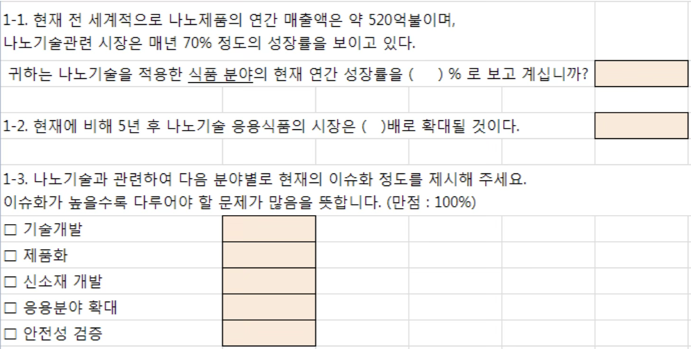{fig-align="center" width="60%"}

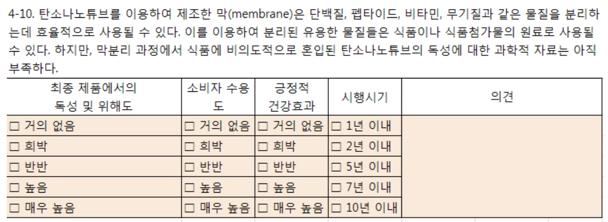{fig-align="center" width="60%"}

#### 1차 설문조사 실시 및 분석

1차 설문조사는 전문가 패널에게 최종적으로 확정된 설문지를 송부함으로써 시작된다.

**1. 설문 실시 방법**

- 설문 참여에 대한 동의를 얻고, 응답의 익명성과 기밀성을 보장한다.
- 설문 기간과 회신 방법을 구체적으로 안내한다.
- 온라인 설문 시스템(예: Google Forms, LimeSurvey 등)을 활용하면 관리가 용이하다.

**2. 응답 자료 분석**

- 빈도분석을 통해 각 문항의 응답 분포를 확인하고, 중복되거나 비효율적인 문항 제거를 고려한다.
- 개방형 문항의 응답은 내용분석(content analysis)을 통해 핵심 키워드와 공통된 의견을 도출하고, 이를 선택형 보기로 재구성하여 다음 회차 설문에 반영한다.

**3. 응답 일치도 분석 기준**

::: {.callout-note icon=false}
## 델파이 응답 일치도(합의 정도) 판단 기준

| 척도 유형 | 합의 기준 | 지표 |
|---------|---------|------|
| **리커트 척도** | IQR ≤ 1, 변동계수 ≤ 0.5 | IQR: 중앙 집중성, CV: 상대 분산 |
| **비율 척도** | 변동계수 ≤ 0.5 | CV = 표준편차/평균 |
| **객관식 선택 문항** | 50%~75% 이상 선택 | 단순 빈도 비율 |

IQR 값이 작을수록 의견이 모여 있음, 변동계수가 작을수록 응답이 일관적
:::

델파이 방법은 의견 수렴의 정도(합의 정도)를 확인하는 데 중점을 둔다. IQR(Interquartile Range)는 중앙 집중성을 확인하는 지표로, 값이 작을수록 의견이 모여 있음을 의미한다. 변동계수(CV)는 상대적 분산 정도를 나타내며, 평균에 대한 표준편차의 비율로 계산된다.

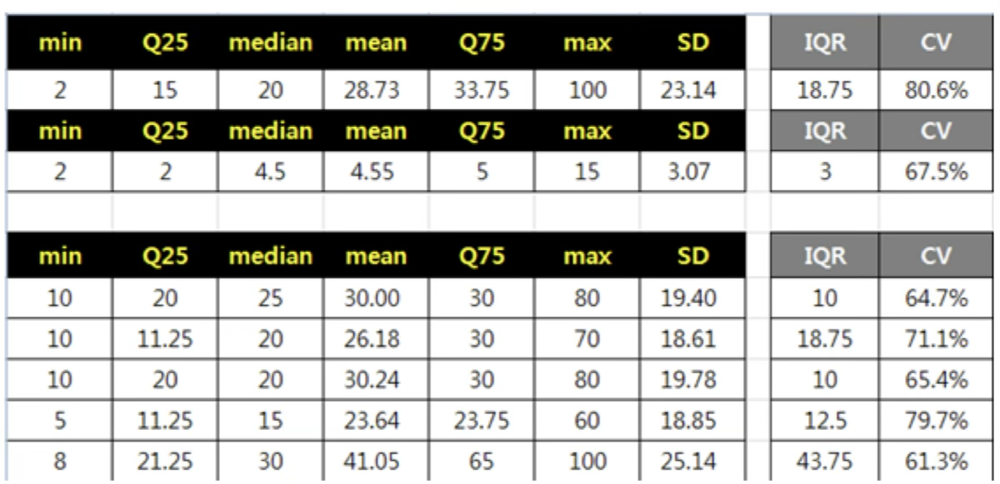{fig-align="center" width="60%"}

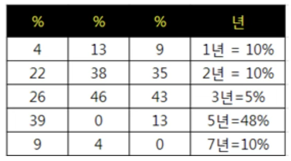{fig-align="center" width="60%"}

#### 2차 설문지 구성

2차 설문지는 1차 조사 결과를 바탕으로 정교하게 구성된다. 응답 일치도가 낮은 문항을 중심으로 표현 방식이나 선택지를 조정하여 응답자의 이해를 돕는다. 또한 1차 설문 결과 요약을 함께 제공하여, 전문가들이 다른 응답자들의 평균적 견해를 참고한 뒤 자신의 응답을 조정할 수 있도록 한다.

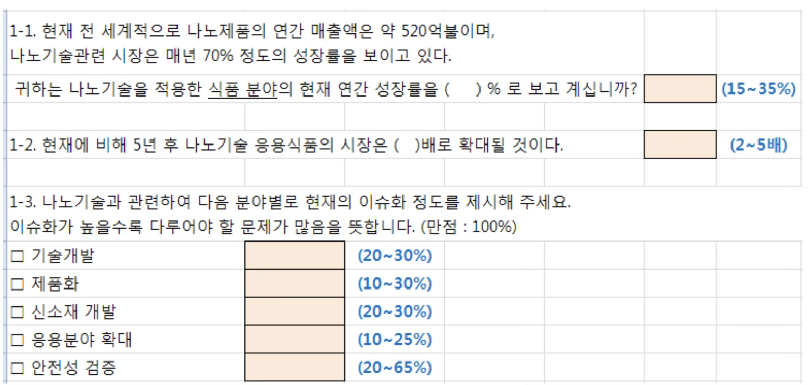{fig-align="center" width="60%"}

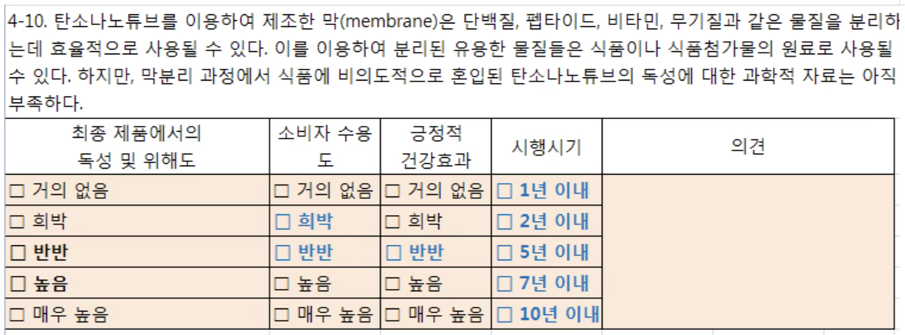{fig-align="center" width="60%"}

#### 2차 설문조사 실시

2차 설문은 수정된 문항을 반영하여 전문가 패널에게 재송부하는 단계로, 이 단계에서는 전문가들이 1차 조사 결과를 바탕으로 자신의 의견을 재검토하고 조정할 기회를 갖는다. 회수된 응답은 통계적으로 분석되어 응답 일치도를 다시 평가하며, 의견의 수렴 정도를 확인한다.

#### 최종 결과 보고서 작성

델파이 조사의 마지막 단계는 전체 조사 과정을 정리하고, 응답 분석 결과 및 전문가 의견의 수렴 과정을 체계적으로 요약한 최종 보고서를 작성하는 것이다. 델파이 결과 제시방법은 다음과 같다.

- **중요도 척도**: 최빈값 > 중위값과 IQR (Inter Quartile Range)
- **비율척도**: 중위값 > 평균, IQR (Inter Quartile Range)
- **선택 보기문항**: 빈도 백분율 (%) 표시

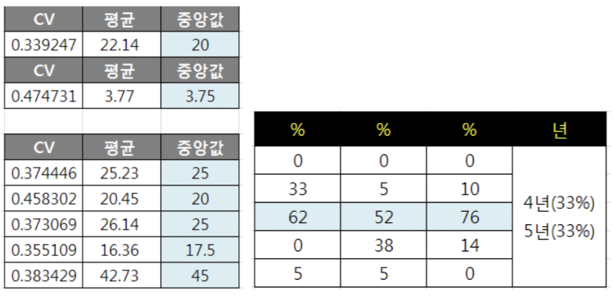{fig-align="center" width="60%"}

### 한계

::: {.callout-warning icon=false}
## 델파이 방법의 주요 한계

| 한계 | 내용 | 완화 방법 |
|------|------|---------|
| **미래 평가 절하** | 전문가도 현재 기준으로 미래를 판단하는 경향 | 시나리오 기반 질문 설계 |
| **단순화 경향** | 복잡한 요인 간 상호작용을 무시하고 단일 변수에 집중 | 시스템적 사고 촉진 질문 추가 |
| **전문성 한계** | 직관 의존, 근거 부족한 예측 제시 가능 | 전문가 선정 기준 엄격화 |
| **질문 명확성** | 모호한 질문으로 인한 의견 수렴 실패 | pilot test 필수, 단일 주제 원칙 |
:::

## AHP 방법

::: {.callout-note icon=false}
## 정의
**AHP(Analytic Hierarchy Process)**는 Thomas Saaty(1980)가 제안한 계량적 의사결정 기법으로, 정성적 혹은 무형적 특성을 상대적 비율 척도를 이용해 수량화하고, 복잡한 문제를 점차 작은 요소로 분해하여 이원 비교를 수행함으로써 최적의 선택을 도출한다.
:::

AHP는 두 가지 핵심 과정을 통해 문제를 분석한다.

- 정성적 혹은 무형적 특성을 상대적 비율 척도를 이용해 수량화하여 평가할 수 있도록 한다.
- 복잡한 문제를 점차 작은 요소로 분해하여 이원 비교를 수행함으로써 보다 단순한 형태로 의사결정을 진행한다.

### AHP 주요 특징

AHP는 복잡한 의사결정 문제를 체계적으로 분석하고 해결하기 위한 방법론으로, 여러 대안 중에서 최적의 선택을 도출하기 위해 다음과 같은 절차적 특징을 갖는다.

**계층적 구조 구성**: 가장 상위 수준의 의사결정 목표에서 출발하여, 그 아래 기준(criteria), 하위기준(sub-criteria), 그리고 최종적으로 대안(alternatives)으로 이어지는 계층 구조를 구성한다.

**쌍대비교(pairwise comparison)**: AHP는 쌍대비교를 통해 각 요소의 상대적 중요도를 평가한다. 이때 Saaty가 제안한 1~9의 정수 척도를 사용하여 두 요소 간 우선순위를 수치화하며, 이를 통해 각 요소의 가중치(weight)를 산출한다.

**일관성 검토**: 비교 결과는 판단 행렬(judgment matrix)로 구성되며, 고유값 분석(eigenvalue analysis)을 실시하여 일관성을 검토한다. 일관성 지수(CI)와 일관성 비율(CR)을 계산하여 수용 가능한 범위(CR < 0.1)를 넘을 경우 재검토가 요구된다.

**종합 점수 산출**: 계층 구조의 각 수준에서 산출된 가중치를 종합하여 각 대안의 종합 점수를 계산하고, 가장 높은 평가를 받은 대안을 최적의 선택으로 결정한다.

### AHP 기본 전제

AHP는 의사결정 과정에서 계층 구조 원리, 우선순위 결정 원리, 일관성 원리를 기본 전제로 한다.

**계층 구조 원리**: 복잡한 의사결정 문제를 보다 작은 요소로 분해하여 구조화하는 개념이다.

**우선순위 결정 원리**: 평가 요소 간 상대적인 중요도를 비교하여 가중치를 산출하는 과정이다. 이를 위해 이원 비교를 수행하며, 각 요소의 중요도를 수량화하여 최적의 의사결정을 도출할 수 있도록 한다.

**일관성 원리**: 의사결정 과정에서 논리적 일관성을 유지하도록 검증하는 절차이다. AHP는 일관성 비율을 활용하여 평가자의 판단이 논리적으로 타당한지 확인한다.

### AHP 절차

AHP는 의사결정 문제를 체계적으로 분석하고 최적의 대안을 도출하기 위해 다음과 같은 절차를 따른다.

::: {.callout-note icon=false}
## AHP 절차

| 단계 | 내용 |
|------|------|
| **① 계층화** | 목표·기준·하위기준·대안으로 계층적 모델 구축 |
| **② 데이터 수집** | 전문가 설문조사로 평가 요소 간 상대 비교 데이터 수집 |
| **③ 가중치 계산** | 상대 비교 행렬로 일관성 검토 및 상대적 가중치 산출 |
| **④ 우선순위 산정** | 가중치 종합하여 최적 대안 선정 |
:::

### 계층화

AHP 방법에서 가장 중요한 단계는 의사결정과 관련된 요소들을 계층화하는 과정이다. 계층화란 시스템을 구성하는 각 특성이나 속성을 기준으로 분할된 집단을 형성하는 과정으로, 하나의 집단이 특정한 하위 집단에만 영향을 주고, 동시에 상위 집단으로부터만 영향을 받는 구조를 의미한다.

**계층 설정 시 고려해야 할 사항**

첫째, 계층의 완전성과 비완전성을 고려해야 한다. Ramanujam과 Saaty(1981)는 AHP를 활용할 때 모든 계층을 반드시 완전하게 구조화할 필요는 없다고 주장하였으며, 일부 계층이 비완전하더라도 의사결정 과정에 큰 영향을 미치지 않는다고 보았다.

둘째, 계층 내 평가 요소의 개수가 적절하게 설정되어야 한다. Saaty(1980)는 계층 내 요소의 개수를 **5개~9개** 정도로 유지하는 것이 적절하며, 평가 요소 간 상대적 중요도를 비교할 때는 9점 척도를 사용하는 것이 바람직하다고 제안하였다.

**계층화의 기본 원칙과 단계**

- 최상위 계층에는 의사결정의 목표를 설정한다.
- 중간 계층에는 목표 달성에 영향을 미치는 주요 평가 요소(기준 및 하위 기준)를 배치한다.
- 최하위 계층에는 최종적으로 평가할 여러 대안을 포함한다.
- 계층이 낮을수록 요소들은 보다 구체적이어야 하며, 계층 내 요소들 간에는 비교가 가능해야 한다.
- 각 계층의 요소들은 직계 하위 집단에만 영향을 미치며, 동시에 상위 계층으로부터만 영향을 받는다.

### 상대비교 행렬 및 일관성 비율

AHP에서 계층 구조가 완성되면, 각 계층 내 평가 요소들의 상대적 중요도를 평가하기 위해 상대 비교 행렬을 작성한다. 상대 비교 행렬은 대칭 행렬의 형태를 가지며, 행렬의 차수는 평가 요소의 개수를 의미한다.

**절차**

- 상대 비교 행렬을 구성하여 평가 요소 간 상대적 중요도를 비교한다.
- 상대 비교 행렬의 대각 원소는 1이며, 상·하 대칭 원소는 역수 관계를 가진다.
- 응답자의 판단 일관성을 검토하기 위해 일관성 지수(CI)를 계산한다.
- 난수 지수(RI)를 활용하여 일관성 비율(CR)을 구하고, CR이 10% 미만이면 일관성이 확보된 것으로 판단한다.

**상대비교 행렬**

평가 요소를 $i,j$쌍으로 비교할 때, 평가 요소 $i$의 상대적 중요도를 $w_{i}$, 평가 요소 $j$의 상대적 중요도를 $w_{j}$라 하면, 상대 비교 행렬의 원소는 $a_{ij} = \frac{w_{i}}{w_{j}}$로 정의된다.

$$A = \begin{bmatrix}
a_{11} & a_{12} & \cdots & a_{1p} \\
a_{21} & a_{22} & \cdots & a_{2p} \\
a_{31} & a_{32} & \cdots & a_{3p} \\
 \vdots & \vdots & \ddots & \vdots \\
a_{p1} & a_{p2} & \cdots & a_{pp}
\end{bmatrix}$$

- 대각 행렬 원소: $a_{ii} = 1$ (자기 자신과의 비교는 항상 1)
- 상대 비교 값: $a_{ij}(i \neq j)$는 기준 평가 요소 $i$가 평가 요소 $j$에 비해 중요하다고 판단되는 정도를 의미하며, Saaty(1980)가 제안한 1~9 척도를 사용한다. (예: 1/9, 1/8, ..., 1, 2, ..., 9)
- 대응 원소 관계: $a_{ji} = \frac{1}{a_{ij}}$

**일관성 지수**

상대 비교 행렬이 완전히 일관성을 가지려면 $a_{ij} \cdot a_{jk} = a_{ik}$ 관계가 성립해야 하며, 상대 비교 행렬의 최대 고유치($\lambda_{\max}$)는 평가 요소의 개수 $n$과 동일하게 된다.

$$CI = \frac{\lambda_{\max} - n}{n - 1}$$

- **일관성이 높은 경우**: 응답자의 판단이 논리적으로 일관됨을 의미하며, 결과의 신뢰도가 높다.
- **일관성이 낮은 경우**: 응답자의 판단 과정에서 일관성이 유지되지 않았음을 의미하며, 결과의 신뢰도가 낮아진다.

**일관성 비율 (Consistency Ratio, CR)**

$CR = \frac{CI}{RI}$: CR 값이 10% 미만이면 일관성이 확보된 응답으로 간주한다.

::: {.callout-important icon=false}
## AHP 일관성 비율(CR) 판단 기준

$$CR = \frac{CI}{RI} < 0.10 \quad \text{→ 일관성 확보}$$

| CR 값 | 해석 | 조치 |
|-------|------|------|
| **CR < 0.10** | 일관성 확보 ✓ | 분석 진행 가능 |
| **CR ≥ 0.10** | 일관성 부족 ⚠ | 비교 행렬 재검토·수정 필요 |

난수 지수(RI): 차수에 따라 달라지며, 아래 표를 참고한다.
:::

| 차수 (n) | 1 | 2 | 3 | 4 | 5 | 6 | 7 | 8 | 9 |
|:--------:|:---:|:---:|:----:|:---:|:----:|:----:|:----:|:----:|:----:|
| RI | 0 | 0 | 0.58 | 0.9 | 1.12 | 1.24 | 1.32 | 1.41 | 1.45 |

: 난수 지수(RI) {.striped}

### 상대 중요도 계산

상대 비교 행렬을 통해 계층 내 평가 요소들의 상대적 중요도를 평가하고 일관성을 검증한 후, 최종적으로 상대적 중요도(가중치)를 산출하는 과정이 진행된다.

먼저, 상대 비교 행렬로부터 최대 고유치($\lambda_{\max}$)를 구하고, 이에 대응하는 고유 벡터를 도출한다. 고유 벡터의 각 원소는 평가 요소의 상대적 중요도를 나타내며, 모든 원소의 합이 1이 되도록 정규화하여 최종 가중치를 산출한다.

**계층이 2개 이상인 경우**

의사결정 과정에서 일반적으로 계층은 2개 이상으로 구성된다. 이 경우, 각 계층별로 동일한 방법을 반복하여 평가 요소들의 가중치를 산출한다. 최하위 계층의 평가 요소에 대한 최종 가중치는 자신이 속한 계층의 가중치와 상위 계층의 평가 요소 가중치를 곱하여 계산된다.

**다수의 평가자가 존재하는 경우**

의사결정 과정에서 평가자가 2명 이상인 경우, 개별적으로 도출된 상대 비교 행렬을 종합하여 단일 그룹 상대 비교 행렬을 생성하는 과정이 필요하다.

**1. 그룹 평가 방법(Delphi 방법)**: 평가자들의 의견을 종합하여 하나의 상대 비교 행렬을 직접 작성하는 방법이다.

**2. 개별 평가 후 그룹 전체 상대 비교 행렬 산출 방법**: 각 평가자의 상대 비교 행렬을 개별적으로 작성한 후, Saaty(1980)가 제안한 기하 평균(geometric mean)을 적용하여 단일 비교 행렬을 생성하는 방식이다.

### AHP 활용 사례

네트워크 환경에서 발생하는 사이버 위협의 위협 수준을 정량적으로 산정하기 위해 계층 분석 기법을 적용할 수 있다.

- **최상위 계층**: 사이버 위협도 산정을 위한 핵심 평가 요소(감염 대상 획득, 감염 경로, 감염 시 증상, 방어 조치 난이도, 피해 자산 유형)
- **중간 계층**: 각 5개 평가 요소별 하위 평가 기준
- **최하위 계층**: 사이버 위협의 개별 사례(대안), 즉 위협 발생 사례별 위협도 점수

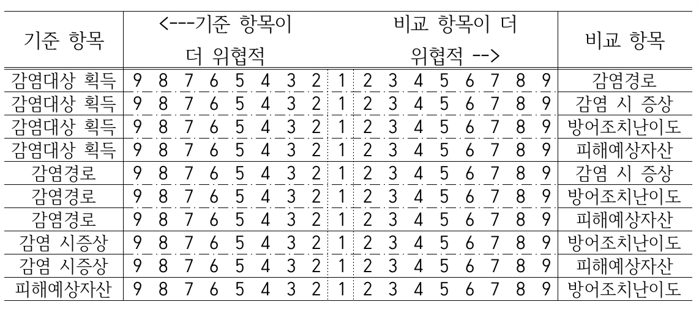{fig-align="center" width="60%"}

사이버 위협 관련 전문가 3명을 대상으로 설문 조사를 실시하여 상대비교 행렬을 얻었다. ID 1번, 2번 응답자의 일관성 비율이 10% 미만이었으므로, 이들만 응답의 일관성을 유지하였음을 알 수 있다.

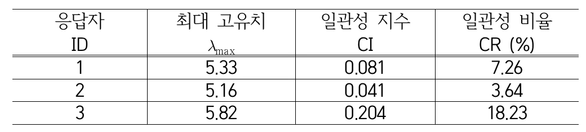{fig-align="center" width="60%"}

평가 일관성을 유지한 ID 1번, 2번 응답자의 상대비교 행렬을 이용하여 단일 상대비교 행렬을 구하면 아래와 같다. 단일 상대비교 행렬은 Saaty(1980)가 제안한 기하평균 방법을 이용하여 구해졌다.

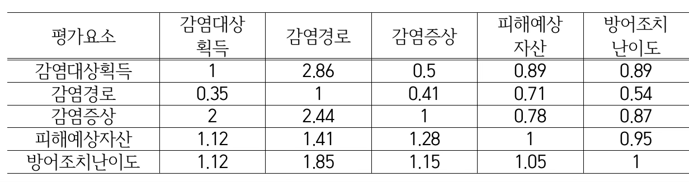{fig-align="center" width="60%"}

단일 상대비교 행렬의 최대 고유치는 5.127이므로 일관성 지수 CI=0.032이고, 일관성 비율 CR=2.8%이다. 결과를 해석해 보면, 네트워크상에서 사이버 위협이 발생했을 때 피해예상자산이 감염경로에 비해 2배 더 위협적이라는 할 수 있다.

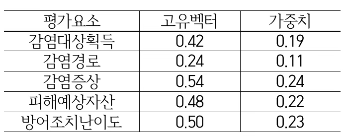{fig-align="center" width="60%"}

## 컨조인트 분석

::: {.callout-note icon=false}
## 정의
**컨조인트 분석(Conjoint Analysis)**은 소비자의 선호를 평가하고 예측하기 위해 설계된 다변량 통계 기법으로, 제품 또는 서비스의 속성과 각 속성의 수준에 대한 소비자의 선호도를 분석한다. 마케팅, 제품 기획, 가격 결정 등의 분야에서 널리 활용된다.
:::

컨조인트 분석의 기본 개념은 소비자가 제품을 개별 속성 단위가 아니라, 속성들의 조합(conjoint)으로 인식하고 평가한다는 점에 있다. 'Conjoint'라는 용어는 'Consider'와 'Jointly'의 합성어로, 소비자가 여러 속성을 함께 고려하여 평가한다는 개념을 반영하고 있다.

::: {.callout-tip icon=false}
## 컨조인트 분석 세 가지 유형 비교

| 구분 | 전통적 컨조인트 | 적응형 (ACA) | 선택기반 (CBC) |
|------|--------------|------------|-------------|
| **설문 방식** | 모든 응답자에게 동일한 프로필 | 이전 응답에 따라 맞춤형 제시 | 여러 제품 중 하나 선택 |
| **실제성** | 낮음 | 중간 | 높음 (실제 구매와 유사) |
| **피로도** | 높음 | 낮음 | 중간 |
| **속성 수** | 제한적 | 많아도 가능 | 제한적 |
| **추정 방법** | OLS, 로짓 | HB 베이지안 | 다항 로짓(MNL) |
| **주요 활용** | 속성별 효용 추정 | 개인 맞춤 분석 | 시장 점유율 예측 |
:::

### 컨조인트 분석 개념

#### 목적

컨조인트 분석은 제품 및 서비스 기획에서 중요한 의사결정을 내리는 데 활용되며, 주요 목적은 다음과 같다.

- 독립변수(속성)의 상대적 중요도를 분석하여 특정 제품이나 서비스의 평가 요소를 도출한다.
- 종속변수(소비자 선호도)에 미치는 영향을 정량적으로 측정하여 소비자가 무엇을 중요하게 여기는지를 파악한다.
- 최적의 속성 조합을 찾아 기업의 제품 기획 및 마케팅 전략에 반영하여 경쟁력을 강화한다.

#### 개념

컨조인트 분석은 소비자가 제품의 다양한 속성을 어떻게 평가하고 선택하는지를 분석하기 위한 방법이다. 실제 조사에서는 제품이나 서비스의 대안을 여러 속성의 조합으로 구성하여 제시하고, 소비자가 이들 조합 중 어떤 방식을 선호하는지를 평가하게 한다.

**컨조인트 분석과 다차원척도법(Multidimensional Scaling) 비교**

- **컨조인트 분석**: 제품이나 서비스의 속성을 요인 설계 방식으로 조합한 후, 응답자가 어떤 조합을 선호하는지 평가하게 함으로써 속성별 효용(utility)을 추정한다.
- **다차원척도법(MDS)**: 소비자가 느끼는 제품이나 브랜드 간의 유사성 또는 선호도 차이를 바탕으로, 그 관계를 저차원의 공간에 시각화하는 방법이다.

요약하면, 컨조인트 분석은 속성 기반의 선택 분석에, MDS는 심리적 거리 기반의 포지셔닝 분석에 적합한 방법이다.

#### 고려 사항

- **종속변수 측정상의 문제**: 응답자의 선호나 선택을 어떻게 정량화할 것인지 명확히 설정해야 한다. 순위(rank), 평점(rating), 선택(choice) 방식 중 어떤 방식을 택할지에 따라 분석 기법이 달라지고, 결과 해석에도 영향을 미친다.

- **독립변수 결합상의 문제**: 독립변수(속성)들을 어떤 방식으로 조합해 제시할 것인지가 분석의 핵심이다. 전수조합(full-profile design)은 정보가 많지만 부담이 크고, 부분요인 설계(fractional factorial design)는 효율적이지만 정보 손실 위험이 있다.

#### 기본원리

제품이나 서비스는 여러 속성의 조합으로 구성되며, 각 속성은 여러 수준을 가질 수 있다. 예를 들어, 스마트폰을 고려할 경우 다음과 같은 속성과 수준이 존재할 수 있다.

| 속성(Attribute) | 수준(Levels) |
|:--------------:|:------------:|
| 화면 크기 | 5인치, 6인치, 7인치 |
| 배터리 용량 | 3000mAh, 4000mAh, 5000mAh |
| 가격 | 50만원, 70만원, 90만원 |

: 컨조인트 분석 속성 및 수준 예시 {.striped}

### 컨조인트 분석 관련 용어 정리

**1. Attribute (속성)와 Level (수준)**

- **속성**: 제품이나 서비스가 가지는 독립변수로, 소비자가 고려하는 주요 특성이다.
- **수준**: 각 속성이 취할 수 있는 값. 컨조인트 분석에서는 최소 두 개 이상의 수준을 가져야 하며, 일반적으로 4~5개 이내로 설정하는 것이 적절하다.

예제: 휴대폰의 속성이 3개(화면크기, 배터리 용량, 가격)이고, 각 속성이 3개의 수준을 가진다면, 가능한 제품 조합 수는 $3 \times 3 \times 3 = 27$개이다.

**2. 종속변수 dependent variable**: 소비자가 특정 속성 조합을 선호하는 정도를 나타내는 값으로, 컨조인트 분석에서 최적의 제품 설계를 위한 핵심 정보가 된다.

**3. 주효과 main effects**: 독립변수(속성)가 종속변수에 미치는 직접적인 영향을 의미한다. 특정 속성이 전체 선호도에 어느 정도 기여하는지 평가할 수 있다.

### 컨조인트 분석 모형

#### 이론적 배경

컨조인트 분석의 이론적 기초는 효용 이론과 선택 모델에 기반을 둔다.

**(1) 효용 이론(Utility Theory)**: 선택 대안의 속성이 개인의 효용에 미치는 영향을 분석하며, 소비자는 주어진 대안 중 최대 효용을 제공하는 대안을 선택한다고 가정한다.

**(2) 분해적 접근(Decompositional Approach)**: 전체적인 선택을 기반으로 개별 속성이 미치는 영향을 역추정하는 방식이다.

**(3) 다속성 효용 모형(Multi-Attribute Utility Model)**: 개별 속성이 전체 효용에 미치는 기여도를 평가하며, 가장 일반적인 효용 함수는 선형 가법적 형태로 표현된다.

#### 전통적 컨조인트 분석

전통적 컨조인트 분석은 다속성 효용 모형을 기반으로 하며, 소비자가 제품을 선택할 때 각 속성이 독립적으로 효용을 제공한다고 가정한다.

**(1) 가법적 효용 모형(Additive Utility Model)**

$$U(X) = \beta_{0} + \beta_{1}X_{1} + \beta_{2}X_{2} + \ldots + \beta_{k}X_{k} + \varepsilon$$

- $U(X)$: 소비자가 선택한 대안 $X$의 총 효용값
- $X_{1},X_{2},\ldots,X_{k}$: 제품의 속성들
- $\beta_{0}$: 상수항
- $\beta_{1},\beta_{2},\ldots,\beta_{k}$: 각 속성의 가중치(효용 값)
- $\varepsilon$: 오차항(random error)

**(2) 수행 절차**

**① 속성 및 수준 선정**

연구자가 제품의 주요 속성과 각 속성의 수준을 결정한다.

| 속성(Attribute) | 수준(Levels) |
|:--------------:|:------------:|
| 가격 | 100만원, 120만원, 140만원 |
| 배터리 용량 | 3000mAh, 4000mAh, 5000mAh |
| 브랜드 | 삼성, 애플, 샤오미 |

: 스마트폰 속성 및 수준 {.striped}

**② 실험 설계**

총 조합 개수는 27개가 되어 가능한 모든 조합을 평가하는 것은 비효율적이므로, 부분(1/3) 요인 설계를 사용하여 9개의 대표적인 제품 프로필을 선정한다.

| 가격 | 배터리 용량 | 브랜드 |
|:----:|:---------:|:------:|
| 100만원 | 3000mAh | 삼성 |
| 100만원 | 4000mAh | 애플 |
| 100만원 | 5000mAh | 샤오미 |
| 120만원 | 3000mAh | 샤오미 |
| 120만원 | 4000mAh | 삼성 |
| 120만원 | 5000mAh | 애플 |
| 140만원 | 3000mAh | 애플 |
| 140만원 | 4000mAh | 샤오미 |
| 140만원 | 5000mAh | 삼성 |

: 부분 요인 설계 제품 프로필 {.striped}

**③ 데이터 수집**

적정 응답자 수: $n \geq \frac{1000 \times c}{a \times t}$ Johnson & Orme (1996)의 경험적 공식

(예제) $n \geq \frac{1000 \times 3}{3 \times 9} = \frac{3000}{27} = 111.1 \approx 112$

- $c$: 각 속성의 최대 수준 개수
- $a$: 하나의 제품 프로필에 포함된 속성 개수
- $t$: 한 명의 응답자가 평가하는 제품 프로필 수

종속변수: 응답자는 10점 척도나 선호여부(0, 1)로 응답한다.

독립변수: $X_{1} = \text{가격 120만원}$, $X_{2} = \text{가격 140만원}$, $X_{3} = \text{배터리 4000mAh}$, $X_{4} = \text{배터리 5000mAh}$, $X_{5} = \text{브랜드 애플}$, $X_{6} = \text{브랜드 샤오미}$

**④ 모형 추정 및 해석**

10점 척도는 OLS 추정, 선호 여부는 로짓회귀로 추정한다.

| 속성 | 수준 | 효용 값 (추정) |
|:----:|:----:|:------------:|
| 가격 | 120만원 | 0.3333 |
| 가격 | 140만원 | -1.3333 |
| 배터리 | 4000mAh | 2 |
| 배터리 | 5000mAh | 2.5 |
| 브랜드 | 애플 | -1.3333 |
| 브랜드 | 샤오미 | -0.6667 |

: 모형 추정 결과 {.striped}

::: {.callout-note icon=false}
## 컨조인트 분석 결과 해석
- **양(+)의 효용값**: 해당 수준이 선호도를 높임
- **음(-)의 효용값**: 해당 수준이 선호도를 낮춤
- **기준(baseline)**: 분석에서 제외된 기준 수준에 효용 0 부여 (예: 가격 100만원, 배터리 3000mAh, 브랜드 삼성)

**이 사례의 결론:**
- 가격이 높아질수록 선호도 감소 (120만원까지만 소폭 증가)
- 배터리 용량이 커질수록 선호도 증가
- 삼성 브랜드가 가장 선호됨
- **최적 제품 조합: 120만원 × 5000mAh × 삼성 브랜드**
:::

#### 적응형 컨조인트 분석 (Adaptive Conjoint Analysis, ACA)

적응형 컨조인트 분석은 응답자의 선택에 따라 설문이 동적으로 조정되는 방식의 컨조인트 분석 기법이다. 전통적 컨조인트 분석과 달리, 모든 응답자에게 동일한 제품 프로필을 제시하는 것이 아니라, 응답자의 초기 선호도를 기반으로 이후 질문이 맞춤형으로 제시되는 방식을 사용한다.

- 응답자의 피로도를 줄일 수 있음 (불필요한 속성 조합을 제외)
- 높은 차원의 속성을 포함할 수 있음 (속성이 많아도 설문이 복잡해지지 않음)
- 개인 맞춤형 분석이 가능 (응답자마다 다른 질문을 받을 수 있음)

**(1) 이론적 모형**: 전통적 컨조인트 분석과 동일한 가법적 효용 모형을 사용한다.

$$U(X) = \beta_{0} + \beta_{1}X_{1} + \beta_{2}X_{2} + \ldots + \beta_{k}X_{k} + \varepsilon$$

전통적 컨조인트 분석에서는 모든 응답자가 동일한 속성 조합을 평가하는 반면, 적응형 컨조인트 분석에서는 응답자의 이전 응답을 반영하여, 이후 질문이 동적으로 조정한다.

**(2) 설문방식**

**1. 속성별 중요도 평가**

- Q1. 가격이 얼마나 중요한가요? 5점 척도
- Q2. 배터리 용량이 중요한가요? 5점 척도
- Q3. 브랜드 선호도가 있는가요? 브랜드 3개

**2. 속성 수준 비교 질문**: 응답자의 답변을 바탕으로 맞춤형 제품 조합을 생성하여 비교 질문을 제시한다.

- Q. 다음 두 가격 수준 중 어느 것이 더 선호됩니까? → A: 100만원 / B: 120만원
- Q. 배터리 용량 중 어느 수준을 선호합니까? → A: 4000mAh / B: 5000mAh

**3. 제품 프로필 비교**: 이전 응답을 바탕으로, 응답자가 비교하기 쉬운 2개의 제품 프로필을 생성하여 선택하도록 한다.

"다음 두 제품 중 하나를 선택하세요."

- A 제품: 120만원, 5000mAh, 삼성
- B 제품: 100만원, 3000mAh, 애플

**(3) 추정방법**: OLS 또는 계층적 베이지안 추정(HB)을 사용한다.

- **(방법1) OLS**: 전통적 컨조인트 분석과 동일한 최소 자승법을 사용한다.
- **(방법2) 계층적 베이지안 추정(HB)**: 개별 응답자의 효용 값을 베이지안 추론으로 추정하며, 모집단 평균과 개별 차이를 반영하여 신뢰성 높은 효용 값을 도출한다.

#### 선택기반 컨조인트 분석 (Choice-Based Conjoint, CBC)

선택기반 컨조인트 분석은 소비자가 여러 개의 제품 옵션 중 하나를 선택하는 방식으로 데이터를 수집하는 컨조인트 분석 기법이다. 이는 소비자의 실제 구매 행동과 가장 유사한 방법으로 설계되었으며, 시장 점유율 예측, 최적의 제품 조합 분석, 가격 민감도 측정 등 다양한 마케팅 전략 수립에 활용된다.

CBC의 가장 큰 특징은 응답자가 단순히 제품의 속성에 점수를 부여하거나 순위를 매기는 것이 아니라, 실제 구매 결정을 내리는 것처럼 여러 제품 중 하나를 선택하는 방식으로 응답한다는 점이다.

**(1) 이론적 배경**: 이산 선택 모형을 기반으로 하며, 경제학의 랜덤 효용 모형을 적용하여 소비자가 가장 높은 효용을 제공하는 제품을 선택한다고 가정한다.

효용 함수: 소비자가 제품 $i$를 선택할 확률은 효용 함수를 통해 결정된다.

$U_{i} = V_{i} + \varepsilon_{i}$

- $U_{i}$: 제품 $i$의 총 효용
- $V_{i}$: 관측 가능한 속성들의 가중 합
- $\varepsilon_{i}$: 오차항 ~ (정규 분포 또는 로지스틱 분포 가정)

특히, 효용 값 $V_{i}$는 제품의 속성 값과 해당 속성의 가중치의 선형 조합으로 표현된다.

$V_{i} = \beta_{0} + \beta_{1}X_{1} + \beta_{2}X_{2} + \ldots + \beta_{k}X_{k}$

- $X_{1},X_{2},\ldots,X_{k}$: 제품 속성 값
- $\beta_{1},\beta_{2},\ldots,\beta_{k}$: 속성별 효용 계수

**(2) 설문방식**: 27개 또는 9개 조건 중 3개를 임의로 선정하여 응답자에게 보여주고 선호하는 제품을 선택한다.

**(3) 추정방법**: 다항 로짓 모형(Multinomial Logit Model, MNL)

이 모형은 소비자가 특정 제품을 선택할 확률을 예측하는 방식으로 동작한다.

$$P(i) = \frac{e^{V_{i}}}{\sum_{j}e^{V_{j}}}$$

- $P(i)$: 소비자가 제품 $i$를 선택할 확률
- $e^{V_{i}}$: 제품 $i$의 효용 값을 지수 함수로 변환한 값
- $\sum_{j}e^{V_{j}}$: 모든 제품의 효용 값의 합
