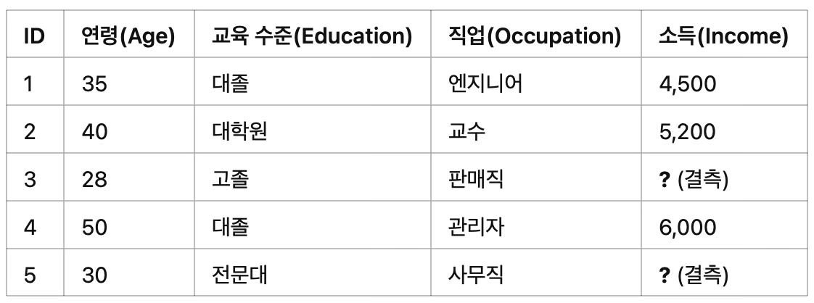
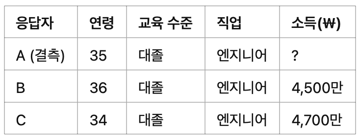

 

## 무응답 개요

::: {.callout-note icon=false}
## 정의
**무응답(Nonresponse)**은 표본으로 선정된 일부 응답자가 질문에 답하지 않는 현상으로, 추정값 편향과 표본 대표성 훼손을 초래할 수 있다.
:::

설문조사에서 무응답(nonresponse)은 표본으로 선정된 일부 응답자가 질문에 답하지 않는 현상을 의미한다. 이러한 무응답이 발생하면, 추정값이 편향될 수 있으며 표본이 모집단을 제대로 대표하지 못하게 되어 분석 결과의 신뢰성이 떨어질 가능성이 높다.

::: {.callout-warning icon=false}
## 무응답이 위험한 이유

| 문제 | 영향 |
|------|------|
| **편향(Bias)** | 무응답자가 응답자와 다른 특성을 가지면 추정값이 실제 값과 체계적으로 차이 발생 |
| **대표성 훼손** | 특정 집단이 집중적으로 빠지면 표본이 모집단의 다양성을 반영하지 못함 |
| **분산 증가** | 유효 응답 수 감소 → 표본 오차 증가 → 신뢰구간 확대 |
| **일반화 어려움** | 무응답이 많을수록 조사 결과를 모집단에 적용하기 어려워짐 |
:::

무응답자가 응답자와 다른 특성을 가진다면, 응답자만을 대상으로 계산한 추정값은 모집단 전체의 실제 값과 차이를 보일 수 있다. 특히 무응답이 일정한 방향이나 경향성을 가지는 경우, 이는 단순한 오류를 넘어서 설계 전체에 체계적인 편향을 초래할 수 있으며, 이를 **무응답 편향(nonresponse bias)**이라고 한다.

| 유형 | 정의 | 예시 |
|------|------|------|
| **단위 무응답** (unit nonresponse) | 표본으로 선정된 사람이 조사에 전혀 응답하지 않는 경우 | "설문조사에 절대 참여하지 않겠다"고 거부 |
| **항목 무응답** (item nonresponse) | 전체 설문에는 참여했지만 특정 질문에만 응답하지 않는 경우 | "가구 소득은 아내가 관리해서 모르겠다" |

: 무응답의 두 가지 유형 {.striped}

**단위 무응답 unit nonresponse**

무응답이 발생하는 방식 중 하나는 단위 무응답(unit nonresponse)으로, 이는 표본으로 선정된 사람이 조사에 전혀 응답하지 않는 경우를 의미한다. 예를 들어 어떤 조사 대상자가 전화를 받자마자 "나는 설문조사에 절대 참여하지 않는다. 다시 전화하지 말라"고 말하며 응답을 거부하는 경우, 이는 전형적인 단위 무응답에 해당한다.

**항목 무응답 item nonresponse**

무응답이 전체 문항이 아닌 일부 질문에서만 발생하는 경우를 항목 무응답(item nonresponse)이라고 한다. 이는 응답자가 특정 질문에 대해서만 답변을 하지 않거나 회피하는 상황을 말한다. 예를 들어 "작년 총 가구 소득이 얼마였습니까?"라고 묻자, 응답자가 "모르겠다. 아내가 그런 기록을 관리한다"고 답하며 해당 항목에 대한 응답을 유보하는 경우, 이는 항목 무응답에 해당한다.

## 단위 무응답 유형

| 유형 | 정의 | 주요 원인 |
|------|------|-----------|
| **조사 요청 전달 실패** | 조사자가 대상자에게 요청을 전달하지 못하는 경우 | 연락처 오류, 우편 반송, 물리적 접근 불가 |
| **응답 거부** | 요청을 인지했으나 설문 참여를 거절하는 경우 | 불신, 시간 부족, 개인적 이유 |
| **응답 불가능** | 인지적·신체적 이유로 응답이 불가능한 경우 | 언어 장벽, 고령, 문해력 부족 |

: 단위 무응답의 세 가지 유형 {.striped}

무응답은 여러 가지 이유로 발생할 수 있으며, 크게 세 가지 유형으로 구분할 수 있다.

첫째, 조사 요청 전달 실패는 조사자가 표본으로 선정된 대상자에게 조사 요청을 전달하지 못하는 경우를 의미한다. 둘째, 응답 거부는 조사 대상자가 조사 요청을 인지했음에도 불구하고 설문 참여를 명확히 거절하는 경우에 해당한다. 셋째, 응답 불가능은 조사 대상자가 설문 문항을 이해하지 못하거나, 인지적 또는 신체적인 이유로 응답할 수 없는 경우를 의미한다.

### 조사 요청 전달 실패로 인한 단위 무응답

비접촉 또는 조사 요청 전달 실패로 인한 무응답은 조사 대상자가 특정한 데이터 수집 방식으로는 접근이 어려운 경우에 발생한다. 이와 같은 상황에서 중요한 개념은 **접근 가능성**이며, 이는 조사자가 표본으로 선정된 대상자에게 실제로 연락하거나 조사를 수행할 수 있는지를 의미한다.

::: {.callout-tip icon=false}
## 접촉 성공률을 높이는 전략
- **통화 시간대:** 일요일~목요일 저녁, 주말 낮 시간대가 응답률이 높음
- **반복 시도:** 첫 번째 시도에서 성공률이 가장 높고, 이후 지수적으로 감소
- **사전 통지:** 우편·이메일로 조사 계획을 미리 안내하면 신뢰도 향상
- **데이터 수집 기간:** 기간이 길수록 응답자 접촉 가능성 증가
:::

**가구 설문조사에서 접근 가능성 문제**

조사자가 응답자가 집에 머무는 시간을 알고 있다면, 단 한 번의 시도로도 성공적으로 접촉할 수 있다. 그러나 실제 조사에서는 표본 대상자의 접근 가능한 시간이 사전에 알려져 있는 경우가 드물다. 이로 인해 조사자는 동일한 대상자에게 여러 차례 연락을 시도해야 하며, 이는 조사 비용과 시간이 증가하는 원인이 되기도 한다.

**접근이 어려운 사례**

조사 요청 전달이 실패하는 주요 원인 중 하나는 물리적인 접근의 제한이다. 이는 출입이 통제된 아파트 건물이나 자동 응답 전화 시스템이 설치된 경우, 발신자 번호를 차단하거나 필터링하는 서비스를 이용하는 경우 등이 포함된다.

**첫 번째 시도에서 조사 성공률이 가장 높다.**

성공적인 연락률은 통화 시도 횟수가 늘어날수록 점차 감소하는 경향이 있으며, 이러한 감소는 종종 지수적인 형태를 따른다. 통화가 이루어지는 시간대와 모집단의 특성에 따라 접근 가능성이 다르게 나타날 수 있다.

**우편, 이메일, 웹 설문조사**

인터뷰어가 직접 접촉하지 않는 방식의 조사는, 조사 요청이 표본 대상자에게 지속적으로 노출될 수 있도록 설계되어야 한다. 우편 설문조사의 경우, 설문지가 일단 가구에 도착하면 응답 여부와 관계없이 일정 기간 동안 가구 내에 그대로 남아 있게 되어 원하는 시간에 응답할 수 있다.

### 응답거부로 인한 단위 무응답

설문조사의 성공 여부는 응답자가 낯선 조사자의 요청에 자발적으로 응할 의사가 있는지에 크게 좌우된다.

::: {.callout-note icon=false}
## 응답자가 설문에 참여하기 위한 심리적 조건
1. 조사자로부터 신체적 또는 경제적 피해를 입을 것이라는 **두려움이 없어야** 한다.
2. 응답 과정에서 자신의 **평판이 손상될 가능성을 걱정하지 않아야** 한다.
3. 설문 참여로 인해 심리적 스트레스를 겪을 수 있다는 **불안이 없어야** 한다.
4. **기밀 보장에 대한 신뢰**가 확보되어야 한다.
5. 솔직한 정보를 제공하더라도 **불이익을 받거나 위험에 처하지 않을 것**이라고 믿어야 한다.
:::

#### 설문조사와 타 조사의 차이

설문조사 요청은 사람들이 일상생활에서 경험하는 다양한 외부 요청들과 비교해볼 수 있으며, 이러한 비교는 설문 응답 행태를 이해하는 데 중요한 시사점을 제공한다.

- **경험 빈도:** 낯선 사람으로부터 걸려오는 전화는 설문조사보다 상업적 목적인 경우가 훨씬 더 많아, 응답자가 설문 요청을 다른 상업적 요청과 혼동할 가능성이 높다.
- **인센티브:** 설문조사는 소정의 금전적 보상이나 선물을 제공하는 경우가 있으나, 판매나 서비스 요청에서는 일반적으로 이러한 유인책이 제공되지 않는다.
- **연락의 지속성:** 확률 표본조사는 표본의 대표성을 확보해야 하므로 동일 가구에 대해 여러 차례 연락을 시도하는 경우가 많다.

#### 응답거절 단위 무응답 발생 요인

설문조사에서 응답률을 높이고 무응답 편향을 줄이기 위해서는 응답 거절로 인한 단위 무응답 발생 요인을 이해하는 것이 중요하다.

::: {.callout-note icon=false}
## 단위 무응답 발생 요인 구분

| 구분 | 요인 | 내용 |
|------|------|------|
| **통제 불가** | 사회적 환경 | 대도시: 익명성·경계심으로 거절 비율 높음 |
| **통제 불가** | 개인 특성 | 남성이 여성보다 거절 가능성 높음 |
| **통제 가능** | 조사원 능력 | 경험 풍부한 조사원 → 더 높은 협조율 |
| **통제 가능** | 인센티브 | 소정의 보상 제공 → 응답률 향상 |
:::

#### 응답거절 관련 이론적 가설

응답 거절을 설명하는 데 활용되는 이론적 가설은 설문조사의 응답률과 무응답 편향을 이해하는 데 중요한 통찰을 제공한다.

| 가설 | 핵심 내용 |
|------|-----------|
| **기회비용 가설** | 바쁜 사람일수록 설문 참여를 시간 낭비로 인식하여 거부 가능성이 높음 |
| **사회적 고립 개념** | 사회경제적 양극단(매우 부유 또는 매우 빈곤)에 위치한 사람들은 사회 기관과의 관계가 약해 거부 경향 |
| **주제 관심 가설** | 특정 주제에 관심 있는 사람만 응답 → 표본이 해당 주제에 편향된 집단으로 구성될 위험 |
| **과도한 설문조사** | 반복적·빈번한 설문 요청은 응답 피로도를 높여 거부율 증가 |

: 응답 거절의 이론적 가설 {.striped}

::: {.callout-tip icon=false}
## 이론적 가설의 실무적 시사점
- **바쁜 사람** → 짧은 설문, 자기기입 방식 활용
- **사회적 고립 계층** → 신뢰할 수 있는 기관 이름 강조, 인센티브 제공
- **주제 관심 편향** → 표본 대표성 검토, 가중치 보정 필수
- **조사 피로** → 설문 빈도 조절, 조사 목적의 차별성 강조
:::

#### 레버리지-현저성 이론 leverage-salience theory

::: {.callout-note icon=false}
## 레버리지-현저성 이론 (Leverage-Salience Theory)
사람들이 설문 요청의 여러 속성(주제, 소요 시간, 후원 기관, 데이터 활용 목적 등)을 서로 다르게 중요하게 여긴다는 이론. 조사자가 강조하는 속성이 응답자의 가치관이나 관심과 부합하면 응답 가능성이 높아진다.

→ **실무 적용:** 단일한 접근 방식만으로는 한계. 응답자가 긍정적으로 인식할 수 있는 속성을 파악하고 이를 적절히 강조하는 **맞춤형 접근 전략**이 필요하다.
:::

조사자는 사전에 어떤 속성이 응답자에게 중요한지를 알기 어렵지만, 설문이 진행되는 과정에서 특정 속성이 강조되면 응답자의 응답 여부에 영향을 미칠 수 있다.

### 요청된 데이터를 제공할 수 없는 경우의 단위 무응답

단위 무응답은 응답자가 설문에 응할 의사가 있음에도 불구하고, 요청된 데이터를 제공할 수 없는 경우에도 발생할 수 있다.

- 설문이 제공되는 언어를 전혀 이해하지 못하거나 인지적 제약이 있는 경우
- 건강 문제로 인해 응답이 어려운 경우
- 문해력에 제한이 있어 설문지를 읽거나 해석하는 데 어려움을 겪는 경우
- 기업 조사에서 조사 형식이 적절하지 않거나 시간이 부족한 경우

## 응답률 계산

### 무응답이 통계 품질에 미치는 영향

무응답으로 인해 발생하는 편향은 무응답의 원인이 조사 대상이 되는 통계적 특성과 연관될 때 더욱 심각해진다.

::: {.callout-important icon=false}
## 핵심 원칙: 응답률 ≠ 품질
높은 응답률이 반드시 낮은 무응답 편향을 의미하지 않는다. **무응답자의 특성이 응답자와 크게 다를 경우**, 응답률을 높여도 편향은 여전히 존재하거나 심화될 수 있다. 따라서 응답률 향상과 함께 **무응답자 특성 분석 및 보정**이 반드시 병행되어야 한다.

**실제 사례:** HIV 유병률 조사 — 금전적 보상까지 제공했으나 감염자의 응답률은 여전히 낮았다. 사회적 낙인으로 인한 기피 → 감염률 과소추정 발생
:::

무응답 편향이 발생하는지를 판단하기 위해서는 응답 여부에 영향을 미치는 인과 메커니즘을 고려해야 한다. 문제는 대부분의 경우 연구자가 무응답이 어떤 특성과 연관되어 발생하는지를 명확히 파악하기 어렵다는 데 있다.

### 응답률 계산

#### 무응답 편향 계산 공식

::: {.callout-note icon=false}
## 무응답 편향 계산식

$${\overline{y}}_{r} - {\overline{y}}_{s} = \frac{m_{s}}{n_{s}}({\overline{y}}_{r} - {\overline{y}}_{m})$$

| 기호 | 의미 |
|------|------|
| ${\overline{y}}_{s}$ | 특정 표본에서 선택된 전체 응답의 평균 |
| ${\overline{y}}_{r}$ | 해당 표본 내 응답자의 평균 |
| ${\overline{y}}_{m}$ | 해당 표본 내 무응답자의 평균 |
| $n_{s}$ | 해당 표본의 총 표본 수 |
| $r_{s}$ | 해당 표본 내 응답자의 수 |
| $m_{s}$ | 해당 표본 내 무응답자의 수 |
:::

무응답자의 평균, ${\overline{y}}_{m}$을 알 수 없으나 확률적인 특성을 가질 수 있으므로 이를 반영한 보다 일반적인 편향 공식은 다음과 같다.

$$\text{bias}({\overline{y}}_{r}) = \text{Cov}(r_{i},Y_{i}) + E\left\lbrack \left( \frac{m_{s}}{n_{s}} \right)({\overline{y}}_{r} - \overline{Y}) \right\rbrack$$

무응답자의 특성이 더욱 뚜렷해지고 무응답률이 낮아지더라도, 무응답 오류가 반드시 감소하는 것은 아니다. 단순히 응답률을 높이는 것만으로는 통계적 편향을 효과적으로 줄이기 어렵다는 점을 시사한다.

#### 응답률 계산 공식

$$\frac{I}{I + R + NC + O + e(UH + UO)}$$

여기서 $I$은 조사 완료자 수, $R$은 거절 및 중단, $NC$은 미접촉, $O$은 기타 적격 사례, $UH$은 조사대상자 여부가 불분명한 사례, $UO$은 기타 적격 여부가 불분명한 사례, $e$은 적격 여부가 불분명한 사례 중 적격으로 추정되는 비율이다.

$$e = \frac{I + R + NC + O}{I + R + NC + O + \text{샘플에 포함된 부적격 사례}}$$

::: {.callout-tip icon=false collapse="true"}
## 다양한 응답률 지표 정리

| 지표 | 공식 | 용도 |
|------|------|------|
| **거절률** | $R / (I + R)$ | 조사 접근 방식의 효과성 평가 |
| **포괄률** | 응답 단위가 차지하는 비율 | 기업 조사에서 규모 기반 평가 |
| **복합 응답률** | 각 단계 응답률의 곱 | 다단계 표본 조사에서 활용 |

응답률은 단일한 개념이 아니라, 조사 대상·설계 구조·분석 목적에 따라 다양한 형태로 정의되고 활용된다.
:::

## 항목 무응답

### 항목 무응답 정의

항목 무응답은 설문조사에서 응답자가 전체 설문에 참여하였음에도 불구하고 특정 질문에 대해서만 응답하지 않는 경우를 의미한다.

::: {.callout-note icon=false}
## 항목 무응답의 주요 원인

| 원인 | 예시 |
|------|------|
| **이해 부족** | 질문의 의도를 충분히 이해하지 못함 |
| **기억 한계** | 정확한 수치를 기억하거나 제공하기 어려움 |
| **민감성** | 소득, 건강 등 민감한 정보 공개 거부 |
| **정확성 우려** | 제공할 수 있는 답변이 부정확하다고 판단 |
:::

항목 무응답의 주요 원인에는 다음과 같은 요인이 포함된다. 첫째, 응답자가 질문의 의도를 충분히 이해하지 못할 경우 답변을 생략할 수 있다. 둘째, 질문에 대한 정보를 기억해내기 어렵거나, 정확한 수치를 제공하기 어려운 상황도 무응답으로 이어질 수 있다. 셋째, 응답자가 질문 내용이 민감하다고 느끼거나, 정보를 공개할 동기나 의지가 부족한 경우에도 응답을 거부할 가능성이 있다.

**Beatty-Herrmann 모델**

::: {.callout-note icon=false}
## Beatty-Herrmann 모델: 응답자의 네 가지 인지 상태

| 상태 | 내용 | 응답 가능성 |
|------|------|------------|
| **가용한 정보** | 즉시 회상 가능 | 매우 높음, 오류 낮음 |
| **접근 가능한 정보** | 약간의 노력으로 회상 가능 | 높음, 일부 오류 가능 |
| **추정 가능한 정보** | 유사 경험·추론으로 생성 | 보통, 오류 위험 있음 |
| **추정 불가** | 정보도 추론 근거도 없음 | 매우 낮음 → 항목 무응답 |
:::

이 모델은 항목 무응답을 단순한 의사결정 결과가 아니라, 응답자의 인지적 정보 처리 과정의 산물로 이해할 수 있도록 도와주며, 질문 설계와 조사 전략 수립에 유용한 시사점을 제공한다.

### 항목 무응답 줄이기 위한 설계적 요소

#### 응답 과정

응답 과정은 설문조사에서 응답이 이루어지기까지의 일련의 단계로 구성되며, 일반적으로 접촉 단계, 초기 결정 단계, 그리고 최종 결정 단계의 세 단계로 구분된다.

::: {.callout-tip icon=false collapse="true"}
## 응답 과정 3단계별 핵심 전략

**① 접촉 단계**
- 자료 수집 기간을 충분히 확보
- 조사원 업무량 적절히 배분
- 시간대별 통화 시도 전략 수립

**② 초기 결정 단계**
- 사전 통지로 신뢰 형성
- 적절한 인센티브 제공 (현금 보상이 물품보다 효과적)
- 조사 후원 기관의 공신력 활용
- 설문 길이 최소화 (1페이지 증가 시 응답률 0.4%p 감소)

**③ 최종 결정 단계**
- 거절 후 설득 편지 발송
- 조사 방식 전환 (전화 → 대면)
- 조사원 교체 전략
- 이중 단계 표본 추출 활용
:::

#### 항목 무응답 줄이기 단계

설문 대상자와의 접촉 시도 횟수와 시기는 응답률에 중요한 영향을 미친다. 전화나 대면 조사의 경우, 응답자와의 접촉 가능성이 높은 시간대는 일반적으로 일요일부터 목요일까지의 저녁 시간대와 주말 낮 시간대이다.

인센티브는 응답 동기를 높이는 또 다른 요인이다. 현금 보상이 물품 보상보다 더 효과적인 것으로 나타났으며, 설문 완료 이후보다 요청 이전에 인센티브를 제공할 경우 응답률이 더 높게 나타나는 경향이 있다.

응답자가 느끼는 부담도 응답률에 영향을 미친다. 실제로 자기기입식 설문지의 페이지 수가 한 장 늘어날 때마다 응답률이 평균 0.4%포인트 감소한다는 연구 결과도 있다.

#### 통계적 기법 활용

무응답 문제를 해결하기 위해 통계적 분석 기법을 활용한 다양한 방법이 개발되어 왔다.

- **이중 단계 표본 추출:** 무응답자 중 일부를 확률적으로 다시 추출하여 새로운 방식으로 접촉을 시도하고 응답을 유도하는 방법이다.
- **조사 후 보정:** 기존 응답자의 데이터를 바탕으로 무응답자의 특성을 보정하는 방식이다.

::: {.callout-warning icon=false}
## 미해결 연구 과제
- 응답을 꺼리는 대상자와의 인터뷰가 성공했을 때 그 응답의 **품질**은 낮을 수 있다.
- 응답률 향상이 항상 무응답 편향 감소로 이어지지 않을 수 있다.
- **비접촉 무응답** vs. **거절 무응답** — 두 유형의 무응답 간 자원 배분 균형이 중요하다.
:::

## 항목 무응답 대체

::: {.callout-tip icon=false}
## 대체 방법 선택 가이드
| 상황 | 권장 방법 |
|------|-----------|
| 결측이 적고 변수가 단순함 | 평균/중앙값/최빈값 대체 |
| 동일 조사 내 유사 응답자 존재 | 핫덱 대체 |
| 이전 조사 데이터 활용 가능 | 콜드덱 대체 |
| 변수 간 관계를 활용 가능 | 회귀 대체 |
| **불확실성을 반영해야 할 때** | **다중 대체 (MI) ← 가장 권장** |
| 복잡한 다변량 데이터 | 기계 학습 기반 (RF, KNN) |
| 재접촉 가능할 때 | 재조사·보완 조사 (가장 정확) |
:::

| 방법 | 핵심 특징 | 적용 변수 |
|------|-----------|-----------|
| **가중치 조정** | 응답자 가중치 재조정으로 모집단 대표성 확보 | 단위 무응답 보정 |
| **평균/중앙값/최빈값 대체** | 단순 통계값으로 결측 채우기 | 연속형/범주형 |
| **핫덱 대체** | 동일 조사 내 유사 응답자의 실제값 사용 | 연속형/범주형 |
| **콜드덱 대체** | 외부·과거 데이터의 유사 응답자 값 사용 | 연속형/범주형 |
| **회귀 대체** | 회귀모형으로 결측값 예측 | 연속형(선형), 범주형(로지스틱) |
| **다중 대체 (MI)** | 여러 대체값 생성 후 결과 통합 → 불확실성 반영 | 모든 유형 (권장) |
| **최근접 이웃 대체** | 유사도 기반 이웃 응답자값 할당 | 연속형/범주형 |
| **기계 학습 기반** | RF·KNN·신경망으로 정교한 예측 대체 | 복잡한 다변량 데이터 |
| **재조사/보완 조사** | 무응답자에게 직접 재접촉하여 실제 응답 확보 | 모든 유형 |
| **데이터 결합** | 행정 기록 등 외부 데이터와 매칭하여 결측 보완 | 행정 데이터 보유 시 |

: 항목 무응답 대체 방법 비교 {.striped}

항목 무응답은 조사 대상자가 전체 설문에는 응답했지만, 일부 질문에만 응답하지 않아 특정 항목의 데이터가 결측되는 경우를 의미한다. 항목 무응답이 많아지면 분석 가능한 표본 수가 줄어들고, 결측된 응답이 특정 집단에 집중될 경우 해당 변수와 관련된 분석 결과에 편향이 발생할 수 있다.

### 가중치 조정

가중치 조정은 단위 무응답으로 인해 발생하는 대표성 문제를 완화하기 위한 방법 중 하나이다. 이 방법은 응답하지 않은 표본의 특성을 고려하여, 응답자에게 부여된 가중치를 조정함으로써 전체 모집단의 분포를 보다 정확하게 반영하고자 한다.

#### 후보정 가중치(Post-Stratification Weighting)

후보정 가중치는 모집단의 이미 알려진 특성을 바탕으로 응답자의 가중치를 조정하는 방법이다.

$$w_{i} = \frac{N_{g}}{n_{g}}$$

여기서, $w_{i}$은 응답자 i의 새로운 가중치, $N_{g}$은 모집단 내 해당 그룹 $g$의 크기, $n_{g}$은 표본 내 해당 그룹 $g$의 응답자 수이다.

::: {.callout-note icon=false}
## 후보정 가중치 계산 예시
모집단에서 성별 비율이 남성 60%, 여성 40%인 상황에서 실제 조사에서 남성과 여성이 각각 50명씩 조사된 경우:

$$w_{\text{남성}} = \frac{60}{50} = 1.2, \quad w_{\text{여성}} = \frac{40}{50} = 0.8$$

남성 응답의 영향을 증가시키고 여성 응답의 영향을 감소시켜 모집단의 성별 비율을 반영한다.
:::

#### 무응답 가중치 조정(Nonresponse Weighting Adjustment)

무응답 가중치 조정은 응답자의 특성을 기준으로 유사한 무응답자 그룹을 식별한 후, 해당 응답자의 가중치를 조정하여 무응답으로 인한 편향을 보정하는 방법이다.

$$w_{i} = \frac{1}{p_{i}}, \quad w_{i} = w_{i}^{\text{기존}} \times \frac{1}{{\widehat{p}}_{g}}$$

여기서, ${\widehat{p}}_{g} = \frac{n_{g}}{m_{g}}$ (해당 그룹의 응답률), $n_{g}$은 해당 그룹 내 응답자 수, $m_{g}$은 해당 그룹 내 전체 표본 수이다.

> **예시:** 20대의 응답률이 50%라면 $w_{\text{20대}} = \frac{1}{0.5} = 2.0$으로 가중치를 2배 증가시켜 모집단의 특성을 반영한다.

### 평균, 중앙값, 최빈값 대체

#### 평균 또는 중앙값 대체(Mean/Median Imputation)

평균 대체는 결측값을 해당 변수의 평균 값으로 대체하는 방법이며, 중앙값 대체는 결측값을 해당 변수의 중앙값으로 대체하는 방식이다. 두 방법 모두 결측값을 단일 값으로 채우는 단순 대체 방식에 속하며, 주로 소득, 나이, 키, 체중과 같은 연속형 변수에 적용된다.

$$X_{\text{missing}} = \frac{1}{n}\overset{n}{\sum_{i = 1}}X_{i}, \quad X_{\text{missing}} = \text{Median}(X_{1},X_{2},\ldots,X_{n})$$

::: {.callout-warning icon=false}
## 단순 대체법의 한계
- 평균 대체: 이상값에 민감, 분산을 과소추정
- 중앙값 대체: 극단값에는 강하나 변동성 반영 불가
- 최빈값 대체: 범주형에는 적합하나 중복 대체로 분포 왜곡 위험

→ 공통 한계: **결측 불확실성을 전혀 반영하지 못함** → 다중 대체 권장
:::

#### 최빈값 대체(Mode Imputation)

최빈값 대체는 결측값을 해당 변수에서 가장 자주 나타나는 값으로 대체하는 방법이다. 성별, 직업, 지역과 같은 범주형 변수에서 주로 사용된다.

$$X_{\text{missing}} = \text{Mode}(X_{1},X_{2},\ldots,X_{n})$$

### 핫덱(Hot Deck) 또는 콜드덱(Cold Deck) 대체

핫덱(Hot Deck)과 콜드덱(Cold Deck) 대체 방법은 결측 데이터를 보완하기 위해 사용되는 대표적인 대체 기법이다. 이들은 무응답자의 값을 유사한 응답자나 외부 데이터로부터 가져와 채워 넣는 방식으로, 특히 설문조사나 표본조사에서 자주 활용된다.

::: {.callout-note icon=false}
## 핫덱 vs. 콜드덱 비교

| 구분 | 핫덱 (Hot Deck) | 콜드덱 (Cold Deck) |
|------|----------------|-------------------|
| **데이터 출처** | 현재 조사 내부 | 외부·과거 조사 |
| **장점** | 일관성·응답 환경 유사성 유지 | 현재 조사에 없는 정보 보완 가능 |
| **단점** | 유사 응답자 부족 시 정확도 저하 | 시간 경과·조사 차이로 편차 발생 위험 |
| **적합 상황** | 동일 조사 내 유사 응답자 존재 | 이전 조사 데이터가 안정적으로 확보된 경우 |
:::

#### 핫덱 대체 (Hot Deck Imputation)

$$Y_{\text{결측값},i} = Y_{\text{유사},j}$$

핫덱 대체에서 유사한 응답자를 선택하는 방법: ① **계층적 방법** (성별·연령·지역 기준 그룹화), ② **무작위 방법** (동일 모집단 내 임의 선택), ③ **최근접 이웃 방법** (유사도 수치 계산 후 선택)

> **예시:** 소득 정보가 결측된 응답자 A(20대 남성, 대졸)에 대해 동일 특성의 응답자 B의 소득값으로 대체한다.

#### 콜드덱 대체 (Cold Deck Imputation)

$$Y_{\text{결측값},i} = Y_{\text{이전조사},k}$$

> **예시:** 2025년 소득 조사에서 결측된 30대 남성 응답자 A에게 2020년 인구조사의 동일 집단 평균 소득 4,000만 원을 대체한다.

### 모델 기반 대체(Model-Based Imputation)

모델 기반 대체는 통계적 또는 기계 학습 모델을 활용하여 결측값을 예측하는 방법이다. 변수 간의 관계를 고려한다는 점에서 보다 정교하고 유연한 접근이 가능하다.

#### 회귀 대체(Regression Imputation)

회귀 대체는 응답자의 데이터를 활용하여 회귀 모형을 구성한 뒤, 이를 바탕으로 무응답자의 결측값을 예측하는 방법이다.

**선형 회귀 모델 (측정형 무응답)**

$$Y_{\text{miss}} = \widehat{Y} = {\widehat{\beta}}_{0} + {\widehat{\beta}}_{1}X_{1} + {\widehat{\beta}}_{2}X_{2} + \ldots + {\widehat{\beta}}_{k}X_{k}$$

**다항 로짓회귀모형 (범주형 무응답)**

$$P(Y = j|X) = \frac{\exp(X\beta_{j})}{\sum_{k = 1}^{J}\exp(X\beta_{k})}, \quad j = 1,2,\ldots,J$$

#### 다중 대체(Multiple Imputation, MI)

::: {.callout-important icon=false}
## 다중 대체(MI)가 권장되는 이유
단일 대체 방법은 결측 불확실성을 무시하고 하나의 고정값으로 대체하여 표준오차를 과소추정한다. 다중 대체는 **여러 개의 가능한 대체값을 생성**하고, 각 데이터셋에서 분석 후 결과를 통합(Rubin's Rules)함으로써 **결측에 따른 통계적 불확실성을 분석 결과에 반영**한다.

**적용 시점:** 결측 메커니즘이 MAR(Missing At Random)이고 결측률이 높을 때 특히 효과적
:::

다중 대체(Multiple Imputation)는 결측값을 하나의 예측값으로 대체하는 단일 대체 방법과 달리, 여러 개의 가능한 대체값을 생성하여 결측에 따른 불확실성을 반영하는 방식이다.

다중 대체 단계:

**1. 대체(Imputation)**

다중 대체는 결측값이 존재하는 데이터를 대상으로 여러 개의 대체값을 생성하는 절차를 포함한다. 예를 들어, 소득 변수에 결측값이 존재하는 경우 연령, 교육 수준, 직업 등의 변수를 활용하여 소득을 예측하는 회귀 모형을 구축하고, 확률적 요소를 반영한 서로 다른 다섯 개의 대체 데이터셋을 생성한다.

{fig-align="center" width="40%"}

결측값이 있는 ID 3, 5번의 소득을 5가지 방법으로 대체하여 총 5개의 데이터셋을 생성하여 대체값 추정하였다.

데이터셋 1: ID 3 → 3,500 / ID 5 → 4,000

데이터셋 2: ID 3 → 3,800 / ID 5 → 4,200

데이터셋 3: ID 3 → 3,600 / ID 5 → 4,100

데이터셋 4: ID 3 → 3,700 / ID 5 → 4,300

데이터셋 5: ID 3 → 3,900 / ID 5 → 4,500

**2. 분석(Analysis)**

생성된 각 대체 데이터셋을 이용하여 동일한 분석을 수행한다. 예를 들어, 소득과 연령 간의 회귀 분석을 수행하면, 각 데이터셋에서 회귀 계수(β) = 0.25, 0.27, 0.26, 0.28, 0.29

**3. 결합(Pooling)**

여러 개의 분석 결과를 결합하여 최종 추정치를 계산한다. Rubin's Rules을 사용하여 평균과 표준 오차를 결합한다.

$$\overline{\beta} = \frac{1}{m}\overset{m}{\sum_{j = 1}}\beta_{j}, \quad T = W + \left( 1 + \frac{1}{m} \right)B$$

여기서, $m = 5$ (대체 데이터셋 개수), $W$는 대체 데이터셋 내부의 분산(Within-Imputation Variance), $B$는 대체 데이터셋 간의 분산(Between-Imputation Variance)

최종적으로 회귀 계수(β) = 0.27 ± 0.02로 사용한다.

### 최근접 이웃 대체(Nearest Neighbor Imputation)

응답자 간의 유사성을 바탕으로 결측값을 대체하는 방법은, 기존 응답자 중에서 가장 유사한 대상을 찾아 해당 값을 그대로 할당하는 방식이다.

**거리계산**

$$d(i,j) = \sqrt{(X_{i1} - X_{j1})^{2} + (X_{i2} - X_{j2})^{2} + \ldots + (X_{ik} - X_{jk})^{2}}$$

가장 가까운 이웃인 응답자 $j^{*}$를 찾고 해당 응답자의 값을 무응답자 $i$에게 대체한다.

$$Y_{\text{결측값},i} = Y_{\text{유사},j^{*}}$$

**K-최근접 이웃(K-Nearest Neighbors, KNN) 대체**

$$Y_{\text{miss},i} = \frac{1}{K}\sum_{j \in KNN(i)}Y_{j}$$

여기서 $KNN(i)$은 무응답자 $i$와 가장 가까운 $K$개의 응답자 집합, $Y_{j}$은 선택된 이웃 응답자의 값이다.

> **예시:** 소득 결측 응답자 A(35세, 대졸, 엔지니어) → 유사 응답자 B, C 선택(K=2) → $\widehat{Y}_{A} = \frac{4,500 + 4,700}{2} = 4,600$만원

{fig-align="center" width="40%"}

### 기계 학습 기반 대체(Machine Learning Imputation)

기계 학습 기반 대체는 평균 대체나 핫덱 대체와 같은 전통적인 방식보다 더 정교한 예측 기법을 활용하여 결측값을 보완하는 방법이다.

::: {.callout-note icon=false}
## 기계 학습 대체 알고리즘 비교

| 알고리즘 | 특징 | 적합 상황 |
|----------|------|-----------|
| **랜덤 포레스트 (RF)** | 비선형 관계 포착, 이상값에 강함 | 변수 간 복잡한 상호작용이 있을 때 |
| **K-최근접 이웃 (KNN)** | 유사 관측값 기반, 분포 유지 | 연속형·범주형 모두, 직관적 해석 필요 시 |
| **신경망 (Neural Network)** | 복잡한 비선형 관계 학습 | 대규모 데이터, 고차원 변수 환경 |

**공통 절차:** ① 결측 없는 데이터로 모델 학습 → ② 결측 데이터에 예측 적용 → ③ 예측값으로 결측 대체
:::

#### 랜덤 포레스트 기반 대체 (Random Forest Imputation)

랜덤 포레스트는 여러 개의 결정 트리를 앙상블하여 예측하는 모델로, 결측값을 예측할 때 기존 응답자의 데이터를 활용하여 학습한 후, 이를 바탕으로 결측값을 예측한다.

$$\widehat{Y} = \frac{1}{T}\overset{T}{\sum_{t = 1}}f_{t}(X)$$

여기서, $T$ 랜덤 포레스트에서 사용된 결정 트리의 개수, $f_{t}(X)$은 각 트리에서의 예측값, $\widehat{Y}$은 최종 대체값 (회귀: 평균, 분류: 다수결)

이 방법은 변수 간 상호작용이나 비선형 관계를 잘 포착할 수 있으며, 기존 데이터의 분포를 유지하면서도 예측 정확도를 높이는 데 효과적이다.

#### K-최근접 이웃(KNN) 기반 대체

KNN 기반 대체는 결측값이 있는 관측치에 대해, 해당 관측치와 유사한 특성을 가진 다른 관측치들을 찾아 그 정보를 이용해 결측값을 보완하는 기계 학습 기반 방법이다.

$$Y_{\text{miss},i} = \frac{1}{K}\sum_{j \in KNN(i)}Y_{j}$$

연속형 변수의 경우 K개의 이웃값의 평균으로, 범주형 변수의 경우 최빈값으로 대체한다.

#### 신경망(Neural Network) 기반 대체

신경망을 활용한 결측값 대체는, 특히 변수 간 관계가 복잡하고 비선형적인 경우에 효과적인 방법이다. 다층 퍼셉트론(MLP)을 기반으로 가중치 $w$를 최적화하여 결측값을 예측한다.

$$Y_{\text{miss}} = f(WX + b)$$

여기서, $f$은 활성화 함수(예: ReLU, Sigmoid), $W$은 가중치, $X$은 입력 변수, $b$는 편향이다.

**절차:**
1. 결측값이 없는 데이터를 이용해 신경망 모델을 학습한다.
2. 학습된 모델을 사용하여 결측이 발생한 관측값의 입력 변수들을 모델에 넣고 예측한다.
3. 예측값을 원래 데이터의 결측값에 대체하여 보완한다.

### 재조사 및 보완 조사(Follow-up Survey & Call-back)

::: {.callout-important icon=false}
## 재조사가 가장 정확한 이유
통계적 대체 기법들은 **가정(assumption)에 기반한 추정값**을 사용하는 반면, 재조사·보완 조사는 **실제 응답자에게 직접 접근**하여 진짜 데이터를 확보한다. 정확성과 신뢰도 측면에서 가장 우수한 방법이나, 비용과 시간이 많이 필요하다.

**활용 분야:** 정부 통계, 보건의료 연구, 선거 여론조사 등 정책 결정이나 사회적 영향력이 큰 조사
:::

**후속 조사(Follow-up Survey)**

초기 조사에서 응답하지 않은 대상자에게 다시 연락하여 응답을 유도하는 방식이다.

| 방법 | 장점 | 단점 |
|------|------|------|
| **전화 재조사** | 빠른 응답 확보 | 전화 미연결 시 한계 |
| **이메일·문자 독려** | 비용 저렴, 자기기입식에 효과적 | 무시·열람 안 할 수 있음 |
| **대면 방문** | 높은 응답률 | 시간·비용 부담 큼 |

: 후속 조사 방법 비교 {.striped}

**보완 조사(Supplementary Survey)**

기존 조사 방식과는 다른 대체 수단을 활용하여 무응답자에게서 응답을 확보하는 방식이다. 조사 모드 변경(mode switch) 또는 혼합 모드 설계(mixed-mode design)로도 불리며, 단 조사 방식이 다를 경우 모드 효과(mode effect)가 발생할 수 있으므로 결합 시 적절한 통계적 조정이 필요하다.

### 데이터 결합(Data Fusion)

데이터 결합은 현재 조사 데이터와 외부의 행정 기록, 과거 조사 데이터 등을 연결하여 결측값을 보완하는 방식이다.

**정확한 키 매칭(Exact Matching)**

유일한 식별자(주민등록번호, 사업자등록번호 등)를 활용한 데이터 결합 방식은 가장 정밀하고 신뢰도 높은 방법이다.

> **예시:** 인구조사 데이터 + 국세청 소득 신고 자료를 주민등록번호 기준으로 결합 → 소득 무응답자 보완

::: {.callout-warning icon=false}
## 데이터 결합 시 주의사항
- **개인정보 보호:** 유일 식별자 직접 사용 시 개인 식별 가능성이 높아 법적·윤리적 제한 수반
- **데이터 마스킹·가명 처리** 등의 조치가 필요
- 통계청, 건강보험공단 등 **공공기관의 보안 체계 하에 한정적으로** 운영하거나 엄격한 심사 후 사용
:::
