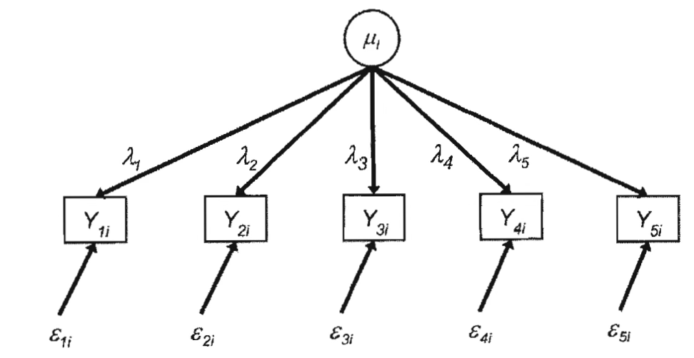

 

## 설문지 작성 개요

::: {.callout-note icon=false}
## 정의
**설문지(Questionnaire)**는 일정한 순서로 제시되는 표준화된 질문들로 구성된 데이터 수집 도구로, 대부분 고정된 선택지를 포함하며 응답자로부터 일관된 데이터를 얻는 핵심 수단이다.
:::

설문조사는 응답자에 대한 다양한 정보를 수집하기 위해 여러 방식을 활용한다. 이 중 가장 일반적인 방법은 설문지를 사용하는 것이다. 설문지는 일정한 순서로 제시되는 표준화된 질문들로 구성되며, 대부분 고정된 선택지를 포함하고 있다. 이를 통해 응답자로부터 일관된 데이터를 얻을 수 있다.

오늘날 설문지는 점점 전자적인 형태로 변화하고 있다. 컴퓨터 프로그램이 설문지를 조사원에게 제공하거나, 응답자에게 직접 보여주는 방식이 증가하고 있다. 그러나 설문 방식이 종이이든 전자이든, 조사원이 있든 없든 대부분의 설문조사는 여전히 응답자가 정해진 질문을 해석하고 그에 맞는 정보를 제공하는 구조에 의존하고 있다.

설문지는 응답자로부터 일관된 정보를 수집하는 데 핵심적인 역할을 하며, 설문조사의 가장 기본적인 도구로 사용된다. 동일한 질문을 모든 응답자에게 같은 방식으로 제시함으로써 비교 가능성을 높이고, 결과의 신뢰성을 확보할 수 있다.

| 기능 | 내용 |
|------|------|
| **표준화** | 동일한 질문을 모든 응답자에게 같은 방식으로 제시 → 비교 가능성·신뢰성 확보 |
| **안내 역할** | 면접 조사에서 조사원의 일관된 질문 제시 지원 |
| **기록·보관** | 응답 내용을 체계적으로 기록·보관 (디지털 설문지는 더욱 효율적) |
| **기억 보조** | 특정 사건·시점을 제시하여 응답자의 회상 촉진 |
| **태도 측정** | 리커트 척도 등으로 주관적 평가를 정량화하여 비교 분석 가능 |
| **다양한 방식** | 면접·우편·온라인·전화 등 다양한 방식에 적용 가능 |

: 설문지의 주요 기능 {.striped}

## 좋은 질문지 작성

좋은 설문지 작성 지침은 응답자의 부담을 줄이면서도 정확하고 신뢰할 수 있는 데이터를 확보하는 데 큰 도움이 된다. 이러한 데이터는 이후 연구, 정책 수립, 비즈니스 의사결정 등에서 보다 효과적인 결과를 도출하는 기반이 된다.

::: {.callout-important icon=false}
## 좋은 설문지가 필요한 이유
질문이 모호하거나 복잡하면 응답자가 정확하게 이해하지 못하고 엉뚱한 답을 하거나, 사회적으로 바람직한 방향으로 응답하려는 경향이 나타난다. 좋은 설문지 지침은 이러한 오류를 줄이고 **응답의 일관성과 정확성**을 높이는 데 기여한다.
:::

### 행동문항과 태도 문항

**개념적 차이**

| 구분 | 행동 behavior 문항 | 태도 attitude 문항 |
|------|-------------------|-------------------|
| **정의** | 응답자의 실제 경험이나 행동을 측정하는 질문 | 응답자의 신념·가치관·감정·의견 등을 측정하는 질문 |
| **목적** | 특정 행동을 수행한 빈도·시기·방식 등을 파악 | 특정 주제에 대한 태도나 선호도를 측정 |
| **측정 대상** | 객관적이고 구체적인 행동(실제 경험) | 주관적인 인식·감정·의견 |
| **기록 방식** | 응답자가 직접 보고한 행동 (예: 구매경험, 운동빈도) | 응답자의 심리적 상태·선호도 등을 측정 |

: 행동문항 vs. 태도문항 개념 비교 {.striped}

**측정방법 차이**

| 측정 방법 | 행동 문항 | 태도 문항 |
|-----------|-----------|-----------|
| **자기보고** | 응답자가 직접 자신의 행동을 보고 | 응답자가 자신의 의견을 보고 |
| **행동 기록** | 응답자가 일정 기간 동안 행동을 기록 (예: 음식섭취 일기) | 해당 없음 |
| **관찰법** | 연구자가 직접 응답자의 행동을 관찰 (예: 실제 투표 여부 확인) | 연구자가 응답자 태도를 직접 측정할 수 없음 |
| **반응 척도** | 행동 횟수·빈도를 정량적으로 측정 (예: '한 달에 5회 이상') | Likert 척도, 시각적 아날로그 척도 등으로 태도를 정량적으로 측정 |

: 행동문항 vs. 태도문항 측정방법 비교 {.striped}

**활용방안**

| 연구 목적 | 행동 문항 | 태도 문항 |
|-----------|-----------|-----------|
| **실제 행동 측정** | 응답자가 특정 행동을 수행했는지 확인할 때 | 해당 없음 |
| **정책 평가** | 정책이 실제 행동 변화에 영향을 미쳤는지 측정할 때 | 정책에 대한 인식을 평가할 때 |
| **소비자 조사** | 제품 구매 빈도, 사용 습관 측정 | 브랜드 선호도, 만족도 평가 |
| **건강 연구** | 운동, 식습관, 흡연여부 조사 | 건강에 대한 인식, 위험에 대한 태도 측정 |

: 행동문항 vs. 태도문항 활용방안 비교 {.striped}

::: {.callout-tip icon=false}
## 행동 vs. 태도 문항 선택 기준
- 실제 경험·빈도·시기가 필요하면 → **행동 문항** (구체적 시간 범위 필수)
- 인식·가치관·선호·감정이 필요하면 → **태도 문항** (리커트 척도 활용)
- 행동 문항에는 구체적 시간 기준을, 태도 문항에는 사회적 바람직성 편향 완화 전략을 함께 설계한다.
:::

설문 조사에서 행동 문항과 태도 문항은 서로 다른 목적과 특성을 지니며, 응답 방식이나 인식에도 차이가 있다. 행동 문항은 응답자의 실제 경험이나 행위를 측정하는 데 중점을 두며, 객관적인 데이터를 수집하는 데 적합하다. 반면 태도 문항은 특정 주제에 대한 신념, 감정, 의견을 평가하는 데 활용되며, 응답자의 주관적인 인식을 파악하는 데 유리하다.

이처럼 행동 문항과 태도 문항은 각기 다른 역할을 수행하며, 상황에 맞게 잘 설계되었을 때 설문조사의 타당성과 신뢰도를 크게 높일 수 있다.

### 행동문항: 민감하지 않은 질문

| 지침 | 핵심 내용 |
|------|-----------|
| **모든 응답 보기 포함** | 폐쇄형 질문에서 모든 합리적 가능성을 선택지에 포함 |
| **구체성** | 시간 범위·활동 기준을 명시하여 응답자가 같은 기준으로 이해하도록 함 |
| **쉬운 단어 사용** | 전문 용어·어려운 단어를 피하고 모든 응답자가 이해할 수 있는 표현 사용 |
| **기억 단서 제공** | 다양한 사례·유형을 함께 제시하여 기억 회상 촉진 |
| **도움 회상** | 구체적 유형 제시로 잊기 쉬운 경험의 회상을 도움 |
| **일지 작성 유도** | 자주 발생하나 중요도가 낮은 행동은 사전 기록 유도 |
| **생애 사건 달력** | 긴 회상 기간이 필요한 경우 사회적 기준 시점(명절 등) 활용 |
| **가계 기록 활용** | 망원경 오류 방지를 위해 영수증·일정표 등 실제 기록 참고 유도 |
| **대리 응답자 활용** | 비용 절감이나 기억 한계 시 해당 정보를 더 잘 아는 대리인 활용 |

: 민감하지 않은 행동문항 작성 지침 {.striped}

::: {.callout-important icon=false}
## 핵심 원칙: 모든 응답 보기를 포함하라
폐쇄형 질문에서 응답 범주가 누락되면 응답자는 억지로 가장 가까운 항목을 선택하거나 응답을 포기한다. 예: "외식 횟수" 질문 시 0회, 1~2회, 3~4회, 5회 이상처럼 **누락·중복 없이** 구성해야 한다.
:::

민감하지 않은 질문이라 하더라도, 응답자의 기억력에 한계가 있을 수 있기 때문에 보다 정확하고 신뢰성 높은 데이터를 얻기 위해서는 설문 설계 시 세심한 전략이 필요하다.

**폐쇄형 질문에서는 모든 합리적인 가능성을 응답 보기에 포함할 것**

폐쇄형 질문(closed-ended questions)은 응답자가 자유롭게 서술하기보다, 미리 제시된 선택지 중에서 가장 적절하다고 생각되는 답을 고르도록 설계된 질문 유형이다. 이러한 질문은 응답 결과를 정량적으로 분석하기 용이하다는 장점이 있으며, 조사자 간의 해석 차이나 데이터 정제 과정의 오류를 줄이는 데도 유리하다.

**질문을 가능한 한 구체적으로 만들 것**

질문이 모호하게 제시되면, 응답자는 각자의 경험과 기준에 따라 질문을 다르게 해석하게 되고, 그 결과 응답의 일관성과 비교 가능성이 떨어질 수 있다. 예컨대, "지난 7일 동안 30분 이상 신체 활동을 한 날은 며칠입니까?"처럼 시간 범위와 활동 기준을 함께 제시하면, 응답자는 자신의 경험을 보다 정확하게 회상하고 일관된 기준에 따라 응답할 수 있다.

**거의 모든 응답자가 이해할 수 있는 단어를 사용할 것**

설문 문항에 전문 용어나 지나치게 어려운 단어가 포함되면, 응답자가 질문의 의미를 정확히 이해하지 못하고 의도와 다른 답변을 할 가능성이 높아진다. 또한, 문화적 배경에 따라 다르게 해석될 수 있는 단어나 표현은 가급적 피해야 한다.

**기억을 향상시키기 위해 기억 단서를 추가하여 질문을 길게 만들 것**

응답자가 과거의 특정 사건을 정확히 기억해내기 어려운 경우, 질문에 기억을 자극하는 단서를 함께 제공하면 응답의 정확성을 높일 수 있다. 예를 들어, "업무 출장, 가족여행, 친구와의 여행, 유학 등 포함"과 같이 다양한 유형의 여행 사례를 함께 제시하면, 응답자가 자신의 경험을 더 쉽게 회상할 수 있다.

::: {.callout-tip icon=false collapse="true"}
## 기억 회상 촉진 전략 정리
| 상황 | 권장 전략 |
|------|-----------|
| 회상 기간이 길 때 (1년 이상) | 생애 사건 달력(명절, 휴가 등 기준점) 활용 |
| 빈번하지만 사소한 행동 | 사전 일지 작성 유도 |
| 시점이 혼동될 수 있을 때 | 망원경 오류 → 영수증·일정표 등 실물 기록 참고 |
| 기억이 부정확한 응답자 | 해당 정보를 더 잘 아는 대리 응답자 활용 |
:::

**잊어버릴 가능성이 높을 때는 도움 회상을 사용할 것**

사람들은 자주 발생하지 않거나 특별히 주의를 기울이지 않았던 사건에 대해서는 기억이 흐릿해지기 쉽다. 예를 들어, "지난 3개월 동안 병원에 방문한 적이 있습니까?"라는 질문에 "가족 병원 방문, 정기 건강검진, 치과 진료, 응급실 방문 포함"과 같이 구체적인 사례나 유형을 제시하면, 응답자가 해당 경험을 떠올리는 데 도움이 된다.

**빈번하지만 크게 중요하지 않은 경우, 응답자가 일지를 작성 유도**

일상에서 자주 일어나지만 중요도가 낮아 쉽게 잊히는 행동이나 사건에 대해서는, 설문 시 응답의 정확성을 확보하기가 쉽지 않다. 조사 시작 전 일정 기간 동안 응답자에게 간단한 일지나 체크리스트를 작성하도록 요청하면, 특정 행동에 대한 기억을 체계적으로 보존할 수 있다.

**긴 회상 기간이 필요한 경우, 생애 사건 달력을 사용 권장**

조사에서 긴 기간에 걸친 기억을 회상해야 할 때는, "설 연휴 이후, 여름휴가 기간, 추석 이후에 병원에 방문한 적이 있나요?"처럼 사회적으로 널리 인식되는 기준 시점을 활용하면, 응답자가 과거 경험을 특정 시점에 연결해 더 정확하게 회상할 수 있다.

**망원경 오류를 줄이기 위해 응답자가 가계 기록을 사용**

망원경 오류는 사람들이 실제 사건이 발생한 시기를 정확히 기억하지 못하고, 과거의 일을 더 최근의 일로 기억하거나 반대로 최근에 일어난 일을 오래전에 있었던 일로 착각하는 현상을 의미한다. 설문 응답 시 영수증, 일정표, 가계부 등과 같은 실제 기록을 참고하도록 유도하면 이 오류를 줄일 수 있다.

**비용이 문제가 되는 경우, 대리 응답자를 활용할 것**

설문조사에서 응답자의 기억이 부정확하거나, 조사 비용과 시간을 절감할 필요가 있을 때는 해당 정보를 더 잘 알고 있는 대리 응답자(proxy respondent)를 통해 답변을 받는 방법을 사용할 수 있다. 단, 대리 응답자가 실제로 얼마나 정확한 정보를 알고 있는지를 검토하는 과정이 병행되어야 하며, 경우에 따라 보완 질문이나 확인 절차가 필요할 수 있다.

### 행동문항: 민감한 질문

| 지침 | 핵심 내용 |
|------|-----------|
| **개방형 질문 사용** | 빈도 파악 시 선택지 대신 자유 서술 유도 |
| **긴 질문 사용** | 범위·기간·예시를 함께 제시하여 정확한 이해 도모 |
| **익숙한 단어** | 심리적 저항을 줄이는 완화된 표현 사용 |
| **의도적 질문 구성** | 사회적 낙인 완화 문구로 솔직한 응답 유도 |
| **먼 시점 먼저** | 과거 경험부터 질문하여 민감한 주제에 점진적 접근 |
| **항목들 사이 배치** | 민감한 질문을 유사 항목들 사이에 자연스럽게 배치 |
| **자기기입 방식** | 조사원 없는 환경에서 응답 편안함 확보 |
| **일기 형식** | 반복적 민감 행동 기록을 통한 정밀 데이터 수집 |
| **끝부분 추가 문항** | 민감 항목에 대한 응답자 피드백 수집 |
| **검증 데이터 수집** | 영수증·기록 등 보완 자료로 응답 정확성 검토 |

: 민감한 행동문항 작성 지침 {.striped}

::: {.callout-warning icon=false}
## 민감한 질문 설계 시 핵심 주의사항
- **직접적·판단적 표현** → 응답 거부 또는 사회적 바람직성 편향 유발
- 익명성·비밀 보장을 사전에 명확히 안내해야 솔직한 응답 확보
- **자기기입 방식(온라인·CASI)**이 면접 방식보다 민감한 주제에 훨씬 유리
- 민감한 문항은 설문 **후반부**에 배치하여 라포(rapport) 형성 후 질문
:::

민감한 질문을 포함하는 설문조사에서는 응답자의 심리적 불편함이나 저항감을 최소화하는 것이 매우 중요하다. 응답자가 부담을 느끼거나 불안감을 갖게 되면 질문에 대해 회피하거나 왜곡된 정보를 제공할 가능성이 높아지기 때문이다.

**민감한 행동의 빈도를 파악할 때 개방형 질문을 사용할 것**

폐쇄형 질문은 응답자의 민감함을 자극하거나 방어적인 태도를 유발할 수 있지만, 개방형 질문은 보다 편안한 분위기에서 자신의 경험을 표현하게 하여 왜곡 가능성을 줄여준다.

> **예시:** "지난 6개월 동안 몇 번 음주했습니까?" → "지난 6개월 동안 음주한 경험에 대해 설명해 주세요."

**짧은 질문보다는 긴 질문을 사용할 것**

특히 민감하거나 구체적인 행동을 묻는 경우, 질문이 지나치게 간단하면 응답자가 질문의 범위나 맥락을 정확히 이해하지 못해 부정확한 답변을 할 가능성이 높아진다. 보다 긴 문장을 사용해 질문의 맥락과 내용을 구체적으로 설명하는 것이 바람직하다.

> **예시:** "마약을 사용한 적이 있습니까?" → "지난 12개월 동안 의사의 처방 없이 마약(예: 코카인, 대마초, 헤로인 등)을 사용한 적이 있습니까?"

**민감한 행동을 설명할 때 익숙한 단어를 사용할 것**

예를 들어, "음주 습관"이라는 표현은 다소 공식적이고 평가적인 뉘앙스를 줄 수 있지만, "술을 마신 경험"이라는 표현은 보다 자연스럽고 부담 없이 받아들여질 수 있다. "불법 약물 사용" 대신 "기분 전환을 위한 약물 복용"처럼 완화된 표현을 사용하면 보다 솔직한 응답을 유도하는 데 도움이 된다.

**허위 응답을 줄이기 위해 의도적으로 질문을 구성할 것**

"당신은 불법적으로 마약을 사용한 적이 있습니까?"처럼 직접적이고 비판적으로 들릴 수 있는 질문보다는, "많은 사람들이 스트레스 해소를 위해 마약을 사용합니다. 당신은 지난 6개월 동안 마약을 사용한 경험이 있습니까?"처럼 사회적 낙인을 완화하는 문구를 함께 제시하면, 응답자는 덜 비난받는다고 느끼고 보다 솔직하게 답변할 가능성이 높아진다.

**과거의 먼 시점을 먼저 질문할 것**

최근의 행동이나 경험을 곧바로 묻는 것보다는, 비교적 덜 민감하게 느껴질 수 있는 과거의 경험부터 질문을 시작하는 것이 효과적이다. 이를 통해 응답자는 민감한 주제에 대해 심리적으로 준비할 시간을 갖고, 점진적으로 질문에 익숙해질 수 있다.

**민감한 질문을 다른 민감한 항목들 사이에 포함**

민감한 문항이 갑작스럽게 등장하면 응답자가 방어적인 태도를 보이거나 응답을 회피할 수 있으므로, 주변 질문들과의 자연스러운 연결을 통해 해당 문항이 눈에 띄지 않도록 하는 전략이 필요하다.

**자기기입 방식 또는 유사한 방법을 사용할 것**

조사원이 직접 질문을 제시하는 면접 방식에서는, 응답자가 타인의 시선을 의식해 솔직하게 답변하지 않거나, 사회적으로 바람직한 방향으로 응답을 왜곡할 가능성이 높다. 온라인 설문조사, 컴퓨터를 이용한 자기기입식 조사(CASI), 종이 설문지를 활용한 자기기입식 방식 등은 응답자가 보다 편안한 환경에서 솔직하게 표현할 수 있게 해준다.

**데이터를 수집할 때 일기 형식을 고려할 것**

음주, 흡연, 약물 사용, 성행동 등과 같이 사회적 평가와 관련된 주제는 응답자가 자신의 행동을 축소하거나 과장해서 보고할 가능성이 높다. 응답자에게 일기 형식의 기록을 요청하는 전략이 효과적이다.

**설문지의 끝부분에 응답 민감 항목에 대한 추가 문항 구성**

설문 마지막에 "설문에서 가장 대답하기 어려웠던 질문은 무엇이었습니까?", "이 설문에서 불편함을 느낀 부분이 있다면 자유롭게 적어주세요"와 같은 질문을 추가하면, 응답자의 심리적 반응에 대한 피드백을 직접 수집할 수 있다.

**검증 데이터를 수집할 것**

설문조사를 통해 수집된 응답이 실제 행동이나 사실을 정확하게 반영하고 있는지를 확인하기 위해, 추가적인 검증 데이터를 함께 수집하는 것이 중요하다. 예를 들어, 음주 습관에 관한 조사를 실시할 때 응답자가 보고한 음주 빈도나 종류와 실제 구입 내역(예: 술 구매 영수증)을 비교하면, 응답의 정확성을 검토할 수 있다.

### 태도문항

| 지침 | 핵심 내용 |
|------|-----------|
| **대상 명확히 지정** | 광범위한 질문보다 구체적인 정책·사례 명시 |
| **이중 질문 피하기** | 두 가지 개념은 별도 문항으로 분리 |
| **태도 강도 측정** | 리커트 척도로 방향뿐 아니라 강도까지 측정 |
| **양극 항목 사용** | 긍정↔부정 범위 모두 포함 (맥락에 따라 조정) |
| **모든 대안 포함** | 응답자가 선택할 수 있는 옵션 빠짐없이 제시 |
| **동일 질문 유지** | 시계열 측정 시 질문 문구 동일하게 유지 |
| **일반→구체 순서** | 일반 질문 후 구체적 사례로 좁혀가는 구성 |
| **덜 인기 항목 먼저** | 여러 항목 질문 시 관심도 낮은 항목부터 제시 |
| **폐쇄형 질문** | 정량 분석을 위해 리커트 등 폐쇄형 사용 |
| **5/7점 척도** | 적절한 선택지 수와 각 점수에 명확한 라벨 제공 |
| **인기 없는 문항 먼저** | 초반엔 가벼운 문항, 점차 핵심 문항으로 전환 |
| **순위 매기기 주의** | 모든 대안 비교 가능할 때만 사용, 불가시 쌍대 비교 |
| **개별 리커트 평가** | 체크박스보다 각 항목별 개별 평점 부여 |

: 태도문항 작성 지침 {.striped}

::: {.callout-tip icon=false collapse="true"}
## 태도 문항 설계 체크리스트
- [ ] 이중 질문 없이 하나의 개념만 측정하는가?
- [ ] 5점 또는 7점 리커트 척도를 사용하는가?
- [ ] 모든 척도점에 명확한 라벨을 붙였는가?
- [ ] 긍정·부정 양극단을 모두 포함하는가?
- [ ] 시계열 비교라면 동일한 문구를 유지하는가?
- [ ] 일반 질문 → 구체 질문 순서로 배치했는가?
- [ ] 사회적으로 바람직한 방향의 응답 편향을 고려했는가?
:::

**태도의 대상을 명확하게 지정할 것**

예를 들어, "환경 보호 정책에 대해 어떻게 생각하십니까?"라는 질문보다 "정부의 일회용 플라스틱 사용 제한 정책에 대해 어떻게 생각하십니까?"처럼 구체적인 정책이나 행동을 명시하면, 응답자는 보다 명확한 판단 기준에 따라 의견을 표현할 수 있다.

**이중 질문을 피할 것**

이중 질문(double-barreled question)은 하나의 문항에 두 개 이상의 서로 다른 개념이나 주제가 포함되어 있어, 응답자가 하나의 명확한 답변을 하기 어렵게 만드는 질문을 의미한다.

> **잘못된 예시:** "귀하는 정부의 환경 보호 정책과 경제 성장 전략을 지지하십니까?"
> **올바른 예시:** 각 개념을 별도 문항으로 분리

**5점/7점 척도의 응답 척도를 사용하고, 모든 척도에 라벨을 붙일 것**

::: {.callout-note icon=false}
## 리커트 척도 설계 원칙
| 요소 | 권장 기준 |
|------|-----------|
| **척도 수** | 5점 또는 7점 (3점은 구분력 부족, 10점 이상은 혼란) |
| **라벨** | 모든 점수에 의미 있는 설명 필수 (예: 1=전혀 동의 안 함, 5=매우 동의함) |
| **중립점** | 맥락에 따라 홀수 척도(중립 포함) vs 짝수 척도(강제 선택) 선택 |
| **방향** | 긍정 → 부정 또는 부정 → 긍정 중 일관성 유지 |
:::

**시간에 따른 변화를 측정할 때는 매번 동일한 질문을 사용할 것**

시간의 흐름에 따른 태도 변화를 측정할 때는, 동일한 질문에 대해 시점만 다르게 반복해 물어야 비교가 가능한 데이터가 수집된다. 질문의 문구나 표현 방식이 달라지면, 응답자는 각 질문을 다르게 해석할 수 있고, 그로 인해 실제 태도 변화가 아닌 질문 형식의 차이로 인해 응답 결과가 달라질 수 있다.

**다중 선택 문항보다는 개별문항 리커트 척도 평가방법 사용**

이러한 한계를 보완하기 위해, 각 항목에 대해 개별적으로 평점을 부여하도록 하는 방식이 더 적절하다. '관심도', '중요도', '만족도' 등을 기준으로 각 항목에 1점에서 5점 또는 7점 사이의 점수를 매기도록 하면, 응답자는 자신의 인식을 보다 세밀하게 표현할 수 있다.

## 질문지 평가

질문 평가는 크게 두 가지 핵심 요소로 구성된다. 첫 번째는 질문이 응답자에게 얼마나 잘 이해되는지, 그리고 답변하는 데 얼마나 어려움이 따르는지를 평가하는 것이다. 두 번째 요소는 질문을 통해 수집된 응답이 실제로 우리가 측정하고자 하는 개념을 얼마나 정확하게 반영하고 있는지를 평가하는 과정이다.

모든 설문 질문은 다음의 세 가지 명확한 기준을 충족해야 한다.

::: {.callout-note icon=false}
## 세 가지 평가 기준

| 기준 | 내용 | 주요 평가 도구 |
|------|------|----------------|
| **내용 content** | 적절한 정보를 수집하는지 평가 | 전문가 평가, 포커스 그룹, 인지 인터뷰 |
| **인지 cognitive** | 응답자가 문항을 올바르게 이해하고 답변할 수 있는지 평가 | 포커스 그룹, 전문가 검토, 행동 코딩 |
| **사용성 usability** | 설문 도구가 실제 조사에서 원활하게 활용될 수 있는지 평가 | 사용성 테스트, 전문가 검토 |

:::

**내용 content 기준**: 적절한 정보를 수집하는지를 평가하는 기준

- **분석 관점:** 문항이 연구 목적에 부합하는 데이터를 수집하는지 확인해야 한다.
- **응답 가능성:** 질문이 실제로 응답자가 답할 수 있는 내용인지 평가해야 한다.

**인지 cognitive 기준**: 응답자가 문항을 올바르게 이해하고 답변할 수 있는지를 평가하는 기준

- 포커스 그룹 인터뷰: 이해되지 않는 용어나 모호한 개념을 파악할 수 있다.
- 전문가 검토: 응답자가 답변하기 어려운 문항을 사전 탐지할 수 있다.
- 행동 코딩: 사전조사 과정에서 응답자가 혼란을 느끼는 문항을 식별할 수 있다.

**사용성 usability 기준**: 설문 도구가 실제 조사에서 원활하게 활용될 수 있는지를 평가하는 기준

설문조사를 본격적으로 실시하기 전에, 문항의 타당성과 사용성을 점검하기 위한 절차로 전문가 검토를 실시하는 것이 중요하다.

### 전문가 검토

설문조사에서 질문의 질을 평가하는 과정에서, 주제 전문가와 설문지 설계 전문가의 사전 검토는 필수적인 절차로 간주된다. 전문가 검토는 문항의 표현 방식, 질문 순서, 응답 보기의 구성, 조사원을 위한 지침, 설문 흐름 규칙 등 설계 전반에 걸쳐 진행된다.

### 포커스 그룹 focus group

포커스 그룹은 설문 도구를 개발하기 전, 특정 주제에 대한 응답자들의 인식과 반응을 깊이 있게 이해하기 위해 활용되는 질적 조사 방법이다. 일반적으로 6~10명 정도의 소규모 집단을 구성하여, 중재자의 진행 하에 자유로운 토론이 이루어진다.

포커스 그룹은 특히 설문 설계의 초기 단계에서 유용한 도구로, 응답자들이 주제에 대해 가진 배경지식, 용어에 대한 이해, 관심의 정도 등을 사전에 탐색하는 데 효과적이다.

#### 포커스 그룹의 역할과 장점

**응답자의 지식 및 인식 구조 분석**

연구자는 포커스 그룹을 통해 응답자들이 조사 주제에 대해 어떤 지식과 경험을 가지고 있는지, 그리고 그 정보를 어떤 방식으로 인식하고 조직화하는지를 심층적으로 탐색할 수 있다.

**용어 및 개념 정교화**

포커스 그룹은 설문에서 사용될 단어나 표현이 응답자에게 어떻게 받아들여지는지를 분석하는 데 매우 효과적인 도구이다. 이를 바탕으로 설문 문항의 언어를 보다 명확하고 직관적으로 조정할 수 있다.

**질문 설계의 현실성 확보**

포커스 그룹은 연구자가 특정 개념에 대해 응답자가 어떻게 인식하고, 어떤 경험과 사고 과정을 바탕으로 답변을 구성하는지를 이해하는 데 유용하다.

#### 포커스 그룹의 운영 방식

포커스 그룹은 일반적으로 조용하고 집중할 수 있는 환경에서 진행되며, 연구진이 관찰할 수 있도록 단방향 거울이 설치되거나 오디오·비디오 녹화가 이루어지기도 한다.

포커스 그룹에서 중재자는 개방적이고 편안한 분위기를 조성하면서도 논의가 연구 주제에서 이탈하지 않도록 유도하는 핵심적인 역할을 맡는다.

또한 포커스 그룹은 조사 주제에 따라 유사한 특성을 가진 응답자들로 구분해 운영할 수 있다. 예를 들어, 취업 관련 조사의 경우 정규직 근로자와 시간제 근로자를 나누어 별도로 논의하거나, 다양한 하위 집단을 가진 조사에서는 각 집단에 대한 포커스 그룹을 따로 구성하여 보다 정교한 분석이 가능하도록 한다.

#### 포커스 그룹의 한계점

::: {.callout-warning icon=false}
## 포커스 그룹의 주요 한계

| 한계점 | 내용 |
|--------|------|
| **대표성 부족** | 소규모·비확률 표본 → 모집단 일반화 어려움 |
| **문항 평가 한계** | 집단 토론보다 1:1 인지 면접이 문항 타당성 분석에 효과적 |
| **신뢰성 문제** | 질적 데이터 기반으로 표준화 분석 어렵고, 재현성도 낮음 |

→ 설문 설계 초기의 **보조적 수단**으로 활용하되, 단독 결론 도출 근거로 삼지 말 것
:::

**대표성 부족**: 포커스 그룹은 소규모의 참여자들이 특정 주제에 대해 깊이 있는 의견을 나누는 데 중점을 두기 때문에, 참가자들이 전체 조사 모집단을 통계적으로 대표한다고 보기 어렵다.

**설문 문항 평가의 한계**: 포커스 그룹은 응답자의 전반적인 인식과 개념에 대한 이해를 도모하는 데 유용하지만, 특정 설문 문항의 문구가 얼마나 명확한지에 대한 정밀한 분석에는 적합하지 않다. 이러한 문항 수준의 타당성과 이해도 평가는 1:1 인지 면접(cognitive testing) 방식이 훨씬 효과적이다.

**결과의 신뢰성 문제**: 포커스 그룹에서 얻어진 정보는 주로 질적 데이터에 기반하기 때문에, 표준화된 분석이 어렵고, 연구자의 해석에 따라 결과가 달라질 가능성이 크다.

### 인지 인터뷰 cognitive interviewing

**인지 인터뷰(Cognitive Interviewing)**는 설문 문항이 응답자에게 어떻게 이해되고 해석되는지를 분석하기 위한 질적 조사 기법이다.

::: {.callout-note icon=false}
## 인지 인터뷰의 주요 기법

| 기법 | 내용 |
|------|------|
| **동시적 사고 구술** | 질문을 읽고 답하는 과정에서 사고 과정을 실시간으로 소리 내어 설명 |
| **회고적 사고 구술** | 답변 이후 사고 과정을 설명 |
| **자신감 평가** | 답변에 대한 확신 정도를 표현 |
| **패러프레이징** | 질문을 자신의 말로 다시 진술 |
| **정의 제공** | 핵심 용어나 개념에 대한 자신의 이해를 설명 |
| **추가 질문** | 답 결정 전략이나 기준을 파악하기 위한 후속 질문 |
:::

인지 인터뷰는 설문 문항의 **인지적 적합성(cognitive validity)**을 평가하는 핵심 도구로 자리 잡고 있으며, 특히 문항이 응답자에게 어떻게 해석되고 반응되는지를 실제로 검증할 수 있다는 점에서 중요한 역할을 한다.

### 사전조사와 행동코딩

::: {.callout-tip icon=false}
## 사전조사(Pretest)의 목적
본격적인 설문 조사에 앞서 소규모로 실시하는 리허설로, **설문 도구의 설계와 데이터 수집 절차의 적절성**을 검토한다.

- **면접관 피드백 수집:** 사전조사 응답자를 대상으로 포커스 그룹·인터뷰 실시
- **정량 분석:** 누락 응답 비율, 논리적 불일치, 범위 밖 응답 등을 통해 문항 품질 진단
- **행동 코딩:** 면접관이 질문을 반복하거나 수정하는 빈도, 응답자의 주저·'모름' 응답 비율 등을 코드화
:::

행동 코딩(behavior coding)은 면접관과 응답자 간의 상호작용을 분석하여 설문 문항의 이해도와 전달 효과를 평가하는 기법이다. 실제로 행동 코딩의 신뢰도는 비교적 높은 편이다. 예를 들어, 동일한 질문을 서로 다른 조사팀이 평가했을 때, 행동 코딩 결과 간의 상관계수가 0.75에서 0.90에 이를 정도로 일관성이 있다는 연구도 있다.

## 질문지 평가 통계적 접근

설문 조사 연구에서 '품질'을 측정할 때 사용되는 용어는 아직까지 완전히 표준화되어 있지 않지만, 전통적으로 두 가지 주요 접근법이 존재한다.

::: {.callout-note icon=false}
## 두 가지 품질 평가 접근법

| 접근법 | 핵심 개념 | 초점 |
|--------|-----------|------|
| **심리측정 (Psychometrics)** | 타당성(validity), 신뢰성(reliability) | 개별 응답자의 반응 |
| **표본통계 (Survey Statistics)** | 편향(bias), 분산(variance) | 추정치의 정확성과 일관성 |

:::

첫 번째 접근법인 심리측정은 개별 응답자의 반응에 초점을 맞추며, 문항이 측정하고자 하는 개념을 얼마나 정확하게 반영하는지를 뜻하는 **타당성(validity)**과, 동일한 조건에서 일관된 결과를 도출할 수 있는지를 의미하는 **신뢰성(reliability)**이라는 개념을 중심으로 품질을 평가한다.

반면, 두 번째 접근법은 설문 응답을 종합하여 전체 집단을 대표하는 통계치를 도출하는 과정에서의 **편향(bias)**과 **분산(variance)**을 중심으로 설문 품질을 평가한다.

::: {.callout-tip icon=false}
## 타당도 vs. 신뢰도 핵심 구분
- **타당도(Validity):** "내가 측정하고 싶은 것을 측정하는가?" → 정확성의 문제
- **신뢰도(Reliability):** "반복 측정해도 같은 결과가 나오는가?" → 일관성의 문제
- 타당도가 높으면 신뢰도도 높을 가능성이 크지만, **신뢰도가 높다고 타당도가 높은 것은 아니다.**
:::

### 타당도

타당도는 설문 문항이 측정하고자 하는 구성 개념(construct)을 얼마나 정확하게 반영하고 있는지를 나타내는 개념이다.

| 유형 | 내용 | 평가 방법 |
|------|------|-----------|
| **내용 타당도** | 문항이 측정 개념의 모든 중요한 측면을 충분히 포괄하는지 평가 | 전문가 검토, CVI, CVR |
| **기준 타당도** | 설문 결과가 외부의 객관적 기준과 얼마나 잘 부합하는지 평가 | 상관분석, 회귀분석, ROC 곡선 |
| **구성 타당도** | 문항이 이론적으로 정의된 개념을 제대로 측정하는지 평가 | 요인분석, 수렴·판별 타당도 |

: 타당도의 주요 유형 {.striped}

따라서, 타당도는 단순히 문항이 잘 만들어졌는지를 넘어서, 이 문항이 과연 내가 측정하고자 하는 '그것'을 제대로 측정하고 있는가에 대한 핵심적인 질문이라 할 수 있다.

#### 내용 content 타당도

**전문가 검토(Expert Review)**

내용(content) 타당도는 설문 문항이 측정하고자 하는 개념의 모든 핵심 요소를 포괄하고 있는지를 평가하는 개념이다. 가장 일반적인 평가 방법은 전문가 검토(Expert Review)로, 해당 분야의 전문가들이 설문 문항을 검토하여 설문이 연구 목적과 개념을 충분히 반영하고 있는지를 판단한다.

**내용 타당도 지수 content validity index, CVI**

내용 타당도 지수(Content Validity Index, CVI)는 설문 문항이 측정하고자 하는 연구 개념을 얼마나 잘 반영하는지를 정량적으로 평가하는 지표이다.

::: {.callout-note icon=false}
## CVI · CVR 판단 기준

| 지표 | 계산 방법 | 수용 기준 |
|------|-----------|-----------|
| **CVI** | 전문가가 "적절함(3~4점)"으로 평가한 비율 | ≥ **0.80** |
| **CVR** | $\frac{n_e - (N/2)}{N/2}$ | 전문가 수에 따라 다름 (Lawshe 임계값 이상) |

예: 전문가 8명 → CVR ≥ 0.75 / 전문가 10명 → CVR ≥ 0.62
:::

**내용 타당도 비율 content validity ratio, CVR**

Lawshe(1975)가 제안한 정량적 평가 방법으로, 설문 문항이 연구 개념 측정에 필수적인지를 전문가 집단을 통해 판단하는 데 사용된다.

$$\text{CVR} = \frac{n_{e} - (N/2)}{N/2}$$

여기서 $n_e$는 해당 문항을 "필수적"이라고 평가한 전문가 수, $N$은 전체 전문가 수이다.

**문항 분석 및 포커스 그룹**

파일럿 테스트(사전조사)를 통해 응답자들이 각 문항에 어떻게 반응하는지를 체계적으로 분석하여, 설문지의 품질을 향상시키기 위한 과정이다. 주로 문항 간 상관관계, 문항-전체 점수 상관(item-total correlation), 응답 분산 등을 통해 특정 문항이 전체 개념 측정에 기여하는 정도를 평가하며, 타당도가 낮거나 혼란을 유발하는 문항은 제거하거나 수정된다.

#### 기준 criterion 타당도

기준 타당도(Criterion Validity)는 설문 문항이 측정하고자 하는 속성이 실제 외부의 객관적 기준과 얼마나 밀접하게 관련되어 있는지를 평가하는 개념이다. 기준 타당도는 일반적으로 동시 타당도(concurrent validity)와 예측 타당도(predictive validity)로 나뉜다.

**동시 concurrent 타당성**: 설문 도구가 현재 시점에서 존재하는 외부 기준 변수와 얼마나 강한 상관관계를 가지는지를 평가하는 방식이다.

**예측 predictive 타당성**: 설문을 통해 측정된 값이 미래의 특정 결과나 행동을 얼마나 정확하게 예측하는지를 평가하는 방식이다.

::: {.callout-note icon=false}
## 기준 타당도 평가 방법 정리

| 방법 | 사용 상황 | 핵심 지표 |
|------|-----------|-----------|
| **피어슨 상관분석** | 두 연속형 변수 간 관계 | r ≥ 0.70: 강한 상관 |
| **회귀 분석** | 예측 타당성 검증 | R², 회귀계수 유의성 |
| **ROC 곡선** | 이분형 결과 분류 | AUC ≥ 0.80: 높은 분류 정확도 |
| **카이제곱 검정** | 범주형 데이터 간 독립성 | p < .05: 유의한 연관성 |
:::

#### 구성 construction 타당성

설문 문항이 이론적으로 정의된 추상적인 개념(구성 개념, construct)을 얼마나 잘 측정하고 있는지를 평가하는 개념이다. 구성 타당성을 확보하기 위해서는 통계적 분석뿐 아니라 이론적 정당성과 관련 문헌 기반의 논리적 타당성 확보가 병행되어야 한다.

**단일 문항 구성 타당성 척도**

$Y_{it} = \mu_{i} + \epsilon_{it}$

여기서 $\mu_{i}$는 $i$번째 응답자의 실제 구성 개념 값, $Y_{it}$는 $i$번째 응답자가 $t$번째 실험에서 제공한 응답, $\epsilon_{it}$는 편차이다.

구성 타당도:

$$\text{Validity}(Y) = \frac{\sum_{i,t}(Y_{it} - \overline{Y})(\mu_{i} - \overline{\mu})}{\sqrt{\sum_{i,t}(Y_{it} - \overline{Y})^{2}\sum_{i}(\mu_{i} - \overline{\mu})^{2}}}$$

::: {.callout-note icon=false}
## 구성 타당도 판단 기준
| 수치 | 해석 |
|------|------|
| ≥ **0.70** | 높은 구성 타당도 |
| 0.50 ~ 0.69 | 수용 가능 |
| < 0.50 | 낮은 타당도 → 문항 재검토 필요 |

요인 분석 기준: 탐색적(EFA) 적재값 ≥ 0.40 수용 / ≥ 0.70 강한 타당도
:::

**하위 문항 구성 타당도**

{fig-align="center" width="40%"}

탐색적 요인 분석에서는 요인 적재값이 0.40 이상이면 수용 가능, 0.70 이상이면 강한 구성 타당성을 가진다고 평가한다.

확인적 요인 분석에서는 구조 방정식 모델의 적합도 지수를 활용하여 구성 타당성을 평가한다.

- 비교 적합 지수 (CFI): ≥ 0.90 (권장: ≥ 0.95)
- 표준화된 SRMR: ≤ 0.08 (이상적: ≤ 0.05)
- 튜커-루이스 지수 (TLI): ≥ 0.90 (권장: ≥ 0.95)

#### 응답 편향 response bias

설문 문항과 관련된 오류와 관련하여 가장 흔히 발생하는 개념적 혼란 중 하나는 "타당성"과 "편향" 간의 관계이다. 타당성은 응답과 실제 값 간의 상관관계의 함수이다.

예를 들어, 모든 응답자가 실제 체중보다 5파운드 적게 보고한다면, 응답 값과 실제 값 간의 상관관계는 1.0으로 유지될 것이다. 그러나, 이 경우 응답 값의 평균은 실제 값의 평균보다 5파운드 낮게 나타나는 편향이 발생하게 된다.

**스플릿-발롯 split-ballot 접근법을 활용한 편향 검증**

- 비교된 두 가지 질문, Sudman과 Bradburn(1982)

  술을 마시는 날, 보통 몇 잔을 마십니까? 1잔, 2잔, 3잔 이상?

  술을 마시는 날, 보통 몇 잔을 마십니까? 1-2잔, 3-4잔, 5-6잔, 7잔 이상?

- 실험 절차 및 결과: 연구 결과, 질문 (b)에 응답한 사람들이 질문 (a)에 응답한 사람들보다 3잔 이상 마신다고 응답할 가능성이 훨씬 높았다. 연구자들은 두 번째 질문(b)의 응답이 첫 번째 질문(a)보다 더 타당하다고 결론지었다.

**설문 통계에서의 편향**

$Y_{it} = \mu_{i} + \epsilon_{it}$. 즉, 응답 값($Y_{it}$)은 실제 값($\mu_{i}$)과 오차($\epsilon_{it}$)의 합으로 구성된다.

**편향**: $\text{Bias}(Y_{it}) = E_{i}\left\lbrack E_{t}(Y_{it}) - \mu_{i} \right\rbrack$

**편향 추정치**: $\text{Bias}(\overline{Y}) = E_{t}\left( \frac{\sum_{i}^{}Y_{it}}{N} - \frac{\sum_{i}^{}\mu_{i}}{N} \right)$

### 신뢰도

신뢰도란 반복적인 개념적 실험에서 응답 값의 변동성을 측정하는 개념이다. 신뢰도는 응답자가 일관되게 또는 안정적으로 응답하는지 여부를 평가한다.

$$\text{Reliability}(Y_{it}) = \frac{E_{i}(\mu_{i} - \overline{\mu})^{2}}{E_{i}(\mu_{i} - \overline{\mu})^{2} + E_{i,t}(\epsilon_{it} - \overline{\epsilon})^{2}} = \frac{\text{실제 값의 분산}}{\text{보고된 값의 분산}}$$

#### 신뢰도의 해석

응답 오차의 분산이 작을수록, 즉 반복된 측정에서 응답 결과가 일정할수록 신뢰도는 높아진다. 이때 신뢰도 계수는 1에 가까워지며, 해당 측정이 안정적이고 일관된 정보를 제공한다고 판단할 수 있다.

결론적으로 신뢰도는 측정된 값의 총 변동성 중 실제 값이 차지하는 비율을 나타낸다. 신뢰도가 높다는 것은, 동일한 응답자에게 반복해서 질문했을 때 측정값이 재현 가능하고 변동이 적다는 의미이며, 이는 좋은 설문 도구의 핵심 요건 중 하나이다.

#### 개별 문항 신뢰도 측정

**검사 재검사 신뢰도 Test-Retest Reliability**

같은 응답자에게 시간 간격을 두고 동일한 설문을 반복 측정하여 신뢰도를 평가한다.

$$R = r(\text{Time1, Time2})$$

여기서 r은 첫 번째 측정값과 두 번째 측정값 간의 피어슨 상관계수를 의미한다. 일반적으로 r ≥ 0.70이면 수용 가능한 수준으로 본다.

**평행 검사 신뢰도 Parallel Forms Reliability**

동일한 개념을 측정하지만 문항의 구성이나 표현이 서로 다른 두 형태(Form A, Form B)의 설문지를 개발하여, 두 검사의 결과 간 상관관계를 통해 신뢰도를 평가하는 방법이다.

$$R = r(\text{Form A, Form B})$$

#### 다수 하위 문항 신뢰도 측정

다수의 하위 문항을 이용한 신뢰도 측정에서는 몇 가지 중요한 가정이 전제되어야 한다. 첫째, 모든 문항은 동일한 구성 개념을 반영하는 지표로서, 기대값이 동일해야 한다. 둘째, 모든 문항의 응답 편차는 일정해야 한다. 셋째, 각 문항의 측정값은 독립적이어야 한다.

대표적인 신뢰도 측정 방법으로는 크론바흐 알파(Cronbach's Alpha)가 있다.

$$\alpha = \frac{k}{k - 1}\left( 1 - \frac{\sum\sigma_{Y_{i}}^{2}}{\sigma_{Y}^{2}} \right) = \frac{k\overline{r}}{1 + (k - 1)\overline{r}}$$

여기서 $k$는 문항 개수, $\sigma_{Y_{i}}^{2}$은 각 문항의 분산, $\sigma_{Y}^{2}$은 총 점수의 분산, $\overline{r}$은 문항 간 평균 상관관계이다.

::: {.callout-note icon=false}
## Cronbach's Alpha(α) 해석 기준

| 범위 | 해석 | 조치 |
|------|------|------|
| α < 0.60 | 낮은 신뢰도 | 문항 재검토·수정 필요 |
| 0.60 ≤ α < 0.70 | 경계 수준 | 개선 권장 |
| 0.70 ≤ α < 0.80 | 수용 가능한 신뢰도 ✓ | 일반 연구에서 적절 |
| 0.80 ≤ α < 0.90 | 양호한 신뢰도 ✓✓ | 심리학·교육학에서 권장 |
| α ≥ 0.90 | 과도한 신뢰도 ⚠ | 중복 문항 정리 권장 |

**주의:** 문항 수가 적으면 α가 낮게 나올 수 있다. 단순히 문항 수를 늘리는 것보다 **문항 간 개념적 일관성**을 높이는 것이 더 효과적이다.
:::

문항 간 상관이 높거나 문항 수가 많을수록 신뢰도는 증가하는 경향이 있다. 알파 값이 0.90을 초과하는 경우, 신뢰도가 지나치게 높은 것으로 간주되어 주의가 필요하다. 이는 문항들이 거의 동일한 내용을 반복하여 측정하고 있을 가능성을 시사하며, 이런 경우 일부 문항을 제거함으로써 척도를 간결하고 효율적으로 다듬는 것이 바람직하다.
