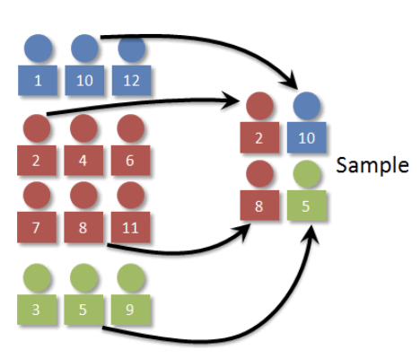
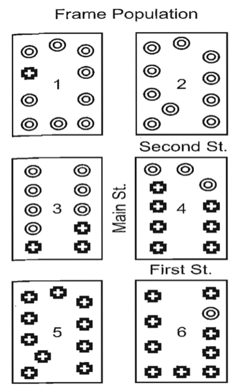
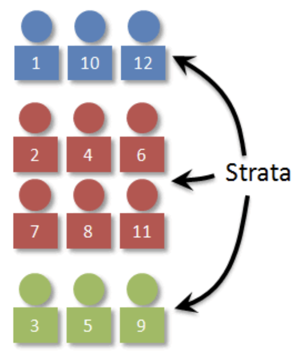
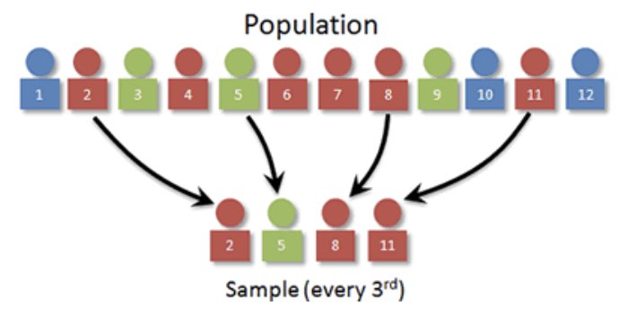

 

## 표본설계 개요

::: {.callout-note icon=false}
## 정의
**표본 설계(Sample Design)**는 설문조사가 모집단의 특성을 신뢰성 있고 효율적으로 반영하며 조사 목적을 충실히 달성하기 위한 핵심 과정이다.
:::

표본 설계가 필요한 이유는 다음과 같다.

| 이유 | 내용 |
|------|------|
| **대표성 확보** | 모집단 전체 조사가 불가능하므로 대표 표본 구성이 필수 |
| **편향 방지** | 모든 하위 그룹이 적절히 포함되도록 구성하여 왜곡 방지 |
| **자원 효율화** | 층화·군집 등 최적 방법으로 시간·비용 절감 |
| **신뢰성 향상** | 체계적 설계로 통계적 편향과 오차 감소 |
| **세분화 분석** | 특정 하위 집단을 적절히 포함·과대표하여 정밀 분석 가능 |

: 표본 설계가 필요한 이유 {.striped}

### 용어

::: {.callout-note icon=false}
## 모집단 (Population)

정보를 얻고자 하는 관심 대상이 되는 모든 개체의 집합

| 구분 | 정의 | 예시 |
|------|------|------|
| **목표 모집단** | 조사 대상 전체 | 조사 시점 기준 유권자 전체 |
| **조사 모집단** | 실제 조사 가능한 모집단 | 전화번호부 CD에 등재된 유권자 |
| **모수** | 모집단의 관심 특성 | A 후보 지지율 |
:::

::: {.callout-note icon=false}
## 표본 (Sample)

모집단 중 조사를 위해 추출한 일부

- **추정량(Estimator):** 모수를 추정하기 위해 표본으로부터 계산된 통계량
- **예시:** 표본 1,000명 중 A 후보 지지자 560명 → 추정량 = **56%**
:::

::: {.callout-note icon=false}
## 표본 프레임 (Sample Frame)

표본 추출을 위해 모집단 대상을 식별하고 접촉 정보를 포함한 목록 (식별 ID, 이름, 주소, 연락처 등)

**3가지 요건**

| 요건 | 내용 |
|------|------|
| **포괄성** | 조사 가능한 대상을 모두 포함해야 함 |
| **추출 확률의 동일성** | 모집단 각 구성원이 표본으로 추출될 확률이 동일해야 함 |
| **효율성** | 조사 목적에 부합하는 대상이 추출되도록 구성 |
:::

**표본추출:** 표본을 모집단으로부터 확률적으로 선택하는 과정. 조사 목적 달성을 최대화하도록 설계되어야 한다.

**표본 크기:** 신뢰수준, 표본추출 방법, 허용오차(변동계수 등)를 종합 고려하여 결정한다.

::: {.callout-note icon=false}
## 조사단위

| 구분 | 정의 | 예시 |
|------|------|------|
| **표본추출단위** | 표본을 추출하는 기본 단위 | 전화여론조사의 ‘가구’ |
| **조사단위** | 실제로 응답하는 개체 | 가구원 중 한 명 |

- **동일한 경우:** 인터넷 쇼핑몰 고객 실태조사 — 고객이 추출단위이자 조사단위
- **상이한 경우:** 전화여론조사 — 가구를 추출 후 가구원 중 1명이 응답
:::

### 표본과 추정

::: {.callout-tip icon=false}
## 확률 표본추출 vs. 편의 표본추출

| 구분 | 특징 | 단점 |
|------|------|------|
| **편의 표본추출** | 즉흥적·목적 기반 선택 (예: 쇼핑몰 방문자 설문) | 이론적 기반 부족, 모집단 일반화 불가 |
| **확률 표본추출** | 무작위 선택으로 선택 확률 보장 | 설계 복잡, 비용 증가 |

확률 표본추출만이 단일 표본으로 일정한 신뢰 수준에서 모집단 추론을 가능하게 한다.
:::

설문조사의 주목적은 모집단 평균 $\overline{Y}$를 추정하는 것이다. 각 조사는 가능한 확률 표본 설계 중 **하나의 실현(realization)**으로 간주된다.

| 구분 | 표본 분포 | 모집단 분포 | 표본평균 분포 |
|------|-----------|-------------|---------------|
| **현황** | 실현된 분포 | 모름 | 모름 |
| **크기** | $i = 1,2,\ldots,n$ | $i = 1,2,\ldots,N$ | $s = 1,2,\ldots,S$ |
| **개별 원소** | $y_{i}$ | $Y_{i}$ | ${\overline{y}}_{s}$ |
| **평균** | $\overline{y}$ | $\overline{Y}$ | $E({\overline{y}}_{s})$ |
| **분포 분산** | $s^{2}$ | $S^{2}$ | $V(\overline{y})$ |
| **표준오차** | $s$ | $S$ | $se(\overline{y})$ |

: 표본·모집단·표본평균 분포 비교 {.striped}

**표준오차:** $se(\overline{y}) = \sqrt{v(\overline{y})}$

> **예시:** $\overline{y} = 42$(천원), $se = 2$천원 → 95% 신뢰구간 = $(38,\ 46)$

샘플링 오류의 정도는 다음 **네 가지 원칙**에 의해 결정된다.

1. 선택된 **표본의 크기**
2. 각 모집단 요소가 표본에 선택될 **확률**
3. 요소가 **독립적** 또는 **군집(cluster)** 단위로 선택되는지 여부
4. 표본이 주요 하위 모집단의 대표성을 제어하도록 **층화** 설계되었는지 여부

### 표본설계 절차

| 단계 | 내용 | 핵심 고려사항 |
|------|------|---------------|
| **① 조사 목표 정의** | 누구를 대상으로 무엇을 조사할지 규정 | 모집단이 목표에 따라 달라짐 |
| **② 모집단 정의·분석** | 크기, 인구 구성, 지리적 분포 파악 | 대표성 확보의 기초 |
| **③ 표본 프레임 정의** | 모집단 접근 목록 구성 (고객 리스트, 전화번호부 등) | 포괄성·중복 여부·최신성 점검 |
| **④ 표본 설계 유형 선택** | SRS, 층화, 군집, 다단계 중 선택 | 이질성·프레임 구조·예산·시간 |
| **⑤ 표본 크기 결정** | 허용오차·신뢰수준·변동성 기반 산정 | 정밀도와 비용의 균형 |
| **⑥ 표본 추출** | 설계 유형에 따라 무작위 선택 | 주관적 판단 배제, 무작위성 확보 |
| **⑦ 조사·데이터 수집** | 설문·전화 인터뷰 등으로 자료 수집 | 높은 응답률 확보 전략 병행 |
| **⑧ 자료 분석·검토** | 가중치 적용, 설계효과(design effect) 산출 | 편향 보정 |
| **⑨ 결과 보고** | 설계 방법·표본 크기·한계점 함께 제시 | 신뢰성·해석 가능성 제공 |

: 표본설계의 단계적 절차 {.striped}

## 표본설계 방법

### 단순임의추출방법 SRS Simple Random Sampling

#### 정의 및 절차

{fig-align="center" width="40%"} 

단순임의 표본추출은 모집단에 포함된 모든 요소가 동일한 확률로 선택될 수 있도록 하는 표본 추출 방법이다. 즉, 크기 n의 모든 가능한 표본이 동일한 확률로 선택될 수 있도록 설계된다. 이 방법은 대표성과 무작위성을 보장하는 가장 기본적인 확률 표본 추출 방식으로, 표본 추출의 이론적 기준점이 된다.

단순임의 표본추출의 절차는 다음과 같다.

> 1. 표본 프레임에 포함된 N개의 모든 원소에 일련번호를 부여한다.
> 2. 난수 생성기를 활용하여 중복되지 않는 n개의 난수를 생성한다.
> 3. 해당 난수에 해당하는 원소를 표본으로 선택한다.

이 과정은 모집단의 각 구성원이 표본에 포함될 동등한 기회를 가지도록 하며, 편향 없는 표본 구성을 가능하게 한다.

#### 추정

**표본평균 및 표본분산**

$$\overline{y} = \frac{1}{n}\sum_{i=1}^{n}y_{i}, \quad v(\overline{y}) = \frac{(1-f)}{n}s^{2}$$

::: {.callout-note icon=false}
## 기호 설명
| 기호 | 의미 |
|------|------|
| $f = n/N$ | 표본 비율 |
| $(1-f)$ | **유한모집단보정계수(FPC)** — $N$이 크면 $1$에 근사 → $v(\overline{y}) \approx s^2/n$ |
| $v(\overline{y})$ | $V(\overline{y})$의 **불편 추정치** |
:::

**비율 추정 (여론조사 등):**

$$v(p) = \frac{(1-f)}{n-1}p(1-p)$$

$v(p)$는 FPC, $n$, $p$에만 의존 → 개별 $y_i$ 없이 계산 가능. 표본크기 결정 시 보수적으로 $p = 0.5$ 사용.

---

**95% 신뢰구간**

::: {.columns}
::: {.column width="50%"}
**모집단 평균**

$$\overline{y} \pm z_{0.975} \cdot se(\overline{y})$$

$$se(\overline{y}) = \frac{s}{\sqrt{n}}$$
:::
::: {.column width="50%"}
**모비율**

$$\widehat{p} \pm z_{0.975} \cdot se(\widehat{p})$$

$$se(\widehat{p}) = \frac{\sqrt{p(1-p)}}{\sqrt{n}}$$
:::
:::

---

**표본크기 결정 (허용오차 $e$)**

::: {.panel-tabset}

## 유한 모집단

**모평균 추정:**

$$n = \frac{N \cdot z^{2} \cdot S^{2}}{(N-1) \cdot e^{2} + z^{2} \cdot S^{2}}$$

**모비율 추정:**

$$n = \frac{N \cdot z^{2} \cdot p(1-p)}{(N-1) \cdot e^{2} + z^{2} \cdot p(1-p)}$$

## 무한 모집단

**모평균 추정:**

$$n = \frac{z^{2} \cdot S^{2}}{e^{2}}$$

**모비율 추정:**

$$n_0 = \frac{z^{2} \cdot p(1-p)}{e^{2}}, \quad n = \frac{n_0}{1 + \dfrac{n_0 - 1}{N}}$$

:::

### 군집추출방법 cluster sampling

{fig-align="center" width="40%"}

**단순임의추출 vs. 군집추출 비교**

| 구분 | 단순임의추출(SRS) | 군집추출 |
|------|------------------|---------|
| **추출 단위** | 개별 요소 | 군집(집단) |
| **비용·시간** | 높음 (전체 프레임 필요) | 낮음 (군집 단위 접근) |
| **대표성** | 높음 | 선택된 군집에 따라 달라짐 |
| **표본 오차** | 작음 | 군집 내 동질성이 높을수록 커짐 |

: SRS vs. 군집추출 비교 {.striped}

> **예시:** 총 60가구 → SRS: 무작위 20가구 선택. 군집추출: 10가구씩 6개 단지 중 2개 선택 → 20가구 조사.

::: {.callout-warning icon=false}
## 군집추출의 단점
선택된 군집에 특정 유형(예: O 표시 가구)이 집중되면 모집단 비율과 표본 비율이 크게 달라져 **대표성이 훼손**될 수 있다.
:::

#### 군집표본 추출 절차

층화추출과 달리 **군집 간 응답 차이가 없다고 가정**한다. 선택된 군집 내 구성원만을 대상으로 표본을 추출한다.

> 1. 모집단을 인구학적 특성·지리적 위치 등을 기준으로 **군집**으로 나눈다.
> 2. 난수를 이용하여 군집을 **무작위 선택**한다.
> 3. 선택된 군집의 모든 응답자를 포함한다. 군집 크기 > 표본 크기라면 군집 내부에서 **SRS 재추출**한다.

::: {.callout-tip icon=false}
## 효과적인 군집 설계 원칙
- **군집 간:** 차이를 최소화 (동질적)
- **군집 내:** 다양성을 충분히 확보 (이질적)

→ 군집이 모집단을 축소 재현할수록 대표성 향상
:::

**가구조사 표본추출 사례**

가구조사에서는 규모 비례 확률 방법을 사용하여 전국을 200개 지역으로 층화하고, 이후 일련의 계통추출 과정을 통해 가구 내 응답자를 선택한다. 표본추출은 다음과 같은 네 단계로 이루어진다.

첫째, 전국을 12개 층으로 구분한다. 6개 광역도시는 서울, 부산, 대구, 인천, 대전, 광주이며, 8개 도는 경기, 강원, 충청남북도, 경상남북도, 전라남북도로 구분된다. 도 지역은 다시 시, 읍, 면으로 세분화한다.

둘째, 6개 도시와 각 도의 시·읍·면을 모집단으로 배열한 후, 각 지역 내 동(또는 면의 경우 리)을 계통추출 방식으로 선택한다. 이 단계에서 선택된 동 또는 리는 1차 표본 지역(primary sampling location)으로 정의된다. 표본의 전체 크기가 1,500일 경우, 약 200개의 1차 표본 지역이 확보된다.

셋째, 실질적인 최종 표본 지역(actual final sampling location)인 반 또는 부락이 선택될 때까지 계통추출을 반복한다. 반은 대체로 약 20가구, 부락은 20~80가구로 구성된다.

넷째, 조사원은 선정된 표본 지역을 직접 방문하여 주민 명부를 바탕으로 8가구를 임의로 선정한다. 각 가구에서 응답자는 18세 이상인 사람 중 생일이 가장 빠른 사람으로 지정하며, 최초 방문 시 해당 응답자를 만나지 못한 경우에는 재방문하여 조사를 진행한다.

이 사례는 다단계 층화 계통추출의 전형적인 구조를 보여주며, 실제 조사의 대표성과 실현 가능성을 동시에 고려한 표본설계의 예라 할 수 있다.

#### 표본평균 추정

**군집 표본평균:**

$$\overline{y} = \frac{\sum_{\alpha=1}^{a}\sum_{\beta=1}^{B}y_{\alpha\beta}}{aB}$$

($a$: 선택된 군집 수, $B$: 군집당 가구 수)

**평균의 표본분산:**

무작위화는 군집(단지)에만 적용되며, **군집이 표본 단위**이다.

$$v(\overline{y}) = \left(\frac{1-f}{a}\right)s_a^2$$

$$s_a^2 = \frac{1}{a-1}\sum_{\alpha=1}^{a}(\overline{y}_\alpha - \overline{y})^2$$

::: {.callout-note icon=false}
## 핵심
군집표본은 요소 분산 $s^2$ 대신 **군집 간 분산** $s_a^2$을 사용한다.
:::

#### 설계효과 design effect

::: {.callout-note icon=false}
## 정의
$$d^{2} = \frac{v(\overline{y})}{v_{\text{SRS}}(\overline{y})}$$

SRS 대비 실제 표본 설계로 인해 표본분산이 **얼마나 증가**했는지를 나타내는 지표
:::

**군집 내 동질성과 설계효과의 관계:**

- 군집 내 동질성이 높을수록 → 추가 요소가 새로운 정보를 주지 못함 → $d^2$ 증가
- 극단적 예: 교실의 모든 학생이 동일 점수 → 한 명만 조사해도 충분

**설계효과와 군집 내 동질성($roh$):**

$$d^{2} = 1 + (b-1) \cdot roh$$

::: {.callout-note icon=false}
## 기호 설명
| 기호 | 의미 |
|------|------|
| $b$ | 군집당 표본 요소 수 |
| $roh$ (rate of homogeneity) | 군집 내 동질성 지수 (거의 항상 양수) |

- $b = 1$ 또는 $roh = 0$ → $d^2 = 1$ (SRS와 동일)
- 사회경제적 변수: $roh$ 높음 / 태도·출산 경험: $roh$ 낮음
:::

**$roh$ 추정:**

$$roh = \frac{d^2 - 1}{b - 1}$$

**새로운 설계 적용:**

$$d_{\text{new}}^2 = 1 + (b_{\text{new}} - 1) \cdot roh_{\text{old}}$$

$$v(\overline{y}) = d_{\text{new}}^2 \cdot \left(\frac{1-f}{n}\right)s^2$$

**유효 표본 크기(Effective Sample Size):**

$$n_{\text{eff}} = \frac{n}{d^2}$$

> **예시:** $n = 200$, $d^2 = 3.13$ → $n_{\text{eff}} = 200/3.13 \approx 64$
> → 실제로는 SRS 64명과 동등한 정밀도

::: {.callout-tip icon=false}
## 군집 효과 완화 방법
군집당 표본 크기 $b$를 **줄이고** 더 많은 군집에 분산시키면 $d^2$가 감소한다.
단, 총 비용은 증가한다.
:::

### 층화추출방법 stratified sampling

{fig-align="center" width="40%"} 

확률 표본 설계는 모집단의 하위 그룹들이 표본 내에 적절히 대표되도록 보장하는 방식으로 개선될 수 있다. 이러한 기능 중 하나가 층화(stratification)이다.

층화는 표본 프레임에 포함된 모집단 요소들이 사전에 정의된 기준에 따라 상호 배타적인 그룹, 즉 층(strata)으로 구분될 수 있는 정보를 가지고 있다는 전제에 기반한다. 각 요소는 오직 하나의 층에만 속할 수 있으며, 이처럼 나뉜 층은 서로 겹치지 않는 범주로 구성된다.

층화표본추출에서는 각 층에서 표본을 독립적으로 선택한다. 이때 모든 층에서 동일한 표본추출 절차(예: 단순임의추출)를 사용할 수도 있고, 층의 특성에 따라 서로 다른 추출 방법(예: 어떤 층에서는 단순임의추출, 다른 층에서는 군집추출)을 적용할 수도 있다.

층화는 특히 모집단 내에 중요한 이질적 특성이 존재할 경우 유용하며, 각 하위 집단의 특성을 보다 정확하게 추정할 수 있도록 도와준다. 또한 전체 표본의 분산을 줄이는 데에도 기여할 수 있다.

#### 층화 vs. 군집 비교

| 구분 | 층화추출 | 군집추출 |
|------|---------|---------|
| **층/군집 간** | 이질적 (차이가 클수록 유리) | 동질적 (차이가 없다고 가정) |
| **층/군집 내** | 동질적 | 이질적 |
| **목적** | 대표성·정밀도 향상 | 비용·시간 절감 |
| **모든 층/군집 조사 여부** | 모든 층에서 추출 | 선택된 군집만 조사 |
| **유용한 경우** | 성별·연령·지역 등 구분 기준이 명확할 때 | 지리적으로 광범위하게 분산된 모집단 |

: 층화추출 vs. 군집추출 비교 {.striped}

#### 층화표본 추출 절차

> 1. **층 정의:** 모집단을 성별·연령·직업·지역 등 응답 성향에 영향을 미치는 변수로 분류
> 2. **표본 할당:** 각 층에 비례 또는 비비례(네이만 할당)로 표본 수 배정
> 3. **층별 추출:** 각 층에서 SRS 또는 계통추출로 표본 선택

#### 표본평균 추정

비례 할당에서 $f_h = n_h/N_h$, $W_h = N_h/N$ (층의 모집단 비율).

**층화 추정치:**

$${\overline{y}}_{st} = \sum_{h=1}^{H}W_{h}{\overline{y}}_{h}$$

#### ${\overline{y}}_{st}$의 표본 분산

**층별 분산:**

$$v({\overline{y}}_{h}) = \left(\frac{1-f_h}{n_h}\right)s_h^2, \quad s_h^2 = \frac{1}{n_h-1}\sum_{i=1}^{n_h}(y_{hi}-{\overline{y}}_h)^2$$

**전체 층화 분산:**

$$v({\overline{y}}_{st}) = \sum_{h=1}^{H}W_h^2\left(\frac{1-f_h}{n_h}\right)s_h^2$$

::: {.callout-note icon=false}
## 핵심
층화추출에서는 SRS처럼 단일 분산을 쓰지 않고 **각 층별로 분산을 계산한 뒤 결합**한다.
:::

#### 설계효과

$$d^{2} = \frac{v(\overline{y}st)}{v\text{SRS}(\overline{y})} = \frac{\sum_{h = 1}^{H}W_{h}^{2}\left( \frac{1 - f_{h}}{n_{h}} \right)s_{h}^{2}}{\left( \frac{1 - f}{n} \right)s^{2}}$$

이 설계효과는 [1보다 작거나, 1과 같거나, 심지어 1보다 클
수도]{.underline} 있다. 설계효과의 크기는 각 층에서 선택된 표본 크기, 즉
층화 내 표본 할당 방식에 크게 의존한다.

비율의 추정 절차는 평균에 대한 추정 절차와 유사하며, 실제로 동일한
공식을 사용할 수 있다. 그러나 비율의 추정은 종종 다음과 같은 비율의
형태로 표현된다.

$p_{st} = \sum_{h=1}^{H}W_{h}p_{h}$,
$v(p_{st}) = \sum_{h=1}^{H}W_{h}^{2}\left( \frac{1 - f_{h}}{n_{h} - 1} \right)p_{h}(1 - p_{h})$

모평균 추정치
${\overline{y}}_{st} = \sum_{h=1}^{H}W_{h}{\overline{y}}_{h} = \sum_{h=1}^{H}\left( \frac{N_{h}}{N} \right){\overline{y}}_{h}$을
대수적 방법으로 재표현 하면
$\overline{y}st = \frac{\sum_{h = 1}^{H}\sum_{i = 1}^{n_{h}}w_{hi}y_{hi}}{\sum_{h = 1}^{H}\sum_{i = 1}^{n_{h}}w_{hi}}$,
여기서 $w_{hi}$는 데이터 세트의 가중치 변수로, 층 $h$에 있는 요소 $i$의
$w_{hi} = \frac{N_{h}}{n_{h}}$이다. 즉, 가중 평균은 가중 총합을 가중치의
합으로 나눈 값이다.

${\overline{y}}_{st}$의 표본 분산은 가장 간단하게 층 전체의 분산에 대한
가중 합으로 표현될 수 있다. 각 층에서 단순 임의 표본 추출(SRS)을
사용했다면, 다음과 같이 계산된다.

$$v({\overline{y}}_{st}) = \sum_{h=1}^{H}W_{h}^{2}(\text{variance of}h\text{-th stratum mean})$$

$v({\overline{y}}_{st}) = W_{1}^{2}\left( \frac{1 - f_{1}}{n_{1}} \right)s_{1}^{2} + W_{2}^{2}\left( \frac{1 - f_{2}}{n_{2}} \right)s_{2}^{2} + W_{3}^{2}\left( \frac{1 - f_{3}}{n_{3}} \right)s_{3}^{2} + \cdots$,
여기서 $W_{h}$는 층 $h$의 모집단 비율, $f_{h} = n_{h}/N_{h}$는 층 $h$의
표본 추출률, $s_{h}^{2}$는 층 $h$의 분산이다. 즉, 분산의 추정은 층별로
계산된 후, 층별 결과를 결합하여 이루어진다.

#### 층화 추출의 설계효과가 $d^{2} < 1$ 인 경우

$$d^{2} = \frac{v({\overline{y}}_{st})}{v_{\text{SRS}}(\overline{y})} = \frac{\sum_{h=1}^{H}W_h^2\left(\frac{1-f_h}{n_h}\right)s_h^2}{\left(\frac{1-f}{n}\right)s^2}$$

$d^2 < 1$이 되는 네 가지 조건:

| 조건 | 내용 | 예시 |
|------|------|------|
| **① 층 간 변동이 큰 경우** | 층 간 이질성을 활용해 전체 분산 감소 | 수입·교육·지역별 생활비 차이가 클 때 |
| **② 비례 할당 적용** | $f_h = n_h/N_h$로 층별 동일 추출률 → 분산 감소 | 각 층이 모집단 비율대로 대표 |
| **③ 층 내 변동이 작은 경우** | $s_h^2$ 작을수록 전체 분산 감소 | 적은 표본으로도 층 대표 가능 |
| **④ 네이만 할당** | $n_h \propto N_h \cdot S_h$로 최적 배분 | 층 크기와 분산을 동시에 고려 |

: $d^2 < 1$이 되는 조건 {.striped}

#### 층에 대한 비례하지 않은 할당

비례할당 외에 더 작은 표본 분산을 유도하는 최적 방법이 **네이만 할당(Neyman Allocation)**이다.

::: {.callout-note icon=false}
## 네이만 할당 공식

$$n_h = n \cdot \frac{W_h S_h}{\sum_{h=1}^{H} W_h S_h}$$

- 비례할당: $n_h \propto W_h$ (층 크기에 비례)
- 네이만 할당: $n_h \propto W_h S_h$ (층 크기 × **층 내 표준편차**에 비례)

→ $S_h$가 클수록 해당 층에 더 많은 표본 배정
:::

::: {.callout-warning icon=false}
## 네이만 할당의 단점

| 단점 | 설명 |
|------|------|
| 비율 추정 부적합 | 층 간 비율 차이가 커야 유리하지만 해당 변수 찾기 어려움 |
| 단일 변수 최적화 | 여러 변수를 수집할 경우 다른 변수에는 최적이 아닐 수 있음 |
| 사전 정보 필요 | 층 내 분산 정보 없이 적용하면 표준오차 오히려 증가 가능 |
:::

### 계통 표본 추출 systematic selection

{fig-align="center" width="40%"} 

#### 계통 추출 절차

> 1. 추출 간격 계산: $k = \dfrac{N}{n}$ (소수점은 버림)
> 2. 1부터 $k$ 사이에서 **무작위로 시작점** 선택
> 3. 시작점부터 매 $k$번째 요소를 순차적으로 표본에 포함

#### 계통추출 특징과 주의사항

| 특징 | 내용 |
|------|------|
| **묵시적 층화 효과** | 정렬된 리스트에서 추출 시 비례할당 층화추출과 유사 결과 |
| **정밀도 향상** | 정렬 기준이 조사 변수와 상관관계를 가질 때 SRS보다 높은 정밀도 |
| **지리적 정렬 예시** | 남동→북서 정렬 시 대도시·농촌 기업이 자연 분리 → 규모별 층화 효과 |

: 계통추출의 특징 {.striped}

::: {.callout-warning icon=false}
## 주의: 주기성 문제
모집단이 **주기적 패턴**을 가질 경우 편향 발생 가능. 추출 간격이 패턴 주기와 일치하면 특정 유형의 요소만 반복 선택될 위험이 있다.
:::

## 표본설계 방법 요약: 가중치와 추정분산

| 방법 | 가중치 | 표본분산 공식 | 특징 및 주의사항 |
|------|--------|--------------|-----------------|
| **단순임의추출 (SRS)** | $w_i = \dfrac{N}{n}$ | $v(\overline{y}) = \dfrac{(1-f)}{n}s^2$ | 이론적 기준. 이질성 크면 비효율 |
| **계통추출** | $w_i = \dfrac{N}{n}$ | $v(\overline{y}_{sys}) \approx v(\overline{y}_{SRS})$ | 정렬 시 묵시적 층화 효과. 주기성 주의 |
| **군집추출** | $w_c = \dfrac{N}{n}$ | $v(\overline{y}_{cl}) = \dfrac{(1-f)}{a}s_a^2$ | 비용 절감. $roh$ 높을수록 오차 증가 |
| **층화추출** | $w_h = \dfrac{N_h}{n_h}$ | $v(\overline{y}_{st}) = \sum_h W_h^2\dfrac{(1-f_h)}{n_h}s_h^2$ | 층 간 변동 클수록 효율적. $d^2 \leq 1$ 가능 |

: 표본설계 방법 비교 요약 {.striped}

::: {.callout-tip icon=false}
## 방법 선택 가이드

| 상황 | 권장 방법 |
|------|-----------|
| 이론적 기준선, 모집단 정보 없음 | 단순임의추출 (SRS) |
| 목록이 있고 빠른 추출 필요 | 계통추출 |
| 지리적으로 분산, 비용 제약 | 군집추출 |
| 하위 집단 대표성·정밀도 중요 | 층화추출 |
:::
