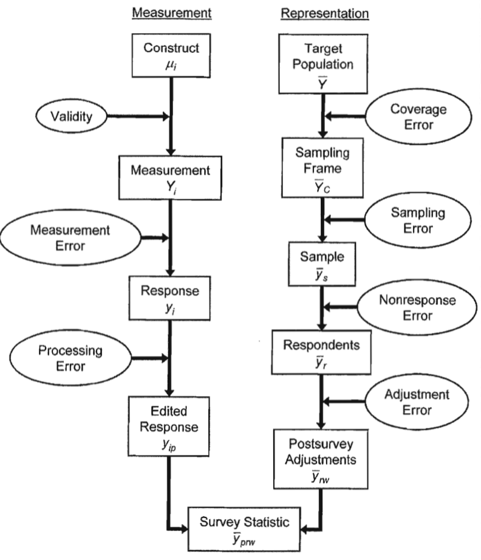

 

## 개요

### 조사란?

::: {.callout-note icon=false}
## 정의
**조사(Survey)**는 특정 집단(표본)으로부터 정보를 수집하여, 그 집단이 속한 더 큰 **모집단**의 특성을 수치적으로 설명하는 체계적인 방법이다.
:::

조사를 통해 얻어진 통계는 특정 요소 집합에 대한 관찰 결과를 요약한 수치적 표현으로, 두 가지 유형으로 구분된다.

| 구분 | 설명 | 예시 |
|------|------|------|
| **기술통계** | 모집단 내 특성의 수준과 분포를 설명 | 평균 교육 연수, 총 환자 수, 대통령 지지율 |
| **분석통계** | 두 개 이상의 변수 간 관계를 측정 | 소득-교육 회귀계수, 독서량-교육수준 상관관계 |

: 조사통계의 유형 {.striped}

조사는 사회과학에서 행동 이론을 검증하는 데 가장 널리 사용되는 방법 중 하나이며, 정보는 주로 사람들에게 질문을 통해 수집된다. 정보 수집 방식은 조사자가 직접 질문·기록하거나, 응답자가 스스로 작성하는 방식 등 다양하다.

::: {.callout-important icon=false}
## 조사방법론의 목적
조사 과정에서 발생하는 다양한 **오류의 원인을 분석**하고, 조사 결과가 가능한 한 정확하게 모집단을 반영하도록 하기 위한 연구 분야다. 여기서 ‘오류’란 단순한 실수가 아닌, **모집단의 실제 값과 조사 추정값 사이의 차이**를 의미한다.
:::

### 조사목적

조사 과정에서 가장 중요한 두 가지 질문은 **”무엇을 발견할 것인가?”** 와 **”가장 효과적인 방법은 무엇인가?”** 이다. 대부분의 조사는 다음 세 가지 주요 목적을 중심으로 수행된다.

::: {.panel-tabset}

## 탐구 (Exploration)

**목적:** 잘 알려지지 않은 영역·현상을 사전 파악하기 위한 예비적 조사

- 새로운 사회적 트렌드나 특정 인구 집단의 행동 패턴 파악
- 조사 설계와 연구 방향 설정의 기초를 마련
- **주요 방법:** 인터뷰, 포커스 그룹 등 정성적 방법

## 서술 (Description)

**목적:** 대상 집단의 특성을 수치적·질적 데이터로 기술

- 실업률, 인구 구조, 산업 동향 같은 국가통계·시장조사
- 결과를 모집단에 일반화할 수 있는 기반 제공
- **핵심 요건:** 엄격한 표본추출과 신뢰도 검증

## 설명 (Explanation)

**목적:** 특정 현상의 원인과 결과를 실증적으로 규명

- 예: “왜 노년층은 보수적인 정치 성향을 보이는가?”
- 변수 간 관계 탐구 → 인과관계 추론
- **주요 방법:** 설문조사 + 가설 검정·통계 분석

:::

조사의 목적을 명확히 하기 위해서는 **대상·방법·내용**을 분명히 정의해야 한다. 표본 프레임 설정 후 설문 항목을 신중히 설계하며, 조사 목적은 가설 설정과 직결된다.

::: {.callout-warning icon=false}
## 주의사항
- 설문 결과 분석 **후에** 가설을 설정하는 것은 부적절
- 조사 목적 설정 시 결론을 미리 정하는 것도 부적절 → 결과 왜곡 위험
- 목적 설정 후 이해관계자·전문가 포커스 그룹으로 설문지 검토 권장
:::

## 조사에서의 추론과 오류

조사는 **응답자의 답변 → 개인 특성 추론 → 표본 통계 → 모집단 추론**의 단계적 과정이다.

이 과정에서 두 가지 핵심 조건이 충족되어야 한다.

::: {.callout-tip icon=false}
## 추론의 두 가지 핵심 조건

1. **측정 조건:** 응답자가 제공한 답변이 그 사람의 특성을 정확히 반영해야 한다.
2. **대표성 조건:** 조사에 참여한 표본이 모집단 전체의 특성을 대표해야 한다.

두 조건 중 하나라도 충족되지 않으면 **오류**가 발생한다.
:::

여기서 말하는 오류는 단순한 실수가 아니라 **의도한 결과와 실제 결과 사이의 편차**를 의미한다.

| 오류 유형 | 발생 조건 |
|-----------|-----------|
| **측정 오류** | 응답이 측정하고자 하는 속성과 불일치할 때 |
| **비관찰 오류** | 표본 추정치가 모집단 실제 값과 차이를 보일 때 |

: 오류의 주요 유형 {.striped}

조사방법론은 이러한 오류를 체계적으로 분류·분석하며, 오류 최소화를 위해 조사 설계·표본추출·자료 수집 모든 단계에서 신중한 계획이 요구된다.

### 조사 주기(조사 설계 관점)

조사 설계를 바라보는 두 관점이 있다.

| 관점 | 핵심 시각 |
|------|-----------|
| **설계 관점** | 추상적 아이디어 → 구체적 실행 단계로 전환하는 과정 |
| **품질 관점** | 조사 설계가 다양한 오류의 근원이 될 수 있다는 점 강조 |

: 조사 설계의 두 관점 {.striped}

조사의 핵심은 **측정 차원**과 **표현 차원**으로 나뉜다.

| 차원 | 핵심 질문 | 내용 |
|------|-----------|------|
| **측정 차원** | 무엇에 관한 조사인가? | 표본 내 관찰 단위에서 수집되는 데이터 |
| **표현 차원** | 누구에 관한 조사인가? | 조사에서 다루는 모집단 |

: 조사의 두 차원 {.striped}

#### 측정 과정

구성 요소 정의 → 측정 도구·질문 설계 → 응답 수집 → 검토·편집 → 통계 산출

#### 표현 과정

모집단 정의 → 표본 프레임 설정 → 표본 추출 → 응답자 조사 참여 → 보정 → 모집단 대표 통계 산출

#### 구성 요소 constructs

::: {.callout-note icon=false}
## 정의
**구성 요소(Construct)**는 연구자가 조사에서 얻고자 하는 정보의 내용이다. 조사 목적에 따라 다양하며, 종종 추상적이어서 정확히 측정하기 어렵다.
:::

| 추상성 수준 | 예시 조사 | 측정 내용 |
|------------|-----------|-----------|
| 추상적 | 소비자 신뢰도 조사 | 재정 상태에 대한 단기적 낙관도 (주관적, 개인차 큼) |
| 구체적 | 전국 약물·건강 조사 | 지난달 맥주 소비량 (관찰 가능한 행동) |

: 구성 요소의 추상성 수준 {.striped}

> **실무 과제:** 서술 수준의 개념(“범죄 피해자는 누구인가?”)을 실제 측정 가능한 항목으로 전환하는 것이 핵심 난제이다.

#### 측정 measurement

특정 구성 요소에 대한 정보를 수집하는 **방법**이다.

| 측정 방식 | 예시 |
|-----------|------|
| 물리적 측정 | 토양 샘플 채취, 혈압 측정 |
| 행동 관찰 | 센서로 차량 흐름 기록 |
| 질문 응답 | “지난 6개월간 범죄를 경찰에 신고한 적 있습니까?” |

: 측정 방식의 유형 {.striped}

측정 도구(질문지)는 전화 인터뷰, 대면 조사, 종이 설문지, 컴퓨터 자가응답 등 다양한 형태로 제공된다.

#### 응답 response

응답의 성격은 측정 방법에 따라 달라진다.

- **주관적 판단형:** “1년 후 가족의 경제 상황이 나아질 것 같은지?” (소비자 신뢰도)
- **기록 조회형:** 고용주가 직원 기록을 확인하여 특정 주간 직원 수를 보고 (고용 통계)
- **응답 형식:** 선택지 제공(폐쇄형) vs. 자유 기술(개방형)

#### 편집된 응답 edited response

수집된 응답을 다음 단계로 넘기기 전에 사전 검토한다.

::: {.columns}
::: {.column width=”50%”}
**컴퓨터 조사**

- 범위 검사(range check)로 이상값 자동 탐지
- 불일치 감지 시 후속 질문으로 확인
- 예: 나이 14세 + 자녀 5명 → 불일치 플래그
:::
::: {.column width=”50%”}
**종이 설문지**

- 조사자가 수기로 검토
- 읽기 어려운 답변·누락 항목 보완
- 전체 수집 후 추가 편집(이상치 탐지, 패턴 불일치)
:::
:::

#### 조사 대상 모집단 target population

조사의 분석 대상이 되는 단위들의 집합이다. 모집단 정의 시 다음 사항을 명확히 해야 한다.

- **포함 기준:** 연령, 거주지 유형, 시설 거주자 포함 여부 등
- **시간적 범위:** 특정 월·주로 고정
- **예시:** 경제활동인구조사 → 만 15세 이상, 비시설 일반 주거지 거주자

#### 표본 프레임 모집단 frame population

조사 표본에 **선택될 가능성이 있는** 대상 모집단의 구성원 집합이다.

| 조사 유형 | 표본 프레임 예시 | 문제점 |
|-----------|----------------|--------|
| 소비자 신뢰도 | 전화번호 목록 | 전화 없는 가구 누락, 복수 번호 보유 가구 |
| 건강 조사 | 행정구역별 거주지 목록 | 고정 거주지 없는 사람, 복수 거주지 보유자 |

: 표본 프레임의 예시와 문제점 {.striped}

#### 표본 sample

표본 프레임에서 **선택된** 데이터 수집 대상 그룹이다. 표본은 프레임의 극히 일부를 차지한다.

#### 응답자 respondents

::: {.callout-note icon=false}
## 단위 무응답 vs. 항목 무응답

| 구분 | 설명 |
|------|------|
| **단위 무응답** | 해당 사례 전체가 응답 실패 (무응답자) |
| **항목 무응답** | 조사에는 참여했으나 특정 질문 응답 누락 |
:::

어떤 사례를 응답자로 분류할지는 종종 불명확하다. 불완전한 응답의 포함 여부는 분석 목적에 따라 결정해야 한다.

#### 조사 후 조정 (Postsurvey Adjustments)

모든 데이터 수집 완료 후에도 추정치 품질 향상을 위한 추가 절차가 진행된다.

- **가중치 조정:** 과소 대표된 집단(예: 도시 지역 저응답자)에 더 큰 가중치 부여
- **결측 대체(Imputation):** 미응답 항목을 추정값으로 대체

이러한 조사 후 조정은 포함 오류·표본 오류·무응답 오류를 줄이는 것이 목표이나, 경우에 따라 오류를 증가시킬 수도 있어 세심한 설계가 요구된다.

### 조사 주기(조사 품질 관점)

각 단계 사이에서 발생하는 불일치를 **오류**라는 개념으로 표현한다. 조사 설계자의 역할은 설계 및 추정 선택을 통해 이러한 오류를 최소화하여 조사 통계의 품질을 높이는 것이다.

{fig-align="center" width="40%"}

::: {.callout-note icon=false}
## 핵심 기호 정의

| 기호 | 의미 |
|------|------|
| $\mu_{i}$ | 모집단에서 $i$번째 사람의 **참 값** |
| $Y_{i}$ | $i$번째 표본 사람의 **측정값** |
| $y_{i}$ | $i$번째 표본의 **응답값** (조사 질문에 대한 응답) |
| $y_{ip}$ | 편집·처리 과정을 거친 $i$번째 표본 **최종 데이터값** |

**결론:** 측정 목표는 $\mu_{i}$이지만, 실제로는 오류가 누적된 불완전한 지표 $y_{ip}$를 사용한다.
:::

#### 타당성 validity

::: {.callout-note icon=false}
## 타당성 (Validity)
측정값이 근본적인 구성 요소와 관련된 정도. 타당하지 않음(invalidity)은 이 정도가 달성되지 않은 상태.
:::

타당성의 통계적 표현:

$$Y_{i} = \mu_{i} + \varepsilon_{i}$$

- $\mu_{i}$: 구성 요소의 참값, $\varepsilon_{i}$: 참값에서의 편차

반복 측정 시 식이 확장된다:

$$Y_{it} = \mu_{i} + \varepsilon_{it}$$

($t$: 측정 시도 번호)

**타당성**은 측정값 $Y$와 참값 $\mu$ 간의 **상관관계**로 정의된다. 상관관계가 높을수록 타당성이 높다.

#### 측정 오류 measurement error

측정 오류는 측정값이 참값에서 벗어나는 현상이다. 크게 **응답 편향**과 **응답 분산** 두 가지로 구분한다.

::: {.columns}
::: {.column width=”50%”}
**응답 편향 (Response Bias)**

- 측정값과 참값 간 체계적 편차: $(y_i - Y_i)$
- 차이가 일정한 방향으로 발생
- 예: 약물 사용, 범죄 피해 경험의 **과소 보고**
- $E(y_i) \neq Y_i$
:::
::: {.column width=”50%”}
**응답 분산 (Response Variance)**

- 동일인에게 동일 질문을 반복했을 때 매번 응답이 달라지는 현상
- 신뢰도가 낮은 측정에서 발생
- 다양한 맥락·환경 자극이 응답에 영향
- 추정값의 불안정성을 높이는 주요 원인
:::
:::

> **예시:** “코카인을 사용한 적이 있습니까?”라는 질문에 실제 사용자도 “아니요”라고 답하는 경우 → **응답 편향**

#### 처리 오류 processing error

데이터 수집 후, 추정 단계 전에 발생하는 오류로 **편집 오류**와 **코딩 오류**가 대표적이다.

::: {.columns}
::: {.column width=”50%”}
**편집 오류**

- 이상값을 맥락 없이 결측 처리할 때 발생
- 예: “매일 여러 차례 폭행 당함” → 자동 결측 처리
  - 그러나 해당 응답자가 술집 보안요원이라면 사실일 수 있음
- 맥락에 따라 수정 여부 판단이 달라지는 과정에서 오류 발생
:::
::: {.column width=”50%”}
**코딩 오류**

- 텍스트 응답 분류 시 코더별 해석 차이
- **코딩 분산:** 동일 응답을 코더마다 다르게 분류하는 변동성
- **코딩 편향:** 훈련 부족한 코더의 모호한 응답 잘못 분류
:::
:::

**통계적 표현:**

$$\text{처리 편차} = y_{ip} - y_{i}$$

($y_i$: 조사 응답값, $y_{ip}$: 편집된 최종 데이터값)

#### 포함오류 coverage error

포함 오류는 모집단과 표본 프레임 간의 차이에서 발생한다. 예를 들어, 표본 프레임이 모집단의 일부를 포함하지 못한 경우를 포함 부족(undercoverage)이라고 하며, 반대로 표본 프레임에 모집단에 속하지 않는 요소가 포함된 경우는 과잉 포함(overcoverage)이라고 한다.

포함 편향은 두 가지 요소에 의해 결정된다.

1. 표본 프레임에 **포함되지 않은** 모집단 구성원의 비율
2. 프레임에 포함된 구성원과 포함되지 않은 구성원 간의 **특성 차이**

$${\overline{Y}}_{C} - \overline{Y} = \frac{U}{N}({\overline{Y}}_{C} - {\overline{Y}}_{U})$$

::: {.callout-note icon=false}
## 기호 설명
| 기호 | 의미 |
|------|------|
| $\overline{Y}$ | 목표 모집단 전체의 평균 |
| ${\overline{Y}}_{C}$ | 표본 프레임에 **포함된** 모집단의 평균 |
| ${\overline{Y}}_{U}$ | 표본 프레임 **밖** 모집단의 평균 |
| $N$ | 목표 모집단 총 구성원 수 |
| $C$ | 프레임에 포함된 적격 구성원 수 |
| $U$ | 프레임에 포함되지 않은 적격 구성원 수 |
:::

예를 들어, 전화 조사를 통해 가구의 평균 교육 연수를 측정한다고 가정하자. 전화가 없는 가구는 표본에서 제외되므로 이들의 평균 교육 연수는 낮아질 가능성이 있다. 전화가 있는 가구의 평균 교육 연수가 14.3년이고, 전화가 없는 가구의 평균 교육 연수가 11.2년이라면, 전체 모집단 평균에 대한 편향은 다음과 같이 계산될 수 있다(단, 전화 없는 가구 비율을 5%라 가정하자).

${\overline{Y}}_{C} - \overline{Y} = 0.05(14.3 - 11.2) = 0.16\text{년}$.

즉, 전화가 없는 가구를 포함하지 않은 표본 프레임은 모집단 평균보다 약 0.16년 더 높은 평균 교육 연수를 보여줄 것이다. 결론적으로, 표본 프레임의 포괄 오류는 표본 평균 추정값에 영향을 미치며, 이는 모집단 평균이 아닌 표본 프레임 평균을 반영하게 된다.

#### 표본 오류 sampling error

표본 설문조사에서는 비용과 시간의 제약으로 인해, 표본 프레임 내 모든 구성원을 조사하는 것이 현실적으로 어렵다. 따라서 전체 중 일부만을 선택하여 조사하고, 나머지는 제외하는 방식이 일반적으로 채택된다. 이러한 선택적 측정으로 인해 발생하는 통계적 차이를 표본 오류라고 한다.

표본 오류는 크게 두 가지 유형으로 구분된다.

| 유형 | 발생 원인 | 결과 |
|------|-----------|------|
| **표본 편향** (sampling bias) | 일부 구성원이 선택 기회가 없거나 체계적으로 제외될 때 | 프레임 모집단 통계와 차이 |
| **표본 분산** (sampling variance) | 동일 방법으로 반복 추출 시 표본마다 다른 응답 포함 | 조사 통계가 반복마다 달라짐 |

: 표본 오류의 두 유형 {.striped}

**표본 분산 관련 수식:**

$$\overline{Y}_s = \frac{\sum_{i=1}^{n_s} y_{si}}{n_s}, \quad \overline{Y}_C = \frac{\sum_{i=1}^{C} Y_i}{C}$$

$$\text{표본 분산} = \frac{\sum_{s=1}^{S}({\overline{Y}}_{s} - {\overline{Y}}_{C})^{2}}{S}$$

::: {.callout-note icon=false}
## 기호 설명
| 기호 | 의미 |
|------|------|
| ${\overline{Y}}_{s}$ | $s$번째 표본 추출의 표본 평균 ($s = 1, 2, \ldots, S$) |
| ${\overline{Y}}_{C}$ | 표본 프레임 전체 요소의 총평균 |
:::

#### 응답률 오류 nonresponse error

모든 표본 구성원을 설문조사에서 완전히 측정하는 것은 현실적으로 어렵다. 특히 사람을 대상으로 하는 조사에서는 이러한 상황이 자주 발생한다. 이로 인해 발생하는 오류를 응답률 오류라고 하며, 이는 실제 응답한 사람들의 통계 값이 전체 표본을 기준으로 했을 때의 통계 값과 다를 때 나타난다.

예를 들어, 수행평가 당일 결석한 학생들이 수학적 또는 언어적 능력이 낮은 경향이 있다면, 이들이 측정에서 제외됨으로써 전체 수행평가 점수가 과대평가될 수 있다. 즉, 응답자의 평균 점수가 전체 표본의 진정한 평균보다 체계적으로 높아지는 결과가 나타난다. 이러한 오류는 응답률이 낮을수록 그 영향이 커지며, 조사 결과의 왜곡 가능성도 더욱 심각해질 수 있다.

**응답률 편향 공식:**

$${\overline{y}}_{r} - {\overline{y}}_{s} = \frac{m_{s}}{n_{s}}({\overline{y}}_{r} - {\overline{y}}_{m})$$

::: {.callout-note icon=false}
## 기호 설명
| 기호 | 의미 |
|------|------|
| ${\overline{y}}_{s}$ | $s$번째 표본의 전체 평균 |
| ${\overline{y}}_{r}$ | $s$번째 표본의 **응답자** 평균 |
| ${\overline{y}}_{m}$ | $s$번째 표본의 **비응답자** 평균 |
| $n_s$ | $s$번째 표본의 총 구성원 수 |
| $r_s$ | $s$번째 표본의 응답자 수 |
| $m_s$ | $s$번째 표본의 비응답자 수 |
:::

따라서 표본 평균에 대한 응답률 편향은 응답률(데이터가 수집되지 않은 표본 구성원의 비율)과 응답자와 비응답자 평균 간의 차이의 곱으로 나타난다. 이는 높은 응답률만으로는 반드시 품질 지표가 아님을 나타낸다. 응답률이 높은 설문조사에서도 비응답자가 조사 변수에서 매우 독특할 경우, 높은 응답률 편향이 나타날 수 있다. 이 문제를 방지하는 가장 좋은 방법은 높은 응답률을 유지하여 응답률 편향의 위험을 줄이는 것이다.

#### 보정 오류 adjustment error

조사 후 보정(post-survey adjustment)은 포함 오류·표본 오류·무응답 오류를 줄이기 위한 마지막 단계다.

**보정 방법:** 과소 대표된 집단에 더 큰 가중치 부여

$$w_i = \frac{1}{\text{응답률}}$$

예: A지역 응답률 85% → $w_i = 1/0.85$

**조정된 표본 평균:**

$$\overline{y}_{nw} = \frac{\sum_{i=1}^{r} w_i y_{si}}{\sum_{i=1}^{r} w_i}$$

모집단 평균과의 차이: $(\overline{y}_{nw} - \overline{Y})$

::: {.callout-warning icon=false}
## 주의
보정은 편향을 줄이는 데 기여하지만, 경우에 따라 오류를 오히려 **증가**시킬 수도 있다. 설계와 실행 단계에서 세심한 주의가 필요하다.
:::

## 목표모집단, 표본프레임, 포함오류

표본 설문조사는 명확히 정의된 모집단을 설명하거나, 그로부터 통계적 추론을 도출하는 과정이다. 이때 모집단을 구성하는 기본 단위는 ‘요소’ 또는 ‘조사단위’로 불리며, 이 요소들이 전체 모집단을 형성한다. 예를 들어, 가구 조사의 경우 요소는 개별 가구원일 수 있으며, 학교 조사의 경우에는 학생이, 비즈니스 조사의 경우에는 사업체나 시설이 요소가 된다. 하나의 설문조사 내에서도 다양한 유형의 요소가 존재할 수 있다. 가구 조사의 경우, 조사 대상은 사람일 수도 있지만, 주거 단위나 거주 커뮤니티 등과 같은 더 넓은 단위로 확장될 수도 있다.

설문조사에서 모집단 정의는 조사 설계와 결과 해석의 출발점이다. 모집단 정의가 중요한 네 가지 이유는 다음과 같다.

| 이유 | 핵심 내용 |
|------|-----------|
| **조사의 목적** | 어떤 집단을 설명하는지 분명히 밝혀야 결과의 대표성 확보 가능 |
| **표본 설계의 출발점** | 모집단 정의가 불명확하면 표본 추출 왜곡 → 대표성 결여 |
| **다양한 단위 처리** | 사람·가구·기업 등 요소 범위가 불명확하면 해석 혼란 발생 |
| **실험연구와의 차별성** | 설문조사는 인과관계보다 모집단 특성 설명이 목표 → 정의가 핵심 |

: 모집단 정의가 중요한 이유 {.striped}

### 모집단과 프레임

::: {.callout-note icon=false}
## 목표 모집단 (Target Population)
조사 결과를 일반화하고자 하는 요소들의 집합. 다음 세 가지 조건을 충족해야 한다.

| 조건 | 내용 |
|------|------|
| **유한성** | 이론적으로라도 개별 요소를 셀 수 있어야 함 |
| **시간적 정의** | 특정 시점 또는 시기 내에 존재하는 집단이어야 함 |
| **관찰 가능성** | 실제로 접근하여 조사할 수 있어야 함 |
:::

목표 모집단 정의 시 명확히 할 두 가지:

1. **조사 단위:** 어떤 단위를 요소로 간주할 것인가 (사람, 가구, 시설 등)
2. **시간적 범위:** 어느 시점을 기준으로 할 것인가

> 실무에서는 **첫 번째 접촉 시점** 기준으로 모집단을 “고정”하는 방식을 자주 사용한다.

::: {.callout-tip icon=false}
## 목표 모집단 vs. 조사 모집단
- **목표 모집단:** 조사하고자 하는 대상 전체 (예: 대한민국 만 18세 이상 성인)
- **조사 모집단(survey population):** 조사 방법의 제약으로 실제로 접근 가능한 집단 (예: 전화번호 보유자)

두 집단 간 차이가 클수록 **포함 오류** 가능성이 높아진다.
:::

표본 프레임이 없는 경우 두 가지 선택지가 있다.

- 표본 프레임에 맞게 목표 모집단을 **재정의**한다.
- 원래 모집단을 유지하되, **포함 오류(coverage error)** 가능성을 인정한다.

표본 프레임 자체가 존재하지 않는 경우 **비확률 표집**을 활용한다: 눈덩이 표집(snowball sampling), 현장 조사 등.

### 표본프레임의 포함 이슈

표본 프레임과 목표 모집단 간의 일치 상태는 세 가지 결과 중 하나로 나타난다.

| 상태 | 설명 |
|------|------|
| **포함** | 프레임 요소 ↔ 목표 모집단 요소 일치 |
| **미포함** (undercoverage) | 목표 모집단에 포함되어야 하지만 프레임에 없는 요소 |
| **비적격** (ineligible) | 목표 모집단에 속하지 않지만 프레임에 포함된 단위 |

: 프레임-모집단 일치 상태 {.striped}

완벽한 프레임은 **일대일 매핑**을 의미하지만, 현실에서는 다음 두 가지 매핑 문제가 항상 발생한다.

| 문제 유형 | 방향 | 설명 |
|-----------|------|------|
| **중복** (duplication) | 프레임 → 모집단 | 여러 프레임 단위가 단일 모집단 요소에 매핑 |
| **군집화** (clustering) | 모집단 → 프레임 | 여러 모집단 요소가 단일 프레임 요소에 연결 |

: 프레임-모집단 매핑 문제 {.striped}

#### 미포함 undercoverage

**미포함 정의**

미포함는 조사 통계에서 특정 모집단 부분이 포함되지 않아 발생하는 오류를 뜻한다. 예를 들어, 전화 가구 조사는 모든 가구의 사람들을 대상으로 하지만, 전화 프레임에는 전화가 없는 가구가 포함되지 않아 미포함이
발생한다. 세계 여러 국가에서 전화 사용이 지속적인 비용을 요구하기 때문에 경제적으로 어려운 계층이 비율적으로 더 많이 제외된다. 또한, 휴대전화가 고정전화 서비스를 대체하는 국가에서는 젊은 사람들이 새로운 기술을 더 빨리 수용하기 때문에 고정전화 기반 프레임에서 제외될 가능성이 높다.

**미포함 문제의 원인**

미포함 문제는 표본 프레임 생성 과정에 따라 발생한다. 이 과정은 조사 설계에 의해 통제될 수도 있고, 외부 출처에서 프레임을 얻을 때는 조사 외부 요인에 의해 결정될 수도 있다. 예를 들어, 가구 조사의 경우, 조사 표본은 초기 지역 목록(시군구 등)에서 시작하여 시군구 내의 주택 목록으로 세분화되고, 최종적으로 가구 내 거주자 목록으로 연결된다. 이러한 샘플링 과정은 지역 샘플로 불린다.

**문제의 수준**

- 지리적 경계: 도로, 강, 철도 등 물리적 경계는 상대적으로 쉽게 구별되지만, 자연 경계선(산등성이, 능선 등)은 해석에 따라 차이가 발생할 수 있다. 경계 해석 오류로 인해 특정 가구가 목록에서 누락될 가능성이 있다.

- 가구 정의: 가구는 독립된 입구를 갖춘 물리적 구조로 정의되지만, 추가가구나 숨겨진 입구가 있는 경우 누락될 가능성이 있다.

- 특수 사례: 공동체 생활(공동 주방 사용 등)이나 제도적 시설(교도소, 병원 등)의 경우, 거주 단위를 정의하고 포함 여부를 결정하는 규칙이 필요하다.

**주민 등록 규칙의 문제**

조사에서 거주자는 일반적으로 "일반 거주" 규칙에 따라 정의된다. 이 규칙은 거주 단위에서 통상적으로 거주하는 사람을 포함하도록 한다. 하지만, 여행하는 직업(트럭 운전사, 항공 조종사 등)을 가진 사람들의 경우 거주지 정의가 모호할 수 있다. 또한, 부모와 떨어져 살거나 복잡한 가족 구조를 가진 아동도 미포함이 발생할 수 있다.

**사업체 조사에서의 Undercoverage**

사업체 조사는 사업체의 생성, 병합, 종료로 인해 미포함이 발생할 가능성이 높다. 특히 대규모 또는 소규모 사업체는 표본 프레임에 포함되지 않을 수 있다. 새로운 사업체는 행정적 기록의 지연으로 프레임에서 누락되거나,
복잡한 사업체 구조는 데이터 정리 과정에서 오류를 일으킬 수 있다.

#### 부적격 단위 ineligible units

표본 프레임에는 때로 목표 모집단에 속하지 않는 요소들이 포함될 수 있다. 예를 들어, 전화번호 프레임에는 작업 또는 비거주 전화번호가 많이 포함될 수 있는데, 이는 가구 모집단을 대상으로 하는 프레임의 사용을 복잡하게 만든다. 지역 확률 조사에서는 종종 지도 자료에 목표 지리적 영역 외부의 단위가 포함될 수 있다. 조사원이 주택 단위를 나열하기 위해 표본 영역을 방문할 때, 때때로 점유되지 않았거나 주택 단위로 보이는 사업장 구조물을 포함시킬 수 있다.

조사원이 주택 단위에서 가구 구성원의 목록을 작성할 때, 응답자가 생각하는 "가구"의 개념과 조사에서 요구하는 정의가 다를 수 있다. 예를 들어, 집을 떠나 학교에 다니는 학생의 부모는 여전히 그들을 가구의 일부로 여길 수 있지만, 대부분의 조사에서는 이들을 대학생으로 분류하여 별도로 다룬다. 또한, 응답자는 같은 주택 내에서 방을 임대해 거주하는 사람이나 친족 관계가 없는 사람들을 가구 구성원으로 포함하지 않을 가능성이 높다. 이는 조사 결과에서 특정 가구 유형이나 가족 구성원의 불균형을 초래할 수 있다.

프레임에서 선택 시작 전에 외부 단위가 식별되면 적은 비용으로 제거될 수 있다. 외부 단위의 비율이 소수라면 표본 크기를 줄이는 것과 같은 스크리닝 단계에서 이를 식별하고 표본에서 제외할 수 있다. 외부 단위의 발생률이 대략적으로라도 사전에 알려진 경우, 일부 외부 단위를 스크리닝할 것을 예상하며 추가 단위를 선택할 수 있다. 예를 들어, 전국 전화번호 명부 리스트의 약 15%가 더 이상 존재하지 않는 번호임을 알고 있는 경우, 100개의 전화 가구 표본을 얻기 위해 디렉토리에서 100/(1 - 0.15) = 118개의 항목을 선택할 수 있으며, 그 중 18개가 유효하지 않는 번호일 것이다.

#### 프레임 요소 내에서 목표 모집단 요소의 클러스터링

프레임에서 모집단으로, 또는 모집단에서 프레임으로의 다중 매핑(클러스터링 또는 중복)은 표본 선택에서 문제를 일으킬 수 있다. 전화번호부를 표본 프레임으로 사용해 전화 가구에 거주하는 성인(목표 모집단)을 표본으로 삼는 경우 전화번호부에 나열된 가구에는 하나의 프레임 요소(전화번호)로 여러 성인이 포함될 수 있다.

**클러스터링 문제의 예**

홍길동 가족(홀길동, 홍길동 아내, 홀길동 부모)은 같은 가구에 살며 동일 전화번호를 공유한다. 이 전화번호는 표본 프레임 요소로 사용되며, 홀길동 가족 모두가 동일한 프레임 요소와 연결됩니다. 그러나 이들은 목표 모집단의 4 요소를 구성한다.

**클러스터링 문제 해결 방법**

클러스터링 문제를 해결하는 한 가지 방법은 선택된 프레임 요소(예: 전화번호)에 속한 모든 자격 요소(목표 모집단 요소)를 포함하는 것이다. 이러한 설계에서는 클러스터 내의 모든 요소에 동일한 선택 확률이
적용된다.

**클러스터링 문제의 중요성**

클러스터링은 종종 클러스터를 부분적으로 표본화 하게 되는 중요한 문제를 제기한다.

- 첫째, 일부 경우 클러스터의 모든 요소에서 성공적으로 정보를 수집하기 어려울 수 있다. 예를 들어, 전화 가구 조사에서는 한 가구에서 여러 번 인터뷰를 시도하면 무응답 비율이 증가하는 경우가 있다.

- 둘째, 인터뷰가 여러 시간대에 걸쳐 진행되어야 할 경우 초기 응답자가 나중 응답자에게 설문 내용을 논의하면서 답변에 영향을 줄 수 있다.

- 셋째, 클러스터 크기가 다를 경우 표본 크기 통제가 어려워질 수 있다.

**클러스터 크기와 표본 왜곡**

큰 클러스터의 요소는 작은 클러스터 요소에 비해 선택될 확률이 낮다. 예를 들어, 전화번호가 표본으로 선택되었을 때 두 명의 자격 요소를 포함한 가구에서는 한 사람이 선택될 확률이 50%인 반면, 네 명의 자격 요소를
포함한 가구에서는 각각 25%의 확률을 갖게 된다. 이러한 샘플링의 결과로 소규모 가구의 구성원이 목표 모집단에 비해 과대표될 가능성이 있다. 예를 들어, 범죄 피해 조사에서 소규모 가구의 구성원이 범죄 피해를 입을
확률이 더 높은 경우, 클러스터 크기와 변수 간의 관계로 인해 표본 결과는 편향된 추정치를 제공할 수 있다.

**해결 방법**

이러한 편향을 제거하기 위해 분석 과정에서 보상 조치를 취해야 한다. 클러스터 내 자격 요소 수에 따라 가중치를 적용해 표본 추정치를 수정할 수 있다.

#### 표본 프레임에서 목표 모집단 요소의 중복

프레임과 목표 모집단 사이의 또 다른 중복 매핑 유형은 "중복"이다. 중복은 단일 목표 모집단 요소가 여러 프레임 요소와 연관된 경우를 의미한다. 전화 설문조사 예를 들어, 단일 전화 가구가
전화번호부에 여러 번 나열되는 경우가 있다. 홍길동 목표 모집단 구성원은 전화번호 두 개를 등록하여 두 개의 프레임 요소와 연관되어 있다고 하자. 이러한 프레임 문제는 클러스터링과 유사하다. 여러 프레임 단위를 가진 목표 모집단 요소는 선택될 확률이 높아져 모집단에 비해 과대 대표된다. 중복과 관심 변수 간의 상관관계가 있는 경우, 설문조사 추정치는 편향될 수 있다. 문제는 중복 여부와 중복과 조사 변수 간의 상관관계가 종종 알려지지 않는다는 점이다.

중복으로 인한 편향 문제는 다양한 방식으로 해결할 수 있다. 첫 번째 방법은 표본 선택 전에 프레임에서 중복 항목을 제거하는 것이다. 예를 들어, 전자 전화번호부를 정렬하여 동일한 번호의 중복 항목을 삭제하는 방식이다. 두 번째 방법은 표본 선택 과정이나 데이터 수집 중에 중복된 프레임 단위를 식별하는 것이다. 이 경우, 간단한 규칙을 적용하여 중복 항목을 처리할 수 있다. 예를 들어, 디렉토리에 여러 항목이 있을 경우, 첫 번째 항목만 유효하다고 간주하는 규칙을 사용할 수 있다. 데이터 수집 중에는 조사원이 가구에 여러 디렉토리 항목이 있는지 확인한 뒤, 확인된 중복 항목 중 첫 번째 항목만 선택하고 나머지는 "외부 단위"로 분류하여 제외할 수 있다. 이러한 접근 방식은 중복으로 인한 표본 편향을 줄이는 데 효과적이다.

또 다른 해결책은 가중치를 부여하는 방법이다. 클러스터링의 경우와 유사하게, 중복된 프레임 요소의 개수를 기반으로 역수를 사용하여 가중치를 계산한다. 예를 들어, 한 전화 가구가 두 개의 전화선을 보유하고 있으며
디렉토리에 총 세 개의 항목(한 개 번호는 홍길동 처의 이름으로 중복 등록)이 등재되어 있다면, 이 가구는 표본 내에서 가중치 1/3을 받게 된다. 반면, 무작위 숫자 다이얼(RDD) 프레임에서는 해당 가구가 가중치 1/2을 받게 된다. 이러한 가중치 계산은 표본 내의 중복 문제를 보정하여 통계적 편향을 최소화하는 데 기여한다.

**표본 프레임과 목표 모집단 요소 간의 복잡한 매핑**

다수의 프레임 단위가 여러 모집단 요소에 매핑될 가능성도 있습니다. 예를 들어, 성인을 대상으로 한 전화 가구 조사에서는 디렉토리에 여러 항목이 포함된 여러 성인이 있는 가구를 만날 수 있습니다. 이러한 다대다 매핑
문제는 클러스터링과 중복의 조합입니다.

예를 들어, 홍길동 가구는 두 개의 전화번호 프레임 요소를 가지고 있으며, 이는 두 개의 표본 프레임 요소에 매핑된 세 개의 목표 모집단 요소를 나타낼 수 있습니다. 이 문제에 대한 일반적인 해결책은 조사 결과에 가중치를 부여하여 두 문제를 동시에 처리하는 것입니다. 개별 수준 통계를 위한 보정 가중치는 가구의 성인(또는 적격자) 수를 해당 가구의 프레임 항목 수로 나눈 값으로 정의됩니다. 예를 들어, 홍길동 가구의 구성원에게 부여되는 가중치는 1/2이 됩니다.

### 목표모집단과 표본프레임 이슈

#### 가구와 개인

가구를 대상으로 한 일반적인 표본 프레임에는 지역 프레임(인구조사 구역 또는 카운티와 같은 지역 단위 목록), 전화번호, 전화목록, 그리고 우편목록이 있다. 지역 프레임은 지리적 단위를 기반으로 하기 때문에, 사람이 해당 지역에 속한다는 것을 거주 연결 규칙을 통해 연관지어야 한다. 이러한 프레임은 개인을 표본으로 선택할 때 여러 단계를 요구한다. 먼저 지역 단위의 일부를 선택한 후, 해당 구역의 주소 목록을 작성해야 한다. 우수한 지도나 항공사진이 있는 경우, 이 프레임은 이론적으로 주거지의 완전한 범위를 제공할 수 있다. 그러나 선택된 지역 단위 내 주거지 목록에 일부 누락된 단위가 존재할 경우, 프레임은 불포함 오류를 겪게 된다. 한 사람이 두 개 이상의 거주지를 가지고 있는 경우에는 중복 문제가 발생하며, 여러 사람이 동일한 거주지에 거주하는 경우에는 개인을 표본으로 선택할 때 클러스터링 문제가 발생한다.

또 다른 가구 모집단 프레임은 주택 내 유선전화 번호를 기반으로 한 프레임이다. 일부 가구는 여러 개의 전화번호를 보유하고 있어 과포함 문제가 발생할 수 있다. 이 프레임에는 사용되지 않는 전화번호와 비주거용 번호가 포함되어 있기 때문에, 이를 개인 수준의 표본으로 활용하려면 제거해야 한다.

주거용 전화번호 목록 프레임은 전화번호 프레임보다 범위가 좁지만, 비작동 번호와 비주거용 번호가 대부분 제거되어 있어 가구 조사에서는 더 효율적이다. 이 목록은 상업적 기업이 전자 및 인쇄된 전화번호 디렉토리에서 얻으며, 대량 발송업자와 조사기관에 판매한다. 그러나 상당수의 주거용 번호가 디렉토리에 포함되지 않으며, 특히 도시 지역 거주자나 일시적인 거주자의 번호가 빠질 수 있다. 같은 번호가 여러 이름으로 등재되는 경우도 많아 중복 문제가 발생하기도 한다.

웹 설문조사에 대한 관심이 높아지면서, 이메일 주소를 기반으로 한 가구 모집단 프레임 개발에 주목이 쏠리고 있다. 그러나 이메일 프레임은 전체 가구 모집단을 충분히 포함하지 못하며, 한 사람이 여러 이메일 주소를 보유하거나 여러 사람이 하나의 이메일을 공유하는 등의 이유로 중복 및 클러스터링 문제가 존재한다.

모바일 또는 휴대전화는 많은 국가에서 유선 전화를 빠르게 대체하고 있다. 예를 들어, 핀란드에서는 1990년대 중반부터 유선 전화 가입자가 감소하고 휴대전화 가입자가 급격히 증가하였다. 이는 기존의 유선 전화 기반 프레임에서 휴대전화 번호가 누락됨에 따라, 프레임 손실이 발생했음을 의미한다. 특히 젊은 세대 중 독립적인 가구를 처음 형성하는 층에서 이러한 손실이 두드러졌다.

더욱이 휴대전화는 유선전화와 달리 한 사람과 직접 연결되며, 전체 가구 단위와 연결되지 않는다. 따라서 전화 설문조사는 휴대전화 번호를 표본으로 사용할 수밖에 없으며, 이는 프레임과 표본 단위가 가구에서 개인으로 분리되는 것을 요구하게 된다. 현재로서는 유선전화와 휴대전화 번호의 병용에서 비롯된 클러스터링과 중복 문제 등 여러 프레임 관련 이슈가 해결되지 않은 상태이다.

#### 고객, 고용주 또는 조직 구성원

표본 프레임은 전자 파일 또는 인쇄물 형식으로 구성된 개인 기록일 수 있으며, 이러한 시스템은 주기적인 업데이트 지연으로 인해 불포함 오류가 발생하거나, 조직을 이미 떠난 인물이 빠르게 제거되지 않아 부적격 요소를 포함할 수 있다. 예를 들어, 마지막 거래가 오래전에 이루어진 고객이 여전히 목록에 남아 있는 경우가 있으며, 계약직 직원처럼 조직과의 소속이 모호한 경우도 존재한다. 고객 기반 프레임에서는 거래 단위별로 동일한 고객이 여러 차례 기록되어 중복이 발생할 수 있으며, 이때 설문조사 연구자는 목표 모집단이 ‘사람’인지, ‘거래’인지, 혹은 둘 다인지를 신중히 판단해야 한다.

설문조사 연구자는 대체 가능한 프레임을 평가할 때, 해당 목록이 어떤 방식으로 생성되고 수정되는지 파악해야 하며, 예컨대 급여 목록이나 보안 시스템 기록이 특정 직원 집단을 포함하거나 제외할 가능성도 함께 검토해야 한다. 특히 월급제와 주급제의 차이, 임시 결근, 장기 병가 등은 프레임의 포괄성과 대표성을 더욱 복잡하게 만들 수 있다. 따라서 각 설문조사에서는 프레임에 포함될 대상의 기준과 선택 절차를 명확히 정의하고, 그 적절성을 면밀히 검토하는 과정이 반드시 필요하다.

#### 기관

기관을 대상으로 한 표본 프레임은 일반적으로 단위 목록으로 구성되며, 이 중 기업체는 아마도 설문조사에서 가장 빈번하게 설정되는 목표 모집단일 것이다. 기업 모집단은 고유한 프레임 문제를 수반한다.

첫째, 기업 모집단의 중요한 특성 중 하나는 규모의 차이가 매우 크다는 점이다. 예를 들어, 소프트웨어 판매업체를 조사할 경우, 연매출이 매우 큰 NC소프트와 소규모 소매점을 모두 프레임에 포함해야 한다. 많은 기업 설문조사는 산업 내 전체 고용 규모나 매출과 같은 크기 관련 변수를 측정하기 때문에, 프레임의 포괄성 문제는 일반적으로 가장 작은 기업보다 가장 큰 기업을 포함하는 데 더 많은 주의를 기울이게 된다.

둘째, 기업 모집단은 매우 역동적이다. 소규모 기업은 빠르게 설립되거나 폐업되며, 대규모 기업은 다른 회사를 인수하거나 합병하기도 하고, 반대로 분할되기도 한다. 따라서 프레임 모집단은 새로운 기업을 포함하고, 더 이상 존재하지 않는 기업을 제거함으로써 그 포괄성을 유지하기 위해 지속적인 업데이트가 필요하다.

셋째, 기업 모집단은 법적으로 정의된 실체와 물리적 위치 간의 구분을 내포한다. 예를 들어, 다지점 또는 다국적 기업은 전 세계에 여러 개의 사업장을 운영하지만 본사는 하나뿐이다. 이에 따라 설문조사는 ‘기업’(법적 실체)을 대상으로 할 수도 있고, ‘시설’(물리적 단위)을 대상으로 할 수도 있다. 일부 기업은 물리적 위치 없이 운영되기도 하며(예: 재택 근무 기반의 컨설팅 회사), 반대로 여러 기업이 하나의 물리적 위치를 공유하기도 한다. 이러한 구조는 표본 프레임 설계 시 조사 단위의 정의를 더욱 중요하게 만든다.

#### 사건

설문조사는 사건 모집단을 대상으로 하며, 여기에 포함되는 사건의 예로는 서비스나 제품 구매, 결혼, 임신, 출생, 실직, 우울증 사례, 범죄 피해 등이 있다. 이러한 사건에 대한 설문조사는 일반적으로 사람들을 대상으로 한 프레임에서 시작되며, 일부 사람들은 여러 사건을 경험하면서 사건 요소 간의 집단을 형성하게 된다.

사건 표본추출의 또 다른 접근 방식은 시간 단위를 프레임으로 사용하는 것이다. 예를 들어, 동물원 방문 사례를 조사할 때 방문 시간을 기준으로 프레임을 구성하고, 일정한 시간 간격(예를 들어 5분 블록)을 선택하여 해당 시간에 방문한 사람들을 대상으로 질문하는 방식이 사용될 수 있다.

일부 시간 사용 설문조사는 무작위로 선택된 시점에 전자 호출기를 통해 신호음을 발생시키는 방식을 사용한다. 신호가 울리면, 응답자는 그 시점에 자신이 무엇을 하고 있었는지를 보고하도록 되어 있다. 예를 들어, 사무실에서 일하고 있었는지, 텔레비전을 시청하고 있었는지, 혹은 쇼핑을 하고 있었는지를 기록하게 된다.

사건을 대상으로 하는 설문조사는 경우에 따라 여러 모집단을 동시에 포함할 수 있다. 이러한 조사는 사건 자체에 대한 통계뿐만 아니라 그 사건을 경험한 사람들에 대한 통계에도 관심을 가진다. 이처럼 목적이 이중적인 경우, 표본 설계 과정에서 클러스터링과 중복과 같은 문제가 발생할 수 있다. 예를 들어, 가족에 의한 자동차 구매 사건을 조사하는 경우, 사건 요소는 구매 행위이지만, 사건을 경험한 사람으로는 법적 소유자, 모든 가족 구성원, 또는 차량을 운전할 가능성이 있는 사람 등 다양한 해석이 가능하다.

#### 희귀 모집단

희귀 모집단은 연구자가 관심을 갖는 소규모 대상 집단을 지칭하는 용어로, 이들이 희귀하다고 판단되는 이유는 절대적인 규모보다는 사용 가능한 프레임 내에서의 상대적 크기 때문이다. 예를 들어, 전체 인구가 5천만 명이고 이 중 100만 명이 노인 복지 혜택을 받고 있다면, 이는 전체 인구의 약 2%에 해당하므로 희귀 모집단으로 간주될 수 있다. 이러한 모집단을 조사 대상으로 설정할 경우, 적절한 표본 프레임을 식별하는 데 여러 가지 어려움이 따른다.

희귀 모집단을 위한 표본 프레임을 구축하는 방식에는 크게 두 가지 접근이 있다. 첫째는 희귀 모집단에 속하는 요소들의 목록을 직접 구성하는 방법이다. 예를 들어, 복지 수급자의 목록을 복지 사무소의 행정기록에서 얻을 수 있다. 다만 이러한 자료는 종종 기밀로 취급되거나, 단일 목록이 전체 모집단을 포괄하지 못하는 경우가 많아 여러 출처의 목록을 조합해야 할 수도 있다.

둘째는 보다 일반적인 모집단 프레임을 설정하고, 그 안에서 희귀 모집단에 해당하는 요소들을 선별하는 방식이다. 예를 들어, 일반 가구 모집단을 대상으로 하여 그 안에서 복지 수급 가구를 찾아내는 방식이 여기에 해당한다. 만약 희귀 모집단의 모든 구성원이 더 큰 프레임 모집단의 하위 집합으로 포함된다면, 희귀 모집단에 대한 완전한 포괄이 가능하다.

### 포함 오류

불포함은 해결하기 어려운 문제이며, 설문조사에서 중요한 포함 오류의 원인이 될 수 있다. 포함 오류는 표본 통계나 설문조사에서 도출된 추정치의 특성에 영향을 미친다. 하나의 통계는 포함 오류로 인해 크게 왜곡될 수 있는 반면, 동일한 설문조사에서 얻어진 다른 통계는 같은 오류에 거의 영향을 받지 않을 수도 있다. 설문조사 방법론에서는 불포함, 중복, 클러스터링 등을 포함 오류를 유발하는 표본 프레임의 구조적 문제로 본다. 포함 오류란 이러한 문제들이 조사 결과에 미치는 영향을 지칭하는 개념이다.

**포함 오류 공식:**

$${\overline{Y}}_{C} - \overline{Y} = \frac{U}{N}({\overline{Y}}_{C} - {\overline{Y}}_{U})$$

::: {.callout-note icon=false}
## 기호 설명
| 기호 | 의미 |
|------|------|
| $\overline{Y}$ | 목표 모집단 전체의 평균 |
| ${\overline{Y}}_{C}$ | 프레임에 **포함된** 모집단의 평균 |
| ${\overline{Y}}_{U}$ | 프레임 **밖** 모집단의 평균 |
| $N$ | 목표 모집단 총 구성원 수 |
| $C$ | 프레임에 포함된 적격 구성원 수 |
| $U$ | 프레임에 포함되지 않은 적격 구성원 수 ($= N - C$) |
:::

**포함 오류 크기를 결정하는 두 요소:**

1. **미포함 비율** $\left(\dfrac{U}{N}\right)$: 클수록 편향 증가
2. **평균 차이** $\left({\overline{Y}}_{C} - {\overline{Y}}_{U}\right)$: 클수록 편향 증가

::: {.callout-important icon=false}
## 핵심 한계
설문조사는 표본 크기와 무관하게 **프레임에 포함된 단위의 평균 ${\overline{Y}}_{C}$만을 추정**할 수 있다. 포함되지 않은 집단은 표본 크기를 늘려도 보완할 수 없다.
:::